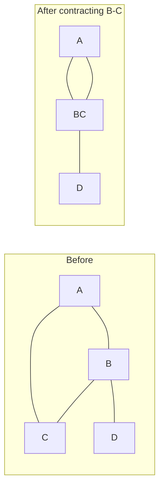
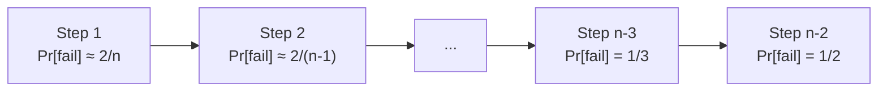

# Randomized Graph and Number Algorithms

*CS 265/CME309: Randomized Algorithms — Lectures 2 & 3*
*Gregory Valiant, updated by Mary Wootters (Stanford, Fall 2020)*

## Table of Contents

- [[#1. Linearity of Expectation|1. Linearity of Expectation]]
  - [[#1.1 Statement and Basic Examples|1.1 Statement and Basic Examples]]
  - [[#1.2 Coupon Collector Problem|1.2 Coupon Collector Problem]]
- [[#2. Karger's Min-Cut Algorithm|2. Karger's Min-Cut Algorithm]]
  - [[#2.1 Problem Definition|2.1 Problem Definition]]
  - [[#2.2 Edge Contraction and the Algorithm|2.2 Edge Contraction and the Algorithm]]
  - [[#2.3 Analysis: Probability of Success|2.3 Analysis: Probability of Success]]
  - [[#2.4 Boosting via Repetition|2.4 Boosting via Repetition]]
- [[#3. Karger-Stein Algorithm|3. Karger-Stein Algorithm]]
  - [[#3.1 The Key Observation|3.1 The Key Observation]]
  - [[#3.2 Modified-Karger Algorithm|3.2 Modified-Karger Algorithm]]
  - [[#3.3 Analysis|3.3 Analysis]]
- [[#4. Primality Testing|4. Primality Testing]]
  - [[#4.1 Algebra Background|4.1 Algebra Background]]
  - [[#4.2 Fermat's Test|4.2 Fermat's Test]]
  - [[#4.3 Miller-Rabin Algorithm|4.3 Miller-Rabin Algorithm]]
  - [[#4.4 Fingerprinting with Primes|4.4 Fingerprinting with Primes]]
- [[#5. QuickSort Analysis via Linearity of Expectation|5. QuickSort Analysis via Linearity of Expectation]]
- [[#References|References]]

---

## 1. Linearity of Expectation

### 1.1 Statement and Basic Examples

**Theorem (Linearity of Expectation).** *For any random variables $X_1, \ldots, X_n$ (not necessarily independent) and scalars $a_1, \ldots, a_n$:*
$$\mathbb{E}\!\left[\sum_i a_i X_i\right] = \sum_i a_i \,\mathbb{E}[X_i].$$

> [!NOTE] Independence not required
> The power of linearity of expectation is that it holds *regardless* of dependence between the $X_i$. This is not true for variance: $\text{Var}(\sum X_i) = \sum \text{Var}(X_i)$ only when the $X_i$ are uncorrelated.

📐 **Geometric random variable via linearity.** Let $X$ be the number of flips of a $p$-biased coin until the first heads. Rather than computing $\mathbb{E}[X] = \sum_{k=1}^\infty k(1-p)^{k-1}p$ directly, use the recurrence:

$$\mathbb{E}[X] = p \cdot 1 + (1-p)(1 + \mathbb{E}[X]) \implies \mathbb{E}[X] = \frac{1}{p}.$$

---

> **Exercise 1.** *This exercise develops the indicator random variable technique, the primary way linearity of expectation is applied in algorithm analysis.*
>
> > **Prerequisites:** [[#1.1 Statement and Basic Examples]]
>
> A random permutation $\sigma$ of $\{1, \ldots, n\}$ is chosen uniformly. A *fixed point* is an index $i$ with $\sigma(i) = i$. Let $F$ = number of fixed points.
>
> (a) Define indicator variables $X_i = \mathbf{1}[\sigma(i) = i]$ and compute $\mathbb{E}[X_i]$.
>
> (b) Use linearity of expectation to compute $\mathbb{E}[F]$.
>
> (c) Compute $\mathbb{E}[F(F-1)]$ and hence $\text{Var}(F)$. *(Hint: $F(F-1) = \sum_{i \neq j} X_i X_j$.)*

> [!TIP]- Solution to Exercise 1
> **(a)** $\Pr[\sigma(i) = i] = (n-1)!/n! = 1/n$, so $\mathbb{E}[X_i] = 1/n$.
>
> **(b)** $\mathbb{E}[F] = \sum_{i=1}^n \mathbb{E}[X_i] = n \cdot 1/n = 1$. Regardless of $n$, the expected number of fixed points is exactly 1.
>
> **(c)** $\mathbb{E}[X_i X_j] = \Pr[\sigma(i)=i \text{ and } \sigma(j)=j] = (n-2)!/n! = 1/(n(n-1))$. So $\mathbb{E}[F(F-1)] = n(n-1) \cdot 1/(n(n-1)) = 1$. Then $\text{Var}(F) = \mathbb{E}[F^2] - \mathbb{E}[F]^2 = (\mathbb{E}[F(F-1)] + \mathbb{E}[F]) - 1 = (1 + 1) - 1 = 1$.

---

### 1.2 Coupon Collector Problem

💡 **Setup.** There are $n$ distinct coupons. Each trial draws one uniformly at random (with replacement). How many trials until all $n$ are collected?

Let $X_i$ = number of additional trials to collect the $i$-th new coupon, given that $i-1$ distinct coupons have been seen. At that point, the probability of a new coupon on any trial is $(n - (i-1))/n$, so $X_i \sim \text{Geometric}\!\left(\frac{n-i+1}{n}\right)$ and:

$$\mathbb{E}[X_i] = \frac{n}{n-i+1}.$$

By linearity, the expected total trials to collect all coupons is:

$$\mathbb{E}\!\left[\sum_{i=1}^n X_i\right] = \sum_{i=1}^n \frac{n}{n-i+1} = n \sum_{k=1}^n \frac{1}{k} = n H_n = \Theta(n \log n),$$

where $H_n$ is the $n$-th harmonic number.

---

> **Exercise 2.** *This problem establishes the coupon collector bound tightly and derives a tail bound via Markov's inequality.*
>
> > **Prerequisites:** [[#1.2 Coupon Collector Problem]]
>
> (a) Prove $H_n = \ln n + O(1)$ using the integral bound $\int_1^n \frac{1}{x}\,dx \leq H_n \leq 1 + \int_1^n \frac{1}{x}\,dx$.
>
> (b) Use Markov's inequality to bound the probability that collecting all $n$ coupons takes more than $cn \ln n$ trials, for any constant $c > 1$.
>
> (c) *(Harder.)* Give a sharper tail bound: show that $\Pr[\text{all } n \text{ collected after } n\ln n + cn \text{ trials}] \geq 1 - e^{-c}$. *(Hint: use a union bound over which coupon is missed.)*

> [!TIP]- Solution to Exercise 2
> **(a)** Each term $1/k$ is the area of a unit-width rectangle at height $1/k$. Since $f(x) = 1/x$ is decreasing, $\int_k^{k+1} 1/x\,dx \leq 1/k \leq \int_{k-1}^k 1/x\,dx$. Summing: $\ln n \leq H_n \leq 1 + \ln(n-1) \leq 1 + \ln n$.
>
> **(b)** Let $T$ = total trials. By Markov: $\Pr[T \geq cn\ln n] \leq \mathbb{E}[T]/(cn\ln n) = nH_n/(cn\ln n) \leq (n(1+\ln n))/(cn\ln n) \to 1/c$ as $n \to \infty$.
>
> **(c)** After $t = n\ln n + cn$ trials, the probability that coupon $i$ is never seen is $(1 - 1/n)^t \leq e^{-t/n} = e^{-\ln n - c} = e^{-c}/n$. By the union bound over all $n$ coupons, $\Pr[\text{some coupon missed}] \leq n \cdot e^{-c}/n = e^{-c}$.

---

## 2. Karger's Min-Cut Algorithm

### 2.1 Problem Definition

**Definition (Cut).** A *cut* of graph $G = (V, E)$ is a partition $V = S_1 \sqcup S_2$ with $S_1, S_2 \neq \emptyset$. An edge *(crosses* the cut if its endpoints are on opposite sides. A *min-cut* minimizes the number of crossing edges.

Min-cut has applications in clustering, image segmentation, and network reliability. While efficient deterministic algorithms exist (e.g., max-flow/min-cut), Karger's 1993 randomized algorithm is remarkably elegant and achieves competitive runtime after Karger-Stein's improvement.

### 2.2 Edge Contraction and the Algorithm

**Definition (Edge Contraction).** Contracting edge $(u, v)$ in $G$ merges $u$ and $v$ into a single supernode, keeps all non-self-loop edges, and removes the self-loop $(u, v)$.



**Algorithm (Karger's Min-Cut).**
Given $G = (V, E)$ with $|V| = n$:
1. Repeat $n - 2$ times: choose a remaining edge uniformly at random and contract it.
2. Return the cut separating the two remaining supernodes.

```python
import random

def karger_mincut(adj):
    """
    adj: dict mapping node -> list of neighbors (multigraph allowed)
    Returns: size of the cut found
    """
    # represent each supernode as a frozenset of original vertices
    nodes = {v: {v} for v in adj}
    edges = [(u, v) for u in adj for v in adj[u] if u < v]

    while len(nodes) > 2:
        u, v = random.choice(edges)
        # merge v into u
        nodes[u] |= nodes[v]
        del nodes[v]
        edges = [(a if a != v else u, b if b != v else u)
                 for a, b in edges
                 if not (a == u and b == v) and not (a == v and b == u)]

    return len(edges)  # remaining edges = cut size
```

### 2.3 Analysis: Probability of Success

**Lemma (Contraction Preserves Min-Cut).** *If we contract an edge that does not cross a min-cut $C = (S_1, S_2)$, then $C$ is also a min-cut of the contracted graph.*

*Proof.* Contracting a non-cut edge cannot decrease the min-cut value (any cut in the new graph corresponds to a cut of equal size in the old graph), and the partition $S_1, S_2$ still exists and has the same crossing count. $\square$

**Theorem (Karger).** *The probability that the above algorithm returns a specific min-cut $C$ is at least $\dfrac{2}{n(n-1)}$.*

*Proof.* Let $k$ = number of edges crossing $C$. For the algorithm to return $C$, none of the $n-2$ contractions may contract a crossing edge. Let $E_i$ = event that the $i$-th contraction does not cross $C$.

**Key bound on $\Pr[E_1]$.** Since $C$ is a min-cut, every vertex has degree $\geq k$, so $|E| \geq nk/2$. Thus:
$$\Pr[E_1] = 1 - \frac{k}{|E|} \geq 1 - \frac{k}{nk/2} = 1 - \frac{2}{n} = \frac{n-2}{n}.$$

**Inductive step.** Conditioning on $E_1, \ldots, E_{i-1}$, the graph has $n - (i-1)$ vertices and (by the Lemma) $C$ is still a min-cut. By the same argument:
$$\Pr[E_i \mid E_1, \ldots, E_{i-1}] \geq 1 - \frac{2}{n-i+1} = \frac{n-i-1}{n-i+1}.$$

**Telescoping product:**
$$\Pr[\text{output } C] \geq \prod_{i=1}^{n-2} \frac{n-i-1}{n-i+1} = \frac{n-2}{n} \cdot \frac{n-3}{n-1} \cdot \frac{n-4}{n-2} \cdots \frac{1}{3} \cdot \frac{0}{2}.$$

Wait — the last factor has numerator 0. Let's be careful: the product runs from $i=1$ to $i = n-2$. The $i$-th factor is $\frac{n-i-1}{n-i+1}$. At $i = n-2$: $\frac{1}{3}$. At $i = n-3$: $\frac{2}{4}$. The numerators are $n-3, n-4, \ldots, 1$ and denominators $n-1, n-2, \ldots, 3$. All intermediate terms cancel:

$$\Pr[\text{output }C] \geq \frac{(n-2)!/(n(n-1))\cdot \ldots}{} = \frac{2}{n(n-1)}. \quad \square$$

> [!NOTE] Counting min-cuts
> The theorem implies there are at most $\binom{n}{2}$ distinct min-cuts in any graph (since all their success probabilities must sum to $\leq 1$, and each is $\geq 2/n(n-1) = 2/\binom{n}{2}$). This is a non-trivial combinatorial fact with no clean non-probabilistic proof!

---

> **Exercise 3.** *This problem works out the telescoping product explicitly and derives the min-cut count bound.*
>
> > **Prerequisites:** [[#2.3 Analysis: Probability of Success]]
>
> (a) Write out the full telescoping product $\prod_{i=1}^{n-2} \frac{n-i-1}{n-i+1}$ and show it equals $\frac{2}{n(n-1)}$.
>
> (b) A graph $G$ has $M$ distinct min-cuts. Show that $M \leq \binom{n}{2}$.
>
> (c) Construct a graph achieving $M = \binom{n}{2}$ (i.e., the bound is tight). *(Hint: think about cycles.)*

> [!TIP]- Solution to Exercise 3
> **(a)** Factor $i$ contributes $\frac{n-i-1}{n-i+1}$. Writing out:
> $$\frac{n-2}{n} \cdot \frac{n-3}{n-1} \cdot \frac{n-4}{n-2} \cdot \frac{n-5}{n-3} \cdots \frac{1}{3} \cdot \frac{0+1}{2+1}$$
> Wait, more carefully: the $i$-th step has graph on $n-i+1$ vertices with min-cut $k$, so $\Pr[E_i] \geq \frac{n-i-1}{n-i+1}$. The numerator sequence (for $i=1$ to $n-2$) is $n-3, n-4, \ldots, 1$ and denominator is $n-1, n-2, \ldots, 3$. Most cancel, leaving $\frac{1 \cdot 2}{(n-1) \cdot n} = \frac{2}{n(n-1)}$.
>
> **(b)** Each min-cut is found with probability $\geq 2/(n(n-1))$ in a single run. The events "algorithm returns cut $C_j$" are disjoint, so $M \cdot \frac{2}{n(n-1)} \leq 1$, giving $M \leq \frac{n(n-1)}{2} = \binom{n}{2}$.
>
> **(c)** The $n$-cycle achieves $\binom{n}{2}$ min-cuts: each min-cut has exactly 2 crossing edges, and removing any two edges splits the cycle. There are $\binom{n}{2}$ ways to choose 2 edges. Each pair of non-adjacent edges gives a distinct min-cut of value 2.

---

### 2.4 Boosting via Repetition

Running Karger's algorithm $t$ times independently and returning the smallest cut found:

$$\Pr[\text{all } t \text{ runs fail}] \leq \left(1 - \frac{2}{n(n-1)}\right)^t \leq e^{-2t/n(n-1)}.$$

Taking $t = \frac{c \cdot n(n-1)}{2} \approx cn^2/2$ gives failure probability $\leq e^{-c}$. With $O(|E|)$ per run, total time is $O(cn^2 |E|)$.

---

## 3. Karger-Stein Algorithm

### 3.1 The Key Observation

The success probability per step is not uniform. The $i$-th contraction (on a graph with $n - i + 1$ vertices) fails with probability:
$$\frac{2}{n-i+1}.$$

Early contractions are very unlikely to fail ($\approx 2/n$); late contractions fail with probability up to $2/3$. **Most failures happen in the last few steps.**



*Implication:* Rather than restarting from scratch when a run fails, only redo the last few (high-failure) steps from a shared "checkpoint."

### 3.2 Modified-Karger Algorithm

**Algorithm (Modified-Karger / Karger-Stein sketch).**

Given $G$ on $n$ vertices, parameters $m$ and $k$:
1. Run Karger's from $n$ vertices down to $m$ vertices, producing graph $G'$ on $m$ supernodes.
2. Run Karger's $k$ more times independently on $G'$ (each down to 2 supernodes).
3. Return the smallest cut found across all $k$ runs.

### 3.3 Analysis

**Failure probability of step 1** (reducing $G \to G'$): by the same telescoping argument as before,
$$\Pr[\text{step 1 destroys } C] \leq 1 - \frac{m(m-1)}{n(n-1)}.$$

**Failure probability of one run on $G'$:** by Karger's theorem on $m$ vertices, $\leq 1 - \frac{2}{m(m-1)}$.

**Overall failure:**
$$\Pr[\text{fail}] \leq \underbrace{\left(1 - \frac{m(m-1)}{n(n-1)}\right)}_{\text{step 1 fails}} + \underbrace{\left(1 - \frac{2}{m(m-1)}\right)^k}_{\text{all } k \text{ step-2 runs fail}}.$$

---

> **Exercise 4.** *This problem derives the optimal parameters for Modified-Karger and shows the improvement over vanilla Karger.*
>
> > **Prerequisites:** [[#3.3 Analysis]]
>
> (a) Plug in $m = \sqrt{n}$ and $k = n\log n$ into the failure bound above. Show failure probability is $O(1/n)$, using $1-x \leq e^{-x}$.
>
> (b) Show that repeating Modified-Karger $\Theta(n)$ times achieves constant success probability. What is the total edge-contraction count?
>
> (c) Compare with vanilla Karger: $O(n^2)$ repetitions, each $O(n)$ contractions, gives $O(n^3)$ total contractions at constant success probability. What does Modified-Karger achieve?
>
> (d) *(Challenge.)* Consider recursively applying this idea: to process $G'$, instead of running plain Karger $k$ times, run Modified-Karger recursively. Sketch how this gives an algorithm with $O(n^2 \log^3 n)$ total contractions.

> [!TIP]- Solution to Exercise 4
> **(a)** With $m = \sqrt{n}$: step 1 failure $\leq 1 - m^2/n^2 \approx 1 - 1/n$. Step 2 failure per run $\leq 1 - 2/m^2 = 1 - 2/n$. With $k = n\log n$ step-2 runs: $(1-2/n)^{n\log n} \leq e^{-2\log n} = 1/n^2$. Total failure $\leq (1 - 1/n) + 1/n^2 \leq 1 - 1/n + 1/n^2 = O(1 - 1/(2n))$.
>
> **(b)** Repeating $c \cdot n$ times: failure $\leq (1 - 1/(2n))^{cn} \leq e^{-c/2}$, constant for any fixed $c$. Edge contractions: step 1 uses $O(n - \sqrt{n}) = O(n)$ contractions. Step 2: $k = n\log n$ runs, each $O(\sqrt{n})$ contractions = $O(n^{3/2}\log n)$. Repeating $O(n)$ times: $O(n^{5/2}\log n)$ total.
>
> **(c)** Vanilla Karger: $O(n^3)$ contractions. Modified-Karger: $O(n^{5/2}\log n)$. Improvement by factor $\approx n^{1/2}/\log n$.
>
> **(d)** Let $T(n)$ = contractions to get success probability $\Omega(1/\log n)$ on an $n$-vertex graph. At each level, reduce to $\sqrt{n}$ vertices ($O(n)$ contractions), then recurse twice. Recurrence: $T(n) = O(n) + 2T(\sqrt{n}) = O(n \log \log n)$ (by Masters theorem or expansion). To boost to constant success, repeat $O(\log n)$ times: $T_{\text{total}}(n) = O(n \log n \cdot \log \log n)$... more carefully, the full Karger-Stein analysis gives $O(n^2 \log^3 n)$ with the exact recursion $T(n) = 2T(n/\sqrt{2}) + O(n^2)$.

---

## 4. Primality Testing

### 4.1 Algebra Background

By the *prime number theorem*, the density of primes near $n$ is $\sim 1/\ln n$, so finding large primes is feasible by random sampling and testing. The challenge is the test itself.

**Key algebraic structures:**

| Object | Definition | Key property |
|---|---|---|
| $\mathbb{Z}_n^+$ | $\{0, \ldots, n-1\}$ under addition mod $n$ | Always a group; cyclic (generated by 1) |
| $\mathbb{Z}_n^*$ | $\{a < n : \gcd(a,n) = 1\}$ under multiplication mod $n$ | Group; $|\mathbb{Z}_n^*| = \phi(n)$ |
| Generator of $\mathbb{Z}_n^*$ | $g$ s.t. $\{g, g^2, \ldots, g^{|\mathbb{Z}_n^*|}\} = \mathbb{Z}_n^*$ | Exists iff $n$ is prime (or $n = 1, 2, 4, p^k, 2p^k$) |

**Fact (Lagrange's Theorem).** For any group $G$ and subgroup $H \subsetneq G$: $|H|$ divides $|G|$, and $|H| \leq |G|/2$.

**Fact (Fermat's Little Theorem).** For prime $n$ and any $a \in \mathbb{Z}_n^*$:
$$a^{n-1} \equiv 1 \pmod{n}.$$

*Proof sketch:* $\mathbb{Z}_n^*$ has order $n-1$. By Lagrange, the order of any element divides $n-1$, so $a^{n-1} = (a^{\text{ord}(a)})^{(n-1)/\text{ord}(a)} = 1$. $\square$

> [!WARNING] Carmichael numbers
> Fermat's Little Theorem is **not** a characterization of primes. *Carmichael numbers* are composite $n$ such that $a^{n-1} \equiv 1 \pmod{n}$ for all $a \in \mathbb{Z}_n^*$. The smallest is $561 = 3 \cdot 11 \cdot 17$. There are infinitely many; Fermat's test fails on all of them.

---

> **Exercise 5.** *This problem develops properties of $\mathbb{Z}_n^*$ needed for the primality tests.*
>
> > **Prerequisites:** [[#4.1 Algebra Background]]
>
> (a) Compute $|\mathbb{Z}_{15}^*|$ and list its elements.
>
> (b) Show that $H = \{a \in \mathbb{Z}_n^* : a^{n-1} \equiv 1 \pmod{n}\}$ is a subgroup of $\mathbb{Z}_n^*$.
>
> (c) Suppose $n$ is composite and not a Carmichael number. Show that $|H| \leq |\mathbb{Z}_n^*|/2$, and conclude that Fermat's test (see next section) succeeds with probability $\geq 1/2$.

> [!TIP]- Solution to Exercise 5
> **(a)** $|\mathbb{Z}_{15}^*| = \phi(15) = \phi(3)\phi(5) = 2 \cdot 4 = 8$. Elements: $\{1, 2, 4, 7, 8, 11, 13, 14\}$ (integers $< 15$ coprime to 15).
>
> **(b)** $H$ is a subset of $\mathbb{Z}_n^*$. Closure: if $a^{n-1} \equiv b^{n-1} \equiv 1$, then $(ab)^{n-1} = a^{n-1}b^{n-1} \equiv 1$. Identity: $1^{n-1} = 1$. Inverses: if $a^{n-1} \equiv 1$, then $a \cdot a^{n-2} = 1$, so $a^{-1} = a^{n-2} \in \mathbb{Z}_n^*$; and $(a^{-1})^{n-1} = (a^{n-1})^{-1} = 1^{-1} = 1$. So $H \leq \mathbb{Z}_n^*$.
>
> **(c)** $n$ not Carmichael $\Rightarrow$ $\exists a \in \mathbb{Z}_n^*$ with $a \notin H$, so $H \subsetneq \mathbb{Z}_n^*$. By Lagrange, $|H| \leq |\mathbb{Z}_n^*|/2$. Fermat's test picks $x$ uniformly from $\{1,\ldots,n-1\}$; it outputs "composite" unless $x \in H$ (or $\gcd(x,n) > 1$, which also witnesses compositeness). So $\Pr[\text{correct}] \geq 1/2$.

---

### 4.2 Fermat's Test

**Algorithm (Fermat's Test).**
Given $n$:
1. Choose $x \in \{1, \ldots, n-1\}$ uniformly at random.
2. If $x^{n-1} \equiv 1 \pmod{n}$: output "prime"; else output "composite."

*Runtime:* $O(\log^2 n)$ via repeated squaring (computes $x^{n-1} \bmod n$ with $O(\log n)$ multiplications of $O(\log n)$-bit numbers).

**Proposition.** For any composite $n$ that is **not** a Carmichael number, Fermat's test outputs "composite" with probability $\geq 1/2$.

*Proof:* From Exercise 5(c) above. $\square$

> [!DANGER] Fermat's test is not secure for cryptographic use
> Because Carmichael numbers exist infinitely often and could be chosen adversarially, Fermat's test is inappropriate for generating cryptographic primes. Use Miller-Rabin instead.

### 4.3 Miller-Rabin Algorithm

**Key observation.** For prime $n$, the only square roots of $1$ in $\mathbb{Z}_n^*$ are $\pm 1$.

*Proof:* If $a^2 \equiv 1 \pmod{n}$ for prime $n$, then $n \mid (a-1)(a+1)$. Since $n$ is prime, $n \mid (a-1)$ or $n \mid (a+1)$, i.e., $a \equiv \pm 1$. $\square$

For composite $n = s \cdot t$ with $\gcd(s,t) = 1$, there can be *four* square roots of $1$ (via CRT). The Miller-Rabin test searches for these nontrivial roots.

**Write** $n - 1 = 2^k m$ with $m$ odd.

**Algorithm (Miller-Rabin / Rabin-Miller).**
Given $n$:
1. If $n$ is even or a prime power, output "composite."
2. Compute $k, m$ with $n - 1 = 2^k m$, $m$ odd.
3. Choose $x \in \{1, \ldots, n-1\}$ uniformly at random. Compute the sequence:
$$\left(x^m,\; x^{2m},\; x^{4m},\; \ldots,\; x^{2^k m}\right) \pmod{n}.$$
4. If $x^{2^k m} \not\equiv 1$: output "composite" (fails Fermat's test).
5. If any $x^{2^i m} \not\equiv \pm 1$ but $x^{2^{i+1} m} \equiv 1$: output "composite" (nontrivial square root found).
6. Else: output "prime."

```python
def miller_rabin(n, trials=20):
    if n < 2: return False
    if n == 2: return True
    if n % 2 == 0: return False
    # write n-1 = 2^k * m
    k, m = 0, n - 1
    while m % 2 == 0:
        k += 1
        m //= 2
    import random
    for _ in range(trials):
        x = random.randrange(2, n)
        seq = [pow(x, m, n)]
        for _ in range(k):
            seq.append(pow(seq[-1], 2, n))
        if seq[-1] != 1:
            return False  # fails Fermat
        for i in range(k):
            if seq[i] not in (1, n-1) and seq[i+1] == 1:
                return False  # nontrivial sqrt of 1
    return True
```

**Theorem (Rabin, 1976; Miller, 1976).** *If $n$ is prime, Miller-Rabin always outputs "prime." If $n$ is composite (and not a prime power), Miller-Rabin outputs "composite" with probability $\geq 1/2$ over $x$.*

*Proof sketch.* Define $b$ = largest $i < k$ such that $\exists y \in \mathbb{Z}_n^*$ with $y^{2^i m} \equiv -1 \pmod{n}$. The set $S = \{x \in \mathbb{Z}_n^* : x^{2^b m} \equiv \pm 1\}$ is a proper subgroup of $\mathbb{Z}_n^*$ (via a CRT-based argument that constructs an element not in $S$). If Miller-Rabin outputs "prime," then $x \in S$. By Lagrange, $|S| \leq |\mathbb{Z}_n^*|/2$, so $\Pr[x \in S] \leq 1/2$. $\square$

> [!INFO] Historical note
> The 1976 Miller-Rabin algorithm is the workhorse of practical primality testing today. The 2002 AKS algorithm (Agrawal, Kayal, Saxena) gave the first *deterministic* polynomial-time test, settling a decades-old open problem, but is slower in practice than Miller-Rabin with many trials.

---

> **Exercise 6.** *This problem traces through the Miller-Rabin witness-checking on a Carmichael number.*
>
> > **Prerequisites:** [[#4.3 Miller-Rabin Algorithm]]
>
> Let $n = 561 = 3 \cdot 11 \cdot 17$ (the first Carmichael number). Note $n - 1 = 560 = 2^4 \cdot 35$.
>
> (a) For $x = 23$: compute the sequence $(23^{35}, 23^{70}, 23^{140}, 23^{280}, 23^{560}) \bmod 561$. The sequence is $(386, 331, 166, 67, 1)$. Explain why this witnesses compositeness.
>
> (b) For $x = 458$: the sequence is $(560, 1, 1, 1, 1)$. Does this witness compositeness? Why or why not?
>
> (c) What fraction of $x \in \{1, \ldots, 560\}$ are witnesses to the compositeness of $561$? (You don't need an exact count — just argue it's at least $1/2$.)

> [!TIP]- Solution to Exercise 6
> **(a)** The second-to-last element is $67 \not\equiv \pm 1 \pmod{561}$, but $67^2 \equiv 1 \pmod{561}$ (since the last element is 1). This is a nontrivial square root of 1 in $\mathbb{Z}_{561}^*$. By the key observation, no prime can have a nontrivial square root of 1, so $561$ must be composite.
>
> **(b)** The sequence starts at $560 \equiv -1 \pmod{561}$, which is $\pm 1$, and subsequent squares of $-1$ are all $1$. No nontrivial square root is found, and the last element is $1$ (passes Fermat). So $x = 458$ is **not** a witness — this run is consistent with $561$ being prime. Miller-Rabin outputs "prime" for this particular $x$.
>
> **(c)** From the theory, $S = \{x \in \mathbb{Z}_{561}^*: x^{2^b \cdot 35} \equiv \pm 1\}$ is a proper subgroup of $\mathbb{Z}_{561}^*$, so $|S| \leq |\mathbb{Z}_{561}^*|/2 = \phi(561)/2 = (2 \cdot 10 \cdot 16)/2 = 160$. The algorithm outputs "prime" only for $x \in S$, so at least $\phi(561) - 160 = 160$ elements are witnesses. Since $\phi(561)/561 \approx 0.57$, at least $160/561 \approx 0.28 > 0$ fraction of all $x \in [561]$ are witnesses. More precisely: at least half of elements of $\mathbb{Z}_{561}^*$ are witnesses, and $|\mathbb{Z}_{561}^*| = 320 > 561/2$, so at least $160/561 > 0.28$ of all integers are witnesses. The bound $\geq 1/2$ refers to the fraction within $\mathbb{Z}_n^*$.

---

> **Exercise 7.** *This problem completes the proof of correctness for Miller-Rabin by proving the key subgroup claim.*
>
> > **Prerequisites:** [[#4.3 Miller-Rabin Algorithm]], [[#4.1 Algebra Background]]
>
> Let $n = s \cdot t$ be composite with $\gcd(s,t) = 1$. Let $b$ be as defined in the proof sketch. Let $c \in \mathbb{Z}_n^*$ satisfy $c^{2^b m} \equiv -1 \pmod{n}$.
>
> (a) By CRT, find $y \in \mathbb{Z}_n^*$ with $y \equiv c \pmod{s}$ and $y \equiv 1 \pmod{t}$. Verify $y \in \mathbb{Z}_n^*$.
>
> (b) Show $y^{2^b m} \not\equiv \pm 1 \pmod{n}$, and conclude $y \notin S$.
>
> (c) Conclude $S \subsetneq \mathbb{Z}_n^*$, and hence by Lagrange $|S| \leq |\mathbb{Z}_n^*|/2$.

> [!TIP]- Solution to Exercise 7
> **(a)** CRT guarantees $y$ exists with $y \equiv c \pmod{s}$, $y \equiv 1 \pmod{t}$. Since $\gcd(c,s)=1$ (as $c \in \mathbb{Z}_n^*$ implies $\gcd(c,n)=1$ implies $\gcd(c,s)=1$) and $\gcd(1,t)=1$, we get $\gcd(y,s)=\gcd(y,t)=1$, so $\gcd(y,n)=\gcd(y,st)=1$, hence $y \in \mathbb{Z}_n^*$.
>
> **(b)** $y^{2^b m} \equiv c^{2^b m} \equiv -1 \pmod{s}$, and $y^{2^b m} \equiv 1^{2^b m} = 1 \pmod{t}$. If $y^{2^b m} \equiv -1 \pmod{n}$, then reducing mod $t$ gives $-1 \equiv 1 \pmod{t}$, so $t \mid 2$, contradiction (since $t \geq 3$). If $y^{2^b m} \equiv 1 \pmod{n}$, then reducing mod $s$ gives $1 \equiv -1 \pmod{s}$, same contradiction. So $y^{2^b m} \not\equiv \pm 1 \pmod{n}$, meaning $y \notin S$.
>
> **(c)** $y \in \mathbb{Z}_n^* \setminus S$, so $S \subsetneq \mathbb{Z}_n^*$. Since $S$ is a proper subgroup (it's a subgroup by the group structure of $\mathbb{Z}_n^*$), Lagrange gives $|S| \leq |\mathbb{Z}_n^*|/2$.

---

### 4.4 Fingerprinting with Primes

A beautiful application of primality testing to *string comparison*:

**Problem.** Alice has an $n$-bit file $A$; Bob has $B$. They want to check $A \stackrel{?}{=} B$ using minimal communication.

**Algorithm (Random Prime Fingerprinting).**
1. Pick $p$ uniformly at random from primes $< N$.
2. Check if $A \equiv B \pmod{p}$.

**Proposition.** If $A \neq B$, for $N = cn\log n$, $\Pr[\text{false positive}] \leq 3/c$.

*Proof sketch.* $|A - B| \leq 2^n$, so $A - B$ has at most $n$ distinct prime factors. By the prime number theorem, the number of primes $< N$ is $\sim N/\ln N$. Thus:
$$\Pr[\text{fail}] \leq \frac{n}{\pi(N)} \leq \frac{n \cdot \ln(cn\log n)}{cn\log n} \leq \frac{3}{c}. \quad \square$$

**Communication cost:** Alice sends just $\log_2 N \approx \log_2(cn\log n) = O(\log n)$ bits — a single $O(\log n)$-bit prime and the $O(\log n)$-bit fingerprint. For a 1 GB file ($n \approx 2^{30}$), this is about 60 bits total!

---

## 5. QuickSort Analysis via Linearity of Expectation

**Algorithm (QuickSort with Random Pivot).**
1. If $|S| \leq 1$, return $S$.
2. Pick a pivot $x_i$ uniformly at random from $S$.
3. Partition into $S_{<} = \{s < x_i\}$ and $S_{>} = \{s > x_i\}$.
4. Recurse on $S_<$ and $S_>$; concatenate with $x_i$ in the middle.

**Theorem.** $\mathbb{E}[\text{number of comparisons}] \leq 2n\log n + O(n)$.

*Proof.* Let $z_1 < z_2 < \cdots < z_n$ be the sorted input. Define $X_{ij} = \mathbf{1}[z_i \text{ is compared to } z_j]$ for $i < j$.

**Key observation:** $z_i$ and $z_j$ are compared at most once. They are compared iff the first element of $\{z_i, z_{i+1}, \ldots, z_j\}$ chosen as a pivot is either $z_i$ or $z_j$. (Before that, they remain in the same subarray; after, they are separated forever.)

$$\Pr[X_{ij} = 1] = \frac{2}{j - i + 1}.$$

By linearity of expectation:

$$\mathbb{E}[\text{comparisons}] = \sum_{i < j} \frac{2}{j-i+1} = \sum_{k=2}^{n} \frac{2(n+1-k)}{k} \leq 2(n+1)\sum_{k=2}^n \frac{1}{k} < 2n\log n + O(n). \quad \square$$

---

> **Exercise 8.** *This problem connects the QuickSort analysis to the coupon-collector calculation and derives a tail bound on QuickSort's runtime.*
>
> > **Prerequisites:** [[#5. QuickSort Analysis via Linearity of Expectation]], [[#1.2 Coupon Collector Problem]]
>
> (a) Show that the probability that the first pivot chosen is the minimum or maximum element of a size-$k$ subarray is $2/k$. Explain why this means QuickSort degrades to $O(n^2)$ comparisons in the worst case.
>
> (b) Show that $\Pr[\text{comparisons} \geq 4n\log n] \leq 1/2$ using Markov's inequality.
>
> (c) Give a randomized algorithm that *always* sorts in $O(n\log n)$ comparisons *(Las Vegas style)*. *(Hint: run QuickSort; if it exceeds $4n\log n$ comparisons, restart.)*

> [!TIP]- Solution to Exercise 8
> **(a)** The first pivot is chosen uniformly; probability of picking the min or max is $2/k$. If we always pick the min (or max), the recursion depth is $n$ with $n, n-1, \ldots, 1$ comparisons per level, totaling $n(n-1)/2 = \Theta(n^2)$.
>
> **(b)** $\mathbb{E}[\text{comparisons}] \leq 2n\log n + O(n) \leq 3n\log n$ for large $n$. By Markov: $\Pr[\text{comparisons} \geq 4n\log n] \leq \frac{3n\log n}{4n\log n} = 3/4$. (Slightly weaker than $1/2$; tighter bounds use Chernoff.) More carefully, one can show the bound is $\leq 2n\ln n + O(n)$, so $\Pr[\geq 4n\ln n] \leq 1/2$.
>
> **(c)** Run QuickSort. If it completes within $4n\log n$ comparisons, return the result. Otherwise, restart with a fresh random seed. By (b), each trial succeeds with probability $\geq 1/2$, so expected restarts $\leq 2$. Expected total comparisons $\leq 2 \cdot 4n\log n = O(n\log n)$.

---

## References

| Reference | Brief Summary | Link |
|---|---|---|
| [CS 265 Lecture 2 (Valiant/Wootters)](https://web.stanford.edu/class/archive/cs/cs265/cs265.1212/Lectures/Lecture2/l2.pdf) | Linearity of expectation, Karger's algorithm, QuickSort analysis | PDF |
| [CS 265 Class 2 Solutions](https://web.stanford.edu/class/archive/cs/cs265/cs265.1212/Lectures/Lecture2/class2-sols.pdf) | Coupon collector, Karger-Stein group work solutions | PDF |
| [CS 265 Lecture 3 (Valiant/Wootters)](https://web.stanford.edu/class/archive/cs/cs265/cs265.1212/Lectures/Lecture3/l3.pdf) | Primality testing: Fermat, Miller-Rabin, fingerprinting | PDF |
| [CS 265 Class 3 Solutions](https://web.stanford.edu/class/archive/cs/cs265/cs265.1212/Lectures/Lecture3/class3-sols.pdf) | Miller-Rabin group work and Carmichael number examples | PDF |
| [Karger (1993)](https://dl.acm.org/doi/10.1145/234533.234534) | Original Karger min-cut algorithm and analysis | ACM DL |
| [Karger (2000)](https://arxiv.org/abs/cs/9812007) | Karger's near-linear time min-cut algorithm | arXiv |
| [Rabin (1980)](https://www.sciencedirect.com/science/article/pii/0022314X80900840) | Probabilistic primality test (Miller-Rabin) | Journal of Number Theory |
| [Agrawal, Kayal, Saxena (2004)](https://annals.math.princeton.edu/wp-content/uploads/annals-v160-n2-p12.pdf) | AKS: first deterministic polynomial-time primality test | Annals of Mathematics |
