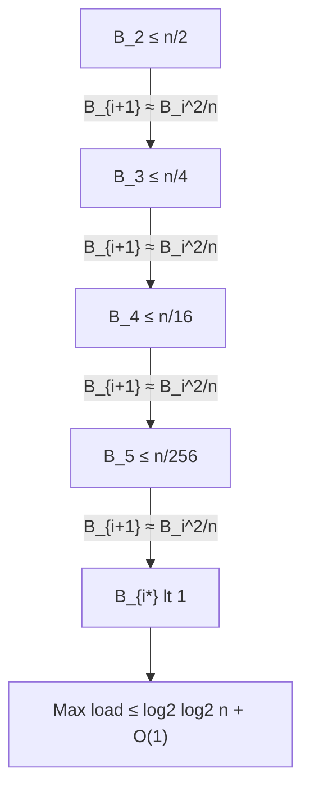

# Hashing and Load Balancing

*CS 265/CME309: Randomized Algorithms — Lecture 6*
*Gregory Valiant, updated by Mary Wootters (Stanford, Fall 2020)*

## Table of Contents

- [[#1. The Balls-in-Bins Model|1. The Balls-in-Bins Model]]
  - [[#1.1 Setup and Basic Probabilities|1.1 Setup and Basic Probabilities]]
  - [[#1.2 The Birthday Paradox|1.2 The Birthday Paradox]]
  - [[#1.3 Coupon Collector as Balls-in-Bins|1.3 Coupon Collector as Balls-in-Bins]]
- [[#2. Maximum Bin Load|2. Maximum Bin Load]]
  - [[#2.1 Upper Bound|2.1 Upper Bound]]
  - [[#2.2 Lower Bound|2.2 Lower Bound]]
- [[#3. Poisson Distribution and Poissonization|3. Poisson Distribution and Poissonization]]
  - [[#3.1 The Poisson Distribution|3.1 The Poisson Distribution]]
  - [[#3.2 The Poissonization Theorem|3.2 The Poissonization Theorem]]
  - [[#3.3 Application: Coupon Collector Exact Limit|3.3 Application: Coupon Collector Exact Limit]]
  - [[#3.4 Lower Bound via Poissonization|3.4 Lower Bound via Poissonization]]
- [[#4. The Power of Two Choices|4. The Power of Two Choices]]
  - [[#4.1 Setup and Theorem|4.1 Setup and Theorem]]
  - [[#4.2 Proof via Load-Level Recursion|4.2 Proof via Load-Level Recursion]]
  - [[#4.3 Stochastic Dominance and Formal Justification|4.3 Stochastic Dominance and Formal Justification]]
  - [[#4.4 Extension to d Choices|4.4 Extension to d Choices]]
- [[#5. Exercises|5. Exercises]]
- [[#References|References]]

---

## 1. The Balls-in-Bins Model 🎲

### 1.1 Setup and Basic Probabilities

The *balls-in-bins* model is one of the most versatile abstractions in the analysis of randomized algorithms. It captures hashing, load balancing, coupon collecting, and birthday-style coincidences within a single probabilistic framework.

**Setup.** Toss $n$ balls independently and uniformly at random into $m$ bins. Each ball lands in bin $j$ with probability $1/m$, independently of all other balls.

The central questions are:
1. **Collision:** When do two balls first land in the same bin?
2. **Coverage:** When has every bin received at least one ball?
3. **Load:** What is the maximum number of balls in any single bin?

> [!INFO] Connection to Hashing
> In a hash table with $m$ slots and $n$ keys, each key is mapped to a slot uniformly at random (under ideal hashing). "Collisions" are exactly the event that two keys map to the same slot. The maximum bin load is the worst-case chain length in separate-chaining hashing.

---

### 1.2 The Birthday Paradox

The *birthday paradox* asks: how large must $n$ be before the probability of at least one collision exceeds $1/2$?

**Proposition 1 (Birthday Threshold).** When $n$ balls are tossed into $m$ bins, the probability that all $n$ balls land in distinct bins is

$$\Pr[\text{no collision}] = \prod_{i=0}^{n-1}\left(1 - \frac{i}{m}\right).$$

Using $1 - x \leq e^{-x}$,

$$\Pr[\text{no collision}] \leq \exp\!\left(-\sum_{i=0}^{n-1}\frac{i}{m}\right) = \exp\!\left(-\frac{n(n-1)}{2m}\right).$$

This is $\leq 1/2$ once $n(n-1) \geq 2m\ln 2$, i.e., **$n \approx \sqrt{2m\ln 2} \approx 1.177\sqrt{m}$.**

**Key conclusion: $n = \Theta(\sqrt{m})$ is the collision threshold.**

For the standard birthday problem, $m = 365$ gives $n \approx 23$, which famously surprises most people.

> [!NOTE] Lower Bound on Collision Probability
> By inclusion-exclusion (or direct computation), one can show a matching lower bound: for $n \leq m$, $\Pr[\text{collision}] \geq 1 - e^{-n(n-1)/(2m)}$. So $n = c\sqrt{m}$ gives $\Pr[\text{collision}] \to 1 - e^{-c^2/2}$ as $m \to \infty$, and this probability exceeds $1/2$ for $c > \sqrt{2\ln 2}$.

---

*Exercise 1 is placed in [[#5. Exercises|Section 5]].*

### 1.3 Coupon Collector as Balls-in-Bins

The *coupon collector problem* asks: how many balls must be tossed into $m$ bins so that every bin is non-empty in expectation?

When $j$ distinct bins are already occupied, each new ball hits a new bin with probability $(m-j)/m$. The number of additional balls needed is geometrically distributed with mean $m/(m-j)$. Summing over $j = 0, 1, \ldots, m-1$,

$$\mathbb{E}[\text{balls to fill all bins}] = \sum_{j=0}^{m-1}\frac{m}{m-j} = m\sum_{k=1}^{m}\frac{1}{k} = m H_m \approx m\ln m.$$

So the expected number of balls needed to cover all $m$ bins is $m \ln m$. An exact distributional characterization — not just the expectation — is established in [[#3.3 Application: Coupon Collector Exact Limit|Section 3.3]] via Poissonization.

> [!EXAMPLE] Coupon Collector for m = 10
> With 10 bins, the expected coverage time is $10 H_{10} = 10(1 + 1/2 + \cdots + 1/10) \approx 29.3$ balls. The last few bins are hardest: the 10th bin has expected waiting time 10.

---

## 2. Maximum Bin Load 📊

### 2.1 Upper Bound

The most practically important question in load balancing is: how overloaded can any single bin become?

**Proposition 2 (Max Load Upper Bound).** When $n$ balls are tossed into $n$ bins, the maximum bin load satisfies

$$\Pr\!\left[\max_j \text{load}(j) \geq \frac{c\ln n}{\ln\ln n}\right] \leq \frac{1}{n^{c-1}}$$

for any constant $c > 1$, with high probability (i.e., probability $1 - o(1)$ for $c > 2$).

**Proof.** Set $k = \lceil c\ln n / \ln\ln n \rceil$. The probability that bin 1 receives at least $k$ balls is

$$\Pr[\text{load}(1) \geq k] = \sum_{j=k}^{n}\binom{n}{j}\left(\frac{1}{n}\right)^j\left(1-\frac{1}{n}\right)^{n-j} \leq \sum_{j=k}^{n}\frac{n^j}{j!}\cdot\frac{1}{n^j} = \sum_{j=k}^{\infty}\frac{1}{j!}.$$

Since $\sum_{j=k}^{\infty} 1/j! \leq 2/k!$ for large $k$, we have

$$\Pr[\text{load}(1) \geq k] \leq \frac{2}{k!}.$$

Now bound $k!$ from below using *Stirling's inequality* $k! \geq (k/e)^k$:

$$\frac{1}{k!} \leq \left(\frac{e}{k}\right)^k.$$

Substituting $k = c\ln n / \ln\ln n$:

$$\frac{e}{k} = \frac{e\ln\ln n}{c\ln n},$$

so

$$\left(\frac{e}{k}\right)^k = \left(\frac{e\ln\ln n}{c\ln n}\right)^{c\ln n/\ln\ln n}.$$

Taking the logarithm:

$$k\ln(e/k) = \frac{c\ln n}{\ln\ln n}\left(1 + \ln\ln\ln n - \ln c - \ln\ln n\right) = \frac{c\ln n}{\ln\ln n}\left(-\ln\ln n + O(\ln\ln\ln n)\right).$$

$$= -c\ln n + O\!\left(\frac{\ln n \cdot \ln\ln\ln n}{\ln\ln n}\right) = -c\ln n + o(\ln n) = -(c - o(1))\ln n.$$

Therefore $1/k! \leq n^{-(c-o(1))}$, so

$$\Pr[\text{load}(1) \geq k] \leq n^{-(c-o(1))}.$$

By the *union bound* over all $n$ bins,

$$\Pr\!\left[\max_j \text{load}(j) \geq k\right] \leq n \cdot n^{-(c-o(1))} = n^{-(c-1-o(1))}.$$

**For $c > 2$, this probability is $o(1)$, so the maximum load is at most $c\ln n/\ln\ln n$ with high probability.** $\square$

> [!WARNING] The Bound is Tight
> This upper bound is essentially tight: the lower bound (Proposition 5, proved via Poissonization) shows the max load is also $\Omega(\ln n/\ln\ln n)$ with high probability. The $\ln n/\ln\ln n$ behavior is a fundamental feature of uniform hashing, not an artifact of the proof.

---

### 2.2 Lower Bound

**Proposition 5 (Max Load Lower Bound).** When $n$ balls are tossed into $n$ bins, there exists a constant $c > 0$ such that

$$\Pr\!\left[\max_j \text{load}(j) \geq \frac{c\ln n}{\ln\ln n}\right] \geq 1 - o(1).$$

The proof uses Poissonization to make the bin loads independent, enabling a second-moment argument. The details appear in [[#3.4 Lower Bound via Poissonization|Section 3.4]] after we develop the necessary machinery.

---

## 3. Poisson Distribution and Poissonization ⚗️

### 3.1 The Poisson Distribution

**Definition (Poisson Distribution).** A random variable $X$ is *Poisson with parameter $\lambda$*, written $X \sim \text{Poi}(\lambda)$, if

$$\Pr[X = k] = e^{-\lambda}\frac{\lambda^k}{k!}, \quad k = 0, 1, 2, \ldots$$

Direct computation gives $\mathbb{E}[X] = \lambda$ and $\text{Var}(X) = \lambda$.

> [!NOTE] Poisson as a Limit of Binomials
> An equivalent characterization: $X \sim \text{Poi}(\lambda)$ is the weak limit of $\text{Bin}(n, \lambda/n)$ as $n \to \infty$. This follows from $\binom{n}{k}(\lambda/n)^k(1-\lambda/n)^{n-k} \to e^{-\lambda}\lambda^k/k!$ for each fixed $k$. The Poisson distribution thus models rare events in large populations.

**Key properties:**
1. **Additivity.** If $X_1 \sim \text{Poi}(\lambda_1)$ and $X_2 \sim \text{Poi}(\lambda_2)$ are independent, then $X_1 + X_2 \sim \text{Poi}(\lambda_1 + \lambda_2)$.
2. **Tail bound.** For $X \sim \text{Poi}(\lambda)$ and any $c > 0$,
$$\Pr[|X - \lambda| \geq c] \leq 2\exp\!\left(-\frac{c^2}{2(c+\lambda)}\right).$$
3. **MGF.** $\mathbb{E}[e^{tX}] = e^{\lambda(e^t - 1)}$ for all $t \in \mathbb{R}$.

> [!EXAMPLE] Poisson MGF Derivation
> $$\mathbb{E}[e^{tX}] = \sum_{k=0}^{\infty}e^{tk}\cdot e^{-\lambda}\frac{\lambda^k}{k!} = e^{-\lambda}\sum_{k=0}^{\infty}\frac{(\lambda e^t)^k}{k!} = e^{-\lambda}\cdot e^{\lambda e^t} = e^{\lambda(e^t-1)}.$$
> This MGF is used to derive Chernoff-style tail bounds for Poisson random variables.

---

### 3.2 The Poissonization Theorem

The central technical tool of this lecture is *Poissonization*: by randomizing the number of balls, we gain independence between bin loads — a property that fails dramatically in the fixed-$n$ model.

**Theorem 1 (Poissonization).** Suppose the number of balls $K \sim \text{Poi}(n)$ and each ball is placed independently and uniformly into one of $m$ bins. Let $L_j$ denote the load in bin $j$. Then:

1. Each $L_j \sim \text{Poi}(n/m)$.
2. The loads $L_1, L_2, \ldots, L_m$ are **mutually independent**.

**Proof.** Let $B_j$ be the number of balls in bin $j$, and let $\mathbf{B} = (B_1, \ldots, B_m)$. We compute the joint PMF.

Fix counts $(k_1, k_2, \ldots, k_m)$ with $k_1 + \cdots + k_m = N$ for some $N \geq 0$. Conditioning on $K = N$:

$$\Pr[B_1 = k_1, \ldots, B_m = k_m \mid K = N] = \frac{N!}{k_1!\cdots k_m!}\cdot\frac{1}{m^N}.$$

The unconditional joint PMF is

$$\Pr[B_1 = k_1, \ldots, B_m = k_m] = \sum_{N=0}^{\infty}\Pr[K = N]\cdot \mathbf{1}\!\left[\sum_j k_j = N\right]\cdot\frac{N!}{k_1!\cdots k_m!}\cdot\frac{1}{m^N}.$$

Since the indicator forces $N = \sum_j k_j$, setting $N = k_1 + \cdots + k_m$:

$$= e^{-n}\frac{n^N}{N!}\cdot\frac{N!}{k_1!\cdots k_m!}\cdot\frac{1}{m^N} = e^{-n}\prod_{j=1}^{m}\frac{(n/m)^{k_j}}{k_j!}.$$

Recognizing $e^{-n} = e^{-n/m \cdot m} = \prod_{j=1}^{m}e^{-n/m}$:

$$\Pr[B_1 = k_1, \ldots, B_m = k_m] = \prod_{j=1}^{m}\left(e^{-n/m}\frac{(n/m)^{k_j}}{k_j!}\right).$$

This is the product of $m$ independent $\text{Poi}(n/m)$ PMFs, completing the proof. $\square$

> [!INFO] Why Independence is the Key Gift
> In the fixed-$n$ model, the loads $(B_1, \ldots, B_m)$ are *negatively correlated*: if one bin has many balls, others must have fewer. This dependence makes union bounds and second-moment arguments delicate. Poissonization breaks this coupling exactly, at the cost of introducing randomness in $n$ itself — which is then removed by a *de-Poissonization* argument.

> [!WARNING] De-Poissonization
> Results proved under $K \sim \text{Poi}(n)$ typically transfer to the fixed-$n$ model via a *continuity argument*: the Poisson variable $K$ concentrates near $n$ (with standard deviation $\sqrt{n}$), so events with high probability under Poisson remain likely under fixed $n$, up to lower-order adjustments. This is made precise in the Coupon Collector exact limit below.

---

*Exercise 3 is placed in [[#5. Exercises|Section 5]].*

### 3.3 Application: Coupon Collector Exact Limit

Poissonization yields a strikingly precise distributional result for the Coupon Collector problem.

**Proposition 4 (Coupon Collector Limit).** Let $T$ be the number of balls needed to cover all $n$ bins. For any constant $c \in \mathbb{R}$,

$$\Pr[T \geq n\ln n + cn] \xrightarrow{n\to\infty} 1 - e^{-e^{-c}}.$$

**Proof (via Poissonization).** Work in the Poisson model with $K \sim \text{Poi}(n\ln n + cn)$ balls. By Theorem 1, each bin load is $\text{Poi}(\ln n + c)$, independently. The probability that any fixed bin is empty is

$$\Pr[L_j = 0] = e^{-(\ln n + c)} = \frac{e^{-c}}{n}.$$

Let $Z$ = number of empty bins. Since the $L_j$ are independent,

$$Z = \sum_{j=1}^{n}\mathbf{1}[L_j = 0]$$

and these indicators are independent. Thus $Z \sim \text{Bin}(n, e^{-c}/n)$, which converges in distribution to $\text{Poi}(e^{-c})$ as $n \to \infty$.

Coverage fails if and only if $Z \geq 1$:

$$\Pr[\text{some bin empty}] = \Pr[Z \geq 1] \to 1 - \Pr[\text{Poi}(e^{-c}) = 0] = 1 - e^{-e^{-c}}.$$

To transfer back from the Poisson model ($K$ random) to the fixed-$n\ln n + cn$ model: since $K$ concentrates within $O(\sqrt{n\ln n})$ of its mean, and $T$ is monotone in the number of balls, a coupling argument shows $\Pr[T \geq n\ln n + cn]$ differs from the Poisson quantity by $o(1)$. $\square$

> [!NOTE] Interpretation
> Setting $c \to -\infty$ gives $\Pr[T \geq n\ln n + cn] \to 1$: with $o(n\ln n)$ balls, coverage fails whp. Setting $c \to +\infty$ gives probability $\to 0$: with $n\ln n + \omega(n)$ balls, coverage succeeds whp. The window of uncertainty has width $O(n)$ around $n\ln n$.

---

### 3.4 Lower Bound via Poissonization

**Proof of Proposition 5.** Set $k = \lfloor (1/2)\ln n / \ln\ln n \rfloor$ and use the Poisson model with $K \sim \text{Poi}(n)$. By Theorem 1, each bin load $L_j \sim \text{Poi}(1)$ independently.

The probability that a single bin has load at least $k$ is

$$\Pr[L_j \geq k] = \sum_{\ell=k}^{\infty}e^{-1}\frac{1}{\ell!} \geq e^{-1}\frac{1}{k!}.$$

By Stirling, $1/k! \geq (e/k)^k / \sqrt{2\pi k}$, so

$$\Pr[L_j \geq k] \geq \frac{1}{e}\cdot\frac{1}{\sqrt{2\pi k}}\left(\frac{e}{k}\right)^k.$$

Taking logs: $k\ln(e/k) = k(1-\ln k)$. With $k = \ln n / (2\ln\ln n)$:

$$k\ln k = \frac{\ln n}{2\ln\ln n}\cdot\ln\!\left(\frac{\ln n}{2\ln\ln n}\right) = \frac{\ln n}{2\ln\ln n}\cdot(\ln\ln n - O(\ln\ln\ln n)) = \frac{\ln n}{2} - o(\ln n).$$

Therefore $k(1-\ln k) = k - k\ln k \leq \ln n/(2\ln\ln n) - \ln n/2 + o(\ln n) = -\ln n/2 + o(\ln n)$, giving

$$\Pr[L_j \geq k] \geq n^{-1/2 + o(1)}.$$

Since the loads are independent (Theorem 1), the expected number of bins with load $\geq k$ is

$$\mathbb{E}\!\left[\sum_j \mathbf{1}[L_j \geq k]\right] = n \cdot \Pr[L_1 \geq k] \geq n^{1/2 + o(1)} \to \infty.$$

By a second-moment argument (or the Lovász Local Lemma), the max load is at least $k = \Omega(\ln n / \ln\ln n)$ with high probability. De-Poissonizing completes the proof. $\square$

**Key conclusion: The max load when $n$ balls are thrown into $n$ bins is $\Theta(\ln n / \ln\ln n)$ with high probability.**

---

## 4. The Power of Two Choices ⚡

### 4.1 Setup and Theorem

Uniform hashing gives max load $\Theta(\ln n / \ln\ln n)$. Can we do dramatically better with a tiny amount of coordination?

**The protocol:** Each ball independently and uniformly samples *two* bins. It is placed in the less full of the two (breaking ties arbitrarily).

**Theorem 2 (Power of Two Choices).** When $n$ balls are placed using the two-choice protocol into $n$ bins, the maximum bin load is at most $\log_2 \log_2 n + O(1)$ with high probability.

This is an exponential improvement over the $\Theta(\log n / \log\log n)$ bound for uniform hashing — all from one additional random sample per ball.

> [!INFO] Why This Matters
> In load balancing for server farms or distributed hash tables, this protocol requires only two probes per request and reduces the worst-case server load from logarithmic to doubly-logarithmic. The improvement is sometimes called the *supermarket model* (each customer joins the shorter of two queues).

---

### 4.2 Proof via Load-Level Recursion

**Proof of Theorem 2.** Define $B_i$ = number of bins with load *at least* $i$ after all $n$ balls have been placed. We track these *load-level counts* and show they decay doubly exponentially.

**Base case.** Trivially, $B_1 \leq n$ (at most $n$ bins have load $\geq 1$). We claim $B_2 \leq n/2$ with high probability.

Each ball is placed in a bin with load $\geq 2$ only if *both* sampled bins already have load $\geq 1$. Since $B_1 \leq n$, the probability that a single ball increases the load of an already-loaded bin is at most $(B_1/n)^2 \leq 1$. But in fact, for $B_2$ to be large, many balls must both land in bins already having $\geq 1$ ball. A careful analysis using linearity of expectation gives $\mathbb{E}[B_2] \leq n/2$, and concentration then gives $B_2 \leq n/2$ whp.

**Inductive step.** Suppose $B_i \leq n / \beta^{2^{i-2}}$ for some base $\beta > 0$ to be determined. A ball contributes to $B_{i+1}$ — i.e., becomes the $(i+1)$-th ball in some bin — only if *both* sampled bins already have load $\geq i$. The probability of this event for a given ball is at most

$$\left(\frac{B_i}{n}\right)^2 \leq \frac{1}{\beta^{2^{i-1}}}.$$

By linearity of expectation, the expected number of balls placed into bins of load $\geq i+1$ is

$$\mathbb{E}[B_{i+1}] \leq n \cdot \left(\frac{B_i}{n}\right)^2 = \frac{B_i^2}{n}.$$

This gives the recursion

$$B_{i+1} \approx \frac{B_i^2}{n}.$$

**Solving the recursion.** Write $B_i = n / f_i$. Then:

$$\frac{n}{f_{i+1}} \approx \frac{(n/f_i)^2}{n} = \frac{n}{f_i^2} \implies f_{i+1} \approx f_i^2.$$

Starting from $f_2 = 2$ (i.e., $B_2 \leq n/2$):

| Level $i$ | $f_i$ | $B_i$ bound |
|-----------|--------|-------------|
| 2 | $2$ | $n/2$ |
| 3 | $4$ | $n/4$ |
| 4 | $16$ | $n/16$ |
| 5 | $256$ | $n/256$ |
| $i$ | $2^{2^{i-2}}$ | $n/2^{2^{i-2}}$ |

The maximum load is reached at the first $i^*$ for which $B_{i^*} < 1$, i.e., $2^{2^{i^*-2}} > n$:

$$2^{i^*-2} > \log_2 n \implies i^* > 2 + \log_2\log_2 n.$$

**Therefore the maximum load is at most $\log_2\log_2 n + O(1)$ with high probability.** $\square$

> [!WARNING] Dependency Issue
> The key step $B_{i+1} \approx B_i^2/n$ treats the events "both samples land in bins of load $\geq i$" as independent across balls. This is not literally true — the loads depend on all previous placements. The formal argument uses a *stochastic dominance* lemma (Lemma 6) described in the next section.

The recursion is illustrated by the following diagram:

---

### 4.3 Stochastic Dominance and Formal Justification

To make the above argument rigorous, we need to handle the dependency between ball placements.

**Lemma 6 (Stochastic Dominance).** Let $X_1, \ldots, X_n$ be Bernoulli random variables (not necessarily independent) where $X_j = 1$ if the $j$-th ball lands in a bin of load $\geq i+1$. Suppose that for each $j$ and any history of the first $j-1$ placements,

$$\Pr[X_j = 1 \mid X_1, \ldots, X_{j-1}] \leq p.$$

Then $B_{i+1} = \sum_j X_j$ is stochastically dominated by $\text{Bin}(n, p)$.

*In other words, even though the $X_j$ are dependent, an upper bound $p$ on each conditional probability suffices to apply Chernoff bounds.*

**Applying the lemma.** Given the history of placements, if currently $B_i$ bins have load $\geq i$, then the probability the next ball increases some bin's load from $i$ to $i+1$ is at most $(B_i/n)^2$. As long as $B_i \leq n/\beta^{2^{i-2}}$ (an event we condition on), Lemma 6 allows us to bound $B_{i+1}$ by a binomial, and then apply Chernoff to show $B_{i+1}$ is concentrated near its expectation $n \cdot (B_i/n)^2 = B_i^2/n$.

A union bound over all $O(\log\log n)$ levels completes the proof.

> [!NOTE] The Formal Argument
> The rigorous proof proceeds by induction: at each level $i$, we condition on the event $\mathcal{E}_i = \{B_i \leq n/2^{2^{i-2}}\}$ and show $\Pr[\mathcal{E}_{i+1}^c \mid \mathcal{E}_i]$ is polynomially small. The union bound over levels then bounds $\Pr[\exists i: \mathcal{E}_i^c]$ by $O(\log\log n / n^c) = o(1)$.

---

### 4.4 Extension to d Choices

The two-choice result generalizes naturally.

**Theorem 3 (d Choices).** When each ball samples $d \geq 2$ bins uniformly at random and is placed in the least-loaded bin, the maximum load satisfies

$$\max_j \text{load}(j) \leq \frac{\ln\ln n}{\ln d} + O(1)$$

with high probability.

**Proof sketch.** The load-level recursion becomes $B_{i+1} \approx B_i^d / n^{d-1}$. Writing $B_i = n/f_i$ gives $f_{i+1} \approx f_i^d$, so $f_i \approx d^{d^{i-2}}$ (a tower with base $d$). The max level $i^*$ satisfies $d^{d^{i^*-2}} \approx n$, giving $d^{i^*-2} \approx \log_d n$, so $i^* \approx 2 + \log_d \log_d n = \ln\ln n / \ln d + O(1)$. $\square$

**Key conclusion: Each additional choice reduces the exponent of the iterated logarithm by a factor of $\ln d$. Even $d = 2$ gives a superexponential speedup over $d = 1$ (uniform hashing).**

> [!QUESTION] Optimal d?
> For practical purposes, $d = 2$ captures almost all the benefit. Increasing $d$ further reduces the max load by only a constant factor (from $\log_2\log_2 n$ to $\log_d\log_d n$), while increasing the cost of each placement linearly in $d$. The "sweet spot" depends on the cost model.

---

## 5. Exercises 📝

**Exercise 1.**

*This exercise develops the birthday paradox threshold more precisely by computing the exact crossover point.*

Show that $\Pr[\text{collision after } n \text{ tosses into } m \text{ bins}] \geq 1/2$ if and only if $n \geq n^*$ where $n^* \sim \sqrt{2m\ln 2}$ as $m \to \infty$. Specifically:

(a) Show $\Pr[\text{no collision}] = \prod_{i=0}^{n-1}(1-i/m)$.

(b) Using $\ln(1-x) \geq -x - x^2$ for $x \in [0,1/2]$, derive a matching lower bound showing $\Pr[\text{no collision}] \geq \exp(-n(n-1)/(2m) - n^2/(2m^2) \cdot n)$ for appropriate range of $n$.

(c) Conclude that the threshold $n^*$ satisfies $n^* = \sqrt{2m\ln 2}(1 + O(m^{-1/2}))$.

> **Prerequisites:** [[#1.2 The Birthday Paradox|Section 1.2 (Birthday Paradox)]]

> [!TIP]- Solution to Exercise 1
> **Key insight:** The upper and lower bounds on $\ln(1-x)$ bracket $\Pr[\text{no collision}]$ tightly enough to locate the threshold up to lower-order terms.
>
> **Sketch:**
> (a) The first ball has no collision with probability 1; the $i$-th ball avoids the $i-1$ occupied bins with probability $(m-(i-1))/m = 1 - (i-1)/m$. Multiplying gives the product formula.
>
> (b) Use $\ln(1-x) \geq -x/(1-x) \geq -x - x^2$ for $x \leq 1/2$ to get $\sum_{i=0}^{n-1}\ln(1-i/m) \geq -n(n-1)/(2m) - O(n^3/m^2)$.
>
> (c) Setting $\exp(-n(n-1)/(2m)) = 1/2$ gives $n(n-1) = 2m\ln 2$, so $n \approx \sqrt{2m\ln 2}$. The correction terms from part (b) are $O(m^{-1/2})$ relative, establishing the asymptotic.

---

**Exercise 2.**

*This exercise derives the moment generating function of the Poisson distribution and uses it to prove the tail bound stated in Section 3.1.*

Let $X \sim \text{Poi}(\lambda)$.

(a) Compute $\mathbb{E}[e^{tX}]$ for all $t \in \mathbb{R}$.

(b) Using the Chernoff method (optimize over $t > 0$), show $\Pr[X \geq \lambda + c] \leq e^{-c^2/(2(\lambda+c))}$ for all $c > 0$.

(c) By symmetry or a direct calculation, show $\Pr[X \leq \lambda - c] \leq e^{-c^2/(2\lambda)}$ for $0 < c < \lambda$.

> **Prerequisites:** [[#3.1 The Poisson Distribution|Section 3.1 (Poisson Distribution)]]

> [!TIP]- Solution to Exercise 2
> **Key insight:** The Poisson MGF $e^{\lambda(e^t-1)}$ is a clean exponential, making the Chernoff optimization straightforward.
>
> **Sketch:**
> (a) $\mathbb{E}[e^{tX}] = \sum_{k\geq 0} e^{tk}e^{-\lambda}\lambda^k/k! = e^{-\lambda}e^{\lambda e^t} = e^{\lambda(e^t-1)}$.
>
> (b) By Markov on $e^{tX}$: $\Pr[X \geq \lambda+c] \leq e^{-t(\lambda+c)}\mathbb{E}[e^{tX}] = e^{\lambda(e^t-1) - t(\lambda+c)}$. Setting $e^t = 1 + c/\lambda$ (approximately; exact optimization gives $t = \ln(1+c/\lambda)$) and using $e^t - 1 \leq t + t^2/2$ yields $e^{-c^2/(2(\lambda+c))}$ after simplification.
>
> (c) For the lower tail, use $t < 0$ and optimize: $t = \ln(1 - c/\lambda)$, yielding $e^{-c^2/(2\lambda)}$.

---

**Exercise 3.**

*This exercise proves the key step in Theorem 1: that Poissonization makes bin loads independent by an explicit factorization of the joint PMF.*

Verify the algebraic identity used in the proof of Theorem 1: show that

$$e^{-n}\frac{n^N}{N!}\cdot\frac{N!}{k_1!\cdots k_m!}\cdot\frac{1}{m^N} = \prod_{j=1}^{m}\left(e^{-n/m}\frac{(n/m)^{k_j}}{k_j!}\right)$$

where $N = k_1 + \cdots + k_m$. Then explain precisely why this implies the $B_j$ are mutually independent, each $\text{Poi}(n/m)$.

> **Prerequisites:** [[#3.2 The Poissonization Theorem|Section 3.2 (Poissonization Theorem)]]

> [!TIP]- Solution to Exercise 3
> **Key insight:** The factorization of the joint PMF into a product indexed by $j$ is both necessary and sufficient for mutual independence.
>
> **Sketch:**
> LHS $= e^{-n} \cdot n^N / (k_1!\cdots k_m! \cdot m^N) = e^{-n}\prod_j (n/m)^{k_j}/k_j!$.
>
> Write $e^{-n} = e^{-n/m \cdot m} = \prod_j e^{-n/m}$. Then LHS $= \prod_j [e^{-n/m}(n/m)^{k_j}/k_j!] =$ RHS. Each factor $e^{-n/m}(n/m)^{k_j}/k_j!$ is the $\text{Poi}(n/m)$ PMF evaluated at $k_j$.
>
> Since the joint PMF factors as a product $\prod_j f_j(k_j)$ where $f_j$ is the marginal PMF of $B_j$, the variables $B_1,\ldots,B_m$ are mutually independent (this is the standard characterization of independence via joint PMF factorization).

---

**Exercise 4.**

*This exercise makes the upper bound proof quantitatively precise and shows the threshold is tight up to the constant $c$.*

(a) Show that for $k = c\ln n / \ln\ln n$ and $n$ large, $k! \geq n^{c - \epsilon}$ for any $\epsilon > 0$ (with $n$ large enough depending on $\epsilon$). Conclude $\Pr[\text{load}(1) \geq k] \leq n^{-c+\epsilon}$.

(b) Explain why the union bound over $n$ bins then gives $\Pr[\max \text{ load} \geq k] \leq n^{-c+1+\epsilon}$, which is $o(1)$ for $c > 1 + \epsilon$.

(c) What goes wrong if you try to set $k = c\ln n$ (without the $\ln\ln n$ denominator)? Specifically, what bound do you get on $1/k!$?

> **Prerequisites:** [[#2.1 Upper Bound|Section 2.1 (Upper Bound)]], [[#3.1 The Poisson Distribution|Section 3.1 (Tail Bound)]]

> [!TIP]- Solution to Exercise 4
> **Key insight:** The $\ln\ln n$ denominator is chosen precisely to make $(e/k)^k \approx 1/n^c$; without it, the bound is much weaker.
>
> **Sketch:**
> (a) Use Stirling: $\ln(k!) \geq k\ln k - k = k(\ln k - 1)$. With $k = c\ln n/\ln\ln n$, $\ln k = \ln\ln n - \ln\ln\ln n + O(1) = \ln\ln n(1-o(1))$. So $k(\ln k - 1) \geq (c\ln n/\ln\ln n)(\ln\ln n - O(1)) = c\ln n - O(\ln n/\ln\ln n) \geq (c-\epsilon)\ln n$ for large $n$.
>
> (b) $\Pr[\max \geq k] \leq n \cdot n^{-(c-\epsilon)} = n^{-(c-1-\epsilon)} = o(1)$ for $c > 1+\epsilon$.
>
> (c) With $k = c\ln n$, $\ln(k!) \approx k\ln k = c\ln n \cdot \ln(c\ln n) = c\ln n(\ln\ln n + \ln c)$, so $1/k! \leq n^{-c\ln\ln n(1+o(1))}$. The union bound gives $n^{1-c\ln\ln n}$, which is also $o(1)$ — but the threshold shifts. More importantly, the max load would then be $O(\ln n)$ instead of $O(\ln n/\ln\ln n)$, a weaker and non-tight bound.

---

**Exercise 5.**

*This exercise analyzes the load-level recursion for the power of two choices and shows the doubly-exponential decay is exact.*

Define the sequence $a_i = B_i/n$ (the fraction of bins with load $\geq i$) and suppose $a_2 = 1/2$.

(a) If $a_{i+1} = a_i^2$, solve the recursion exactly and show $a_i = 2^{-2^{i-2}}$ for $i \geq 2$.

(b) Find the smallest $i^*$ such that $a_{i^*} < 1/n$ (meaning fewer than 1 bin has load $\geq i^*$ in expectation). Show $i^* = \lfloor \log_2\log_2 n \rfloor + 3$.

(c) Generalize: for $d$ choices, the recursion is $a_{i+1} = a_i^d / 1 = a_i^d$ (appropriately normalized). Solve this and find the corresponding $i^*$.

> **Prerequisites:** [[#4.2 Proof via Load-Level Recursion|Section 4.2 (Load-Level Recursion)]], [[#4.4 Extension to d Choices|Section 4.4 (d Choices)]]

> [!TIP]- Solution to Exercise 5
> **Key insight:** The recursion $a_{i+1} = a_i^2$ produces a tower of exponentials, which is exactly what gives doubly-logarithmic depth.
>
> **Sketch:**
> (a) Let $b_i = -\log_2 a_i$, so $b_2 = 1$. Then $b_{i+1} = 2b_i$ (since $a_{i+1} = a_i^2 \Rightarrow -\log_2 a_{i+1} = 2(-\log_2 a_i)$). Solution: $b_i = 2^{i-2}$, so $a_i = 2^{-2^{i-2}}$.
>
> (b) $a_{i^*} < 1/n$ iff $2^{i^*-2} > \log_2 n$ iff $i^* - 2 > \log_2\log_2 n$ iff $i^* \geq \lfloor\log_2\log_2 n\rfloor + 3$.
>
> (c) For $d$ choices: $b_{i+1} = d \cdot b_i$, so $b_i = d^{i-2}$ (with $b_2 = 1$). Then $a_{i^*} < 1/n$ iff $d^{i^*-2} > \log_d n$ iff $i^* \geq \log_d\log_d n + 3 = \ln\ln n/\ln d + O(1)$.

---

**Exercise 6.**

*This exercise verifies the Coupon Collector limit theorem by computing the limiting distribution of empty bins under Poissonization.*

Fix a constant $c \in \mathbb{R}$. Let $K \sim \text{Poi}(n\ln n + cn)$ balls be placed into $n$ bins.

(a) Show each bin is empty with probability $e^{-c}/n + o(1/n)$.

(b) Letting $Z_j = \mathbf{1}[\text{bin } j \text{ is empty}]$, show that $Z_1, \ldots, Z_n$ are independent under the Poissonized model.

(c) Show $Z = \sum_j Z_j$ converges in distribution to $\text{Poi}(e^{-c})$ and conclude $\Pr[Z = 0] \to e^{-e^{-c}}$.

(d) Explain the de-Poissonization step: why does the result for fixed $n\ln n + cn$ balls follow from the Poisson result?

> **Prerequisites:** [[#3.3 Application: Coupon Collector Exact Limit|Section 3.3 (Coupon Collector Limit)]], [[#3.2 The Poissonization Theorem|Section 3.2 (Poissonization Theorem)]]

> [!TIP]- Solution to Exercise 6
> **Key insight:** The convergence $\text{Bin}(n,p) \to \text{Poi}(np)$ when $np \to \lambda$ is the core of the calculation; Poissonization provides the independence needed to apply it.
>
> **Sketch:**
> (a) Under $K \sim \text{Poi}(n\ln n + cn)$, bin $j$ has load $\text{Poi}(\ln n + c)$. So $\Pr[Z_j = 1] = e^{-(\ln n + c)} = e^{-c}/n$.
>
> (b) By Theorem 1, the bin loads are independent, so the indicators $Z_j$ (functions of individual loads) are also independent.
>
> (c) $Z = \sum_j Z_j$ with independent Bernoullis each of probability $e^{-c}/n$, so $Z \sim \text{Bin}(n, e^{-c}/n) \to \text{Poi}(e^{-c})$. Then $\Pr[Z=0] \to e^{-e^{-c}}$.
>
> (d) For de-Poissonization: $K \sim \text{Poi}(n\ln n + cn)$ satisfies $\Pr[|K - (n\ln n+cn)| > n^{2/3}] = o(1)$ by Chernoff. Since $T$ (coverage time) is monotone decreasing in the number of balls, $\Pr[T \geq n\ln n + cn]$ in the fixed-ball model is sandwiched between the Poisson probabilities at $n\ln n + cn \pm n^{2/3}$, both of which converge to $1 - e^{-e^{-c}}$.

---

**Exercise 7.**

*This exercise proves the stochastic dominance lemma and explains why the formal power-of-two-choices argument goes through despite dependencies.*

Let $X_1, \ldots, X_n$ be $\{0,1\}$-valued random variables such that $\Pr[X_j = 1 \mid X_1, \ldots, X_{j-1}] \leq p$ almost surely for each $j$.

(a) Show by induction on $n$ that $\Pr[X_1 = x_1, \ldots, X_n = x_n] \leq p^{\sum x_i}(1-p)^{n - \sum x_i}$ for all $(x_1,\ldots,x_n) \in \{0,1\}^n$.

(b) Conclude that $S = \sum_j X_j$ is stochastically dominated by $\text{Bin}(n,p)$: $\Pr[S \geq k] \leq \Pr[Y \geq k]$ where $Y \sim \text{Bin}(n,p)$.

(c) Apply this with $p = (B_i/n)^2$ and $n$ balls to bound $\mathbb{E}[B_{i+1}]$ and $\Pr[B_{i+1} > 2n(B_i/n)^2]$ via a Chernoff bound on $\text{Bin}(n,p)$.

> **Prerequisites:** [[#4.3 Stochastic Dominance and Formal Justification|Section 4.3 (Stochastic Dominance)]], [[#4.2 Proof via Load-Level Recursion|Section 4.2]]

> [!TIP]- Solution to Exercise 7
> **Key insight:** The conditional probability bound $\Pr[X_j=1|\text{history}] \leq p$ is exactly what's needed to dominate by an i.i.d. sequence; the inductive factorization of joint probabilities makes this precise.
>
> **Sketch:**
> (a) Base: $\Pr[X_1 = 1] \leq p$ and $\Pr[X_1 = 0] \leq 1 = (1-p)^0$ — wait, more carefully: $\Pr[X_1=0]=1-\Pr[X_1=1] \geq 1-p$. For the inductive step, $\Pr[X_1=x_1,\ldots,X_n=x_n] = \Pr[X_n=x_n|X_1,\ldots,X_{n-1}]\cdot\Pr[X_1=x_1,\ldots,X_{n-1}=x_{n-1}] \leq p^{x_n}(1-p)^{1-x_n}\cdot p^{\sum_{i<n}x_i}(1-p)^{n-1-\sum_{i<n}x_i}$.
>
> (b) $\Pr[S \geq k] = \sum_{(x_1,\ldots,x_n):\sum x_i \geq k}\Pr[\mathbf{X}=\mathbf{x}] \leq \sum_{\mathbf{x}:\sum x_i \geq k}p^{\sum x_i}(1-p)^{n-\sum x_i} = \Pr[Y \geq k]$.
>
> (c) With $p=(B_i/n)^2$, $\mathbb{E}[B_{i+1}] \leq np = B_i^2/n$. Chernoff on $\text{Bin}(n,p)$ gives $\Pr[\text{Bin}(n,p) > 2np] \leq e^{-np/3} = e^{-B_i^2/(3n)}$, which is polynomially small when $B_i \geq n^{1/2+\epsilon}$.

---

## References

| Reference Name | Brief Summary | Link |
|---|---|---|
| Mitzenmacher & Upfal, *Probability and Computing* | Textbook covering balls-in-bins, Poisson approximation, and the power of two choices in depth | [Cambridge UP](https://www.cambridge.org/us/universitypress/subjects/computer-science/algorithmics-complexity-computer-algebra-and-computational-g/probability-and-computing-randomization-and-probabilistic-techniques-algorithms-and-data-analysis-2nd-edition) |
| Mitzenmacher, "The Power of Two Choices in Randomized Load Balancing" (1996 thesis) | Original analysis of the two-choice protocol with full proofs | [Harvard TR](http://www.eecs.harvard.edu/~michaelm/postscripts/tpds2001.pdf) |
| Azar, Broder, Karlin, Upfal, "Balanced Allocations" (STOC 1994) | Seminal paper proving the $\log_2\log_2 n + O(1)$ bound for two choices | [ACM DL](https://dl.acm.org/doi/10.1145/195058.195412) |
| Flajolet & Sedgewick, *Analytic Combinatorics* | Rigorous treatment of Poissonization and de-Poissonization methods | [Cambridge UP](https://www.cambridge.org/core/books/analytic-combinatorics/DBE5B9B3965CAD8C97BD26A3BF7C0E76) |
| Valiant & Wootters, CS 265 Lecture Notes (Stanford, 2020) | Primary source for the presentation and proof structure in this note | Course website |
| Raab & Steger, "Balls into Bins — A Simple and Tight Analysis" (RANDOM 1998) | Clean tight analysis of the max load upper and lower bounds | [Springer](https://link.springer.com/chapter/10.1007/3-540-49543-6_13) |
