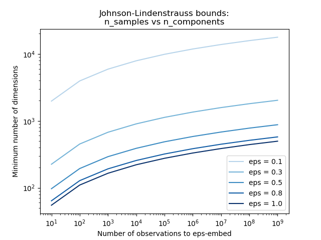
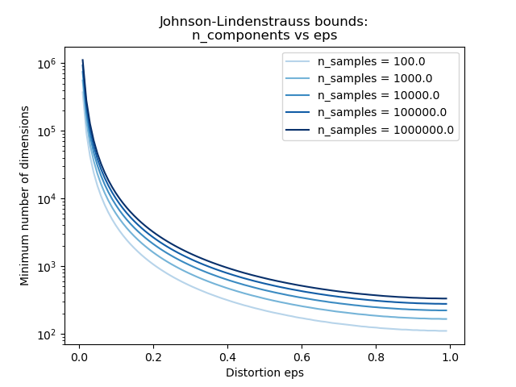
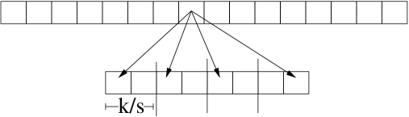

# Johnson-Lindenstrauss Lemma

## Table of Contents

- [[#1. Setup and Motivation|1. Setup and Motivation]]
  - [[#1.1 The Curse of Dimensionality|1.1 The Curse of Dimensionality]]
  - [[#1.2 Notation and Problem Statement|1.2 Notation and Problem Statement]]
- [[#2. The Johnson-Lindenstrauss Lemma|2. The Johnson-Lindenstrauss Lemma]]
  - [[#2.1 Formal Statement|2.1 Formal Statement]]
  - [[#2.2 The Distributional JL Lemma|2.2 The Distributional JL Lemma]]
  - [[#2.3 The Core Probabilistic Lemma|2.3 The Core Probabilistic Lemma]]
- [[#3. Proof via Gaussian Projection|3. Proof via Gaussian Projection]]
  - [[#3.1 Construction of the Random Map|3.1 Construction of the Random Map]]
  - [[#3.2 Chi-Squared Concentration via MGF|3.2 Chi-Squared Concentration via MGF]]
  - [[#3.3 Completing the Proof by Union Bound|3.3 Completing the Proof by Union Bound]]
- [[#4. Inner Product Preservation|4. Inner Product Preservation]]
- [[#5. Matrix Constructions|5. Matrix Constructions]]
  - [[#5.1 Gaussian Matrices|5.1 Gaussian Matrices]]
  - [[#5.2 Rademacher and Sparse Matrices (Achlioptas 2003)|5.2 Rademacher and Sparse Matrices (Achlioptas 2003)]]
  - [[#5.3 The Fast JL Transform (Ailon-Chazelle 2009)|5.3 The Fast JL Transform (Ailon-Chazelle 2009)]]
  - [[#5.4 Optimal Sparsity (Kane-Nelson 2014)|5.4 Optimal Sparsity (Kane-Nelson 2014)]]
- [[#6. Lower Bounds|6. Lower Bounds]]
  - [[#6.1 Dimension Lower Bound (Larsen-Nelson 2017)|6.1 Dimension Lower Bound (Larsen-Nelson 2017)]]
- [[#7. Applications|7. Applications]]
  - [[#7.1 k-Means Clustering|7.1 k-Means Clustering]]
  - [[#7.2 Approximate Nearest Neighbors|7.2 Approximate Nearest Neighbors]]
  - [[#7.3 Compressed Sensing and RIP|7.3 Compressed Sensing and RIP]]
  - [[#7.4 Machine Learning|7.4 Machine Learning]]
- [[#8. References|8. References]]

---

## 1. Setup and Motivation 📐

### 1.1 The Curse of Dimensionality

Many computational tasks — nearest-neighbor search, clustering, regression — degrade severely as ambient dimension $d$ grows. Storage costs scale as $O(nd)$, distance computations take $O(d)$ time, and geometric structures that hold in low dimensions (e.g., ball coverings with few centers) require exponentially many pieces in high dimensions. A central question in computational geometry and learning theory is: **when can we reduce dimension without paying an unacceptable price in geometric fidelity?**

The *Johnson-Lindenstrauss lemma* (JL lemma) gives a sharp, constructive answer for Euclidean geometry: any $n$-point cloud in $\mathbb{R}^d$ can be linearly embedded into $\mathbb{R}^k$ with $k = O(\varepsilon^{-2} \log n)$ while distorting every pairwise distance by at most a factor of $(1 \pm \varepsilon)$. *Crucially, the target dimension $k$ is independent of the original dimension $d$.* 🔑

The two plots below make the bound concrete. The first shows that $k$ grows only *logarithmically* in $n$: even for $n = 10^9$ observations with $\varepsilon = 0.1$, fewer than $10^4$ dimensions suffice. The second shows how rapidly $k$ decreases as the allowed distortion $\varepsilon$ grows — a factor-of-2 relaxation (from $\varepsilon = 0.1$ to $\varepsilon = 0.3$) roughly halves the required dimension.

*The JL bound $k = O(\varepsilon^{-2} \log n)$ plotted on log-log axes. Each curve corresponds to a fixed distortion tolerance $\varepsilon$. The logarithmic growth in $n$ is the central miracle: one million data points require only ~500 dimensions at $\varepsilon = 0.5$. (Reproduced from [scikit-learn JL bounds example](https://scikit-learn.org/stable/auto_examples/miscellaneous/plot_johnson_lindenstrauss_bound.html).)*

*The same bound viewed as $k$ versus $\varepsilon$ on a semi-log scale. The steep drop near $\varepsilon = 0$ reflects the $\varepsilon^{-2}$ factor; beyond $\varepsilon \approx 0.3$ the curves flatten. (Reproduced from [scikit-learn JL bounds example](https://scikit-learn.org/stable/auto_examples/miscellaneous/plot_johnson_lindenstrauss_bound.html).)*

### 1.2 Notation and Problem Statement

Let $\|\cdot\|$ denote the Euclidean norm on $\mathbb{R}^d$. For a map $f : \mathbb{R}^d \to \mathbb{R}^k$ and a set $\mathcal{P} \subset \mathbb{R}^d$ with $|\mathcal{P}| = n$, we say $f$ is an *$(1 \pm \varepsilon)$-isometric embedding* of $\mathcal{P}$ if

$$
(1 - \varepsilon)\|u - v\|^2 \leq \|f(u) - f(v)\|^2 \leq (1 + \varepsilon)\|u - v\|^2
\quad \text{for all } u, v \in \mathcal{P}.
$$

We work with squared norms throughout since that is what Gaussian projections directly control; the $(1 \pm \varepsilon)$ bound on squared distances implies a $(1 \pm \varepsilon)$-bound on distances to first order.

> [!NOTE] Reduction to a single vector
> Because $f$ is linear, $\|f(u) - f(v)\|^2 = \|f(u - v)\|^2$. It therefore suffices to prove that a single fixed unit vector $x \in \mathbb{R}^d$ satisfies $(1-\varepsilon)\|x\|^2 \le \|f(x)\|^2 \le (1+\varepsilon)\|x\|^2$ with high enough probability; we then union-bound over all $\binom{n}{2}$ pairs.

---

## 2. The Johnson-Lindenstrauss Lemma 🔑

### 2.1 Formal Statement

**Theorem (Johnson-Lindenstrauss, 1984).** Let $\varepsilon \in (0, 1)$ and let $\mathcal{P} \subset \mathbb{R}^d$ be a finite set of $n$ points. Set

$$
k \geq \frac{4 \ln n}{\varepsilon^2 / 2 - \varepsilon^3 / 3}.
$$

Then there exists a linear map $f : \mathbb{R}^d \to \mathbb{R}^k$ such that $f$ is a $(1 \pm \varepsilon)$-isometric embedding of $\mathcal{P}$. Moreover, a random Gaussian projection achieves this with positive probability (in fact, with probability at least $1 - 1/n$).

The denominator simplifies: for small $\varepsilon$, $\varepsilon^2/2 - \varepsilon^3/3 \approx \varepsilon^2/2$, giving the cleaner sufficient condition $k = O(\varepsilon^{-2} \log n)$.

> [!INFO] Historical note
> The original 1984 paper by Johnson and Lindenstrauss used a non-constructive argument (via measure theory on the sphere) to show that a random orthogonal projection works. The explicit chi-squared analysis presented here is from Dasgupta and Gupta (2003), which gave the first *elementary* proof.

### 2.2 The Distributional JL Lemma

The statement above guarantees existence of a good embedding; in practice we want to *sample* the embedding without seeing the data. The distributional form captures this.

**Lemma (Distributional JL Lemma).** For every $d \in \mathbb{N}$, $\varepsilon, \delta \in (0,1)$, there exists a distribution $\mathcal{F}$ over linear maps $f : \mathbb{R}^d \to \mathbb{R}^k$ with $k = \Theta(\varepsilon^{-2} \log(1/\delta))$ such that for every fixed $x \in \mathbb{R}^d$:

$$\Pr_{f \sim \mathcal{F}}\!\left[\bigl|\|f(x)\|^2 - \|x\|^2\bigr| \leq \varepsilon\|x\|^2\right] \geq 1 - \delta.$$

The JL theorem (Lemma 2.1) follows from the distributional version by setting $\delta = 1/n^2$ and union-bounding over all $\binom{n}{2}$ pairs of difference vectors.

> [!NOTE] Data-obliviousness
> The distribution $\mathcal{F}$ depends only on $d$, $\varepsilon$, and $\delta$ — *not* on the input vectors. This means we can sample $f$ before seeing the data, compute the sketch in one pass over a stream, or distribute the computation across machines that each hold part of the dataset. The Gaussian JL matrix is an explicit witness to $\mathcal{F}$.

### 2.3 The Core Probabilistic Lemma

The proof reduces to establishing the following one-vector concentration result.

**Lemma (JL Concentration).** Let $x \in \mathbb{R}^d$ with $\|x\| = 1$. Let $A \in \mathbb{R}^{k \times d}$ have i.i.d. $\mathcal{N}(0, 1)$ entries, and set $f(x) = \frac{1}{\sqrt{k}} A x$. Then for any $\varepsilon \in (0, 1)$:

$$
\Pr\!\left[\left|\,\|f(x)\|^2 - 1\,\right| > \varepsilon\right] \leq 2 e^{-k(\varepsilon^2/2 - \varepsilon^3/3)}.
$$

The JL theorem then follows by taking $k$ large enough that this failure probability is at most $1/n^2$, and applying a union bound over the $\binom{n}{2} < n^2/2$ pairs.

---

## 3. Proof via Gaussian Projection 📐

### 3.1 Construction of the Random Map

Fix a unit vector $x \in \mathbb{R}^d$. Let $g_1, \ldots, g_k \sim \mathcal{N}(0, I_d)$ be independent standard Gaussian vectors. Define

$$
Y_i = \langle g_i, x \rangle, \qquad i = 1, \ldots, k.
$$

Since $x$ is a fixed unit vector and $g_i$ is an isotropic Gaussian, $Y_i = g_i^\top x \sim \mathcal{N}(0, \|x\|^2) = \mathcal{N}(0, 1)$. The $Y_i$ are i.i.d.

Setting $Z = \sum_{i=1}^{k} Y_i^2$, we have $Z \sim \chi^2(k)$, a *chi-squared distribution* with $k$ degrees of freedom. The map $f(x) = \frac{1}{\sqrt{k}}(Y_1, \ldots, Y_k)$ satisfies

$$
\|f(x)\|^2 = \frac{1}{k} \sum_{i=1}^{k} Y_i^2 = \frac{Z}{k}.
$$

We need to show $Z/k$ concentrates near $1 = \mathbb{E}[Z/k]$.

### 3.2 Chi-Squared Concentration via MGF

We bound both tails using the *moment generating function* (MGF) technique — the same Chernoff method used for sums of Bernoullis, adapted to chi-squared random variables.

**Step 1: MGF of a chi-squared.** For $Y \sim \mathcal{N}(0,1)$ and $t < 1/2$,

$$
M_{Y^2}(t) = \mathbb{E}[e^{t Y^2}] = \int_{-\infty}^{\infty} e^{ty^2} \frac{e^{-y^2/2}}{\sqrt{2\pi}} \, dy = \frac{1}{\sqrt{1 - 2t}},
$$

obtained by completing the exponent $ty^2 - y^2/2 = -\frac{1-2t}{2}y^2$ and recognizing a Gaussian integral. Since $Y_1, \ldots, Y_k$ are independent,

$$
M_Z(t) = \mathbb{E}[e^{tZ}] = \prod_{i=1}^{k} M_{Y_i^2}(t) = (1 - 2t)^{-k/2}, \qquad t < \tfrac{1}{2}.
$$

**Step 2: Upper tail.** We want $\Pr[Z \geq (1 + \varepsilon)k]$. Markov on the MGF gives, for any $t > 0$:

$$
\Pr[Z \geq (1+\varepsilon)k] = \Pr[e^{tZ} \geq e^{t(1+\varepsilon)k}] \leq \frac{M_Z(t)}{e^{t(1+\varepsilon)k}} = \frac{e^{-t(1+\varepsilon)k}}{(1-2t)^{k/2}}.
$$

Taking the logarithm, we minimize over $t \in (0, 1/2)$:

$$
\ln \Pr[\cdots] \leq -t(1+\varepsilon)k - \tfrac{k}{2}\ln(1-2t).
$$

Setting the derivative with respect to $t$ to zero yields the optimal $t^* = \varepsilon / (2(1+\varepsilon))$. Substituting and using $\ln(1-u) \leq -u - u^2/2$ for $u \in (0,1)$ gives the bound

$$
\Pr[Z \geq (1+\varepsilon)k] \leq \left((1+\varepsilon)e^{-\varepsilon}\right)^{k/2}.
$$

Using $\ln(1+\varepsilon) \leq \varepsilon - \varepsilon^2/2 + \varepsilon^3/3$ one obtains

$$
\Pr[Z \geq (1+\varepsilon)k] \leq e^{-k(\varepsilon^2/2 - \varepsilon^3/3)}.
$$

**Step 3: Lower tail.** The argument is symmetric. We want $\Pr[Z \leq (1-\varepsilon)k]$, which uses the MGF at negative $t$. An analogous optimization yields

$$
\Pr[Z \leq (1-\varepsilon)k] \leq \left((1-\varepsilon)e^{\varepsilon}\right)^{k/2} \leq e^{-k(\varepsilon^2/2 - \varepsilon^3/3)}.
$$

> [!NOTE] Symmetry of the two tails
> The upper and lower tail bounds have identical exponents — a consequence of the chi-squared distribution being a sum of i.i.d. squared Gaussians, so both tails are controlled by the same MGF argument.

**Step 4: Combining.** By the union bound,

$$
\Pr\!\left[\left|\frac{Z}{k} - 1\right| > \varepsilon\right] \leq 2e^{-k(\varepsilon^2/2 - \varepsilon^3/3)}.
$$

This completes the proof of the JL Concentration Lemma.

### 3.3 Completing the Proof by Union Bound

There are $\binom{n}{2}$ pairs $(u, v) \in \mathcal{P}^2$ with $u \neq v$. Apply the lemma to each difference vector $x = (u-v)/\|u-v\|$. The probability that *any* pair fails is at most

$$
\binom{n}{2} \cdot 2 e^{-k(\varepsilon^2/2 - \varepsilon^3/3)} < n^2 e^{-k(\varepsilon^2/2 - \varepsilon^3/3)}.
$$

Setting this to be at most $\delta$ requires

$$
k \geq \frac{2\ln(n^2/\delta)}{\varepsilon^2/2 - \varepsilon^3/3} = \frac{4\ln(n/\sqrt{\delta})}{\varepsilon^2/2 - \varepsilon^3/3}.
$$

With $\delta = 1/n$ (so the embedding succeeds with probability $\geq 1 - 1/n$):

$$
\boxed{k = O\!\left(\frac{\log n}{\varepsilon^2}\right).}
$$

**The target dimension $k = O(\varepsilon^{-2} \log n)$ suffices regardless of the original dimension $d$.**

> [!WARNING] The $\varepsilon^3/3$ correction matters at large $\varepsilon$
> The bound $e^{-k(\varepsilon^2/2 - \varepsilon^3/3)}$ requires $\varepsilon < 1$ for the exponent to be negative. For $\varepsilon$ close to $1$ the cubic correction is non-negligible and one must track it carefully to get the precise constant in $k$.

---

## 4. Inner Product Preservation

💡 A JL embedding is linear, so it also (approximately) preserves inner products — not just distances. This is the key property exploited in [[papers/kv-cache-quantization/qjl|QJL]] for KV cache quantization.

**Corollary (Inner Product Preservation).** Let $f$ be a linear $(1 \pm \varepsilon)$-JLT of a set $\mathcal{P}$ with $-y \in \mathcal{P}$ whenever $y \in \mathcal{P}$. Then for every $x, y \in \mathcal{P}$:

$$|\langle f(x), f(y)\rangle - \langle x, y\rangle| \leq \varepsilon \|x\|_2 \|y\|_2.$$

📐 *Proof.* Assume WLOG both are unit vectors (the general case follows by rescaling). By the *polarization identity*,

$$4\langle u, v\rangle = \|u+v\|^2 - \|u-v\|^2,$$

so

$$4|\langle f(x), f(y)\rangle - \langle x, y\rangle| = \bigl|\|f(x+y)\|^2 - \|f(x-y)\|^2 - 4\langle x, y\rangle\bigr|$$

$$\leq \bigl|(1+\varepsilon)\|x+y\|^2 - (1-\varepsilon)\|x-y\|^2 - 4\langle x,y\rangle\bigr|$$

$$= \bigl|4\langle x,y\rangle + \varepsilon(\|x+y\|^2 + \|x-y\|^2) - 4\langle x,y\rangle\bigr| = \varepsilon(2\|x\|^2 + 2\|y\|^2) = 4\varepsilon. \quad\square$$

The condition $-y \in \mathcal{P}$ ensures both $x+y$ and $x-y$ are difference vectors covered by the JLT guarantee.

> [!TIP] Application to attention scores
> In transformers, the attention score between query $q$ and key $k$ is $\langle q, k\rangle/\sqrt{d}$. Inner product preservation means a JLT-based quantization (like [[papers/kv-cache-quantization/qjl|QJL]]) approximately preserves all attention scores simultaneously. [[papers/kv-cache-quantization/turboquant|TurboQuant]] exploits this by composing an MSE-optimal quantizer with a QJL residual correction to achieve an *unbiased* inner product estimator.

---

## 5. Matrix Constructions

The Gaussian proof establishes *existence* of a good embedding, but the computational cost of applying a dense $k \times d$ Gaussian matrix is $O(kd)$ per point. A rich line of work constructs alternative random matrices that are cheaper to store or apply.

### 5.1 Gaussian Matrices

**Definition (Gaussian JL Matrix).** The *Gaussian JL map* is $f(x) = \frac{1}{\sqrt{k}} A x$ where $A \in \mathbb{R}^{k \times d}$ has i.i.d. $\mathcal{N}(0,1)$ entries.

Properties:
- Application cost: $O(kd)$ multiplications per point.
- Storage: $O(kd)$ reals.
- Rotation-invariant: the distribution of $Ax$ depends on $x$ only through $\|x\|$.

### 5.2 Rademacher and Sparse Matrices (Achlioptas 2003)

Achlioptas showed that Gaussian entries can be replaced by much simpler distributions without losing the JL property. Define the *Achlioptas distribution* as

$$
A_{ij} = \begin{cases} +1 & \text{with probability } 1/2, \\ -1 & \text{with probability } 1/2, \end{cases}
$$

or the sparser variant

$$
A_{ij} = \begin{cases} +\sqrt{3} & \text{with probability } 1/6, \\ 0 & \text{with probability } 2/3, \\ -\sqrt{3} & \text{with probability } 1/6. \end{cases}
$$

**Theorem (Achlioptas 2003).** Both constructions satisfy the JL lemma with the same target dimension $k = O(\varepsilon^{-2} \log n)$. The sparse variant has only $1/3$ non-zero entries on average, reducing matrix-vector product time by a factor of $3$.

> [!TIP] Why do ±1 entries work?
> The key property used in the proof is that $\mathbb{E}[A_{ij}] = 0$ and $\mathbb{E}[A_{ij}^2] = 1$. The chi-squared concentration argument extends to any distribution on $A_{ij}$ that is sub-Gaussian (i.e., has all higher cumulants bounded). Both the Gaussian and Rademacher distributions are sub-Gaussian with variance proxy $\sigma^2 = 1$.

### 5.3 The Fast JL Transform (Ailon-Chazelle 2009)

The dense matrix multiplication bottleneck ($O(kd)$ per point) is expensive when $d$ is large and $k = O(\varepsilon^{-2} \log n)$ is small. The *Fast Johnson-Lindenstrauss Transform* (FJLT) achieves a substantially lower per-point cost.

**Definition (FJLT).** Let:
- $D \in \mathbb{R}^{d \times d}$ be a random diagonal matrix with i.i.d. Rademacher $(\pm 1)$ diagonal entries.
- $H \in \mathbb{R}^{d \times d}$ be the normalized Walsh-Hadamard transform, $H_{jl} = d^{-1/2}(-1)^{\langle j-1, l-1 \rangle}$ where $\langle \cdot, \cdot \rangle$ denotes the inner product of bit representations.
- $P \in \mathbb{R}^{k \times d}$ be a sparse random projection matrix (a subsampled Gaussian).

The FJLT map is

$$
f_{\text{FJLT}}(x) = P H D x.
$$

The product $HDx$ *scrambles* the energy of $x$ across all coordinates: $D$ randomizes signs, $H$ spreads energy uniformly via the Hadamard transform. After scrambling, $P$ can be very sparse while still preserving distances.

**Theorem (Ailon-Chazelle 2009).** The FJLT achieves $(1 \pm \varepsilon)$-distortion for $n$ points with target dimension $k = O(\varepsilon^{-2} \log n)$. The cost per point embedding is

$$
O(d \log d + k \log^2 n)
$$

compared to $O(kd)$ for naive Gaussian multiplication. *For $k \ll d / \log d$ this is a genuine speedup.*

> [!INFO] Heisenberg principle intuition
> The Hadamard matrix $H$ is the Walsh analog of the Fourier transform. Ailon and Chazelle exploit its *local-global duality*: a vector that is concentrated in the spatial domain (few large coordinates) becomes spread out in the Hadamard domain, and vice versa. This duality — sometimes called the Heisenberg principle of the Fourier transform — is precisely what allows $P$ to be sparse without suffering large distortion on "peaky" input vectors.

### 5.4 Optimal Sparsity (Kane-Nelson 2014)

A natural goal is to push sparsity as far as possible: how many non-zeros per column of $A$ are truly necessary?

**Theorem (Kane-Nelson 2014).** There exist JL matrices with $s = O(\varepsilon^{-1} \log n)$ non-zeros per column that achieve $(1 \pm \varepsilon)$-distortion for $n$ points in $k = O(\varepsilon^{-2} \log n)$ dimensions. This sparsity is asymptotically optimal among all oblivious distributions.

The construction uses a column-sparse matrix where each column has exactly $s$ non-zero entries placed at random positions, with signs drawn uniformly from $\{+1, -1\}$. The proof that this works is significantly more involved than the Gaussian argument, relying on *sparse recovery* tools and careful tail bounds for heavy-tailed distributions.

The figure below illustrates the *block construction* variant of the Kane-Nelson sparse JL matrix. The top row is a $d$-dimensional source vector; the bottom row is the $k$-dimensional target. Each source coordinate hashes to exactly one slot in each of the $s$ contiguous blocks of width $k/s$, guaranteeing exactly $s$ non-zeros per column with no block containing two entries from the same column.

*Figure 1(c) from Kane and Nelson (2014): the block construction for optimal sparse JL matrices. Each source coordinate contributes exactly one non-zero to each of $s$ blocks of size $k/s$ in the target, achieving $s = O(\varepsilon^{-1} \log n)$ non-zeros per column — the information-theoretic minimum.*

> [!QUESTION] Open problem: constants
> While the asymptotic $k = O(\varepsilon^{-2} \log n)$ and $s = O(\varepsilon^{-1} \log n)$ bounds are known to be tight, the precise leading constants in both bounds remain an active area. Practical implementations often tune these empirically.

---

## 6. Lower Bounds

### 6.1 Dimension Lower Bound (Larsen-Nelson 2017)

The JL lemma is tight: no approach, linear or nonlinear, can do better in general.

**Theorem (Larsen-Nelson 2017).** For any $\varepsilon \in (n^{-0.4999}, 1)$ and $n$ sufficiently large, any map $f : \mathbb{R}^d \to \mathbb{R}^k$ (not necessarily linear) that is a $(1 \pm \varepsilon)$-isometric embedding of some $n$-point set must satisfy

$$
k = \Omega\!\left(\frac{\log n}{\varepsilon^2}\right).
$$

This is a *worst-case* lower bound over the choice of point set; it holds even for embeddings allowed to depend on the specific input.

> [!INFO] History of the lower bound
> Earlier work (Alon 2003, Jayram-Woodruff 2013) established $k = \Omega(\varepsilon^{-2} \log n / \log(1/\varepsilon))$, which was weaker for small $\varepsilon$. Larsen-Nelson closed the gap by removing the $\log(1/\varepsilon)$ factor, matching the upper bound to a constant for all interesting $\varepsilon$.

The proof uses a coding theory argument: if $k < c \varepsilon^{-2} \log n$ then the image of the embedding must have too few distinct "shells" to accommodate $n$ well-separated points, yielding a contradiction via packing bounds in $\mathbb{R}^k$.

**The JL dimension $k = \Theta(\varepsilon^{-2} \log n)$ is optimal, up to a constant factor.** 🔑

---

## 7. Applications

### 7.1 k-Means Clustering

A key application is speeding up $k$-means clustering without sacrificing approximation quality (see [[concepts/randomized-algorithms/hashing-and-load-balancing|Hashing and Load Balancing]] for the balls-in-bins context).

**Lemma (Cluster cost as pairwise distances).** For any partition $X_1, \ldots, X_k$ of $X \subset \mathbb{R}^d$ with cluster means $\mu_i = \frac{1}{|X_i|}\sum_{x \in X_i} x$:

$$\sum_{i=1}^{k} \sum_{x \in X_i} \|x - \mu_i\|^2 = \sum_{i=1}^{k} \frac{1}{|X_i|} \sum_{x, y \in X_i} \|x - y\|^2.$$

*Proof.* $\sum_{x \in X_i}\|x - \mu_i\|^2 = \sum_x \|x\|^2 - |X_i|\|\mu_i\|^2 = \frac{1}{|X_i|}\sum_{x,y \in X_i}\|x-y\|^2$ by expanding.

Since the cluster cost is a sum of pairwise squared distances, and a JLT distorts every pairwise distance by $(1 \pm \varepsilon)$, the cluster cost in the embedded space approximates the cluster cost in the original space.

**Proposition (Cohen et al. 2015).** Let $f$ be a JLT of $X$ into $\mathbb{R}^k$. Any partition achieving $(1+\gamma)$-approximate $k$-means cost in the embedded space achieves $(1 + 4\varepsilon)(1 + \gamma)$-approximate cost in the original space. With $k = \Theta(\varepsilon^{-2} \log n)$, this gives $(1 + O(\varepsilon))$-approximation.

> [!INFO] Tighter bound for small k
> For the special case of $k$-means with $k$ clusters, the required target dimension is only $m = O(\varepsilon^{-2} \log k)$ for a $(1+\varepsilon)$ approximation (Cohen et al. 2015). The key insight: the cost only depends on the projections of cluster means, not all $n$ points individually.

### 7.2 Approximate Nearest Neighbors

*Approximate nearest neighbor* (ANN) search asks: given a query $q$, find a point $p \in \mathcal{P}$ with $\|q - p\| \leq (1 + \delta) \min_{p' \in \mathcal{P}} \|q - p'\|$.

Applying the JL lemma reduces the ambient dimension from $d$ to $k = O(\varepsilon^{-2} \log n)$, converting a hard high-dimensional problem into a more tractable low-dimensional one. *Surprisingly,* the $O(\log n)$ target dimension is often smaller than the intrinsic dimensionality of many real datasets, making JL practically effective even beyond the worst-case guarantee.

In the Ailon-Chazelle paper, the FJLT is combined with a bucketing structure to give an ANN data structure with query time $O(d \log d + n^{\rho} \log n)$ for $\rho < 1$.

### 7.3 Compressed Sensing and RIP

The *Restricted Isometry Property* (RIP) generalizes the JL guarantee from point sets to *sparse vectors*. A matrix $A \in \mathbb{R}^{k \times d}$ satisfies the $s$-RIP with parameter $\delta$ if

$$
(1 - \delta)\|x\|^2 \leq \|Ax\|^2 \leq (1 + \delta)\|x\|^2
\quad \text{for all $s$-sparse } x \in \mathbb{R}^d.
$$

A random Gaussian $A$ satisfies $s$-RIP with $k = O(s \log(d/s))$ rows. This is essentially the JL lemma applied to the $\binom{d}{s}$ sparse vectors; the log factor is the price of covering all $s$-sparse supports. RIP is the key tool guaranteeing that $\ell_1$-minimization recovers sparse signals from compressed measurements.

> [!NOTE] JL vs. RIP
> JL controls distances between $n$ *fixed* points; RIP controls distances from a $k \times d$ matrix over a *continuous family* (all $s$-sparse vectors). RIP requires more rows because the family is infinite, but the same Gaussian construction works for both.

### 7.4 Machine Learning

JL embeddings are used pervasively in ML to reduce the cost of algorithms with quadratic or higher complexity in $d$:

| Application | Original cost | Post-JL cost |
|---|---|---|
| Kernel SVM with RBF kernel | $O(n^2 d)$ Gram matrix | $O(n^2 k)$, $k \ll d$ |
| $k$-means clustering | $O(ndk)$ per iteration | $O(nk^2)$ per iteration |
| Dimensionality reduction preprocessing | — | $O(nd)$ one-time projection cost |
| Gradient sketching (training) | $O(d)$ per gradient step | $O(k)$ sketched gradients |

*In practice*, random projections are often used as a preprocessing step for linear classifiers in text mining and natural language processing, where feature vectors can have $d = O(10^6)$ or more dimensions but $n = O(10^5)$ training examples.

> [!TIP] Choosing k in practice
> The theoretical bound $k = O(\varepsilon^{-2} \log n)$ is often pessimistic. In practice, $k = 200$–$500$ suffices for many datasets with $n = 10^5$ points, even for $\varepsilon = 0.1$. The correct heuristic is to treat $k$ as a hyperparameter and validate empirically.

---

## 8. References

| Reference Name | Brief Summary | Link to Reference |
|---|---|---|
| [Johnson and Lindenstrauss (1984), "Extensions of Lipschitz Mappings into a Hilbert Space"](http://stanford.edu/class/cs114/readings/JL-Johnson.pdf) | The founding paper | [PDF via Stanford](http://stanford.edu/class/cs114/readings/JL-Johnson.pdf) |
| [Dasgupta and Gupta (2003), "An Elementary Proof of a Theorem of Johnson and Lindenstrauss"](https://cseweb.ucsd.edu/~dasgupta/papers/jl.pdf) | Clean chi-squared proof | [UCSD PDF](https://cseweb.ucsd.edu/~dasgupta/papers/jl.pdf) |
| [Achlioptas (2003), "Database-Friendly Random Projections"](https://cgi.di.uoa.gr/~optas/papers/jl.pdf) | ±1 sparse JL matrices | [Author PDF](https://cgi.di.uoa.gr/~optas/papers/jl.pdf) |
| [Ailon and Chazelle (2009), "The Fast Johnson-Lindenstrauss Transform"](https://www.cs.princeton.edu/~chazelle/pubs/FJLT-sicomp09.pdf) | FJLT = PHDx, O(d log d) time | [Princeton PDF](https://www.cs.princeton.edu/~chazelle/pubs/FJLT-sicomp09.pdf) |
| [Kane and Nelson (2014), "Sparser Johnson-Lindenstrauss Transforms"](https://arxiv.org/abs/1012.1577) | Optimal sparsity s = O(ε⁻¹ log n) | [arXiv:1012.1577](https://arxiv.org/abs/1012.1577) |
| [Larsen and Nelson (2017), "Optimality of the Johnson-Lindenstrauss Lemma"](https://arxiv.org/abs/1609.02094) | m = Ω(ε⁻² log n) lower bound | [arXiv:1609.02094](https://arxiv.org/abs/1609.02094) |
| [Vempala (2004), "The Random Projection Method"](https://bookstore.ams.org/dimacs-65) | Graduate monograph | [AMS bookstore](https://bookstore.ams.org/dimacs-65) |
| [Woodruff (2014), "Sketching as a Tool for Numerical Linear Algebra"](https://arxiv.org/abs/1411.4357) | Sketching survey | [arXiv:1411.4357](https://arxiv.org/abs/1411.4357) |
| [Freksen (2021), "An Introduction to Johnson-Lindenstrauss Transforms"](https://arxiv.org/abs/2103.00564) | Self-contained survey | [arXiv:2103.00564](https://arxiv.org/abs/2103.00564) |
