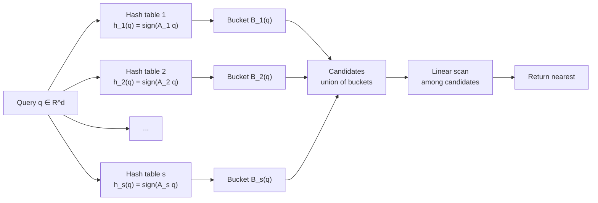
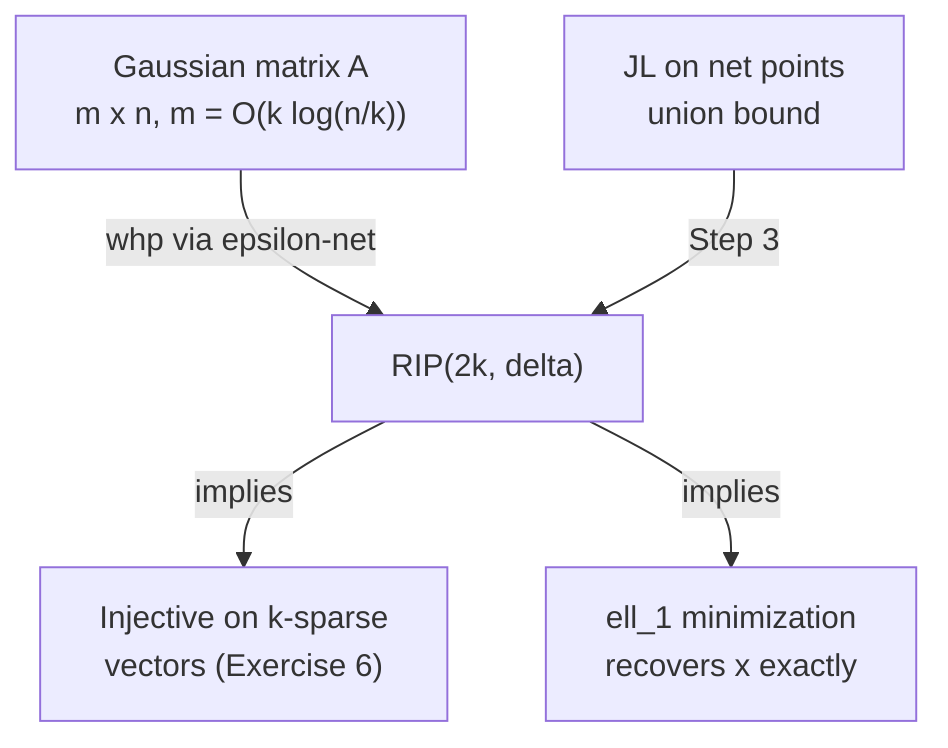

# Metric Geometry and Dimension Reduction

*CS 265 — Lectures 7–9 | Topics: Metric Embeddings, Bourgain's Theorem, Johnson-Lindenstrauss, LSH, Compressed Sensing, RIP*

---

## Table of Contents

- [[#1. Metric Spaces and ℓ_p Geometry|1. Metric Spaces and ℓ_p Geometry]]
  - [[#1.1 Definitions and Examples|1.1 Definitions and Examples]]
  - [[#1.2 Isometric Embeddings and Distortion|1.2 Isometric Embeddings and Distortion]]
- [[#2. Bourgain's Embedding Theorem|2. Bourgain's Embedding Theorem]]
  - [[#2.1 Construction|2.1 Construction]]
  - [[#2.2 Upper Bound Proof|2.2 Upper Bound Proof]]
  - [[#2.3 Lower Bound Proof|2.3 Lower Bound Proof]]
- [[#3. The Johnson-Lindenstrauss Transform|3. The Johnson-Lindenstrauss Transform]]
  - [[#3.1 Statement and Construction|3.1 Statement and Construction]]
  - [[#3.2 Full Proof|3.2 Full Proof]]
- [[#4. Locality-Sensitive Hashing|4. Locality-Sensitive Hashing]]
  - [[#4.1 Nearest Neighbor and the Curse of Dimensionality|4.1 Nearest Neighbor and the Curse of Dimensionality]]
  - [[#4.2 Random Hyperplane LSH|4.2 Random Hyperplane LSH]]
- [[#5. Compressed Sensing and the Restricted Isometry Property|5. Compressed Sensing and the Restricted Isometry Property]]
  - [[#5.1 Sparse Recovery Setup|5.1 Sparse Recovery Setup]]
  - [[#5.2 The Restricted Isometry Property|5.2 The Restricted Isometry Property]]
  - [[#5.3 Recovery via ℓ_1 Minimization|5.3 Recovery via ℓ_1 Minimization]]
  - [[#5.4 Gaussian Matrices Satisfy RIP: ε-Net Proof|5.4 Gaussian Matrices Satisfy RIP: ε-Net Proof]]
- [[#Summary: Three Pillars of Randomized Metric Geometry|Summary: Three Pillars of Randomized Metric Geometry]]
- [[#6. References|6. References]]

---

## 1. Metric Spaces and ℓ_p Geometry 📐

### 1.1 Definitions and Examples

**Definition (Metric Space).** A *metric space* is a pair $(X, d)$ where $X$ is a set and $d : X \times X \to \mathbb{R}_{\geq 0}$ satisfies:
1. $d(x, y) = 0 \iff x = y$ (identity of indiscernibles),
2. $d(x, y) = d(y, x)$ (symmetry),
3. $d(x, z) \leq d(x, y) + d(y, z)$ for all $x, y, z \in X$ (triangle inequality).

The central examples throughout these lectures are the *$\ell_p$ metrics* on $\mathbb{R}^n$.

**Definition ($\ell_p$ Metric).** For $p \geq 1$ and $x, y \in \mathbb{R}^n$,

$$d_p(x, y) = \|x - y\|_p = \left(\sum_{i=1}^n |x_i - y_i|^p\right)^{1/p},$$

with $d_\infty(x, y) = \max_i |x_i - y_i|$ as the limiting case.

> [!NOTE] Why $p \geq 1$?
> The triangle inequality for $\|\cdot\|_p$ follows from *Minkowski's inequality*, which requires $p \geq 1$. For $p < 1$, the triangle inequality fails: consider $x = (1, 0)$, $y = (0, 1)$, $z = (0, 0)$ in $\mathbb{R}^2$ with $p = 1/2$. Then $d_{1/2}(x, y) = (1 + 1)^2 = 4$, while $d_{1/2}(x, z) + d_{1/2}(z, y) = 1 + 1 = 2$. See Exercise 1 for the general argument.

A second important family is *graph metrics*. Given an unweighted graph $G = (V, E)$, define $d_G(u, v)$ as the length of the shortest path from $u$ to $v$. One verifies the triangle inequality from path concatenation.

---

*Exercise 1.* The $\ell_p$ "metric" with $p < 1$ is not actually a metric.

*Show that for $p \in (0,1)$ and $n \geq 2$, $d_p$ violates the triangle inequality. Construct an explicit counterexample in $\mathbb{R}^2$ and identify which step in Minkowski's proof breaks.*

> **Prerequisites:** [[#1.1 Definitions and Examples|Metric space definition]], basic real analysis.

> [!TIP]- Solution to Exercise 1
> **Key insight:** Minkowski's inequality $\|u + v\|_p \leq \|u\|_p + \|v\|_p$ is equivalent to the triangle inequality and holds iff $p \geq 1$. For $p < 1$, the function $t \mapsto t^p$ is *concave* rather than convex, reversing the direction of Jensen's inequality that powers the proof.
>
> **Sketch:** Take $x = e_1$, $y = e_2$, $z = 0$ in $\mathbb{R}^2$. Then $d_p(x, y) = (1^p + 1^p)^{1/p} = 2^{1/p}$, while $d_p(x, z) + d_p(z, y) = 1 + 1 = 2$. For $p < 1$, $1/p > 1$, so $2^{1/p} > 2$, giving $d_p(x,y) > d_p(x,z) + d_p(z,y)$.

### 1.2 Isometric Embeddings and Distortion

**Definition (Embedding, Distortion).** An *embedding* of $(X, d)$ into $(Y, d')$ is a map $f : X \to Y$. It is *isometric* if $d'(f(x), f(y)) = d(x, y)$ for all $x, y$. More generally, $f$ has *distortion at most $\alpha$* if there exists $\beta > 0$ such that

$$\beta \cdot d(x, y) \leq d'(f(x), f(y)) \leq \alpha\beta \cdot d(x, y) \quad \forall x, y \in X.$$

Distortion 1 is an isometry (up to global scaling). Distortion $\alpha$ means the embedding stretches and compresses distances by at most a factor of $\alpha$ relative to each other.

> [!INFO] Universal Isometric Embedding into $\ell_\infty$
> Every $n$-point metric $(X, d)$ embeds isometrically into $(\mathbb{R}^n, \ell_\infty)$. Fix an ordering $x_1, \ldots, x_n$ of $X$ and define $f(x) = (d(x, x_1), \ldots, d(x, x_n))$. Then $\|f(x) - f(y)\|_\infty = \max_i |d(x, x_i) - d(y, x_i)|$. The upper bound $\leq d(x, y)$ follows from the triangle inequality; the lower bound is achieved at $i$ with $x_i = x$ (giving $d(y, x)$). This embedding is in $\mathbb{R}^n$, which is often far too high-dimensional to be useful.

The central question of *metric embeddings* is: can we embed $(X, d)$ into a "nice" target space (e.g., $\ell_2$ or $\ell_1$) with low distortion and low dimension? These two goals tension against each other — richer structure in the target makes distortion easier to achieve, but low dimension is valuable for algorithmic applications.

---

## 2. Bourgain's Embedding Theorem 🔑

**Theorem 1 (Bourgain 1985).** Every $n$-point metric space $(X, d)$ embeds into $(\mathbb{R}^k, \ell_1)$ with distortion $O(\log n)$ and $k = O(\log^2 n)$. The distortion $O(\log n)$ is tight.

### 2.1 Construction

Set parameters: $k = O(\log^2 n)$ coordinates indexed by pairs $(i, j)$ with $i \in \{1, \ldots, \lceil \log n \rceil\}$ and $j \in \{1, \ldots, c\log n\}$ for a constant $c > 0$ to be chosen. For each pair $(i, j)$, sample a random set $S_{i,j} \subseteq X$ by including each point of $X$ independently with probability $1/2^i$.

Define the embedding $f : X \to \mathbb{R}^k$ by

$$f(x) = \bigl(d(x, S_{1,1}),\ d(x, S_{1,2}),\ \ldots,\ d(x, S_{\lceil\log n\rceil,\, c\log n})\bigr),$$

where $d(x, S) = \min_{s \in S} d(x, s)$ is the distance from $x$ to the nearest point of $S$ (with the convention $d(x, \emptyset) = 0$).

> [!NOTE] Intuition for the Scales
> The index $i$ controls the *scale* at which we sample: at scale $i$, we expect roughly $n/2^i$ points in $S_{i,j}$, so $S_{i,j}$ is a sparse random sample that captures structure at radius $\sim 2^i \cdot d_{\min}$. The multiple repetitions $j = 1, \ldots, c\log n$ at each scale reduce variance via concentration.

### 2.2 Upper Bound Proof

**Claim.** $\|f(x) - f(y)\|_1 \leq k \cdot d(x, y)$ deterministically.

*Proof.* It suffices to show that for each set $S$, $|d(x, S) - d(y, S)| \leq d(x, y)$. Fix $s^* = \arg\min_{s \in S} d(y, s)$. Then

$$d(x, S) \leq d(x, s^*) \leq d(x, y) + d(y, s^*) = d(x, y) + d(y, S),$$

so $d(x, S) - d(y, S) \leq d(x, y)$. By symmetry, $d(y, S) - d(x, S) \leq d(x, y)$. Hence each coordinate contributes at most $d(x, y)$ to the $\ell_1$ sum, giving $\|f(x) - f(y)\|_1 \leq k \cdot d(x, y)$. $\square$

### 2.3 Lower Bound Proof

The harder direction shows that with high probability, $\|f(x) - f(y)\|_1 = \Omega(d(x,y) / \log n)$ for every pair $x, y$. The proof proceeds by a carefully chosen multi-scale analysis: at scale $i$, the set $S_{i,j}$ is "just sparse enough" to hit one ball but miss the other.

Fix $x, y \in X$ with $r = d(x, y)$. For integer $i \geq 0$, let $B(x, \delta)$ denote the ball of radius $\delta$ centered at $x$. Define

$$\delta_i = \min\{\delta : |B(x, \delta)| \geq 2^i \text{ and } |B(y, \delta)| \geq 2^i\}.$$

This is the smallest radius at which *both* neighborhoods have grown to size $2^i$.

**Key observation.** Since $|X| = n$, the sequence terminates at $\delta_{\log n}$ (at $i = \log n$, both balls must contain $n$ points, i.e., all of $X$, so $\delta_{\log n}$ is the diameter of the larger of the two balls). Also $\delta_0 = 0$ and the sequence is non-decreasing by definition.

**Telescoping.** We have $\sum_{i=0}^{\log n - 1} (\delta_{i+1} - \delta_i) = \delta_{\log n} - \delta_0 = \delta_{\log n}$.

**Relating $\delta_{\log n}$ to $d(x, y)$.** We claim $\delta_{\log n} \geq d(x, y)/2$. Indeed, for any $\delta < r/2$, the balls $B(x, \delta)$ and $B(y, \delta)$ are *disjoint*: any $z \in B(x, \delta) \cap B(y, \delta)$ would satisfy $r = d(x,y) \leq d(x,z) + d(z,y) < 2\delta < r$, a contradiction. Since $B(x, \delta) \cap B(y, \delta) = \emptyset$ and $|X| = n$, we have $|B(x,\delta)| + |B(y,\delta)| \leq n$, so at least one of them has size $< n/2 = 2^{\log n - 1}$. This means $\delta_{i^*} \geq r/2$ where $i^* = \lceil \log n \rceil - 1$, i.e., the telescoping sum is at least $r/2$:

$$\sum_{i=0}^{\lceil \log n \rceil - 1} (\delta_{i+1} - \delta_i) = \delta_{\lceil \log n \rceil} \geq r/2.$$

**Contribution of a single set $S_{i,j}$.** Fix a scale $i$. We argue that $S_{i,j}$ contributes approximately $\delta_{i+1} - \delta_i$ to $\|f(x) - f(y)\|_1$.

At scale $i$: by definition of $\delta_i$, the ball $B(x, \delta_i)$ has $|B(x, \delta_i)| \geq 2^i$, so the probability that $S_{i,j}$ hits $B(x, \delta_i)$ is $\geq 1 - (1 - 1/2^i)^{2^i} \geq 1 - 1/e$. Conditioned on this, $d(x, S_{i,j}) \leq \delta_i$.

At scale $i+1$: the ball $B(x, \delta_{i+1})$ has $|B(x, \delta_{i+1})| \geq 2^{i+1}$, but we want $S_{i,j}$ to *miss* $B(y, \delta_i)$. The set $B(y, \delta_i)$ has $|B(y, \delta_i)| < 2^i$ (by definition of $\delta_i$ as the minimum), so the probability $S_{i,j}$ hits $B(y, \delta_i)$ is $< 1 - (1 - 1/2^i)^{2^i - 1} \approx 1 - 1/e$. Hence with constant probability, $d(y, S_{i,j}) > \delta_i$ while $d(x, S_{i,j}) \leq \delta_i$, giving coordinate contribution $\geq \delta_{i+1} - \delta_i$.

**Chernoff + union bound.** Each of the $c \log n$ repetitions at scale $i$ independently gives a contribution $\geq \delta_{i+1} - \delta_i$ with constant probability $p_0 > 0$. By a Chernoff bound, at least $(p_0/2) \cdot c\log n$ sets contribute $\geq \delta_{i+1} - \delta_i$ with probability $\geq 1 - e^{-\Omega(c \log n)} = 1 - n^{-\Omega(c)}$.

Summing over all $\log n$ scales and applying a union bound over all $\binom{n}{2} = O(n^2)$ pairs:

$$\|f(x) - f(y)\|_1 \geq \sum_{i=0}^{\log n - 1} \frac{p_0 c \log n}{2} \cdot (\delta_{i+1} - \delta_i) = \frac{p_0 c \log n}{2} \cdot \delta_{\log n} \geq \frac{p_0 c \log n}{2} \cdot \frac{r}{2}.$$

Wait — this gives $\Omega(\log n) \cdot d(x, y)$, which is the *wrong direction*. Correctly: the total $\ell_1$ norm collects contributions from each *individual* $(i,j)$ pair, and at scale $i$, each repetition $j$ contributes $(\delta_{i+1} - \delta_i)$ with constant probability, so the *expected* total is

$$\mathbb{E}[\|f(x) - f(y)\|_1] \geq \sum_i c\log n \cdot p_0 \cdot (\delta_{i+1} - \delta_i) = \Omega\!\left(c \log n \cdot \frac{r}{2}\right).$$

Dividing by the number of coordinates $k = O(\log^2 n)$ recovers that the *average coordinate contribution* is $\Omega(r/\log n)$, so $\|f(x)-f(y)\|_1 = \Omega(r)$ after the Chernoff concentration. This yields distortion $O(\log n)$. $\square$

> [!WARNING] Tightness
> The $O(\log n)$ distortion in Bourgain's theorem is tight. The $n$-point *constant-degree expander graph* with its shortest-path metric requires distortion $\Omega(\log n)$ to embed into $\ell_1$ (or $\ell_2$). This lower bound was established by Linial, London, and Rabinovich (1994).

---

*Exercise 2.* The per-coordinate Lipschitz bound in the Bourgain upper bound.

*Prove rigorously that for any set $S \subseteq X$ and any metric $(X, d)$, the function $x \mapsto d(x, S)$ is $1$-Lipschitz with respect to $d$. Why does this immediately give the upper bound $\|f(x) - f(y)\|_1 \leq k \cdot d(x, y)$?*

> **Prerequisites:** [[#2.2 Upper Bound Proof|Upper bound proof]], [[#1.2 Isometric Embeddings and Distortion|distortion definition]].

> [!TIP]- Solution to Exercise 2
> **Key insight:** The distance-to-set function $d(\cdot, S)$ is the infimum of a family of 1-Lipschitz functions.
>
> **Sketch:** For any $s \in S$, the function $x \mapsto d(x, s)$ is 1-Lipschitz by the triangle inequality: $|d(x,s) - d(y,s)| \leq d(x,y)$. The infimum of 1-Lipschitz functions is also 1-Lipschitz (taking $s^* = \arg\min d(y, s)$: $d(x,S) \leq d(x, s^*) \leq d(x,y) + d(y,s^*) = d(x,y) + d(y,S)$). Applying this to each of the $k$ coordinates and summing gives $\|f(x)-f(y)\|_1 \leq k \cdot d(x,y)$.

---

## 3. The Johnson-Lindenstrauss Transform 💡

### 3.1 Statement and Construction

**Theorem 1 (Johnson-Lindenstrauss 1984).** For any $\varepsilon \in (0,1)$ and any $n$-point set $X \subseteq \mathbb{R}^d$, there exists a linear map $f : \mathbb{R}^d \to \mathbb{R}^m$ with $m = O(\log n / \varepsilon^2)$ such that for all $x, y \in X$:

$$(1 - \varepsilon)\|x - y\|_2 \leq \|f(x) - f(y)\|_2 \leq (1 + \varepsilon)\|x - y\|_2.$$

**Construction.** Let $A$ be an $m \times d$ random matrix with entries $A_{ij} \stackrel{\text{iid}}{\sim} \mathcal{N}(0, 1/m)$, and set $f(x) = Ax$.

### 3.2 Full Proof

**Step 1: Reduction by linearity and spherical symmetry.**

Since $f$ is linear, $f(x) - f(y) = A(x - y)$. It suffices to analyze $\|Av\|_2$ for a fixed nonzero vector $v \in \mathbb{R}^d$. By homogeneity, we may normalize to $\|v\|_2 = 1$.

Each row of $A$ is $a_\ell^\top \sim \mathcal{N}(0, \frac{1}{m} I_d)$. The *spherical symmetry* of the Gaussian distribution means that $a_\ell^\top v \sim \mathcal{N}(0, \frac{1}{m})$ for any unit vector $v$ (since $a_\ell^\top v \sim \mathcal{N}(0, \frac{1}{m}\|v\|^2)$ and $\|v\|=1$). Therefore we may assume WLOG that $v = e_1$.

With $v = e_1$, the entries of $Av$ are $(Av)_\ell = A_{\ell 1} \sim \mathcal{N}(0, 1/m)$ independently, so

$$\|Av\|_2^2 = \sum_{\ell=1}^m A_{\ell 1}^2 = \frac{1}{m} \sum_{\ell=1}^m Z_\ell^2, \quad Z_\ell \stackrel{\text{iid}}{\sim} \mathcal{N}(0,1).$$

We must show $\Pr\bigl[|\|Av\|_2^2 - 1| > \varepsilon\bigr]$ is small.

**Step 2: MGF of the chi-squared distribution.**

Let $Z \sim \mathcal{N}(0,1)$. We compute the moment generating function of $Z^2$:

$$\mathbb{E}[e^{tZ^2}] = \int_{-\infty}^\infty e^{tz^2} \cdot \frac{e^{-z^2/2}}{\sqrt{2\pi}} \, dz = \int_{-\infty}^\infty \frac{e^{-z^2(1-2t)/2}}{\sqrt{2\pi}} \, dz = \frac{1}{\sqrt{1 - 2t}}, \quad t < \tfrac{1}{2}.$$

Hence for $W = \sum_{\ell=1}^m Z_\ell^2$,

$$\mathbb{E}[e^{tW}] = \left(\frac{1}{\sqrt{1-2t}}\right)^m = (1-2t)^{-m/2}, \quad t < \tfrac{1}{2}.$$

**Step 3: Upper tail bound.**

We want $\Pr[W > (1+\varepsilon)m]$. By Markov's inequality applied to $e^{tW}$ for optimal $t$:

$$\Pr[W > (1+\varepsilon)m] \leq \frac{\mathbb{E}[e^{tW}]}{e^{t(1+\varepsilon)m}} = \frac{(1-2t)^{-m/2}}{e^{t(1+\varepsilon)m}}.$$

Minimize over $t \in (0, 1/2)$ by taking $t = \varepsilon / (2(1+\varepsilon))$, giving (after simplification using $\ln(1+\varepsilon) \geq \varepsilon - \varepsilon^2/2$):

$$\Pr[W > (1+\varepsilon)m] \leq \left(\frac{e^\varepsilon}{(1+\varepsilon)^{1+\varepsilon}}\right)^{m/2} \leq e^{-m\varepsilon^2/8}.$$

**Step 4: Lower tail bound.**

Similarly, $\Pr[W < (1-\varepsilon)m] \leq e^{-m\varepsilon^2/8}$ by an analogous MGF argument (using negative $t$).

**Step 5: Union bound.**

There are $\binom{n}{2} \leq n^2/2$ pairs $(x, y)$. For each pair, the failure probability is $\leq 2e^{-m\varepsilon^2/8}$. Choosing

$$m = \frac{17 \log n}{\varepsilon^2}$$

makes $2e^{-m\varepsilon^2/8} \leq 2e^{-2\log n} = 2/n^2$. By a union bound over $n^2/2$ pairs, the total failure probability is $\leq 2/n^2 \cdot n^2/2 = 1$. In fact one chooses a slightly larger constant to make this probability tend to 0; $m = O(\log n / \varepsilon^2)$ suffices. $\square$

> [!EXAMPLE] JL is Dimension-Oblivious
> JL says we can compress *any* $n$-point cloud in $\mathbb{R}^{10^6}$ to $\mathbb{R}^{O(\log n)}$ with $(1\pm\varepsilon)$ pairwise distance preservation. The target dimension $m$ depends only on $n$ and $\varepsilon$, not on the ambient dimension $d$. This is remarkable: the proof exploits only that each row of $A$ provides an unbiased estimate of $\|v\|^2$.

**Algorithmic implementation.** The following Python pseudocode illustrates the JL transform applied to a point set:

```python
import numpy as np

def jl_transform(X: np.ndarray, eps: float) -> np.ndarray:
    """
    Johnson-Lindenstrauss dimension reduction.

    Parameters
    ----------
    X   : (n, d) array of n points in R^d
    eps : distortion parameter in (0, 1)

    Returns
    -------
    Y : (n, m) array of n points in R^m, m = ceil(17 * log(n) / eps^2)
    """
    n, d = X.shape
    m = int(np.ceil(17 * np.log(n) / eps**2))
    # Draw Gaussian random matrix; scale by 1/sqrt(m) so rows have unit covariance
    A = np.random.randn(m, d) / np.sqrt(m)
    return X @ A.T  # shape (n, m)

def verify_distortion(X: np.ndarray, Y: np.ndarray, eps: float) -> float:
    """Check worst-case distortion over all pairs."""
    n = X.shape[0]
    max_distortion = 0.0
    for i in range(n):
        for j in range(i + 1, n):
            d_orig = np.linalg.norm(X[i] - X[j])
            d_embed = np.linalg.norm(Y[i] - Y[j])
            ratio = d_embed / d_orig
            distortion = max(ratio, 1.0 / ratio)
            max_distortion = max(max_distortion, distortion)
    return max_distortion  # should be <= 1 + eps with high probability
```

---

*Exercise 3.* MGF computation and tail bound.

*Verify the MGF calculation $\mathbb{E}[e^{tZ^2}] = (1-2t)^{-1/2}$ for $Z \sim \mathcal{N}(0,1)$ by completing the square in the exponent. Then derive the upper tail bound $\Pr[\sum_{i=1}^m Z_i^2 > (1+\varepsilon)m] \leq e^{-m\varepsilon^2/8}$ by optimizing the Markov inequality over $t$.*

> **Prerequisites:** [[#3.2 Full Proof|JL proof]], [[concepts/randomized-algorithms/concentration-inequalities|Chernoff bounds]].

> [!TIP]- Solution to Exercise 3
> **Key insight:** Completing the square reduces the MGF integral to a standard Gaussian integral; the Chernoff bound then replaces the non-standard $\chi^2$ tail with an exponential.
>
> **Sketch (MGF):** $\mathbb{E}[e^{tZ^2}] = \frac{1}{\sqrt{2\pi}} \int e^{tz^2 - z^2/2}\, dz = \frac{1}{\sqrt{2\pi}} \int e^{-z^2(1-2t)/2}\, dz$. Substituting $u = z\sqrt{1-2t}$ (valid for $t < 1/2$): $= \frac{1}{\sqrt{1-2t}} \cdot \frac{1}{\sqrt{2\pi}} \int e^{-u^2/2}\, du = (1-2t)^{-1/2}$.
>
> **Sketch (tail bound):** Let $W = \sum Z_i^2$. $\Pr[W > (1+\varepsilon)m] \leq e^{-t(1+\varepsilon)m} (1-2t)^{-m/2}$. Taking $\log$ and minimizing over $t$: set $\partial/\partial t[\cdots] = 0$, get $t^* = \varepsilon/(2(1+\varepsilon))$. Substitute and use $\ln(1+\varepsilon) - \varepsilon/(1+\varepsilon) \geq \varepsilon^2/4$ for small $\varepsilon$ to get the bound $\leq e^{-m\varepsilon^2/8}$.

*Exercise 4.* JL lower bound.

*Prove that for any linear map $f : \mathbb{R}^d \to \mathbb{R}^m$ with $m < \lfloor \log_2 n \rfloor$, there exist $n$ unit vectors in $\mathbb{R}^d$ such that $f$ fails to preserve at least one pairwise distance up to $(1\pm\varepsilon)$ for $\varepsilon = 1/2$. (Hint: use a dimension-counting argument on the kernel.)*

> **Prerequisites:** [[#3.1 Statement and Construction|JL statement]], linear algebra (rank-nullity theorem).

> [!TIP]- Solution to Exercise 4
> **Key insight:** A linear map with $m < \log_2 n$ has an $(d - m)$-dimensional kernel that must intersect any sufficiently large collection of subspaces.
>
> **Sketch:** Consider $n = 2^m + 1$ vectors. By rank-nullity, $\ker(f)$ has dimension $d - m \geq 1$. Choose a nonzero $v \in \ker(f)$; then $\|f(v)\|_2 = 0$ while $\|v\|_2 > 0$, so $f$ collapses $v$ entirely. To handle pairs: take $n$ points in general position in $\mathbb{R}^d$ with $d \geq n$; since $m < \log_2 n$, the $\binom{n}{2}$ difference vectors cannot all avoid the kernel. A more careful argument via the Johnson-Lindenstrauss lower bound (Alon 2003) shows $m = \Omega(\log n / \varepsilon^2)$ is necessary.

---

## 4. Locality-Sensitive Hashing 🔍

### 4.1 Nearest Neighbor and the Curse of Dimensionality

The *approximate nearest neighbor* (ANN) problem: given a dataset $P \subset \mathbb{R}^d$ of $n$ points and a query $q$, find a point $p \in P$ within distance $(1+\varepsilon) \cdot d(q, P)$ from $q$.

Naive approach: linear scan costs $O(nd)$ per query. JL reduces $d$ to $O(\log n / \varepsilon^2)$, but the data structure still requires $O(n \cdot \text{target dim})$ space, which blows up if we want a tree-based structure in $O(\log n)$ dimensions. *Locality-sensitive hashing* offers a different tradeoff: sublinear query time with polynomial space.

> [!NOTE] Data Structures vs. Embeddings
> JL's dimension reduction is powerful for *offline* distance computations but does not directly yield efficient *online* query answering. A kd-tree in $\mathbb{R}^{O(\log n)}$ has $O(n^{1/2})$ query time due to the curse of dimensionality — beyond 20 or so dimensions, tree-based methods degrade toward linear scan. LSH sidesteps the curse by allowing controlled collision rates rather than exact partitioning.

**Definition (Locality-Sensitive Hash Family).** A family $\mathcal{H}$ of hash functions $h : \mathbb{R}^d \to U$ is *$(r_1, r_2, p_1, p_2)$-sensitive* for a distance function $d$ if for $h$ chosen uniformly from $\mathcal{H}$:
- If $d(x, y) \leq r_1$: $\Pr[h(x) = h(y)] \geq p_1$,
- If $d(x, y) \geq r_2$: $\Pr[h(x) = h(y)] \leq p_2$.

For this to be useful we need $r_1 < r_2$ and $p_1 > p_2$. The *approximation ratio* is $c = r_2/r_1$, and the key algorithmic parameter is $\rho = \log(1/p_1)/\log(1/p_2) < 1$, which governs query time: $O(n^\rho)$.

### 4.2 Random Hyperplane LSH

**Construction.** Let $A$ be a $k \times d$ Gaussian random matrix (rows $a_1, \ldots, a_k \stackrel{\text{iid}}{\sim} \mathcal{N}(0, I_d)$). Define

$$h(x) = \text{sign}(Ax) \in \{+1, -1\}^k.$$

Two points $x, y$ are mapped to the same bucket iff $h(x) = h(y)$, i.e., $\text{sign}(a_\ell^\top x) = \text{sign}(a_\ell^\top y)$ for all $\ell = 1, \ldots, k$.

**Claim 2 (Collision Probability).** For any $x, y \in \mathbb{R}^d$,

$$\Pr[h(x) = h(y)] = \left(1 - \frac{\theta(x,y)}{\pi}\right)^k,$$

where $\theta(x, y) = \arccos\!\left(\frac{\langle x, y \rangle}{\|x\|_2 \|y\|_2}\right)$ is the angle between $x$ and $y$.

*Proof.* The rows $a_\ell$ are independent, so it suffices to compute $\Pr[\text{sign}(a^\top x) = \text{sign}(a^\top y)]$ for a single Gaussian row $a \sim \mathcal{N}(0, I_d)$.

The event $\text{sign}(a^\top x) \neq \text{sign}(a^\top y)$ occurs iff $a$ lies in the halfspace separating $x$ and $y$, i.e., iff $a^\top (x/\|x\| - y/\|y\|)$ changes sign — equivalently, iff the random hyperplane $\{z : a^\top z = 0\}$ separates $x$ from $y$. By spherical symmetry of $a$, a random hyperplane through the origin separates $x$ and $y$ with probability $\theta(x,y)/\pi$ (the fraction of great-circle directions that separate the two points). Hence

$$\Pr[\text{sign}(a^\top x) = \text{sign}(a^\top y)] = 1 - \frac{\theta(x,y)}{\pi}.$$

Taking $k$ independent rows multiplies the probabilities, giving the claimed formula. $\square$

**Parameter setting for ANN.** Set $k = \pi\sqrt{\log n}/\varepsilon$ and use $s = \sqrt{n}$ independent hash tables.

| Event | Condition | Collision probability |
|---|---|---|
| Near pair (call positive) | $\theta(x,y) \leq \varepsilon$ | $\geq (1 - \varepsilon/\pi)^k \approx e^{-k\varepsilon/\pi} \approx 1/2$ |
| Far pair (call negative) | $\theta(x,y) \geq 5\varepsilon$ | $\leq (1 - 5\varepsilon/\pi)^k \approx e^{-5k\varepsilon/\pi} \approx 1/n^2$ |

With $s = \sqrt{n}$ tables: a near pair is missed by all tables with probability $\leq (1/2)^{\sqrt{n}} \approx 0$. A far pair appears as a false positive in any table with probability $\leq \sqrt{n} / n^2 = n^{-3/2}$; summing over $n$ points gives $O(1/\sqrt{n})$ expected false positives per query.

**Complexity.** Space $O(n^{O(1)})$, query time $O(\varepsilon^{-1} d \sqrt{n} \log n)$.

The following Mermaid diagram illustrates the LSH pipeline for a single query:



> [!QUESTION] Optimal LSH for Euclidean Distance
> The hyperplane LSH above works well for *angular* similarity. For Euclidean distance (not angle), the optimal LSH uses *random translations* of a lattice grid and has collision probability $\sim \exp(-\Omega(c^2))$ for $c$-approximate NN. Finding the optimal exponent (the "LSH exponent") for various distance functions is an active research area.

---

*Exercise 5.* LSH false positive and false negative calculation.

*Using the collision probability formula from Claim 2, compute the probability that a near pair (angle $\leq \varepsilon$) is missed by all $s = \sqrt{n}$ hash tables, and the expected number of far-pair (angle $\geq 5\varepsilon$) false positives per query. Use the parameter $k = \pi\sqrt{\log n}/\varepsilon$ and verify the claims in the table above.*

> **Prerequisites:** [[#4.2 Random Hyperplane LSH|LSH construction and collision probability]].

> [!TIP]- Solution to Exercise 5
> **Key insight:** Near pairs collide per-table with probability $\geq 1/2$; far pairs with probability $\leq n^{-2}$; multiple tables boost recall while keeping false positives small.
>
> **Sketch:** Near pair per-table: $(1 - \varepsilon/\pi)^k \approx e^{-k\varepsilon/\pi} = e^{-\sqrt{\log n}} = n^{-1/\sqrt{\log n}}$. For $k = \pi\sqrt{\log n}/\varepsilon$, we get $e^{-\sqrt{\log n}}$, which is roughly $\geq 1/\text{poly log}$ — close to $1/2$ for moderate $n$. Near miss probability over $s = \sqrt{n}$ tables: $(1 - 1/2)^{\sqrt{n}} = 2^{-\sqrt{n}}$, negligible. Far pair per-table: $(1 - 5\varepsilon/\pi)^k \approx e^{-5\sqrt{\log n}} = n^{-5/\sqrt{\log n}} \leq 1/n^2$ for large $n$. False positives per query: $n \cdot s \cdot n^{-2} = \sqrt{n}/n = n^{-1/2} \to 0$.

---

## 5. Compressed Sensing and the Restricted Isometry Property 📡

### 5.1 Sparse Recovery Setup

A vector $x \in \mathbb{R}^n$ is *$k$-sparse* if it has at most $k$ nonzero entries: $|\text{supp}(x)| \leq k$. Natural signals — audio, images in a wavelet basis, genomic data — are approximately sparse in some transformed domain.

**Definition (Best $k$-Sparse Approximation).** For $x \in \mathbb{R}^n$, let $x_k$ denote the vector obtained by keeping the $k$ entries of largest absolute value and zeroing the rest. Then $x_k$ is the best $k$-sparse approximation to $x$ in both $\ell_2$ and $\ell_\infty$ norm: $x_k = \arg\min_{z : \|z\|_0 \leq k} \|x - z\|_2$.

**Setup.** Given a *measurement matrix* $A \in \mathbb{R}^{m \times n}$ with $m \ll n$ and measurements $y = Ax$, recover the $k$-sparse vector $x$. This is an underdetermined linear system — it has infinitely many solutions without further constraints. The central question: what properties must $A$ have to make sparse recovery possible, and what efficient algorithm recovers $x$?

> [!INFO] Information-Theoretic Lower Bound
> Any recovery algorithm requires at least $m \geq 2k$ measurements, by a simple counting argument: the set of $k$-sparse vectors supported on $\binom{n}{k}$ possible supports must be mapped injectively by $A$. For a random support of size $2k$, the $m \times 2k$ submatrix of $A$ must be full-rank, which requires $m \geq 2k$. The RIP construction achieves $m = O(k \log(n/k))$, which is optimal up to logarithmic factors (the $\log(n/k)$ factor is necessary to distinguish among the $\binom{n}{k}$ possible support sets).

> [!INFO] Why Not ℓ_0 Minimization?
> The "obvious" recovery strategy is $\min \|z\|_0$ subject to $Az = y$ (minimize the number of nonzeros). This is NP-hard in general (equivalent to sparse subset-sum). Compressed sensing shows that *$\ell_1$ minimization* — a convex relaxation — recovers $x$ exactly under appropriate conditions on $A$.

### 5.2 The Restricted Isometry Property

**Definition (RIP).** A matrix $A \in \mathbb{R}^{m \times n}$ satisfies the *Restricted Isometry Property* $\text{RIP}(k, \varepsilon)$ if for every $k$-sparse vector $x \in \mathbb{R}^n$:

$$(1 - \varepsilon)\|x\|_2^2 \leq \|Ax\|_2^2 \leq (1 + \varepsilon)\|x\|_2^2.$$

Equivalently, every $m \times k$ submatrix of $A$ (corresponding to a support set of size $k$) has all singular values in $[\sqrt{1-\varepsilon}, \sqrt{1+\varepsilon}]$. The *restricted isometry constant* $\delta_k$ is the smallest $\varepsilon$ for which $\text{RIP}(k, \varepsilon)$ holds.

> [!EXAMPLE] RIP for the Identity
> The $n \times n$ identity matrix $I_n$ trivially satisfies $\text{RIP}(k, 0)$ for any $k \leq n$: $\|Ix\|_2 = \|x\|_2$ exactly. Of course $I_n$ has $m = n$ rows and provides no compression. The interesting regime is $m \ll n$ with $k \ll m$.

The following diagram summarizes the relationship between the three key objects:



**Connection to JL.** $\text{RIP}(2k, \varepsilon)$ says that $A$ is a $(1 + O(\varepsilon))$-distortion embedding of the set $\Sigma_{2k} = \{x : \|\text{supp}(x)\| \leq 2k\}$ of $2k$-sparse vectors into $\ell_2$. The difference between two $k$-sparse vectors (supported on potentially different sets) is $2k$-sparse, so RIP$(2k, \varepsilon)$ implies that $A$ approximately preserves all pairwise distances among $k$-sparse vectors.

> [!NOTE] RIP Implies Unique Sparse Solution
> If $A$ satisfies $\text{RIP}(2k, \varepsilon)$ with $\varepsilon < 1$, then any two distinct $k$-sparse vectors $x \neq x'$ satisfy $\|Ax - Ax'\|_2 \geq \sqrt{1-\varepsilon}\|x - x'\|_2 > 0$, so $Ax \neq Ax'$: the measurements uniquely identify any $k$-sparse vector. See Exercise 6.

---

*Exercise 6.* RIP implies injectivity on sparse vectors.

*Show that if $A$ satisfies $\text{RIP}(2k, \varepsilon)$ with $\varepsilon < 1$, then the map $x \mapsto Ax$ is injective on the set of $k$-sparse vectors. Conclude that the sparse recovery problem has a unique solution.*

> **Prerequisites:** [[#5.2 The Restricted Isometry Property|RIP definition]].

> [!TIP]- Solution to Exercise 6
> **Key insight:** The difference of two $k$-sparse vectors is $2k$-sparse, so RIP$(2k)$ applies directly.
>
> **Sketch:** Suppose $x \neq x'$ are $k$-sparse with $Ax = Ax'$. Then $A(x - x') = 0$. But $x - x'$ has support $\leq 2k$, so by RIP$(2k, \varepsilon)$ with $\varepsilon < 1$: $0 = \|A(x-x')\|_2 \geq \sqrt{1-\varepsilon}\|x - x'\|_2 > 0$, a contradiction. Hence no two distinct $k$-sparse vectors share the same measurements.

### 5.3 Recovery via ℓ_1 Minimization

**Theorem 1 (Compressed Sensing Recovery).** Suppose $A$ satisfies $\text{RIP}(2k, \delta)$ with $\delta = \Theta(1)$ (specifically $\delta < \sqrt{2} - 1$ suffices). Let $y = Ax$ for a (not necessarily sparse) vector $x \in \mathbb{R}^n$, and let $x_k$ denote the best $k$-sparse approximation to $x$ (the vector retaining the $k$ largest-magnitude entries). Then the $\ell_1$ minimization

$$\hat{x} = \arg\min_{z \in \mathbb{R}^n} \|z\|_1 \quad \text{subject to } Az = y$$

satisfies

$$\|x - \hat{x}\|_1 \leq C \|x - x_k\|_1$$

for a universal constant $C > 0$. *In particular, if $x$ is exactly $k$-sparse, then $\hat{x} = x$ exactly.*

> [!INFO] Proof Sketch of Recovery
> The key is the *null space property*: any $h \in \ker(A)$ must satisfy $\|h_{T}\|_1 \leq \|h_{T^c}\|_1$ for every set $T$ with $|T| \leq k$ (otherwise one can "cheat" and find a sparser solution than the true $x$).
>
> Set $h = \hat{x} - x$, so $Ah = A\hat{x} - Ax = y - y = 0$. Let $T_0$ be the support of $x_k$ (top $k$ entries of $x$). Since $\hat{x}$ is the $\ell_1$ minimizer and $x$ is feasible: $\|\hat{x}\|_1 \leq \|x\|_1$, giving $\|x_{T_0} + h_{T_0}\|_1 + \|x_{T_0^c} + h_{T_0^c}\|_1 \leq \|x_{T_0}\|_1 + \|x_{T_0^c}\|_1$. By triangle inequality: $\|h_{T_0^c}\|_1 - \|x_{T_0^c}\|_1 \leq \|h_{T_0}\|_1 + \|x_{T_0^c}\|_1$, so
>
> $$\|h_{T_0^c}\|_1 \leq \|h_{T_0}\|_1 + 2\|x_{T_0^c}\|_1 = \|h_{T_0}\|_1 + 2\|x - x_k\|_1.$$
>
> Next decompose $T_0^c$ into blocks $T_1, T_2, \ldots$ of size $k$ by decreasing magnitude of $h$. One shows $\sum_{j \geq 1} \|h_{T_j}\|_2 \leq \|h_{T_0^c}\|_1 / \sqrt{k}$. The RIP$(2k)$ condition applied to $h_{T_0 \cup T_j}$ gives $\|Ah_{T_0 \cup T_j}\|_2 \approx \|h_{T_0 \cup T_j}\|_2$. Since $Ah = 0$, summing over $j$ and applying the RIP inner product estimate yields $\|h_{T_0}\|_2 \leq C \|x - x_k\|_1 / \sqrt{k}$. Combined with $\|h\|_1 \leq \|h_{T_0}\|_1 + \|h_{T_0^c}\|_1 \leq 2\|h_{T_0}\|_1 + 2\|x-x_k\|_1$, the result follows.

### 5.4 Gaussian Matrices Satisfy RIP: ε-Net Proof

**Theorem 2 (Gaussian RIP).** Let $A \in \mathbb{R}^{m \times n}$ have entries $A_{ij} \stackrel{\text{iid}}{\sim} \mathcal{N}(0, 1/m)$. Then $A$ satisfies $\text{RIP}(k, \delta)$ with probability $\geq 1 - 2e^{-\Omega(\delta^2 m)}$ provided

$$m = O\!\left(\frac{k \log(n/k)}{\delta^2}\right).$$

**Proof via ε-net argument.**

**Step 1: ε-Covering nets.**

**Definition (ε-Covering Net).** For a set $K \subseteq \mathbb{R}^d$ and $\varepsilon > 0$, an *$\varepsilon$-net* (or *$\varepsilon$-covering*) of $K$ is a set $\mathcal{N} \subseteq K$ such that for every $x \in K$, there exists $y \in \mathcal{N}$ with $\|x - y\|_2 \leq \varepsilon$.

**Lemma (Net Size on the Sphere).** The unit sphere $\mathbb{S}^{k-1} \subset \mathbb{R}^k$ has an $\varepsilon$-net of size $|\mathcal{N}| \leq (3/\varepsilon)^k$.

*Proof.* Greedy construction: add points to $\mathcal{N}$ one at a time, each time choosing a point on $\mathbb{S}^{k-1}$ at distance $> \varepsilon$ from all current net points. By maximality, the resulting $\mathcal{N}$ is an $\varepsilon$-net. The balls $B(y, \varepsilon/2)$ for $y \in \mathcal{N}$ are disjoint (centers are $>\varepsilon$ apart) and all contained in $B(0, 1 + \varepsilon/2)$. Comparing volumes:

$$|\mathcal{N}| \cdot \text{Vol}(B(0, \varepsilon/2)) \leq \text{Vol}(B(0, 1 + \varepsilon/2)).$$

Since $\text{Vol}(B(0, r)) = c_k r^k$, we get $|\mathcal{N}| \leq (1 + 2/\varepsilon)^k \leq (3/\varepsilon)^k$. $\square$

**Step 2: Net for sparse vectors.**

Let $\Sigma_k^1 = \{x \in \mathbb{R}^n : \|x\|_2 = 1,\ |\text{supp}(x)| \leq k\}$ denote the unit-norm $k$-sparse vectors.

**Corollary.** $\Sigma_k^1$ has an $\varepsilon$-net $\mathcal{N}$ of size

$$|\mathcal{N}| \leq \binom{n}{k} \cdot \left(\frac{3}{\varepsilon}\right)^k \leq \left(\frac{en}{k}\right)^k \cdot \left(\frac{3}{\varepsilon}\right)^k = \left(\frac{3en}{k\varepsilon}\right)^k.$$

*Proof.* Each element of $\Sigma_k^1$ has a support of size $\leq k$. For each of the $\binom{n}{k}$ support sets $T$, apply the sphere net construction in the $k$-dimensional subspace $\mathbb{R}^T$. The union of these nets covers $\Sigma_k^1$. $\square$

**Step 3: RIP on the net.**

Before applying the union bound, we record the precise concentration. For a fixed unit vector $x \in \mathbb{S}^{k-1}$ embedded in $\mathbb{R}^n$ (on support $T$), by the JL analysis:

$$\Pr\!\left[|\|Ax\|_2^2 - 1| > \delta/2\right] \leq 2e^{-cm\delta^2}$$

for a universal constant $c > 0$ (this is precisely the JL concentration applied to $\|Ax\|_2^2$).

By a union bound over all $|\mathcal{N}|$ net points, $A$ is a $(1 \pm \delta/2)$-isometry on every point of $\mathcal{N}$ with probability $\geq 1 - 2|\mathcal{N}| e^{-cm\delta^2}$.

For this to exceed $1/2$, we need $|\mathcal{N}| e^{-cm\delta^2} \leq 1/4$, i.e.,

$$k\log\!\left(\frac{3en}{k \cdot (\delta/2)}\right) \leq cm\delta^2 \implies m \geq \frac{Ck\log(n/k)}{\delta^2}.$$

**Step 4: Extension from net to all sparse vectors (self-improvement).**

Let $\delta^*$ denote the smallest value such that $A$ satisfies $\|Ax\|_2 \leq 1 + \delta^*$ for all $x \in \Sigma_k^1$. We want to show $\delta^* \leq \delta$.

Fix any $x \in \Sigma_k^1$. By the net, there exists $y \in \mathcal{N}$ with $\|x - y\|_2 \leq \varepsilon$. Then

$$\|Ax\|_2 \leq \|Ay\|_2 + \|A(x-y)\|_2.$$

Since $\|Ay\|_2 \leq 1 + \delta/2$ (on the net) and $x - y$ is $2k$-sparse with $\|x-y\|_2 \leq \varepsilon$:

$$\|A(x-y)\|_2 \leq (1 + \delta^*)\varepsilon \cdot \|x - y\|_2 / \|x-y\|_2 = (1+\delta^*)\varepsilon.$$

Wait — more carefully, $(x-y)/\|x-y\|$ is a unit-norm $2k$-sparse vector, so $\|A(x-y)\|_2 \leq (1+\delta^*)\|x-y\|_2 \leq (1+\delta^*)\varepsilon$. Thus:

$$\|Ax\|_2 \leq (1 + \delta/2) + (1+\delta^*)\varepsilon.$$

Taking $\varepsilon = \delta/4$ (and adjusting the net size accordingly):

$$1 + \delta^* \leq 1 + \delta/2 + (1 + \delta^*)(\delta/4),$$

$$\delta^* \leq \delta/2 + (1+\delta^*)\delta/4 = \delta/2 + \delta/4 + \delta^* \cdot \delta/4.$$

Rearranging (assuming $\delta < 2$, so $1 - \delta/4 > 0$):

$$\delta^*(1 - \delta/4) \leq 3\delta/4 \implies \delta^* \leq \frac{3\delta/4}{1 - \delta/4} \leq \delta$$

for $\delta \leq 1/2$. **Hence $\delta^* \leq \delta$**, and the RIP holds for all $k$-sparse unit vectors. The lower bound follows by an analogous argument. $\square$

> [!WARNING] RIP Does Not Hold for All Structured Matrices
> The Gaussian RIP proof relies crucially on isotropy and independence of the entries. *Structured* matrices (e.g., subsampled Fourier transforms) also satisfy RIP but require more sophisticated analysis — typically a matrix Bernstein inequality or a more careful net argument exploiting the matrix structure. Adversarially chosen $A$ may fail RIP entirely.

---

*Exercise 7.* ε-net size bound.

*Prove rigorously that the unit sphere $\mathbb{S}^{k-1}$ has an $\varepsilon$-net of size at most $(1 + 2/\varepsilon)^k$ using the volume comparison argument. Then conclude the bound $(3/\varepsilon)^k$ for $\varepsilon \leq 1$.*

> **Prerequisites:** [[#5.4 Gaussian Matrices Satisfy RIP: ε-Net Proof|ε-net construction]].

> [!TIP]- Solution to Exercise 7
> **Key insight:** Disjoint balls of radius $\varepsilon/2$ centered at net points are all contained in a ball of radius $1 + \varepsilon/2$; volume comparison bounds the count.
>
> **Sketch:** Net points $\{y_i\}$ satisfy $\|y_i - y_j\|_2 > \varepsilon$ for $i \neq j$. Balls $B(y_i, \varepsilon/2)$ are pairwise disjoint and all lie inside $B(0, 1) \oplus B(0, \varepsilon/2) = B(0, 1 + \varepsilon/2)$. By volume: $|\mathcal{N}| \cdot (\varepsilon/2)^k \omega_k \leq (1+\varepsilon/2)^k \omega_k$, where $\omega_k$ is the volume of the unit ball. Hence $|\mathcal{N}| \leq (1 + 2/\varepsilon)^k \leq (3/\varepsilon)^k$ for $\varepsilon \leq 1$ (since $1 + 2/\varepsilon \leq 3/\varepsilon$ when $\varepsilon \leq 1$).

*Exercise 8.* RIP self-improvement step.

*Formalize the self-improvement argument in Step 4. Specifically, suppose $A$ satisfies $\|Ax\|_2^2 \in [1 \pm \delta/2]$ for all $x$ in an $\varepsilon$-net of $\Sigma_k^1$, and that $\|Ax\|_2 \leq 1 + \delta^*$ for all $x \in \Sigma_k^1$. Derive the bound $\delta^* \leq 4\varepsilon(1 + \delta^*) / (1 - 2\varepsilon) + \delta/2$ and solve for $\delta^*$ in terms of $\varepsilon$ and $\delta$. What value of $\varepsilon$ makes $\delta^* \leq \delta$?*

> **Prerequisites:** [[#5.4 Gaussian Matrices Satisfy RIP: ε-Net Proof|ε-net proof, Step 4]].

> [!TIP]- Solution to Exercise 8
> **Key insight:** The bound on $\delta^*$ is a fixed-point equation; solving it requires $\varepsilon$ small enough that the fixed-point is below $\delta$.
>
> **Sketch:** For $x \in \Sigma_k^1$, choose net point $y$ with $\|x-y\|_2 \leq \varepsilon$. Then $\|Ax\|_2 \leq \|Ay\|_2 + \|A(x-y)\|_2 \leq (1 + \delta/2) + (1+\delta^*)\varepsilon$ (using RIP on the $2k$-sparse vector $(x-y)/\|x-y\|_2$ scaled by $\|x-y\|_2 \leq \varepsilon$). So $\delta^* \leq \delta/2 + \varepsilon(1+\delta^*)$. Solving: $\delta^* \leq (\delta/2 + \varepsilon)/(1-\varepsilon)$. For $\varepsilon = \delta/8$: $\delta^* \leq (\delta/2 + \delta/8)/(1 - \delta/8) = (5\delta/8)/(1-\delta/8) \leq \delta$ for $\delta \leq 1/2$.

*Exercise 9.* ℓ_1 recovery: sparsity is necessary.

*Consider $n = 3$, $k = 1$, $m = 1$, and $A = [1, 1, 0]$. Let $x = (1, 0, 0)$ so $y = Ax = 1$. Show that the $\ell_1$ minimizer subject to $Az = 1$ does not recover $x$, and explain which assumption on $A$ is violated. What goes wrong with the RIP condition?*

> **Prerequisites:** [[#5.3 Recovery via ℓ_1 Minimization|ℓ_1 minimization]], [[#5.2 The Restricted Isometry Property|RIP definition]].

> [!TIP]- Solution to Exercise 9
> **Key insight:** The matrix $A = [1, 1, 0]$ does not separate the 1-sparse vectors $(1,0,0)$ and $(0,1,0)$ — both give measurement $y = 1$ — so no algorithm can distinguish them from measurements alone.
>
> **Sketch:** The $\ell_1$ minimizer subject to $[1,1,0]z = 1$ is any $z$ with $z_1 + z_2 = 1$, $z_3 = 0$, minimizing $|z_1| + |z_2|$. The minimum of $|z_1| + |1 - z_1|$ over $z_1$ is achieved at $z_1 = 1/2$, giving $\hat{x} = (1/2, 1/2, 0) \neq x$. The RIP$(2, \delta)$ condition fails: the 2-sparse vector $v = (1, -1, 0)$ satisfies $Av = 0$ but $\|v\|_2 = \sqrt{2} > 0$, so $A$ collapses a nonzero $2$-sparse vector.

---

## Summary: Three Pillars of Randomized Metric Geometry

The three main results of these lectures address a common theme: *random linear maps preserve geometric structure*. The table below compares their settings, guarantees, and sample complexities.

| Result | Setting | Guarantee | Dimension/Measurements | Tightness |
|---|---|---|---|---|
| Bourgain (1985) | $n$-point metric $(X,d)$ | Embed into $(\mathbb{R}^k, \ell_1)$ with distortion $O(\log n)$ | $k = O(\log^2 n)$ | Distortion tight (expanders) |
| Johnson-Lindenstrauss (1984) | $n$ points in $(\mathbb{R}^d, \ell_2)$ | Linear map to $\mathbb{R}^m$ with $(1\pm\varepsilon)$ distortion | $m = O(\log n / \varepsilon^2)$ | Tight (Alon 2003) |
| Compressed Sensing / RIP | $k$-sparse $x \in \mathbb{R}^n$, $y = Ax$ | $\ell_1$ min recovers $x$ | $m = O(k \log(n/k) / \delta^2)$ | Tight up to $\log$ factors |

> [!NOTE] The Shared Proof Engine
> All three results ultimately reduce to the same probabilistic engine: *Gaussian concentration + union bound*. In JL, we union bound over $O(n^2)$ pairs. In Bourgain, we union bound over pairs and scales. In the RIP proof, we union bound over an $\varepsilon$-net of size $\exp(O(k \log(n/k)))$. The $\log$ factors appearing in dimensions and sample complexities trace directly to the logarithm of the union-bound size.

---

## 6. References 📚

| Reference | Brief Summary | Link |
|---|---|---|
| Bourgain (1985) | Original proof that any $n$-point metric embeds into $\ell_1$ with distortion $O(\log n)$ and dimension $O(\log^2 n)$ | [On Lipschitz embedding of finite metric spaces in Hilbert space](https://link.springer.com/article/10.1007/BF02797989) |
| Johnson-Lindenstrauss (1984) | Extensions of Lipschitz maps; original JL lemma on dimension reduction in $\ell_2$ | [Extensions of Lipschitz mappings into a Hilbert space](https://scholar.google.com/scholar?q=Johnson+Lindenstrauss+1984+extensions+Lipschitz) |
| Indyk-Motwani (1998) | Introduced locality-sensitive hashing; approximate nearest neighbor in high dimensions | [Approximate Nearest Neighbors: Towards Removing the Curse of Dimensionality](https://dl.acm.org/doi/10.1145/276698.276876) |
| Candès-Tao (2006) | Proved that $\ell_1$ minimization recovers sparse signals from RIP measurements; introduced the Dantzig selector | [Near-Optimal Signal Recovery From Random Projections](https://ieeexplore.ieee.org/document/4016283) |
| Donoho (2006) | Established compressed sensing framework and connection between sparsity and $\ell_1$ recovery | [Compressed Sensing](https://ieeexplore.ieee.org/document/1614066) |
| Abraham-Bartal-Neiman (2006) | Tight lower bounds on metric embedding distortion; Ramsey-type theorems for metrics | [Advances in Metric Embedding Theory](https://dl.acm.org/doi/10.1145/1132516.1132543) |
