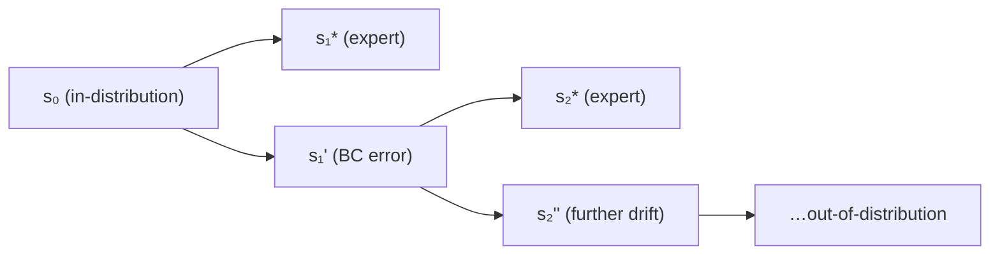

# Behavioral Cloning and Imitation Learning

## Table of Contents

- [[#1. The Imitation Learning Setting|1. The Imitation Learning Setting]]
- [[#2. Behavioral Cloning|2. Behavioral Cloning]]
  - [[#2.1 The Algorithm|2.1 The Algorithm]]
  - [[#2.2 BC as KL Divergence Minimization|2.2 BC as KL Divergence Minimization]]
- [[#3. The Covariate Shift Problem|3. The Covariate Shift Problem]]
  - [[#3.1 Distribution Shift Under Execution|3.1 Distribution Shift Under Execution]]
  - [[#3.2 Error Compounding The O T² Bound|3.2 Error Compounding: The O(T²) Bound]]
- [[#4. DAgger Online Imitation Learning|4. DAgger: Online Imitation Learning]]
  - [[#4.1 The Algorithm|4.1 The Algorithm]]
  - [[#4.2 No-Regret Guarantee|4.2 No-Regret Guarantee]]
- [[#5. Uses of BC in Reinforcement Learning|5. Uses of BC in Reinforcement Learning]]
  - [[#5.1 Policy Warm-Starting|5.1 Policy Warm-Starting]]
  - [[#5.2 Offline RL BC as a Regularizer|5.2 Offline RL: BC as a Regularizer]]
  - [[#5.3 Generative Adversarial Imitation Learning|5.3 Generative Adversarial Imitation Learning]]
  - [[#5.4 LLM Post-Training The SFT Stage|5.4 LLM Post-Training: The SFT Stage]]
- [[#References|References]]

---

## 1. The Imitation Learning Setting 🎯

In standard RL the reward function $r(s, a)$ is given and the agent must discover good behavior through interaction. *Imitation learning* (IL) inverts this: instead of a reward, we have access to a set of *expert demonstrations*, and the goal is to recover a policy that behaves like the expert.

**Formal setup.** Let $\mathcal{S}$ be the state space, $\mathcal{A}$ the action space, and $T$ the episode horizon. An expert policy $\pi^*$ generates a dataset of trajectories:

$$\mathcal{D} = \{\tau_i\}_{i=1}^N, \quad \tau_i = (s_0, a_0, s_1, a_1, \ldots, s_T)$$

where $a_t \sim \pi^*(a | s_t)$ and $s_{t+1} \sim P(s | s_t, a_t)$ from the environment dynamics. The state-action pairs $(s_t, a_t)$ are the *demonstrations*.

The goal is to learn a policy $\pi_\theta$ that matches $\pi^*$ without access to the reward function — only to $\mathcal{D}$.

> [!NOTE] Why no reward?
> In many settings the reward is hard to specify but expert behavior is easy to observe: a surgeon, a driver, a chess engine. Imitation learning sidesteps reward engineering entirely. The tradeoff is that the learned policy is only as good as the expert and is fragile outside the demonstrated distribution.

IL methods fall into three families, ordered by increasing complexity and data requirements:

| Family | Method | Expert interaction needed? |
|---|---|---|
| Offline imitation | Behavioral cloning | ❌ (static dataset) |
| Interactive imitation | DAgger | ✅ (can query expert at new states) |
| Reward recovery | Inverse RL, GAIL | ✅ or ❌ |

---

## 2. Behavioral Cloning 🤖

*Behavioral cloning* (BC) is the most direct approach: treat the demonstrations as a supervised learning dataset and train $\pi_\theta$ to predict expert actions from states.

### 2.1 The Algorithm

**Given:** a dataset $\mathcal{D} = \{(s_t, a_t)\}$ of expert state-action pairs.

**Minimize** the negative log-likelihood of expert actions under the learned policy:

$$\mathcal{L}_\text{BC}(\theta) = -\frac{1}{|\mathcal{D}|}\sum_{(s,a) \in \mathcal{D}} \log \pi_\theta(a \,|\, s)$$

This is exactly *maximum likelihood estimation* of the conditional distribution $\pi^*(a|s)$ from i.i.d. samples. No environment interaction, no reward — just supervised learning.

> [!EXAMPLE] ALVINN (1989): the first BC system
> Pomerleau's ALVINN trained a neural network to map road images (state) to steering angles (action) from human driving demonstrations. The model learned to drive autonomously — but only on roads that resembled the training distribution. This foreshadowed BC's core failure mode.

### 2.2 BC as KL Divergence Minimization

The BC objective has a clean probabilistic interpretation. Treating each $(s, a)$ pair as drawn from the *joint expert distribution* $\rho^*(s, a) = d^*(s)\,\pi^*(a|s)$ (where $d^*(s)$ is the state marginal induced by the expert), minimizing $\mathcal{L}_\text{BC}$ is equivalent to minimizing:

$$D_\text{KL}(\rho^*(s,a) \,\|\, d^*(s)\,\pi_\theta(a|s)) = \mathbb{E}_{s \sim d^*, a \sim \pi^*}\!\left[\log\frac{\pi^*(a|s)}{\pi_\theta(a|s)}\right]$$

The first term (entropy of $\pi^*$) is constant in $\theta$, so this reduces to maximizing $\mathbb{E}[\log \pi_\theta(a|s)]$ — exactly $-\mathcal{L}_\text{BC}$.

📐 **Key observation:** BC minimizes KL divergence between $\pi^*$ and $\pi_\theta$ *under the expert's state distribution $d^*$*. It makes no guarantees about $\pi_\theta$'s behavior under its *own* state distribution $d^{\pi_\theta}$ — the distribution it induces when actually executed. This asymmetry is the root of the covariate shift problem.

---

> [!QUESTION] Exercise 1: BC as Forward vs. Reverse KL
> *This problem shows that BC's choice of KL direction has significant consequences.*
>
> > **Prerequisites:** [[#2.2 BC as KL Divergence Minimization|§2.2 BC as KL Divergence Minimization]]
>
> BC minimizes $D_\text{KL}(\pi^* \| \pi_\theta)$ (forward KL, averaged over $d^*$). An alternative is to minimize $D_\text{KL}(\pi_\theta \| \pi^*)$ (reverse KL). (a) What behavior does each KL direction encourage — *mean-seeking* or *mode-seeking*? (b) Which direction is easier to optimize from samples, and why? (c) If the expert is multi-modal (e.g., sometimes turns left, sometimes turns right at a junction), what does forward KL produce?

> [!TIP]- Solution to Exercise 1
> **Key insight:** Forward KL $D_\text{KL}(p \| q)$ is large when $q(x) \approx 0$ but $p(x) > 0$ — it penalizes $q$ for missing mass. Reverse KL $D_\text{KL}(q \| p)$ is large when $q(x) > 0$ but $p(x) \approx 0$ — it penalizes $q$ for placing mass where $p$ doesn't.
>
> **Sketch:**
> (a) Forward KL → *mean-seeking*: $\pi_\theta$ must cover all modes of $\pi^*$, averaging over them. Reverse KL → *mode-seeking*: $\pi_\theta$ concentrates on one mode of $\pi^*$ and ignores others.
> (b) Forward KL is easier: $-\mathcal{L}_\text{BC} = \mathbb{E}_{a \sim \pi^*}[\log \pi_\theta(a|s)]$ requires only samples from $\pi^*$, which the demonstrations provide. Reverse KL requires samples from $\pi_\theta$, which changes during training — requiring RL-style optimization.
> (c) With a bimodal expert (turn left or right), forward KL produces a $\pi_\theta$ that averages the modes, potentially outputting a "go straight" action that is catastrophic at a junction.

---

## 3. The Covariate Shift Problem ⚠️

### 3.1 Distribution Shift Under Execution

BC minimizes loss under the *expert's* state distribution $d^*(s)$. But at test time, $\pi_\theta$ induces its *own* state distribution $d^{\pi_\theta}(s)$, which differs from $d^*$ whenever $\pi_\theta \neq \pi^*$.

The problem compounds over time. Suppose $\pi_\theta$ makes a small error at time $t=1$, landing in a state $s_1' \neq s_1^\text{expert}$. From $s_1'$, the policy was never trained (it saw only expert states), so it may make a larger error at $t=2$, landing even further from the expert trajectory. Each mistake enlarges the gap between $d^{\pi_\theta}$ and $d^*$, causing subsequent mistakes to be larger still.

### 3.2 Error Compounding: The O(T²) Bound

*Ross & Bagnell (2010)* formalize this intuition with a sharp bound.

**Setup.** Let $\epsilon$ be the BC policy's expected per-step mistake rate under the *expert* state distribution:

$$\epsilon = \max_t\, \mathbb{E}_{s \sim d_t^*}\!\left[\mathbf{1}[\pi_\theta(s) \neq \pi^*(s)]\right]$$

**Theorem (Ross & Bagnell, 2010).** Under mild Lipschitz assumptions on the dynamics, the total cost of the BC policy over a horizon $T$ satisfies:

$$J(\pi_\theta) \leq J(\pi^*) + O(\epsilon T^2)$$

*The error grows quadratically in $T$*, not linearly. Even a tiny per-step error rate $\epsilon$ is catastrophic for long horizons.

**Proof sketch.** At time $t$, the TV distance between $d_t^{\pi_\theta}$ and $d_t^*$ accumulates at rate $\sim \epsilon$ per step: $\|d_t^{\pi_\theta} - d_t^*\|_\text{TV} \leq \epsilon t$. The cost difference at step $t$ is bounded by $\epsilon t \cdot C_\text{max}$. Summing over $t = 0, \ldots, T-1$:

$$J(\pi_\theta) - J(\pi^*) \leq C_\text{max} \sum_{t=0}^{T-1} \epsilon t = C_\text{max}\,\epsilon\,\frac{T(T-1)}{2} = O(\epsilon T^2)$$

**Contrast with on-policy RL.** A policy that can query the reward at each step suffers only $O(\epsilon T)$ degradation, because it corrects at every step rather than compounding. BC's $O(T^2)$ penalty is the price of being purely offline.

> [!WARNING] Long-horizon brittleness
> *BC works well for short horizons and high-quality demonstrations, and degrades rapidly otherwise.* In autonomous driving with $T \sim 10^4$ steps, even $\epsilon = 10^{-3}$ produces $O(10^{-3} \times 10^8) = O(10^5)$ accumulated error — catastrophic. This is why pure BC is rarely used in production for long-horizon control.

---

> [!QUESTION] Exercise 2: Error Compounding Lower Bound
> *This problem shows the O(T²) bound is tight.*
>
> > **Prerequisites:** [[#3.2 Error Compounding The O T² Bound|§3.2 Error Compounding: The O(T²) Bound]]
>
> Construct a simple MDP where BC with per-step error $\epsilon$ achieves exactly $\Omega(\epsilon T^2)$ degradation. Specifically: let $\mathcal{S} = \mathbb{R}$, $\mathcal{A} = \{-1, +1\}$, dynamics $s_{t+1} = s_t + a_t$, expert always outputs $a^* = +1$ (walk right), and $\pi_\theta$ outputs $-1$ with probability $\epsilon$ at each step (independently). Compute the expected displacement of $\pi_\theta$ from the expert trajectory at time $T$.

> [!TIP]- Solution to Exercise 2
> **Key insight:** Each mistake shifts the trajectory left by 2 (instead of +1, we get -1, a difference of 2). Mistakes are Bernoulli($\epsilon$) i.i.d. per step.
>
> **Sketch:** Let $M_T = \sum_{t=0}^{T-1} \mathbf{1}[\text{mistake at }t]$ be the number of mistakes. $\mathbb{E}[M_T] = \epsilon T$. The displacement at time $T$ is $|s_T^{\pi_\theta} - s_T^{\pi^*}| = 2 M_T$, so $\mathbb{E}[\text{displacement}] = 2\epsilon T$.
>
> For the *cost* to be $\Theta(\epsilon T^2)$: modify the MDP so that cost is proportional to the cumulative displacement $\sum_t |s_t^{\pi_\theta} - s_t^*|$. After the first mistake at time $\tau$, the displacement grows as $2(t - \tau)$ for all future steps $t > \tau$. The expected cumulative displacement is $\sum_{t=0}^{T-1}\sum_{\tau=0}^{t} \epsilon \cdot 2(t-\tau) = 2\epsilon \cdot \Theta(T^2)$, confirming the bound is tight.

---

## 4. DAgger: Online Imitation Learning 🔄

*DAgger* (Dataset Aggregation, Ross et al. 2011) fixes the covariate shift problem by querying the expert *at the states the learned policy actually visits*, rather than only at expert states.

### 4.1 The Algorithm

**Initialize:** $\mathcal{D}_0 = \mathcal{D}$ (initial expert demonstrations), $\pi_1 = \hat\pi_1(\mathcal{D}_0)$ (BC policy).

**For** iteration $n = 1, 2, \ldots, N$:

1. **Execute** $\pi_n$ in the environment to collect a trajectory $\tau_n = (s_0, s_1, \ldots, s_T)$
2. **Query** the expert for labels at the visited states: $a_t^* = \pi^*(s_t)$ for all $t$
3. **Aggregate:** $\mathcal{D}_n = \mathcal{D}_{n-1} \cup \{(s_t, a_t^*)\}$
4. **Train** a new policy $\pi_{n+1} = \hat\pi(\mathcal{D}_n)$ by BC on the full aggregated dataset

The key move: by labeling states from $d^{\pi_n}$ (not just $d^*$), the training distribution gradually covers the states the policy will encounter. The policy learns to recover from its own mistakes because it has seen those states during training.

> [!NOTE] Expert queryability assumption
> DAgger requires querying $\pi^*(s)$ at arbitrary states $s \sim d^{\pi_n}$ — states the expert may never have visited. This is stronger than BC's assumption (only expert trajectories needed). It is natural when the expert is a simulator or oracle but problematic when the expert is a human who must respond in real-time to novel situations.

### 4.2 No-Regret Guarantee

DAgger is analyzed as an *online learning* algorithm. Let $\hat\ell_n(\pi) = \mathbb{E}_{s \sim d^{\pi_n}}[\mathbf{1}[\pi(s) \neq \pi^*(s)]]$ be the per-step loss of policy $\pi$ under the state distribution of the $n$-th iterate.

**Theorem (Ross et al., 2011).** After $N$ iterations, the average policy $\bar\pi_N = \frac{1}{N}\sum_{n=1}^N \pi_n$ satisfies:

$$J(\bar\pi_N) \leq J(\pi^*) + O\!\left(\epsilon^* T + \sqrt{\frac{\log N}{N}} \cdot T^2\right)$$

where $\epsilon^* = \min_\pi \mathbb{E}_{s \sim d^\pi}[\ell(\pi, s)]$ is the best achievable loss in the policy class.

**Key improvement over BC:** The dominant term is $O(\epsilon^* T)$ — *linear* in $T$, matching the on-policy RL bound — rather than BC's $O(\epsilon T^2)$. The $\sqrt{\log N / N}$ term vanishes as $N \to \infty$.

The proof maps DAgger to the *Follow-the-Leader* online learning algorithm: at each round the learner picks the policy that minimizes loss on all data seen so far. Follow-the-Leader achieves $O(\sqrt{N})$ regret on the per-step losses, which translates (after multiplying by the horizon $T$) to the bound above.

---

> [!QUESTION] Exercise 3: DAgger Reduces to BC at Iteration 1
> *This problem grounds DAgger in the simpler BC analysis.*
>
> > **Prerequisites:** [[#4.1 The Algorithm|§4.1 The Algorithm]], [[#3.2 Error Compounding The O T² Bound|§3.2 Error Compounding: The O(T²) Bound]]
>
> At iteration $n=1$, DAgger executes $\pi_1$ (the initial BC policy) and queries the expert at the visited states. Show that: (a) if $\pi_1 = \pi^*$ exactly, DAgger adds no new information and the algorithm terminates at BC; (b) if $\pi_1$ makes per-step errors at rate $\epsilon$, the new states added to $\mathcal{D}_1$ are concentrated in a TV ball of radius $O(\epsilon T)$ around $d^*$. What does this imply about how quickly DAgger covers the out-of-distribution states?

> [!TIP]- Solution to Exercise 3
> **Key insight:** The TV distance $\|d^{\pi_1} - d^*\|_\text{TV} \leq \epsilon T$ (from the covariate shift analysis). DAgger's dataset $\mathcal{D}_1$ labels precisely those out-of-distribution states.
>
> **Sketch:** (a) If $\pi_1 = \pi^*$, then $d^{\pi_1} = d^*$, so the new states are already in $\mathcal{D}_0$ — no new information. (b) At iteration 1, DAgger covers a $O(\epsilon T)$ TV ball around $d^*$. At iteration 2, $\pi_2$ is trained on $\mathcal{D}_0 \cup \mathcal{D}_1$ and makes smaller errors, covering a smaller additional TV ball. By induction, the coverage gap shrinks geometrically, which is why the bound converges to $O(\epsilon^* T)$ — the best achievable error under the policy class, with no compounding.

---

## 5. Uses of BC in Reinforcement Learning 🔑

BC is not just an alternative to RL — it is a *component* inside many modern RL systems.

### 5.1 Policy Warm-Starting

RL from scratch is slow: the policy must discover good behavior through random exploration before the reward signal provides useful gradients. BC provides a shortcut: *pre-train $\pi_\theta$ on demonstrations via BC, then fine-tune with RL*.

This warm-starting pattern appears in:
- **AlphaGo / AlphaStar / OpenAI Five:** BC on human games initializes the policy before self-play RL
- **Robotics:** BC on teleoperation data initializes locomotion and manipulation policies
- **RLHF for LLMs:** the *supervised fine-tuning (SFT)* stage (§5.4)

The benefit: RL starts from a policy that already produces reasonable behavior, so the reward signal can immediately do useful work rather than searching from scratch. The risk: if the BC pre-trained policy is poor, RL may take longer to escape the bad initialization than starting from scratch.

### 5.2 Offline RL: BC as a Regularizer

In *offline RL*, the agent must learn from a fixed dataset $\mathcal{D}$ of transitions without environment interaction. Naively applying Q-learning or policy gradient to offline data leads to *overestimation*: the policy learns to exploit out-of-distribution actions that the Q-function incorrectly values highly.

**TD3+BC (Fujimoto & Gu, 2021)** adds a BC regularization term to the standard actor loss:

$$\mathcal{L}_\text{actor}(\theta) = -\lambda \mathbb{E}_{(s,a) \in \mathcal{D}}\!\left[Q_\phi(s, \pi_\theta(s))\right] + \mathbb{E}_{(s,a) \in \mathcal{D}}\!\left[\|\pi_\theta(s) - a\|^2\right]$$

The second term penalizes deviation from the *behavioral policy* (the policy that collected $\mathcal{D}$) — it is a quadratic BC loss. The combined objective maximizes Q-value while staying close to demonstrated behavior, preventing out-of-distribution extrapolation.

This strategy — maximize reward, regularize toward BC — is the offline RL analog of the KL-penalized RL objective in [[concepts/reinforcement-learning/rejection-sampling-as-rl|rejection sampling as RL]]:

$$\mathcal{J}(\pi) = \mathbb{E}[r] - \beta\,D_\text{KL}(\pi \| \pi_\text{BC})$$

where $\pi_\text{BC}$ plays the role of $\pi_\text{ref}$.

### 5.3 Generative Adversarial Imitation Learning

*GAIL* (Ho & Ermon, 2016) reframes imitation learning as a GAN problem. Instead of directly matching $\pi_\theta$ to $\pi^*$ via BC, GAIL trains:

- A **discriminator** $D_\phi(s, a) \in [0,1]$ that tries to distinguish expert $(s,a)$ pairs from $\pi_\theta$'s rollouts
- The **policy** $\pi_\theta$ that tries to fool $D_\phi$ — i.e., produce $(s,a)$ pairs that look like the expert

The policy objective uses the discriminator output as a surrogate reward and optimizes it with any RL algorithm (e.g., TRPO):

$$\mathcal{L}_\text{GAIL} = \mathbb{E}_{(s,a) \sim \pi^*}[\log D_\phi(s,a)] + \mathbb{E}_{(s,a) \sim \pi_\theta}[\log(1 - D_\phi(s,a))]$$

GAIL avoids specifying a reward function entirely — the discriminator *learns* the reward implicitly. At the GAN saddle point, $D_\phi(s,a) = 1/2$ everywhere, meaning $\pi_\theta$ and $\pi^*$ are indistinguishable.

> [!INFO] GAIL vs BC vs IRL
> BC directly clones state-action pairs. IRL first recovers a reward function $\hat{r}(s,a)$ from demonstrations, then runs RL with $\hat{r}$. GAIL short-circuits IRL: the discriminator implicitly encodes $\hat{r}(s,a) = \log D/(1-D)$ — the reward emerges from adversarial training without an explicit recovery step.

### 5.4 LLM Post-Training: The SFT Stage

The *supervised fine-tuning* (SFT) stage of RLHF is behavioral cloning on human-written demonstrations.

**Setup.** Given a dataset $\mathcal{D}_\text{SFT} = \{(x_i, y_i)\}$ of (prompt, response) pairs written by humans:

$$\mathcal{L}_\text{SFT}(\theta) = -\sum_{(x,y) \in \mathcal{D}_\text{SFT}} \log \pi_\theta(y | x)$$

This is exactly BC: the "state" is the prompt $x$, the "action" is the response $y$, and the "expert" is the human annotator. The resulting $\pi_\text{SFT}$ is then used as $\pi_\text{ref}$ for the subsequent RL stage (PPO or GRPO).

The SFT → RL pipeline is the warm-starting pattern from §5.1 applied to language models:
1. **BC (SFT):** learn to imitate good responses
2. **RL:** fine-tune $\pi_\text{SFT}$ to maximize reward while staying close (KL penalty)

RAFT itself is a fusion of both stages: it uses RL (reward filtering) to improve the demonstrations, then BC (SFT) to imitate the improved set. Each RAFT iteration is a micro SFT→RL→SFT cycle, as derived in [[concepts/reinforcement-learning/rejection-sampling-as-rl|rejection sampling as RL]].

> [!DANGER] BC in LLMs inherits covariate shift
> *LLM SFT suffers the same covariate shift pathology as classical BC.* At inference, the model generates token-by-token — each token is a "step," and $T$ can be hundreds. A single bad token shifts the generation into a distribution the SFT model never saw during training (since it always saw the ground-truth prefix). This is one reason pure SFT models are *sycophantic* or *hallucinate*: they confidently continue from bad prefixes they were never trained on. RL (RLHF) corrects this by training on the model's *own* rollouts — the DAgger fix applied to language.

---

> [!QUESTION] Exercise 4: SFT as BC and the Covariate Shift Connection
> *This problem connects the LLM SFT stage to the classical BC error compounding analysis.*
>
> > **Prerequisites:** [[#3.2 Error Compounding The O T² Bound|§3.2 Error Compounding: The O(T²) Bound]], [[#5.4 LLM Post-Training The SFT Stage|§5.4 LLM Post-Training: The SFT Stage]]
>
> Model LLM text generation as a BC problem with state $s_t = (x, a_{1:t-1})$ (prompt + prefix generated so far), action $a_t$ (next token), horizon $T$ (response length), and per-step error rate $\epsilon$. (a) Apply the Ross–Bagnell bound to bound the total degradation in generation quality. (b) If $\epsilon = 10^{-3}$ and $T = 200$ tokens, what does the bound predict? (c) Why does teacher forcing during SFT training mask this problem, and what does RLHF do differently?

> [!TIP]- Solution to Exercise 4
> **Key insight:** Teacher forcing trains on $(s_t^\text{gold}, a_t^\text{gold})$ pairs — the expert's prefix is always fed in. At inference, the model sees its *own* prefix — a distribution shift accumulating over $T$ steps.
>
> **Sketch:**
> (a) By the Ross–Bagnell bound, $J(\pi_\text{SFT}) \leq J(\pi^*) + O(\epsilon T^2)$.
> (b) $\epsilon T^2 = 10^{-3} \times 4 \times 10^4 = 40$ — a large additive penalty relative to a response of length 200.
> (c) Teacher forcing hides covariate shift: at training time, $s_t$ is always the gold prefix, so $d^\text{training} = d^*$ and the error rate appears to be $\epsilon$. But at inference, errors in $a_{t-1}$ corrupt $s_t$, triggering compounding. RLHF rolls out the model's own completions and trains on them — the DAgger correction — so $d^\text{training} \to d^{\pi_\theta}$ and the $O(T^2)$ term shrinks toward $O(\epsilon^* T)$.

---

## References

| Reference Name | Brief Summary | Link |
|---|---|---|
| Pomerleau (1989), *ALVINN: An Autonomous Land Vehicle in a Neural Network* | First behavioral cloning system; learned to drive from human demonstrations using a feedforward network | [NIPS 1989](https://proceedings.neurips.cc/paper/1989/hash/89f0fd5c927d466d6ec9a21b9ac34ffa-Abstract.html) |
| Ross & Bagnell (2010), *Efficient Reductions for Imitation Learning* | Proves the O(T²) error compounding bound for BC; introduces the SMILe algorithm as an early online IL method | [AISTATS 2010](https://proceedings.mlr.press/v9/ross10a.html) |
| Ross, Gordon & Bagnell (2011), *A Reduction of Imitation Learning and Structured Prediction to No-Regret Online Learning* | Introduces DAgger; proves O(εT) guarantee via reduction to online learning with no-regret algorithms | [AISTATS 2011](https://proceedings.mlr.press/v15/ross11a.html) |
| Ho & Ermon (2016), *Generative Adversarial Imitation Learning* | Frames imitation learning as a GAN problem; shows IL can be solved without explicit reward recovery via adversarial training | [NeurIPS 2016](https://proceedings.neurips.cc/paper/2016/hash/cc7e2b878868cbae992d1fb743995d8f-Abstract.html) |
| Fujimoto & Gu (2021), *A Minimalist Approach to Offline Reinforcement Learning* | TD3+BC: adds BC regularization term to TD3 actor loss to prevent out-of-distribution exploitation in offline RL | [NeurIPS 2021](https://proceedings.neurips.cc/paper/2021/hash/a8166da05c5a094f7dc03724b41886e5-Abstract.html) |
| Ziegler et al. (2019), *Fine-Tuning Language Models from Human Preferences* | Establishes the SFT → RL pipeline for LLMs; SFT stage is BC on human demonstrations; RL stage is PPO with KL penalty | [arXiv:1909.08593](https://arxiv.org/abs/1909.08593) |
| Ouyang et al. (2022), *Training Language Models to Follow Instructions with Human Feedback* | InstructGPT/ChatGPT training recipe; makes the SFT → reward model → PPO pipeline concrete at scale | [NeurIPS 2022](https://proceedings.neurips.cc/paper_files/paper/2022/hash/b1efde53be364a73914f58805a001731-Abstract-Conference.html) |
