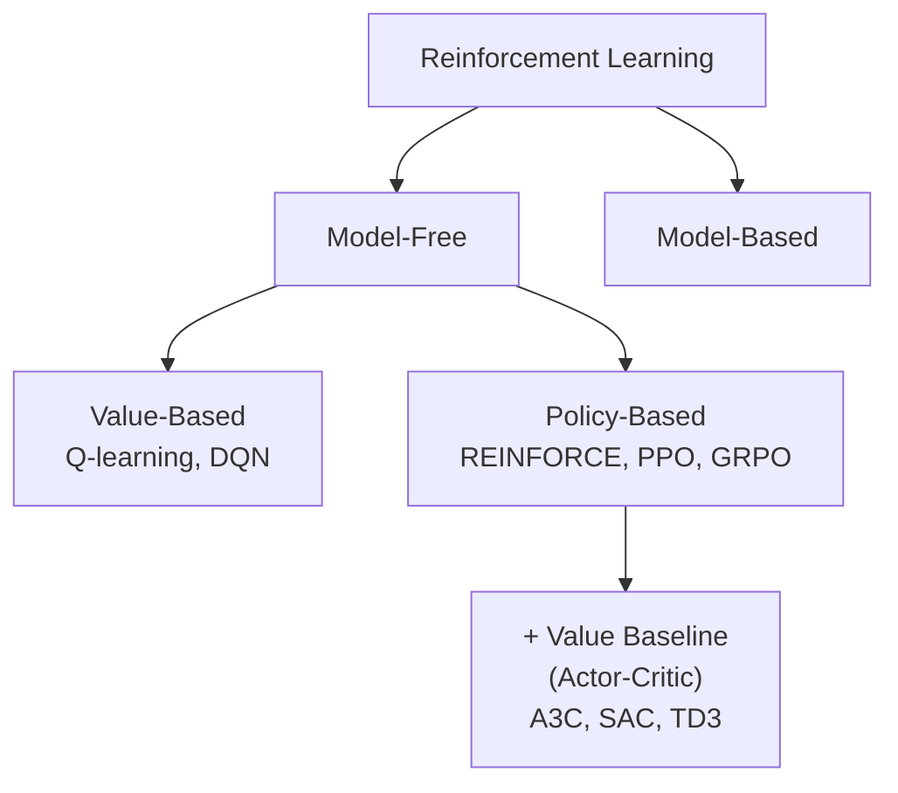

# The Landscape of Reinforcement Learning

## Table of Contents

- [[#1. The Two True Axes|1. The Two True Axes]]
  - [[#1.1 Axis 1 Model-Based vs. Model-Free|1.1 Axis 1: Model-Based vs. Model-Free]]
  - [[#1.2 Axis 2 Value-Based vs. Policy-Based|1.2 Axis 2: Value-Based vs. Policy-Based]]
  - [[#1.3 Where Actor-Critic Fits|1.3 Where Actor-Critic Fits]]
- [[#2. Why Value Functions Are Fundamental|2. Why Value Functions Are Fundamental]]
  - [[#2.1 Bellman's Principle of Optimality|2.1 Bellman's Principle of Optimality]]
  - [[#2.2 Value Functions Inside Policy Gradient|2.2 Value Functions Inside Policy Gradient]]
  - [[#2.3 Three Practical Reasons|2.3 Three Practical Reasons]]
- [[#3. The Policy Gradient Theorem|3. The Policy Gradient Theorem]]
- [[#4. The Full Algorithm Map|4. The Full Algorithm Map]]
- [[#References|References]]

---

## 1. The Two True Axes 🗺️

A common framing divides RL into three paradigms — value-based, policy gradient, and actor-critic. This is misleading. Actor-critic is not a third paradigm; it is *policy gradient with a value-function baseline*. The critic exists purely for variance reduction. Stripping away that conflation, RL algorithm design is governed by two orthogonal axes.

### 1.1 Axis 1: Model-Based vs. Model-Free

**Does the agent learn a model of the environment?**

A *model* here means an explicit representation of the transition dynamics $P(s' \mid s, a)$ and/or the reward function $r(s,a)$. With a model, the agent can *plan* — simulate trajectories mentally before acting.

| | Model-Free | Model-Based |
|---|---|---|
| Learns | $Q^*$ or $\pi$ from data directly | $\hat{P}(s'\|s,a)$, then plans |
| Sample efficiency | Lower | Higher |
| Failure mode | Needs many real transitions | Model errors compound; Dyna-style agents can overfit to wrong model |
| Examples | Q-learning, PPO, SAC | Dyna, MuZero, AlphaZero, Dreamer |

Model-based methods can be dramatically more sample-efficient — they extract value from each transition by replaying it through the learned model (Dyna) or by using the model to guide search (MuZero). The cost is that model errors compound: a slightly wrong $\hat{P}$ generates slightly wrong imagined trajectories, and a policy trained on those can fail badly in the real environment.

> [!INFO] AlphaGo / AlphaZero
> These are model-based: the environment model is *given* (the rules of Go), not learned. Monte Carlo Tree Search (MCTS) uses this model to plan. The value network $V_\theta(s)$ and policy network $\pi_\theta(s)$ are trained to improve MCTS, but the model itself is exact. MuZero extends this by *learning* the model from scratch.

### 1.2 Axis 2: Value-Based vs. Policy-Based

Within model-free methods, **how is the policy represented?**

**Value-based:** The policy is *implicit*. Learn $Q^*(s,a)$; the policy is $\pi(s) = \arg\max_a Q^*(s,a)$. No explicit policy parameters — the policy exists only as a derived object. This requires the $\arg\max$ to be tractable, which restricts to discrete action spaces.

**Policy-based:** The policy is *explicit*. Parameterize $\pi_\theta(a \mid s)$ directly — a distribution over actions — and optimize $\theta$ to maximize expected return. Works for discrete and continuous actions, but must discard rollouts after each gradient step (on-policy constraint), making it sample-inefficient.

The two approaches target different optimization problems:

$$\text{Value-based: } \min_Q \|Q - \mathcal{T}Q\|^2 \qquad \text{Policy-based: } \max_\theta\,J(\theta) = \mathbb{E}_{\pi_\theta}\!\left[\sum_t \gamma^t r_t\right]$$

### 1.3 Where Actor-Critic Fits

*Actor-critic* is the label for policy-based methods that also learn a value function. The value function (the "critic") does not change the optimization target — the agent is still maximizing $J(\theta)$ — but it provides a *baseline* that reduces the variance of the policy gradient estimator.

The "actor" is $\pi_\theta$; the "critic" is $V_\phi$ or $Q_\phi$, used to compute advantages $A(s,a) = Q(s,a) - V(s)$. Actor-critic is a *technique*, not a paradigm. PPO — the dominant algorithm in LLM post-training — is actor-critic: the language model is the actor, a small value head trained on the same rollouts is the critic.

---

> [!QUESTION] Exercise 1: Classification
> *This problem builds fluency with the two-axis taxonomy.*
>
> > **Prerequisites:** [[#1.1 Axis 1 Model-Based vs. Model-Free|§1.1]], [[#1.2 Axis 2 Value-Based vs. Policy-Based|§1.2]]
>
> Classify each of the following algorithms along both axes (model-based/free and value/policy-based), and justify each choice: (a) SARSA, (b) AlphaZero, (c) REINFORCE with a learned $V_\phi$ baseline, (d) RAFT for LLMs, (e) Dyna-Q.

> [!TIP]- Solution to Exercise 1
> **Key insight:** The model-based/free axis is about whether $P(s'|s,a)$ is learned or used; the value/policy axis is about how the policy is represented.
>
> **Sketch:**
> (a) SARSA: model-free (learns $Q^\pi$ from samples), value-based (policy derived greedily from $Q$).
> (b) AlphaZero: model-based (uses the exact game rules as a model for MCTS), policy-based (the policy network $\pi_\theta$ is trained explicitly; MCTS improves it).
> (c) REINFORCE + $V_\phi$: model-free, policy-based (actor-critic variant — $V_\phi$ is a baseline, not the policy representation).
> (d) RAFT: model-free, policy-based — the policy $\pi_\theta$ is the LLM, trained by SFT on filtered rollouts. No value function, no model.
> (e) Dyna-Q: model-based (learns $\hat{P}$ and uses it to generate imagined transitions), value-based (updates $Q$ on both real and imagined transitions via Q-learning).

---

## 2. Why Value Functions Are Fundamental 💡

Value functions appear even in nominally "model-free, policy-based" methods. This is not an accident — it follows from the mathematical structure of optimal sequential decision-making.

### 2.1 Bellman's Principle of Optimality

**Bellman (1957):**

> *An optimal policy has the property that, whatever the initial state and initial decision are, the remaining decisions must constitute an optimal policy with regard to the state resulting from the first decision.*

This *principle of optimality* is the recursive structure of optimal control. It says: the optimal decision problem decomposes by state. The value function $V^*(s)$ — the expected return of the optimal policy from state $s$ — is the quantity that captures this decomposition:

$$V^*(s) = \max_a\,\mathbb{E}_{s'}\!\left[r(s,a) + \gamma\,V^*(s')\right]$$

This is not an algorithm; it is a *characterization*. Any optimal policy must satisfy it. The Bellman equation is therefore not a design choice — it is a mathematical constraint that any solution to the MDP must obey.

**Why this implies value functions are unavoidable.** If you want to find $\pi^*$, you are implicitly looking for the solution to the Bellman equation — whether or not you compute $V^*$ or $Q^*$ explicitly. A policy gradient method that finds $\pi^*$ has, in some sense, implicitly solved for the value function, even if it never represents it.

> [!INFO] Historical context
> Bellman introduced these equations in the context of *dynamic programming* (DP) for deterministic optimal control in the 1950s. The RL community independently rediscovered the same structure. TD learning (Sutton, 1988) and Q-learning (Watkins, 1989) are stochastic approximation algorithms for solving the Bellman equation from data — DP without a model.

### 2.2 Value Functions Inside Policy Gradient

The *policy gradient theorem* (Sutton et al., 1999) states that for a parameterized policy $\pi_\theta$ with expected return $J(\theta) = \mathbb{E}_{\pi_\theta}[\sum_t \gamma^t r_t]$:

$$\nabla_\theta J(\theta) = \mathbb{E}_{s \sim d^{\pi_\theta},\, a \sim \pi_\theta(\cdot|s)}\!\left[\nabla_\theta \log \pi_\theta(a \mid s)\cdot Q^{\pi_\theta}(s,a)\right]$$

where $d^{\pi_\theta}(s) = (1-\gamma)\sum_{t=0}^\infty \gamma^t \Pr(s_t = s \mid \pi_\theta)$ is the discounted state visitation measure.

**$Q^{\pi_\theta}$ appears inside the gradient.** This is not optional — it is the exact gradient of $J$. Any policy gradient method must estimate $Q^{\pi_\theta}(s,a)$ somehow:

- **REINFORCE:** estimates $Q^{\pi_\theta}(s,a) \approx G_t = \sum_{t'=t}^\infty \gamma^{t'-t} r_{t'}$ with the empirical return. Unbiased but high variance.
- **Actor-Critic:** estimates $Q^{\pi_\theta}$ with a learned $Q_\phi$ or advantage $A_\phi = Q_\phi - V_\phi$. Lower variance, some bias from $Q_\phi$ approximation.
- **PPO / GRPO:** estimate $Q^{\pi_\theta}$ via rollout returns and normalize by a group-level baseline — see [[concepts/reinforcement-learning/rejection-sampling-as-rl|rejection sampling as RL]].

The difference between REINFORCE and actor-critic is not *whether* to use a value function — it is *how accurately* to estimate the one that already appears in the gradient.

### 2.3 Three Practical Reasons

Beyond the theoretical necessity, value functions are indispensable for three engineering reasons:

**1. Variance reduction is unavoidable at long horizons.** The Monte Carlo return $G_t = \sum_{t'=t}^T \gamma^{t'-t} r_{t'}$ has variance that grows with $T$ — noise in any single reward propagates through the entire sum. Subtracting a baseline $b(s)$ reduces variance without introducing bias (since $\mathbb{E}_{a \sim \pi}[\nabla_\theta \log\pi_\theta(a|s) \cdot b(s)] = 0$). The *optimal* baseline is $V^{\pi_\theta}(s)$, which minimizes the variance of the gradient estimator. Without it, policy gradient methods become impractical for $T \gg 1$.

**2. Temporal credit assignment.** In an episode of length $T$, reward at step $T$ must influence the policy gradient at step $0$. Monte Carlo waits until episode end and then assigns credit backward — expensive and noisy. TD learning does this incrementally via the Bellman equation: $\delta_t = r_t + \gamma V(s_{t+1}) - V(s_t)$ propagates the reward signal back one step per update. Accumulated over many steps, this is equivalent to the full return. Credit assignment at scale requires a value function to make this propagation efficient.

**3. Off-policy reuse.** Value functions can be trained on *any* transitions, regardless of which policy collected them — the Bellman equation holds for $Q^*$ regardless of the data distribution. This enables experience replay (reusing old transitions many times), dramatically increasing sample efficiency. Policy gradient methods must use fresh on-policy rollouts because the log-probability ratio $\pi_\theta(a|s)/\pi_{\theta_\text{old}}(a|s)$ diverges as $\pi_\theta$ moves — PPO clips this ratio precisely to allow small off-policy excursions, but cannot stray far. Value functions have no such restriction.

---

> [!QUESTION] Exercise 2: The Optimal Baseline
> *This problem derives why $V^{\pi_\theta}(s)$ is the variance-minimizing baseline.*
>
> > **Prerequisites:** [[#2.2 Value Functions Inside Policy Gradient|§2.2 Value Functions Inside Policy Gradient]]
>
> The policy gradient estimator with baseline $b(s)$ is $\hat{g} = \nabla_\theta \log\pi_\theta(a|s) \cdot (Q^{\pi_\theta}(s,a) - b(s))$. (a) Show this estimator is unbiased for any $b(s)$ that does not depend on $a$. (b) Compute $\frac{d}{db}\text{Var}[\hat{g}]$ and set it to zero to find the $b^*(s)$ that minimizes variance. (c) Show $b^*(s) \approx V^{\pi_\theta}(s)$ under a simplifying approximation.

> [!TIP]- Solution to Exercise 2
> **Key insight:** The bias-free condition uses $\mathbb{E}_a[\nabla_\theta \log\pi_\theta \cdot b] = b\,\mathbb{E}_a[\nabla_\theta\log\pi_\theta] = 0$ (the score function has zero mean). Variance minimization then gives the optimal baseline.
>
> **Sketch:**
> (a) $\mathbb{E}_a[\nabla_\theta\log\pi_\theta(a|s)\cdot b(s)] = b(s)\sum_a \pi_\theta(a|s)\nabla_\theta\log\pi_\theta(a|s) = b(s)\nabla_\theta\sum_a\pi_\theta(a|s) = b(s)\nabla_\theta 1 = 0$.
> (b) Let $g_a = \nabla_\theta\log\pi_\theta(a|s)$. $\text{Var}[\hat{g}] = \mathbb{E}_a[\|g_a\|^2(Q_a - b)^2] - (\mathbb{E}_a[g_a(Q_a-b)])^2$. Differentiating w.r.t. $b$ and setting to zero: $b^*(s) = \frac{\mathbb{E}_a[\|g_a\|^2 Q_a]}{\mathbb{E}_a[\|g_a\|^2]}$ — a weighted average of $Q$ values.
> (c) If $\|g_a\|^2 \approx c$ is approximately constant across actions, $b^*(s) \approx \mathbb{E}_a[Q_a] = V^{\pi_\theta}(s)$. This is the usual actor-critic baseline.

---

## 3. The Policy Gradient Theorem 📐

Since the theorem is so central, a brief derivation is warranted.

**Goal:** compute $\nabla_\theta J(\theta)$ where $J(\theta) = \sum_s d^{\pi_\theta}(s) V^{\pi_\theta}(s)$.

Expanding $V^{\pi_\theta}(s) = \sum_a \pi_\theta(a|s) Q^{\pi_\theta}(s,a)$ and differentiating:

$$\nabla_\theta V^{\pi_\theta}(s) = \sum_a \nabla_\theta\pi_\theta(a|s)\,Q^{\pi_\theta}(s,a) + \sum_a \pi_\theta(a|s)\,\nabla_\theta Q^{\pi_\theta}(s,a)$$

Expanding $\nabla_\theta Q^{\pi_\theta}$ via the Bellman equation $Q^{\pi_\theta}(s,a) = r + \gamma\sum_{s'} P(s'|s,a) V^{\pi_\theta}(s')$ and recursively unrolling gives:

$$\nabla_\theta V^{\pi_\theta}(s) = \sum_{s'}\left(\sum_{t=0}^\infty \gamma^t \Pr(s_t=s'|s_0=s,\pi_\theta)\right)\sum_a \nabla_\theta\pi_\theta(a|s')\,Q^{\pi_\theta}(s',a)$$

Using the log-derivative trick $\nabla_\theta\pi_\theta(a|s) = \pi_\theta(a|s)\nabla_\theta\log\pi_\theta(a|s)$ and averaging over the initial state distribution:

$$\boxed{\nabla_\theta J(\theta) = \mathbb{E}_{s \sim d^{\pi_\theta},\,a \sim \pi_\theta}\!\left[\nabla_\theta\log\pi_\theta(a|s)\cdot Q^{\pi_\theta}(s,a)\right]}$$

> [!NOTE] What the theorem says about the landscape
> $\nabla_\theta J$ depends on $Q^{\pi_\theta}$ — the value function of the *current* policy, not the optimal $Q^*$. This means: (1) you only need to evaluate the current policy, not solve for $Q^*$; (2) as $\pi_\theta$ improves, $Q^{\pi_\theta}$ must be re-estimated; (3) actor-critic methods alternate between improving $\pi_\theta$ (actor step) and updating the estimate of $Q^{\pi_\theta}$ (critic step).

---

## 4. The Full Algorithm Map 📊

| Algorithm | Model-free/based | Value/policy | Key idea |
|---|---|---|---|
| Q-learning / DQN | Model-free | Value-based | Stochastic approx. of Bellman optimality; see [[concepts/reinforcement-learning/q-learning\|Q-learning note]] |
| SARSA | Model-free | Value-based | On-policy TD; evaluates behavior policy |
| REINFORCE | Model-free | Policy-based | Monte Carlo PG; high variance, no value function |
| PPO | Model-free | Policy-based (AC) | Clipped IS ratio + value baseline; dominant in LLM RL |
| GRPO | Model-free | Policy-based | Group-normalized advantage; no separate value network |
| A3C / A2C | Model-free | Policy-based (AC) | Async parallel actor-critic; bootstrapped critic |
| SAC | Model-free | Policy-based (AC) | Entropy-regularized; soft Bellman equations |
| TD3 | Model-free | Policy-based (AC) | Double Q-trick + delayed policy update for continuous actions |
| RAFT / RAFT++ | Model-free | Policy-based | Rejection sampling + SFT; see [[concepts/reinforcement-learning/rejection-sampling-as-rl\|rejection sampling note]] |
| Behavioral Cloning | — (no reward) | Policy-based | Imitation; see [[concepts/reinforcement-learning/behavioral-cloning\|behavioral cloning note]] |
| Dyna | Model-based | Value-based | Real + imagined transitions for Q-learning |
| MuZero / AlphaZero | Model-based | Policy-based (AC) | Learned/given model + MCTS planning |

**The throughline:** every algorithm in this table either (a) directly optimizes a Bellman equation, or (b) uses a value function to improve the gradient estimate for policy optimization, or (c) uses a model to generate data for (a) or (b). Bellman's principle is the spine of the entire field.

---

## References

| Reference Name | Brief Summary | Link |
|---|---|---|
| Bellman (1957), *Dynamic Programming* | Introduces the principle of optimality and Bellman equations; the mathematical foundation of all value-based RL | [Princeton University Press](https://press.princeton.edu/books/paperback/9780691146683/dynamic-programming) |
| Sutton et al. (1999), *Policy Gradient Methods for Reinforcement Learning with Function Approximation* | Proves the policy gradient theorem; establishes that $Q^{\pi_\theta}$ appears inside the exact gradient of $J$ | [NeurIPS 1999](https://proceedings.neurips.cc/paper/1999/hash/464d828b85b0bed98e80ade0a5c43b0f-Abstract.html) |
| Sutton & Barto (2018), *Reinforcement Learning: An Introduction* | Standard textbook; chapters 3–4 cover MDPs and Bellman equations; chapter 13 covers the policy gradient theorem | [Online edition](http://incompleteideas.net/book/the-book-2nd.html) |
| Schulman et al. (2017), *Proximal Policy Optimization* | PPO: the dominant policy-based algorithm; uses clipped IS ratios + value baseline | [arXiv:1707.06347](https://arxiv.org/abs/1707.06347) |
| Haarnoja et al. (2018), *Soft Actor-Critic* | SAC: entropy-regularized actor-critic for continuous control; uses soft Bellman equations | [arXiv:1801.01290](https://arxiv.org/abs/1801.01290) |
| Silver et al. (2017), *Mastering the Game of Go without Human Knowledge* | AlphaZero: model-based (known game rules) + policy-based (explicit $\pi_\theta$) + MCTS planning | [Nature 550](https://www.nature.com/articles/nature24270) |
