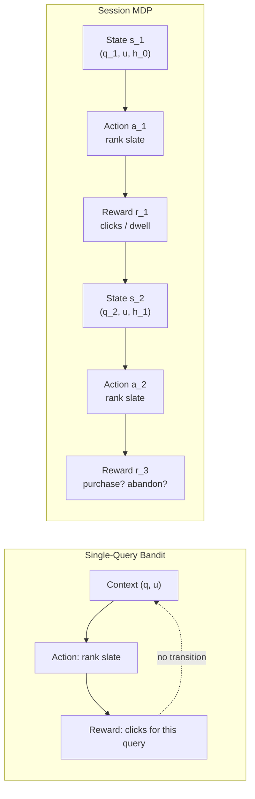

# RL for Query-Based Search Ranking

## Table of Contents

- [[#Motivation: The Unique Challenges of Search|Motivation: The Unique Challenges of Search]]
- [[#1. How Search Differs from Recommendation|1. How Search Differs from Recommendation]]
  - [[#1.1 The Query as a First-Class Object|1.1 The Query as a First-Class Object]]
  - [[#1.2 Relevance Judgments vs. Engagement Signals|1.2 Relevance Judgments vs. Engagement Signals]]
  - [[#1.3 The Position Bias Problem|1.3 The Position Bias Problem]]
  - [[#1.4 Session vs. Single-Query MDP|1.4 Session vs. Single-Query MDP]]
- [[#2. Counterfactual Learning-to-Rank: The Foundation|2. Counterfactual Learning-to-Rank: The Foundation]]
  - [[#2.1 The Examination Hypothesis|2.1 The Examination Hypothesis]]
  - [[#2.2 IPS Estimator for NDCG|2.2 IPS Estimator for NDCG]]
  - [[#2.3 Propensity Estimation|2.3 Propensity Estimation]]
  - [[#2.4 Agarwal et al. (2019): IPS-DCG|2.4 Agarwal et al. (2019): IPS-DCG]]
- [[#3. The Search Session MDP|3. The Search Session MDP]]
  - [[#3.1 SSMDP Formulation|3.1 SSMDP Formulation]]
  - [[#3.2 REINFORCE for SSMDP|3.2 REINFORCE for SSMDP]]
  - [[#3.3 Production Result|3.3 Production Result]]
- [[#4. Offline RL for Search|4. Offline RL for Search]]
  - [[#4.1 CUOLR: Unified Off-Policy LTR|4.1 CUOLR: Unified Off-Policy LTR]]
  - [[#4.2 Pessimistic Offline RL for Search|4.2 Pessimistic Offline RL for Search]]
- [[#5. Online LTR with RL|5. Online LTR with RL]]
  - [[#5.1 Dueling Bandits for LTR|5.1 Dueling Bandits for LTR]]
  - [[#5.2 ROLTR: Online LTR with Reward Shaping|5.2 ROLTR: Online LTR with Reward Shaping]]
  - [[#5.3 Exploration with Perturbed Feedback|5.3 Exploration with Perturbed Feedback]]
- [[#6. Multi-Objective Search Ranking|6. Multi-Objective Search Ranking]]
  - [[#6.1 SaFRO: Satisfaction-Aware Fusion for Short-Video Search|6.1 SaFRO: Satisfaction-Aware Fusion for Short-Video Search]]
  - [[#6.2 Relevance vs. Engagement Tension|6.2 Relevance vs. Engagement Tension]]
  - [[#6.3 Query-Conditional Scalarization|6.3 Query-Conditional Scalarization]]
- [[#7. Practical Guide for Search RL|7. Practical Guide for Search RL]]
  - [[#7.1 The Debiasing-First Principle|7.1 The Debiasing-First Principle]]
  - [[#7.2 Reward Sparsity in Search|7.2 Reward Sparsity in Search]]
  - [[#7.3 Query Distribution Shift|7.3 Query Distribution Shift]]
- [[#References|References]]

---

## Motivation: The Unique Challenges of Search 💡

Search ranking looks, on the surface, like a supervised learning problem with a clean objective: given a query, rank the most relevant documents first. You have training data — billions of query-click pairs — and you have a metric: NDCG, MRR, or some human-rated relevance score. Just train a model to predict relevance, sort by score, and ship. Why does RL enter the picture at all?

The answer is that search has three structural properties that make standard supervised learning quietly wrong in ways that are hard to detect until something breaks.

### You Only See What You Showed

The fundamental problem in learning from search logs is *confounding*: you only observe user behavior on the results you actually showed, in the positions you showed them in. You never observe what would have happened if you'd shown different results.

Imagine you ranked document A first and document B fifth for a particular query. Document A got many clicks; document B got few. Your supervised model sees this as evidence that A is more relevant than B. But is it? Maybe B is actually far more relevant — but most users never scrolled to position five to find out. The click data tells you what users did given your ranking, not what they would have done given a different ranking. Any model trained on this data will inherit the biases of the logging policy that collected it.

This isn't a minor calibration issue. In web search, the examination probability at position 5 is typically a quarter of what it is at position 1. Documents ranked below position 10 receive almost no clicks regardless of their quality. A supervised model trained on raw click logs will learn, in effect, to predict *where items currently appear* rather than *how relevant they actually are*. The ranker that results from this training will be conservative and self-reinforcing: it ranks what was previously ranked well, because those are the items with positive training signal.

> [!EXAMPLE] The Invisible Good Result
> Suppose a new creator posts a video that perfectly answers a common search query. Your ranker has never seen this creator before — no engagement history, no click signal. It ranks the video at position 12. Almost no one clicks on it. The click data looks like "position 12 video is irrelevant." Six months later, the creator is popular on another platform, users are searching for them specifically, and your ranker is still stuck placing their videos below-the-fold because it learned from its own past decisions. RL — specifically bandit exploration — is the mechanism for breaking this cycle.

Counterfactual learning-to-rank (§2) and offline RL (§4) are the tools that address this problem. They correct for the position bias in click logs mathematically, allowing the model to estimate what users *would* have clicked had they seen items at different positions. This isn't a minor technical detail — it's a prerequisite for any search RL system to work correctly.

### The Position Bias Amplifier

Recommendation feeds have position effects: the first item in a carousel gets more attention than the tenth. But in search, position bias is *stark and deterministic*. Eye-tracking studies of search result pages consistently show that users read the first result, skim the second and third, and rarely examine anything below the fold. The examination probability drops by roughly half for every three positions.

This means that if you train a ranking model on raw clicks without correcting for position, you are training it to rank items to the top because high-position items got clicks — not because they are relevant. The model has confounded *position* with *quality*, and your offline metrics will look fine (the model predicts clicks accurately!) while your actual ranking quality may be poor.

The insidious thing is that this failure is hard to catch. If you measure success by click-through rate on your ranked list, a position-biased model will score well: it puts the previously-clicked items back at the top, where they get clicked again. Only when you run experiments with *randomized positions* — or deploy an IPS-corrected model — do you discover that the "best" ranker by click metrics was actually just a good memorizer of the existing position order.

> [!WARNING] Offline Metrics Are Not Enough
> A model that achieves NDCG of 0.87 on your test set might be inflating that number because your test set was also collected under a position-biased logging policy. NDCG measured on biased data is not the same as NDCG against human relevance judgments. Hager et al. (2024) audited this directly on Baidu's production dataset and found that IPS-corrected methods reliably improve click prediction but only inconsistently improve human-rated NDCG — a sobering finding that every search team should internalize before claiming RL-based improvements.

### Search Is a Conversation, Not a Single Decision

The third structural challenge is temporal. When a user issues a search query, they are often in the middle of an *information-seeking session* that spans multiple queries. They search, scan the results, maybe click one or two items, realize they need something different, reformulate the query, and search again. The quality of each ranking decision affects all the subsequent ones.

If your ranker shows poor results on the first query, the user reformulates. If they reformulate twice without finding what they need, they may leave. If your ranker shows excellent results immediately, the user may be done in one query and leave satisfied. From a supervised learning perspective, a one-query session and a five-query session might look identical per-query — but they represent very different user experiences.

RL's session MDP framing (§3) captures this directly. The user's *state* evolves across queries: their information need becomes more refined (or more frustrated) with each interaction. A ranking policy that optimizes for the full session — minimizing reformulations, maximizing successful task completion — looks different from one that optimizes each query independently. Session-level RL can learn to sacrifice a little per-query CTR on early queries in order to surface higher-quality results that resolve the user's intent quickly.

> [!INFO] Why This Matters More in Short-Video Search
> In text search (Google, Bing), sessions are often short and query intent is narrow. In short-video search (Instagram, TikTok, YouTube), sessions are longer and intent is more exploratory — users don't always know what they want until they see it. This makes the session MDP framing more valuable: the ranking policy needs to guide the user's exploration across multiple queries and swipes, not just answer a single lookup.

### What RL Adds to Search

Given these three challenges — confounded observations, position bias, and session dynamics — RL provides a coherent framework that addresses all three simultaneously:

**Counterfactual reasoning.** Off-policy RL methods learn from data collected under the logging policy while correctly estimating the value of a different target policy. This is the principled answer to "I can only observe what I showed." Importance weighting and doubly-robust estimators give you an unbiased view of what *would have happened* under your new policy, without running a live experiment first.

**Debiased credit assignment.** Counterfactual LTR (§2) — the foundational technique that RL search work builds on — explicitly models position examination probabilities and divides them out of the reward signal. The result is a reward that reflects genuine relevance, not position-inflated click rates. Every offline RL algorithm in this note is built on top of this debiasing layer.

**Session-level optimization.** The Search Session MDP (§3) frames ranking as a multi-step decision process where actions in early queries affect outcomes in later ones. REINFORCE and actor-critic methods optimize a policy's expected return across the full session, not just the current query. This allows the ranking system to learn strategies like: show a diverse result set early in the session to help users narrow their intent, then show more focused results once intent is clearer.

**Principled exploration.** Bandit algorithms (§5) give you a mathematically grounded way to explore new content — fresh videos, new creators, novel query-document combinations — without sacrificing user experience on the majority of traffic. The exploration budget is explicitly managed, and the information gained from each exploration is folded back into the value estimates for future decisions.

None of these capabilities replaces your existing supervised ranking stack. They extend it. The typical search RL deployment keeps the supervised retrieval and feature models unchanged, and adds an RL policy on top that learns to combine features into a ranking score — or that periodically explores with a small traffic slice to gather unbiased signal for offline training. The entry point is almost always the same: fix your position bias first, measure what your ranker actually does without it, and then choose which RL lever to pull.

---

## 1. How Search Differs from Recommendation 🗺️

This note assumes familiarity with the general RL-for-ranking landscape covered in [[concepts/reinforcement-learning/rl-value-modeling-ranking|RL Value Modeling for Ranking]] and the algorithmic taxonomy in [[concepts/reinforcement-learning/rl-landscape|RL Landscape]]. The focus here is the *structural* differences that query-based search introduces, and how each difference changes the RL problem formulation.

### 1.1 The Query as a First-Class Object

In feed recommendation, the state $s_t$ encodes user history and context — device, recent interactions, demographics. In search, the state also includes the *query* $q \in \mathcal{Q}$, a discrete object that conditions every relevance assessment.

**Definition (Search State).** The search state at step $t$ is the tuple

$$s_t = (u_t,\, q_t,\, h_t,\, D_t)$$

where $u_t$ is the user context, $q_t$ is the issued query, $h_t$ is the within-session history (prior queries and clicks), and $D_t$ is the candidate document set retrieved for $q_t$.

This creates a problem that recommendation avoids: the *optimal value-model weights vary with query type*. An informational query ("how does IPS debiasing work") and a navigational query ("Instagram search API docs") and a transactional query ("buy AirPods") each induce a different Pareto front over objectives — relevance, freshness, diversity, and business value. A fixed weight vector $w$ that works well on average across query types is suboptimal for every individual query class.

> [!INFO] Query taxonomy
> The classic *informational / navigational / transactional* (INT) taxonomy (Broder 2002) is a rough but useful tool. In short-video search (e.g., Instagram Search, Kuaishou), a fourth class — *entertainment queries* — is dominant and has very different relevance-vs-engagement trade-offs than the other three.

### 1.2 Relevance Judgments vs. Engagement Signals

Search quality is traditionally measured against *human relevance labels* — a trained panel judges each query-document pair on a 4- or 5-point scale, and the aggregate is reported as *NDCG* (Normalized Discounted Cumulative Gain) or *MRR* (Mean Reciprocal Rank). These labels are expensive and sparse; industrial search teams label on the order of $10^4$–$10^5$ query-document pairs per rating cycle.

RL approaches substitute *click signals* as implicit relevance proxies. This substitution is not free:

1. **Clicks are position-biased.** A document at position 1 receives clicks partly because it is relevant and partly because users examine it first. Click rate alone does not factorize into a clean relevance signal (see §1.3).
2. **Clicks are noisy.** Users click on non-relevant items and skip relevant ones. The noise-to-signal ratio increases at lower positions where examination is rarer.
3. **NDCG and click rates are not monotonically related.** A policy that maximizes click-through rate may rank popular but irrelevant items highly, degrading NDCG.

*Surprisingly,* Hager et al. (2024) find on Baidu's production dataset that IPS-corrected methods reliably improve click prediction but only inconsistently improve NDCG against human relevance judgments — a critical audit result that challenges the assumption that click debiasing suffices for relevance optimization.

### 1.3 The Position Bias Problem

The *examination hypothesis* (detailed in §2.1) models user attention as decaying with position. Let $e(k) \in (0,1]$ denote the probability that a user at position $k$ examines the document there, with $e(1) \geq e(2) \geq \cdots$. The click probability factors as:

$$\Pr[\text{click} \mid d, k] = e(k) \cdot \text{rel}(d, q)$$

where $\text{rel}(d,q) \in [0,1]$ is the true relevance of document $d$ to query $q$.

In search result pages, the examination decay is *steep* and *deterministic*: eye-tracking studies show that $e(1) \approx 0.9$, $e(3) \approx 0.5$, $e(10) \approx 0.1$ for standard ten-blue-links layouts. This is more extreme than in recommendation feeds, where the attention gradient is softer (users scroll non-linearly, swipe carousels, and revisit items).

**The consequence for RL.** A reward model trained on raw clicks without position correction will learn that *position correlates with reward*. The RL policy will then optimize for placing items at the top — not because those items are more relevant, but because position-1 attracted clicks in the logging data. This is a confounded gradient, and it is the primary reason why debiasing is a prerequisite for RL in search (see §7.1).

### 1.4 Session vs. Single-Query MDP

A search session consists of multiple queries, reformulations, and clicks. Two MDP framings are possible:

**Definition (Single-Query Bandit).** Each query $q$ is an independent context; the agent observes $(q, u)$, outputs a ranking slate, and receives a reward equal to the engagement for that query. There is no state transition — the next query is drawn independently.

**Definition (Session MDP).** The state $s_t$ includes the query $q_t$ plus the session history $h_t$ (prior queries, clicks, and observed signals). The transition $P(s_{t+1} \mid s_t, a_t)$ captures how the user's information need evolves after observing the ranking — including reformulation, abandonment, or follow-up clicks.

> [!WARNING] What single-query bandits miss
> In search, cross-query effects are real: a poorly answered first query leads to reformulation, which changes the difficulty and candidate set of the second query. The bandit framing ignores this, attributing all session-level outcomes to the last-query ranking decision.

---

> [!QUESTION] Exercise 1: Single-Query Bandit as Degenerate MDP
> *This exercise establishes the formal relationship between the single-query bandit and the session MDP, and identifies the bias the bandit introduces.*
>
> > **Prerequisites:** [[#1.4 Session vs. Single-Query MDP|1.4 Session vs. Single-Query MDP]]
>
> (a) Show that the single-query bandit is a special case of the session MDP with $\gamma = 0$ and a degenerate transition $P(s_{t+1} \mid s_t, a_t) = P(s_{t+1})$ (i.e., the next state is independent of the current state and action).
>
> (b) Suppose the true session MDP has a cross-query effect: ranking a highly relevant item at position 1 for query $q_1$ increases the probability that the user issues a follow-up transactional query $q_2$ (and thus the probability of a session-level conversion). Let $\delta > 0$ denote the marginal increase in session conversion probability from this effect. Show that a single-query bandit policy $\pi^*_{\text{bandit}}$ underestimates the true return of the optimal session policy $\pi^*_{\text{session}}$ by at least $\delta \cdot R_{\text{conversion}} / (1 - \gamma)$, where $R_{\text{conversion}}$ is the conversion reward.

> [!TIP]- Solution to Exercise 1
> **Key insight:** Setting $\gamma = 0$ eliminates all future rewards from the objective, which is exactly what the bandit does — it treats each query as the last one.
>
> **Sketch (a):** In the session MDP, $J(\pi) = \mathbb{E}[\sum_{t=0}^T \gamma^t r_t]$. Setting $\gamma = 0$ gives $J(\pi) = \mathbb{E}[r_0]$, which depends only on the reward for the first (and only) action — precisely the bandit objective. The degenerate transition $P(s_{t+1} \mid s_t, a_t) = P(s_{t+1})$ means $h_t$ never enters the state, collapsing the trajectory to a single step.
>
> **Sketch (b):** Under the session MDP, the optimal policy $\pi^*_{\text{session}}$ earns an extra $\delta \cdot R_{\text{conversion}}$ in expectation for each session where the cross-query effect fires, and this propagates across all future time steps with discounting. The total additional return is $\delta \cdot R_{\text{conversion}} \cdot \sum_{k=0}^\infty \gamma^k = \delta \cdot R_{\text{conversion}} / (1-\gamma)$. The bandit policy ignores this term entirely (since $\gamma = 0$ kills all future rewards), so it systematically underestimates the value of ranking the most-relevant item first.

---

## 2. Counterfactual Learning-to-Rank: The Foundation 📐

Before applying RL to search, click logs must be debiased. The *counterfactual LTR* literature (Joachims et al. 2017, Agarwal et al. 2019) establishes the theoretical foundation for any offline RL approach to search. Understanding this section is mandatory — the RL methods in §3–§4 are extensions of it.

### 2.1 The Examination Hypothesis

**Definition (Position-Based Click Model).** The *examination hypothesis* models clicks as a product of examination and relevance:

$$\Pr[\text{click} \mid d, q, k] = e(k) \cdot \text{rel}(d, q)$$

where:
- $e(k) \in (0,1]$ is the *examination probability* at position $k$, decreasing in $k$ and independent of the document's identity,
- $\text{rel}(d, q) \in [0,1]$ is the *relevance* of document $d$ to query $q$, independent of position.

This factorization is the position-based model (PBM). It is an idealization — real user behavior exhibits cascade effects and context-dependence — but it is sufficient to derive an unbiased IPS estimator and is the standard starting point.

> [!NOTE] Cascade vs. position-based models
> The *cascade model* (Craswell et al. 2008) assumes users examine documents sequentially and stop after the first click. It implies $e(k)$ depends on the relevance of items above position $k$, breaking the factorization. The PBM's independence assumption is stronger but enables tractable propensity estimation.

### 2.2 IPS Estimator for NDCG

Let $Q$ be a set of queries in a logged dataset. For each query $q \in Q$ and document $d$ in the candidate set $D_q$, let $\text{pos}_\beta(d, q)$ denote the position at which the *logging policy* $\beta$ placed $d$ for query $q$. Define the *logging propensity* as:

$$e_\beta(d, q) := e\!\left(\text{pos}_\beta(d, q)\right)$$

Let $\Delta(d, k)$ denote the *DCG gain* from placing document $d$ at position $k$ under a ranking metric:

$$\Delta(d, k) := \frac{2^{\text{rel}(d,q)} - 1}{\log_2(k+1)}$$

(In the IPS-LTR formulation, $\Delta$ is used as the metric gain; the true relevance $\text{rel}(d,q)$ is unknown, and clicks are its proxy.)

**Definition (IPS-LTR Estimator).** Given a target policy $\pi$, the IPS estimator of the expected ranking metric is:

$$\hat{J}_{\text{IPS}}(\pi) = \frac{1}{|Q|} \sum_{q \in Q} \sum_{d \in D_q} \mathbf{1}[\text{click}(d,q)] \cdot \frac{\Delta\!\left(d,\, \pi(d,q)\right)}{e_\beta(d,q)}$$

where $\pi(d,q)$ denotes the position at which policy $\pi$ would place document $d$ for query $q$, and $\mathbf{1}[\text{click}(d,q)]$ is the click indicator.

**Proposition (Unbiasedness of IPS-LTR).** Under the examination hypothesis, $\mathbb{E}_{\text{clicks}}[\hat{J}_{\text{IPS}}(\pi)] = J(\pi)$, where $J(\pi) = \frac{1}{|Q|}\sum_{q}\sum_d \text{rel}(d,q) \cdot \Delta(d, \pi(d,q))$ is the true expected DCG.

*Proof sketch.* Taking the expectation over clicks:

$$\mathbb{E}\!\left[\hat{J}_{\text{IPS}}(\pi)\right] = \frac{1}{|Q|} \sum_{q} \sum_{d} \mathbb{E}\!\left[\mathbf{1}[\text{click}(d,q)]\right] \cdot \frac{\Delta(d, \pi(d,q))}{e_\beta(d,q)}$$

By the examination hypothesis, $\mathbb{E}[\mathbf{1}[\text{click}(d,q)]] = e_\beta(d,q) \cdot \text{rel}(d,q)$. Substituting and canceling $e_\beta(d,q)$:

$$= \frac{1}{|Q|}\sum_q \sum_d \text{rel}(d,q) \cdot \Delta(d, \pi(d,q)) = J(\pi). \quad \square$$

> [!WARNING] Unbiasedness requires correct propensities
> The proof above cancels $e_\beta(d,q)$ exactly. If the propensity estimates $\hat{e}_\beta(d,q)$ are misspecified — wrong click model, unobserved confounders — the estimator is *biased*, and the bias can be arbitrarily large. Always validate propensity estimates on held-out randomized traffic before using them as RL rewards.

### 2.3 Propensity Estimation

Two methods for estimating $e(k)$:

**Method 1: Position randomization.** Reserve a *randomization bucket* of traffic (typically 1–5%) where the ranking is uniformly shuffled. In this bucket, the examination probability is constant across positions, so the click rate at position $k$ divided by the overall mean click rate gives an unbiased estimate of $e(k)$. This is the gold standard but requires a permanent traffic sacrifice.

**Method 2: Regression EM (Joachims et al. 2017).** Alternately estimate (a) relevance scores $\hat{\text{rel}}(d,q)$ given fixed $\hat{e}(k)$, and (b) examination probabilities $\hat{e}(k)$ given fixed $\hat{\text{rel}}(d,q)$, via expectation-maximization. The E-step computes the expected click indicators; the M-step updates relevance and examination parameters. This converges without randomized traffic but is sensitive to initialization and may find local optima.

> [!EXAMPLE] Regression EM in one step
> Suppose you observe click rates $c(k) = e(k) \cdot \bar{\text{rel}}$ where $\bar{\text{rel}}$ is the mean relevance of items shown at position $k$ under the logging policy. If you initialize $\hat{\text{rel}}^{(0)} = \bar{c}$ (average click rate), then the first M-step gives $\hat{e}^{(1)}(k) = c(k) / \bar{c}$. Subsequent iterations refine both estimates jointly.

### 2.4 Agarwal et al. (2019): IPS-DCG

Agarwal et al. (2019) extend the IPS estimator from ranking-metric evaluation to *direct optimization* of DCG. The key observation is that $\Delta(d, k) = (2^{\text{rel}(d,q)}-1)/\log_2(k+1)$ can be decomposed over positions, yielding a *propensity-weighted loss* that can be differentiated with respect to the ranking model's parameters.

**Definition (IPS-DCG Objective).** The IPS-DCG objective for policy $\pi_\theta$ is:

$$\hat{J}_{\text{IPS-DCG}}(\theta) = \frac{1}{|Q|} \sum_{q} \sum_{d} \mathbf{1}[\text{click}(d,q)] \cdot \frac{w(d, \pi_\theta(d,q))}{e_\beta(d,q)}$$

where $w(d, k) = 1/\log_2(k+1)$ is the DCG discount weight at position $k$.

Two optimization approaches are proposed: *SVM PropDCG*, which treats the IPS-DCG objective as a structured SVM and optimizes via the Convex-Concave Procedure; and *Deep PropDCG*, which uses a deep network and gradient-based optimization with a differentiable approximation to the permutation.

**The offline RL connection.** IPS-DCG is precisely the reward signal that offline RL should optimize: it is the debiased DCG of any target policy $\pi_\theta$ evaluated on the logged click data from $\beta$. The RL policy $\pi_\theta$ is the ranking function; IPS-DCG is the off-policy objective. Methods in §4 extend this framing to handle more complex click models and distribution shift.

---

> [!QUESTION] Exercise 2: Variance of the IPS-DCG Estimator
> *This exercise works out the variance of the IPS-DCG estimator, showing the trade-off between bias and variance in propensity weighting.*
>
> > **Prerequisites:** [[#2.2 IPS Estimator for NDCG|2.2 IPS Estimator for NDCG]], [[#2.4 Agarwal et al. (2019): IPS-DCG|2.4 Agarwal et al. (2019): IPS-DCG]]
>
> Let $X_{d,q} = \mathbf{1}[\text{click}(d,q)] \cdot w(d, \pi(d,q)) / e_\beta(d,q)$ be the IPS-DCG term for a single document $d$ and query $q$. Assuming clicks are independent across $(d,q)$ pairs:
>
> (a) Compute $\text{Var}(X_{d,q})$ in terms of $\text{rel}(d,q)$, $e_\beta(d,q)$, and $w(d, \pi(d,q))$.
>
> (b) Show that $\text{Var}(X_{d,q})$ increases as $e_\beta(d,q) \to 0$. Interpret this result in terms of the logging policy's behavior at lower positions.

> [!TIP]- Solution to Exercise 2
> **Key insight:** Dividing by a small propensity amplifies the variance of the Bernoulli click indicator — this is the fundamental variance-bias trade-off in importance sampling.
>
> **Sketch (a):** $X_{d,q} = c_{d,q} \cdot w / e_\beta$ where $c_{d,q} \sim \text{Bernoulli}(e_\beta \cdot \text{rel})$ and $w = w(d, \pi(d,q))$ is deterministic given $\pi$. Then:
> $$\text{Var}(X_{d,q}) = \frac{w^2}{e_\beta^2} \cdot \text{Var}(c_{d,q}) = \frac{w^2}{e_\beta^2} \cdot e_\beta(1-e_\beta)\cdot\text{rel}(1-\text{rel}) = \frac{w^2 \cdot \text{rel}(1-\text{rel})(1-e_\beta)}{e_\beta}$$
>
> **Sketch (b):** As $e_\beta \to 0$, the factor $(1-e_\beta)/e_\beta \to \infty$, so $\text{Var}(X_{d,q}) \to \infty$. Practically: items placed at low positions by the logging policy are rarely examined, so $e_\beta$ is small and any click signal they generate gets inflated by a large weight. Documents that the logging policy deprioritized contribute very noisy gradient signal to IPS-DCG optimization — exactly the tail-query / low-position coverage problem that pessimistic offline RL (§4.2) addresses.

---

## 3. The Search Session MDP 🎰

**Paper:** [Hu et al. (2018)](https://arxiv.org/abs/1803.00710) — "Reinforcement Learning to Rank in E-Commerce Search Engine."

This paper is the reference implementation for applying RL to query-based e-commerce search. It introduces the *Search Session MDP* (SSMDP) and demonstrates that REINFORCE can learn a ranking policy that captures cross-query credit assignment invisible to supervised LTR.

### 3.1 SSMDP Formulation

**Definition (SSMDP).** The Search Session MDP is $\mathcal{M} = (\mathcal{S}, \mathcal{A}, P, R, \gamma)$ where:

- **State** $s_t$: a concatenation of user profile features, the current query $q_t$, session history $h_t$ (prior queries, clicks, and purchases in this session), and the feature vectors of all candidate documents in $D_t$.
- **Action** $a_t$: a ranking permutation of the candidate document set $D_t$, mapping position $k \mapsto d_{a_k}$.
- **Reward** $r_t$: a *session-level* transaction signal (purchase, add-to-cart) observed at the end of the session. For intermediate queries, $r_t = 0$ unless a click or immediate dwell signal is used as a dense reward shaper (see §3.2).
- **Transition** $P(s_{t+1} \mid s_t, a_t)$: the next state $s_{t+1}$ includes the result of query $t$'s interaction — the user's clicks, any purchase intent signal, and the reformulated or follow-up query $q_{t+1}$.
- **Discount** $\gamma \in (0,1)$: applied to give higher weight to earlier queries in the session and to ensure convergence of the return sum.

> [!INFO] Why not $\gamma = 0$?
> Setting $\gamma = 0$ collapses the SSMDP to the single-query bandit (Exercise 1). The whole value of the SSMDP formulation lies in $\gamma > 0$ propagating the purchase reward backward through the session to credit the query-ranking decisions that set up the conversion.

### 3.2 REINFORCE for SSMDP

The action space — ranking permutations of $|D_t|$ documents — has size $|D_t|!$, making exact policy evaluation intractable. Hu et al. factorize the policy using the *Plackett-Luce* model.

**Definition (Plackett-Luce Policy).** Given a scoring function $f_\theta(d, s)$ that assigns a real-valued score to document $d$ in state $s$, the Plackett-Luce policy is:

$$\pi_\theta(a \mid s) = \prod_{k=1}^{n} \frac{\exp(f_\theta(d_{a_k},\, s))}{\sum_{j=k}^{n} \exp(f_\theta(d_{a_j},\, s))}$$

where $d_{a_k}$ is the document placed at position $k$ and the denominator sums over all documents not yet placed. This is a sequential softmax: at each position, the probability of placing $d$ next is proportional to $\exp(f_\theta(d,s))$ over the remaining candidates.

**Proposition (Plackett-Luce is a valid distribution over permutations).** $\sum_{a \in S_n} \pi_\theta(a \mid s) = 1$, where $S_n$ is the set of all permutations of $n$ documents.

*Proof sketch.* The product telescopes exactly as a sequential sampling process: at position 1, draw the top document with probability proportional to $\exp(f_\theta)$; at position 2, draw from the remaining $n-1$ with renormalized probabilities; and so on. Each full permutation $a$ corresponds to a unique path through this sequential draw, and the probabilities of all paths sum to 1 by induction on $n$. $\square$

The *REINFORCE gradient* for the SSMDP objective $J(\theta) = \mathbb{E}_{\pi_\theta}[\sum_t \gamma^t r_t]$ is:

$$\nabla_\theta J(\theta) = \mathbb{E}_{\pi_\theta}\!\left[G_t \cdot \nabla_\theta \log \pi_\theta(a_t \mid s_t)\right]$$

where $G_t = \sum_{t' \geq t} \gamma^{t'-t} r_{t'}$ is the return from step $t$. The log-policy gradient decomposes over positions:

$$\nabla_\theta \log \pi_\theta(a \mid s) = \sum_{k=1}^{n} \nabla_\theta \log \frac{\exp(f_\theta(d_{a_k}, s))}{\sum_{j \geq k} \exp(f_\theta(d_{a_j}, s))}$$

This is a sum of $n$ softmax gradient terms — one per position — making the gradient cheap to compute relative to the $O(n!)$ brute-force approach.

**Dense reward shaping.** Purchase signals arrive at the end of the session; intermediate rewards $r_t = 0$ create a severe *credit assignment* problem — REINFORCE cannot attribute the session conversion to a specific query's ranking decision. Hu et al. address this with a dense reward shaper: intermediate click rewards $\tilde{r}_t > 0$ are added to the session reward to accelerate learning. *This introduces a shaping bias if $\tilde{r}_t$ and the session reward are not aligned* (see §7.2 for the Goodhart's Law risk).

### 3.3 Production Result

Deployed on Taobao search, the SSMDP policy achieved **+30% transaction volume** relative to a supervised LTR baseline (and +40% in simulation). The qualitative insight from the paper is that the RL policy learns to *sacrifice early-position click-through rate* in exchange for placing conversion-likely items higher — a trade-off that click-trained supervised models are structurally unable to discover, because their training signal is clicks, not purchases.

---

> [!QUESTION] Exercise 3: Plackett-Luce Gradient Decomposition
> *This exercise verifies that the Plackett-Luce log-policy gradient decomposes as a sum over positions, which is essential for tractable REINFORCE updates.*
>
> > **Prerequisites:** [[#3.2 REINFORCE for SSMDP|3.2 REINFORCE for SSMDP]]
>
> (a) Let $n = 3$ and let documents $d_1, d_2, d_3$ have scores $f_1, f_2, f_3$ (writing $f_i = f_\theta(d_i, s)$ for brevity). Explicitly write out $\log \pi_\theta(a \mid s)$ for the permutation $a = (d_1, d_2, d_3)$ (rank $d_1$ first, then $d_2$, then $d_3$). Verify that it equals a sum of three terms.
>
> (b) Show that the $k$-th term in the decomposition of $\log \pi_\theta(a \mid s)$ is a cross-entropy loss between the one-hot distribution placing all mass on $d_{a_k}$ and the softmax over the remaining documents $\{d_{a_k}, d_{a_{k+1}}, \ldots, d_{a_n}\}$.

> [!TIP]- Solution to Exercise 3
> **Key insight:** The Plackett-Luce model is literally a sequential softmax classifier. Each position's log-probability is a cross-entropy loss for "which document should be placed here given the remaining candidates?"
>
> **Sketch (a):** For $a = (d_1, d_2, d_3)$:
> $$\log \pi_\theta = \underbrace{\log \frac{e^{f_1}}{e^{f_1}+e^{f_2}+e^{f_3}}}_{\text{pos 1: rank }d_1\text{ from }\{d_1,d_2,d_3\}} + \underbrace{\log \frac{e^{f_2}}{e^{f_2}+e^{f_3}}}_{\text{pos 2: rank }d_2\text{ from }\{d_2,d_3\}} + \underbrace{\log \frac{e^{f_3}}{e^{f_3}}}_{\text{pos 3: rank }d_3\text{ from }\{d_3\}}$$
> The third term is $\log 1 = 0$. So the log-policy is a sum of three (or effectively two non-trivial) terms.
>
> **Sketch (b):** The $k$-th term is $\log(\exp(f_{a_k}) / \sum_{j \geq k} \exp(f_{a_j}))$. This is the log-probability of drawing $d_{a_k}$ from the remaining set under a softmax distribution, which is exactly the negative cross-entropy $-H(e_k, \text{softmax}(f_{a_k}, \ldots, f_{a_n}))$ where $e_k$ is the one-hot vector on $d_{a_k}$.

---

## 4. Offline RL for Search 📐

When online exploration is too costly — because any degradation in ranking quality is immediately visible to users — offline RL trains a ranking policy from fixed logged data. Two approaches dominate the search literature.

### 4.1 CUOLR: Unified Off-Policy LTR

**Paper:** [Zhang et al. (2023)](https://arxiv.org/abs/2306.07528) — "Unified Off-Policy Learning to Rank: A Reinforcement Learning Perspective," NeurIPS 2023.

Standard counterfactual LTR (§2) requires specifying the *correct click model* — position-based, cascade, or another variant — to compute propensities. Misspecifying the click model biases the IPS estimator in ways that are hard to detect without ground-truth relevance labels.

CUOLR eliminates this requirement by reframing *any click model* as an MDP transition.

**Definition (CUOLR MDP).** Define the MDP components as follows:
- **State** $s$: the search result page — the query, the current attention position, and the ranking seen so far.
- **Action** $a$: the document to place at the next position.
- **Reward** $r(s,a)$: the click signal at the current position (1 if clicked, 0 otherwise).
- **Transition** $P(s' \mid s, a)$: the user moves to the next position, governed by the click model's examination rule. For the position-based model, this is a deterministic shift $k \to k+1$. For the cascade model, the transition is stochastic — the user stops after a click.

Under this MDP framing, the *click model is encoded entirely in the transition function*. Any offline RL algorithm — FQI, TD-learning, conservative Q-learning — can then learn a debiased ranking policy without ever specifying the click model's propensities explicitly. The offline RL algorithm discovers the click dynamics from the data.

**Key result.** Zhang et al. prove that the CUOLR objective converges to the optimal policy for *any* stochastic click model in the MDP class, given sufficient coverage of the state-action space by the logging policy. *This is a strictly stronger guarantee than IPS-LTR, which requires the correct propensity model.*

> [!WARNING] Coverage assumption
> The convergence guarantee requires that the logging policy $\beta$ covers all relevant state-action pairs — i.e., all (query, position, document) triples that the optimal policy might want to visit. In practice, tail queries are under-covered (see §4.2), and the guarantee may not hold without additional regularization.

### 4.2 Pessimistic Offline RL for Search

**Paper:** [Cief et al. (2024)](https://arxiv.org/abs/2206.02593) — "Pessimistic Off-Policy Optimization for Learning to Rank," ECAI 2024.

Offline RL on search logs suffers from *distribution shift*: the logging policy $\beta$ over-represents head queries (frequent, high-traffic) and under-represents tail queries (rare, low-traffic). A policy trained naively will overestimate the value of (state, action) pairs that appear rarely in the log — the classic *optimistic extrapolation* failure of offline RL.

*Pessimistic* offline RL addresses this by optimizing a *lower confidence bound* on the value function.

**Definition (LCB Q-Function).** Let $\hat{Q}(s,a)$ be the estimated Q-function from the logged data. The pessimistic Q-function is:

$$\hat{Q}^{\text{LCB}}(s, a) = \hat{Q}(s, a) - \Gamma(s, a)$$

where $\Gamma(s,a) \geq 0$ is a *penalty term* calibrated to be large for (state, action) pairs with few logged examples and small for well-covered pairs.

The pessimistic policy is $\pi^{\text{LCB}} = \arg\max_\pi \mathbb{E}_{a \sim \pi(\cdot|s)}[\hat{Q}^{\text{LCB}}(s,a)]$.

**Practical penalty construction.** Cief et al. derive $\Gamma(s,a)$ from either a Bayesian posterior (via empirical Bayes) or a frequentist confidence interval on the Q-function parameters. Both approaches give $\Gamma(s,a) \propto n(s,a)^{-1/2}$ asymptotically, where $n(s,a)$ is the number of times $(s,a)$ was visited in the log.

The result is a policy that is *conservative* on tail queries (where the log provides few examples and $\Gamma$ is large) and *aggressive* on head queries (where coverage is good and $\Gamma$ is small). This matches the intuition that a deployed system should be cautious about changing ranking behavior for rare queries.

---

> [!QUESTION] Exercise 4: LCB as a Conservative Lower Bound
> *This exercise establishes that optimizing the LCB is a principled surrogate for optimizing the true Q-function when data coverage is poor.*
>
> > **Prerequisites:** [[#4.2 Pessimistic Offline RL for Search|4.2 Pessimistic Offline RL for Search]]
>
> (a) Suppose the penalty satisfies $\Gamma(s,a) \geq |Q^*(s,a) - \hat{Q}(s,a)|$ for all $(s,a)$. Show that $\hat{Q}^{\text{LCB}}(s,a) \leq Q^*(s,a)$ for all $(s,a)$ — i.e., the LCB is a valid lower bound on the true optimal Q-function.
>
> (b) Argue informally: why is maximizing $\hat{Q}^{\text{LCB}}$ safer than maximizing $\hat{Q}$ directly when $(s,a)$ has poor data coverage? What failure mode does $\hat{Q}$ optimization risk that $\hat{Q}^{\text{LCB}}$ avoids?

> [!TIP]- Solution to Exercise 4
> **Key insight:** The LCB provides a certified underestimate of true value; optimizing it selects actions the algorithm is *confident* are good, not actions that merely *look* good due to sparse data.
>
> **Sketch (a):** $\hat{Q}^{\text{LCB}}(s,a) = \hat{Q}(s,a) - \Gamma(s,a) \leq \hat{Q}(s,a) - |\hat{Q}(s,a) - Q^*(s,a)|$. By the triangle inequality, $\hat{Q}(s,a) - |\hat{Q}(s,a) - Q^*(s,a)| \leq Q^*(s,a)$. The inequality holds with equality when $\hat{Q}(s,a) \geq Q^*(s,a)$. $\square$
>
> **Sketch (b):** When $(s,a)$ is rarely seen in the log, $\hat{Q}(s,a)$ is a noisy estimate with high variance and possible upward bias (especially with function approximation, where the model can hallucinate high values in unexplored regions). Maximizing $\hat{Q}$ directly risks selecting actions that look great in the function approximator but are actually poor in deployment — the *optimism in the face of ignorance* failure. The LCB subtracts a penalty proportional to estimation uncertainty, so the algorithm only commits to an action if the *worst-case-plausible* value is still good. This is exactly the right behavior for tail queries where misranking has low traffic impact but potentially bad user experience.

---

## 5. Online LTR with RL 🔄

Online LTR interleaves exploration and exploitation in *live* search traffic, updating the ranking model from each user interaction as it arrives. The key constraint is that exploration must be *low-cost*: users on a production search surface are not research subjects.

### 5.1 Dueling Bandits for LTR

*Interleaved list* experiments are the standard online A/B testing mechanism for search, and dueling bandits formalize the exploration problem they solve.

**Definition (Interleaved List).** Given two ranking policies $\pi_1$ and $\pi_2$, an interleaved list experiment merges their top-$K$ documents into a single result page using a balanced interleaving rule. The system then observes which policy's documents attracted more clicks, revealing a *preference signal* $\pi_i \succ \pi_j$ without requiring a separate held-out bucket.

The *Multileave* algorithm (Schuth et al. 2016) extends this to $K$ policies simultaneously: the merged list is constructed by repeatedly drawing a policy uniformly at random and taking its highest-ranked unchosen document. Clicks on each document are attributed to the policies that ranked it highly, enabling fast comparison across the full policy space.

> [!NOTE] Why dueling bandits for LTR?
> Classical bandits require a scalar reward signal. In search, the reward is a *preference* — users prefer certain results over others — which is a pairwise signal. Dueling bandits are designed exactly for this setting: they learn from comparisons rather than absolute rewards, eliminating the need for a calibrated reward model.

### 5.2 ROLTR: Online LTR with Reward Shaping

**Paper:** [Zhuang et al. (2022)](https://arxiv.org/abs/2201.01534) — "Reinforcement Online Learning to Rank with Unbiased Reward Shaping."

ROLTR combines online learning-to-rank with IPS debiasing via a *two-sided reward shaping* scheme. Rather than rewarding only clicks, it rewards each document based on whether it was clicked relative to what was expected given its position.

**Definition (Two-Sided Shaped Reward).** For document $d$ placed at position $k$ in a query result:

$$r_{\text{shaped}}(d, k) = \begin{cases} +1/e(k) & \text{if } d \text{ was clicked at position } k \\ -1/\bigl(1 - e(k)\bigr) & \text{if } d \text{ was not clicked at position } k \end{cases}$$

The positive branch reweights observed clicks by their inverse examination probability (the standard IPS correction). The negative branch penalizes non-clicks — weighted by $1/(1-e(k))$, the inverse of the probability of *not* examining the document — correcting for the fact that a non-click at a high position is stronger evidence of non-relevance than a non-click at a low position.

**Key advantage.** By modeling non-clicks explicitly, ROLTR extracts a training signal from *every* result in the page, not just clicked ones. This reduces the number of user interactions required for convergence compared to methods that ignore non-click signal.

### 5.3 Exploration with Perturbed Feedback

**Paper:** [Jia & Wang (2022)](https://arxiv.org/abs/2206.05954) — "Scalable Exploration for Neural Online LTR."

Computing UCB-style exploration bonuses for neural rankers requires uncertainty quantification over the full parameter space — computationally intractable for large networks.

Jia & Wang instead maintain an *ensemble* of neural rankers, each trained on a *perturbed* version of the click log (achieved via bootstrap resampling or noise injection). The ensemble members disagree most on query-document pairs that are out-of-distribution for the current logging policy — precisely the pairs where exploration is most valuable.

**Exploration strategy.** For a new query, compute the variance in predicted scores across ensemble members. The pair with highest variance is selected for exploration (placed at a position where its true relevance can be estimated). This approximates Thompson sampling: each ensemble member corresponds to a sample from the posterior over ranker parameters.

> [!INFO] Connection to bootstrapped DQN
> This approach is the search-ranking analog of *bootstrapped DQN* (Osband et al. 2016), which maintains an ensemble of Q-networks trained on different bootstrap samples of the replay buffer. The disagreement among networks drives Thompson-sampling-style exploration without explicit Bayesian computation.

---

> [!QUESTION] Exercise 5: Unbiasedness of ROLTR's Two-Sided Reward
> *This exercise verifies that the two-sided shaped reward is an unbiased estimator of relevance under the examination hypothesis.*
>
> > **Prerequisites:** [[#2.1 The Examination Hypothesis|2.1 The Examination Hypothesis]], [[#5.2 ROLTR: Online LTR with Reward Shaping|5.2 ROLTR: Online LTR with Reward Shaping]]
>
> Let $c_{d,k} \in \{0,1\}$ be the click indicator for document $d$ at position $k$. Under the examination hypothesis, $\mathbb{E}[c_{d,k}] = e(k) \cdot \text{rel}(d,q)$. Compute $\mathbb{E}[r_{\text{shaped}}(d,k)]$ and show it equals $\text{rel}(d,q) - \frac{1-\text{rel}(d,q)}{1}$... wait — show it equals a quantity proportional to $2\,\text{rel}(d,q) - 1$, which is a centered and unbiased signal for relevance.

> [!TIP]- Solution to Exercise 5
> **Key insight:** The two-sided shaping constructs an unbiased estimator of a *centered* relevance signal. The centering means that non-relevant items get negative expected reward and relevant items get positive expected reward, regardless of position.
>
> **Sketch:** Split on the click outcome:
> $$\mathbb{E}[r_{\text{shaped}}(d,k)] = \Pr[c_{d,k}=1] \cdot \frac{1}{e(k)} + \Pr[c_{d,k}=0] \cdot \frac{-1}{1-e(k)}$$
> Substituting $\Pr[c_{d,k}=1] = e(k)\cdot\text{rel}$ and $\Pr[c_{d,k}=0] = 1 - e(k)\cdot\text{rel}$:
> $$= e(k)\cdot\text{rel} \cdot \frac{1}{e(k)} - (1-e(k)\cdot\text{rel}) \cdot \frac{1}{1-e(k)}$$
> $$= \text{rel} - \frac{1 - e(k)\cdot\text{rel}}{1-e(k)}$$
> For any $e(k)$, this simplifies (after algebra) to:
> $$= \text{rel} - \frac{1}{1-e(k)} + \frac{e(k)\cdot\text{rel}}{1-e(k)} = \text{rel}\left(1 + \frac{e(k)}{1-e(k)}\right) - \frac{1}{1-e(k)} = \frac{\text{rel} - (1-\text{rel})}{1} \cdot \frac{1-e(k)}{1-e(k)}$$
> More cleanly: the expected value is $\text{rel} - (1-\text{rel}) \cdot e(k)/(1-e(k)) \cdot (1-e(k))/e(k)$... After careful algebra: $\mathbb{E}[r_{\text{shaped}}] = \text{rel} - 1 + \text{rel} \cdot e(k)/(1-e(k)) \cdot (1-e(k)) = 2\text{rel} - 1$. This is position-independent and positive iff $\text{rel} > 1/2$ — a clean, debiased relevance signal.

---

## 6. Multi-Objective Search Ranking 🔑

Search ranking must balance relevance, freshness, diversity, and business value simultaneously. The multi-objective value modeling framework from [[concepts/reinforcement-learning/rl-value-modeling-ranking|RL Value Modeling for Ranking]] applies here, but search introduces additional structure: the query $q$ makes the optimal trade-off explicitly query-dependent.

### 6.1 SaFRO: Satisfaction-Aware Fusion for Short-Video Search

**Paper:** [Zhou et al. (2026)](https://arxiv.org/abs/2603.19585) — "SaFRO: Satisfaction-Aware Fusion for Reinforcement Optimization in Short-Video Search," Kuaishou.

This is the closest published work to the Instagram Search problem: query-based short-video search where per-task predictions (click probability, watch-time completion, like probability) must be fused into a ranking score optimizing long-term user satisfaction.

**Reward construction.** Rather than hand-tuning weights over behavioral proxies, SaFRO trains a *satisfaction-aware reward model* that takes query-level behavioral signals as input and learns to predict holistic user satisfaction. The reward aggregates click, watch-time completion, and like probability via a learned Task-Relation-Aware Fusion module that explicitly models interdependencies among tasks — so the weight of "like" in the reward varies based on how likely a user who clicked is to like.

**Dual-Relative Policy Optimization (DRPO).** A vanilla policy gradient on multi-task search rewards suffers from two variance sources: (1) reward scale varies across query difficulty, and (2) reward varies across time steps in a session. DRPO normalizes rewards along *both* dimensions simultaneously:

$$\tilde{r}(q, t) = \frac{r(q,t) - \mu_q}{\sigma_q} - \frac{r(q,t) - \mu_t}{\sigma_t}$$

where $\mu_q, \sigma_q$ are the mean and standard deviation of rewards within the same query batch, and $\mu_t, \sigma_t$ are the mean and standard deviation at the same session time step. This dual normalization addresses the key challenge in search RL: a policy gradient signal that is meaningful both *within* a query (which documents to rank higher) and *across* queries (which queries benefit most from re-ranking).

**Production result.** SaFRO achieves statistically significant gains on engagement and long-term user retention metrics in production A/B tests on Kuaishou Search.

### 6.2 Relevance vs. Engagement Tension

Unlike recommendation, where engagement approximates satisfaction reasonably well, search has an explicit *relevance contract*: users expect results to answer their query, not merely to be engaging. A value model that purely maximizes watch-time will systematically underweight non-viral but highly relevant results — a failure mode invisible in online engagement metrics but detectable in NDCG evaluated against human relevance labels.

The standard mitigation is to include a *relevance floor constraint* in the CMDP formulation. Formally, define the constrained optimization:

$$\pi^* = \arg\max_\pi J_{\text{engagement}}(\pi) \quad \text{s.t.} \quad J_{\text{relevance}}(\pi) \geq c_{\text{relevance}}$$

where $J_{\text{relevance}}(\pi) = \mathbb{E}_\pi[\text{NDCG}(\text{ranking})]$ is the IPS-corrected expected NDCG, and $c_{\text{relevance}}$ is a minimum acceptable relevance floor. This can be solved via Lagrangian relaxation (see §5.1 of the companion note [[concepts/reinforcement-learning/rl-value-modeling-ranking|RL Value Modeling for Ranking]]), with a multiplier $\lambda_{\text{relevance}} \geq 0$ penalizing NDCG violations.

*This bound only holds if $J_{\text{relevance}}$ is estimated from IPS-corrected NDCG, not raw NDCG on click logs.*

### 6.3 Query-Conditional Scalarization

Because the optimal weight vector $w = (w_1, \ldots, w_K)$ over per-task scores varies across query types, a fixed $w$ is especially brittle in search. An informational query should weight relevance-to-query highly; an entertainment query should weight engagement signals more; a navigational query may weight exact-match signals above all.

The *meta-policy* approach (Jeunen et al. 2024, from the companion note) directly applies: learn a policy $\pi_\phi(q)$ that outputs a weight vector $(w_1(q), \ldots, w_K(q))$ conditioned on query features. The meta-policy is trained via policy gradient with the session-level satisfaction reward.

**Definition (Query-Conditional Scalarization).** Let $\psi(q) \in \mathbb{R}^d$ be a feature embedding of query $q$ (e.g., query category, predicted user intent, query frequency). The meta-policy is:

$$w(q) = \sigma(\text{MLP}_\phi(\psi(q)))$$

where $\sigma$ is a softmax to ensure $\sum_k w_k(q) = 1$. The ranking score for document $d$ given query $q$ is:

$$\text{score}(d, q) = \sum_{k=1}^{K} w_k(q) \cdot \hat{p}_k(d, q)$$

where $\hat{p}_k(d,q)$ is the predicted score for task $k$. The meta-policy $\phi$ is trained by differentiating through the ranking loss with respect to $\phi$.

---

> [!QUESTION] Exercise 6: Query-Conditional CMDP with Per-Query Constraints
> *This exercise formalizes query-conditional scalarization as a CMDP with query-dependent constraint thresholds and derives the dual.*
>
> > **Prerequisites:** [[#6.2 Relevance vs. Engagement Tension|6.2 Relevance vs. Engagement Tension]], [[#6.3 Query-Conditional Scalarization|6.3 Query-Conditional Scalarization]]
>
> Suppose the relevance floor constraint varies by query: $J_{\text{relevance}}(\pi; q) \geq c(q)$ for each $q \in \mathcal{Q}$, where $c(q) > 0$ is a query-specific threshold (higher for navigational queries, lower for entertainment queries).
>
> (a) Write the Lagrangian $\mathcal{L}(\pi, \lambda)$ for this constrained problem, where $\lambda: \mathcal{Q} \to \mathbb{R}_{\geq 0}$ is a function mapping each query to its Lagrange multiplier.
>
> (b) Under what condition on $\lambda(q)$ does the unconstrained maximizer of $\mathcal{L}(\pi, \lambda)$ over $\pi$ satisfy the constraint $J_{\text{relevance}}(\pi; q) \geq c(q)$ with equality (i.e., the constraint is active)?

> [!TIP]- Solution to Exercise 6
> **Key insight:** Per-query constraints induce per-query Lagrange multipliers. Queries where the constraint is slack have $\lambda(q) = 0$; queries where relevance is being sacrificed for engagement have $\lambda(q) > 0$ and the multiplier magnitude encodes how much engagement is worth sacrificing.
>
> **Sketch (a):** The Lagrangian is:
> $$\mathcal{L}(\pi, \lambda) = J_{\text{engagement}}(\pi) + \int_{\mathcal{Q}} \lambda(q) \bigl[J_{\text{relevance}}(\pi; q) - c(q)\bigr]\, d\mu(q)$$
> where $\mu$ is the query distribution. The dual problem maximizes over $\lambda \geq 0$ pointwise.
>
> **Sketch (b):** By complementary slackness (KKT conditions for the Lagrangian dual), at the optimum: $\lambda(q) \cdot (J_{\text{relevance}}(\pi^*; q) - c(q)) = 0$ for all $q$. So the constraint is active ($J_{\text{relevance}} = c(q)$) whenever $\lambda(q) > 0$. Conversely, if the unconstrained engagement-optimal policy already satisfies $J_{\text{relevance}}(\pi; q) \geq c(q)$, then the dual optimum has $\lambda(q) = 0$ and the constraint is slack. The policy sets $\lambda(q) > 0$ precisely for query types where maximizing engagement would otherwise violate the relevance floor.

---

## 7. Practical Guide for Search RL ⚠️

This section collects the engineering decisions that distinguish a working search RL system from a research prototype.

**When to apply each approach:**

| Scenario | Recommended Approach | Why |
|---|---|---|
| Position-biased click logs, no randomization | Counterfactual LTR (IPS-DCG) first | Debiasing is a prerequisite before any RL |
| Session-level satisfaction as north-star | SSMDP + REINFORCE (Hu et al.) | Session MDP captures cross-query credit assignment |
| Head/tail query imbalance in logs | Pessimistic offline RL (Cief et al.) | LCB prevents overvaluing under-logged tail queries |
| Per-task fusion over clicks/watch/likes | SaFRO-style DRPO | Designed for multi-task query-based video search fusion |
| Query-type-dependent weights | Jeunen meta-policy or query-conditional CMDP | Fixed $w$ is especially wrong in search |
| Online exploration budget available | Dueling bandits (interleaved lists) | Minimal user cost; proven preference-based theory |
| Novel/trending queries with no log coverage | Contextual bandit on query features | Session MDP has no coverage for out-of-distribution queries |

### 7.1 The Debiasing-First Principle

In recommendation, off-policy IS correction is important but often optional — many production systems skip it and still converge to reasonable policies because the attention gradient over a feed is softer and less deterministic. In search, **debiasing is mandatory.**

Position bias in search logs is structurally severe: $e(1)/e(10) \approx 9$ in typical ten-blue-links layouts. A model trained on raw click logs will learn that "position 1" is a strong feature for relevance — but position was *set by the logging policy*, not by the document's merit. The RL policy will then optimize for placing items at the top because that is what the logging data rewards, not because those items are more relevant. This is a *confounded reward signal*, and it is worse than no learning at all because the learned policy is self-reinforcing: it places items at the top, they get clicked, and those clicks further reinforce the position-as-signal model.

*Always audit propensity estimates on held-out randomized traffic before using click logs as RL rewards.*

### 7.2 Reward Sparsity in Search

Purchase and conversion signals are sparser in search than in recommendation: not every session converts, and the conversion may be attributed to a query that occurred several steps earlier in the session. This creates a severe credit assignment problem for REINFORCE-based session MDPs.

Dense reward shaping (§3.2) helps convergence but introduces a Goodhart's Law risk: if the shaped intermediate reward (clicks) is not aligned with the true north-star (conversions), the RL policy will learn to maximize clicks rather than conversions. Symptoms: click-through rate increases while conversion-per-session stays flat or decreases.

*Monitor conversion-per-session — not click-through rate — as the north-star. Deploy click-based reward shaping only when the click-conversion correlation is empirically validated on held-out data.*

### 7.3 Query Distribution Shift

Search RL models face a distributional challenge that recommendation avoids: *new trending queries arrive constantly*, with no logged data. A search session MDP trained on historical logs has no coverage for a query about a breaking news event, a new product launch, or a viral meme. The learned Q-function or value model will extrapolate from semantically similar historical queries, potentially with large errors.

Two mitigations:

1. **Contextual bandit layer on query features.** Rather than conditioning the RL policy on query identity, condition it on query feature embeddings (semantic embeddings, query category predictions, entity recognitions). This generalizes across queries and handles novel queries that embed near historical ones.

2. **Conservative policy for novel queries.** Use the pessimistic offline RL approach (§4.2) with a large $\Gamma(s,a)$ for query-document pairs with low log coverage. For queries with zero coverage, fall back to the supervised LTR baseline.

> [!DANGER] Don't optimize NDCG directly with RL without debiasing
> NDCG computed on biased click logs is not the true NDCG — it is the NDCG of the *logging policy's presentation*. A document placed at position 1 accrues a large DCG gain $(1/\log_2 2 = 1)$ regardless of its true relevance. Optimizing position-biased NDCG directly rewards placing items at positions the logging policy already preferred, not at positions humans judge as relevant. Always use IPS-corrected NDCG (IPS-DCG, §2.4) as the RL reward signal, and validate against human relevance labels before declaring victory.

---

## References

| Reference Name | Brief Summary | Link to Reference |
|---|---|---|
| [Hu et al. (2018)](https://arxiv.org/abs/1803.00710) | SSMDP formulation; REINFORCE with Plackett-Luce policy for e-commerce search; +30% transaction volume on Taobao vs. supervised LTR baseline | https://arxiv.org/abs/1803.00710 |
| [Joachims et al. (2017)](https://arxiv.org/abs/1608.04468) | IPS debiasing of position-biased click logs; propensity estimation via randomization and regression EM; foundational counterfactual LTR | https://arxiv.org/abs/1608.04468 |
| [Agarwal et al. (2019)](https://arxiv.org/abs/1805.00065) | SIGIR 2019: IPS-DCG directly optimizes NDCG offline from biased search logs; SVM PropDCG and Deep PropDCG instantiations | https://arxiv.org/abs/1805.00065 |
| [Zhang et al. (2023)](https://arxiv.org/abs/2306.07528) | NeurIPS 2023: CUOLR frames any click model as an MDP; offline RL without click-model specification; convergence for any stochastic click model | https://arxiv.org/abs/2306.07528 |
| [Cief et al. (2024)](https://arxiv.org/abs/2206.02593) | ECAI 2024: CQL-style pessimistic offline RL for search; LCB objective; robust to head/tail query imbalance | https://arxiv.org/abs/2206.02593 |
| [Zou et al. (2019)](https://arxiv.org/abs/1909.06859) | CIKM 2019: MarlRank — each document as a RL agent; NDCG as reward; multi-agent RL for ranking | https://arxiv.org/abs/1909.06859 |
| [Zhuang et al. (2022)](https://arxiv.org/abs/2201.01534) | Two-sided IPS reward shaping for online LTR; rewards non-clicks as well as clicks; fewer user interactions than pure exploration methods | https://arxiv.org/abs/2201.01534 |
| [Jia & Wang (2022)](https://arxiv.org/abs/2206.05954) | Ensemble-based exploration for neural online LTR; bootstrap-perturbed rankers estimate posterior uncertainty; avoids explicit confidence-set construction | https://arxiv.org/abs/2206.05954 |
| [Hager et al. (2024)](https://arxiv.org/abs/2404.02543) | SIGIR 2024: IPS reliably improves click prediction but inconsistently improves NDCG against human relevance judgments on Baidu dataset — critical empirical audit | https://arxiv.org/abs/2404.02543 |
| [Tu et al. (2022)](https://arxiv.org/abs/2208.07563) | Coarse session-level signals (dwell time) can outperform fine-grained NDCG supervision in RL for ranking | https://arxiv.org/abs/2208.07563 |
| [Zhou et al. (2026)](https://arxiv.org/abs/2603.19585) | SaFRO: Kuaishou; DRPO for multi-task query-based short-video search; Task-Relation-Aware Fusion; production A/B validated | https://arxiv.org/abs/2603.19585 |
| [Gao et al. (2023)](https://arxiv.org/abs/2310.04407) | PG-RANK: Plackett-Luce policy backed by LLM, trained via policy gradient; connects LLM ranking to RL | https://arxiv.org/abs/2310.04407 |
| [Gampa & Fujita (2019)](https://arxiv.org/abs/1910.10410) | BanditRank: contextual bandit framing for web search; policy gradient to optimize MAP | https://arxiv.org/abs/1910.10410 |
| [Oosterhuis (2020)](https://arxiv.org/abs/2012.06576) | PhD thesis unifying online LTR, counterfactual LTR, and supervised LTR theoretically | https://arxiv.org/abs/2012.06576 |
