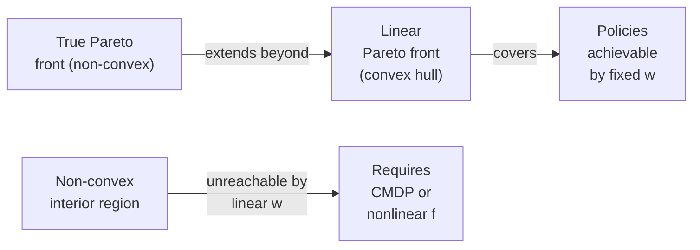
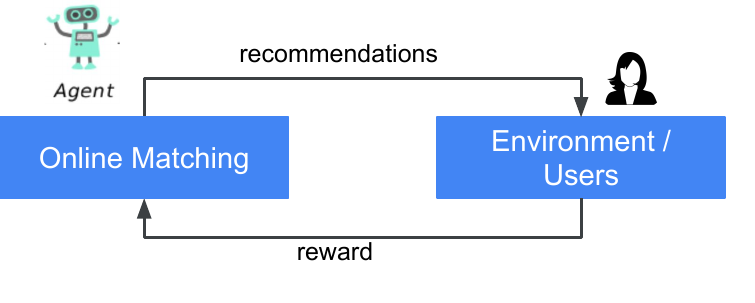
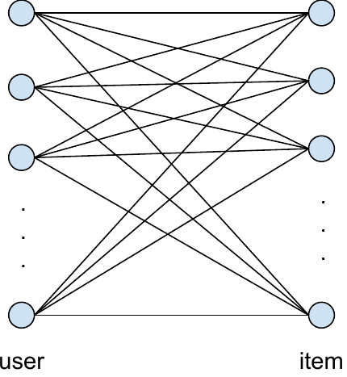
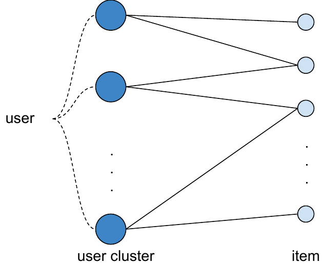
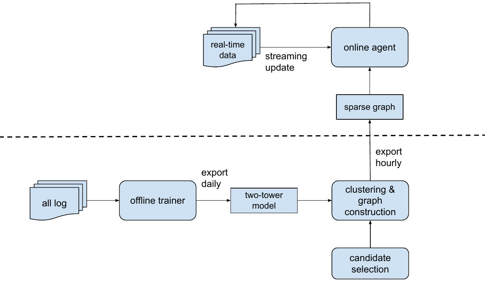
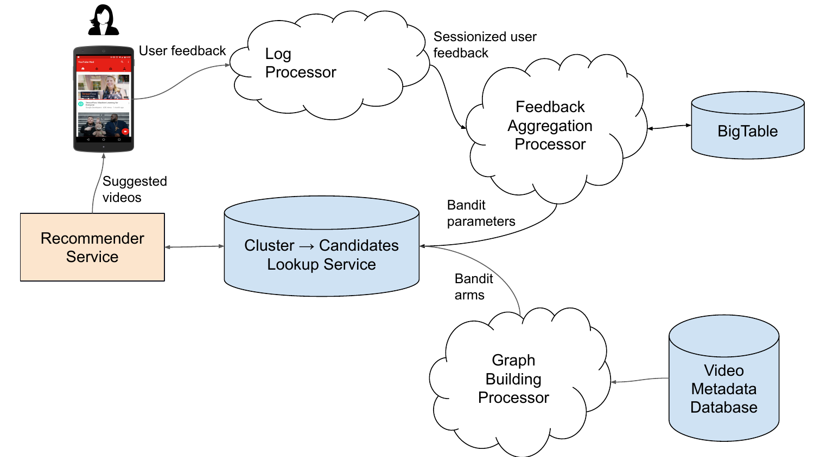
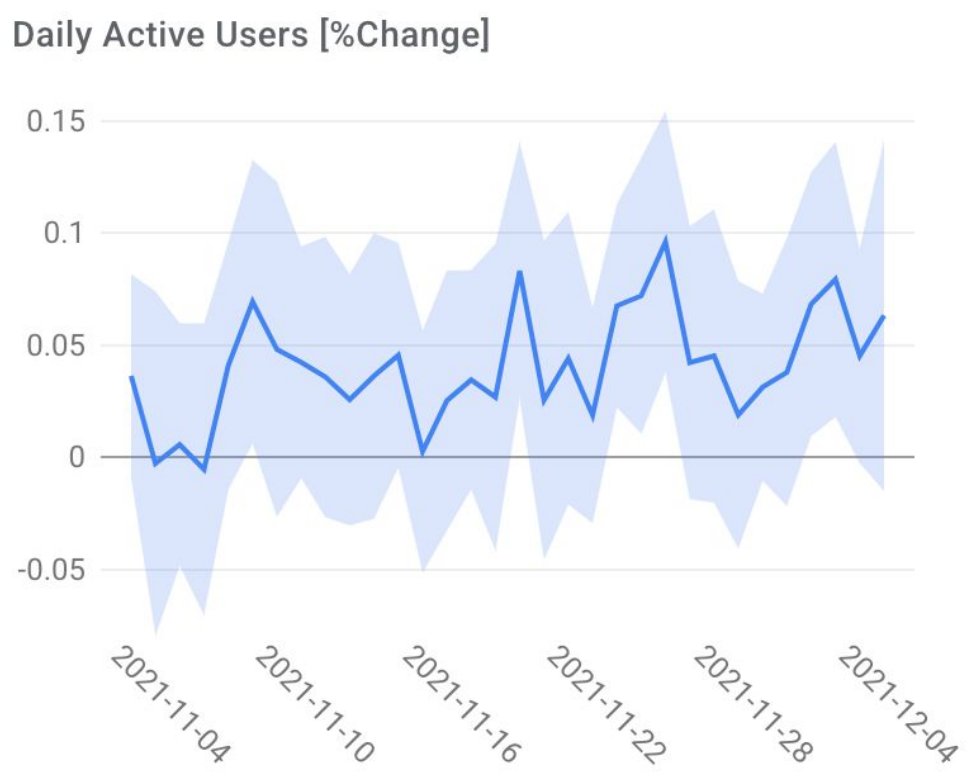
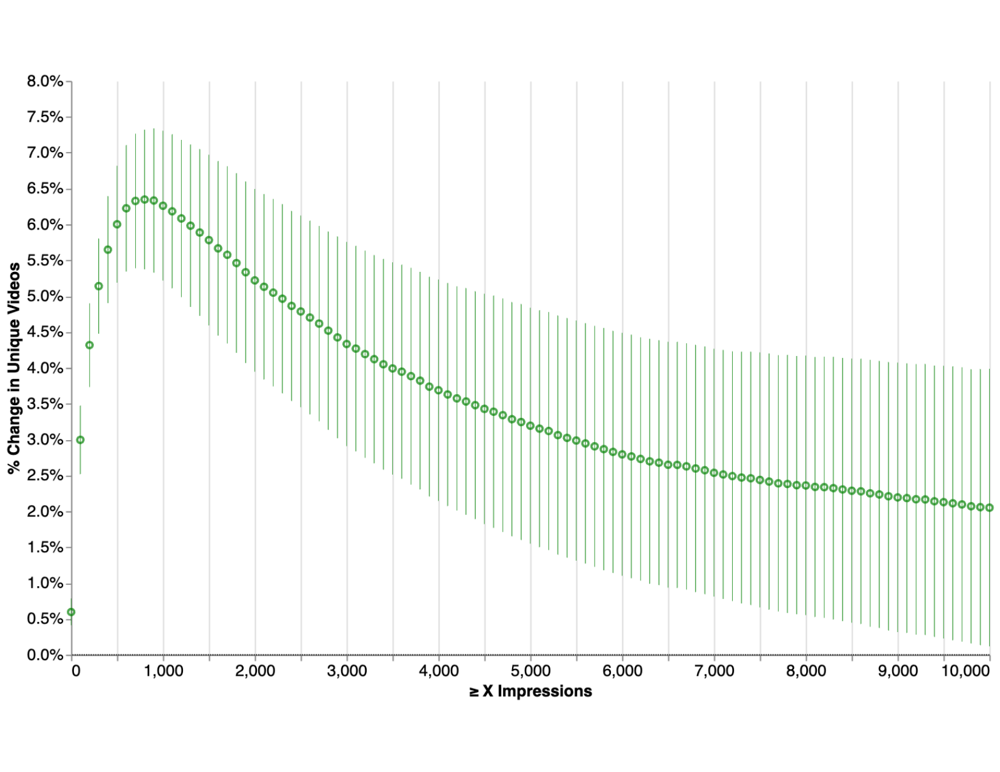

# RL Techniques for Value Modeling in Search and Recommendation Ranking

## Table of Contents

- [[#1. The Value Modeling Problem|1. The Value Modeling Problem]]
  - [[#1.1 Session as a Markov Decision Process|1.1 Session as a Markov Decision Process]]
  - [[#1.2 Per-Task Predictions as Features|1.2 Per-Task Predictions as Features]]
  - [[#1.3 Why Value Modeling is Hard|1.3 Why Value Modeling is Hard]]
- [[#2. Multi-Objective Reward Scalarization|2. Multi-Objective Reward Scalarization]]
  - [[#2.1 Linear Scalarization|2.1 Linear Scalarization]]
  - [[#2.2 Pareto Front Completeness Theorem|2.2 Pareto Front Completeness Theorem]]
  - [[#2.3 Nonlinear Scalarization|2.3 Nonlinear Scalarization]]
  - [[#2.4 Constrained MDP Formulation|2.4 Constrained MDP Formulation]]
  - [[#2.5 Worked Example: Two-Task Watch-Time vs. Like Rate|2.5 Worked Example: Two-Task Watch-Time vs. Like Rate]]
- [[#3. Contextual Bandits for Ranking|3. Contextual Bandits for Ranking]]
  - [[#3.1 Bandit Framing|3.1 Bandit Framing]]
  - [[#3.2 LinUCB|3.2 LinUCB]]
  - [[#3.3 NeuralUCB|3.3 NeuralUCB]]
  - [[#3.4 Off-Policy Correction in Bandits|3.4 Off-Policy Correction in Bandits]]
  - [[#3.5 Limitations|3.5 Limitations]]
- [[#4. Policy Gradient Methods|4. Policy Gradient Methods]]
  - [[#4.1 REINFORCE|4.1 REINFORCE]]
  - [[#4.2 Top-K Off-Policy Correction|4.2 Top-K Off-Policy Correction]]
  - [[#4.3 Actor-Critic Formulation|4.3 Actor-Critic Formulation]]
  - [[#4.4 Slate Action Decomposition via SlateQ|4.4 Slate Action Decomposition via SlateQ]]
- [[#5. Constrained Actor-Critic|5. Constrained Actor-Critic]]
  - [[#5.1 Lagrangian Relaxation of the CMDP|5.1 Lagrangian Relaxation of the CMDP]]
  - [[#5.2 Two-Stage Constrained Actor-Critic|5.2 Two-Stage Constrained Actor-Critic]]
  - [[#5.3 Convergence and Practical Caveats|5.3 Convergence and Practical Caveats]]
- [[#6. Learned Ranking Functions|6. Learned Ranking Functions]]
  - [[#6.1 YouTube Learned Ranking Function|6.1 YouTube Learned Ranking Function]]
  - [[#6.2 Multi-Task Fusion via Batch RL|6.2 Multi-Task Fusion via Batch RL]]
  - [[#6.3 Long-Term Value Prediction|6.3 Long-Term Value Prediction]]
  - [[#6.4 Scalarization Weights as Policy Actions|6.4 Scalarization Weights as Policy Actions]]
  - [[#6.5 Method Comparison|6.5 Method Comparison]]
- [[#7. Practical Considerations|7. Practical Considerations]]
  - [[#7.1 Reward Delay|7.1 Reward Delay]]
  - [[#7.2 Position Bias|7.2 Position Bias]]
  - [[#7.3 Feedback Loops and Distribution Shift|7.3 Feedback Loops and Distribution Shift]]
  - [[#7.4 Exploration in Production|7.4 Exploration in Production]]
  - [[#7.5 Reward Shaping Pitfalls|7.5 Reward Shaping Pitfalls]]
- [[#8. Summary and Taxonomy|8. Summary and Taxonomy]]
- [[#9. Industrial Case Studies|9. Industrial Case Studies]]
  - [[#9.1 YouTube — Online Matching (Real-Time Diag-LinUCB)|9.1 YouTube — Online Matching (Real-Time Diag-LinUCB)]]
  - [[#9.2 YouTube — REINFORCE at Scale|9.2 YouTube — REINFORCE at Scale]]
  - [[#9.3 Meta — Horizon and Production RL|9.3 Meta — Horizon and Production RL]]
  - [[#9.4 TikTok — MMoE Weighted Scoring|9.4 TikTok — MMoE Weighted Scoring]]
  - [[#9.5 Pinterest — DRL-PUT|9.5 Pinterest — DRL-PUT]]
  - [[#9.6 Cross-Platform Engineering Patterns|9.6 Cross-Platform Engineering Patterns]]
- [[#References|References]]

---

## 1. The Value Modeling Problem 📐

### 1.1 Session as a Markov Decision Process

A user session on a search or recommendation surface is modeled as a *Markov Decision Process* (MDP) $\mathcal{M} = (\mathcal{S}, \mathcal{A}, P, R, \gamma)$.

**Definition (Ranking MDP).** The components are:

- $\mathcal{S}$: the *state space*, where $s_t \in \mathcal{S}$ encodes the user context (device, demographics, session history), the query (if present), and the feature representations of candidate items at time $t$.
- $\mathcal{A}$: the *action space*, where $a_t \in \mathcal{A}$ is the *ranking slate* — an ordered list of $K$ items selected from the candidate set $\mathcal{C}_t$.
- $P: \mathcal{S} \times \mathcal{A} \times \mathcal{S} \to [0,1]$: the *transition kernel*, which maps the current state and slate to the distribution over next states (the user's subsequent context and query).
- $R: \mathcal{S} \times \mathcal{A} \to \mathbb{R}$: the *reward function*, where $r_t = R(s_t, a_t)$ captures observed engagement signals — clicks, likes, watch-time, shares, or some combination.
- $\gamma \in [0, 1)$: the *discount factor* controlling the time-horizon preference.

A *ranking policy* $\pi: \mathcal{S} \to \Delta(\mathcal{A})$ is a distribution over slates given a state. The objective is to find $\pi^*$ maximizing the expected discounted return:

$$J(\pi) = \mathbb{E}_\pi\left[\sum_{t=0}^{\infty} \gamma^t r_t^{\text{north-star}}\right]$$

where $r_t^{\text{north-star}}$ is the *north-star reward* — a delayed, coarse signal measuring genuine long-term user satisfaction (e.g., 30-day return rate, session frequency, or a user survey score).

### 1.2 Per-Task Predictions as Features

In production ranking systems, a *multitask deep network* (e.g., a shared-bottom tower or mixture-of-experts architecture) simultaneously predicts $K$ engagement probabilities:

$$\hat{p}_k(s, a) \approx \Pr[y_k = 1 \mid s, a], \quad k = 1, \ldots, K$$

where the $k$-th task might be: $k=1$ click-through rate, $k=2$ like probability, $k=3$ expected watch-time fraction, $k=4$ share probability. These per-task predictions are cheap to compute at serving time and are well-calibrated through offline training.

**Definition (Value Model).** A *value model* is a function $V_\theta: \mathcal{S} \times \mathcal{A} \to \mathbb{R}$ parameterized by $\theta$ that combines per-task predictions:

$$V_\theta(s, a) = f_\theta\!\left(\hat{p}_1(s,a), \ldots, \hat{p}_K(s,a);\, s\right)$$

The induced *ranking policy* selects the top-$K$ items by $V_\theta$:

$$\pi_\theta(s) = \underset{a \in \mathcal{A}}{\arg\max}\; V_\theta(s, a)$$

The value modeling problem is: learn $\theta^*$ such that $J(\pi_{\theta^*})$ is maximized. This is the central problem this note surveys.

### 1.3 Why Value Modeling is Hard

Three structural difficulties distinguish this problem from standard supervised learning:

**(a) Delayed feedback.** The north-star reward $r^{\text{north-star}}$ is not observed at request time. A ranking decision at time $t$ may affect satisfaction signals measured days later. This creates a *credit assignment problem*: which of the many ranking decisions made during a session contributed to the eventual satisfaction?

**(b) Distribution shift.** Training data is collected under the *logging policy* $\beta$ (the current production ranker). The value model being trained will induce a different policy $\pi_\theta \neq \beta$. Off-policy learning is therefore required: estimates of $J(\pi_\theta)$ from $\beta$-collected data are biased without correction.

**(c) Multi-objective tension.** Individual task predictions may conflict. A video that maximizes watch-time may have a low like rate. A click-baity item has high CTR but poor long-term satisfaction. Any scalar $V_\theta$ must resolve these tensions — a nontrivial modeling choice with Pareto-optimality implications we formalize in §2.

> [!INFO] Relationship to Learning-to-Rank
> Classical learning-to-rank (LTR) methods (RankNet, LambdaMART) also optimize a ranking function, but they treat relevance labels as fixed and optimize a surrogate for NDCG or MAP. The RL framing differs in two ways: (1) the reward is not a static label but a delayed, stochastic signal; (2) the data-generating policy matters because of distribution shift. See [[concepts/reinforcement-learning/rl-landscape|RL Landscape]] for the general RL taxonomy.

---

## 2. Multi-Objective Reward Scalarization 🗺️

### 2.1 Linear Scalarization

The simplest value model is the *linear scalarizer*:

$$V_w(s, a) = \sum_{k=1}^{K} w_k \hat{p}_k(s, a), \quad w_k \geq 0$$

with fixed, hand-tuned weights $w = (w_1, \ldots, w_K)$. This is the default in most production ranking systems. It is interpretable, trivially differentiable, and computationally free at serving time. Its failures are equally well-understood.

**Proposition (Failure modes of linear scalarization).** Fixed weights $w$ fail in two ways:
1. The optimal weight vector depends on the user context $s$ and the item candidate set $\mathcal{C}$. A single $w$ cannot adapt across diverse surfaces.
2. Linear scalarization cannot recover Pareto-optimal policies in the *non-convex* region of the objective space (formalized below).

### 2.2 Pareto Front Completeness Theorem

Let $\Pi$ be the set of all stationary policies. Define the *objective vector* of a policy $\pi$ as:

$$\mathbf{J}(\pi) = \left(J_1(\pi), \ldots, J_K(\pi)\right) \in \mathbb{R}^K$$

where $J_k(\pi) = \mathbb{E}_\pi[\sum_t \gamma^t r_t^{(k)}]$ is the expected discounted return under the $k$-th reward signal. The *Pareto front* is:

$$\mathcal{P} = \left\{ \mathbf{J}(\pi) \;\middle|\; \nexists\, \pi' : J_k(\pi') \geq J_k(\pi)\; \forall k, \text{ with at least one strict}\right\}$$

**Theorem (Linear scalarization is complete iff Pareto front is convex).** For any policy $\pi^*$ on the convex hull of $\mathcal{P}$, there exist weights $w \geq 0$ with $\sum_k w_k = 1$ such that $\pi^*$ is optimal under the scalarized objective $\sum_k w_k J_k(\pi)$. Conversely, any Pareto-optimal policy $\pi^*$ whose objective vector $\mathbf{J}(\pi^*)$ lies in the non-convex interior of $\mathcal{P}$ — i.e., not on the convex hull — cannot be recovered by any fixed $w$.

*Proof sketch.* (Sufficiency) The scalarized objective $\sum_k w_k J_k(\pi)$ is linear in $\mathbf{J}(\pi)$. Maximizing over $\pi$ finds the point in the convex hull of $\{\mathbf{J}(\pi) : \pi \in \Pi\}$ where the supporting hyperplane with normal $w$ is tangent. Any point on the convex hull of $\mathcal{P}$ is such a tangency for some $w \geq 0$.

(Necessity) If $\mathbf{J}(\pi^*)$ is in the strict interior of the non-convex hull — i.e., it cannot be expressed as a convex combination of hull points — then no hyperplane with non-negative normal can have $\pi^*$ as its maximizer. A linear program over a convex set cannot reach a strictly interior non-convex point. $\square$

*Practical implication.* In recommendation, the Pareto front between watch-time and like rate is empirically non-convex (a user who likes a video after watching it fully represents a point the linear model cannot reach by weighting CTR and completion rate alone). This motivates nonlinear scalarization.

### 2.3 Nonlinear Scalarization

A learned nonlinear combination $f_\theta(\hat{p}_1, \ldots, \hat{p}_K)$ can, in principle, represent any point on the Pareto front including non-convex regions. The key question is how to supervise $f_\theta$:

- **Supervised on north-star:** Train $f_\theta$ to predict the north-star reward using logged $(s, a, r^{\text{north-star}})$ tuples. This is off-policy regression with distribution shift concerns.
- **RL objective:** Treat $f_\theta$ as the policy's value estimate and optimize $J(\pi_\theta)$ end-to-end via policy gradient or Q-learning. This is the approach of Zhang et al. (2022) and Wu et al. (2024).

This design choice — whether $f_\theta$ is a reward predictor or a policy value function — distinguishes the methods surveyed in §6.

### 2.4 Constrained MDP Formulation

An alternative to scalarization converts the multi-objective problem into a single-objective problem with inequality constraints. This is the *Constrained Markov Decision Process* (*CMDP*) formulation.

**Definition (CMDP).** A CMDP extends the MDP with constraint reward functions $R_1, \ldots, R_{K-1}$ and thresholds $c_1, \ldots, c_{K-1}$:

$$\max_\pi\; J_0(\pi) \quad \text{subject to}\quad J_k(\pi) \geq c_k, \quad k = 1, \ldots, K-1$$

where $J_0$ is the north-star objective and $J_k(\pi) = \mathbb{E}_\pi[\sum_t \gamma^t r_t^{(k)}]$ is the expected return under the $k$-th auxiliary reward.

The Lagrangian relaxation of the CMDP introduces *dual variables* $\lambda = (\lambda_1, \ldots, \lambda_{K-1}) \geq 0$:

$$\mathcal{L}(\pi, \lambda) = J_0(\pi) - \sum_{k=1}^{K-1} \lambda_k \left(c_k - J_k(\pi)\right) = J_0(\pi) + \sum_{k=1}^{K-1} \lambda_k J_k(\pi) - \sum_{k=1}^{K-1} \lambda_k c_k$$

This reduces to a single-objective problem with an adaptive, state-independent reward:

$$r_\lambda(s, a) = r^{(0)}(s, a) + \sum_{k=1}^{K-1} \lambda_k r^{(k)}(s, a)$$

The CMDP saddle-point condition requires finding $(\pi^*, \lambda^*)$ such that:

$$\mathcal{L}(\pi^*, \lambda) \leq \mathcal{L}(\pi^*, \lambda^*) \leq \mathcal{L}(\pi, \lambda^*) \quad \forall\, \pi \in \Pi,\; \lambda \geq 0$$

The dual variable $\lambda_k^*$ is the *shadow price* of constraint $k$: if constraint $k$ is slack at optimum ($J_k(\pi^*) > c_k$), then $\lambda_k^* = 0$ by complementary slackness. This adaptive weighting is a key advantage over fixed $w$.

### 2.5 Worked Example: Two-Task Watch-Time vs. Like Rate

Consider $K = 2$ tasks: $r^{(0)}$ = watch-time (north-star), $r^{(1)}$ = like rate (auxiliary), with constraint $J_1(\pi) \geq c_1$.

The Lagrangian reward is $r_\lambda = r^{(0)} + \lambda_1 r^{(1)} - \lambda_1 c_1$. The dual update after each policy gradient step is:

$$\lambda_1 \leftarrow \max\!\left(0,\; \lambda_1 + \eta_\lambda \left(c_1 - \hat{J}_1(\pi)\right)\right)$$

where $\hat{J}_1(\pi)$ is the estimated constraint return. If like rate is below $c_1$, $\lambda_1$ increases, penalizing items that sacrifice likes for watch-time. If like rate exceeds $c_1$, $\lambda_1$ decreases toward zero and the constraint relaxes.

The Pareto front below illustrates why linear scalarization fails to reach the non-convex region:

> [!EXAMPLE] Pareto front geometry
> Suppose the achievable set of $(J_{\text{watch}}, J_{\text{like}})$ pairs forms a non-convex arc: policies can achieve $(5, 0.1)$, $(4, 0.4)$, and $(3, 0.8)$, but the point $(4.5, 0.3)$ is also achievable and lies strictly above the chord connecting $(5, 0.1)$ and $(4, 0.4)$. No linear weight $w$ can select $(4.5, 0.3)$ over the other two, but the CMDP formulation with $c_1 = 0.3$ will find it.

> [!QUESTION] Exercise 1: Lagrangian Dual for CMDP
> *This exercise derives the dual problem and establishes the saddle-point condition for the two-task CMDP, which underlies all constrained actor-critic methods.*
>
> > **Prerequisites:** [[#2.4 Constrained MDP Formulation|2.4 Constrained MDP Formulation]]
>
> Let $\Pi$ be convex (e.g., the set of stochastic policies parameterized by a linear softmax). Define the dual function $g(\lambda) = \max_{\pi \in \Pi} \mathcal{L}(\pi, \lambda)$. Show that:
> (a) $g(\lambda)$ is a convex function of $\lambda$.
> (b) The dual problem $\min_{\lambda \geq 0} g(\lambda)$ provides an upper bound on the primal $\max_\pi J_0(\pi)$ subject to $J_1(\pi) \geq c_1$.
> (c) If Slater's condition holds (there exists a strictly feasible $\pi$), then strong duality holds and the primal-dual gap is zero.

> [!TIP]- Solution to Exercise 1
> **Key insight:** $g(\lambda)$ is the pointwise maximum of affine functions of $\lambda$, hence convex. The dual problem is always a lower bound on the primal (weak duality); Slater's condition closes the gap.
>
> **Sketch:**
> (a) For each fixed $\pi$, $\mathcal{L}(\pi, \lambda) = J_0(\pi) + \lambda_1 J_1(\pi) - \lambda_1 c_1$ is affine in $\lambda_1$. The supremum over $\pi$ of a family of affine functions is convex.
>
> (b) For any feasible $\pi$ (satisfying $J_1(\pi) \geq c_1$) and any $\lambda \geq 0$:
> $$g(\lambda) = \max_{\pi'} \mathcal{L}(\pi', \lambda) \geq \mathcal{L}(\pi, \lambda) = J_0(\pi) + \lambda_1(J_1(\pi) - c_1) \geq J_0(\pi)$$
> since $\lambda_1 \geq 0$ and $J_1(\pi) - c_1 \geq 0$. Taking the infimum over $\lambda$ preserves the bound.
>
> (c) Slater's condition (strict feasibility) is sufficient for strong duality in convex programs (Slater's theorem). When $\Pi$ is convex and $J_0, J_1$ are linear in $\pi$, the program is convex, so Slater's condition implies zero duality gap: $\min_\lambda g(\lambda) = \max_{\pi \text{ feasible}} J_0(\pi)$.

---

## 3. Contextual Bandits for Ranking 🎰

### 3.1 Bandit Framing

The *contextual bandit* framing treats each ranking request as an independent decision: there is no transition between states across requests. Formally, it is a single-step MDP with $\gamma = 0$. This is appropriate when:

- Session effects are negligible (search, not sequential video feed).
- Reward signals are observed immediately (clicks, session-level engagement).
- The system cannot maintain user state reliably.

The *logging policy* $\beta(a \mid s)$ is the production ranker. The bandit algorithm must learn an improved policy $\pi$ from $(s_i, a_i, r_i)$ tuples collected under $\beta$.

### 3.2 LinUCB

*LinUCB* ([Li et al., 2010](https://arxiv.org/abs/1003.0146)) assumes a linear reward model: $\mathbb{E}[r \mid s, a] = \theta^\top \phi(s, a)$ where $\phi(s, a) \in \mathbb{R}^d$ is a joint feature vector. The posterior over $\theta$ under a Gaussian prior $\theta \sim \mathcal{N}(0, \lambda^{-1} I)$ and Gaussian likelihood has a closed form.

**Definition (LinUCB algorithm).** Maintain the design matrix $A_t = \lambda I + \sum_{i=1}^{t-1} \phi_i \phi_i^\top \in \mathbb{R}^{d \times d}$ and the reward vector $b_t = \sum_{i=1}^{t-1} r_i \phi_i \in \mathbb{R}^d$. At round $t$:
1. Compute the ridge estimate $\hat\theta_t = A_t^{-1} b_t$.
2. For each candidate item $a$, compute the *upper confidence bound*:

$$\text{UCB}_t(s, a) = \hat\theta_t^\top \phi(s, a) + \alpha \sqrt{\phi(s, a)^\top A_t^{-1} \phi(s, a)}$$

3. Select $a_t^* = \arg\max_a \text{UCB}_t(s_t, a)$.
4. Observe $r_t$ and update: $A_{t+1} = A_t + \phi_t \phi_t^\top$, $b_{t+1} = b_t + r_t \phi_t$.

The exploration bonus $\alpha \sqrt{\phi^\top A^{-1} \phi}$ is the *posterior standard deviation* of $\hat\theta^\top \phi$ scaled by $\alpha$. Under the linear Gaussian model, it is exactly one posterior standard deviation.

**Theorem (LinUCB regret).** With probability at least $1 - \delta$, the cumulative regret of LinUCB after $T$ rounds satisfies:

$$\text{Regret}(T) = \sum_{t=1}^T \left[\max_a \mathbb{E}[r \mid s_t, a] - \mathbb{E}[r \mid s_t, a_t^*]\right] = O\!\left(d\sqrt{T \log(T/\delta)}\right)$$

The $d\sqrt{T}$ scaling is tight: the regret grows as the square root of time (sublinear) and linearly in the feature dimension $d$.

> [!EXAMPLE] YouTube Online Matching — LinUCB at Production Scale
> *Yi et al. (2023, RecSys)* deploy a real-time bandit system called **Online Matching** at YouTube that extends LinUCB to billion-scale via two key ideas.
>
> **Space pruning via a sparse bipartite graph.** A two-tower neural network embeds users and items into a shared space. Users are discretized into $C$ clusters; a sparse bipartite graph is built between user clusters and items based on embedding similarity. Only edges in this graph are eligible for exploration — this prunes the exploration space from millions of items down to $O(C \cdot k)$ cluster-item pairs.
>
> 
>
> *Figure 1 (Yi et al., 2023): The Online Matching closed loop. User feedback on explored items is aggregated in real time and feeds back into the bandit parameters, which immediately influence the next request's candidate set.*
>
>  
>
> *Figure 2 (Yi et al., 2023): (left) The sparse bipartite graph between user clusters and candidate items; (right) within-cluster view showing how Diag-LinUCB restricts exploration to graph edges.*
>
> **Diag-LinUCB — distributed parameter updates.** Standard LinUCB requires maintaining and inverting a global $d \times d$ matrix $A$, which is infeasible at scale. Online Matching assigns *independent diagonal covariance matrices* to each cluster-item edge. This allows bandit parameters to be updated asynchronously and in parallel across the entire graph, with policy update latency in the tens of milliseconds. The UCB bonus per edge $(c, j)$ is:
>
> $$\text{UCB}_{c,j}(s) = \hat\theta_{c,j}^\top x_s + \alpha / \sqrt{n_{c,j}}$$
>
> where $x_s$ is the user's real-time distribution over clusters and $n_{c,j}$ is the edge's sample count — a cheap diagonal approximation to the full posterior variance.
>
> **Production result:** +0.04% daily active users (exploitation holdout), and measurable growth in the daily discoverable corpus size for new videos. See §9.1 for full deployment details.

### 3.3 NeuralUCB

*NeuralUCB* ([Zhou et al., 2020](https://arxiv.org/abs/1911.04462)) replaces the linear model with a deep network $f(s, a; \theta) \in \mathbb{R}$. The key insight is to use the *neural tangent kernel* (NTK) approximation: near $\theta_0$ (the initialization), the network behaves approximately linearly in its last-layer gradient feature:

$$\phi_{\text{NTK}}(s, a; \theta) = \nabla_\theta f(s, a; \theta) / \sqrt{m}$$

where $m$ is the network width. The UCB bonus then uses this NTK feature:

$$\text{UCB}(s, a) = f(s, a; \hat\theta) + \alpha \sqrt{\phi_{\text{NTK}}^\top Z^{-1} \phi_{\text{NTK}}}$$

where $Z = \lambda I + \sum_i \phi_{\text{NTK},i} \phi_{\text{NTK},i}^\top$. Under NTK assumptions (overparameterized network, gradient laziness), NeuralUCB achieves regret $\tilde{O}(\sqrt{T})$, matching LinUCB up to logarithmic factors.

*In practice,* computing the full NTK matrix is expensive. Production systems instead use the last-layer embedding as $\phi$ and maintain a diagonal approximation to $Z^{-1}$ (Thompson sampling variant) or use random projections.

### 3.4 Off-Policy Correction in Bandits

When the logging policy $\beta \neq \pi$, naive plug-in estimates of $J(\pi)$ are biased. The *inverse propensity scoring* (IPS) estimator corrects for this:

$$\hat{J}_{\text{IPS}}(\pi) = \frac{1}{n} \sum_{i=1}^n r_i \cdot \frac{\pi(a_i \mid s_i)}{\beta(a_i \mid s_i)} = \frac{1}{n} \sum_{i=1}^n r_i \cdot \rho_i$$

where $\rho_i = \pi(a_i \mid s_i) / \beta(a_i \mid s_i)$ is the *importance weight*. This estimator is unbiased: $\mathbb{E}_\beta[\hat{J}_{\text{IPS}}(\pi)] = J(\pi)$.

The variance of the IPS estimator grows as $\text{Var}[\rho_i r_i]$, which can be catastrophic when $\pi$ and $\beta$ disagree on common actions. The *clipped IPS* estimator with cap $c$ trades a small bias for large variance reduction:

$$\hat{J}_{\text{clip}}(\pi) = \frac{1}{n} \sum_{i=1}^n r_i \cdot \min(c, \rho_i)$$

The *doubly-robust* (DR) estimator combines a direct model $\hat{r}(s, a)$ with IPS:

$$\hat{J}_{\text{DR}}(\pi) = \frac{1}{n}\sum_{i=1}^n \left[\hat{r}(s_i, \pi) + \rho_i \left(r_i - \hat{r}(s_i, a_i)\right)\right]$$

DR is unbiased if either $\hat{r}$ is correctly specified or $\rho_i$ is correct, and has lower variance than IPS when $\hat{r}$ is a reasonable model.

### 3.5 Limitations

The bandit framing has two structural limitations that motivate the full MDP treatment:

1. **No session dynamics.** A bandit policy ignores that the current ranking affects the user's future state and future reward. A video that satisfies a user today makes them more likely to return tomorrow — a delayed effect invisible to the bandit.
2. **No position effects.** Bandits typically treat items independently. Position effects (the first slot gets 5× the clicks of slot 5) introduce correlations across actions in the slate that bandits do not model natively.

> [!QUESTION] Exercise 2: LinUCB as Bayesian Posterior
> *This exercise shows that the LinUCB update is exactly Bayesian inference under a linear Gaussian model, which grounds the UCB bonus as a posterior standard deviation.*
>
> > **Prerequisites:** [[#3.2 LinUCB|3.2 LinUCB]]
>
> Let $r_t = \theta^\top \phi_t + \epsilon_t$ where $\epsilon_t \overset{\text{iid}}{\sim} \mathcal{N}(0, \sigma^2)$ and $\theta \sim \mathcal{N}(0, \sigma^2 \lambda^{-1} I)$. After observing $t-1$ rounds, compute the posterior $p(\theta \mid \phi_1, r_1, \ldots, \phi_{t-1}, r_{t-1})$ and show that:
> (a) The posterior mean is $\hat\theta_t = A_t^{-1} b_t$ where $A_t = \lambda I + \sum_i \phi_i \phi_i^\top / \sigma^2$ and $b_t = \sum_i r_i \phi_i / \sigma^2$.
> (b) The posterior variance of $\theta^\top \phi$ for a new feature $\phi$ is $\sigma^2 \phi^\top A_t^{-1} \phi$.
> (c) The UCB bonus $\alpha \sqrt{\phi^\top A_t^{-1} \phi}$ is the posterior standard deviation (up to scaling by $\alpha \sigma$), justifying the UCB as a frequentist upper confidence bound under this prior.

> [!TIP]- Solution to Exercise 2
> **Key insight:** Ridge regression is equivalent to MAP estimation under a Gaussian prior; the posterior covariance gives the predictive variance directly.
>
> **Sketch:**
> (a) The Gaussian posterior is $\theta \mid \text{data} \sim \mathcal{N}(\hat\theta_t, \sigma^2 A_t^{-1})$ where the posterior precision matrix is $A_t = \lambda I + \Phi^\top \Phi / \sigma^2$ (absorbing $\sigma^2$ into $\lambda$ by rescaling gives $A_t = \lambda I + \sum_i \phi_i \phi_i^\top$). Completing the square in the exponent yields $\hat\theta_t = A_t^{-1} b_t$.
>
> (b) The predictive distribution for $\theta^\top \phi$ given the posterior is $\mathcal{N}(\hat\theta_t^\top \phi, \sigma^2 \phi^\top A_t^{-1} \phi)$. This is obtained by the affine transformation $\phi^\top \cdot$, which maps the Gaussian posterior covariance $\sigma^2 A_t^{-1}$ to scalar variance $\sigma^2 \phi^\top A_t^{-1} \phi$.
>
> (c) The UCB selects the action maximizing the $(1 - 1/T)$ quantile of the predictive distribution (a frequentist argument). For a Gaussian predictive, this quantile is $\hat\theta_t^\top \phi + z_{1-1/T} \cdot \sigma \sqrt{\phi^\top A_t^{-1} \phi}$. Setting $\alpha = z_{1-1/T} \cdot \sigma$ recovers the LinUCB bonus exactly.

---

## 4. Policy Gradient Methods 🚀

### 4.1 REINFORCE

*Policy gradient methods* directly optimize $J(\pi_\theta)$ with respect to the policy parameters $\theta$ using gradient ascent. The *policy gradient theorem* ([Williams, 1992](https://link.springer.com/article/10.1007/BF00992696)) states:

$$\nabla_\theta J(\theta) = \mathbb{E}_{\pi_\theta}\!\left[\sum_{t=0}^T G_t \cdot \nabla_\theta \log \pi_\theta(a_t \mid s_t)\right]$$

where $G_t = \sum_{t'=t}^T \gamma^{t'-t} r_{t'}$ is the *return* from step $t$. The *REINFORCE* estimator uses a single rollout to estimate this expectation:

$$\widehat{\nabla_\theta J} = \sum_{t=0}^T G_t \cdot \nabla_\theta \log \pi_\theta(a_t \mid s_t)$$

This is unbiased but high-variance, since $G_t$ aggregates stochastic rewards over the entire episode.

In the [[concepts/reinforcement-learning/rl-landscape|RL landscape]], REINFORCE is the prototype *on-policy* method: it requires rollouts from $\pi_\theta$ itself. In production recommendation, generating on-policy rollouts is expensive (requires live traffic exploration) and risks degrading user experience during training.

### 4.2 Top-K Off-Policy Correction

*Chen et al. (2019)* ([Top-K Off-Policy Correction](https://arxiv.org/abs/1812.02353)) adapt REINFORCE to the YouTube recommendation setting where:

- The *logging policy* $\beta$ collects all training data.
- The *action* at each step is a *slate* of $K$ items, not a single item.
- Importance weights $\rho = \pi/\beta$ can become catastrophically large.

**Definition (Off-policy REINFORCE gradient).** The importance-weighted gradient estimator is:

$$\widehat{\nabla_\theta J}_{\text{off-policy}} = \sum_{t=0}^T \rho_t \cdot G_t \cdot \nabla_\theta \log \pi_\theta(a_t \mid s_t)$$

where $\rho_t = \pi_\theta(a_t \mid s_t) / \beta(a_t \mid s_t)$. This is unbiased for the gradient of $J(\pi_\theta)$. The problem is variance: when $\pi_\theta$ concentrates mass on different items than $\beta$, $\rho_t$ can be exponentially large.

**Top-K correction.** For a slate of $K$ items ranked by $\pi_\theta$, the probability $\pi_\theta(a)$ over entire slates is a product over $K$ item probabilities, making the IS ratio $\rho = \prod_{k=1}^K (\pi/\beta)_k$ exponentially small or large. The top-$K$ correction clips and decomposes this:

$$\lambda_K(\pi, \beta) = 1 - \sum_{j=1}^{K-1} \frac{\pi(a^{(j)})}{\beta(a^{(j)})^{K/(K-j)}} + \ldots$$

In practice, the paper uses a per-item clipped weight $\min(c, \pi(a)/\beta(a))$ and decomposes the slate correction into independent per-item updates. The key empirical finding is that **naive IS with $K$-item slates has catastrophic variance at YouTube scale**, making unclipped REINFORCE unstable.

### 4.3 Actor-Critic Formulation

The *actor-critic* architecture reduces the variance of the policy gradient by replacing $G_t$ with an advantage estimate:

$$A^{\pi_\theta}(s_t, a_t) = Q^{\pi_\theta}(s_t, a_t) - V^{\pi_\theta}(s_t)$$

where:
- $V^{\pi_\theta}(s) = \mathbb{E}_{\pi_\theta}\!\left[\sum_{t'=t}^\infty \gamma^{t'-t} r_{t'} \;\middle|\; s_t = s\right]$ is the *state-value function* (the *critic*).
- $Q^{\pi_\theta}(s, a) = \mathbb{E}_{\pi_\theta}\!\left[\sum_{t'=t}^\infty \gamma^{t'-t} r_{t'} \;\middle|\; s_t = s, a_t = a\right]$ is the *action-value function*.
- $A^{\pi_\theta}(s, a) = Q^{\pi_\theta}(s, a) - V^{\pi_\theta}(s)$ is the *advantage function*.

**Proposition (Baseline subtraction is unbiased).** For any function $b(s_t)$ depending only on the state:

$$\mathbb{E}_{\pi_\theta}\!\left[b(s_t) \nabla_\theta \log \pi_\theta(a_t \mid s_t)\right] = 0$$

*(Proof given as Exercise 3 below.)*

The actor-critic gradient then becomes:

$$\nabla_\theta J(\theta) = \mathbb{E}_{\pi_\theta}\!\left[A^{\pi_\theta}(s_t, a_t) \cdot \nabla_\theta \log \pi_\theta(a_t \mid s_t)\right]$$

The *actor* (policy $\pi_\theta$) is updated by gradient ascent on this estimate. The *critic* ($V_\phi$ or $Q_\phi$, parameterized by $\phi$) is trained by minimizing the TD error $\delta_t = r_t + \gamma V_\phi(s_{t+1}) - V_\phi(s_t)$.

### 4.4 Slate Action Decomposition via SlateQ

The action space for a ranking slate of $K$ items from $|\mathcal{C}|$ candidates is $\binom{|\mathcal{C}|}{K}$, which is intractably large. *SlateQ* ([Ie et al., 2019](https://arxiv.org/abs/1905.12767)) decomposes the slate Q-function under a user choice model.

**Assumption (Cascade choice model).** The user examines items top-to-bottom and clicks the first relevant one. Under this model, the probability that item $a$ in position $i$ is clicked is $\pi_i(a) \cdot \prod_{j<i}(1 - \pi_j(\text{relevant}))$.

**Theorem (SlateQ decomposition).** Under the cascade choice model, the long-term value of a slate $\mathbf{a} = (a_1, \ldots, a_K)$ decomposes as:

$$Q^{\pi}(s, \mathbf{a}) = \sum_{k=1}^K \Pr[\text{user clicks } a_k \mid s, \mathbf{a}] \cdot Q^{\pi}_{\text{item}}(s, a_k)$$

where $Q^{\pi}_{\text{item}}(s, a)$ is the long-term value of the user clicking item $a$ in state $s$. This converts the slate optimization into $|\mathcal{C}|$ item-level Q-value computations followed by a greedy selection, tractable at scale.

> [!QUESTION] Exercise 3: Baseline Unbiasedness
> *This is one of the most important identities in policy gradient theory: it justifies the actor-critic architecture by showing that the critic serves as a variance-reducing baseline without introducing bias.*
>
> > **Prerequisites:** [[#4.3 Actor-Critic Formulation|4.3 Actor-Critic Formulation]]
>
> Show that for any baseline $b: \mathcal{S} \to \mathbb{R}$ depending only on the state (not the action):
>
> $$\mathbb{E}_{a_t \sim \pi_\theta(\cdot \mid s_t)}\!\left[b(s_t) \cdot \nabla_\theta \log \pi_\theta(a_t \mid s_t)\right] = 0$$
>
> *Hint:* Use the log-derivative trick $\nabla_\theta \log \pi_\theta(a \mid s) = \nabla_\theta \pi_\theta(a \mid s) / \pi_\theta(a \mid s)$ and the fact that $\pi_\theta(\cdot \mid s)$ is a probability distribution.

> [!TIP]- Solution to Exercise 3
> **Key insight:** The expectation of the score function $\nabla_\theta \log \pi_\theta(a \mid s)$ under $\pi_\theta$ is zero; $b(s_t)$ factors out as a constant with respect to the action sum.
>
> **Sketch:**
> $$\mathbb{E}_{a \sim \pi_\theta(\cdot|s)}\!\left[b(s) \nabla_\theta \log \pi_\theta(a|s)\right] = b(s) \sum_a \pi_\theta(a|s) \cdot \frac{\nabla_\theta \pi_\theta(a|s)}{\pi_\theta(a|s)}$$
> $$= b(s) \sum_a \nabla_\theta \pi_\theta(a|s) = b(s) \cdot \nabla_\theta \sum_a \pi_\theta(a|s) = b(s) \cdot \nabla_\theta 1 = 0$$
>
> The interchange of sum and gradient is justified by dominated convergence (all sums are finite). Since the state $s_t$ is fixed when taking the expectation over $a_t$, $b(s_t)$ factors out, completing the proof.

---

## 5. Constrained Actor-Critic 🔒

### 5.1 Lagrangian Relaxation of the CMDP

The CMDP from §2.4 is solved via the *primal-dual* (Lagrangian) method. Given the Lagrangian $\mathcal{L}(\pi, \lambda) = J_0(\pi) + \sum_k \lambda_k J_k(\pi) - \sum_k \lambda_k c_k$, the algorithm alternates:

**Primal step** (actor update): Fix $\lambda$, maximize $\mathcal{L}(\pi, \lambda)$ over $\pi$ using one or more steps of policy gradient ascent:

$$\theta \leftarrow \theta + \eta_\theta \nabla_\theta \mathcal{L}(\pi_\theta, \lambda) = \theta + \eta_\theta \nabla_\theta \left[J_0(\pi_\theta) + \textstyle\sum_k \lambda_k J_k(\pi_\theta)\right]$$

**Dual step** (multiplier update): Fix $\pi$, perform subgradient ascent on the dual function $g(\lambda) = \max_\pi \mathcal{L}(\pi, \lambda)$:

$$\lambda_k \leftarrow \max\!\left(0,\; \lambda_k + \eta_\lambda \left(c_k - \hat{J}_k(\pi_\theta)\right)\right), \quad k = 1, \ldots, K-1$$

The $\max(0, \cdot)$ enforces $\lambda_k \geq 0$. When $\hat{J}_k(\pi_\theta) < c_k$ (constraint violated), $\lambda_k$ increases, adding more penalty to the scalarized reward. When the constraint is satisfied ($\hat{J}_k > c_k$), $\lambda_k$ decreases, eventually reaching zero if the constraint is slack.

### 5.2 Two-Stage Constrained Actor-Critic

*Cai et al. (2022, 2023)* ([Constrained RL, 2022](https://arxiv.org/abs/2205.13248); [Two-Stage AC, 2023](https://arxiv.org/abs/2302.01680)) introduce a *two-stage* approach motivated by a stability problem: direct CMDP training on the combined reward is sensitive to initialization and prone to constraint oscillation in practice.

**Stage 1 (Task-specific policies).** For each auxiliary task $k = 1, \ldots, K-1$, train an independent actor-critic policy $\pi_k$ that maximizes $J_k$ without constraints. These are trained to convergence offline and provide stable anchors.

**Stage 2 (Constrained policy).** Train the final policy $\pi_0$ to maximize $J_0$ subject to:
- KL proximity to each $\pi_k$: $\text{KL}(\pi_0 \| \pi_k) \leq \epsilon_k$, or equivalently
- Constraint satisfaction: $J_k(\pi_0) \geq c_k$.

The Stage 2 Lagrangian is:

$$\mathcal{L}(\pi_0, \lambda) = J_0(\pi_0) - \sum_{k=1}^{K-1} \lambda_k \left(c_k - J_k(\pi_0)\right) - \sum_{k=1}^{K-1} \mu_k \,\text{KL}(\pi_0 \| \pi_k)$$

The KL proximity term acts as a *trust region* relative to the task-specific anchors $\pi_k$, stabilizing training. The Stage 1 policies serve as both the constraint targets and the KL reference point, ensuring $\pi_0$ inherits good behavior on auxiliary tasks.

**Why two stages?** *Directly* training on $\mathcal{L}(\pi, \lambda)$ from scratch can oscillate: when $\lambda_k$ spikes (constraint violated), the policy overcorrects on task $k$ at the expense of the north-star objective. Stage 1 eliminates the need to learn the auxiliary reward signal from scratch — $\pi_k$ already solves that subproblem optimally.

### 5.3 Convergence and Practical Caveats

Under convexity of the policy class and linear dependence of $J_k$ on $\pi$, the primal-dual algorithm converges to the saddle point $(\pi^*, \lambda^*)$ at rate $O(1/\sqrt{T})$ (standard subgradient convergence).

> [!WARNING]
> *In practice, $\pi_\theta$ is a deep network, making the Lagrangian non-convex in $\theta$. The saddle-point convergence guarantee does not hold. Common mitigations: (1) use small primal step sizes $\eta_\theta \ll \eta_\lambda$ so the dual tracks the primal slowly; (2) use proximal policy updates (PPO-clip) to prevent large policy jumps; (3) estimate $\hat{J}_k$ with a critic network rather than Monte Carlo returns to reduce variance in the dual update.*

> [!QUESTION] Exercise 4: Dual Update as Subgradient Ascent
> *This exercise shows that the dual multiplier update is a projected subgradient ascent step on the dual function, grounding the practical update rule in convex analysis.*
>
> > **Prerequisites:** [[#5.1 Lagrangian Relaxation of the CMDP|5.1 Lagrangian Relaxation of the CMDP]]
>
> Let $g(\lambda) = \max_{\pi \in \Pi} \mathcal{L}(\pi, \lambda)$ be the dual function (defined over $\lambda \geq 0$). Fix $\pi^*(\lambda) = \arg\max_\pi \mathcal{L}(\pi, \lambda)$.
> (a) Show that a subgradient of $g$ at $\lambda$ is $\nabla_\lambda^{\text{sub}} g(\lambda) = (c_k - J_k(\pi^*(\lambda)))_{k=1}^{K-1}$.
> (b) Show that the dual step $\lambda_k \leftarrow \max(0, \lambda_k + \eta_\lambda(c_k - \hat{J}_k(\pi_\theta)))$ is projected subgradient ascent on $g$, where the projection is onto $\lambda \geq 0$.

> [!TIP]- Solution to Exercise 4
> **Key insight:** By the envelope theorem (Danskin's theorem), the gradient of the max over a parameter is the gradient of the Lagrangian evaluated at the argmax. The dual problem is maximization, so ascent on $g$ increases $\lambda_k$ when $J_k$ is below its constraint threshold.
>
> **Sketch:**
> (a) By Danskin's theorem, when the argmax $\pi^*(\lambda)$ is unique:
> $$\nabla_{\lambda_k} g(\lambda) = \frac{\partial}{\partial \lambda_k} \mathcal{L}(\pi^*(\lambda), \lambda) = J_k(\pi^*(\lambda)) - c_k + \frac{\partial \mathcal{L}}{\partial \pi} \cdot \frac{\partial \pi^*}{\partial \lambda_k} = J_k(\pi^*) - c_k$$
> where the last term vanishes because $\pi^*(\lambda) = \arg\max_\pi \mathcal{L}$ implies $\partial \mathcal{L}/\partial \pi = 0$ at $\pi^*$. When the argmax is not unique, the set of subgradients contains all convex combinations, but $(J_k(\pi^*) - c_k)$ for any selection $\pi^*$ is a valid subgradient.
>
> Wait — we want to maximize $g$, so we need $(c_k - J_k)$ to be the ascent direction for $-g$? Let us be careful: dual problem is $\min_{\lambda \geq 0} g(\lambda)$, so a subgradient of $g$ pointing upward is $\nabla g = J_k(\pi^*) - c_k$. The *ascent* direction for $-g$ (i.e., the descent direction for the dual minimization) is $-(J_k - c_k) = c_k - J_k$. The update $\lambda_k \leftarrow \max(0, \lambda_k + \eta(c_k - J_k))$ is thus gradient *descent* on $g$ (equivalently, ascent on $-g$ subject to $\lambda \geq 0$), i.e., projected subgradient descent on the convex dual function. This is consistent: at the saddle point, $c_k - J_k \leq 0$ (constraint satisfied), so $\lambda_k$ does not increase past its optimal value.
>
> (b) Projected subgradient descent on a convex $g$ over $\lambda \geq 0$ has update $\lambda \leftarrow \Pi_{\lambda \geq 0}[\lambda - \eta_\lambda \nabla g(\lambda)] = \max(0, \lambda - \eta_\lambda (J_k - c_k)) = \max(0, \lambda + \eta_\lambda (c_k - J_k))$, matching the stated rule exactly.

---

## 6. Learned Ranking Functions 🔑

This section surveys the production systems that directly combine per-task predictions $(\hat{p}_1, \ldots, \hat{p}_K)$ into a ranking score optimized for long-term satisfaction. This is the most directly applicable section for a ranking engineer.

### 6.1 YouTube Learned Ranking Function

*Wu et al. (2024)* ([Learned Ranking Function](https://arxiv.org/abs/2408.06512)) introduce the *Learned Ranking Function* (LRF), which treats the combination of per-task behavioral predictions as a constrained optimization problem solved end-to-end with RL.

**Setup.** The state $s_t$ includes the user context and the full vector of per-task predictions $(\hat{p}_1(s, a), \ldots, \hat{p}_K(s, a))$ for each candidate item $a$. The action $a_t$ is the ranking slate. The reward $r_t^{\text{LT}}$ is a long-term user satisfaction proxy.

**LRF objective.** Let $f_\theta: \mathbb{R}^K \to \mathbb{R}$ be the learned combination function. The ranking policy selects items by $f_\theta(\hat{p}_1, \ldots, \hat{p}_K)$. The LRF objective is:

$$\max_\theta\; J_{\text{LT}}(\pi_{f_\theta}) \quad \text{subject to}\quad J_k(\pi_{f_\theta}) \geq c_k,\; k = 1, \ldots, K-1$$

where $J_{\text{LT}}$ is long-term satisfaction and $J_k$ are short-term engagement metrics (CTR, watch-time fraction, etc.) with minimum acceptable floors $c_k$.

**Novel stabilization.** The key algorithmic contribution is a *constraint optimization algorithm that stabilizes objective trade-offs*: rather than the standard Lagrangian dual which can oscillate (§5.3), the LRF uses a modified update that detects when constraint oscillation occurs and applies a damping mechanism. The paper reports that naive Lagrangian training was unstable in their setting and the stabilized variant was necessary for production deployment.

**Deployment.** LRF is deployed at YouTube scale (billions of users) and validated with live A/B experiments demonstrating improvements in long-term user satisfaction metrics.

> [!NOTE]
> The LRF is a *batch RL* method: $f_\theta$ is trained offline on logged data from $\beta$ and then pushed to production. The off-policy correction is handled implicitly by the constrained formulation (the constraints on short-term metrics prevent the policy from straying too far from $\beta$'s distribution), rather than explicit IS weighting.

### 6.2 Multi-Task Fusion via Batch RL

*Zhang et al. (2022)* ([BatchRL-MTF, KDD 2022](https://arxiv.org/abs/2208.04560)) formulate the *multi-task fusion* (MTF) problem as a batch RL task in a session-level MDP.

**MDP formulation.**
- State $s_t$: user context + session history + per-task prediction vector $(\hat{p}_1(s,a), \ldots, \hat{p}_K(s,a))$ for the candidate set.
- Action $a_t$: a continuous ranking score (or equivalently, a softmax over items).
- Reward $r_t$: a *user stickiness* proxy constructed from two components — *stickiness* (long-run session frequency) and *activeness* (within-session engagement depth). This delayed proxy is derived from behavioral logs days after the interaction.

**Algorithm.** The paper proposes BatchRL-MTF, which applies *fitted Q-iteration* (FQI) on offline logged data:

1. Fit a Q-network $Q_\phi(s, a)$ by minimizing the TD loss on $(s, a, r, s')$ tuples from the log.
2. Derive the greedy policy $\pi_\theta(s) = \arg\max_a Q_\phi(s, a)$.
3. Evaluate offline using a *Conservative Off-Policy Estimator* (CoPE) designed for billion-scale data.
4. Deploy and collect new data, then repeat.

The conservative estimator addresses the key challenge: naive OPE at billion scale is numerically unstable. The paper also adds a *clipping + normalization* step to the logged rewards to reduce heavy-tailed variance.

**Empirical result.** Live A/B testing on a short-video platform serving hundreds of millions of users shows significant improvement in both the stickiness and activeness reward components versus heuristic MTF baselines.

### 6.3 Long-Term Value Prediction

*Chen et al. (2026)* ([LTV Framework, WWW 2026](https://arxiv.org/abs/2602.17058)) take a distinct approach: rather than learning a fusion policy, they directly supervise the ranking model to predict long-term user value (LTV) as an additional task head within the existing multitask tower.

**Three-module design.**

**(a) Position-aware Debias Quantile (PDQ).** Ranking position confounds engagement: item in slot 1 gets ~5× the impressions of slot 5. The PDQ module normalizes engagement signals by their empirical quantile distribution conditional on position, producing position-robust LTV targets:

$$\tilde{r}_{k,t} = F_k^{-1}(F_{k,\text{pos}(a_t)}(r_{k,t}))$$

where $F_{k,\text{pos}}$ is the empirical CDF of reward $k$ at position $\text{pos}(a_t)$. This transforms the raw reward to what it would have been had the item appeared at a reference position.

**(b) Multi-dimensional attribution.** A learned attribution module assigns credit to each ranking decision for downstream user behavior (e.g., future author follows caused by this recommendation). A hybrid loss with noise filtering disentangles the causal contribution of each feature group.

**(c) Censoring-aware temporal modeling.** Long-term value targets are *censored*: at training time, only $\Delta$ days of post-impression behavior are observable. A *survival-model-inspired* approach treats LTV labels as right-censored and uses a Tobit-style loss:

$$\mathcal{L}_{\text{censor}} = \mathbb{1}[r \leq \tau] \cdot (r - \hat{r})^2 + \mathbb{1}[r > \tau] \cdot \Phi^{-1}(\hat{r}; \tau)$$

where $\tau$ is the censoring threshold. This ensures the model correctly accounts for incomplete feedback.

**Key insight.** *Directly supervising the value model on future satisfaction targets, rather than on the immediate reward, eliminates the credit assignment problem at the cost of requiring a long observation window.* The tradeoff: more training data lag, but simpler optimization (no RL loop required in production).

### 6.4 Scalarization Weights as Policy Actions

*Jeunen et al. (2024)* ([Multivariate Policy Learning, RecSys 2024](https://arxiv.org/abs/2405.02141)) reframe the multi-objective ranking problem as a *meta-policy* over scalarization weights.

**Formulation.** Instead of learning a fixed $f_\theta(\hat{p}_1, \ldots, \hat{p}_K)$, the meta-policy $\mu_\psi(s)$ outputs a *weight vector* $w(s) \in \Delta^{K-1}$ (the simplex) as a function of user context $s$. The induced ranking score is:

$$V_{w(s)}(a) = \sum_{k=1}^K w_k(s) \hat{p}_k(s, a)$$

This allows per-request adaptation of the scalarization — a user who historically prefers diversity might receive $w$ favoring diversity signals, while an intent-focused user receives higher weight on relevance.

**Pessimistic offline RL.** The key algorithmic contribution addresses the standard offline RL challenge: naive policy improvement on logged data overestimates the value of out-of-distribution weight vectors. The paper uses a *pessimistic lower confidence bound* on the north-star reward:

$$\hat{\mu}^* = \arg\max_{\mu_\psi}\; \hat{J}_{\text{LCB}}(\mu_\psi) = \arg\max_{\mu_\psi}\; \hat{J}_{\text{IPS}}(\mu_\psi) - \beta_{\text{conf}} \cdot \hat{\sigma}(\mu_\psi)$$

where $\hat{\sigma}(\mu_\psi)$ is an estimate of the policy-dependent variance of $\hat{J}_{\text{IPS}}$. The policy-dependent confidence correction — a notable departure from standard LCB bandits which use a context-independent bound — requires a bootstrap or jackknife variance estimate and is validated empirically.

**Practical deployment.** The system requires a *stochastic data collection policy* (so that $\beta(a \mid s) > 0$ for all relevant $a$) and a sensitive reward signal. The paper provides concrete guidance on both, making this approach operational in production.

### 6.5 Method Comparison

| Method | Action space | Reward signal | Off-policy? | Key novelty |
|--------|-------------|---------------|-------------|-------------|
| Linear scalarization | — | immediate | n/a | Baseline; hand-tuned $w$ |
| Zhang et al. 2022 (BatchRL-MTF) | continuous score | delayed satisfaction proxy | yes (batch RL / FQI) | RL fusion of per-task preds with stickiness reward |
| Wu et al. 2024 (LRF) | slate | long-term satisfaction | yes (batch, constrained) | Stabilized constrained opt over combination function |
| Cai et al. 2022/2023 (Two-Stage AC) | slate | watch-time + interactions | yes (actor-critic) | Two-stage AC with KL anchor to task-specific policies |
| Chen et al. 2026 (LTV) | — | future LTV (direct supervision) | yes (supervised, not RL) | Censoring-aware LTV head with position debias |
| Jeunen et al. 2024 (Multivariate PL) | weight vector $w(s)$ | north-star reward | yes (pessimistic offline RL) | Context-adaptive meta-policy over scalarization |

> [!QUESTION] Exercise 5: LRF Stationarity Conditions
> *This exercise derives the first-order conditions for the LRF constrained optimization, establishing what the solution looks like at a local optimum.*
>
> > **Prerequisites:** [[#6.1 YouTube Learned Ranking Function|6.1 YouTube Learned Ranking Function]], [[#2.4 Constrained MDP Formulation|2.4 Constrained MDP Formulation]]
>
> Formulate the LRF objective as follows. Let $\theta$ parameterize $f_\theta: \mathbb{R}^K \to \mathbb{R}$, and let $\pi_\theta$ be the greedy policy $\pi_\theta(s) = \arg\max_a f_\theta(\hat{p}_1(s,a), \ldots, \hat{p}_K(s,a))$. The objective is:
>
> $$\max_\theta\; J_{\text{LT}}(\pi_\theta) \quad \text{s.t.}\quad g_k(\theta) := c_k - J_k(\pi_\theta) \leq 0,\quad k=1,\ldots,K-1$$
>
> (a) Write the Lagrangian $\mathcal{L}(\theta, \lambda)$.
> (b) State the KKT stationarity conditions for a local minimum of the Lagrangian (first-order necessary conditions).
> (c) What does complementary slackness say about $\lambda_k^*$ when constraint $k$ is strictly slack ($J_k(\pi_{\theta^*}) > c_k$)?

> [!TIP]- Solution to Exercise 5
> **Key insight:** The KKT conditions for this constrained problem mirror those of the CMDP; complementary slackness implies that active constraints have positive multipliers and inactive constraints have zero multipliers.
>
> **Sketch:**
> (a) $\mathcal{L}(\theta, \lambda) = J_{\text{LT}}(\pi_\theta) - \sum_{k=1}^{K-1} \lambda_k (c_k - J_k(\pi_\theta))$, with $\lambda_k \geq 0$.
>
> (b) KKT stationarity (necessary for a local constrained optimum, assuming constraint qualification):
> - **Stationarity:** $\nabla_\theta J_{\text{LT}}(\pi_\theta) + \sum_k \lambda_k \nabla_\theta J_k(\pi_\theta) = 0$
> - **Primal feasibility:** $J_k(\pi_\theta) \geq c_k$ for all $k$
> - **Dual feasibility:** $\lambda_k \geq 0$ for all $k$
> - **Complementary slackness:** $\lambda_k (c_k - J_k(\pi_\theta)) = 0$ for all $k$
>
> (c) If $J_k(\pi_{\theta^*}) > c_k$ (strictly slack), then $c_k - J_k(\pi_{\theta^*}) < 0$. Complementary slackness requires $\lambda_k^* \cdot (c_k - J_k(\pi_{\theta^*})) = 0$, and since the second factor is nonzero, we must have $\lambda_k^* = 0$. Intuitively: a slack constraint imposes no cost at the optimum, so its Lagrange multiplier vanishes.

---

## 7. Practical Considerations ⚠️

### 7.1 Reward Delay

Long-term satisfaction signals — return rate, session frequency, survey scores — arrive days or weeks after the ranking decision. This creates a *reward delay* problem that manifests as:

- **Credit assignment difficulty:** the logged session at time $t$ has a delayed reward label $r_{t+\Delta}$; associating the correct label requires careful bookkeeping of user IDs across time.
- **Training lag:** the effective training data at any moment is $\Delta$ days stale relative to the current production model, introducing an additional distribution shift layer.

*Three mitigations are used in practice:*

**(a) Proxy rewards with short delay.** Design an immediate reward that correlates with the north-star: e.g., "liked AND watched >70% of video" as a proxy for long-term satisfaction. The proxy narrows the credit assignment window but introduces model-specification error.

**(b) Survival models for censored feedback.** As in Chen et al. (2026, §6.3): treat long-term LTV as a right-censored outcome and fit a survival model. The model predicts the *distribution* of future engagement given observed signals so far, allowing training before the full label arrives.

**(c) Sequence models for early prediction.** A *temporal neural network* (LSTM, Transformer) trained on session-level behavioral sequences can predict future engagement from the first few seconds of interaction. This compresses the delay from days to seconds, at the cost of model complexity.

### 7.2 Position Bias

*Position bias* is the tendency of users to click items in high positions regardless of relevance. If unaddressed, a value model trained on click signals learns to score items by their logging position rather than their intrinsic value.

**Inverse Propensity Weighting (IPW).** Model the *examination probability* $e(k)$ for position $k$ (the probability a user reaches position $k$). Then weight each click by $1/e(\text{pos}(a))$:

$$\hat{r}_{\text{debiased}}(s, a) = \frac{r(s, a)}{e(\text{pos}(a))}$$

The examination probabilities can be estimated by randomizing positions for a traffic slice or fitting a regression model.

**Regression EM (Joachims et al.).** Alternately estimate relevance and examination probabilities by EM: given estimated $e(k)$, regress relevance; given estimated relevance, update $e(k)$.

**Two-tower debias.** In the LTV framework of Chen et al. (2026), the PDQ module (§6.3) implements a quantile-normalization approach that effectively removes position from the reward distribution without requiring explicit examination probability estimates.

> [!WARNING]
> *IPW with position-only propensity assumes that examination probability depends only on position, not on the item's features. This is violated when users scan based on visual salience (thumbnails, titles). A fuller model conditions on both position and context.*

### 7.3 Feedback Loops and Distribution Shift

A deployed ranker $\pi_\theta$ changes the data distribution: future logs are generated by $\pi_\theta$, not by $\beta$. This creates a *feedback loop*: the value model is trained on data from one policy, but evaluated and deployed as a different policy, which then generates the next training set.

**Off-policy correction.** The IPS and doubly-robust estimators (§3.4) address the *evaluation* problem: estimating $J(\pi_\theta)$ from $\beta$-logged data. For the *training* problem, the same weighting is applied to the gradient:

$$\nabla_\theta J(\pi_\theta) \approx \frac{1}{n} \sum_i \min(c, \rho_i) \cdot \nabla_\theta \log \pi_\theta(a_i \mid s_i) \cdot (r_i - V_\phi(s_i))$$

**Counterfactual evaluation.** Before launching a new policy, the IPS-based off-policy evaluator estimates its performance on held-out logged data. This *counterfactual A/B test* validates the value model before live deployment.

**Distributional trust regions.** PPO-clip and similar methods prevent the policy from moving too far from $\beta$ in a single update:

$$\mathcal{L}^{\text{CLIP}}(\theta) = \mathbb{E}\!\left[\min\!\left(\rho_t A_t,\; \text{clip}(\rho_t, 1-\varepsilon, 1+\varepsilon) A_t\right)\right]$$

This limits the effective IS ratio to $[1-\varepsilon, 1+\varepsilon]$, preventing large distribution shifts per training iteration.

### 7.4 Exploration in Production

Full *exploration* (UCB, Thompson sampling) requires occasionally showing items that are predicted to be suboptimal in order to gather information. In search and recommendation this creates a tension:

- **User cost:** showing a bad result harms user experience and may drive churn.
- **Business cost:** exploration on a prominent surface (e.g., Instagram Explore) has high opportunity cost.

*Common production practice* is *$\epsilon$-greedy exploration* on a dedicated traffic slice: with probability $\varepsilon$ (typically $1$–$5\%$), show a uniformly random item from the candidate set; otherwise follow $\pi_\theta$. The exploration data is labeled with full behavioral signals and fed into the off-policy training pipeline.

An alternative is *softmax exploration*: replace the greedy argmax with a Boltzmann policy $\pi_\tau(a \mid s) \propto \exp(V_\theta(s, a) / \tau)$. This provides denser exploration near the greedy solution without requiring random draws.

> [!TIP] Practical rule of thumb
> Set $\varepsilon$ so that the exploration slice generates enough data to detect a $1\%$ change in the north-star metric within one model iteration (typically one week). This requires estimating the variance of the north-star metric under $\pi_\theta$, which can be done from historical A/B experiments.

### 7.5 Reward Shaping Pitfalls

*Reward shaping* modifies the reward function to make RL optimization easier: e.g., replacing the sparse north-star reward with a dense surrogate. This is powerful but dangerous.

> [!DANGER] Reward hacking
> If a shaped reward diverges from the true north-star, the policy will optimize the proxy metric to the point where the proxy and the north-star decouple entirely. Classic examples in recommendation: (a) optimizing watch-time leads to recommending autoplaying ambient content (high completion, low engagement); (b) optimizing CTR leads to clickbait titles; (c) optimizing likes leads to emotionally provocative content. In each case, the proxy metric peaks while long-term user wellbeing and return rate decline. This phenomenon is sometimes called *Goodhart's Law* in the ML literature: *when a measure becomes a target, it ceases to be a good measure.*
>
> **Mitigation:** (1) Monitor the north-star metric directly in A/B tests, not just the proxy. (2) Use the CMDP formulation to enforce proxy constraints as *floors*, not as objectives — the proxy must stay above a minimum acceptable level, but the north-star is optimized. (3) Periodically retrain the proxy reward model from fresh human preference data.

---

## 8. Summary and Taxonomy 📋

The following table summarizes the algorithmic families surveyed, with guidance on when each is appropriate for a production ranking engineer.

| Family | State modeling | Sample efficiency | Online deployment | Constraints | Best for |
|--------|---------------|-------------------|-------------------|-------------|---------|
| Contextual bandits (LinUCB, NeuralUCB) | No | Medium | Easy | Hard to add natively | Stateless ranking with fast-feedback rewards; first step |
| REINFORCE + IS | Yes | Low (high variance) | Hard (on-policy) | No | Sequential rec baseline; needed when exploring new state spaces |
| Actor-critic (A2C, PPO) | Yes | Medium | Medium | No | Sequential rec with variance reduction; standard RL baseline |
| Constrained AC (CMDP, two-stage) | Yes | Medium | Medium | Native (Lagrangian) | Multi-objective with hard business constraints on engagement floors |
| Learned ranking function (batch RL, LRF) | Optional | High (offline) | Easy (batch → deploy) | Via constrained opt | Combining per-task predictions with delayed north-star reward at scale |
| Meta-policy over scalarization (Jeunen) | No (context only) | High (offline, pessimistic) | Easy | Soft (via LCB) | Context-adaptive scalarization; production safety via pessimism |

**Decision guide for a ranking engineer.**

1. **Start with linear scalarization** as the baseline. Tune $w$ on a held-out north-star metric. This establishes the quality floor.

2. **Diagnose the Pareto front.** If the per-task predictions are strongly conflicting (high correlation between like rate and watch-time, but your metric disagrees), the Pareto front is likely non-convex and linear $w$ will sub-optimal. Fit a nonlinear $f_\theta$ (LRF or BatchRL-MTF).

3. **If business constraints are hard** (e.g., "like rate must not drop below $c_1$ regardless of watch-time gains"), use the CMDP formulation with Lagrangian dual. Two-stage AC (Cai et al.) is stable in practice; the Jeunen pessimistic approach is safer for offline-only deployments.

4. **If the north-star is delayed** (>24h feedback loop), invest first in reward modeling: censoring-aware supervision (Chen et al. 2026), proxy reward design, or survival models. Then apply batch RL (FQI / LRF) on the improved reward signal.

5. **Exploration is a second-order concern** for value modeling (it matters most for bandit settings). For learned ranking functions, the off-policy training pipeline with IS correction is typically sufficient if the logging policy $\beta$ provides adequate support over the action space.

> [!INFO] Connections to other RL concepts
> - For the general RL taxonomy and key algorithms, see [[concepts/reinforcement-learning/rl-landscape|RL Landscape]].
> - For Q-learning foundations (Bellman equations, value iteration), see [[concepts/reinforcement-learning/q-learning|Q-Learning and Value-Based RL]].
> - For behavioral cloning as an alternative to RL for ranking (imitate the current ranker, then fine-tune), see [[concepts/reinforcement-learning/behavioral-cloning|Behavioral Cloning]].

---

## 9. Industrial Case Studies 🏭

The sections above cover algorithmic families. This section grounds them in specific production systems, tracing *which* algorithm each major platform chose and *why*, including engineering constraints that theory papers rarely discuss.

### 9.1 YouTube — Online Matching (Real-Time Diag-LinUCB)

**Paper:** Yi et al. (2023, RecSys). **Problem:** YouTube uploads millions of new videos daily. Batch-trained models have multi-hour update latency and are biased toward already-popular content, leaving fresh items systematically under-explored.

**System overview:**

*Figure 3 (Yi et al., 2023): End-to-end architecture. The dashed line separates the offline pipeline (two-tower model → embedding clustering → sparse bipartite graph construction) from the online agent (real-time bandit parameter updates and serving).*

The offline pipeline runs periodically to rebuild the sparse bipartite graph. The online agent runs continuously, updating Diag-LinUCB parameters in real time:

*Figure 4 (Yi et al., 2023): The online agent. User feedback events stream into an aggregation processor, which updates bandit parameters for each cluster-item edge and writes them to a low-latency lookup service consumed by the ranking stack.*

**Two deployment modes:**

| Mode | Traffic | Goal | Reward |
|------|---------|------|--------|
| Type-I: Fresh Content Discovery | Small (exploration slice) | Quickly identify high-quality fresh items | User engagement on fresh videos |
| Type-II: Corpus Exploration | Large | Grow the discoverable corpus | Diversity of discovered content |

**Production results:**

*Figure 6 (Yi et al., 2023): Holdback experiment for Type-I (Fresh Content Discovery). Online Matching achieves a statistically significant +0.04% lift in daily active users over the batch-trained baseline.*

*Figure 7 (Yi et al., 2023): Type-II (Corpus Exploration) result. Online Matching substantially grows the daily discoverable corpus — the number of distinct items that receive at least $k$ impressions — across all impression thresholds.*

**Engineering lessons:**
- The bipartite graph is the critical engineering primitive: it converts an $O(M)$ exploration space ($M$ = millions of items) into $O(C \cdot k)$ tractable edges.
- Diagonal covariance approximation sacrifices Bayesian rigor for parallel updates — a deliberate engineering trade-off.
- Two-tower features provide a warm start for Diag-LinUCB: the embedding geometry encodes prior knowledge so exploration doesn't start from scratch on new items.

### 9.2 YouTube — REINFORCE at Scale

**Paper:** Chen et al. (2019). **Problem:** YouTube's recommendation policy is a sequence model over billions of users and millions of items; naive policy gradient has catastrophic importance weight variance when the action space is a $K$-item slate.

**Key engineering decisions:**
- *Softmax policy* over items: $\pi_\theta(a \mid s) \propto \exp(f_\theta(s, a))$. The log-policy gradient has a closed form through the softmax Jacobian.
- *Top-K off-policy correction:* clip IS weights at $1/K$, not $1$, since the system selects $K$ items and a single item's over-representation is diluted by $K$. This is a tighter variance bound than generic clipping.
- *Batch training on logged data* with daily model updates — not real-time like Online Matching. The two systems are complementary: REINFORCE trains the value model for the main feed; Online Matching handles fresh item exploration on a side allocation.

**Signal combination:** The reward is a weighted sum of engagement signals: $r = w_1 \cdot \text{click} + w_2 \cdot \text{watch-time} + \ldots$, with weights $w_k$ hand-tuned. The RL component learns the *ranking policy*, not the reward weights — reward scalarization remains fixed.

### 9.3 Meta — Horizon and Production RL

**Platform:** Horizon (open-source, 2018). **Problem:** Facebook and Instagram serve billions of feed impressions daily; supervised ranking models overfit to past engagement patterns and create rich-get-richer feedback loops.

**Architecture:** Horizon provides a *batch RL training framework* with:
- **Off-policy evaluation** via doubly-robust estimators before any model is deployed live
- **Counterfactual policy evaluation** as a mandatory gate before live A/B tests
- **Incremental daily retraining** on tens of millions of state transitions from production exposure
- PyTorch + Caffe2 serving, optimized for GPU inference latency

**Signals combined:** Watch time (primary), likes, comments, shares, DM sends per reach. The value model is a deep network that takes per-task predictions as inputs and is trained via fitted Q-iteration on logged transitions.

**Key challenge:** *Noisy reward attribution.* A video watched in a session at time $t$ affects the user's 7-day return rate, but many other videos are also watched in the same session. Meta addresses this with session-level reward assignment and session-feature state representations that carry engagement history across requests.

**QCon 2024 result:** RL for user retention deployed to billions of Facebook users, with a reported improvement in retention attribution compared to session-level supervised baselines.

### 9.4 TikTok — MMoE Weighted Scoring

**System:** TikTok's production ranking (Monolith framework). Unlike the systems above, TikTok's primary value model is *not* trained with RL — it uses a *Multi-gate Mixture-of-Experts* (MMoE) multitask network with a hand-weighted linear score. However, *exploration* is handled by a separate contextual bandit layer.

**Value model formula:**
$$\text{Score}(u, v) = \sum_k w_k \cdot P_k(u, v)$$
where $P_k \in \{\text{like prob, comment prob, share prob, watch-time regression, finish rate}\}$ and $w_k$ are business-tuned constants. This is pure linear scalarization — the Pareto-optimality failure mode of §2 applies, but TikTok accepts this in exchange for extreme interpretability and speed.

**RL role — exploration:** A contextual bandit layer operates *above* the value model to decide which traffic to send to novel vs. established content. The bandit observes user clusters and item novelty features, and allocates a fraction of requests to exploration candidates. This two-layer design (supervised value model + bandit exploration) is pragmatic: the value model benefits from decades of supervised learning infrastructure; the bandit handles the exploration-exploitation trade-off without requiring RL training of the full ranking stack.

**Online training:** Monolith supports real-time embedding updates with collision-free hash tables and frequency filtering — item embeddings for new videos are pushed live within minutes of upload, giving the MMoE scorer immediate signal even before the bandit has explored the item.

### 9.5 Pinterest — DRL-PUT

**Paper:** RecSys 2025 (arXiv 2509.05292). **Problem:** Pinterest's ad ranking uses a utility function with multiple per-task predictions; manually tuning the utility weights across diverse user segments is a labor-intensive and suboptimal process.

**Approach — RL over hyperparameters:** Instead of applying RL to the ranker directly, Pinterest trains an RL *meta-policy* that outputs the utility weights per ad request:

$$\pi_\phi(s) = (w_1(s), \ldots, w_K(s))$$

where $s$ is the user context at request time. This is equivalent to Jeunen et al.'s scalarization-weight-as-action framing (§6.4), but implemented with a direct policy gradient (no value function).

| Component | Detail |
|-----------|--------|
| State | User features from ad request |
| Action | Discrete set of hyperparameter combinations $(w_1, \ldots, w_K)$ |
| Reward | Customized per-user reward signal (CTR + downstream conversion) |
| Algorithm | Policy gradient (DNN-based, no critic) |

**Production A/B result:** +9.7% CTR, +7.7% long-click-through rate versus manually-tuned utility weights. This is one of the strongest published RL-for-ranking production numbers.

**Engineering insight:** Framing the problem as *learning over hyperparameters* rather than *training the ranker with RL* dramatically reduces deployment risk — the base ranker is unchanged, only the weight-selection policy is new. Failed exploration degrades weights, not the ranker itself.

### 9.6 Cross-Platform Engineering Patterns

Across these deployments, three recurring engineering patterns dominate:

| Pattern | Platforms | What it solves |
|---------|-----------|---------------|
| **Hybrid offline + online** | YouTube (Online Matching), Meta (Horizon) | Offline pipeline prunes exploration space; online agent provides real-time adaptation |
| **Two-layer design** (supervised ranker + bandit explorer) | TikTok, Netflix, Spotify | Isolates exploration risk from core ranking quality; simpler to debug and roll back |
| **Scalarization weights as actions** | Pinterest (DRL-PUT), Jeunen et al. | Avoids training the full ranker with RL; learns only the combination policy |

**Algorithm selection in practice:**

The dominant pattern across platforms is *not* full end-to-end RL of the ranking stack. Instead:
1. The *multitask supervised model* handles per-task prediction (clicks, likes, watch-time).
2. A *lightweight RL component* handles either exploration (bandits) or weight combination (meta-policy over scalarization).
3. *Batch RL* (fitted Q-iteration, LRF) is used when the north-star reward is delayed and must be propagated back through time.

Full online RL (REINFORCE, actor-critic) is reserved for the largest platforms with dedicated ML infrastructure and the traffic volume to tolerate exploration costs.

> [!WARNING]
> *The academic literature is biased toward full RL pipelines because they make cleaner papers. Production deployments at TikTok, Netflix, and Spotify use much simpler bandit + supervised hybrid designs. Match the algorithm to your infrastructure, not to the most impressive-looking paper.*

---

## References

| Reference Name | Brief Summary | Link to Reference |
|----------------|---------------|-------------------|
| [Li et al. (2010), "A Contextual-Bandit Approach to Personalized News Recommendation"](https://arxiv.org/abs/1003.0146) | LinUCB algorithm: linear reward model with UCB exploration bonus; foundational contextual bandit for large-scale recommendation | https://arxiv.org/abs/1003.0146 |
| [Chen et al. (2019), "Top-K Off-Policy Correction for a REINFORCE Recommender System"](https://arxiv.org/abs/1812.02353) | REINFORCE at YouTube scale with top-K off-policy correction; shows catastrophic IS variance with slate actions | https://arxiv.org/abs/1812.02353 |
| [Ie et al. (2019), "SlateQ: Decomposing Value for Slate Recommendations"](https://arxiv.org/abs/1905.12767) | Q-value decomposition for slate recommendation under cascade choice model; tractable RL for combinatorial action spaces | https://arxiv.org/abs/1905.12767 |
| [Zhou et al. (2020), "Neural Contextual Bandits with UCB-based Exploration"](https://arxiv.org/abs/1911.04462) | NeuralUCB: deep network reward model with NTK-based UCB exploration; provable regret bounds | https://arxiv.org/abs/1911.04462 |
| [Roijers et al. (2013), "A Survey of Multi-Objective Sequential Decision-Making"](https://arxiv.org/abs/1402.0590) | MORL taxonomy: linear and non-linear scalarization, Pareto front structure, completeness theorems | https://arxiv.org/abs/1402.0590 |
| [Hayes et al. (2022), "A Practical Guide to Multi-Objective Reinforcement Learning and Planning"](https://arxiv.org/abs/2103.09568) | Comprehensive guide to when linear scalarization fails; Pareto-based and decomposition algorithms | https://arxiv.org/abs/2103.09568 |
| [Zhang et al. (2022), "Multi-Task Fusion via Reinforcement Learning for Long-Term User Satisfaction"](https://arxiv.org/abs/2208.04560) | KDD 2022: batch RL (fitted Q-iteration) for multi-task fusion of per-task predictions; stickiness/activeness reward | https://arxiv.org/abs/2208.04560 |
| [Cai et al. (2022), "Constrained Reinforcement Learning for Short Video Recommendation"](https://arxiv.org/abs/2205.13248) | CMDP for multi-objective short video recommendation; Lagrangian actor-critic with watch-time and interaction constraints | https://arxiv.org/abs/2205.13248 |
| [Cai et al. (2023), "Two-Stage Constrained Actor-Critic for Short Video Recommendation"](https://arxiv.org/abs/2302.01680) | WWW 2023: two-stage AC with KL anchors to task-specific policies; production deployment with stability improvements | https://arxiv.org/abs/2302.01680 |
| [Wu et al. (2024), "Learned Ranking Function"](https://arxiv.org/abs/2408.06512) | RecSys 2024 YouTube: per-task behavioral predictions combined via constrained optimization into long-term satisfaction policy | https://arxiv.org/abs/2408.06512 |
| [Zhang et al. (2023), "Unified Off-Policy Learning to Rank: A Reinforcement Learning Perspective"](https://arxiv.org/abs/2306.07528) | NeurIPS 2023: ranking as MDP under general stochastic click models; offline RL for debiased rankers without click-model assumptions | https://arxiv.org/abs/2306.07528 |
| [Jeunen et al. (2024), "Multi-Objective Recommendation via Multivariate Policy Learning"](https://arxiv.org/abs/2405.02141) | RecSys 2024: scalarization weights as continuous actions; pessimistic offline RL (LCB) for safe multi-objective recommendation | https://arxiv.org/abs/2405.02141 |
| [Chen et al. (2026), "A Long-term Value Prediction Framework in Video Ranking"](https://arxiv.org/abs/2602.17058) | WWW 2026 Alibaba: multi-task LTV prediction with position-aware debias (PDQ), attribution module, and censoring-aware temporal modeling | https://arxiv.org/abs/2602.17058 |
| [Xiao & Wang (2024), "Towards Off-Policy Reinforcement Learning for Ranking Policies with Human Feedback"](https://arxiv.org/abs/2401.08959) | Off-policy value ranking framework unifying long-term reward optimization with NDCG-based ranking quality | https://arxiv.org/abs/2401.08959 |
| [Yi et al. (2023), "Online Matching: A Real-time Bandit System for Large-scale Recommendations"](https://arxiv.org/abs/2307.15893) | RecSys 2023 (YouTube/Google DeepMind): Diag-LinUCB with sparse bipartite graph for real-time fresh content discovery and corpus exploration at YouTube scale | https://arxiv.org/abs/2307.15893 |
| [Afsar et al. (2022), "Reinforcement Learning Based Recommender Systems: A Survey"](https://arxiv.org/abs/2101.06286) | Comprehensive taxonomy of RL methods for recommendation: bandit, model-based, model-free, and hybrid approaches | https://arxiv.org/abs/2101.06286 |
