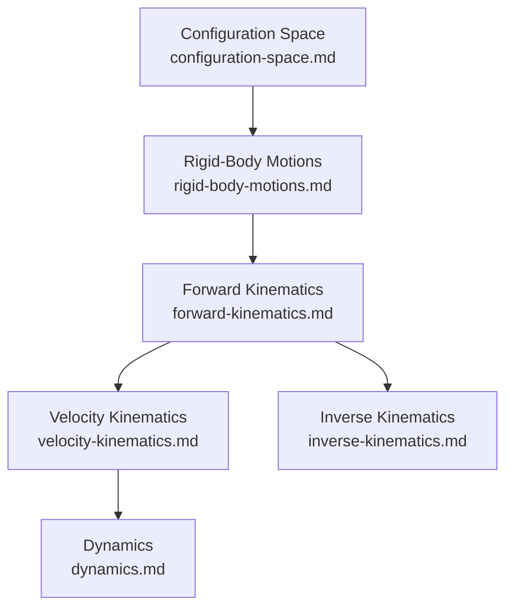

# Robotics: Overview

This file is the index for the `concepts/robotics/` folder. It lists planned and written subtopic notes, organizes them by theme, and collects the canonical references for the field. Use it to decide what to write next without needing to re-survey the landscape.

This cluster is the math backbone for the [[curricula/robotics/curriculum|SO-101 Robotics Curriculum]] — each note here corresponds to one or two chapters of **Modern Robotics** (Lynch & Park), the curriculum's anchor textbook for Modules 0, 1, and 3, written up with full derivations rather than paraphrased.

---

## Notes in This Folder

| File | Status | Topic |
|------|--------|-------|
| `configuration-space.md` | ✅ Written | Configuration space, degrees of freedom, Grubler's formula, holonomic/nonholonomic constraints, task space vs. configuration space |
| `rigid-body-motions.md` | 🔲 Planned | Rotation matrices, angular velocity, exponential coordinates for rotation (SO(3)) |
| `forward-kinematics.md` | 🔲 Planned | Product-of-exponentials formula, Denavit-Hartenberg convention, homogeneous transforms (SE(3)) |
| `velocity-kinematics.md` | 🔲 Planned | Space/body Jacobians, manipulability, kinematic singularities |
| `inverse-kinematics.md` | 🔲 Planned | Newton-Raphson iterative IK, numerical and analytic approaches |
| `dynamics.md` | 🔲 Planned | Lagrangian formulation, mass matrix, Coriolis/centrifugal terms, equations of motion for open chains |

---

## Subtopic Map

### Configuration and Motion Representation

| Subtopic | Key Idea | Primary Source |
|----------|----------|-----------------|
| Configuration space | The manifold of all possible configurations of a mechanical system | Modern Robotics Ch. 1–2 |
| Degrees of freedom | Dimension of the configuration space; counted via Grubler's formula for linkages | Modern Robotics Ch. 2 |
| Rigid-body motion | Rotation matrices (SO(3)) and rigid transforms (SE(3)), exponential coordinates | Modern Robotics Ch. 3 |

### Kinematics

| Subtopic | Key Idea | Primary Source |
|----------|----------|-----------------|
| Forward kinematics | Mapping joint angles to end-effector pose via product-of-exponentials or DH parameters | Modern Robotics Ch. 4 |
| Velocity kinematics | Jacobian relating joint velocities to end-effector twist; singularities | Modern Robotics Ch. 5 |
| Inverse kinematics | Solving for joint angles given a target end-effector pose | Modern Robotics Ch. 6 |

### Dynamics

| Subtopic | Key Idea | Primary Source |
|----------|----------|-----------------|
| Lagrangian dynamics | Equations of motion for open kinematic chains, mass matrix, Coriolis terms | Modern Robotics Ch. 8 |

---

## Dependency Graph

---

## Master References

| Reference | Authors | Year | What It Covers | Link |
|-----------|---------|------|-----------------|------|
| [Modern Robotics: Mechanics, Planning, and Control](http://hades.mech.northwestern.edu/images/7/7f/MR.pdf) | Kevin M. Lynch, Frank C. Park | 2017 | Full textbook — configuration space through dynamics and control; anchor for this entire cluster | [Free PDF](http://hades.mech.northwestern.edu/images/7/7f/MR.pdf), [modernrobotics.org](http://modernrobotics.org) |
| [16-811 Math Fundamentals for Robotics](https://www.cs.cmu.edu/~me/courses/811/mathfund.html) | Matt Mason (CMU) | — | Grad-level supplementary rigor on linear algebra, differential geometry, and configuration-space topics used in the curriculum's Module 1 | [cs.cmu.edu/~me/courses/811](https://www.cs.cmu.edu/~me/courses/811/mathfund.html) |
