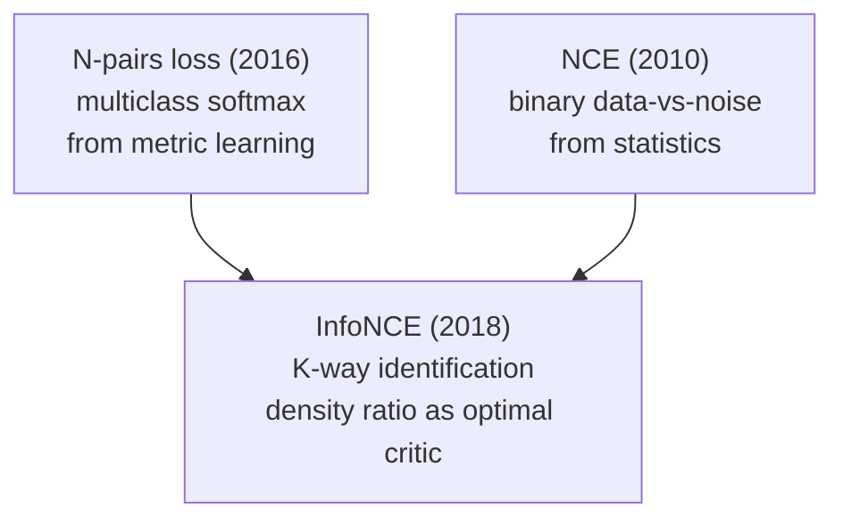
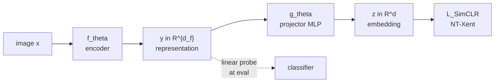
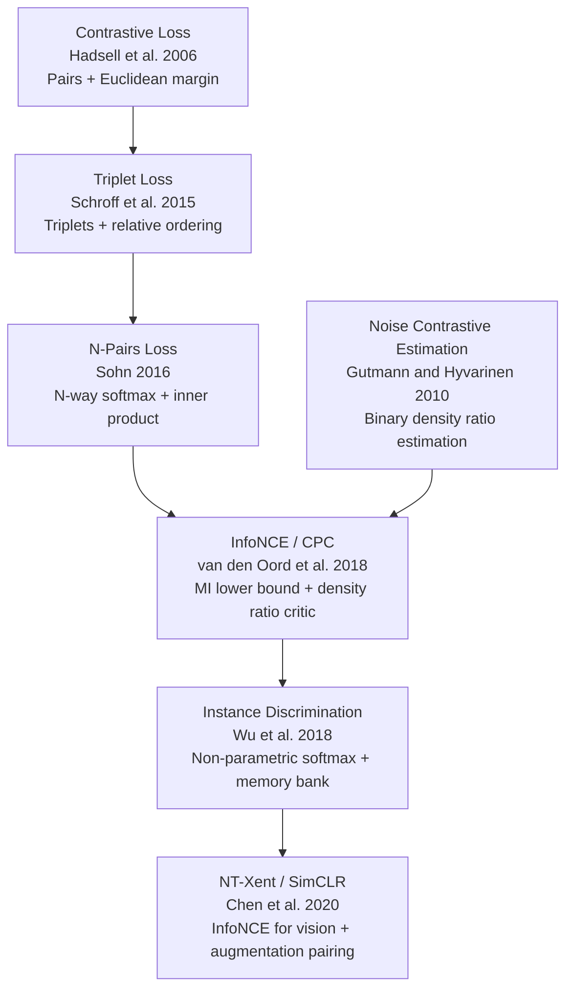

# 📏 Contrastive Learning: From Metric Learning to InfoNCE and SimCLR

*A historical account of how pairwise margin losses became an information-theoretic objective*

## Table of Contents

- [[#🗺️ The Metric Learning Framing|🗺️ The Metric Learning Framing]]
- [[#⚖️ The Contrastive Loss (Hadsell et al., 2006)|⚖️ The Contrastive Loss (Hadsell et al., 2006)]]
- [[#🔺 The Triplet Loss (Schroff et al., 2015)|🔺 The Triplet Loss (Schroff et al., 2015)]]
- [[#🔢 From Pairs to N-Pairs (Sohn, 2016)|🔢 From Pairs to N-Pairs (Sohn, 2016)]]
- [[#📡 InfoNCE and Contrastive Predictive Coding (van den Oord et al., 2018)|📡 InfoNCE and Contrastive Predictive Coding (van den Oord et al., 2018)]]
  - [[#🔗 From NCE to InfoNCE: Statistical Roots|🔗 From NCE to InfoNCE: Statistical Roots]]
  - [[#🔑 The Categorical Cross-Entropy Derivation|🔑 The Categorical Cross-Entropy Derivation]]
  - [[#📐 The Mutual Information Lower Bound|📐 The Mutual Information Lower Bound]]
  - [[#🌡️ The Role of the Critic|🌡️ The Role of the Critic]]
- [[#🖼️ Instance Discrimination: The Vision Bridge (Wu et al., 2018)|🖼️ Instance Discrimination: The Vision Bridge (Wu et al., 2018)]]
- [[#🧪 SimCLR: InfoNCE for Vision (Chen et al., 2020)|🧪 SimCLR: InfoNCE for Vision (Chen et al., 2020)]]
  - [[#🔭 Augmentation Strategy|🔭 Augmentation Strategy]]
  - [[#📐 NT-Xent as an InfoNCE Instance|📐 NT-Xent as an InfoNCE Instance]]
  - [[#🔬 The Projector Head|🔬 The Projector Head]]
  - [[#🌡️ Temperature and Hard Negatives|🌡️ Temperature and Hard Negatives]]
  - [[#🌐 Alignment and Uniformity on the Hypersphere|🌐 Alignment and Uniformity on the Hypersphere]]
- [[#🧭 Retrospective: The Historical Arc|🧭 Retrospective: The Historical Arc]]
- [[#📚 References|📚 References]]

---

## 🗺️ The Metric Learning Framing

*Contrastive learning* is a family of representation learning methods unified by a single geometric goal: learn an embedding $f_\theta : \mathcal{X} \to \mathbb{R}^d$ such that *semantically similar* inputs are mapped to nearby points and *semantically dissimilar* inputs are mapped to distant points.

Formally, let $\mathcal{X}$ be the input space and let $\sim$ denote a semantic equivalence (e.g. "same class", "same image under augmentation"). We seek:

$$f_\theta(x) \approx f_\theta(x') \quad \text{whenever } x \sim x'$$
$$\|f_\theta(x) - f_\theta(x'')\| \gg 0 \quad \text{whenever } x \not\sim x''.$$

In *metric learning*, similarity is defined by labels — pairs $(x, x^+)$ share a class, pairs $(x, x^-)$ do not. In *self-supervised* contrastive learning, similarity is defined by *augmentation invariance* — $(x, x^+)$ are two views of the same underlying image.

The history of contrastive learning traces a 15-year arc: from margin-based pairwise losses (2006) through triplets (2015), through the statistical mechanics of noise contrastive estimation and its generalization to mutual information bounds (2018), through the first vision applications via instance discrimination (2018), and culminating in SimCLR's clean operationalization for large-scale vision (2020).

> [!NOTE] Relation to other notes
> This note focuses on the loss functions and their historical development. For how SimCLR fits into the post-contrastive landscape (BYOL, Barlow Twins, VICReg), see [[concepts/self-supervised-vision/ssl-vision|Self-Supervised Vision: Contrastive Learning and Beyond]]. For the theoretical geometry of these objectives on the hypersphere, see [[concepts/self-supervised-vision/ssl-theory|Theoretical Foundations of Self-Supervised Vision]].

---

## ⚖️ The Contrastive Loss (Hadsell et al., 2006)

📐 Hadsell, Chopra, and LeCun introduced the original *contrastive loss* in the context of *dimensionality reduction by learning an invariant mapping* — a siamese network architecture that takes pairs of inputs and pushes them together or apart.

**Setup.** A siamese network $f_\theta$ shares parameters across two branches. Given a labeled pair $(x_1, x_2)$ with label $y \in \{0, 1\}$ ($y = 0$ = same class / similar; $y = 1$ = different class / dissimilar), define:

$$D_W = \|f_\theta(x_1) - f_\theta(x_2)\|_2.$$

**Definition (Contrastive Loss).**

$$\mathcal{L}_{\text{con}}(\theta;\, x_1, x_2, y) = (1 - y)\,\frac{D_W^2}{2} + y\, \frac{\max(0,\, m - D_W)^2}{2}$$

where $m > 0$ is a *margin* hyperparameter.

**Mechanics of each term:**

- $(1-y) D_W^2 / 2$: when $y = 0$ (similar pair), the loss is the squared distance — minimized by pulling the representations together.
- $y \max(0, m - D_W)^2 / 2$: when $y = 1$ (dissimilar pair), the loss is a hinge on the distance — penalized only if $D_W < m$, i.e. if the dissimilar representations are *too close*. Once they are farther than $m$ apart, the gradient vanishes.

The hinge structure is deliberate: pushing all dissimilar pairs infinitely far apart would dominate training and destabilize the embedding. The margin $m$ creates a *dead zone* — dissimilar pairs farther than $m$ contribute no gradient.

> [!EXAMPLE] Geometric picture
> Think of the embedding space $\mathbb{R}^d$ with each pair of images as two point masses. Similar pairs are connected by a spring (pulling together). Dissimilar pairs are connected by a repulsive force that activates only when they enter within radius $m$ of each other. At equilibrium, similar pairs cluster tightly and dissimilar pairs maintain at least distance $m$.

> [!WARNING] The margin is a dead hyperparameter
> *The margin $m$ is notoriously hard to tune.* If $m$ is too small, dissimilar pairs stop receiving gradients before they are well-separated in representation space. If $m$ is too large, all dissimilar pairs dominate training with high loss, overwhelming the attractive force on similar pairs. This sensitivity motivated later losses that are margin-free.

---

> [!QUESTION] Exercise 1: Contrastive Loss Gradients
> *The contrastive loss creates opposite gradient flows for similar and dissimilar pairs.*
>
> > **Prerequisites:** [[#⚖️ The Contrastive Loss (Hadsell et al., 2006)|The Contrastive Loss]]
>
> Let $\delta = f_\theta(x_1) - f_\theta(x_2) \in \mathbb{R}^d$ be the difference vector. Compute $\partial \mathcal{L}_{\text{con}} / \partial f_\theta(x_1)$ for both $y = 0$ and $y = 1$ (assuming the hinge is active in the dissimilar case). Show that the similar-pair gradient points in $-\delta$ direction and the dissimilar-pair gradient points in $+\delta$ direction, confirming the attractive/repulsive geometry.

> [!TIP]- Solution to Exercise 1
> **Key insight:** The gradient is a signed version of the difference vector, flipping sign between similar and dissimilar cases.
>
> **Sketch:** Write $\mathcal{L}_{\text{con}} = (1-y)\|\delta\|^2/2 + y\max(0, m - \|\delta\|)^2/2$.
>
> For $y = 0$: $\mathcal{L} = \|\delta\|^2/2$, so $\partial\mathcal{L}/\partial f_\theta(x_1) = \partial\|\delta\|^2/2\,/\,\partial f_\theta(x_1) = \delta$. Gradient descent subtracts $\delta$, i.e. moves $f_\theta(x_1)$ toward $f_\theta(x_2)$. ✓
>
> For $y = 1$ (hinge active, $D_W < m$): $\mathcal{L} = (m - \|\delta\|)^2/2$, so $\partial\mathcal{L}/\partial f_\theta(x_1) = -(m - \|\delta\|) \cdot \partial\|\delta\|/\partial f_\theta(x_1) = -(m - D_W)\,\delta/D_W$. This is a negative multiple of $\delta$ — gradient descent moves $f_\theta(x_1)$ *away* from $f_\theta(x_2)$ (in direction $-\delta \cdot (-1)$), i.e. opposite the attraction. ✓

---

## 🔺 The Triplet Loss (Schroff et al., 2015)

The contrastive loss operates on *pairs*. A key limitation: the margin $m$ is specified in absolute distance units, disconnected from the geometry of the local embedding neighborhood. The *triplet loss*, introduced by Schroff, Kalenichenko, and Philbin in FaceNet (2015), shifts from absolute distances to *relative ordering*.

**Setup.** A *triplet* consists of:
- *Anchor* $a$: the reference image
- *Positive* $p$: an image similar to $a$ (same identity / class)
- *Negative* $n$: an image dissimilar to $a$

The goal is to ensure the anchor is closer to the positive than to any negative by at least a margin $\alpha > 0$:

$$\|f_\theta(a) - f_\theta(p)\|_2^2 + \alpha < \|f_\theta(a) - f_\theta(n)\|_2^2.$$

**Definition (Triplet Loss).**

$$\mathcal{L}_{\text{trip}}(\theta;\, a, p, n) = \max\!\Bigl(0,\; \|f_\theta(a) - f_\theta(p)\|_2^2 - \|f_\theta(a) - f_\theta(n)\|_2^2 + \alpha\Bigr).$$

The loss is zero (no gradient) when the positive is already farther from the anchor than the negative is, by margin $\alpha$. Otherwise, it penalizes the *gap* between positive and negative distances.

> [!NOTE] From absolute to relative constraint
> The contrastive loss says: "similar pairs must have distance $< 0$ and dissimilar pairs must have distance $> m$" — an absolute statement. The triplet loss says: "the positive must be closer to the anchor than the negative by at least $\alpha$" — a *relative* ordering. This is the key conceptual advance: the loss is indifferent to the absolute scale of distances and responds only to the ranking of $d(a,p)$ vs $d(a,n)$.

### 🔑 Triplet Mining

With $N$ training examples, there are $O(N^3)$ triplets. Most are *easy* — the positive is already much closer than the negative and the loss is zero. Training on easy triplets provides no gradient.

*Hard negatives* are negatives $n$ where $\|f_\theta(a) - f_\theta(n)\|^2 < \|f_\theta(a) - f_\theta(p)\|^2$ — the negative is *closer to the anchor than the positive is*. These are the most informative for learning.

FaceNet introduced *semi-hard mining*: select negatives where

$$\|f_\theta(a) - f_\theta(p)\|_2^2 < \|f_\theta(a) - f_\theta(n)\|_2^2 < \|f_\theta(a) - f_\theta(p)\|_2^2 + \alpha,$$

i.e. negatives that are farther than the positive but within the margin. These are neither trivial nor so hard they destabilize training.

> [!WARNING] Sampling sensitivity
> *The triplet loss's performance is dominated by the mining strategy.* Training on a uniform random sample of triplets is almost always wasteful — most triplets contribute zero gradient. Conversely, only mining the hardest negatives leads to degenerate solutions and training instability (the network overfits to the hardest few examples). Semi-hard mining emerged as an empirical compromise, not a principled solution. This fragility motivated the move to *in-batch* negatives.

---

> [!QUESTION] Exercise 2: Semi-Hard Mining Region
> *Semi-hard negatives are those that fall in an annular region around the anchor in embedding space.*
>
> > **Prerequisites:** [[#🔺 The Triplet Loss (Schroff et al., 2015)|The Triplet Loss]]
>
> For a fixed anchor $a$ and positive $p$ with $d_+ = \|f_\theta(a) - f_\theta(p)\|_2$, describe geometrically the set of embedding points $z = f_\theta(n)$ that qualify as *semi-hard negatives*. Your description should use the two concentric spheres centered at $f_\theta(a)$ with radii $r_1$ and $r_2$; identify $r_1$ and $r_2$.

> [!TIP]- Solution to Exercise 2
> **Key insight:** Semi-hard negatives form an open annular shell centered at the anchor.
>
> **Sketch:** Semi-hard negatives satisfy $d_+ < \|z - f_\theta(a)\| < d_+ + \sqrt{\alpha}$ (converting from squared distances: $d_+^2 < \|z - f_\theta(a)\|^2 < d_+^2 + \alpha$, so $r_1 = d_+$ and $r_2 = \sqrt{d_+^2 + \alpha}$). Geometrically: the set of valid semi-hard negatives is an open spherical shell centered at $f_\theta(a)$ with inner radius $r_1 = d_+$ (the positive distance) and outer radius $r_2 = \sqrt{d_+^2 + \alpha}$ (just beyond margin distance). As $\alpha \to 0$ the shell vanishes; as $\alpha \to \infty$ all farther-than-positive negatives qualify.

---

## 🔢 From Pairs to N-Pairs (Sohn, 2016)

A structural limitation of both the contrastive and triplet losses is their *local view*: each optimization step updates parameters based on a single pair or triplet. Given a fixed anchor $a$, we get one gradient signal — either from one positive or one negative.

Sohn (2016) generalized the triplet loss to the *N-pairs loss*, which simultaneously contrasts a single positive against $N-1$ negatives in a single step:

**Definition (N-pairs Loss).** Given an anchor $x$, a positive $x^+$, and $N-1$ negatives $\{x_1^-, \ldots, x_{N-1}^-\}$, with embeddings $z = f_\theta(x)$, $z^+ = f_\theta(x^+)$, $z_i^- = f_\theta(x_i^-)$:

$$\mathcal{L}_{N\text{-pairs}}(\theta;\, x, x^+, \{x_i^-\}) = \log\!\left(1 + \sum_{i=1}^{N-1} \exp\!\bigl(z^\top z_i^- - z^\top z^+\bigr)\right).$$

Equivalently, normalizing embeddings (working with inner products as similarities):

$$\mathcal{L}_{N\text{-pairs}} = -\log\frac{\exp(z^\top z^+)}{\exp(z^\top z^+) + \sum_{i=1}^{N-1} \exp(z^\top z_i^-)}.$$

This is a *softmax cross-entropy*: the loss is the negative log-probability assigned to the correct class (the positive) in a $(N)$-way classification problem.

> [!NOTE] Multi-class contrastive as classification
> The N-pairs loss reveals that contrastive learning with multiple negatives is equivalent to a $N$-way classification problem at each step: "given anchor $z$, which of these $N$ candidates ($z^+, z_1^-, \ldots, z_{N-1}^-$) is the true positive?" The model succeeds by assigning the highest score to $z^+$. This classification framing is the conceptual bridge to InfoNCE.

> [!INFO] Efficient batch construction
> Sohn's batch construction: sample $N$ classes, sample 2 images per class. Anchor-positive pairs come from within-class pairs; negatives come from the $N-1$ other classes. This produces an efficient batch of $2N$ images yielding $N$ pairs each with $N-1$ negatives — $O(N^2)$ negative comparisons from $O(N)$ images.

---

> [!QUESTION] Exercise 3: N-Pairs as Softmax
> *The N-pairs loss is the cross-entropy of a softmax over cosine similarities.*
>
> > **Prerequisites:** [[#🔢 From Pairs to N-Pairs (Sohn, 2016)|From Pairs to N-Pairs]]
>
> Define a $N$-way categorical distribution over the set $\{x^+, x_1^-, \ldots, x_{N-1}^-\}$ by applying a softmax to the inner products with $z$:
>
> $$q_j = \frac{\exp(z^\top z_j)}{\sum_{k} \exp(z^\top z_k)}.$$
>
> Show that $\mathcal{L}_{N\text{-pairs}} = -\log q_{x^+}$ where $q_{x^+}$ is the weight assigned to the positive. What happens to this loss when $N = 2$ (one positive, one negative)? Compare to the contrastive loss.

> [!TIP]- Solution to Exercise 3
> **Key insight:** The N-pairs loss is exactly the cross-entropy loss for a classifier that predicts which candidate is the positive — unifying metric learning with classification.
>
> **Sketch:** By definition, $q_{x^+} = \exp(z^\top z^+) / (\exp(z^\top z^+) + \sum_i \exp(z^\top z_i^-))$. Then $-\log q_{x^+}$ is precisely the N-pairs formula. For $N = 2$ (one positive, one negative): $\mathcal{L} = -\log[\exp(z^\top z^+) / (\exp(z^\top z^+) + \exp(z^\top z^-))] = \log(1 + \exp(z^\top z^- - z^\top z^+))$ — a logistic loss on the score gap. Unlike the contrastive loss, there is no margin and no squared distance — similarity is measured by inner product, not Euclidean distance.

---

## 📡 InfoNCE and Contrastive Predictive Coding (van den Oord et al., 2018)

The conceptual leap from N-pairs to *InfoNCE* came through *Contrastive Predictive Coding* (CPC), introduced by van den Oord, Li, and Vinyals at DeepMind. CPC was designed for sequential data (speech, video) — learning representations by predicting the future from the present. But the loss function it introduced, *InfoNCE*, became the mathematical foundation of all modern contrastive learning.

### 🔗 From NCE to InfoNCE: Statistical Roots

InfoNCE does not appear from nowhere — it is a direct descendant of *Noise Contrastive Estimation* (NCE), introduced by Gutmann & Hyvärinen (2010) for fitting unnormalized density models without computing an intractable partition function.

**The NCE problem.** Suppose we have an unnormalized model $\tilde{p}_\theta(x)$ and want to estimate $p_\theta(x) = \tilde{p}_\theta(x) / Z(\theta)$ where $Z(\theta) = \int \tilde{p}_\theta(x)\,dx$ is intractable. The maximum likelihood objective is:

$$\mathcal{L}_{\text{MLE}} = -\frac{1}{n}\sum_i \log p_\theta(x_i) = -\frac{1}{n}\sum_i \log \tilde{p}_\theta(x_i) + \log Z(\theta).$$

The $\log Z(\theta)$ term is intractable, and its gradient $\nabla_\theta \log Z(\theta) = \mathbb{E}_{x \sim p_\theta}[\nabla_\theta \log \tilde{p}_\theta(x)]$ requires sampling from the model itself. NCE replaces this with a *binary classification* problem — but the connection is not obvious and deserves unpacking.

**Why a classifier can recover a density.** The key insight comes from a basic Bayesian calculation. Suppose you mix data samples $x^+ \sim p_d(x)$ with noise samples $x^- \sim p_n(x)$ at ratio $1:k$. Introduce a binary label $C \in \{\text{data}, \text{noise}\}$; the prior probabilities are $P(C = \text{data}) = \frac{1}{1+k}$ and $P(C = \text{noise}) = \frac{k}{1+k}$.

Applying Bayes' theorem for $P(C = \text{data} \mid x)$, the marginal $P(x)$ expands by the law of total probability:

$$P(x) = p_d(x) \cdot \frac{1}{1+k} + p_n(x) \cdot \frac{k}{1+k} = \frac{p_d(x) + k\,p_n(x)}{1+k}.$$

Substituting into Bayes' theorem — the $(1+k)$ factors cancel:

$$h^*(x) = P(C = \text{data} \mid x) = \frac{p_d(x) \cdot \frac{1}{1+k}}{\frac{p_d(x) + k\,p_n(x)}{1+k}} = \frac{p_d(x)}{p_d(x) + k\, p_n(x)}.$$

Now rearrange: the odds ratio of the optimal classifier gives you the density ratio directly,

$$\frac{h^*(x)}{1 - h^*(x)} = \frac{p_d(x)}{k\, p_n(x)} \implies p_d(x) = k\, p_n(x) \cdot \frac{h^*(x)}{1 - h^*(x)}.$$

Since $p_n$ and $k$ are known, **a perfect classifier uniquely determines $p_d$** — without any integrals. This is the bridge: solving binary classification is equivalent to learning the density ratio $p_d / p_n$.

**How NCE exploits this.** NCE parameterizes the classifier using the model,

$$h_\theta(x) = \frac{p_\theta(x)}{p_\theta(x) + k\, p_n(x)}, \qquad p_\theta(x) = \frac{\tilde{p}_\theta(x)}{e^c},$$

where $c = \log Z(\theta)$ is treated as an *additional scalar parameter* to be learned by gradient descent — not computed by integration. The binary cross-entropy loss is then:

**Definition (NCE Objective).**

$$\mathcal{L}_{\text{NCE}}(\theta, c) = -\mathbb{E}_{x \sim p_d}\!\left[\log h_\theta(x)\right] - k\,\mathbb{E}_{y \sim p_n}\!\left[\log\bigl(1 - h_\theta(y)\bigr)\right].$$

This only ever evaluates $\tilde{p}_\theta$ at individual sample points — no integral, no expectation under $p_\theta$. At the minimum, the classifier achieves Bayes optimality: $h_\theta = h^*$, which forces $p_\theta(x) = p_d(x)$ everywhere. The scalar $c$ converges to the true $\log Z(\theta)$ as a byproduct — the model learns normalization automatically.

**This is the statistical core of contrastive learning: estimating a density ratio by training a classifier against a reference distribution.**

**From NCE to InfoNCE.** The N-pairs loss (from the metric learning lineage) and NCE (from the statistics lineage) converge at InfoNCE via two independent generalizations:

InfoNCE generalizes the binary NCE classifier ($K = 2$: data or noise) to a $K$-way identification task, while inheriting NCE's key insight that the optimal solution is a density ratio:

| | NCE | InfoNCE |
|---|---|---|
| Positive | $x \sim p_d(x)$ — real data | $x^+ \sim p(x \mid c)$ — real data, conditioned on context |
| Negative | $x \sim p_n(x)$ — **synthetic** noise | $x_k \sim p(x)$ — **real data**, unconditional |
| Are negatives real? | No | Yes |
| Discrimination tests | Real vs. fake | Conditioned vs. unconditioned |
| Optimal classifier | $p_d(x)/p_n(x)$ | $p(x \mid c)/p(x)$ |
| What's estimated | Log partition function $\log Z$ | Mutual information $I(X; C)$ |

The structural analogy $p_n \leftrightarrow p(x)$ holds at the level of the math — both serve as the reference in the density ratio — but hides a deep conceptual shift. In NCE, negatives are *synthetic*: you fabricate a noise distribution $p_n$ and draw fake samples from it. In InfoNCE, **all $K$ candidates are real data**. There is no real-vs-fake distinction. The discrimination task is purely about *conditioning*: which of these real samples was drawn from $p(x \mid c)$ rather than the unconditional $p(x)$?

The reason $p(x)$ appears as the reference is not that it acts as noise — it is that the conditional-vs-marginal ratio $p(x \mid c)/p(x)$ is exactly what mutual information measures: $I(X; C) = \mathbb{E}[\log p(x \mid c)/p(x)]$. Distinguishing samples from $p(x \mid c)$ vs. $p(x)$ *is* MI estimation. NCE estimated a partition function; InfoNCE estimates an information-theoretic quantity.

> [!INFO] NCE in NLP: word2vec negative sampling
> NCE was widely used in NLP before the deep learning era. Word2vec's negative sampling (Mikolov et al., 2013) is an instance of NCE applied to pointwise mutual information between a word and its context: the loss $\log \sigma(z_w^\top z_c) + k\,\mathbb{E}_{w' \sim p_n}[\log \sigma(-z_{w'}^\top z_c)]$ is a binary NCE with $k$ noise words. This is another direct ancestor of InfoNCE in the same lineage.

### 🔑 The Categorical Cross-Entropy Derivation

**Setup.** We have a context representation $c$ (the "query") and a set of $K$ candidate representations $\{x_1, \ldots, x_K\}$, exactly one of which ($x_+$, at position $j^*$) is the *positive* — the true future/paired sample. The rest are negatives, drawn independently from the data distribution $p(x)$.

Let $f_\theta(x, c)$ be a *critic function* (also called a *score function*) measuring compatibility between candidate $x$ and context $c$. The model assigns probability:

$$p(j \mid \{x_1, \ldots, x_K\}, c) = \frac{f_\theta(x_j, c)}{\sum_{k=1}^{K} f_\theta(x_k, c)}.$$

**Definition (InfoNCE Loss).**

$$\mathcal{L}_{\text{InfoNCE}} = -\mathbb{E}\!\left[\log \frac{f_\theta(x_+, c)}{\sum_{k=1}^{K} f_\theta(x_k, c)}\right]$$

where the expectation is over the choice of positive $x_+$ and the $K-1$ negatives drawn from $p(x)$.

> [!NOTE] Choice of critic
> Van den Oord et al. used $f_\theta(x_k, c) = \exp(z_k^\top W_i c)$ where $W_i$ is a learned matrix (different for each prediction step $i$). This is a *bilinear critic*. For vision, SimCLR later simplifies to $f(z, z') = \exp(\bar{z}^\top \bar{z}' / \tau)$ — a cosine similarity critic.

### 📐 The Mutual Information Lower Bound

The central theorem that gives InfoNCE its name:

**Theorem (InfoNCE Lower Bound).** Let $X$ and $C$ be jointly distributed random variables. Define

$$I_\theta(X; C) \triangleq \mathbb{E}\!\left[\log \frac{f_\theta(x, c)}{\frac{1}{K}\sum_{k=1}^K f_\theta(x_k, c)}\right]$$

where $x_1, \ldots, x_K$ are $K-1$ negatives plus one positive from $p(x \mid c)$. Then:

$$I(X; C) \geq I_\theta(X; C) \geq \log K - \mathcal{L}_{\text{InfoNCE}}.$$

**Proof sketch.** We derive the lower bound $\mathcal{L}_{\text{InfoNCE}} \geq \log K - I(X; C)$, equivalently $I(X; C) \geq \log K - \mathcal{L}_{\text{InfoNCE}}$.

The optimal critic that minimizes $\mathcal{L}_{\text{InfoNCE}}$ is the *density ratio*:

$$f^*(x, c) = \frac{p(x \mid c)}{p(x)}.$$

*Why?* The minimizer of $-\mathbb{E}[\log q(j^* \mid \cdot)]$ over any probability distribution $q$ is the true conditional $p(j^* \mid \cdot)$. By Bayes:

$$p(j^* = j \mid \{x_k\}, c) \propto p(x_j \mid c) \cdot \prod_{k \neq j} p(x_k) \propto \frac{p(x_j \mid c)}{p(x_j)},$$

so the optimal critic is the density ratio $p(x \mid c) / p(x)$.

Substituting $f^*$ into $\mathcal{L}_{\text{InfoNCE}}$:

$$\mathcal{L}_{\text{InfoNCE}}^* = -\mathbb{E}\!\left[\log\frac{p(x_+ \mid c) / p(x_+)}{\frac{1}{K}\sum_{k=1}^{K} p(x_k \mid c) / p(x_k)}\right].$$

Using Jensen's inequality and the law of large numbers (the denominator concentrates to $\mathbb{E}_{p(x)}[p(x \mid c)/p(x)] = 1$):

$$\mathcal{L}_{\text{InfoNCE}}^* \approx -\mathbb{E}\!\left[\log\frac{p(x_+ \mid c)}{p(x_+)}\right] + \log K = -I(X;C) + \log K.$$

Hence $I(X; C) = \log K - \mathcal{L}^*_{\text{InfoNCE}}$, and for any sub-optimal $\theta$, $I(X; C) \geq \log K - \mathcal{L}_{\text{InfoNCE}}(\theta)$. $\square$

**Key consequence.** Minimizing $\mathcal{L}_{\text{InfoNCE}}$ over $\theta$ maximizes a lower bound on $I(X; C)$. The bound is tight as $K \to \infty$ (more negatives = better MI estimate). **This gives contrastive learning a principled information-theoretic interpretation: it maximizes mutual information between views.**

> [!WARNING] The $\log K$ ceiling
> *The InfoNCE bound has a hard ceiling at $\log K$ — it cannot estimate MI above $\log K$ bits regardless of the quality of $f_\theta$.* With $K = 256$ negatives, $\log K \approx 5.5$ bits. For images with rich structure, the true MI between views can be much larger. This is why SimCLR uses $K \approx 8192$ negatives (batch size $\sim 4096$, two views per image): the larger the negative pool, the higher the MI ceiling. *Increasing $K$ improves both the bound and the representations.*

### 🌡️ The Role of the Critic

The InfoNCE framework separates the *architecture* (how $f_\theta$ is implemented) from the *objective* (the categorical cross-entropy). Different critic designs lead to different methods:

| Critic $f_\theta(x, c)$ | Method |
|---|---|
| $\exp(z^\top W_i c)$ (bilinear, $W_i$ per step) | CPC (van den Oord 2018) |
| $\exp(z^\top c / \tau)$ (inner product, fixed $\tau$) | SimCLR / NT-Xent |
| $\exp(z^\top c)$ (inner product, $\tau = 1$) | N-pairs (Sohn 2016) |

The bilinear critic in CPC allows the compatibility function to rotate and scale the context before comparing — more expressive but introduces $O(d^2)$ parameters per prediction step.

---

> [!QUESTION] Exercise 4: Optimal Critic Verification
> *The density ratio $p(x \mid c)/p(x)$ is the unique minimizer of $\mathcal{L}_{\text{InfoNCE}}$ over all positive functions $f$.*
>
> > **Prerequisites:** [[#📡 InfoNCE and Contrastive Predictive Coding (van den Oord et al., 2018)|InfoNCE and CPC]]
>
> For $K = 2$ (one positive $x^+$, one negative $x^-$), write out $\mathcal{L}_{\text{InfoNCE}}$ explicitly as a function of $f(x^+, c)$ and $f(x^-, c)$. Show that setting $f(x, c) = p(x \mid c) / p(x)$ gives $\mathcal{L}^* = \log 2 - I(X; C)$ (matching the theorem). Then verify directly that no other positive function $f$ can achieve a lower expected loss.

> [!TIP]- Solution to Exercise 4
> **Key insight:** For $K=2$ the InfoNCE loss reduces to a binary cross-entropy, and the Neyman-Pearson lemma guarantees the density ratio is the optimal binary classifier.
>
> **Sketch:** For $K=2$: $\mathcal{L} = -\mathbb{E}[\log(f(x^+,c) / (f(x^+,c) + f(x^-,c)))]$. Let $r = f(x^+,c)/f(x^-,c)$; the loss is $-\mathbb{E}[\log(r/(1+r))]$, a binary cross-entropy with logit $\log r$. The optimal logit for distinguishing $x^+$ (drawn from $p(x\mid c)$) from $x^-$ (drawn from $p(x)$) is the log density ratio $\log(p(x \mid c)/p(x))$ — this is exactly the Neyman-Pearson optimal likelihood ratio test. Substituting: $\mathcal{L}^* = -\mathbb{E}[\log(p(x^+ \mid c)/p(x^+)) / (p(x^+ \mid c)/p(x^+) + 1)] = \log 2 - I(X;C)$ (by direct computation using $I(X;C) = \mathbb{E}[\log p(x\mid c)/p(x)]$). Any other $f$ corresponds to a suboptimal binary classifier and achieves higher loss.

---

> [!QUESTION] Exercise 5: Bound Tightness as $K \to \infty$
> *The InfoNCE bound becomes tight in the limit of infinitely many negatives.*
>
> > **Prerequisites:** [[#📐 The Mutual Information Lower Bound|The Mutual Information Lower Bound]]
>
> Using the law of large numbers, argue informally that as $K \to \infty$:
>
> $$\frac{1}{K}\sum_{k=1}^{K} f^*(x_k, c) \xrightarrow{p} \mathbb{E}_{p(x)}\!\left[\frac{p(x \mid c)}{p(x)}\right] = 1.$$
>
> Substitute this limit into the expression for $\mathcal{L}^*_{\text{InfoNCE}}$ and show the bound $\log K - \mathcal{L}^*$ approaches $I(X; C)$ exactly. What does this imply about practical batch-size choices?

> [!TIP]- Solution to Exercise 5
> **Key insight:** The denominator in the InfoNCE loss is a Monte Carlo estimate of $\mathbb{E}_{p(x)}[f^*(x,c)] = 1$; as $K \to \infty$ the estimate concentrates and the bias vanishes.
>
> **Sketch:** With $f^*(x,c) = p(x \mid c)/p(x)$, each negative $x_k \sim p(x)$ contributes $f^*(x_k, c) = p(x_k \mid c)/p(x_k)$. By LLN: $(1/K)\sum_k f^*(x_k,c) \to \mathbb{E}_{p(x)}[p(x\mid c)/p(x)] = \int p(x\mid c)\,dx = 1$. So the denominator $\to 1$ in probability. Then $\mathcal{L}^*_{\text{InfoNCE}} \to -\mathbb{E}[\log(p(x^+\mid c)/p(x^+)) / 1] = -I(X;C)$, giving $\log K - \mathcal{L}^* \to \log K + I(X;C) - \log K = I(X;C)$. Practically: larger $K$ (batch size) reduces the finite-sample bias in the MI estimate, so larger batches genuinely improve representation quality — not just training stability.

---

## 🖼️ Instance Discrimination: The Vision Bridge (Wu et al., 2018)

*Unsupervised Feature Learning via Non-Parametric Instance Discrimination* (Wu, Xiong, Yu, Lin, CVPR 2018) occupies the crucial position between CPC and SimCLR: it applied the InfoNCE/NCE ideas to vision self-supervised learning for the first time, establishing that *instance-level* discrimination with no labels produces strong visual representations.

### 🎯 The Instance Discrimination Pretext Task

**Definition (Instance Discrimination).** Given a dataset $\mathcal{D} = \{x_1, \ldots, x_n\}$ of $n$ images, treat each image $x_i$ as its own class $y = i$. The pretext task is $n$-way classification: given a query, identify which training instance it came from.

This is a radical extension of the N-pairs framework: instead of $N$ classes within a mini-batch, there are $n$ classes across the *entire training set* ($n = 1{,}281{,}167$ for ImageNet).

**The non-parametric softmax.** In standard $n$-way classification, the model learns a weight vector $w_i \in \mathbb{R}^d$ per class. With $n > 10^6$ classes this is prohibitively expensive. Instead, InstDisc uses the stored embedding $v_i \in \mathbb{R}^d$ directly as the class prototype:

$$P(i \mid x) = \frac{\exp(v_i^\top f_\theta(x) / \tau)}{\sum_{j=1}^{n} \exp(v_j^\top f_\theta(x) / \tau)}.$$

The denominator sums over all $n$ training embeddings — still intractable. InstDisc approximates it using NCE.

### 💾 The Memory Bank and NCE Approximation

**Memory bank.** InstDisc maintains a bank $\mathcal{M} \in \mathbb{R}^{n \times d}$ storing the most recently computed $\ell_2$-normalized embedding for each training image. After each forward pass for image $x_i$, the entry $\mathcal{M}[i]$ is updated to the new embedding. The bank decouples the embeddings used as negatives from the current model parameters — a direct precursor to MoCo's queue.

**NCE approximation.** To avoid computing the full $n$-way denominator, InstDisc draws $m$ noise indices $\{j_1, \ldots, j_m\}$ uniformly from $\{1, \ldots, n\}$ and uses:

$$P_{\text{NCE}}(i \mid x) = \frac{\exp(v_i^\top f_\theta(x) / \tau)}{\exp(v_i^\top f_\theta(x) / \tau) + \frac{n}{m}\sum_{k=1}^{m} \exp(v_{j_k}^\top f_\theta(x) / \tau)}.$$

This is a binary classifier between the positive instance $i$ and $m$ noise instances — directly NCE with a uniform noise distribution over training indices. The $n/m$ factor corrects for the subsampling. The full loss is:

$$\mathcal{L}_{\text{InstDisc}} = -\sum_{i \in \text{batch}} \log P_{\text{NCE}}(i \mid x_i).$$

### 🔑 What InstDisc Established

InstDisc demonstrated three things that directly enabled SimCLR:

1. **Instance-level discrimination produces semantic representations.** Despite never seeing class labels, InstDisc embeddings cluster by semantic category. Nearest-neighbor retrieval using InstDisc features achieves $\sim$40% top-1 accuracy on ImageNet — competitive with early supervised methods, and achieved with zero labels.

2. **Temperature is critical at $\tau = 0.07$.** The temperature in the non-parametric softmax controls the concentration of the probability distribution. InstDisc established this value experimentally — exactly the value SimCLR later adopted.

3. **The memory bank solves the large-batch problem.** By storing all $n$ embeddings, InstDisc sidesteps the need for large mini-batches. The effective negative pool is the entire training set. The cost is *staleness*: memory bank embeddings may be up to $n/B$ batches old.

> [!INFO] From memory bank to MoCo queue
> MoCo (He et al., 2020) replaced InstDisc's full memory bank with a FIFO *queue* of the $K = 65{,}536$ most recent embeddings, kept fresh via a momentum encoder with EMA update $\xi \leftarrow m\xi + (1-m)\theta$. The queue is always current to within $K$ gradient steps, eliminating the staleness problem at the cost of a fixed negative pool size.

> [!WARNING] InstDisc uses identity, not augmentation pairing
> *Unlike SimCLR, InstDisc does not construct explicit positive pairs from augmentations.* It applies a single mild augmentation to each image and treats the stored memory bank embedding as the "positive." Two augmented views of the same image are not explicitly contrasted. This means InstDisc cannot exploit strong augmentations — heavy crops or color jitter would make the query too different from the stored prototype, breaking the identity task. SimCLR's key insight was to replace the identity pretext with augmentation pairing, which allows — indeed requires — aggressive augmentations to produce useful representations.

---

> [!QUESTION] Exercise 6: Memory Bank Staleness
> *The memory bank creates a staleness problem: embeddings used as negatives may come from an earlier encoder.*
>
> > **Prerequisites:** [[#🖼️ Instance Discrimination: The Vision Bridge (Wu et al., 2018)|Instance Discrimination]]
>
> Suppose the memory bank is updated once per epoch (one full pass through $n = 1{,}281{,}167$ images with batch size $B = 256$). An embedding stored at the start of an epoch will be used as a negative for approximately $n/B \approx 5{,}000$ subsequent batches before being refreshed. If the encoder parameters change by $\|\Delta\theta\|$ per batch, give an order-of-magnitude bound on the staleness (in gradient steps) of the oldest memory bank entries. Why does staleness bias the NCE loss toward producing weaker gradient signal?

> [!TIP]- Solution to Exercise 6
> **Key insight:** Stale embeddings come from a strictly older encoder, making negatives "easier" than the current model would produce and reducing the effective gradient signal.
>
> **Sketch:** With $n/B \approx 5{,}000$ batches per epoch, the oldest memory bank entry is up to $5{,}000$ gradient steps stale — it was produced by a model differing by $\sim 5{,}000 \cdot \|\Delta\theta\|$ in parameters. The NCE loss implicitly assumes all noise embeddings $\{v_{j_k}\}$ are drawn from the *current* encoder's distribution. Stale embeddings violate this: they come from a less-trained encoder that produces less discriminative representations. Concretely, as the encoder improves during an epoch, the stored embeddings become progressively less sharp — they cluster less tightly by instance. This makes the negatives easier to distinguish from the positive (the current embedding is sharper), so the NCE denominator is not as informative, and the gradient signal is weaker than if fresh embeddings were used. MoCo's EMA queue bounds staleness to at most $K = 65{,}536 \ll n$ steps while maintaining a large negative pool.

---

## 🧪 SimCLR: InfoNCE for Vision (Chen et al., 2020)

*A Simple Framework for Contrastive Learning of Visual Representations* (SimCLR, Chen et al., 2020) distilled the CPC/InfoNCE framework into a clean recipe for visual self-supervised learning, eliminating specialized architectures and achieving state-of-the-art with remarkable simplicity.

### 🔭 Augmentation Strategy

SimCLR's core insight: *the choice of data augmentation defines what the representation will be invariant to*, and this choice is the single most important design decision.

The augmentation pipeline samples two views $(v, v')$ of each image $x \sim p(x)$ by composing:

1. **Random cropping** — crops a random patch, resized to $224 \times 224$. This is the most important augmentation: it forces the network to recognize objects across scale and position.
2. **Random horizontal flip** — 50% probability.
3. **Color jitter** — random brightness, contrast, saturation, hue perturbations with specified strength.
4. **Random grayscale** — 20% probability of converting to grayscale.
5. **Gaussian blur** — kernel size $10\%$ of image size, $\sigma \in [0.1, 2.0]$.

The key finding: **color jitter + crop together are the dominant pair.** Without color jitter, representations exploit color histograms (a shortcut) rather than learning semantic content. Without crops, two views of the same image are too similar and the task is too easy.

> [!NOTE] Asymmetric blurring in SimCLR v2 and beyond
> Later work (MoCo v3, DINO) applied asymmetric augmentation: stronger augmentation (blur, solarize) on one view and weaker augmentation on the other. This creates a harder pretext task without destroying all visual information in either view.

### 📐 NT-Xent as an InfoNCE Instance

Given a batch of $N$ images, SimCLR produces $2N$ embeddings by applying augmentation twice to each image. After passing through encoder $f_\theta$ and projector $g_\theta$, embeddings are $\ell_2$-normalized:

$$\bar{z}_k = z_k / \|z_k\|_2, \quad k \in \{1, \ldots, 2N\}.$$

The $2N$ embeddings are indexed as $\bar{z}_1, \bar{z}_1', \bar{z}_2, \bar{z}_2', \ldots, \bar{z}_N, \bar{z}_N'$ where $(\bar{z}_k, \bar{z}_k')$ are the two views of image $k$.

**Definition (NT-Xent Loss).** The *normalized temperature-scaled cross-entropy* loss for anchor $\bar{z}_k$ is:

$$\ell_k = -\log \frac{\exp(\bar{z}_k^\top \bar{z}_k' / \tau)}{\displaystyle\sum_{m=1}^{2N} \mathbf{1}[m \neq k]\, \exp(\bar{z}_k^\top \bar{z}_m / \tau)}$$

where $\tau > 0$ is the temperature. The full objective is symmetric:

$$\mathcal{L}_{\text{SimCLR}} = \frac{1}{2N} \sum_{k=1}^{N} \bigl(\ell_k + \ell_k'\bigr).$$

**NT-Xent is InfoNCE** with critic $f_\theta(x, c) = \exp(\bar{z}(x)^\top \bar{z}(c) / \tau)$, context $c = v_k$ (one view), positive $x_+ = v_k'$ (other view of same image), and $K - 1 = 2(N-1)$ negatives from the batch (all other $2N-2$ embeddings). The identity $\mathcal{L}_{\text{NT-Xent}} = \mathcal{L}_{\text{InfoNCE}}$ holds exactly:

$$\ell_k = -\log\frac{f_\theta(\bar{z}_k', \bar{z}_k)}{\sum_{m \neq k} f_\theta(\bar{z}_m, \bar{z}_k)}.$$

**Connection to the lower bound.** By the InfoNCE theorem:

$$I(V; V') \geq \log(2N-1) - \mathcal{L}_{\text{SimCLR}}.$$

Minimizing $\mathcal{L}_{\text{SimCLR}}$ approximately maximizes the mutual information between the two augmented views. **The MI bound grows as $\log(2N-1)$ — maximized by using the largest possible batch size.**

### 🔬 The Projector Head

A surprising finding from Chen et al.: appending a 2–3 layer MLP projector $g_\theta$ after the encoder $f_\theta$, and discarding $g_\theta$ at evaluation time, consistently improves linear probe accuracy by $\sim$10 percentage points.

Without a projector, the NT-Xent loss operates directly on the encoder output, forcing the encoder to simultaneously:
1. Be invariant to the augmentations (since $(v, v')$ must map to similar $z$)
2. Be informative for downstream tasks

These two goals conflict: some information discarded for augmentation invariance (e.g. exact crop location, color saturation level) is genuinely useless, but other information discarded (e.g. fine-grained texture, color identity for certain tasks) may matter downstream.

**The projector acts as an information sink.** Information discarded by the NT-Xent objective is removed in $z = g_\theta(y)$ but preserved in $y = f_\theta(x)$, which is never directly optimized by the contrastive loss. The projector absorbs the augmentation invariances, protecting the encoder.

> [!INFO] Why three layers?
> Chen et al. ablate projector depth and find that 2-layer and 3-layer MLPs outperform 1-layer projectors, with diminishing returns at 4+. The intuition: a deeper projector can discard more nuance from the representation while the encoder retains it. A single linear layer is too constrained to "erase" complex augmentation artifacts.

### 🌡️ Temperature and Hard Negatives

The temperature $\tau$ is a crucial hyperparameter with a precise effect on the gradient distribution.

For anchor $\bar{z}_k$ with positive similarity $s_+ = \bar{z}_k^\top \bar{z}_k'$ and negative similarities $\{s_m\}_{m \neq k}$, the softmax probability assigned to negative $m$ is:

$$p_m = \frac{\exp(s_m / \tau)}{\exp(s_+/\tau) + \sum_{m'\neq k} \exp(s_{m'}/\tau)}.$$

The gradient of $\ell_k$ with respect to the positive similarity is:

$$\frac{\partial \ell_k}{\partial s_+} = \frac{-1}{\tau}(1 - p_+), \quad p_+ = \frac{\exp(s_+/\tau)}{\sum_m \exp(s_m/\tau)}.$$

The gradient with respect to negative similarity $s_m$ is:

$$\frac{\partial \ell_k}{\partial s_m} = \frac{p_m}{\tau}.$$

**Effect of $\tau$:**
- *Small $\tau$*: all softmax mass concentrates on the highest-similarity negatives (the *hard negatives* with $s_m \approx s_+$). The gradient is dominated by a few hard negatives — efficient but sensitive to noisy negatives (false negatives from the same class).
- *Large $\tau$*: softmax mass is spread uniformly. All negatives contribute equally — unbiased but inefficient, as most negatives are easy and provide little signal.

**SimCLR uses $\tau = 0.07$** — a small temperature that concentrates on hard negatives. This choice assumes negatives within a batch are unlikely to be semantically similar (reasonable at batch size 4096 with 1000 ImageNet classes), so hard negatives are genuinely hard, not false positives.

> [!WARNING] False negatives at small $\tau$
> *False negatives* — two augmented views of *different* images from the *same semantic class* — are treated as negatives but should be positives. At small $\tau$, false negatives receive maximal gradient and actively harm training. With $N = 4096$ and 1000 classes, approximately $4096/1000 \approx 4$ other images per batch share the same class as any given anchor — these are false negatives receiving strong repulsion at $\tau = 0.07$. Removing false negatives (Chuang et al., 2020, "Debiased Contrastive Learning") or handling them via soft labels improves performance.

---

> [!QUESTION] Exercise 7: Temperature Gradient Analysis
> *The temperature controls the concentration of gradient signal on hard vs. easy negatives.*
>
> > **Prerequisites:** [[#🌡️ Temperature and Hard Negatives|Temperature and Hard Negatives]]
>
> Consider $K = 3$ negatives with similarities $s_1 = 0.9$, $s_2 = 0.5$, $s_3 = 0.1$ (relative to anchor), and positive similarity $s_+ = 0.95$. Compute the softmax weights $p_1, p_2, p_3$ (ignoring the positive in the denominator for simplicity) at $\tau = 0.07$ and $\tau = 0.5$. What fraction of the gradient flows through the hardest negative ($s_1 = 0.9$) in each case?

> [!TIP]- Solution to Exercise 7
> **Key insight:** Reducing $\tau$ from 0.5 to 0.07 shifts nearly all gradient mass to the single hardest negative.
>
> **Sketch:** Softmax weights $p_i \propto \exp(s_i/\tau)$.
>
> **$\tau = 0.5$:** scores $\exp(0.9/0.5) = e^{1.8} \approx 6.05$, $\exp(1.0) \approx 2.72$, $\exp(0.2) \approx 1.22$. Sum $\approx 9.99$. Weights: $p_1 \approx 0.605$, $p_2 \approx 0.272$, $p_3 \approx 0.122$. Hardest negative fraction: $\approx 60.5\%$.
>
> **$\tau = 0.07$:** scores $\exp(0.9/0.07) = e^{12.86} \approx 3.84 \times 10^5$, $\exp(7.14) \approx 1.26 \times 10^3$, $\exp(1.43) \approx 4.18$. Sum $\approx 3.85 \times 10^5$. Weights: $p_1 \approx 0.997$, $p_2 \approx 0.003$, $p_3 \approx 0.00001$. Hardest negative fraction: $\approx 99.7\%$.
>
> At $\tau = 0.07$, essentially all gradient flows through the single hardest negative. The loss behaves as if there is only one negative — the hardest one.

---

> [!QUESTION] Exercise 8: SimCLR as Classification
> *The NT-Xent objective asks the model to identify the positive in a $2(N-1)$-way classification.*
>
> > **Prerequisites:** [[#📐 NT-Xent as an InfoNCE Instance|NT-Xent as an InfoNCE Instance]]
>
> Consider a batch of $N = 2$ images (so $2N = 4$ embeddings: $z_1, z_1', z_2, z_2'$). Write out $\ell_1$ (the loss for anchor $z_1$ with positive $z_1'$) explicitly as a $3$-way softmax. Identify the role of $z_2$ and $z_2'$ as negatives. Now suppose image 2 is actually the same semantic class as image 1 (a false negative). Qualitatively describe the erroneous gradient signal that results.

> [!TIP]- Solution to Exercise 8
> **Key insight:** In a tiny batch, false negatives send a strong "push apart" gradient signal that actively corrupts the representation.
>
> **Sketch:** With $N=2$: $\ell_1 = -\log[\exp(z_1^\top z_1'/\tau) / (\exp(z_1^\top z_1'/\tau) + \exp(z_1^\top z_2/\tau) + \exp(z_1^\top z_2'/\tau))]$ — a 3-way softmax where $z_2$ and $z_2'$ are negatives. If image 2 shares image 1's class (e.g. both are "cat"), then semantically $z_1 \approx z_2$ is *desirable* — they should be nearby. But the loss treats $z_2$ as a negative: when $z_1^\top z_2$ is high (as it should be for same-class images), the term $\exp(z_1^\top z_2/\tau)$ is large and dominates the denominator, sending a strong gradient that *pushes $z_1$ and $z_2$ apart*. The model is being trained to distinguish images from the same class — the opposite of what downstream tasks require.

---

### 🌐 Alignment and Uniformity on the Hypersphere

Wang & Isola (2020) decompose the NT-Xent objective into two orthogonal geometric properties, revealing precisely what SimCLR optimizes on the unit sphere $S^{d-1}$.

**Setup.** Since SimCLR $\ell_2$-normalizes embeddings, all representations lie on $S^{d-1}$. Let $p_{\text{pos}}$ denote the distribution over positive pairs $(z, z^+)$ and $p_{\text{data}}$ the marginal distribution over individual embeddings.

**Definition (Alignment Loss).**

$$\mathcal{L}_{\text{align}} = \mathbb{E}_{(z, z^+) \sim p_{\text{pos}}}\!\left[\|z - z^+\|_2^2\right].$$

On the unit sphere, $\|z - z^+\|_2^2 = 2 - 2\langle z, z^+\rangle$, so $\mathcal{L}_{\text{align}} = 2\bigl(1 - \mathbb{E}[\langle z, z^+\rangle]\bigr)$. **Minimizing alignment pulls positive pairs to the same point on $S^{d-1}$.**

**Definition (Uniformity Loss).**

$$\mathcal{L}_{\text{uniform}} = \log\,\mathbb{E}_{z,\, z' \overset{\text{iid}}{\sim} p_{\text{data}}}\!\left[\exp\!\bigl(-2\|z - z'\|_2^2\bigr)\right].$$

This is the log of the average pairwise Gaussian kernel over the embedding distribution. Since all embeddings lie on $S^{d-1}$ (so $\|z - z'\|^2 = 2 - 2\langle z, z'\rangle$), the expression becomes $\log\,\mathbb{E}[\exp(-4(1-\langle z, z'\rangle))]$. The kernel $\exp(-2\|z - z'\|^2)$ is maximized when $z = z'$ and small when points are far apart, so $\mathcal{L}_{\text{uniform}}$ is minimized when the distribution is **maximally spread on $S^{d-1}$** — i.e. uniform on the hypersphere.

**NT-Xent decomposes into alignment + uniformity.** The NT-Xent loss for a single anchor $z$ with positive $z^+$ is:

$$\ell = \underbrace{-z^\top z^+ / \tau}_{\substack{\text{alignment:}\\ \text{pull positive}}} + \underbrace{\log \sum_{m} \exp(z^\top z_m / \tau)}_{\substack{\text{uniformity:}\\ \text{push all apart}}}.$$

In the large-batch limit where the batch approximates $p_{\text{data}}$:

$$\mathcal{L}_{\text{NT-Xent}} \approx \frac{1}{\tau}\,\mathcal{L}_{\text{align}} + \frac{1}{\tau}\,\mathcal{L}_{\text{uniform}} + \text{const}.$$

**🔑 The tension is fundamental.** Alignment alone is minimized by mapping everything to one point — collapse. Uniformity alone (ignoring positives) is minimized by a perfectly uniform distribution with no positive structure. NT-Xent balances both: temperature $\tau$ rescales the tradeoff, with small $\tau$ sharpening the uniformity pressure (harder negative separation) and large $\tau$ softening both terms.

> [!NOTE] Geometric optimum
> The globally optimal solution is: *positive pairs perfectly aligned* ($z = z^+$, alignment $= 0$) while *all embeddings are maximally spread* on $S^{d-1}$ (uniformity minimized). When the number of instances $n$ is small relative to $d$, the optimal arrangement is a tight frame — e.g. vertices of a regular simplex for $n = d+1$. In practice $n \gg d$, and the approximately optimal marginal is the *Haar measure* (uniform distribution on $S^{d-1}$), which is the maximum-entropy distribution on the sphere.

> [!INFO] Uniformity as maximum entropy
> The uniform distribution on $S^{d-1}$ is the maximum-entropy distribution among all distributions supported on the sphere. Minimizing $\mathcal{L}_{\text{uniform}}$ can therefore be interpreted as *maximizing the differential entropy of the embedding distribution* — the representation should use the full capacity of the embedding space, allocating equal "bandwidth" to every direction.

---

> [!QUESTION] Exercise 9: Alignment-Uniformity Tradeoff
> *The alignment and uniformity terms create opposing gradient forces; their balance determines representation quality.*
>
> > **Prerequisites:** [[#🌐 Alignment and Uniformity on the Hypersphere|Alignment and Uniformity on the Hypersphere]]
>
> Consider a 1-dimensional embedding on $S^0 = \{-1, +1\}$. There are $n = 4$ training images $\{x_1, x_2, x_3, x_4\}$ where $(x_1, x_2)$ and $(x_3, x_4)$ are positive pairs. The encoder assigns each image to $+1$ or $-1$.
>
> (a) What assignment minimizes $\mathcal{L}_{\text{align}}$ alone? (b) What assignment minimizes $\mathcal{L}_{\text{uniform}}$ alone? (c) Is there an assignment that minimizes both simultaneously?

> [!TIP]- Solution to Exercise 9
> **Key insight:** On $S^0$, the two objectives have compatible optima when there are exactly as many positive-pair classes as poles — a coincidence that fails in general.
>
> **Sketch:** On $S^0 = \{-1, +1\}$, the only degrees of freedom are the four binary assignments.
>
> **(a) Alignment:** $\mathcal{L}_{\text{align}} = \mathbb{E}[\|z - z^+\|^2]$. Each positive pair contributes 0 if same pole, 4 if opposite poles. Minimum achieved by any assignment with $f(x_1) = f(x_2)$ and $f(x_3) = f(x_4)$ — e.g. all four at $+1$ (collapsed) or each pair at its own pole.
>
> **(b) Uniformity:** $\mathcal{L}_{\text{uniform}} = \log\,\mathbb{E}[\exp(-2\|z - z'\|^2)]$. With 4 points, the all-$+1$ assignment gives $\mathcal{L}_{\text{uniform}} = 0$ (maximum). The balanced 2+2 split gives $\mathbb{E}[\exp(-2\|z-z'\|^2)] = (1/2)e^0 + (1/2)e^{-8}$ — much smaller log, so minimum uniformity loss. Requires exactly 2 images at each pole.
>
> **(c) Both simultaneously:** assign $f(x_1) = f(x_2) = +1$ and $f(x_3) = f(x_4) = -1$. This satisfies alignment (pairs aligned) and achieves the uniform 2+2 split (uniformity minimized). On $S^0$ with exactly 2 positive-pair classes, the objectives are jointly satisfiable. In higher dimensions with $n \gg d$ instances, such perfect joint solutions rarely exist — the objectives are in genuine tension and the loss finds a compromise.

---

## 🧭 Retrospective: The Historical Arc

The 15-year trajectory from contrastive loss to SimCLR traces a progression along three axes: **how negatives are specified**, **how similarity is measured**, and **what theoretical grounding justifies the objective**.

| Method | Negatives | Similarity | Theoretical grounding |
|---|---|---|---|
| Contrastive (2006) | 1 per step, hand-labeled | Euclidean distance | None (heuristic margin) |
| Triplet (2015) | 1 per step, mined | Euclidean distance | Ranking objective |
| N-Pairs (2016) | $N-1$ per step, in-batch | Inner product | Cross-entropy classification |
| NCE (2010) | $k$ per step, sampled from $p_n$ | Unnormalized model | Binary density ratio estimation |
| InfoNCE / CPC (2018) | $K-1$, sampled from $p(x)$ | Learned critic | MI lower bound |
| InstDisc (2018) | $m$ per step, from memory bank | Cosine / $\tau$ | NCE approx. of instance softmax |
| NT-Xent / SimCLR (2020) | $2(N-1)$, in-batch | Cosine / $\tau$ | InfoNCE + vision augmentations |

**Key transitions:**

1. **Pairs → Triplets**: shifted from absolute-distance constraints to relative-ordering constraints, removing the fragile margin $m$.
2. **Triplets → N-Pairs**: moved all negatives into a single softmax, enabling efficient in-batch negative mining and revealing the classification interpretation.
3. **NCE → InfoNCE**: NCE estimated densities by binary classification against noise; InfoNCE generalized to $K$-way classification, replacing absolute density estimation with conditional density ratio estimation ($p(x|c)/p(x)$) and partition-function estimation with MI lower bounding.
4. **InfoNCE → InstDisc**: applied the NCE/InfoNCE framework to vision for the first time via instance-level discrimination; introduced the memory bank to decouple negatives from batch size; established $\tau = 0.07$ and the non-parametric softmax.
5. **InstDisc → SimCLR**: replaced the identity pretext and memory bank with augmentation pairing and in-batch negatives; added the projector head; showed that augmentation composition is the dominant design variable.

> [!INFO] What SimCLR simplified
> Prior contrastive vision work (InstDisc, CMC, MoCo v1) required memory banks, momentum encoders, or specialized negative sampling. SimCLR proved these were unnecessary for strong performance: the right augmentations + a large batch + a projector head + NT-Xent suffice. Its simplicity made it the canonical baseline for all subsequent SSL methods.

> [!NOTE] What came next
> SimCLR's main limitation is its batch-size requirement ($N \approx 4096$). MoCo (He et al., 2020) decoupled negatives from the batch using a memory queue. BYOL (Grill et al., 2020) eliminated negatives entirely. These are covered in [[concepts/self-supervised-vision/ssl-vision|Self-Supervised Vision: Contrastive Learning and Beyond]].

---

## 📚 References

| Reference Name | Brief Summary | Link |
|---|---|---|
| [Hadsell et al. (2006)](http://yann.lecun.com/exdb/publis/pdf/hadsell-chopra-lecun-06.pdf) "Dimensionality Reduction by Learning an Invariant Mapping" | Introduced the pairwise contrastive loss with Euclidean margin; first application of siamese networks to representation learning | [CVPR 2006](http://yann.lecun.com/exdb/publis/pdf/hadsell-chopra-lecun-06.pdf) |
| [Schroff et al. (2015)](https://arxiv.org/abs/1503.03832) "FaceNet: A Unified Embedding for Face Recognition and Clustering" | Introduced the triplet loss and semi-hard negative mining; showed relative ordering outperforms absolute margin constraints | [arXiv:1503.03832](https://arxiv.org/abs/1503.03832) |
| [Sohn (2016)](https://papers.nips.cc/paper/2016/hash/6b180037abbebea991d8b1232f8a8ca9-Abstract.html) "Improved Deep Metric Learning with Multi-class N-pair Loss" | Generalized triplet loss to $N$-way softmax; first clear statement of the classification interpretation of contrastive objectives | [NeurIPS 2016](https://papers.nips.cc/paper/2016/hash/6b180037abbebea991d8b1232f8a8ca9-Abstract.html) |
| [van den Oord et al. (2018)](https://arxiv.org/abs/1807.03748) "Representation Learning with Contrastive Predictive Coding" | Introduced InfoNCE and the MI lower bound; framed contrastive learning as density ratio estimation; designed CPC for sequential data | [arXiv:1807.03748](https://arxiv.org/abs/1807.03748) |
| [Chen et al. (2020)](https://arxiv.org/abs/2002.05709) "A Simple Framework for Contrastive Learning of Visual Representations" (SimCLR) | Operationalized InfoNCE for vision with NT-Xent; showed augmentation composition and projector head are critical; required large batches | [arXiv:2002.05709](https://arxiv.org/abs/2002.05709) |
| [Chuang et al. (2020)](https://arxiv.org/abs/2007.00224) "Debiased Contrastive Learning" | Corrected the false-negative bias in SimCLR's NT-Xent; proposed importance-weighted estimator for the true negative distribution | [arXiv:2007.00224](https://arxiv.org/abs/2007.00224) |
| [Wang & Isola (2020)](https://arxiv.org/abs/2005.10242) "Understanding Contrastive Representation Learning through Alignment and Uniformity on the Hypersphere" | Decomposed NT-Xent into alignment and uniformity terms; provided geometric characterization of what SimCLR optimizes on $S^{d-1}$ | [arXiv:2005.10242](https://arxiv.org/abs/2005.10242) |
| [He et al. (2020)](https://arxiv.org/abs/1911.05722) "Momentum Contrast for Unsupervised Visual Representation Learning" (MoCo) | Decoupled negative pool from batch size using a queue + momentum encoder; complementary to SimCLR | [arXiv:1911.05722](https://arxiv.org/abs/1911.05722) |
| [Wu et al. (2018)](https://arxiv.org/abs/1805.01978) "Unsupervised Feature Learning via Non-Parametric Instance Discrimination" | First application of contrastive learning to vision SSL; introduced memory bank and non-parametric softmax approximated via NCE; established $\tau = 0.07$ | [arXiv:1805.01978](https://arxiv.org/abs/1805.01978) |
| [Gutmann & Hyvärinen (2010)](https://proceedings.mlr.press/v9/gutmann10a.html) "Noise-Contrastive Estimation: A New Estimation Principle for Unnormalized Statistical Models" | Introduced NCE — density ratio estimation via binary classification against a noise distribution; the statistical ancestor of InfoNCE | [AISTATS 2010](https://proceedings.mlr.press/v9/gutmann10a.html) |
| [Mikolov et al. (2013)](https://arxiv.org/abs/1301.3781) "Efficient Estimation of Word Representations in Vector Space" (word2vec) | Applied NCE negative sampling to word embeddings; NLP precursor to visual contrastive learning | [arXiv:1301.3781](https://arxiv.org/abs/1301.3781) |
