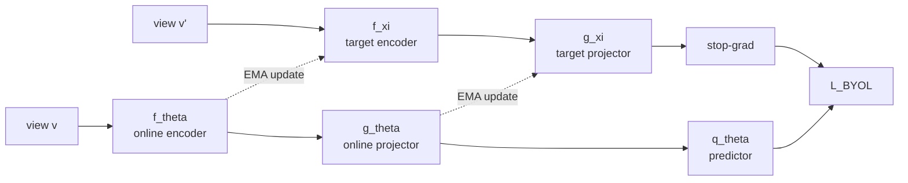
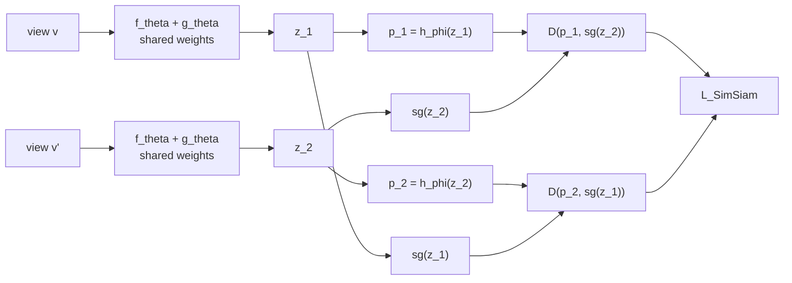

# 🔍 Self-Supervised Vision: Contrastive Learning and Beyond

*BYOL · SimSiam · Barlow Twins · VICReg — a pedagogical account of collapse-free self-supervised objectives*

## Table of Contents

- [[#🏗️ Background: The Joint-Embedding Framework|🏗️ Background: The Joint-Embedding Framework]]
- [[#💥 The Collapse Problem|💥 The Collapse Problem]]
- [[#⚔️ Contrastive Baselines: SimCLR and MoCo|⚔️ Contrastive Baselines: SimCLR and MoCo]]
- [[#🔁 BYOL: Bootstrapping Without Negatives|🔁 BYOL: Bootstrapping Without Negatives]]
- [[#🔀 SimSiam: Stop-Gradient Alone|🔀 SimSiam: Stop-Gradient Alone]]
- [[#📊 Barlow Twins: Redundancy Reduction|📊 Barlow Twins: Redundancy Reduction]]
- [[#🔧 VICReg: Explicit Regularization|🔧 VICReg: Explicit Regularization]]
- [[#🗺️ Unified Perspective|🗺️ Unified Perspective]]
- [[#📚 References|📚 References]]

---

## 🏗️ Background: The Joint-Embedding Framework

Self-supervised learning (SSL) for vision aims to learn representations from unlabeled data. The dominant paradigm is the *joint-embedding framework*: train a network to produce similar representations for two different *views* of the same image.

**Formal setup.** Let $\mathcal{X}$ be the image space and $\mathcal{T}$ a distribution over stochastic augmentation functions $t : \mathcal{X} \to \mathcal{X}$ (random crops, color jitter, grayscale, blur, etc.). Given an image $x \in \mathcal{X}$, sample two views:

$$v = t(x), \quad v' = t'(x), \quad t, t' \overset{\mathrm{iid}}{\sim} \mathcal{T}.$$

An *encoder* $f_\theta : \mathcal{X} \to \mathbb{R}^{d_f}$ maps images to representations, and a *projector* $g_\theta : \mathbb{R}^{d_f} \to \mathbb{R}^d$ maps representations to the *embedding space*:

$$y = f_\theta(v), \quad z = g_\theta(y) \in \mathbb{R}^d.$$

Some methods add a *predictor* $h_\theta : \mathbb{R}^d \to \mathbb{R}^d$ on one branch (discussed in §BYOL).

The downstream representation is always $y = f_\theta(\cdot)$ — the projector $g$ is discarded at inference time. This separation is empirically crucial: the projector absorbs information discarded by the SSL objective, protecting the encoder from over-specializing to augmentation invariances.

> [!INFO] Why a projector?
> Chen et al. (SimCLR) showed that adding a 2–3 layer MLP projector and discarding it for downstream tasks consistently improves linear probe accuracy by several points. The projector creates a buffer in information space — the SSL objective can discard nuisance information (e.g. exact crop location) in $z$ without harming the richer representation in $y$.

**Notation summary.**

| Symbol | Meaning |
|--------|---------|
| $x$ | Input image |
| $t, t' \sim \mathcal{T}$ | Sampled augmentations |
| $v, v'$ | Two augmented views of $x$ |
| $f_\theta$ | Encoder (backbone, e.g. ResNet or ViT) |
| $g_\theta$ | Projector MLP |
| $h_\theta$, $h_\phi$ | Predictor MLP (BYOL and SimSiam) |
| $y, y'$ | Encoder outputs (representations) |
| $z, z'$ | Projector outputs (embeddings) |
| $d$ | Embedding dimension |
| $N$ | Batch size |

---

> [!QUESTION] Exercise 1: Augmentation Distribution
> *The choice of augmentation distribution $\mathcal{T}$ fundamentally shapes what invariances the representation learns.*
>
> > **Prerequisites:** [[#🏗️ Background: The Joint-Embedding Framework|Background: The Joint-Embedding Framework]]
>
> Let $\mathcal{T}$ consist solely of horizontal flips (each view is either the original or a flipped image, chosen uniformly). Characterize what semantic property the resulting representation will be invariant to, and give one example of a downstream task for which this invariance would be harmful.

> [!TIP]- Solution to Exercise 1
> **Key insight:** The representation becomes invariant to horizontal reflection — the model cannot distinguish an image from its mirror image.
>
> **Sketch:** If $t$ is always a horizontal flip or identity, then $f_\theta(v) \approx f_\theta(v')$ means $f_\theta(x) \approx f_\theta(\mathrm{flip}(x))$ for all $x$. A harmful downstream task: digit recognition on SVHN where '6' flipped horizontally is not a valid digit, or handwriting authorship identification where writing slant direction is a diagnostic feature.

---

## 💥 The Collapse Problem

The naive *similarity-only* objective is:

$$\mathcal{L}_{\text{naive}}(\theta) = \mathbb{E}_{x,\, t,\, t'}\bigl[\|z - z'\|^2\bigr].$$

This is minimized trivially by the *constant solution*: $z = z' = \mathbf{c}$ for any fixed vector $\mathbf{c} \in \mathbb{R}^d$, regardless of input. Every image maps to the same point — the representation carries no information.

**Definition (Representational Collapse).** We say the system has *collapsed* if the rank of the empirical embedding matrix $Z \in \mathbb{R}^{N \times d}$ (rows = embeddings for $N$ images) is much less than $\min(N, d)$. Full collapse has $\mathrm{rank}(Z) = 1$ (all embeddings identical up to a global mean shift).

**Necessary condition for non-collapse.** For $z$ to be informative, the covariance matrix $\Sigma = \mathrm{Cov}(z)$ must be full-rank (all eigenvalues $> 0$). Equivalently, the embedding distribution $p(z)$ must have support over a non-degenerate $d$-dimensional set.

> [!WARNING] Collapse is not always binary
> *Partial collapse* — where a few dimensions collapse but others do not — is common and insidious. A representation with $d = 2048$ but effective rank $10$ still provides surprisingly good linear probes (since $10$ orthogonal directions can separate many coarse classes), but dramatically underperforms on fine-grained tasks requiring the full embedding space.

Every SSL method in this note introduces a mechanism specifically designed to prevent collapse. They differ in *where* they enforce diversity: in the negatives (contrastive), in the gradient flow (BYOL), in the correlation structure (Barlow Twins), or in the marginal variance (VICReg).

---

> [!QUESTION] Exercise 2: Gradient Analysis of the Naive Loss
> *The constant solution is a fixed point of gradient descent on $\mathcal{L}_{\text{naive}}$.*
>
> > **Prerequisites:** [[#💥 The Collapse Problem|The Collapse Problem]]
>
> Let $f_\theta$ and $g_\theta$ be differentiable. Show that any constant solution $z = z' = \mathbf{c}$ (for any $\mathbf{c}$) is a global minimum of $\mathcal{L}_{\text{naive}}$ and hence has $\nabla_\theta \mathcal{L}_{\text{naive}} = \mathbf{0}$. What does this imply about gradient descent's ability to escape collapse once entered?

> [!TIP]- Solution to Exercise 2
> **Key insight:** At collapse, $\mathcal{L}_{\text{naive}} = 0$ — its global minimum. Gradient descent cannot escape a global minimum.
>
> **Sketch:** $\mathcal{L}_{\text{naive}} = \mathbb{E}[\|z - z'\|^2] \geq 0$, with equality iff $z = z'$ almost surely. If $\theta$ maps all inputs to the same output (e.g. $g_\theta \equiv \mathbf{c}$), then $z = z' = \mathbf{c}$, so $\mathcal{L}_{\text{naive}} = 0$. This is a global minimum, hence $\nabla_\theta \mathcal{L}_{\text{naive}} = \mathbf{0}$. Gradient descent is stuck: once collapsed, there is no gradient signal to escape. This is why preventing collapse requires either a modified objective or architectural constraints — not just careful initialization.

---

## ⚔️ Contrastive Baselines: SimCLR and MoCo

Contrastive methods prevent collapse by explicitly *repelling* embeddings of different images. The core insight: if all embeddings must be far from each other (except matched pairs), they cannot all collapse to a single point.

### 📐 The NT-Xent Loss (SimCLR)

Given a batch of $N$ images, we produce $2N$ embeddings $\{z_1, z_1', z_2, z_2', \ldots, z_N, z_N'\}$ after $\ell_2$-normalization. Each $(z_k, z_k')$ is a *positive pair*; all other $2(N-1)$ embeddings in the batch are *negatives* for $z_k$.

The *normalized temperature-scaled cross-entropy* (NT-Xent) loss for anchor $z_k$ paired with positive $z_k'$ is:

$$\ell_k = -\log \frac{\exp\!\bigl(\mathrm{sim}(z_k,\, z_k') / \tau\bigr)}{\displaystyle\sum_{m=1}^{2N} \mathbf{1}[m \neq k]\, \exp\!\bigl(\mathrm{sim}(z_k,\, z_m) / \tau\bigr)}$$

where $\mathrm{sim}(u, v) = u^\top v / (\|u\| \|v\|)$ is cosine similarity and $\tau > 0$ is a temperature hyperparameter. The full loss averages over both orderings of each positive pair:

$$\mathcal{L}_{\text{SimCLR}} = \frac{1}{2N} \sum_{k=1}^{N} \bigl(\ell_k + \ell_k'\bigr).$$

> [!NOTE] Connection to InfoNCE and mutual information
> NT-Xent is an instance of the *InfoNCE* bound (van den Oord et al., 2018). Specifically, $I(V; V') \geq \log N - \mathcal{L}_{\text{NT-Xent}}$, so minimizing the NT-Xent loss (approximately) maximizes a lower bound on the mutual information between the two views. This provides a principled information-theoretic motivation for the contrastive objective.

**Why temperature matters.** Small $\tau$ sharpens the softmax, concentrating gradient signal on the hardest negatives (those most similar to the anchor). Large $\tau$ spreads attention uniformly. SimCLR uses $\tau = 0.07$.

**The batch-size bottleneck.** The denominator sums over $2(N-1)$ negatives. With too few negatives, the objective is easy and representations are poorly calibrated. SimCLR requires $N \approx 4096$ — demanding hundreds of GPUs. This is the primary practical limitation of pure contrastive learning.

### 🔧 MoCo: The Memory Bank Fix

He et al. (MoCo, 2020) decouple the negative pool from the current batch by maintaining a *queue* of $K \gg N$ past embeddings (e.g. $K = 65\,536$). To keep the queue consistent — embeddings produced by a slowly-changing encoder — MoCo introduces a *momentum encoder* with parameters $\xi$:

$$\xi \leftarrow m\xi + (1 - m)\theta, \quad m \approx 0.999.$$

All negatives in the queue are produced by the momentum encoder; the query is produced by the online encoder $\theta$. This allows large effective negative pools without requiring large batches.

> [!INFO] MoCo's influence on BYOL
> BYOL's *target network* is precisely MoCo's momentum encoder — repurposed without any negatives. The key leap: the EMA mechanism alone, combined with architectural asymmetry, suffices to prevent collapse.

---

> [!QUESTION] Exercise 3: NT-Xent Gradient Signal
> *The NT-Xent loss provides non-uniform gradient signal across negatives, concentrating on the hardest ones.*
>
> > **Prerequisites:** [[#⚔️ Contrastive Baselines: SimCLR and MoCo|Contrastive Baselines: SimCLR and MoCo]]
>
> For a fixed anchor $z_k$, let $s_+ = \mathrm{sim}(z_k, z_k')$ (positive similarity) and $s_m = \mathrm{sim}(z_k, z_m)$ for $m \neq k$ (negative similarities). Compute $\partial \ell_k / \partial s_m$ and show it equals $p_m / \tau$ where $p_m = \exp(s_m/\tau)/Z$ is the softmax weight on negative $m$. Interpret this in terms of *hard negatives*.

> [!TIP]- Solution to Exercise 3
> **Key insight:** The gradient with respect to each negative is weighted by its softmax probability — hard negatives (high $s_m \approx s_+$) receive proportionally more gradient and dominate learning.
>
> **Sketch:** Write $\ell_k = -s_+/\tau + \log Z$ where $Z = \sum_{m \neq k} \exp(s_m/\tau)$. Then $\partial \ell_k / \partial s_m = (1/\tau) \cdot \exp(s_m/\tau)/Z = p_m/\tau$. Negatives with high similarity to the anchor saturate the softmax and provide the most gradient signal — these are *hard negatives*. With small $N$, there may be no hard negatives in the batch, explaining why SimCLR degrades severely at small batch sizes.

---

## 🔁 BYOL: Bootstrapping Without Negatives

*Bootstrap Your Own Latent* (Grill et al., NeurIPS 2020) removes negatives entirely. The central question: **without repulsion, what prevents collapse?**

### 🏛️ Architecture

BYOL uses two networks with *asymmetric* structure:

The *online network* comprises encoder $f_\theta$, projector $g_\theta$, and predictor $q_\theta$. The *target network* has only encoder $f_\xi$ and projector $g_\xi$ — **no predictor**. This asymmetry is the key structural ingredient.

**Target network update (EMA).**

$$\xi \leftarrow \tau \xi + (1 - \tau)\theta, \quad \tau \in [0, 1).$$

$\tau$ is annealed from $0.996$ toward $1.0$ over training. The target network receives *no gradient updates* — only EMA updates from the online network.

### 📐 The BYOL Loss

Given views $v, v'$ of the same image $x$, compute online and target embeddings:

$$z_\theta = g_\theta(f_\theta(v)), \quad z'_\xi = g_\xi(f_\xi(v')).$$

The online network predicts the target projection:

$$\mathcal{L}_{\text{BYOL}} = \bigl\| \bar{q}_\theta(z_\theta) - \bar{z}'_\xi \bigr\|^2 = 2 - 2 \cdot \frac{\langle q_\theta(z_\theta),\; \mathrm{sg}(z'_\xi)\rangle}{\|q_\theta(z_\theta)\|_2 \cdot \|\mathrm{sg}(z'_\xi)\|_2}$$

where $\bar{u} = u / \|u\|_2$ denotes $\ell_2$-normalization and $\mathrm{sg}(\cdot)$ is the *stop-gradient* operator (zeroes gradients during backpropagation). The full objective symmetrizes over both views:

$$\mathcal{L} = \mathcal{L}_{\text{BYOL}}(\theta, \xi;\, v, v') + \mathcal{L}_{\text{BYOL}}(\theta, \xi;\, v', v).$$

**Gradients flow only through $\theta$** — the target $\xi$ is not differentiated.

### 🔑 Why Doesn't BYOL Collapse?

Several mechanisms act jointly:

1. **Stop-gradient asymmetry.** The gradient $\nabla_\theta \mathcal{L}$ depends on the online output $q_\theta(z_\theta)$ but treats the target $z'_\xi$ as a fixed constant. This breaks the symmetry between the two branches: the online network must *predict* the target, not merely agree with it. The predictor $q_\theta$ must learn a non-trivial mapping from online embeddings to target embeddings, creating a non-degenerate optimization landscape.

2. **Batch normalization.** The projectors $g_\theta$ and $g_\xi$ contain batch normalization layers, which normalize embeddings to zero mean and unit variance *along the batch dimension*. This is an implicit diversity constraint: no two images in the batch can have identical embeddings after BN. BN injects contrastive information implicitly by coupling all samples within a batch.

3. **EMA bootstrap.** The target $\xi$ lags behind $\theta$ by approximately $1/(1-\tau)$ gradient steps. The online network must constantly track a moving target — there is no stable fixed point at which both networks output the same constant and the gradient vanishes.

> [!WARNING] BN is load-bearing in BYOL
> *Ablation studies by Grill et al. show that removing batch normalization from the projector causes BYOL to collapse.* This was initially surprising — BN appears to be an innocent implementation detail, but it is in fact central to collapse prevention. The implicit cross-sample coupling in BN acts as a soft contrastive signal.

> [!EXAMPLE] Intuition: chasing a moving target
> Imagine trying to predict tomorrow's weather by bootstrapping from yesterday's predictions. If you output the same constant prediction every day, your "yesterday's prediction" is also the constant — and your error is zero. But BN ensures your predictions vary across the batch (different images = different embeddings), so the target you're predicting is not constant. You must learn actual structure to minimize the loss.

---

> [!QUESTION] Exercise 4: EMA Fixed Points
> *The EMA update has a specific fixed point that depends on the training dynamics of $\theta$.*
>
> > **Prerequisites:** [[#🔁 BYOL: Bootstrapping Without Negatives|BYOL: Bootstrapping Without Negatives]]
>
> Suppose $\theta$ is updated by gradient descent and changes at rate $\dot{\theta}$ (continuous-time limit). Show that in continuous time, the gap $\|\xi - \theta\|$ satisfies $\dot{\xi} - \dot{\theta} = -(1-\tau)(\xi - \theta) - \dot{\theta}$, and conclude that the steady-state gap is $\|\xi - \theta\|_{\text{ss}} \propto \|\dot{\theta}\| / (1 - \tau)$. What happens to this gap as training converges ($\dot{\theta} \to 0$)?

> [!TIP]- Solution to Exercise 4
> **Key insight:** The EMA gap is proportional to the learning rate divided by $(1-\tau)$ — a large $\tau$ creates a persistent lag even as training slows, maintaining a non-trivial prediction target.
>
> **Sketch:** In continuous time, $\dot{\xi} = (1-\tau)(\theta - \xi)$. Let $\delta = \xi - \theta$, then $\dot{\delta} = \dot{\xi} - \dot{\theta} = (1-\tau)(\theta - \xi) - \dot{\theta} = -(1-\tau)\delta - \dot{\theta}$. At steady state ($\dot{\delta} = 0$): $\delta_{\text{ss}} = -\dot{\theta}/(1-\tau)$, so $\|\delta_{\text{ss}}\| = \|\dot{\theta}\|/(1-\tau)$. As training converges, $\dot{\theta} \to 0$ and the gap vanishes — $\xi \to \theta$. During active training, the gap is non-zero: the online network always has a non-trivial (non-constant) target.

---

## 🔀 SimSiam: Stop-Gradient Alone

*Simple Siamese Representation Learning* (Chen & He, CVPR 2021) distills BYOL to its minimal core by removing the EMA target network entirely. The question it answers: **is the momentum encoder necessary, or is stop-gradient alone sufficient to prevent collapse?**

*Surprisingly,* stop-gradient plus a predictor suffices. EMA is a stabilizer, not a collapse-prevention mechanism.

### 🏛️ Architecture

Both branches share **identical parameters** $\theta$ — there is no separate target network. A predictor $h_\phi$ with its own parameters $\phi$ sits atop the projector on both branches:

Both $\theta$ (encoder + projector) and $\phi$ (predictor) are updated by gradient descent — there is no EMA copy.

### 📐 The SimSiam Loss

Define the *negative cosine similarity*:

$$\mathcal{D}(p,\, z) = -\frac{p^\top z}{\|p\|_2 \cdot \|z\|_2}.$$

Let $z_1 = g_\theta(f_\theta(v))$ and $z_2 = g_\theta(f_\theta(v'))$. The SimSiam objective is:

$$\mathcal{L}_{\text{SimSiam}} = \frac{1}{2}\,\mathcal{D}\!\bigl(h_\phi(z_1),\;\mathrm{sg}(z_2)\bigr) + \frac{1}{2}\,\mathcal{D}\!\bigl(h_\phi(z_2),\;\mathrm{sg}(z_1)\bigr).$$

Gradients flow through $h_\phi(z_i)$ — and back into $z_i$ and then $\theta$ — but **not** through $\mathrm{sg}(z_j)$.

> [!WARNING] Without the predictor, collapse is guaranteed
> *If $h_\phi = \mathrm{id}$ (no predictor), the symmetric loss $\frac{1}{2}\mathcal{D}(\mathrm{sg}(z_1), z_2) + \frac{1}{2}\mathcal{D}(\mathrm{sg}(z_2), z_1)$ is minimized at $z_1 = z_2 = \mathbf{c}$ for any constant unit vector $\mathbf{c}$, achieving $\mathcal{D} = -1$.* The predictor is not optional — it creates the prediction gap that makes the collapsed solution a saddle point rather than a minimum.

### 🔑 The EM Interpretation

Chen & He interpret SimSiam as an *expectation-maximization* (EM) algorithm with two alternating subproblems:

**E-step — optimize the predictor, fix the encoder.** For fixed $\theta$, find:

$$h_\phi^* = \operatorname{argmin}_{\phi}\; \mathbb{E}\!\bigl[\mathcal{D}(h_\phi(z_1),\; \mathrm{sg}(z_2))\bigr].$$

The solution is proportional to the *conditional expectation*: $h_\phi^*(z_1) \propto \mathbb{E}[z_2 \mid z_1]$. The optimal predictor computes the expected target embedding given the online embedding.

**M-step — optimize the encoder, fix the predictor.** For fixed $h_\phi^*$, update:

$$\theta \leftarrow \theta - \eta\, \nabla_\theta\; \mathbb{E}\!\bigl[\mathcal{D}(h_\phi^*(z_1),\; \mathrm{sg}(z_2))\bigr].$$

This pushes the encoder to produce embeddings $z_1$ that are better predicted by the current $h_\phi^*$, i.e. more consistent with the target $z_2$. The stop-gradient on $z_2$ implements the *decoupling* between the two steps — without it, both objectives are conflated into a single gradient step that collapses.

The EM frame also clarifies why a predictor is necessary: the E-step only makes sense if there is a separate parameter $\phi$ to optimize. With $h = \mathrm{id}$, the E-step is vacuous and the M-step has a degenerate global minimum at constant embeddings.

> [!NOTE] SimSiam vs. BYOL: what does EMA add?
> SimSiam shows EMA is not required for collapse prevention. In practice, BYOL's EMA target provides a *smoother target trajectory*: the predictor tracks a slowly-moving network rather than the rapidly-changing gradient-descent iterates. This reduces training variance and makes hyperparameter tuning less brittle. The EMA buys stability at the cost of an additional forward pass through the target network. SimSiam trains faster per step but requires more careful learning-rate scheduling.

---

> [!QUESTION] Exercise 5: The SimSiam EM Steps
> *The EM interpretation clarifies what each subproblem optimizes and why a non-trivial predictor is necessary.*
>
> > **Prerequisites:** [[#🔀 SimSiam: Stop-Gradient Alone|SimSiam: Stop-Gradient Alone]]
>
> Suppose the encoder $f_\theta \circ g_\theta$ is linear: $z = Wx$ for weight matrix $W \in \mathbb{R}^{d \times n}$, and $h_\phi$ is also linear: $h_\phi(z) = Az$ for $A \in \mathbb{R}^{d \times d}$. Write the E-step as a least-squares problem and give the closed-form optimal $A^*$ in terms of the second-moment matrices $\Sigma_{11} = \mathbb{E}[z_1 z_1^\top]$ and $\Sigma_{21} = \mathbb{E}[z_2 z_1^\top]$. Under what condition on $\mathcal{T}$ does $A^* = I$?

> [!TIP]- Solution to Exercise 5
> **Key insight:** The optimal linear predictor is the least-squares regression of $z_2$ on $z_1$; it equals the identity exactly when the two views are identically distributed and perfectly correlated.
>
> **Sketch:** For the MSE surrogate (equivalent to cosine loss for normalized vectors), the E-step is $\min_A \mathbb{E}[\|Az_1 - z_2\|^2]$. Taking the gradient and setting to zero: $\mathbb{E}[Az_1 z_1^\top] = \mathbb{E}[z_2 z_1^\top]$, giving $A^* = \Sigma_{21}\Sigma_{11}^{-1}$ (standard OLS). If $z_1 = z_2$ exactly (trivial augmentations, $\mathcal{T}$ is the identity), then $\Sigma_{21} = \Sigma_{11}$, so $A^* = I$. In this case the loss becomes $\mathcal{D}(z_1, \mathrm{sg}(z_1)) = -1$ regardless of $\theta$ — zero gradient, no learning. Non-trivial augmentations make $\Sigma_{21} \neq \Sigma_{11}$ and $A^* \neq I$, creating a non-degenerate M-step.

---

## 📊 Barlow Twins: Redundancy Reduction

*Barlow Twins* (Zbontar et al., ICML 2021) prevents collapse by directly imposing a *spectral constraint* on the cross-correlation structure of the embeddings — driving the cross-correlation matrix of twin embeddings toward the identity.

### 🧬 Neuroscience Motivation

The method is named after Horace Barlow's 1961 *redundancy reduction hypothesis*: efficient neural coding should minimize statistical redundancy between neurons. An efficient neural code decorrelates its outputs — no two neurons should carry redundant information. Barlow Twins operationalizes this principle as an SSL objective.

### 📐 The Cross-Correlation Matrix

Given a batch of $N$ image pairs, let $Z^A, Z^B \in \mathbb{R}^{N \times d}$ be the embedding matrices from the two views, each batch-normalized along the batch dimension (zero mean, unit variance per dimension). The *cross-correlation matrix* $C \in [-1,1]^{d \times d}$ is:

$$C_{ij} = \frac{\displaystyle\sum_{b=1}^{N} z^A_{b,i}\, z^B_{b,j}}{\displaystyle\sqrt{\sum_{b=1}^{N}\bigl(z^A_{b,i}\bigr)^2} \cdot \sqrt{\sum_{b=1}^{N}\bigl(z^B_{b,j}\bigr)^2}}.$$

Since both matrices are batch-normalized, this simplifies to:

$$C = \frac{1}{N} \bigl(Z^A\bigr)^\top Z^B \in [-1,1]^{d \times d}.$$

Each entry $C_{ij}$ is the cosine similarity between the $i$-th embedding dimension across view A and the $j$-th embedding dimension across view B.

### 🎯 The Barlow Twins Objective

$$\mathcal{L}_{\text{BT}} = \underbrace{\sum_{i=1}^{d} (1 - C_{ii})^2}_{\text{invariance term}} + \lambda \underbrace{\sum_{i=1}^{d} \sum_{j \neq i} C_{ij}^2}_{\text{redundancy-reduction term}}$$

**Invariance term** $(C_{ii} \to 1)$: Each diagonal entry $C_{ii}$ is the correlation between the $i$-th dimension of $Z^A$ and the $i$-th dimension of $Z^B$ across the batch. Driving $C_{ii} \to 1$ forces the representation to be *invariant to augmentations* along every dimension independently.

**Redundancy-reduction term** $(C_{ij} \to 0,\; i \neq j)$: Each off-diagonal entry $C_{ij}$ is the correlation between *different* dimensions $i$ (from view A) and $j$ (from view B). Driving $C_{ij} \to 0$ *decorrelates* the output dimensions — no two dimensions carry redundant information.

**Combined target:** $C = I_d$. This is exactly the *whitening* condition — the embeddings from the two views are mutually decorrelated and individually normalized.

> [!NOTE] Connection to ZCA Whitening
> *Whitening* a set of vectors $Z$ means finding $W$ such that $\mathrm{Cov}(WZ) = I$. The Barlow Twins objective achieves *cross-whitening*: it drives the cross-covariance $(Z^A)^\top Z^B / N$ toward $I_d$. Exact whitening requires inverting the sample covariance (expensive and numerically sensitive); Barlow Twins achieves approximate whitening via gradient descent on a differentiable surrogate.

### 🔑 Why Doesn't Barlow Twins Collapse?

If all embeddings collapse to a constant $z = z' = \mathbf{c}$, then after batch normalization (which enforces zero mean and unit variance per dimension), the variance of each dimension collapses to zero — but BN explicitly prevents this by design. More fundamentally:

- The **invariance term alone** would be satisfied by collapse (any constant gives $C_{ii} = 1$).
- The **redundancy-reduction term** creates pressure for *different dimensions to carry different information*. At non-degenerate embeddings, the gradient of $\sum_{i \neq j} C_{ij}^2$ with respect to $z^A_{b,i}$ is non-zero and pushes dimensions apart.

The two terms work in tandem: invariance ensures view-consistency; redundancy reduction ensures richness (full-rank embeddings).

**No large batches required.** Barlow Twins does not need many negatives — the cross-correlation matrix $C$ requires only enough samples to estimate $d \times d$ correlations reliably. A batch of $N = 2048$ suffices in practice.

---

> [!QUESTION] Exercise 6: Cross-Correlation Fixed Point
> *The target $C = I_d$ characterizes an entire family of solutions related by orthogonal transformations.*
>
> > **Prerequisites:** [[#📊 Barlow Twins: Redundancy Reduction|Barlow Twins: Redundancy Reduction]]
>
> Suppose $Z^A = Z^B = Z$ (same embeddings from both views, already batch-normalized). Show that $C = I_d$ if and only if the columns of $Z$ are mutually orthogonal in the batch sense (i.e. $Z^\top Z / N = I_d$). Conclude that the solution set of $\mathcal{L}_{\text{BT}} = 0$ forms an orbit under the orthogonal group $O(d)$.

> [!TIP]- Solution to Exercise 6
> **Key insight:** The fixed-point condition $C = I_d$ defines an orthonormality constraint on the embedding columns — an $O(d)$ family of equivalent solutions.
>
> **Sketch:** With $Z^A = Z^B = Z$ batch-normalized: $C = Z^\top Z / N$. Then $C = I_d \Leftrightarrow Z^\top Z = N \cdot I_d \Leftrightarrow$ the columns of $Z / \sqrt{N}$ form an orthonormal set. For any $R \in O(d)$, the rotated embeddings $ZR$ satisfy $(ZR)^\top(ZR)/N = R^\top (Z^\top Z / N) R = R^\top I_d R = I_d$. So the solution set is closed under $O(d)$-action — there is a whole $O(d)$-orbit of solutions, reflecting the rotational symmetry of the SSL objective.

---

## 🔧 VICReg: Explicit Regularization

*Variance-Invariance-Covariance Regularization* (Bardes, Ponce, LeCun, ICLR 2022) addresses collapse through three explicit regularization terms applied *independently to each branch* — without weight sharing, batch normalization of embeddings, or any cross-branch coupling beyond the invariance term.

### 🏛️ Architecture

VICReg uses two networks (which may be architecturally different — no weight sharing required) producing embeddings $Z, Z' \in \mathbb{R}^{N \times d}$ for the two views. The variance and covariance regularizers are computed *per branch* independently.

### 📐 The Three Terms

**1. 📏 Variance regularization** (prevents norm collapse):

$$v(Z) = \frac{1}{d} \sum_{j=1}^{d} \max\!\Bigl(0,\; \gamma - \sqrt{\mathrm{Var}_b(z^j) + \varepsilon}\Bigr)$$

where $z^j \in \mathbb{R}^N$ is the $j$-th column of $Z$ (all batch values for dimension $j$), $\mathrm{Var}_b(z^j) = \frac{1}{N}\sum_b (z_{b,j} - \bar{z}_j)^2$, and $\gamma = 1$, $\varepsilon > 0$ is a stability constant. This is a *hinge loss* on the per-dimension standard deviation: penalize if $\sigma_j < \gamma$, no penalty if $\sigma_j \geq \gamma$.

**Failure mode prevented:** *Norm collapse* — all samples map to the same value along dimension $j$, so $\sigma_j \to 0$.

**2. 🔀 Covariance regularization** (prevents dimensional collapse):

$$c(Z) = \frac{1}{d} \sum_{i \neq j} \bigl[\hat{C}(Z)\bigr]_{ij}^2, \qquad \hat{C}(Z) = \frac{1}{N-1}\sum_{b=1}^{N} (z_b - \bar{z})(z_b - \bar{z})^\top$$

This penalizes off-diagonal entries of the *within-branch* sample covariance matrix. Driving $c(Z) \to 0$ forces embedding dimensions to be pairwise uncorrelated.

**Failure mode prevented:** *Dimensional collapse* — variance concentrated in a low-dimensional subspace, with most dimensions carrying redundant linear combinations of a few directions.

**3. 📐 Invariance** (aligns corresponding views):

$$s(Z, Z') = \frac{1}{N} \sum_{b=1}^{N} \|z_b - z'_b\|^2$$

Standard MSE between corresponding embeddings from the two branches.

### 🎯 The VICReg Objective

$$\mathcal{L}_{\text{VICReg}} = \lambda\, s(Z, Z') + \mu\bigl[v(Z) + v(Z')\bigr] + \nu\bigl[c(Z) + c(Z')\bigr]$$

Default hyperparameters: $\lambda = \mu = 25$, $\nu = 1$.

> [!NOTE] Per-branch vs. cross-branch
> Barlow Twins computes the cross-correlation $C = (Z^A)^\top Z^B / N$, coupling both branches in the regularizer. VICReg computes the covariance *per branch* ($\hat{C}(Z)$ and $\hat{C}(Z')$ separately), then sums. This decoupling enables architectures where the two branches differ — e.g. multi-modal SSL with one image encoder and one text encoder.

### 🔑 Why Doesn't VICReg Collapse?

The three terms address three distinct failure modes:

| Failure mode | Symptom | Term that prevents it |
|---|---|---|
| Full collapse | $z = z' = \mathbf{c}$ for all inputs | Variance: $\sigma_j = 0 < \gamma$ triggers hinge penalty |
| Dimensional collapse | $\mathrm{rank}(Z) \ll d$ | Covariance: off-diagonal entries penalized when correlated |
| View misalignment | $z \neq z'$ for same image | Invariance: MSE pushes corresponding embeddings together |

At the optimum of $\mathcal{L}_{\text{VICReg}}$: each dimension has $\sigma_j \geq \gamma$ (variance), dimensions are decorrelated $\hat{C}(Z) \approx \sigma^2 I_d$ (covariance), and corresponding embeddings agree $z \approx z'$ (invariance). This requires $Z$ and $Z'$ to be individually whitened (up to a scale) and jointly aligned.

---

> [!QUESTION] Exercise 7: Variance Term Gradient
> *The variance hinge loss has a centering-repulsive gradient that spreads samples along each dimension.*
>
> > **Prerequisites:** [[#🔧 VICReg: Explicit Regularization|VICReg: Explicit Regularization]]
>
> For a single embedding dimension $j$ with active hinge ($\sigma_j < \gamma$), compute $\partial v(Z) / \partial z_{b,j}$ and show it takes the form $-(z_{b,j} - \bar{z}_j) / (dN\sigma_j)$. Interpret the sign: does this gradient push $z_{b,j}$ toward or away from the batch mean $\bar{z}_j$?

> [!TIP]- Solution to Exercise 7
> **Key insight:** The gradient of the variance hinge is a centering-repulsive force: it pushes each sample *away* from the batch mean, expanding the empirical distribution along dimension $j$.
>
> **Sketch:** For active hinge on dimension $j$: $v_j = (\gamma - \sigma_j)/d$ where $\sigma_j = \sqrt{\mathrm{Var}_b(z^j) + \varepsilon}$. Differentiating:
> $$\frac{\partial v_j}{\partial z_{b,j}} = -\frac{1}{d}\,\frac{\partial \sigma_j}{\partial z_{b,j}} = -\frac{1}{d} \cdot \frac{z_{b,j} - \bar{z}_j}{N\sigma_j}.$$
> Since we *minimize* $v$, the effective gradient update subtracts this quantity, yielding a step in direction $+(z_{b,j} - \bar{z}_j)/(dN\sigma_j)$ — pushing $z_{b,j}$ *away from* the mean. This is a spring-like repulsion from the centroid, expanding variance toward $\gamma$.

---

## 🗺️ Unified Perspective

The methods form a clean taxonomy based on *how* each prevents collapse:

| Method | Collapse prevention | Requires negatives | Large batch needed | Asymmetric arch | BN on embeddings |
|--------|---------------------|--------------------|-------------------|-----------------|------------------|
| SimCLR | Explicit repulsion (negatives) | ✅ | ✅ | ❌ | ✅ |
| MoCo | Repulsion + queue | ✅ | ❌ | Momentum enc. | ✅ |
| BYOL | Gradient asymmetry + EMA | ❌ | ❌ | ✅ | ✅ |
| SimSiam | Stop-gradient + predictor, no EMA | ❌ | ❌ | Predictor only | ✅ |
| Barlow Twins | Cross-branch spectral constraint ($C \to I$) | ❌ | ❌ | ❌ | ✅ |
| VICReg | Per-branch explicit regularization | ❌ | ❌ | ❌ | ❌ |

### 🔑 Three Orthogonal Principles

**Principle 1: Repulsion.** Contrastive methods prevent collapse by explicitly pushing apart embeddings of different images. Sufficient but expensive: requires negatives, large batches, or a memory bank.

**Principle 2: Gradient asymmetry.** BYOL's stop-gradient + EMA creates a *directional* optimization landscape — the online network chases the target, but gradients flow only through the online branch. This asymmetry prevents the trivial fixed point where both networks agree on a constant.

**Principle 3: Distributional constraint.** Barlow Twins and VICReg impose constraints on the *statistical structure* of the embedding distribution. Barlow Twins cross-couples both branches via $C \to I_d$; VICReg regularizes each branch independently. Both prevent dimensional collapse by requiring embeddings to span the full $d$-dimensional space. **VICReg is strictly more architecturally flexible** — it drops the requirement for BN on embeddings and weight sharing, making it the most modular of the three.

### 📈 Empirical Performance

All three post-contrastive methods reach competitive performance with SimCLR/MoCo on ImageNet linear evaluation:

| Method | ImageNet linear probe (top-1) | Epochs |
|--------|:-----------------------------:|:------:|
| SimCLR v2 | 74.2% | 800 |
| MoCo v2 | 71.1% | 200 |
| BYOL | **74.3%** | 1000 |
| Barlow Twins | 73.2% | 1000 |
| VICReg | 73.2% | 1000 |

*Numbers are approximate and depend on backbone/augmentation details.*

---

> [!QUESTION] Exercise 8: Barlow Twins vs. VICReg
> *The two spectral methods differ in where the covariance is computed — across branches or within each branch.*
>
> > **Prerequisites:** [[#📊 Barlow Twins: Redundancy Reduction|Barlow Twins: Redundancy Reduction]], [[#🔧 VICReg: Explicit Regularization|VICReg: Explicit Regularization]]
>
> (a) Identify one architectural scenario where VICReg applies naturally but Barlow Twins does not conceptually fit. (b) Show that when $Z^A = Z^B = Z$ (batch-normalized, symmetric branches), the Barlow Twins off-diagonal term and VICReg's covariance term are equal up to a constant factor. What is that factor?

> [!TIP]- Solution to Exercise 8
> **Key insight:** Cross-branch vs. per-branch computation is the essential distinction; they coincide up to normalization in the symmetric case.
>
> **Sketch:** **(a)** Multi-modal SSL: branch A encodes images ($Z^A$, vision encoder), branch B encodes text captions ($Z^B$, language model). VICReg's per-branch variance and covariance regularizers apply naturally to each modality independently. Barlow Twins computes $C = (Z^A)^\top Z^B / N$ cross-modally, which conflates the two modalities in a single correlation matrix and loses the per-modality decorrelation signal. **(b)** With $Z^A = Z^B = Z$ batch-normalized: Barlow Twins off-diagonal $= \sum_{i \neq j} [(Z^\top Z / N)_{ij}]^2$. VICReg covariance $= (1/d)\sum_{i\neq j}[(Z^\top Z/(N-1))_{ij}]^2$. The ratio is $d \cdot ((N-1)/N)^2 \approx d$ for large $N$. So VICReg's covariance term equals Barlow Twins' off-diagonal term divided by $d \cdot (1 - 1/N)^2$ — same quantity, different normalization conventions.

---

## 📚 References

| Reference Name | Brief Summary | Link |
|---|---|---|
| [BYOL] Grill et al. (2020), "Bootstrap Your Own Latent: A New Approach to Self-Supervised Learning" | Introduces online/target asymmetric architecture with EMA; first negative-free SSL to match contrastive methods | [arXiv:2006.07733](https://arxiv.org/abs/2006.07733) |
| [SimSiam] Chen & He (2021), "Exploring Simple Siamese Representation Learning" | Removes EMA from BYOL; proves stop-gradient + predictor suffices; EM interpretation of the predictor role | [arXiv:2011.10566](https://arxiv.org/abs/2011.10566) |
| [Barlow Twins] Zbontar, Jing, Misra, LeCun, Deny (2021), "Barlow Twins: Self-Supervised Learning via Redundancy Reduction" | Cross-correlation objective driving $C \to I_d$; connects SSL to Barlow's efficient coding hypothesis | [arXiv:2103.03230](https://arxiv.org/abs/2103.03230) |
| [VICReg] Bardes, Ponce, LeCun (2022), "VICReg: Variance-Invariance-Covariance Regularization for Self-Supervised Learning" | Three-term per-branch regularization; most architecturally flexible — no weight sharing or BN required | [arXiv:2105.04906](https://arxiv.org/abs/2105.04906) |
| [SimCLR] Chen, Kornblith, Norouzi, Hinton (2020), "A Simple Framework for Contrastive Learning of Visual Representations" | NT-Xent loss; established importance of projector head; requires large batch | [arXiv:2002.05709](https://arxiv.org/abs/2002.05709) |
| [MoCo] He, Fan, Wu, Xie, Girshick (2020), "Momentum Contrast for Unsupervised Visual Representation Learning" | Queue + momentum encoder decouples negative pool from batch size | [arXiv:1911.05722](https://arxiv.org/abs/1911.05722) |
| [InfoNCE] van den Oord, Li, Vinyals (2018), "Representation Learning with Contrastive Predictive Coding" | Introduces InfoNCE bound; connects contrastive objectives to mutual information maximization | [arXiv:1807.03748](https://arxiv.org/abs/1807.03748) |
| Barlow (1961), "Possible Principles Underlying the Transformation of Sensory Messages" | Original redundancy reduction hypothesis from theoretical neuroscience; inspiration for Barlow Twins | [MIT Press](https://doi.org/10.7551/mitpress/9780262518420.003.0013) |
