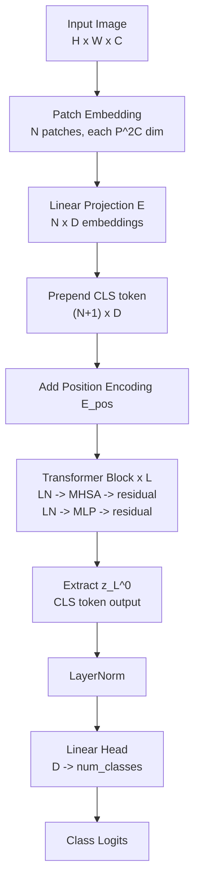

# 🧩 Vision Transformer (ViT)

*An Image is Worth 16×16 Words: applying the transformer architecture directly to sequences of image patches*

## Table of Contents

- [[#🏛️ Background: From CNNs to Attention|🏛️ Background: From CNNs to Attention]]
- [[#🔲 Image Tokenization: Patches and Projections|🔲 Image Tokenization: Patches and Projections]]
- [[#📌 The CLS Token and Positional Encoding|📌 The CLS Token and Positional Encoding]]
- [[#🔍 Multi-Head Self-Attention on Patches|🔍 Multi-Head Self-Attention on Patches]]
- [[#🧱 The ViT Encoder|🧱 The ViT Encoder]]
- [[#⚖️ Inductive Bias: ViT vs. CNN|⚖️ Inductive Bias: ViT vs. CNN]]
- [[#📈 Training Regime and Empirical Results|📈 Training Regime and Empirical Results]]
- [[#🔗 Connections: DeiT, Swin, and SSL|🔗 Connections: DeiT, Swin, and SSL]]
- [[#📚 References|📚 References]]

---

## 🏛️ Background: From CNNs to Attention

For over a decade, convolutional neural networks were the uncontested default for vision. CNNs exploit two strong inductive biases:

1. **Locality:** Each neuron in layer $\ell$ depends only on a small spatial neighborhood in layer $\ell - 1$. Features are local.
2. **Translation equivariance:** The same filter is applied at every spatial location. If a cat shifts right by 3 pixels, the feature map shifts identically.

These biases make CNNs highly *sample-efficient* — they need fewer images to learn that a cat's ear looks the same regardless of position. But they also *constrain* what the network can represent: long-range dependencies (e.g., matching a face to the body below it) are expensive, requiring many stacked layers to grow the effective receptive field.

Transformers, introduced for NLP by Vaswani et al. (2017), have *no* built-in locality or translation equivariance. Every token attends to every other token in a single layer. This makes them maximally expressive for long-range structure — but data-hungry, since spatial relationships must be learned entirely from data.

**The ViT question:** Can you apply a standard transformer encoder *without modification* to images, by treating image patches as tokens? Dosovitskiy et al. (2020) answer: *yes, and at sufficient data scale it outperforms CNNs by a wide margin.*

---

## 🔲 Image Tokenization: Patches and Projections

### 📐 From Pixels to Tokens

Let $x \in \mathbb{R}^{H \times W \times C}$ be an image ($H$ height, $W$ width, $C$ channels). Choose a patch size $P \times P$. Reshape $x$ into a sequence of $N$ flattened patches:

$$x^{(i)}_p = \mathrm{flatten}(\mathrm{patch}_i(x)) \in \mathbb{R}^{P^2 C}, \quad i = 1, \ldots, N, \quad N = \frac{HW}{P^2}.$$

Each patch is a $P^2 C$-dimensional vector. For a standard 224×224 RGB image with $P = 16$:

$$N = \frac{224 \times 224}{16^2} = 196 \text{ tokens}.$$

**Linear projection to embedding space.** A learned linear map $E \in \mathbb{R}^{D \times P^2C}$ projects each patch to the model's hidden dimension $D$:

$$z^{(i)}_0 = E\, x^{(i)}_p \in \mathbb{R}^D.$$

This is the *patch embedding* — the ViT analogue of the word embedding in NLP transformers. The projection $E$ is learned end-to-end; its columns visualize as Fourier-like basis functions resembling oriented Gabor filters after training.

> [!NOTE] Why patches and not pixels?
> Using individual pixels as tokens gives $N = H \times W = 50{,}176$ for a 224×224 image. The self-attention computation scales as $O(N^2)$, making full-resolution pixel attention computationally infeasible at the time. Patches of size $16 \times 16$ or $32 \times 32$ reduce $N$ to a tractable 196 or 49. Recent work (e.g. DINO with higher resolution, FlexiViT) explores adaptive patch sizes.

---

> [!QUESTION] Exercise 1: Sequence Length Scaling
> *The patch size $P$ controls a fundamental trade-off between sequence length and spatial resolution of tokens.*
>
> > **Prerequisites:** [[#🔲 Image Tokenization: Patches and Projections|Image Tokenization: Patches and Projections]]
>
> For a $224 \times 224$ RGB image, compute the sequence length $N$ and the per-patch dimension $P^2 C$ for patch sizes $P \in \{8, 16, 32\}$. Then compute the ratio of self-attention FLOPs (proportional to $N^2 D$) between $P=8$ and $P=16$. What is the accuracy–efficiency trade-off being made when choosing $P$?

> [!TIP]- Solution to Exercise 1
> **Key insight:** Halving the patch size quadruples the sequence length, increasing attention cost by $16\times$ — a severe penalty bought by finer spatial granularity.
>
> **Sketch:**
>
> | $P$ | $N = (224/P)^2$ | $P^2 C$ (RGB) | Attn FLOPs $\propto N^2$ |
> |-----|-----------------|----------------|--------------------------|
> | 8 | 784 | 192 | $784^2 = 614{,}656$ |
> | 16 | 196 | 768 | $196^2 = 38{,}416$ |
> | 32 | 49 | 3072 | $49^2 = 2{,}401$ |
>
> Ratio $P=8$ vs $P=16$: $614{,}656 / 38{,}416 = 16\times$. Fine patches ($P=8$) preserve local texture detail but cost $16\times$ more in attention. Coarse patches ($P=32$) are cheap but lose spatial precision — important for dense prediction tasks (segmentation, detection). ViT's canonical $P=16$ is a practical midpoint. Fine-tuning at $P=8$ after pretraining at $P=16$ is common for high-resolution downstream tasks.

---

## 📌 The CLS Token and Positional Encoding

### 🏷️ Classification Token

Before feeding the patch sequence to the transformer, ViT prepends a learnable *classification token* $x_{\mathrm{cls}} \in \mathbb{R}^D$:

$$\mathbf{z}_0 = [x_{\mathrm{cls}};\; z^{(1)}_0;\; z^{(2)}_0;\; \ldots;\; z^{(N)}_0] \in \mathbb{R}^{(N+1) \times D}.$$

After $L$ transformer layers, the representation at position 0 (the CLS token's slot) is used as the image representation for classification: $y = \mathrm{LN}(\mathbf{z}_L^{[0]})$.

The CLS token has no spatial meaning — it contains no image content at initialization. Through training, it learns to aggregate global information from all patch tokens via attention. *It acts as a learned readout vector: a query that learns what to ask from the image.*

### 📍 Positional Encoding

A pure set of patch embeddings $\{z^{(i)}_0\}$ contains no information about *where* each patch came from — the transformer is permutation-equivariant by default. Positional encodings fix this:

$$\mathbf{z}_0 \leftarrow \mathbf{z}_0 + E_{\mathrm{pos}}, \quad E_{\mathrm{pos}} \in \mathbb{R}^{(N+1) \times D}.$$

ViT uses **1D learnable positional encodings** — a learnable matrix where row $i$ encodes the absolute position of the $i$-th token. Ablation studies in the paper show:

| Positional encoding | ImageNet accuracy |
|---------------------|:-----------------:|
| None | 61.4% |
| 1D learnable | **64.1%** |
| 2D learnable | 64.0% |
| Relative (RPE) | 64.0% |

*Surprisingly,* 2D positional encodings (which directly encode the $(r, c)$ grid position) offer almost no benefit over 1D encodings. The model appears capable of learning implicit 2D structure from 1D position tags alone.

> [!INFO] Positional encoding at fine-tuning resolution
> ViT is typically pretrained at 224×224 (196 tokens) but fine-tuned at higher resolutions. The learned position embeddings are 2D-interpolated to accommodate the longer sequence at fine-tuning time, using bilinear interpolation of the original $14 \times 14$ grid.

---

> [!QUESTION] Exercise 2: Permutation Equivariance
> *Without positional encodings, the transformer cannot distinguish spatial arrangements.*
>
> > **Prerequisites:** [[#📌 The CLS Token and Positional Encoding|The CLS Token and Positional Encoding]]
>
> Let $\pi$ be a permutation of $\{1, \ldots, N\}$ and $P_\pi$ the corresponding permutation matrix. Show that a transformer encoder $T$ without positional encodings satisfies $T(P_\pi Z) = P_\pi T(Z)$ for any input sequence $Z \in \mathbb{R}^{N \times D}$ (up to the CLS token). What does this imply about the representations learned from a shuffled image?

> [!TIP]- Solution to Exercise 2
> **Key insight:** Without positional encoding, any permutation of the patches yields the same CLS representation — the model is fully blind to spatial layout.
>
> **Sketch:** Self-attention computes $\mathrm{Attn}(Z) = \mathrm{softmax}(ZW_Q(ZW_K)^\top/\sqrt{d_k})ZW_V$. Applying $P_\pi$ to rows: $\mathrm{Attn}(P_\pi Z) = \mathrm{softmax}(P_\pi Z W_Q (P_\pi Z W_K)^\top/\sqrt{d_k})P_\pi Z W_V = P_\pi \mathrm{Attn}(Z)$ (since $P_\pi P_\pi^\top = I$). The MLP operates row-wise, so it also commutes with $P_\pi$. By induction, $T(P_\pi Z) = P_\pi T(Z)$. The CLS token aggregates from all positions identically regardless of their order — so a jigsaw-shuffled image and the original image produce *the same CLS representation*. A ViT without positional encodings cannot distinguish a dog from its spatial rearrangement.

---

## 🔍 Multi-Head Self-Attention on Patches

The transformer's key operation is *multi-head self-attention* (MHSA). Here we derive it in the ViT context.

### 📐 Single-Head Attention

Given a sequence $Z \in \mathbb{R}^{(N+1) \times D}$, project to queries, keys, and values:

$$Q = Z W_Q, \quad K = Z W_K, \quad V = Z W_V, \quad W_Q, W_K, W_V \in \mathbb{R}^{D \times d_k}.$$

The attention output is:

$$\mathrm{Attn}(Q, K, V) = A V, \quad A = \mathrm{softmax}\!\left(\frac{QK^\top}{\sqrt{d_k}}\right) \in \mathbb{R}^{(N+1) \times (N+1)}.$$

The attention matrix $A$ has entry $A_{ij} = $ (normalized inner product of query $i$ with key $j$), representing how much token $i$ attends to token $j$. The $\sqrt{d_k}$ scaling prevents the dot products from growing too large in magnitude, which would saturate the softmax into near-zero gradients.

### 📐 Multi-Head Attention

Run $h$ independent attention heads in parallel, each with projection dimension $d_k = D/h$, then concatenate and project:

$$\mathrm{head}_i = \mathrm{Attn}(Z W^i_Q, Z W^i_K, Z W^i_V), \quad i = 1, \ldots, h$$

$$\mathrm{MHSA}(Z) = \mathrm{Concat}(\mathrm{head}_1, \ldots, \mathrm{head}_h)\, W^O, \quad W^O \in \mathbb{R}^{D \times D}.$$

With $h$ heads each of dimension $d_k = D/h$, the total parameter count is $4D^2$ (three $D \times d_k$ projections per head plus $W^O$), independent of $h$.

**Why multiple heads?** Each head can specialize to attend to different structural relationships simultaneously. In ViT, empirically some heads attend to *local* structure (nearby patches) while others attend *globally* (semantically related patches far apart) — even within the same layer.

> [!EXAMPLE] Attention visualization
> In trained ViTs, the attention maps from the CLS token reveal what the model deems globally informative. Lower layers tend to produce diffuse, local attention (every patch attends to its neighborhood). Upper-layer CLS attention often highlights the foreground object tightly — resembling an unsupervised segmentation mask. Caron et al. (DINO) demonstrated this effect dramatically: ViT + SSL training produces CLS attention maps that cleanly separate foreground from background without any segmentation supervision.

### ⏱️ Computational Complexity

For sequence length $N$ and dimension $D$, the attention complexity is $O(N^2 D)$ — quadratic in the sequence length. This is the key bottleneck of standard transformers.

For ViT with $P=16$ patches: $N = 196$, making $N^2 = 38{,}416$ — manageable. For $P=8$: $N = 784$, $N^2 \approx 600{,}000$ — already expensive. This motivates efficient attention variants for dense tasks.

---

> [!QUESTION] Exercise 3: Attention Complexity vs. CNN
> *The scaling regimes of CNNs and transformers differ fundamentally.*
>
> > **Prerequisites:** [[#🔍 Multi-Head Self-Attention on Patches|Multi-Head Self-Attention on Patches]]
>
> A convolutional layer with kernel size $k \times k$, $C_\text{in}$ input channels, $C_\text{out}$ output channels, applied to an $H \times W$ feature map has complexity $O(k^2 C_\text{in} C_\text{out} H W)$. A ViT attention layer over an $H \times W$ image with patch size $P$ has complexity $O(N^2 D)$ where $N = HW/P^2$. For fixed $D = C_\text{out}$ and $k = P$, show that the CNN layer scales linearly in image area $HW$ while attention scales quadratically in $HW/P^2$. At what image resolution does attention become more expensive than the CNN layer?

> [!TIP]- Solution to Exercise 3
> **Key insight:** CNN cost is $O(HW)$; ViT attention cost is $O((HW)^2/P^4)$ — quadratic growth makes attention prohibitively expensive at high resolution, motivating either larger patches or efficient attention.
>
> **Sketch:** CNN: $O(k^2 C_\text{in} C_\text{out} HW) = O(P^2 D \cdot HW)$. Attention: $O(N^2 D) = O((HW/P^2)^2 D) = O((HW)^2 D / P^4)$. Setting equal: $P^2 \cdot HW = (HW)^2 / P^2 \Rightarrow P^4 = HW \Rightarrow HW = P^4$. For $P = 16$: break-even at $HW = 16^4 = 65{,}536$ pixels (i.e. roughly a $256 \times 256$ image). Above this resolution, attention costs more than convolution per layer. In practice, ViT is typically more expensive than ResNets of comparable accuracy, which is why Swin Transformer introduces windowed attention to restore linear scaling.

---

## 🧱 The ViT Encoder

The full ViT architecture stacks $L$ identical transformer encoder blocks. Each block applies two sublayers with pre-normalization (LayerNorm before, residual connection after):

$$\mathbf{z}'_\ell = \mathrm{MHSA}(\mathrm{LN}(\mathbf{z}_{\ell-1})) + \mathbf{z}_{\ell-1} \tag{attention sublayer}$$

$$\mathbf{z}_\ell = \mathrm{MLP}(\mathrm{LN}(\mathbf{z}'_\ell)) + \mathbf{z}'_\ell \tag{MLP sublayer}$$

The **MLP** has two linear layers with a GELU activation and hidden dimension $4D$:

$$\mathrm{MLP}(x) = W_2\, \mathrm{GELU}(W_1 x + b_1) + b_2, \quad W_1 \in \mathbb{R}^{4D \times D},\; W_2 \in \mathbb{R}^{D \times 4D}.$$

After $L$ blocks, extract the CLS token and apply a final LayerNorm:

$$y = \mathrm{LN}(\mathbf{z}_L^{[0]}) \in \mathbb{R}^D.$$

For classification, $y$ is projected by a linear head: $\hat{p} = \mathrm{softmax}(Wy)$.

### 🏗️ Architecture Diagram

### 📊 Model Variants

| Model | Layers $L$ | Hidden dim $D$ | Heads $h$ | Params |
|-------|:----------:|:--------------:|:---------:|:------:|
| ViT-B/16 | 12 | 768 | 12 | 86M |
| ViT-B/32 | 12 | 768 | 12 | 88M |
| ViT-L/16 | 24 | 1024 | 16 | 307M |
| ViT-H/14 | 32 | 1280 | 16 | 632M |

The `/P` suffix denotes the patch size. ViT-B/16 is the workhorse; ViT-H/14 (14×14 patches for finer granularity) is the largest and best-performing variant.

---

> [!QUESTION] Exercise 4: Parameter Count
> *ViT's parameter count is dominated by the MLP sublayers.*
>
> > **Prerequisites:** [[#🧱 The ViT Encoder|The ViT Encoder]]
>
> For ViT-B/16 ($L=12$, $D=768$, $h=12$), compute the number of parameters in (a) one MHSA sublayer, (b) one MLP sublayer, and (c) the patch embedding projection $E$. Confirm that the total approaches 86M. Which sublayer dominates?

> [!TIP]- Solution to Exercise 4
> **Key insight:** The MLP sublayer ($4D^2$ parameters per block) dominates over MHSA ($4D^2$ per block) — they are roughly equal, each contributing about 2.4M parameters per block for ViT-B.
>
> **Sketch:** With $D = 768$, $d_k = D/h = 64$, $h = 12$:
>
> **(a) MHSA per block:** Each head has $W_Q, W_K, W_V \in \mathbb{R}^{768 \times 64}$ and the output projection $W^O \in \mathbb{R}^{768 \times 768}$. Total: $3 \times 12 \times (768 \times 64) + 768^2 = 3 \times 589{,}824 + 589{,}824 = 2{,}359{,}296 \approx 2.36\text{M}$.
>
> **(b) MLP per block:** $W_1 \in \mathbb{R}^{3072 \times 768}$, $W_2 \in \mathbb{R}^{768 \times 3072}$. Total: $2 \times 768 \times 3072 = 4{,}718{,}592 \approx 4.72\text{M}$.
>
> **(c) Patch embedding $E$:** $E \in \mathbb{R}^{768 \times (16^2 \times 3)} = \mathbb{R}^{768 \times 768}$: $589{,}824 \approx 0.59\text{M}$.
>
> Total (12 blocks): $12 \times (2.36 + 4.72) + 0.59 \approx 85.5\text{M}$. ✓ The MLP sublayers contribute $\approx 2\times$ more parameters than MHSA.

---

## ⚖️ Inductive Bias: ViT vs. CNN

This comparison is the conceptual core of the ViT paper.

### 🔑 What CNNs Bake In

A convolutional layer is equivariant to translation by construction:
$$f(T_\delta x) = T_\delta f(x)$$
where $T_\delta$ denotes a spatial shift by $\delta$. Additionally, the limited receptive field enforces locality — features at position $(i, j)$ only depend on a small neighborhood.

These inductive biases are *correct priors* for natural images (cats look the same regardless of position), which makes CNNs extremely sample-efficient: ResNets learn strong features from ImageNet-1k (1.2M images) without any pretraining.

### 🔑 What ViT Lacks

ViT has no built-in locality or translation equivariance. The patch embedding $E$ applies the same projection to all patches (a weak form of equivariance), but the positional encoding $E_\text{pos}$ breaks it immediately — position-$i$ and position-$j$ patches are treated differently even if their content is identical.

**Consequence:** ViT must *learn* that nearby patches tend to be correlated, that the same feature can appear at different positions, and that spatial relationships are meaningful. With limited data, it may not learn these properties reliably.

### 📊 The Data Requirement Gap

| Pretraining dataset | Dataset size | ViT-L/16 ImageNet top-1 |
|---|:---:|:---:|
| ImageNet-1k only | 1.2M | 76.5% |
| ImageNet-21k | 14M | 85.2% |
| JFT-300M | 300M | **87.8%** |
| ResNet152 (BiT-L, JFT) | 300M | 87.5% |

*Without large-scale pretraining, ViT-L/16 underperforms a comparably sized ResNet.* This is the inductive bias gap: CNNs encode the right priors for free; ViT must learn them from data.

**The payoff at scale:** With 300M pretraining images, ViT matches and eventually exceeds the best CNN baselines — achieving better accuracy with $2\text{–}4\times$ less compute at inference than comparably accurate ResNets. The learned representations are also more transferable: ViT pretrained on JFT shows stronger few-shot transfer to diverse downstream tasks.

> [!WARNING] The inductive bias is not always a liability
> *In some settings, ViT's lack of locality is an advantage.* Tasks requiring long-range dependencies (e.g., medical imaging where a lesion's relationship to distant anatomy matters, or video understanding) benefit from global attention in every layer. CNNs must stack many layers to achieve comparable receptive fields.

---

> [!QUESTION] Exercise 5: Translation Equivariance in ViT
> *Patch embeddings are translation-equivariant only at the patch level, not pixel level.*
>
> > **Prerequisites:** [[#⚖️ Inductive Bias: ViT vs. CNN|Inductive Bias: ViT vs. CNN]]
>
> Suppose an image $x$ is shifted by exactly $P$ pixels horizontally (one patch width). Trace through the ViT pipeline to determine whether the output logits change. Now suppose the shift is $P/2$ pixels (a sub-patch shift). What happens to the patch sequence, and why does ViT handle this less gracefully than a CNN?

> [!TIP]- Solution to Exercise 5
> **Key insight:** ViT is equivariant to whole-patch translations (the patch sequence shifts rigidly) but not to sub-patch translations, which change all patch contents — a fundamental limitation of patch tokenization.
>
> **Sketch:** **Whole-patch shift ($\delta = P$ pixels):** Shifting by one patch width cyclically permutes the patch sequence: patch $i$ becomes patch $i+1$ (mod $N$). With learnable positional encodings, the shifted sequence has different position embeddings added — so the representation *does* change. ViT is not exactly equivariant even to whole-patch shifts. **Sub-patch shift ($\delta = P/2$):** Each patch now straddles two original patches — all patch contents change completely. The model sees a completely different set of $N$ tokens, even though the image is nearly identical. A CNN with stride-1 convolutions handles this gracefully (the feature map shifts by $P/2$ pixels). ViT produces qualitatively different patch embeddings, potentially causing large changes in the output. This is one motivation for *overlapping patch extraction* or relative positional encodings in later ViT variants.

---

## 📈 Training Regime and Empirical Results

### 🏋️ Pretraining and Fine-Tuning

ViT is trained in two stages:

1. **Pretraining** on a large dataset (ImageNet-21k or JFT-300M) with a classification head, using AdamW optimizer, learning rate warmup, and weight decay regularization.

2. **Fine-tuning** on the target dataset at *higher resolution*. The sequence length grows (e.g., $N = 784$ at $448 \times 448$ vs. $N = 196$ at $224 \times 224$), and position embeddings are 2D-interpolated. The pretraining classification head is replaced by a zero-initialized linear head for the target classes.

> [!INFO] Pre-norm vs. post-norm
> ViT uses *pre-norm* (LayerNorm before MHSA/MLP), while the original NLP transformer used *post-norm* (LayerNorm after the residual). Pre-norm stabilizes training for deep networks and is now standard in almost all vision transformers. The residual path carries a clean gradient signal all the way back to the patch embeddings.

### 📊 What Attention Learns

A striking empirical finding is the *attention distance* analysis. For each attention head, compute the average distance (in pixels) between a token and the tokens it attends to most heavily. Plots from the paper reveal:

- **Lower layers:** Some heads attend very locally (distance $< 20$ pixels), others globally (full image distance). High variance across heads.
- **Higher layers:** Attention distance uniformly increases — all heads become global. The model integrates local features (lower layers) into global semantics (upper layers), analogously to the expanding receptive field in CNNs.

**The key difference from CNNs:** ViT develops global heads *from the very first layer*, allowing early layers to directly reason about cross-image relationships. In CNNs, global receptive field requires stacking many layers.

---

## 🔗 Connections: DeiT, Swin, and SSL

### 🎓 DeiT: Data-Efficient Training

ViT's large data requirement is a practical barrier. Touvron et al. (DeiT, 2021) show that ViT can be trained competitively on ImageNet-1k alone via:
- **Strong augmentation:** Mixup, CutMix, RandAugment, random erasing
- **Distillation token:** A second special token (alongside CLS) that is trained to match the output of a CNN teacher, enabling knowledge distillation without large-scale data

DeiT-B/16 matches ViT-B/16 (JFT-pretrained) on ImageNet using only ImageNet-1k. The distillation token learns to attend to features useful for the CNN teacher's predictions — complementing the class token.

### 🪟 Swin Transformer: Restoring Locality

Liu et al. (Swin, 2021) reintroduce locality and hierarchy into ViT by computing attention within local *windows* (e.g., $7 \times 7$ patch windows) and using a *shifted window* scheme across layers to allow cross-window interactions:

- **Window attention:** $O(N)$ cost instead of $O(N^2)$ — attention within a $7 \times 7$ window is $O(49^2)$ per window, with $N/49$ windows total.
- **Hierarchical feature maps:** Like CNNs, Swin progressively merges patches to produce multi-scale features, making it directly compatible with dense prediction heads (FPN, Mask R-CNN).

Swin became the dominant backbone for detection and segmentation (replacing ResNets) while ViT remained dominant for classification.

### 🔗 ViT and Self-Supervised Learning

ViT architecture interacts particularly well with SSL objectives:

**DINO (Caron et al., 2021):** Applies BYOL-like self-distillation to ViT. The CLS token of the teacher (EMA network) provides the target; the student's CLS token must match it. Remarkably, the attention maps of DINO-pretrained ViTs cleanly segment foreground objects with no segmentation supervision — a property unique to ViT + SSL (CNNs trained with DINO do not exhibit this).

**MAE (He et al., 2022):** Masks 75% of patches (random) and trains the encoder to reconstruct the masked patches via a lightweight decoder. The high masking ratio forces the encoder to develop a global understanding — a single visible patch must predict masked content across the image. MAE uses ViT exclusively; the masked-input framework is incompatible with CNNs (which cannot skip spatial locations).

> [!NOTE] Why ViT + SSL is a natural pairing
> SSL objectives based on views of the same image (BYOL, DINO) benefit from global attention: the model can match a heavily-cropped view to the full image because every patch attends to every other. CNNs have limited receptive fields in early layers, making it harder to match crops at different scales. ViT's global attention in *every layer* makes it naturally suited for learning from diverse augmented views.

See [[concepts/self-supervised-vision/ssl-vision|Self-Supervised Vision]] and [[concepts/self-supervised-vision/ssl-theory|SSL Theory]] for the theoretical foundations of these SSL methods.

---

## 📚 References

| Reference Name | Brief Summary | Link |
|---|---|---|
| [ViT] Dosovitskiy et al. (2020), "An Image is Worth 16x16 Words: Transformers for Image Recognition at Scale" | Foundational ViT paper; patch tokenization, CLS token, positional encoding; JFT-scale pretraining | [arXiv:2010.11929](https://arxiv.org/abs/2010.11929) |
| [Attention is All You Need] Vaswani et al. (2017), "Attention Is All You Need" | Original transformer architecture for NLP; MHSA, positional encoding, pre/post-norm | [arXiv:1706.03762](https://arxiv.org/abs/1706.03762) |
| [DeiT] Touvron et al. (2021), "Training Data-Efficient Image Transformers" | Data-efficient ViT training via distillation token and strong augmentation; no JFT required | [arXiv:2012.12877](https://arxiv.org/abs/2012.12877) |
| [Swin] Liu et al. (2021), "Swin Transformer: Hierarchical Vision Transformer using Shifted Windows" | Windowed attention for linear complexity; hierarchical feature maps; dominant detection/segmentation backbone | [arXiv:2103.14030](https://arxiv.org/abs/2103.14030) |
| [DINO] Caron et al. (2021), "Emerging Properties in Self-Supervised Vision Transformers" | BYOL-style SSL on ViT; emergent unsupervised segmentation from CLS attention maps | [arXiv:2104.14294](https://arxiv.org/abs/2104.14294) |
| [MAE] He et al. (2022), "Masked Autoencoders Are Scalable Vision Learners" | 75% patch masking + reconstruction pretraining; scales to ViT-H; strong transfer | [arXiv:2111.06377](https://arxiv.org/abs/2111.06377) |
| [BiT] Kolesnikov et al. (2020), "Big Transfer (BiT): General Visual Representation Learning" | Large ResNet trained on JFT; primary CNN baseline for ViT comparisons | [arXiv:1912.11370](https://arxiv.org/abs/1912.11370) |
