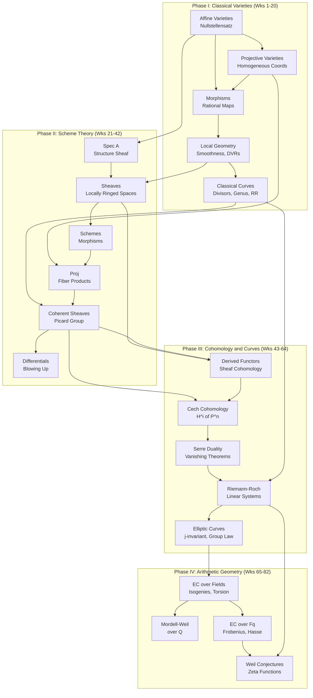

# Algebraic and Arithmetic Geometry Curriculum
*82 weeks · ~6.5 hrs/wk · ~530 hrs total*
*Profile: undergraduate algebra background, goal of Berkeley/Harvard PhD qualifying exam level*
*Focus: algebraic constructions and their geometric avatars — every definition paired with a geometric picture*

---

## Overview

| Phase | Weeks | Theme |
|-------|-------|-------|
| I | 1–20 | Classical Varieties (Shafarevich) |
| II | 21–42 | Scheme Theory (Hartshorne I-II + Mumford) |
| III | 43–64 | Cohomology and Curves (Hartshorne III-IV) |
| IV | 65–82 | Arithmetic Geometry (Silverman + Milne) |

**Commutative algebra** is not a separate phase. Study the relevant Atiyah-Macdonald (A&M) sections at the point of first need — each week flags exactly which chapters are prerequisites. Eisenbud's *Commutative Algebra with a View Toward Algebraic Geometry* is the secondary CA reference: its geometric commentary on standard theorems is invaluable.

**Qualifying exam problem sets** used as benchmarks:
- Ritvik Ramkumar (Berkeley, 2017): scheme theory + commutative algebra + algebraic topology
- Will Fisher (Berkeley, 2024): scheme theory + category theory + algebraic topology
- Harvard AG qualifying problem collection: curves, divisors, cohomology, elliptic curves

---

## Dependency Map

---

## Phase I — Classical Varieties

> **Goal:** Build the geometric dictionary before scheme theory arrives. Every object defined here has a scheme-theoretic avatar in Phase II — Phase I is about seeing and internalizing the geometry first. By the end, affine and projective varieties, morphisms, smoothness, divisors, and the Riemann-Roch theorem should feel concrete and familiar.

**Primary text:** Shafarevich, *Basic Algebraic Geometry* Vol 1 (*Varieties in Projective Space*)
**Intuition companion:** Reid, *Undergraduate Algebraic Geometry* (skim for pictures; do not do exercises from both)
**Problem supplement:** Gathmann, *Algebraic Geometry* lecture notes (free PDF)

---

### Week 1 — Affine Varieties and the Nullstellensatz

**CA prerequisite:** Read A&M Ch 1 (rings and ideals) before starting.

**Concepts to understand:**
- [ ] Affine $n$-space $\mathbb{A}^n_k$ over a field $k$ and algebraic subsets $V(f_1, \ldots, f_r) \subset \mathbb{A}^n$
- [ ] The ideal $I(X)$ of a subset $X \subset \mathbb{A}^n$: functions vanishing on $X$
- [ ] Hilbert Basis Theorem: every ideal in $k[x_1, \ldots, x_n]$ is finitely generated
- [ ] Weak Nullstellensatz: if $I \subsetneq k[x_1, \ldots, x_n]$ and $k$ is algebraically closed, $V(I) \neq \emptyset$
- [ ] Strong Nullstellensatz: $I(V(J)) = \sqrt{J}$ — the algebraic↔geometric dictionary
- [ ] Radical ideals correspond bijectively (order-reversing) to algebraic subsets

**Reading:**
- [ ] Shafarevich Vol 1, §I.1 *(~3 hrs)*
- [ ] Reid, Ch 1–2 (skim for pictures and intuition) *(~1 hr)*

**Problems:**
- [ ] Shafarevich I.1 #1, 2, 3, 5, 7
- [ ] Show that $V(x^2 - y, x^3 - z) \subset \mathbb{A}^3$ is isomorphic to $\mathbb{A}^1$

> **Milestone:** State and explain (with geometric examples) why $I(V(J)) = \sqrt{J}$, and why the hypothesis that $k$ be algebraically closed is necessary.

---

### Week 2 — Regular Functions and Morphisms

**CA prerequisite:** A&M Ch 2 (modules, exact sequences).

**Concepts to understand:**
- [ ] Coordinate ring $k[X] = k[x_1, \ldots, x_n]/I(X)$ as the ring of regular functions on $X$
- [ ] A regular function $f: X \to k$ is an element of $k[X]$
- [ ] Morphism of affine varieties = ring homomorphism on coordinate rings (contravariantly)
- [ ] Isomorphism of varieties; the category of affine varieties is opposite to the category of finitely generated reduced $k$-algebras
- [ ] Dominant morphisms; the pullback $f^*: k[Y] \to k[X]$

**Reading:**
- [ ] Shafarevich Vol 1, §I.2 *(~3 hrs)*

**Problems:**
- [ ] Shafarevich I.2 #1, 2, 3, 5, 6
- [ ] Show the map $t \mapsto (t^2, t^3)$ gives an isomorphism $\mathbb{A}^1 \cong V(y^2 - x^3)$ as topological spaces but NOT as varieties. What is the coordinate ring of the cusp?

---

### Week 3 — The Zariski Topology and Irreducibility

**CA prerequisite:** A&M Ch 3 (localization) — read §3.1–3.4 this week.

**Concepts to understand:**
- [ ] Zariski topology on $\mathbb{A}^n$: closed sets are algebraic subsets
- [ ] Irreducible topological spaces: not a union of two proper closed subsets
- [ ] An algebraic set $X$ is irreducible iff $I(X)$ is prime
- [ ] Decomposition into irreducible components (corresponds to primary decomposition)
- [ ] Noetherian property: every descending chain of closed sets stabilizes
- [ ] Function field $k(X)$ of an irreducible variety: fraction field of $k[X]$

**Reading:**
- [ ] Shafarevich Vol 1, §I.2 (continued), §I.3 intro *(~3 hrs)*
- [ ] A&M Ch 4, §4.1–4.5 (primary decomposition — read alongside for the algebraic picture) *(~2 hrs)*

**Problems:**
- [ ] Shafarevich I.2 #4, 7, 8
- [ ] Show $V(xy) \subset \mathbb{A}^2$ is reducible and find its irreducible components
- [ ] Find the primary decomposition of $(xy, x^2) \subset k[x,y]$ and interpret geometrically

---

### Week 4 — Rational Functions and the Local Ring at a Point

**Concepts to understand:**
- [ ] Rational function on $X$: equivalence class of pairs $(U, f)$ with $f$ regular on open $U$
- [ ] Local ring $\mathcal{O}_{X,P}$: rational functions defined at $P$ — this is the stalk of the structure sheaf
- [ ] Maximal ideal $\mathfrak{m}_P \subset \mathcal{O}_{X,P}$: functions vanishing at $P$
- [ ] $\mathcal{O}_{X,P} \cong k[X]_{\mathfrak{m}_P}$ (localization at the maximal ideal of $P$)
- [ ] Regular functions on $X$ embed into $\mathcal{O}_{X,P}$ for every $P$

**Reading:**
- [ ] Shafarevich Vol 1, §I.3 *(~3 hrs)*

**Problems:**
- [ ] Shafarevich I.3 #1, 2, 4, 5
- [ ] For $X = V(y - x^2) \subset \mathbb{A}^2$, compute $\mathcal{O}_{X,(0,0)}$ explicitly

> **Geometric insight:** $\mathcal{O}_{X,P}$ is the algebraic avatar of "functions on an infinitesimally small neighborhood of $P$." When you later define the structure sheaf of a scheme, its stalks will be exactly these local rings — so this object is already familiar.

---

### Week 5 — Projective Space and Projective Varieties

**CA prerequisite:** Skim A&M Ch 1 discussion of graded rings (not in A&M explicitly — use Shafarevich §I.4 or Reid Ch 4 for this).

**Concepts to understand:**
- [ ] Projective $n$-space $\mathbb{P}^n_k$: lines through origin in $\mathbb{A}^{n+1}$; homogeneous coordinates $[x_0 : \cdots : x_n]$
- [ ] Projective algebraic set $V_+(F_1, \ldots, F_r)$: common zeros of homogeneous polynomials
- [ ] Homogeneous ideal $I_+(X)$: generated by homogeneous polynomials vanishing on $X$
- [ ] Homogeneous coordinate ring $S(X) = k[x_0, \ldots, x_n]/I_+(X)$: graded ring, NOT the ring of functions
- [ ] Standard affine cover: $\mathbb{P}^n = U_0 \cup \cdots \cup U_n$ with $U_i = \{x_i \neq 0\} \cong \mathbb{A}^n$

**Reading:**
- [ ] Shafarevich Vol 1, §I.4 *(~3.5 hrs)*
- [ ] Reid, Ch 4 (for alternative motivation) *(~1 hr)*

**Problems:**
- [ ] Shafarevich I.4 #1, 2, 4, 5, 7, 8
- [ ] Show the twisted cubic $C = \{[t^3 : t^2 s : ts^2 : s^3]\} \subset \mathbb{P}^3$ is a smooth projective variety. Find its ideal.

---

### Week 6 — Projective Varieties: Maps and Products

**Concepts to understand:**
- [ ] Regular maps between projective varieties
- [ ] The Veronese embedding $\nu_d: \mathbb{P}^n \hookrightarrow \mathbb{P}^N$ and its image
- [ ] The Segre embedding $\sigma: \mathbb{P}^m \times \mathbb{P}^n \hookrightarrow \mathbb{P}^{(m+1)(n+1)-1}$ — makes products projective
- [ ] $\mathbb{P}^1 \times \mathbb{P}^1$ as a quadric surface in $\mathbb{P}^3$ via Segre
- [ ] Quasiprojective varieties: open subsets of projective varieties; the correct general notion

**Reading:**
- [ ] Shafarevich Vol 1, §I.5–I.6 (quasiprojective varieties, products) *(~3 hrs)*

**Problems:**
- [ ] Shafarevich I.5 #1, 2, 3, 4
- [ ] Shafarevich I.6 #1, 2
- [ ] Show $\mathbb{P}^1 \times \mathbb{P}^1 \cong V(xw - yz) \subset \mathbb{P}^3$ via Segre. Compute the class of the diagonal.

> **Milestone:** Compute $\text{Pic}(\mathbb{P}^1)$ and $\text{Pic}(\mathbb{P}^1 \times \mathbb{P}^1)$ using divisors (you will rederive these via Picard groups in Phase II).

---

### Week 7 — Rational Maps and Birational Equivalence

**Concepts to understand:**
- [ ] Rational map $f: X \dashrightarrow Y$: defined on a dense open subset
- [ ] Domain of definition: the largest open set on which $f$ extends to a regular map
- [ ] Birational equivalence: rational maps in both directions that are inverse on dense opens
- [ ] $\mathbb{P}^n$ and $\mathbb{A}^n$ are NOT isomorphic but ARE birationally equivalent
- [ ] The function field $k(X)$ is a birational invariant

**Reading:**
- [ ] Shafarevich Vol 1, §I.3 (rational maps), §I.6 (birational maps) *(~3 hrs)*

**Problems:**
- [ ] Shafarevich I.6 #3, 4, 5, 6
- [ ] Show that the projection $\pi: \mathbb{P}^2 \dashrightarrow \mathbb{P}^1$ from a point is a rational map. Where is it not defined?

---

### Week 8 — Dimension of Varieties

**CA prerequisite:** A&M Ch 8–9 (Krull dimension, going-up, going-down).

**Concepts to understand:**
- [ ] Dimension of an affine variety $X$: Krull dimension of $k[X]$, equivalently transcendence degree of $k(X)/k$
- [ ] Theorem: $\dim X = \text{trdeg}_k k(X)$
- [ ] $\dim \mathbb{A}^n = \dim \mathbb{P}^n = n$
- [ ] Fiber dimension theorem: if $f: X \to Y$ is dominant, then $\dim f^{-1}(y) \geq \dim X - \dim Y$ for all $y \in \overline{f(X)}$, with equality on a dense open
- [ ] Hypersurfaces have codimension 1; the principal ideal theorem

**Reading:**
- [ ] Shafarevich Vol 1, §I.6 (dimension) *(~2 hrs)*
- [ ] A&M Ch 8–9 *(~3 hrs)*

**Problems:**
- [ ] Shafarevich I.6 #7, 8
- [ ] A&M 8.1, 8.3, 9.1, 9.5
- [ ] Show $\dim k[x_1, \ldots, x_n] = n$ using the chain $(0) \subset (x_1) \subset (x_1, x_2) \subset \cdots$

---

### Week 9 — Tangent Spaces and Smoothness

**CA prerequisite:** A&M Ch 11 (discrete valuation rings) — read §11.1 this week.

**Concepts to understand:**
- [ ] Tangent space $T_{X,P}$ at a point: $(\mathfrak{m}_P/\mathfrak{m}_P^2)^\vee$ — the dual of the cotangent space
- [ ] Jacobian criterion: if $X = V(f_1, \ldots, f_m) \subset \mathbb{A}^n$, then $T_{X,P}$ is the kernel of the Jacobian matrix $(\partial f_i/\partial x_j)(P)$
- [ ] A point $P \in X$ is smooth (nonsingular) iff $\dim T_{X,P} = \dim X$
- [ ] An irreducible variety is smooth iff its smooth locus is open and dense
- [ ] Smooth $\Rightarrow$ local ring is regular; $\dim \mathcal{O}_{X,P} = \dim X$ at smooth points

**Reading:**
- [ ] Shafarevich Vol 1, §II.1–II.2 *(~3.5 hrs)*

**Problems:**
- [ ] Shafarevich II.1 #1, 2, 3, 4, 5
- [ ] Find the singular locus of $V(y^2 - x^2(x+1)) \subset \mathbb{A}^2$ (nodal cubic)
- [ ] Find the singular locus of $V(y^2 - x^3) \subset \mathbb{A}^2$ (cuspidal cubic)

---

### Week 10 — Local Structure of Morphisms

**Concepts to understand:**
- [ ] Local ring map induced by a morphism $f: X \to Y$ at a point: $\mathcal{O}_{Y, f(P)} \to \mathcal{O}_{X,P}$
- [ ] Finite morphisms: the ring map $k[Y] \to k[X]$ makes $k[X]$ a finite $k[Y]$-module
- [ ] Ramification: when a finite map to a smooth curve is not étale at a point
- [ ] Fiber dimension theorem revisited: generic smoothness and the structure of generic fibers
- [ ] Chevalley's theorem: the image of a constructible set is constructible

**Reading:**
- [ ] Shafarevich Vol 1, §II.3 *(~3 hrs)*

**Problems:**
- [ ] Shafarevich II.3 #1, 2, 3, 4

---

### Week 11 — Normalization

**CA prerequisite:** A&M Ch 5 (integral dependence, Noether normalization) — read this week.

**Concepts to understand:**
- [ ] Normal domain: integrally closed in its fraction field
- [ ] Normalization $\tilde{X}$ of a variety $X$: the variety corresponding to the integral closure of $k[X]$ in $k(X)$
- [ ] Normalization is a birational finite morphism $\nu: \tilde{X} \to X$
- [ ] Noether normalization: every affine variety $X$ of dimension $d$ admits a finite surjective map $X \to \mathbb{A}^d$
- [ ] A curve is normal iff it is smooth (in dimension 1: regular = normal)

**Reading:**
- [ ] Shafarevich Vol 1, §II.4 *(~2.5 hrs)*
- [ ] A&M Ch 5 *(~2.5 hrs)*

**Problems:**
- [ ] Shafarevich II.4 #1, 2, 3
- [ ] A&M 5.1, 5.4, 5.16, 5.22
- [ ] Compute the normalization of the cuspidal cubic $V(y^2 - x^3) \subset \mathbb{A}^2$

> **Milestone:** Explain geometrically why normalization "resolves" the cusp: the integral closure separates branches that pass through a singular point.

---

### Week 12 — Resolution of Curve Singularities

**Concepts to understand:**
- [ ] Blowing up a point in $\mathbb{A}^2$: $\text{Bl}_0 \mathbb{A}^2 \subset \mathbb{A}^2 \times \mathbb{P}^1$; the exceptional divisor $E \cong \mathbb{P}^1$
- [ ] Strict transform of a curve $C$ under blowing up: the closure of $\pi^{-1}(C \setminus \{0\})$
- [ ] Resolution of the node $V(y^2 - x^2(x+1))$ and the cusp $V(y^2 - x^3)$ by successive blowing up
- [ ] Every curve over a perfect field has a smooth projective model (resolution of singularities in dimension 1)
- [ ] The smooth projective model is unique up to isomorphism

**Reading:**
- [ ] Shafarevich Vol 1, §II.4–II.5 *(~3 hrs)*
- [ ] Reid, Ch 7 (§7.1–7.2 on blowing up, for extra intuition) *(~1 hr)*

**Problems:**
- [ ] Shafarevich II.5 #1, 2, 3, 4
- [ ] Resolve the $A_2$ singularity $V(y^2 - x^3) \subset \mathbb{A}^2$ by two blow-ups. Describe the exceptional locus.

---

### Week 13 — Discrete Valuation Rings and Curves

**CA prerequisite:** A&M Ch 9 (DVRs) and Ch 11 (completions) — read Ch 9 this week.

**Concepts to understand:**
- [ ] Discrete valuation ring (DVR): a PID with a unique nonzero prime ideal; has a uniformizer $t$ with $\mathfrak{m} = (t)$
- [ ] Valuation $v: k(X)^\times \to \mathbb{Z}$: the order of vanishing/pole of a rational function at a smooth point of a curve
- [ ] Smooth points of a curve correspond bijectively to DVRs inside $k(X)$
- [ ] Over a smooth projective curve: every rational function has only finitely many zeros and poles

**Reading:**
- [ ] Shafarevich Vol 1, §III.1 (intro), §II.5 (continuation) *(~2 hrs)*
- [ ] A&M Ch 9 *(~2.5 hrs)*

**Problems:**
- [ ] A&M 9.1, 9.2, 9.3
- [ ] Show the local ring of $\mathbb{P}^1$ at any point is a DVR, and identify the uniformizer

---

### Week 14 — Divisors on Curves

**Concepts to understand:**
- [ ] Divisor on a smooth projective curve $X$: $D = \sum_{P \in X} n_P [P]$ with $n_P \in \mathbb{Z}$, finitely many nonzero
- [ ] Degree of a divisor: $\deg D = \sum n_P$
- [ ] Principal divisor $(f)$ of a rational function $f \in k(X)^\times$: zeros minus poles with multiplicity
- [ ] Divisor class group (Picard group) $\text{Pic}(X) = \text{Div}(X)/\text{PDiv}(X)$
- [ ] $\text{Pic}^0(X)$ = degree-0 part; $\text{Pic}(X) \cong \mathbb{Z} \oplus \text{Pic}^0(X)$ for connected curves

**Reading:**
- [ ] Shafarevich Vol 1, §III.1 *(~3 hrs)*

**Problems:**
- [ ] Shafarevich III.1 #1, 2, 3, 4, 5
- [ ] Show $\text{Pic}(\mathbb{A}^1) = 0$ and $\text{Pic}(\mathbb{P}^1) \cong \mathbb{Z}$

---

### Week 15 — Linear Systems and Maps to Projective Space

**Concepts to understand:**
- [ ] Divisor of a section: $\text{div}(s)$ for $s \in H^0(X, \mathcal{O}(D))$
- [ ] Linear system $|D|$: the projective space of effective divisors linearly equivalent to $D$
- [ ] Complete linear system and the corresponding map $\phi_D: X \dashrightarrow \mathbb{P}(H^0(X, \mathcal{O}(D)))^\vee$
- [ ] Base locus: points where all sections vanish; $\phi_D$ is a morphism iff base locus is empty
- [ ] A divisor $D$ is very ample iff $\phi_D$ is a closed immersion

**Reading:**
- [ ] Shafarevich Vol 1, §III.1 (continued) *(~2 hrs)*
- [ ] Reid, Ch 9 §9.1–9.3 *(~2 hrs)*

**Problems:**
- [ ] Show that $\mathcal{O}(1)$ on $\mathbb{P}^1$ corresponds to the identity map $\mathbb{P}^1 \to \mathbb{P}^1$
- [ ] Find all effective divisors linearly equivalent to $2[P]$ on a smooth conic $C \subset \mathbb{P}^2$

---

### Week 16 — Differential Forms on Curves

**Concepts to understand:**
- [ ] Module of Kähler differentials $\Omega_{k[X]/k}$ for an affine variety; the sheaf $\Omega_{X/k}$
- [ ] For a smooth curve: $\Omega_{X/k}$ is a line bundle (rank-1 locally free sheaf), called the canonical bundle $\omega_X$
- [ ] Differential form $\omega \in H^0(X, \omega_X)$: a "1-form" on the curve
- [ ] Divisor of a differential form: $(\omega) = \sum v_P(\omega) [P]$ where $v_P$ is the order of vanishing in local coordinates
- [ ] Canonical class $K_X$: the divisor class of any nonzero differential form

**Reading:**
- [ ] Shafarevich Vol 1, §III.3 *(~3 hrs)*

**Problems:**
- [ ] Shafarevich III.3 #1, 2, 3
- [ ] On $\mathbb{P}^1$ with coordinate $t$, compute $\text{div}(dt)$. What is $\deg K_{\mathbb{P}^1}$?

---

### Week 17 — Genus and the Riemann-Roch Theorem (Classical)

**Concepts to understand:**
- [ ] Geometric genus $g$ of a smooth projective curve: $g = \dim H^0(X, \omega_X)$ (holomorphic differentials)
- [ ] Riemann-Roch theorem: $\ell(D) - \ell(K - D) = \deg D + 1 - g$
  - where $\ell(D) = \dim H^0(X, \mathcal{O}(D))$
- [ ] Special cases: $\ell(K) = g$, $\deg K = 2g - 2$
- [ ] Consequence: if $\deg D > 2g - 2$, then $\ell(D) = \deg D + 1 - g$
- [ ] Genus formula for a smooth plane curve of degree $d$: $g = \binom{d-1}{2}$

**Reading:**
- [ ] Shafarevich Vol 1, §III.4 *(~3 hrs)*
- [ ] Reid, Ch 9 §9.4–9.7 *(~1 hr)*

**Problems:**
- [ ] Shafarevich III.4 #1, 2, 3, 4
- [ ] Compute $g$ for a smooth quartic in $\mathbb{P}^2$. Use RR to find $\ell(K)$.
- [ ] Show: a smooth curve of genus 0 over $\bar{k}$ is isomorphic to $\mathbb{P}^1$

> **Milestone:** Work through 5 problems from the Harvard qualifying exam collection that involve Riemann-Roch, Hurwitz, or divisors.

---

### Week 18 — Hurwitz's Theorem

**Concepts to understand:**
- [ ] A finite morphism of smooth projective curves $f: X \to Y$ of degree $n$
- [ ] Ramification point: where the local degree of $f$ is $> 1$; the ramification index $e_P$
- [ ] Ramification divisor: $R = \sum_P (e_P - 1)[P]$ on $X$
- [ ] Hurwitz's theorem: $2g(X) - 2 = n(2g(Y) - 2) + \deg R$ (for separable $f$)
- [ ] Purely inseparable maps in characteristic $p$: Hurwitz gives $g(X) = g(Y)$

**Reading:**
- [ ] Shafarevich Vol 1, §III.4 (Hurwitz) *(~2 hrs)*
- [ ] Fulton, *Algebraic Curves*, Ch 7 (for Riemann-Hurwitz with proof) *(~2 hrs)*

**Problems:**
- [ ] Show every map $f: X \to \mathbb{P}^1$ of degree $n$ from a genus-$g$ curve has exactly $2g + 2n - 2$ branch points (over $\mathbb{C}$)
- [ ] Deduce the genus formula for a smooth plane curve from Hurwitz by projecting from a point
- [ ] Harvard qual: "Let's talk about Riemann-Hurwitz..." — work through the Ogus questions from the problem set

---

### Week 19 — Elliptic Curves: Classical Picture

**Concepts to understand:**
- [ ] An elliptic curve is a smooth projective curve of genus 1 with a marked point $O$
- [ ] Weierstrass form: $y^2 = x^3 + ax + b$ (char $\neq 2, 3$); smoothness iff discriminant $\Delta \neq 0$
- [ ] Group law: $P + Q + R = 0$ iff $P, Q, R$ are collinear; $O$ is the identity
- [ ] The $j$-invariant $j(E) = 1728 \cdot \frac{4a^3}{4a^3 + 27b^2}$: classifies elliptic curves over $\bar{k}$ up to isomorphism
- [ ] Over $\mathbb{C}$: $E \cong \mathbb{C}/\Lambda$ for a lattice $\Lambda = \mathbb{Z} + \mathbb{Z}\tau$; the group law is addition in $\mathbb{C}/\Lambda$

**Reading:**
- [ ] Shafarevich Vol 1, §III.3 (elliptic curves), §III.4 *(~2 hrs)*
- [ ] Silverman AEC, Ch 1 §1–3 (preview; you'll return to this in Phase IV) *(~2 hrs)*

**Problems:**
- [ ] Harvard qual: "What are the involutions of an elliptic curve over $\mathbb{C}$?" Work through the McMullen questions
- [ ] Show the group law is associative using Riemann-Roch (sketch): $\text{Pic}^0(E) \cong E$ as sets

---

### Week 20 — Hyperelliptic Curves and Review

**Concepts to understand:**
- [ ] Hyperelliptic curve: double cover of $\mathbb{P}^1$ branched at $2g + 2$ points (for genus $g$)
- [ ] Canonical map $\phi_K: X \to \mathbb{P}^{g-1}$: defined when $g \geq 2$, base-point-free when $X$ is not hyperelliptic
- [ ] Hyperelliptic curves of genus 2: always $y^2 = f(x)$ with $\deg f = 5$ or $6$
- [ ] Review: the algebraic↔geometric dictionary built in Phase I
- [ ] Every classical concept paired with its scheme-theoretic avatar (preview of Phase II)

**Reading:**
- [ ] Shafarevich Vol 1, §III.5 *(~2 hrs)*
- [ ] Review your Phase I notes; read the spec document for the Phase II translation table *(~3 hrs)*

**Problems:**
- [ ] Show a genus-2 curve is always hyperelliptic using the canonical map
- [ ] Work 3 more problems from the Harvard qual collection; identify which Phase II concepts they preview

> **Phase I Milestone:** You should now be able to: (1) define varieties, morphisms, divisors, and the Picard group from scratch; (2) state and apply Riemann-Roch and Hurwitz; (3) work problems from the Harvard qual involving divisors, Pic, and curves. Open a copy of Ritvik's qual transcript — the question on Hurwitz's theorem should now be followable end-to-end.

---

## Phase II — Scheme Theory

> **Goal:** Translate every concept from Phase I into scheme language. The central conceptual upgrade: points are prime ideals (not just maximal ideals), and varieties become the special case of schemes over an algebraically closed field. By the end, you should be comfortable with Spec, Proj, coherent sheaves, the Picard group, Kähler differentials, and blowing up — and you should be able to follow the algebraic geometry section of both Berkeley qual transcripts.

**Primary text:** Hartshorne, *Algebraic Geometry*, Chapters I–II
**Geometric companion:** Mumford, *The Red Book of Varieties and Schemes*, Chapters I–II (read alongside Hartshorne — Mumford is the geometric conscience of this phase)
**Supplementary:** Vakil, *The Rising Sea* (free; use when Hartshorne is too terse or skips details)

---

### Week 21 — Spec A and the Zariski Topology

**Concepts to understand:**
- [ ] $\text{Spec}(A)$: the set of prime ideals of a commutative ring $A$
- [ ] Why primes, not just maximal ideals? Points of $\text{Spec}(\mathbb{Z})$: $(p)$ for each prime $p$, plus the generic point $(0)$
- [ ] Zariski topology on $\text{Spec}(A)$: closed sets $V(I) = \{\mathfrak{p} \supseteq I\}$; basis of open sets $D(f) = \{\mathfrak{p} \nmid f\}$
- [ ] $\text{Spec}(A)$ is a sober topological space: every irreducible closed set has a unique generic point
- [ ] Functoriality: ring map $A \to B$ induces continuous map $\text{Spec}(B) \to \text{Spec}(A)$

**Reading:**
- [ ] Hartshorne §II.2 (first 6 pages) *(~2 hrs)*
- [ ] Mumford Red Book §I.1 *(~2 hrs)*
- [ ] Vakil *The Rising Sea*, Ch 3 §3.1–3.4 *(~1.5 hrs)*

**Problems:**
- [ ] Hartshorne II.2.2, II.2.3
- [ ] Describe $\text{Spec}(\mathbb{Z})$, $\text{Spec}(\mathbb{C}[t])$, $\text{Spec}(\mathbb{C}[x,y]/(xy))$ as topological spaces with generic points

> **Geometric insight:** $\text{Spec}(\mathbb{Z})$ is a curve! It has one closed point for each prime $p$ and one generic point. A "function" on it is an integer. This is the origin of arithmetic geometry: number theory is literally algebraic geometry over $\text{Spec}(\mathbb{Z})$.

---

### Week 22 — The Structure Sheaf

**Concepts to understand:**
- [ ] Sheaf of rings $\mathcal{O}_X$ on $\text{Spec}(A)$: $\mathcal{O}_X(D(f)) = A_f$ (localization at $f$)
- [ ] Stalk $\mathcal{O}_{X,\mathfrak{p}} = A_\mathfrak{p}$ (localization at prime $\mathfrak{p}$) — this is the local ring at a point
- [ ] Translation: $\mathcal{O}_{X,\mathfrak{m}} = A_\mathfrak{m}$ for a maximal ideal $\mathfrak{m}$ is the classical local ring from Phase I
- [ ] $\mathcal{O}_X$ is a sheaf of local rings: each stalk is a local ring
- [ ] Global sections: $\Gamma(\text{Spec}(A), \mathcal{O}) = A$

**Reading:**
- [ ] Hartshorne §II.2 (structure sheaf construction) *(~2.5 hrs)*
- [ ] Vakil Ch 2 §2.1–2.5 (sheaf axioms, stalks) *(~2 hrs)*

**Problems:**
- [ ] Hartshorne II.1.1, II.1.2, II.1.15 (sheaf axioms)
- [ ] Show that $\mathcal{O}_X(D(f)) = A_f$ is well-defined (i.e., consistent on overlaps)

---

### Week 23 — Presheaves and Sheaves

**Concepts to understand:**
- [ ] Presheaf: assignment $U \mapsto \mathcal{F}(U)$ with restriction maps
- [ ] Sheaf axioms: identity (a section is determined by its germs) and gluing (compatible local sections glue uniquely)
- [ ] Stalk $\mathcal{F}_P = \varinjlim_{U \ni P} \mathcal{F}(U)$: the "germ" at $P$
- [ ] Sheafification of a presheaf: the universal sheaf approximation
- [ ] Morphism of sheaves; kernel, image, cokernel as sheaves (exactness is at the level of stalks)

**Reading:**
- [ ] Hartshorne §II.1 *(~2 hrs)*
- [ ] Vakil Ch 2 §2.1–2.7 *(~2.5 hrs)*

**Problems:**
- [ ] Hartshorne II.1.1, II.1.3, II.1.6, II.1.8, II.1.14, II.1.22 (gluing sheaves — important)

---

### Week 24 — Locally Ringed Spaces and Schemes

**Concepts to understand:**
- [ ] Locally ringed space: topological space $X$ with a sheaf of rings $\mathcal{O}_X$ such that each stalk is a local ring
- [ ] Morphism of locally ringed spaces: continuous map + sheaf map respecting local ring structure at each stalk
- [ ] Affine scheme: $(X, \mathcal{O}_X) \cong (\text{Spec}(A), \mathcal{O}_{\text{Spec}(A)})$ for some ring $A$
- [ ] Scheme: locally ringed space that has an open cover by affine schemes
- [ ] The category of affine schemes is equivalent to the opposite of the category of commutative rings

**Reading:**
- [ ] Hartshorne §II.2 (schemes) *(~3 hrs)*
- [ ] Mumford Red Book §I.2–I.3 *(~2 hrs)*

**Problems:**
- [ ] Hartshorne II.2.1, II.2.2, II.2.4, II.2.7, II.2.9
- [ ] Construct the "line with a doubled origin" as a non-affine scheme by gluing two copies of $\text{Spec}(k[t])$

---

### Week 25 — First Examples of Schemes

**Concepts to understand:**
- [ ] Reduced, integral, irreducible schemes: the scheme-theoretic analogues of varieties
- [ ] $\text{Spec}(k[x]/(x^2))$: the "fat point" — a non-reduced scheme with one topological point but two scheme-theoretic points
- [ ] $\text{Spec}(k[x,y]/(xy))$: two lines meeting at the origin — the union in scheme theory
- [ ] Generic point of an integral scheme: the unique point $\eta$ with $\overline{\{\eta\}} = X$
- [ ] Scheme over $S$: a scheme with a structural morphism $X \to S$; $k$-schemes for varieties

**Reading:**
- [ ] Hartshorne §II.2 (examples throughout) *(~2 hrs)*
- [ ] Vakil Ch 3 §3.2–3.4 (examples of Spec) *(~2 hrs)*

**Problems:**
- [ ] Hartshorne II.2.3, II.2.6, II.2.11, II.2.14, II.2.15
- [ ] Show $\text{Spec}(k[x,y]/(x^2, xy, y^2))$ has one topological point; what is its local ring?

---

### Week 26 — Morphisms of Schemes

**Concepts to understand:**
- [ ] Open and closed immersions; open and closed subschemes
- [ ] Affine morphisms: $f: X \to Y$ such that $f^{-1}(V)$ is affine for every affine $V \subset Y$
- [ ] Morphisms of finite type: locally of finite type (finitely generated ring map on affines)
- [ ] Quasi-compact and quasi-separated morphisms
- [ ] $\text{Hom}_S(T, X)$: $T$-valued points of $X$ over $S$; the functor-of-points perspective

**Reading:**
- [ ] Hartshorne §II.3 (morphisms) *(~3 hrs)*
- [ ] Vakil Ch 7 §7.1–7.3 *(~2 hrs)*

**Problems:**
- [ ] Hartshorne II.3.1, II.3.2, II.3.4, II.3.5, II.3.6, II.3.12

---

### Week 27 — The Proj Construction

**Concepts to understand:**
- [ ] Graded ring $S = \bigoplus_{d \geq 0} S_d$ and the homogeneous prime spectrum $\text{Proj}(S)$
- [ ] $\text{Proj}(S)$: set of homogeneous primes not containing the irrelevant ideal $S_+ = \bigoplus_{d \geq 1} S_d$
- [ ] Open cover: $D_+(f) = \{\mathfrak{p} \nmid f\} \cong \text{Spec}(S_{(f)})$ for homogeneous $f \in S_1$
- [ ] $\text{Proj}(k[x_0, \ldots, x_n]) = \mathbb{P}^n_k$: the scheme-theoretic projective space
- [ ] Twisting sheaves $\mathcal{O}(n)$ on $\mathbb{P}^n$: $\mathcal{O}(n)(D_+(f)) = S_{(f)}$, sections in degree $n$

**Reading:**
- [ ] Hartshorne §II.2 (Proj), §II.5 (twisting sheaves) *(~3 hrs)*
- [ ] Mumford Red Book §II.4 *(~1.5 hrs)*

**Problems:**
- [ ] Hartshorne II.2.10, II.2.13, II.2.14
- [ ] Show $\text{Proj}(k[x,y]) \cong \mathbb{P}^1_k$. Identify $\mathcal{O}(1)$ with the line bundle of degree-1 functions.

---

### Week 28 — Fiber Products and Base Change

**Concepts to understand:**
- [ ] Fiber product $X \times_S Y$ in the category of $S$-schemes: the categorical product over $S$
- [ ] For affines: $\text{Spec}(A) \times_{\text{Spec}(R)} \text{Spec}(B) = \text{Spec}(A \otimes_R B)$
- [ ] Geometric fiber $X_s = X \times_S \text{Spec}(\kappa(s))$ over a point $s \in S$
- [ ] Base change: properties of morphisms are preserved under base change (separated, finite type, proper, flat)
- [ ] Scheme-theoretic intersection: $V(I) \cap V(J) = \text{Spec}(A/I \otimes_A A/J) = \text{Spec}(A/(I+J))$

**Reading:**
- [ ] Hartshorne §II.3 (fiber products) *(~3 hrs)*
- [ ] Mumford Red Book §I.4 *(~1.5 hrs)*

**Problems:**
- [ ] Hartshorne II.3.3, II.3.4, II.3.5, II.3.15, II.3.18
- [ ] Compute the scheme-theoretic intersection of the hyperbola $xy = 1$ and the circle $x^2 + y^2 = 2$ in $\mathbb{A}^2_\mathbb{R}$. What does the local ring at a tangent intersection look like?

> **Geometric insight:** This is the Will Fisher qual question. The scheme-theoretic intersection at a tangent point is $k[x]/(x^2)$ — the dual numbers. The scheme "remembers" the tangency that the set-theoretic intersection misses.

---

### Week 29 — Separated and Proper Morphisms

**Concepts to understand:**
- [ ] Separated morphism: the diagonal $\Delta: X \to X \times_S X$ is a closed immersion
- [ ] Geometric meaning: any two morphisms from a reduced scheme that agree on a dense open agree everywhere (no "doubling")
- [ ] Proper morphism: separated + finite type + universally closed
- [ ] Valuative criterion for separatedness: for any DVR $R$ with fraction field $K$, any $K$-point extends to at most one $R$-point
- [ ] Valuative criterion for properness: extends to exactly one $R$-point

**Reading:**
- [ ] Hartshorne §II.4 *(~3 hrs)*
- [ ] Vakil Ch 10 §10.1–10.3 *(~1.5 hrs)*

**Problems:**
- [ ] Hartshorne II.4.1, II.4.2, II.4.3, II.4.6, II.4.7, II.4.11
- [ ] Show that $\mathbb{P}^n_k \to \text{Spec}(k)$ is proper. Why does this capture "compactness"?
- [ ] Show the "line with doubled origin" is not separated

---

### Week 30 — Quasi-Coherent Sheaves

**CA prerequisite:** A&M Ch 2 (modules) and Ch 3 (localization) — should be already read.

**Concepts to understand:**
- [ ] $\mathcal{O}_X$-module: sheaf of abelian groups with compatible $\mathcal{O}_X$-module structure on each open set
- [ ] Quasi-coherent sheaf on $\text{Spec}(A)$: $\widetilde{M}$ for an $A$-module $M$, with $\widetilde{M}(D(f)) = M_f$
- [ ] Equivalence: $\text{QCoh}(\text{Spec}(A)) \simeq A\text{-Mod}$ (quasi-coherent sheaves = modules)
- [ ] Coherent sheaf: quasi-coherent and locally presented by a finitely generated module
- [ ] The sheaf associated to an ideal $I \subset A$: the ideal sheaf $\widetilde{I} \hookrightarrow \mathcal{O}_X$

**Reading:**
- [ ] Hartshorne §II.5 (first half) *(~3 hrs)*
- [ ] Vakil Ch 13 §13.1–13.3 *(~1.5 hrs)*

**Problems:**
- [ ] Hartshorne II.5.1, II.5.2, II.5.3, II.5.4, II.5.7

---

### Week 31 — Locally Free Sheaves and Vector Bundles

**Concepts to understand:**
- [ ] Locally free sheaf of rank $r$: $\mathcal{F}$ such that $\mathcal{F}|_U \cong \mathcal{O}_U^r$ for some cover
- [ ] Geometric avatar: a rank-$r$ vector bundle $E \to X$ corresponds to a locally free sheaf $\mathcal{E}$ via $E = \text{Spec}(\text{Sym}^\bullet \mathcal{E}^\vee)$
- [ ] Invertible sheaf (line bundle): locally free of rank 1
- [ ] Operations: $\mathcal{F} \otimes \mathcal{G}$, $\mathcal{H}om(\mathcal{F}, \mathcal{G})$, dual $\mathcal{F}^\vee$
- [ ] Pullback $f^* \mathcal{F}$ and pushforward $f_* \mathcal{F}$ of quasi-coherent sheaves

**Reading:**
- [ ] Hartshorne §II.5 (continued) *(~3 hrs)*

**Problems:**
- [ ] Hartshorne II.5.8, II.5.12, II.5.14, II.5.16, II.5.17, II.5.18
- [ ] Show $\mathcal{O}(n) \otimes \mathcal{O}(m) \cong \mathcal{O}(n+m)$ on $\mathbb{P}^1$

---

### Week 32 — Invertible Sheaves and the Picard Group

**Concepts to understand:**
- [ ] Picard group $\text{Pic}(X)$: invertible sheaves on $X$ up to isomorphism, with tensor product
- [ ] $\text{Pic}(\mathbb{P}^n_k) \cong \mathbb{Z}$: generated by $\mathcal{O}(1)$; degree map
- [ ] $\text{Pic}(\mathbb{P}^1 \times \mathbb{P}^1) \cong \mathbb{Z}^2$: generated by the pullbacks of $\mathcal{O}(1)$ along the two projections
- [ ] The exponential sequence (over $\mathbb{C}$): $0 \to \mathbb{Z} \to \mathcal{O} \to \mathcal{O}^* \to 0$ gives $\text{Pic}(X) \hookrightarrow H^2(X, \mathbb{Z})$
- [ ] Global sections functor $H^0(X, \mathcal{L})$: dimensions to be computed via RR in Phase III

**Reading:**
- [ ] Hartshorne §II.6 (Weil divisors, Cartier divisors, Pic) *(~3 hrs)*

**Problems:**
- [ ] Hartshorne II.6.1, II.6.2, II.6.4, II.6.5, II.6.6, II.6.11

> **Milestone:** Will Fisher's qual asked: "What is $\text{Pic}(\mathbb{P}^n)$? What is $\text{Pic}(\mathbb{P}^1 \times \mathbb{P}^1)$?" You should now be able to answer these — and explain what "degree" means in terms of line bundles and pullbacks.

---

### Week 33 — Weil and Cartier Divisors

**Concepts to understand:**
- [ ] Weil divisor on a normal scheme: formal $\mathbb{Z}$-linear combination of codimension-1 irreducible closed subsets
- [ ] Cartier divisor: a global section of $\mathcal{K}^*/\mathcal{O}^*$ — locally a rational function up to regular invertible function
- [ ] Comparison map: $\text{CaCl}(X) \to \text{Cl}(X)$ (Cartier to Weil class groups); isomorphism when $X$ is smooth
- [ ] On a singular variety: Weil divisors can fail to be Cartier (the ruling on the quadric cone is the standard example)
- [ ] $\text{Pic}(X) \cong \text{CaCl}(X)$: invertible sheaves and Cartier divisors are the same thing

**Reading:**
- [ ] Hartshorne §II.6 (continued) *(~3 hrs)*

**Problems:**
- [ ] Hartshorne II.6.3, II.6.7, II.6.8, II.6.9, II.6.10
- [ ] Show the ruling on the quadric cone $V(xy - z^2) \subset \mathbb{A}^3$ is a Weil but not Cartier divisor

---

### Week 34 — Maps to Projective Space

**Concepts to understand:**
- [ ] Theorem: maps $X \to \mathbb{P}^n_A$ over $\text{Spec}(A)$ correspond to: a line bundle $\mathcal{L}$ on $X$ together with $n+1$ global sections generating $\mathcal{L}$
- [ ] A line bundle $\mathcal{L}$ is globally generated (base-point-free) iff the corresponding map to projective space is a morphism (not just rational)
- [ ] Very ample line bundle: the corresponding map is a closed immersion
- [ ] Ample line bundle: some tensor power is very ample

**Reading:**
- [ ] Hartshorne §II.7 (intro), §II.5 (global generation) *(~3 hrs)*

**Problems:**
- [ ] Hartshorne II.7.1, II.7.2, II.7.3 (blowing up)
- [ ] Show the Veronese map $\nu_d: \mathbb{P}^n \to \mathbb{P}^N$ corresponds to $\mathcal{O}(d)$

---

### Week 35 — Kähler Differentials and the Cotangent Sheaf

**Concepts to understand:**
- [ ] Kähler differentials $\Omega_{B/A}$: the $B$-module generated by symbols $db$ for $b \in B$, subject to Leibniz rule
- [ ] Sheaf of differentials $\Omega_{X/S}$: the quasi-coherent sheaf associated to the diagonal $\Delta: X \to X \times_S X$
- [ ] For smooth varieties over $k$: $\Omega_{X/k}$ is locally free of rank $\dim X$ (the cotangent bundle)
- [ ] Geometric avatar: the stalk $\Omega_{X/k,P}$ is the cotangent space $\mathfrak{m}_P/\mathfrak{m}_P^2$ from Phase I
- [ ] Conormal sequence: $I/I^2 \to \Omega_{X/S}|_Y \to \Omega_{Y/S} \to 0$ for a closed subscheme $Y \hookrightarrow X$

**Reading:**
- [ ] Hartshorne §II.8 *(~3 hrs)*
- [ ] Vakil Ch 21 §21.1–21.3 *(~1.5 hrs)*

**Problems:**
- [ ] Hartshorne II.8.1, II.8.2, II.8.3, II.8.6, II.8.8
- [ ] Compute $\Omega_{\mathbb{P}^1/k}$ and show $\omega_{\mathbb{P}^1} = \mathcal{O}(-2)$

---

### Week 36 — Smooth Morphisms and the Jacobian Criterion

**Concepts to understand:**
- [ ] Smooth morphism $f: X \to Y$ of relative dimension $n$: $\Omega_{X/Y}$ is locally free of rank $n$, and $f$ is flat
- [ ] Geometric avatar: smooth $\Leftrightarrow$ the fibers are smooth varieties of the expected dimension
- [ ] Jacobian criterion for smoothness: $X = V(f_1, \ldots, f_r) \subset \mathbb{A}^n$ is smooth at $P$ iff the Jacobian matrix has rank $n - \dim X$ at $P$
- [ ] Relative tangent bundle: $T_{X/Y} = \mathcal{H}om(\Omega_{X/Y}, \mathcal{O}_X)$
- [ ] Étale morphisms: smooth of relative dimension 0; the algebraic analogue of local isomorphisms

**Reading:**
- [ ] Hartshorne §II.8 (continued, smooth) *(~2 hrs)*
- [ ] Vakil Ch 21 §21.4–21.5 *(~2 hrs)*

**Problems:**
- [ ] Hartshorne II.8.9, II.8.10
- [ ] Show a morphism of smooth curves is étale iff it is unramified

---

### Week 37 — Blowing Up

**Concepts to understand:**
- [ ] Blow-up of $\text{Spec}(A)$ along ideal $I$: $\text{Bl}_I X = \text{Proj}(\bigoplus_{n \geq 0} I^n)$
- [ ] The exceptional divisor: $E = \text{Proj}(\bigoplus_{n \geq 0} I^n/I^{n+1}) \hookrightarrow \text{Bl}_I X$; $E \cong \mathbb{P}(I/I^2)$ when $I/I^2$ is locally free
- [ ] The blow-up map $\pi: \text{Bl}_I X \to X$ is proper and an isomorphism away from $V(I)$
- [ ] The strict transform of a closed subscheme $Y$: the closure of $\pi^{-1}(Y \setminus V(I))$
- [ ] Universal property: blow-up is the initial scheme over $X$ in which $I \cdot \mathcal{O}$ is an invertible sheaf

**Reading:**
- [ ] Hartshorne §II.7 (blowing up) *(~3 hrs)*

**Problems:**
- [ ] Hartshorne II.7.3, II.7.4, II.7.5, II.7.9
- [ ] Re-derive the blow-up of $\mathbb{A}^2$ at the origin from the scheme-theoretic definition. Identify the exceptional divisor as $\mathbb{P}^1$. Verify this matches the classical construction from Week 12.

> **Phase II Milestone:** Open Ritvik's qual transcript. The questions on projective morphisms, blow-ups, Picard groups, and fiber products should now be fully followable. Open Will Fisher's transcript — the questions on morphism types (finite, proper, separated, finite-type) and divisors should be accessible.

---

### Weeks 38–42 — Phase II Consolidation and Qual Practice

Spend these five weeks working through Hartshorne Chapter I (algebraic varieties) and revisiting the weakest areas from Weeks 21–37. Use the Berkeley and Harvard qual problems as a diagnostic.

**Week 38:** Hartshorne Ch I — algebraic varieties as a review + contrast with schemes
- [ ] Hartshorne I.1 (affine varieties), I.2 (projective varieties), I.3 (morphisms)
- [ ] Exercises: I.1.1–1.5, I.2.1–2.7, I.3.1–3.5

**Week 39:** Hartshorne Ch I (continued)
- [ ] Hartshorne I.4 (rational maps), I.5 (nonsingular varieties), I.6 (nonsingular curves)
- [ ] Exercises: I.4.1–4.5, I.5.1–5.3, I.6.1–6.4

**Week 40:** Work Ritvik's qual transcript problems
- [ ] Projective morphisms and blowing up (Olsson questions)
- [ ] Primary decomposition of monomial ideals (Eisenbud questions)
- [ ] Noether normalization (rational quartic example)

**Week 41:** Work Will Fisher's qual transcript problems
- [ ] Morphism types: hyperbola projection (Gaetz questions)
- [ ] Divisors, Pic, comparison map (Teleman questions)
- [ ] Barr-Beck (skip — category theory not in scope)

**Week 42:** Work Harvard qual collection
- [ ] All problems tagged "schemes," "morphisms," "divisors," "Pic"
- [ ] Identify any Phase III topics needed (cohomology); flag for Phase III

---

## Phase III — Cohomology and Curves

> **Goal:** Make the machinery pay off. Sheaf cohomology is the tool that makes Riemann-Roch precise, gives Serre duality, and lets you compute everything. Curves are where every theorem is sharpest and most computable. By the end, you should be able to work all curve-related problems in all three qualifying exam sources.

**Primary text:** Hartshorne, *Algebraic Geometry*, Chapters III–IV
**Cohomology supplement:** Serre, *Faisceaux Algébriques Cohérents* (FAC) — the foundational paper; read after Hartshorne III for historical context
**Curves supplement:** Miranda, *Algebraic Curves and Riemann Surfaces* — bridges the analytic and algebraic viewpoints

---

### Week 43 — Derived Functors

**CA prerequisite:** A&M Ch 2 (Hom and tensor), Ch 6 (chain complexes — not in A&M, use Weibel §2.1–2.3 or Hartshorne App A).

**Concepts to understand:**
- [ ] Left-exact functors and their failure to be exact: the prototype is $\text{Hom}(M, -)$ and $\Gamma(X, -)$
- [ ] Injective objects and injective resolutions: every module/sheaf embeds into an injective
- [ ] Derived functor $R^i F$: apply $F$ to an injective resolution, take cohomology
- [ ] $R^0 F = F$ (exactness on the right)
- [ ] Long exact sequence in derived functors: $0 \to F(A) \to F(B) \to F(C) \to R^1 F(A) \to \cdots$

**Reading:**
- [ ] Hartshorne §III.1 *(~3 hrs)*
- [ ] Weibel, *Introduction to Homological Algebra*, Ch 2 §2.1–2.3 (for derived functors cleanly) *(~2 hrs)*

**Problems:**
- [ ] Hartshorne III.1.1, III.1.2, III.1.4
- [ ] Show that Ext and Tor are the derived functors of Hom and tensor for modules

---

### Week 44 — Sheaf Cohomology

**Concepts to understand:**
- [ ] Sheaf cohomology $H^i(X, \mathcal{F}) = R^i \Gamma(X, \mathcal{F})$: derived functor of global sections
- [ ] Geometric meaning: $H^0$ = global sections; $H^1$ = obstruction to gluing; higher cohomology = higher obstructions
- [ ] Flasque (flabby) sheaves: surjective restriction maps; acyclic for $\Gamma$
- [ ] Injective sheaves are flasque; use flasque resolutions to compute
- [ ] $H^i(X, \mathcal{F}) = 0$ for $i > \dim X$ (Grothendieck vanishing — statement)

**Reading:**
- [ ] Hartshorne §III.2 *(~3 hrs)*

**Problems:**
- [ ] Hartshorne III.2.1, III.2.2, III.2.3, III.2.5, III.2.7

---

### Week 45 — Cohomology of Noetherian Affine Schemes

**Concepts to understand:**
- [ ] Serre's theorem: $H^i(X, \mathcal{F}) = 0$ for all $i > 0$ and quasi-coherent $\mathcal{F}$ iff $X$ is affine (Noetherian)
- [ ] Geometric meaning: affine schemes have "no holes" — all cohomology vanishes
- [ ] Criterion for affineness via $H^1$: if $H^1(X, \mathcal{I}) = 0$ for all coherent ideal sheaves $\mathcal{I}$, then $X$ is affine
- [ ] Application: $\mathbb{P}^n$ is not affine (because $H^n(\mathbb{P}^n, \mathcal{O}(-n-1)) \neq 0$)

**Reading:**
- [ ] Hartshorne §III.3 *(~2.5 hrs)*

**Problems:**
- [ ] Hartshorne III.3.1, III.3.2, III.3.3, III.3.4
- [ ] Harvard qual: "How can you tell if a scheme is affine?" — work Ogus questions on affineness criteria

---

### Week 46 — Čech Cohomology

**Concepts to understand:**
- [ ] Čech complex for an open cover $\mathfrak{U} = \{U_i\}$: $\check{C}^p(\mathfrak{U}, \mathcal{F}) = \prod_{i_0 < \cdots < i_p} \mathcal{F}(U_{i_0} \cap \cdots \cap U_{i_p})$
- [ ] Čech cohomology $\check{H}^p(\mathfrak{U}, \mathcal{F})$: cohomology of the Čech complex
- [ ] Agreement with sheaf cohomology: $\check{H}^p(\mathfrak{U}, \mathcal{F}) \cong H^p(X, \mathcal{F})$ when the cover is acyclic (e.g., affine cover on a separated scheme)
- [ ] Practical value: Čech cohomology is computable directly from a cover

**Reading:**
- [ ] Hartshorne §III.4 *(~3 hrs)*

**Problems:**
- [ ] Hartshorne III.4.1, III.4.2, III.4.3, III.4.4, III.4.5
- [ ] Compute $H^1(\mathbb{P}^1, \mathcal{O})$ directly using the standard affine cover $\{U_0, U_1\}$

---

### Week 47 — Cohomology of Projective Space

**Concepts to understand:**
- [ ] Key computation: $H^i(\mathbb{P}^n_k, \mathcal{O}(m))$ for all $i$ and $m$:
  - $H^0(\mathbb{P}^n, \mathcal{O}(m)) = k[x_0, \ldots, x_n]_m$ (degree-$m$ forms) for $m \geq 0$, $0$ for $m < 0$
  - $H^n(\mathbb{P}^n, \mathcal{O}(m)) = 0$ for $m \geq -n$, and dual to $H^0(\mathcal{O}(-m-n-1))$ for $m < -n$
  - $H^i = 0$ for $0 < i < n$
- [ ] This computation is the engine behind Riemann-Roch and Serre duality
- [ ] Hilbert polynomial $P_X(m) = \chi(\mathcal{O}_X(m)) = \sum (-1)^i h^i(\mathcal{O}_X(m))$

**Reading:**
- [ ] Hartshorne §III.5 *(~3 hrs)*

**Problems:**
- [ ] Hartshorne III.5.1, III.5.2, III.5.3, III.5.5
- [ ] Compute $H^i(\mathbb{P}^2, \mathcal{O}(m))$ for $m = -4, -3, -2, -1, 0, 1, 2$

> **Geometric insight:** The "duality" in the computation of $H^n(\mathbb{P}^n, \mathcal{O}(m))$ vs $H^0(\mathcal{O}(-m-n-1))$ is the first appearance of Serre duality. The dualizing sheaf of $\mathbb{P}^n$ is $\omega_{\mathbb{P}^n} = \mathcal{O}(-n-1)$.

---

### Week 48 — Serre Duality

**Concepts to understand:**
- [ ] Dualizing sheaf $\omega_X$: the unique coherent sheaf such that $H^n(X, \omega_X) \cong k$ and Serre duality holds
- [ ] Serre duality: for $X$ smooth projective of dimension $n$ over $k$, $H^i(X, \mathcal{F}) \times H^{n-i}(X, \omega_X \otimes \mathcal{F}^\vee) \to H^n(X, \omega_X) \cong k$ is a perfect pairing
- [ ] Consequence: $h^i(X, \mathcal{F}) = h^{n-i}(X, \omega_X \otimes \mathcal{F}^\vee)$
- [ ] For a smooth projective curve: $\omega_X = \Omega_{X/k}$ (the canonical sheaf)
- [ ] For $\mathbb{P}^n$: $\omega_{\mathbb{P}^n} = \mathcal{O}(-n-1)$; verified by the cohomology computation of Week 47

**Reading:**
- [ ] Hartshorne §III.7 *(~3 hrs)*

**Problems:**
- [ ] Hartshorne III.7.1, III.7.2, III.7.3, III.7.5
- [ ] Use Serre duality to show $h^1(X, \mathcal{O}) = g$ for a smooth projective curve of genus $g$

---

### Week 49 — Vanishing Theorems

**Concepts to understand:**
- [ ] Cohomological criterion for ampleness: $\mathcal{L}$ is ample iff for every coherent $\mathcal{F}$, $H^i(X, \mathcal{F} \otimes \mathcal{L}^n) = 0$ for $i > 0$ and $n \gg 0$
- [ ] Serre vanishing: if $\mathcal{L}$ is ample, $H^i(X, \mathcal{F} \otimes \mathcal{L}^n) = 0$ for all $i > 0$ and $n \gg 0$
- [ ] Nakano vanishing (characteristic 0): $H^q(X, \Omega^p_X \otimes \mathcal{L}) = 0$ for $p + q > \dim X$ and $\mathcal{L}$ ample
- [ ] Grothendieck vanishing: $H^i(X, \mathcal{F}) = 0$ for $i > \dim X$

**Reading:**
- [ ] Hartshorne §III.5 (ampleness), §III.7 (vanishing) *(~2.5 hrs)*

**Problems:**
- [ ] Hartshorne III.5.2, III.5.4
- [ ] Show $\mathcal{O}(1)$ is ample on $\mathbb{P}^n$ using the vanishing criterion

---

### Week 50 — Flat Morphisms

**CA prerequisite:** A&M Ch 10 (flatness, local criterion) — read §10.1–10.3 this week.

**Concepts to understand:**
- [ ] Flat module: $M$ is flat over $A$ iff $- \otimes_A M$ is exact
- [ ] Flat morphism $f: X \to Y$: $\mathcal{O}_{X,x}$ is flat over $\mathcal{O}_{Y,f(x)}$ for all $x$
- [ ] Geometric meaning: flat morphism = "continuously varying family of schemes"
- [ ] Flat families: the fibers vary "nicely" — Hilbert polynomial is constant
- [ ] Miracle flatness: if $X, Y$ are regular and $f$ is surjective with equidimensional fibers, then $f$ is flat

**Reading:**
- [ ] Hartshorne §III.9 *(~3 hrs)*
- [ ] A&M Ch 10 §10.1–10.3 *(~2 hrs)*

**Problems:**
- [ ] Hartshorne III.9.1, III.9.2, III.9.3, III.9.4

---

### Week 51 — Cohomology and Base Change

**Concepts to understand:**
- [ ] For a flat proper morphism $f: X \to Y$ and coherent $\mathcal{F}$: the function $y \mapsto h^i(X_y, \mathcal{F}_y)$ is upper semicontinuous
- [ ] Cohomology and base change theorem: if $y \mapsto h^i(X_y, \mathcal{F}_y)$ is constant, then $R^i f_* \mathcal{F}$ is locally free and commutes with base change
- [ ] Hilbert scheme (preview): flat proper families of subschemes have a moduli space — the Hilbert scheme parameterizes them
- [ ] Application to linear series: a linear system on the generic fiber extends to all fibers when flatness holds

**Reading:**
- [ ] Hartshorne §III.12 *(~2.5 hrs)*

**Problems:**
- [ ] Hartshorne III.12.1, III.12.2, III.12.4

---

### Week 52 — The Riemann-Roch Theorem (Scheme-Theoretic)

**Concepts to understand:**
- [ ] Euler characteristic $\chi(\mathcal{F}) = \sum_i (-1)^i h^i(X, \mathcal{F})$: the alternating sum of cohomology dimensions
- [ ] Riemann-Roch for curves: $\chi(\mathcal{O}(D)) = \deg D + 1 - g$; equivalently $h^0 - h^1 = \deg D + 1 - g$
- [ ] Serre duality gives $h^1(\mathcal{O}(D)) = h^0(\omega_X(-D)) = h^0(\mathcal{O}(K - D))$, recovering the classical form $\ell(D) - \ell(K-D) = \deg D + 1 - g$
- [ ] Riemann-Roch for surfaces (Noether's formula): $\chi(\mathcal{L}) = \frac{1}{2} \mathcal{L} \cdot (\mathcal{L} - K) + \chi(\mathcal{O}_X)$
- [ ] The sheaf-theoretic proof of RR is essentially the computation of the Hilbert polynomial of $\mathcal{O}_X(D)$

**Reading:**
- [ ] Hartshorne §IV.1 *(~3 hrs)*

**Problems:**
- [ ] Hartshorne IV.1.1, IV.1.2, IV.1.3, IV.1.4, IV.1.5, IV.1.6, IV.1.7
- [ ] Work all Harvard qual problems involving Riemann-Roch

> **Milestone:** You should now be able to prove Riemann-Roch from scratch and apply it to compute $\ell(D)$ for any divisor $D$ on any smooth projective curve, given the genus.

---

### Week 53 — Linear Systems and Embeddings

**Concepts to understand:**
- [ ] A divisor $D$ on a curve $X$ is base-point-free iff $h^0(D - P) = h^0(D) - 1$ for all points $P$
- [ ] $D$ is very ample iff it separates points ($h^0(D - P - Q) = h^0(D) - 2$ for all $P \neq Q$) and separates tangent directions
- [ ] For $\deg D > 2g$: $D$ is base-point-free; for $\deg D > 2g + 1$ (or $\deg D \geq 2g + 1$ for $g \geq 1$): $D$ is very ample
- [ ] The canonical map $\phi_K: X \to \mathbb{P}^{g-1}$ (when $g \geq 2$) is an embedding iff $X$ is non-hyperelliptic

**Reading:**
- [ ] Hartshorne §IV.1 (continued), §IV.2 *(~3 hrs)*

**Problems:**
- [ ] Hartshorne IV.2.1, IV.2.2, IV.2.3, IV.2.5, IV.2.7
- [ ] Show that every genus-2 curve is hyperelliptic (the canonical map is 2:1 onto $\mathbb{P}^1$)

---

### Week 54 — Clifford's Theorem and Castelnuovo's Bound

**Concepts to understand:**
- [ ] Special divisors: $D$ is special iff $h^1(D) = h^0(K - D) > 0$, i.e., $\deg D \leq 2g - 2$
- [ ] Clifford's theorem: for a special divisor $D$ on a curve of genus $g$, $h^0(D) \leq \frac{\deg D}{2} + 1$; equality iff $D = 0$ or $D = K$ or $X$ is hyperelliptic
- [ ] Castelnuovo's bound: if $X \hookrightarrow \mathbb{P}^3$ is a smooth curve of degree $d \geq 3$ not lying in a plane, then $g \leq \frac{1}{4}(d-1)^2 + 1$ (for $d$ odd: $g \leq \frac{1}{4}d(d-2) + 1$)
- [ ] Application: degree 3, genus 1 curves in $\mathbb{P}^3$ lie in planes (this is Ritvik's qual question)

**Reading:**
- [ ] Hartshorne §IV.3 *(~3 hrs)*

**Problems:**
- [ ] Hartshorne IV.3.1, IV.3.2, IV.3.3, IV.3.4
- [ ] Work Ritvik's qual question: show a degree-3, genus-1 curve in $\mathbb{P}^3$ lies in a plane (two ways: Castelnuovo and direct RR)

---

### Week 55 — Elliptic Curves: Scheme-Theoretic Group Structure

**Concepts to understand:**
- [ ] An elliptic curve is a smooth projective curve of genus 1 with a marked point $O$: $(E, O)$
- [ ] The group law via $\text{Pic}^0(E)$: $P + Q = R$ iff $[P] - [O] + [Q] - [O] \sim [R] - [O]$ in $\text{Pic}^0(E)$
- [ ] $\text{Pic}^0(E) \cong E$ as varieties (Abel's theorem for genus 1)
- [ ] Consequence: $E$ is a group scheme — there is a group law morphism $E \times E \to E$
- [ ] The $j$-invariant: $j = 1728 \cdot \frac{4a^3}{4a^3 + 27b^2}$; two elliptic curves are isomorphic over $\bar{k}$ iff they have the same $j$

**Reading:**
- [ ] Hartshorne §IV.4 *(~3 hrs)*

**Problems:**
- [ ] Hartshorne IV.4.1, IV.4.2, IV.4.4, IV.4.6, IV.4.7, IV.4.10
- [ ] Harvard qual: "What is the significance of the Jacobian? What is it in the case of genus 1?" — write a careful answer

---

### Week 56 — The Multiplication-by-$n$ Map and Torsion

**Concepts to understand:**
- [ ] The isogeny $[n]: E \to E$ (multiplication by $n$): a finite morphism of degree $n^2$
- [ ] The $n$-torsion subgroup $E[n] = \ker([n])$: as a group scheme, $E[n] \cong (\mathbb{Z}/n)^2$ over $\bar{k}$ when $\text{char}(k) \nmid n$
- [ ] Ritvik's qual: unramified maps of elliptic curves = isogenies; $[2]: E \to E$ as the unramified example
- [ ] Kernel of $[2]$: the 2-torsion points, computed by finding roots of $y = 0$ in Weierstrass form; $|E[2]| = 4$
- [ ] Hurwitz's theorem for $[n]: E \to E$: $\deg R = 0$ (unramified) iff $g(E) = 1$ — confirmed by Hurwitz

**Reading:**
- [ ] Hartshorne §IV.4 (continued) *(~2 hrs)*
- [ ] Work through Ritvik's qual transcript, questions by Eisenbud and Auroux on $[2]: E \to E$ *(~1.5 hrs)*

**Problems:**
- [ ] Show $[2]: E \to E$ is unramified for $\text{char}(k) \neq 2$ by computing the ramification divisor via Hurwitz
- [ ] Compute $E[2]$ explicitly for $E: y^2 = x(x-1)(x+1)$

---

### Weeks 57–58 — Curves of Higher Genus

**Concepts to understand:**
- [ ] Hyperelliptic curves of genus $g$: $y^2 = f(x)$ with $\deg f = 2g+1$ or $2g+2$ (char $\neq 2$); always admit a 2:1 map to $\mathbb{P}^1$
- [ ] Genus 2 curves: always hyperelliptic; $y^2 = f(x)$ with $\deg f = 5$ or $6$
- [ ] Genus 3 curves: either hyperelliptic, or the canonical embedding is a smooth plane quartic in $\mathbb{P}^2$
- [ ] Genus 4 curves: the canonical embedding lands in $\mathbb{P}^3$ as the intersection of a quadric and a cubic surface
- [ ] Genus 5 curves: the canonical embedding lands in $\mathbb{P}^4$ as the intersection of three quadric hypersurfaces

**Reading:**
- [ ] Hartshorne §IV.5, §IV.6 *(~3 hrs)*

**Problems:**
- [ ] Hartshorne IV.5.1, IV.5.2, IV.6.1, IV.6.2, IV.6.3, IV.6.4
- [ ] Show a smooth plane quartic has genus 3 via the genus formula AND via Hurwitz (degree-4 map to $\mathbb{P}^1$)

---

### Weeks 59–64 — Phase III Consolidation and Qual Practice

Use these six weeks for consolidation, returning to weak areas, and intensive qual problem work.

**Week 59:** Work all Harvard qual problems involving curves, genus, and Riemann-Roch
- [ ] Compute genus of specific curves by multiple methods (genus formula, Hurwitz, RR)
- [ ] "Find the arithmetic genus of $y^3 = x^2 z$" — work through Frenkel's question

**Week 60:** Work all Harvard qual problems involving cohomology, line bundles, and Pic
- [ ] "$H^1$ and line bundles" — Wodzicki questions
- [ ] "Serre's affineness criterion" — Ogus questions
- [ ] "Is the complement of a hypersurface in $\mathbb{P}^2$ affine?" — Poonen question

**Week 61:** Work through Ritvik's qual transcript (algebraic geometry section) completely
- [ ] Write full solutions to all questions, including the ones solved verbally

**Week 62:** Work through Will Fisher's qual transcript (algebraic geometry section) completely
- [ ] Morphism types, Picard groups, Cartier vs Weil, Bezout, scheme-theoretic intersection

**Week 63:** Read Serre's FAC (Faisceaux Algébriques Cohérents) §1–3
- [ ] Understand the historical context: FAC introduced coherent sheaves and their cohomology
- [ ] See how Serre's original proofs compare to Hartshorne's presentation

**Week 64:** Write a self-assessment
- [ ] List every question from all three qual sources you can now answer confidently
- [ ] List gaps; prioritize for review during Phase IV where possible

> **Phase III Milestone:** You should now be able to follow every question in the algebraic geometry sections of Ritvik's and Will Fisher's Berkeley qual transcripts, and work the majority of the Harvard qual collection.

---

## Phase IV — Arithmetic Geometry

> **Goal:** Add the number-theoretic dimension. Elliptic curves defined over $\mathbb{Q}$, $\mathbb{F}_q$, and $\mathbb{Z}$; the Mordell-Weil theorem; the Hasse bound; and the Weil conjectures as a grand synthesis. By the end, you should understand the statement of BSD and why it's hard, and be comfortable with how algebraic geometry over non-algebraically-closed fields works.

**Primary text:** Silverman, *The Arithmetic of Elliptic Curves* (AEC)
**Number theory supplement:** Ireland-Rosen, *A Classical Introduction to Modern Number Theory*, Ch 8–11
**Weil conjectures:** Milne, *Lectures on Étale Cohomology* (free), Ch 1–2

---

### Weeks 65–67 — Elliptic Curves over Arbitrary Fields

**Concepts to understand:**
- [ ] Weierstrass equations and the discriminant: $\Delta = -16(4a^3 + 27b^2) \neq 0$ for smoothness
- [ ] Short Weierstrass form ($\text{char} \neq 2, 3$): $y^2 = x^3 + ax + b$
- [ ] The group law over any field $k$: the chord-and-tangent construction works over any field
- [ ] The group $E(k)$: $k$-rational points form an abelian group
- [ ] Isogenies over non-algebraically-closed fields: a finite morphism $\phi: E_1 \to E_2$ preserving the identity

**Reading:**
- [ ] Silverman AEC, Ch 1 (§1–4), Ch 2 (§1–4) *(~5 hrs)*

**Problems:**
- [ ] Silverman AEC: 1.1, 1.2, 1.3, 1.4, 2.1, 2.2, 2.5, 2.6, 2.8, 2.11

---

### Weeks 68–69 — Isogenies and the Tate Module

**Concepts to understand:**
- [ ] Isogeny: nonzero morphism $\phi: E_1 \to E_2$ of elliptic curves (automatically surjective over $\bar{k}$)
- [ ] Degree of an isogeny: degree as a finite morphism; $\deg([n]) = n^2$
- [ ] The $n$-torsion $E[n](\bar{k}) \cong (\mathbb{Z}/n)^2$ for $\text{char}(k) \nmid n$
- [ ] Tate module: $T_\ell(E) = \varprojlim E[\ell^n] \cong \mathbb{Z}_\ell^2$ (as abelian groups over $\bar{k}$)
- [ ] Galois acts on $T_\ell(E)$: the $\ell$-adic representation $\rho_\ell: G_k \to \text{GL}_2(\mathbb{Z}_\ell)$

**Reading:**
- [ ] Silverman AEC, Ch 3 (§1–7) *(~4 hrs)*

**Problems:**
- [ ] Silverman AEC: 3.1, 3.2, 3.5, 3.6, 3.7, 3.10

---

### Weeks 70–72 — Mordell-Weil Theorem

**Concepts to understand:**
- [ ] Mordell-Weil theorem: $E(\mathbb{Q}) \cong \mathbb{Z}^r \oplus E(\mathbb{Q})_{\text{tors}}$ (finitely generated abelian group)
- [ ] The rank $r$: the number of independent generators of infinite order; can be 0, 1, 2, ...
- [ ] Proof strategy: (1) $E(\mathbb{Q})/2E(\mathbb{Q})$ is finite (weak Mordell-Weil); (2) infinite descent via heights
- [ ] Weil height function $h: E(\mathbb{Q}) \to \mathbb{R}$: measures arithmetic complexity of a rational point
- [ ] Canonical (Néron-Tate) height $\hat{h}$: the unique quadratic form approximating $h$; positive definite on $E(\mathbb{Q}) \otimes \mathbb{R}$

**Reading:**
- [ ] Silverman AEC, Ch 4 (§1–5: heights), Ch 8 (§1–2: Mordell-Weil) *(~6 hrs)*

**Problems:**
- [ ] Silverman AEC: 4.1, 4.3, 4.4, 8.1, 8.2, 8.5
- [ ] For $E: y^2 = x^3 - x$, show $E(\mathbb{Q})_{\text{tors}} \cong \mathbb{Z}/2 \times \mathbb{Z}/2$ and find a generator of infinite order if $r = 1$

> **Milestone:** State and sketch the proof of Mordell-Weil from scratch. Identify where each of the two main steps (weak M-W and descent) uses the height function.

---

### Weeks 73–74 — Torsion Subgroups over $\mathbb{Q}$

**Concepts to understand:**
- [ ] Nagell-Lutz theorem: if $E: y^2 = x^3 + ax + b$ with $a, b \in \mathbb{Z}$, then $E(\mathbb{Q})_{\text{tors}}$ has coordinates in $\mathbb{Z}$ and $y = 0$ or $y^2 \mid \Delta$
- [ ] Using Nagell-Lutz to find all torsion points: a finite computation
- [ ] Mazur's torsion theorem (statement): $E(\mathbb{Q})_{\text{tors}}$ is one of exactly 15 groups:
  - $\mathbb{Z}/n\mathbb{Z}$ for $n = 1, 2, \ldots, 10, 12$
  - $\mathbb{Z}/2 \times \mathbb{Z}/2n$ for $n = 1, 2, 3, 4$
- [ ] Reduction mod $p$: for good primes $p$, torsion injects into $\tilde{E}(\mathbb{F}_p)$

**Reading:**
- [ ] Silverman AEC, Ch 7 (§1–3: torsion) *(~3 hrs)*

**Problems:**
- [ ] Silverman AEC: 7.1, 7.2, 7.3, 7.5, 7.7
- [ ] Find all rational torsion points of $E: y^2 = x^3 - x$ using Nagell-Lutz

---

### Weeks 75–76 — Elliptic Curves over Finite Fields

**Concepts to understand:**
- [ ] $E(\mathbb{F}_q)$: the group of $\mathbb{F}_q$-rational points; a finite abelian group
- [ ] Hasse's theorem: $|E(\mathbb{F}_q)| = q + 1 - t$ where $|t| \leq 2\sqrt{q}$ (the "trace of Frobenius")
- [ ] The Frobenius endomorphism $\phi_q: (x,y) \mapsto (x^q, y^q)$: an isogeny of degree $q$
- [ ] Characteristic polynomial of Frobenius: $T^2 - tT + q$; roots $\alpha, \bar{\alpha}$ with $|\alpha| = \sqrt{q}$
- [ ] $|E(\mathbb{F}_{q^n})| = q^n + 1 - \alpha^n - \bar{\alpha}^n$ for all $n$

**Reading:**
- [ ] Silverman AEC, Ch 5 (§1–4: finite fields) *(~4 hrs)*
- [ ] Ireland-Rosen, Ch 8 §1–3 *(~2 hrs)*

**Problems:**
- [ ] Silverman AEC: 5.1, 5.2, 5.3, 5.4, 5.7, 5.9
- [ ] For $E: y^2 = x^3 + x$ over $\mathbb{F}_p$, compute $|E(\mathbb{F}_p)|$ for $p = 5, 7, 11, 13$

---

### Weeks 77–78 — Zeta Functions of Curves

**Concepts to understand:**
- [ ] Zeta function of a curve $X/\mathbb{F}_q$: $Z(X, T) = \exp\left(\sum_{n=1}^\infty |X(\mathbb{F}_{q^n})| \frac{T^n}{n}\right)$
- [ ] For a smooth projective curve of genus $g$ over $\mathbb{F}_q$:
  - $Z(X, T) = \frac{P(T)}{(1-T)(1-qT)}$ where $P(T) = \prod_{i=1}^{2g}(1 - \alpha_i T)$ is a polynomial of degree $2g$
  - Rationality: $Z(X,T) \in \mathbb{Q}(T)$
  - Functional equation: $Z(X, \frac{1}{qT}) = q^{1-g} T^{2-2g} Z(X, T)$
  - Riemann hypothesis: $|\alpha_i| = \sqrt{q}$ for all $i$
- [ ] For elliptic curves: $P(T) = 1 - tT + qT^2$ where $t$ is the trace of Frobenius

**Reading:**
- [ ] Ireland-Rosen, Ch 11 §1–4 *(~3 hrs)*
- [ ] Milne, *Lectures on Étale Cohomology*, Ch 1 §1.1–1.3 (introduction) *(~2 hrs)*

**Problems:**
- [ ] Compute $Z(E, T)$ for $E: y^2 = x^3 + x$ over $\mathbb{F}_5$ by counting points for $n = 1, 2, 3$
- [ ] Verify the functional equation for this example

---

### Weeks 79–80 — The Weil Conjectures

**Concepts to understand:**
- [ ] The Weil conjectures (1949) for a smooth projective variety $X/\mathbb{F}_q$ of dimension $n$:
  1. **Rationality:** $Z(X, T) = \prod_{i=0}^{2n} P_i(T)^{(-1)^{i+1}}$, each $P_i \in \mathbb{Z}[T]$
  2. **Functional equation:** $Z(X, \frac{1}{q^n T}) = \pm q^{n\chi/2} T^\chi Z(X, T)$ where $\chi = \chi_{\text{top}}(X)$
  3. **Riemann hypothesis:** roots of $P_i$ have absolute value $q^{-i/2}$
  4. **Betti numbers:** $\deg P_i = b_i$, the $i$-th Betti number of the "corresponding" complex variety
- [ ] Weil's proof for curves (1948): using the Riemann-Roch theorem and a positivity argument
- [ ] Grothendieck's proof strategy: $\ell$-adic cohomology $H^i_{\text{ét}}(X_{\bar{\mathbb{F}}_q}, \mathbb{Q}_\ell)$ plays the role of $H^i_{\text{sing}}$; Frobenius acts on it; the Lefschetz fixed-point formula gives the zeta function
- [ ] Deligne's proof of the Riemann hypothesis (1974): the deepest result; uses weights and Hard Lefschetz

**Reading:**
- [ ] Milne, *Lectures on Étale Cohomology*, Ch 1–2 (for statement, intuition, and Weil's proof for curves) *(~4 hrs)*
- [ ] Ireland-Rosen, Ch 11 §5–6 (Weil's proof for curves) *(~2 hrs)*

**Problems:**
- [ ] Verify the Weil conjectures for $\mathbb{P}^n_{\mathbb{F}_q}$ directly: compute $Z(\mathbb{P}^n, T)$ and check all four properties
- [ ] Verify the Weil conjectures for a smooth plane conic over $\mathbb{F}_q$ (genus 0, so $\mathbb{P}^1$ after base change)
- [ ] Sketch Weil's proof of the Riemann hypothesis for curves: where does Riemann-Roch enter?

> **Geometric insight:** The Weil conjectures say that the zeta function of a variety over $\mathbb{F}_q$ "behaves like" the zeta function of a compact complex manifold. This is the deep bridge between arithmetic and geometry: number theory over $\mathbb{F}_q$ is secretly topology of the corresponding complex variety.

---

### Week 81 — The BSD Conjecture

**Concepts to understand:**
- [ ] The $L$-function of an elliptic curve $E/\mathbb{Q}$: $L(E, s) = \prod_{p \nmid N} \frac{1}{1 - a_p p^{-s} + p^{1-2s}} \prod_{p \mid N} (\text{bad factors})$
  where $a_p = p + 1 - |E(\mathbb{F}_p)|$
- [ ] Modularity theorem (Wiles-Taylor-Wiles, 1995): every elliptic curve over $\mathbb{Q}$ is modular — $L(E,s) = L(f, s)$ for a modular form $f$
- [ ] BSD conjecture: $\text{ord}_{s=1} L(E, s) = \text{rank}(E(\mathbb{Q}))$
- [ ] Birch-Swinnerton-Dyer: numerical evidence by computing $|E(\mathbb{F}_p)|$ for many primes
- [ ] Why it is hard: the rank is "global" (points over $\mathbb{Q}$) while $L(E,s)$ is "local" (product over all primes)

**Reading:**
- [ ] Silverman AEC, Appendix C (BSD) *(~2 hrs)*
- [ ] Silverman, *The Arithmetic of Elliptic Curves*, Ch 5 §5 (introduction to $L$-functions) *(~2 hrs)*

**Problems:**
- [ ] For $E: y^2 = x^3 - x$ (rank 0), verify numerically that $L(E, 1) \neq 0$
- [ ] For $E: y^2 = x^3 - x^2 - 2x$ (rank 1), observe numerically that $L(E, s)$ has a simple zero at $s = 1$

---

### Week 82 — Final Qual Preparation

Use this week for a full mock qualifying exam.

**Mock exam checklist:**
- [ ] Work the complete Ritvik Ramkumar transcript from memory (algebraic geometry section)
- [ ] Work the complete Will Fisher transcript from memory (algebraic geometry section)
- [ ] Work all Harvard qualifying problems — aim for confidence on $> 80\%$
- [ ] Write clean answers to:
  - [ ] State and prove Riemann-Roch from scratch
  - [ ] State Serre duality and deduce $h^1(\mathcal{O}_E) = 1$ for an elliptic curve
  - [ ] Define Weil divisors, Cartier divisors, and $\text{Pic}(X)$; give an example where Weil $\neq$ Cartier
  - [ ] State Hurwitz's theorem and apply it to classify unramified covers of elliptic curves
  - [ ] Define a scheme. Give an example that is not a variety. Give an example of a non-separated scheme.
  - [ ] State the Weil conjectures and verify them for $\mathbb{P}^1_{\mathbb{F}_q}$

> **Final Milestone:** A successful qual preparation means you can respond to unexpected follow-up questions, not just recite definitions. The measure is: given any statement in the transcripts, can you reconstruct the *why* — the geometric picture — without having seen that specific question before?

---

## References

| Text | Role |
|---|---|
| Shafarevich, *Basic Algebraic Geometry* Vol 1 | Phase I primary |
| Reid, *Undergraduate Algebraic Geometry* | Phase I companion |
| Gathmann, *Algebraic Geometry* lecture notes (free) | Phase I–II problem supplement |
| Atiyah-Macdonald, *Introduction to Commutative Algebra* | CA reference (woven throughout) |
| Eisenbud, *Commutative Algebra with a View Toward AG* | CA supplement (geometric commentary) |
| Hartshorne, *Algebraic Geometry* | Phase II–III primary |
| Mumford, *The Red Book of Varieties and Schemes* | Phase II geometric companion |
| Vakil, *The Rising Sea* (free) | Phase II reference and exercises |
| Serre, *Faisceaux Algébriques Cohérents* (FAC) | Phase III historical source |
| Miranda, *Algebraic Curves and Riemann Surfaces* | Phase III curves supplement |
| Weibel, *Introduction to Homological Algebra* | Phase III derived functor reference |
| Silverman, *The Arithmetic of Elliptic Curves* | Phase IV primary |
| Ireland-Rosen, *A Classical Introduction to Modern Number Theory* | Phase IV finite fields |
| Milne, *Lectures on Étale Cohomology* (free) | Phase IV Weil conjectures |
| Fulton, *Algebraic Curves* (free) | Optional: deeper classical curves reference |

## Qualifying Exam Sources

| Source | Notes |
|---|---|
| [Ritvik Ramkumar, Berkeley 2017](https://math.berkeley.edu/~ritvik/Qualifying_Exam_Syllabus_and_Transcript.pdf) | Major: AG + Comm. Algebra; Minor: Alg. Topology |
| [Will Fisher, Berkeley 2024](https://math.berkeley.edu/~willfisher/papers/Qual_Transcript.pdf) | Major: AG + Category Theory; Minor: Alg. Topology |
| [Harvard AG Qualifying Problems](https://www.math.harvard.edu/media/alggeom.pdf) | Broad problem set; use as weekly diagnostic |
