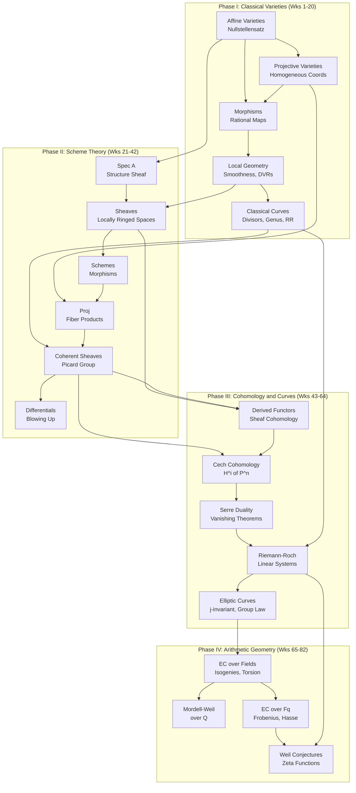

# Algebraic and Arithmetic Geometry Curriculum
*82 weeks · ~6.5 hrs/wk · ~530 hrs total*
*Profile: undergraduate algebra background, goal of Berkeley/Harvard PhD qualifying exam level*
*Focus: algebraic constructions and their geometric avatars — every definition paired with a geometric picture*

---

## Overview

| Phase | Weeks | Theme | File |
|-------|-------|-------|------|
| I | 1–20 | Classical Varieties (Shafarevich) | [[curricula/algebraic-geometry/phase-1-classical-varieties\|Phase I]] |
| II | 21–42 | Scheme Theory (Hartshorne I-II + Mumford) | [[curricula/algebraic-geometry/phase-2-scheme-theory\|Phase II]] |
| III | 43–64 | Cohomology and Curves (Hartshorne III-IV) | [[curricula/algebraic-geometry/phase-3-cohomology-curves\|Phase III]] |
| IV | 65–82 | Arithmetic Geometry (Silverman + Milne) | [[curricula/algebraic-geometry/phase-4-arithmetic-geometry\|Phase IV]] |

**Commutative algebra** is not a separate phase. Study the relevant Atiyah-Macdonald (A&M) sections at the point of first need — each week flags exactly which chapters are prerequisites. Eisenbud's *Commutative Algebra with a View Toward Algebraic Geometry* is the secondary CA reference: its geometric commentary on standard theorems is invaluable.

**Qualifying exam problem sets** used as benchmarks:
- Ritvik Ramkumar (Berkeley, 2017): scheme theory + commutative algebra + algebraic topology
- Will Fisher (Berkeley, 2024): scheme theory + category theory + algebraic topology
- Harvard AG qualifying problem collection: curves, divisors, cohomology, elliptic curves

---

## Dependency Map

---

## References

| Text | Role |
|---|---|
| Shafarevich, *Basic Algebraic Geometry* Vol 1 | Phase I primary |
| Reid, *Undergraduate Algebraic Geometry* | Phase I companion |
| Gathmann, *Algebraic Geometry* lecture notes (free) | Phase I–II problem supplement |
| Atiyah-Macdonald, *Introduction to Commutative Algebra* | CA reference (woven throughout) |
| Eisenbud, *Commutative Algebra with a View Toward AG* | CA supplement (geometric commentary) |
| Hartshorne, *Algebraic Geometry* | Phase II–III primary |
| Mumford, *The Red Book of Varieties and Schemes* | Phase II geometric companion |
| Vakil, *The Rising Sea* (free) | Phase II reference and exercises |
| Serre, *Faisceaux Algébriques Cohérents* (FAC) | Phase III historical source |
| Miranda, *Algebraic Curves and Riemann Surfaces* | Phase III curves supplement |
| Weibel, *Introduction to Homological Algebra* | Phase III derived functor reference |
| Silverman, *The Arithmetic of Elliptic Curves* | Phase IV primary |
| Ireland-Rosen, *A Classical Introduction to Modern Number Theory* | Phase IV finite fields |
| Milne, *Lectures on Étale Cohomology* (free) | Phase IV Weil conjectures |
| Fulton, *Algebraic Curves* (free) | Optional: deeper classical curves reference |

## Qualifying Exam Sources

| Source | Notes |
|---|---|
| [Ritvik Ramkumar, Berkeley 2017](https://math.berkeley.edu/~ritvik/Qualifying_Exam_Syllabus_and_Transcript.pdf) | Major: AG + Comm. Algebra; Minor: Alg. Topology |
| [Will Fisher, Berkeley 2024](https://math.berkeley.edu/~willfisher/papers/Qual_Transcript.pdf) | Major: AG + Category Theory; Minor: Alg. Topology |
| [Harvard AG Qualifying Problems](https://www.math.harvard.edu/media/alggeom.pdf) | Broad problem set; use as weekly diagnostic |
