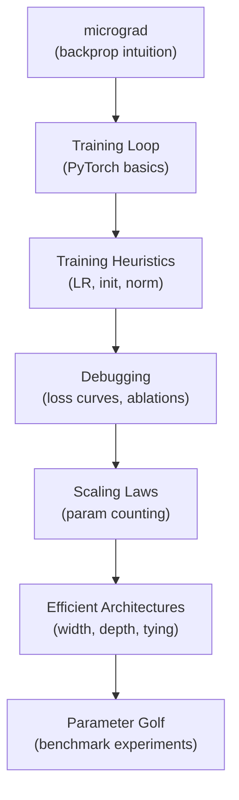

# Deep Learning Engineering: From Zero to Parameter Golf
*22 weeks · ~2 hrs/wk · ~44 hrs total*
*Profile: Python + some math, hands-on learner, goal = Parameter Golf intuition*

---

## Overview

| Phase | Weeks | Theme | Hrs |
|-------|-------|-------|-----|
| I — Intuition | 1–6 | Build a neural net from scratch | ~12 |
| II — Heuristics | 7–14 | Training recipes & debugging | ~16 |
| III — Efficiency | 15–22 | Parameter counting & Golf | ~16 |

**Guiding philosophy:** Code first, theory second. Each week has one primary resource and one checkpoint — a small thing you build or break to verify understanding.

---

## Dependency Map

---

## Phase I — Intuition (Weeks 1–6)

**Goal:** Understand what a neural network *actually does* — gradients, loss, the training loop — by building one from scratch.

### 📺 Week 1–2 · Backprop from Scratch

**Primary resource:** [Andrej Karpathy — micrograd](https://www.youtube.com/watch?v=VMj-3S1tku0) (2h 25m)

Code along with the video. Karpathy builds a scalar-valued autograd engine from nothing — no PyTorch, no NumPy, just Python. This is the single best use of 2.5 hours for a hands-on learner.

**What you'll understand after:**
- What a *gradient* is and why it flows backward through a computation graph
- Why `loss.backward()` works in PyTorch (it's just this, at scale)
- That "training" = repeatedly nudging weights in the direction that reduces loss

> [!QUESTION] Checkpoint 1
> *After watching micrograd, implement a tiny 2-layer MLP that learns XOR (4 data points, binary output) using only the micrograd engine you built. No PyTorch.*
>
> > **Why XOR:** It's the simplest problem that isn't linearly separable — a single neuron cannot solve it, but two layers can. Getting it to work proves your backprop engine is correct.

---

### 📺 Week 3–4 · Your First Real Training Loop

**Primary resource:** [Karpathy — makemore Part 1](https://www.youtube.com/watch?v=PaCmpygFfXo) (1h 57m) + [PyTorch in 25 minutes](https://www.youtube.com/watch?v=ic55579V8ag) (25m)

Switch to PyTorch. makemore is a character-level language model — Karpathy builds it step by step. Focus on the training loop structure: `forward → loss → backward → step`.

**What you'll understand after:**
- `nn.Module`, `optimizer.zero_grad()`, `loss.backward()`, `optimizer.step()` — in that order, always
- What a *batch* is and why we use mini-batches instead of one example at a time
- How to plot train vs validation loss and what the gap means

> [!QUESTION] Checkpoint 2
> *Train makemore on a dataset of your choice (names, words, anything). Plot the training loss curve. Then deliberately overfit: reduce the dataset to 50 examples and watch what happens to train vs val loss.*
>
> > **Why overfit on purpose:** Seeing the gap open up between train and val loss is the most visceral way to understand overfitting — and knowing you *can* overfit is the first debugging check on any real model.

---

### 📖 Week 5–6 · Loss Functions & Optimizers

**Primary resource:** [The Little Book of Deep Learning](https://fleuret.org/public/lbdl.pdf) — Chapters 1–3 (~1.5 hrs read)

This is a compact, math-precise reference. Don't try to read it cover to cover — read Chapters 1–3 now to put names to things you've already observed. Return to it throughout the curriculum.

**Also read:** [Karpathy's "A Recipe for Training Neural Networks"](http://karpathy.github.io/2019/04/25/recipe/) (30 min) — bookmark this; you'll return to it in Phase II.

**What you'll understand after:**
- Cross-entropy loss for classification, MSE for regression — what each optimizes
- SGD vs Adam — why Adam usually converges faster but sometimes generalizes worse
- Why learning rate is the most important hyperparameter before anything else

> [!QUESTION] Checkpoint 3
> *Train makemore with SGD (lr=0.1), SGD (lr=0.01), and Adam (lr=3e-4). Plot all three loss curves on the same axes. Write two sentences explaining what you observe.*

---

## Phase II — Heuristics (Weeks 7–14)

**Goal:** Develop the training intuitions that practitioners use daily — the ones that aren't in textbooks but separate people who can train models from people who can't.

### 📺 Week 7–8 · Learning Rate Is Everything

**Primary resource:** [fast.ai Practical Deep Learning — Lesson 1](https://course.fast.ai/Lessons/lesson1.html) (2 hrs)

fast.ai's course is the best practical DL curriculum available. Lesson 1 gets you training image classifiers on real data immediately. The key lesson here is the *learning rate finder* — a technique for finding the right LR without guessing.

**Also watch:** [fast.ai Lesson 2](https://course.fast.ai/Lessons/lesson2.html) (2 hrs, do in Week 8)

**What you'll understand after:**
- The learning rate finder (plot loss vs LR on a log scale, pick where it dips fastest)
- *Learning rate schedules:* warmup + cosine decay — why we don't use a fixed LR for long runs
- Why a LR that's 10× too high causes loss spikes; 10× too low causes painfully slow convergence

> [!QUESTION] Checkpoint 4
> *On any dataset you have, run a learning rate finder. Plot the loss-vs-LR curve. Then train with: (a) the recommended LR, (b) 10× too high, (c) 10× too low. Observe the loss curves.*

---

### 🔧 Week 9–10 · Normalization & Regularization

**Primary resource:** [Karpathy — makemore Part 3](https://www.youtube.com/watch?v=P6sfmUTpUmc) (1h 55m) — focuses on BatchNorm

BatchNorm is one of the most important and least-understood components in modern deep learning. Karpathy builds it from scratch and shows exactly what it does to gradient flow.

**Concepts to understand:**
- *BatchNorm / LayerNorm* — normalize activations so gradients don't vanish or explode
- *Dropout* — randomly zero activations during training; acts as a cheap ensemble
- *Weight decay* — adds a penalty on large weights; equivalent to an L2 prior

> [!QUESTION] Checkpoint 5
> *Ablation study: take your makemore model and toggle each of the following on/off one at a time: LayerNorm, dropout (p=0.1), weight decay (1e-4). Record final validation loss for each combination in a table. Which matters most?*

---

### 🔧 Week 11–12 · Initialization & Gradient Flow

**Primary resource:** [Karpathy — makemore Part 4](https://www.youtube.com/watch?v=q8SA3rM6ckI) (1h 55m)

Part 4 focuses on *weight initialization* — why it matters enormously, and what happens when you get it wrong. This is foundational for understanding residual connections.

**Concepts to understand:**
- *Xavier / He initialization* — scale initial weights so variance is preserved layer to layer
- *Vanishing / exploding gradients* — what goes wrong in deep networks without careful init
- *Residual connections* — why `x + f(x)` is so powerful: gradients flow directly to early layers

> [!QUESTION] Checkpoint 6
> *Build a 10-layer MLP (no residuals, no normalization) and train it. Watch the gradients collapse. Then add LayerNorm and residual connections. Compare training curves. Write one paragraph explaining the mechanism.*

---

### 🐛 Week 13–14 · Debugging Training Runs

**Primary resource:** Re-read [Karpathy's "Recipe for Training Neural Networks"](http://karpathy.github.io/2019/04/25/recipe/) carefully now that you have context (30 min). Then do [fast.ai Lesson 8](https://course.fast.ai/Lessons/lesson8.html) (2 hrs) — "Practical Deep Learning from the Foundations."

This is the most practically important phase. The ability to diagnose a broken training run quickly separates proficient practitioners from novices.

**Debugging checklist (Karpathy's recipe adapted):**
1. Start by fitting a single batch — if it won't overfit 1 batch, something is broken
2. Check that loss at step 0 matches the theoretical baseline (e.g., `-log(1/vocab_size)` for LM)
3. Plot loss, gradient norms, and weight norms — not just loss
4. Overfit a small dataset before scaling up
5. Add complexity one piece at a time

> [!QUESTION] Checkpoint 7
> *Deliberately introduce three bugs into your makemore training loop (e.g., forget `zero_grad()`, use wrong loss function, swap train/val). Try to diagnose each bug using only the loss curve and gradient norms — without reading the code.*

---

## Phase III — Efficiency (Weeks 15–22)

**Goal:** Understand what makes parameters "count," learn efficiency techniques, and play with Parameter Golf.

### 📐 Week 15–16 · Counting Parameters & Scaling Laws

**Primary resource:** [The Little Book of Deep Learning](https://fleuret.org/public/lbdl.pdf) — Chapter 5 (architectures) (1 hr). Then read the [Chinchilla paper abstract + Section 3](https://arxiv.org/abs/2203.15556) (30 min — just the key results, not the full paper).

**What you'll understand after:**
- How to count parameters in any architecture by hand
- *Scaling laws:* how loss decreases predictably with parameters, data, and compute
- The Chinchilla insight: most models are *overtrained on too little data* — optimal is ~20 tokens per parameter
- Width vs depth trade-offs: wider = more capacity per layer; deeper = more compositionality

> [!QUESTION] Checkpoint 8
> *Take any PyTorch model. Count its parameters by hand (linear layers: `in_features × out_features + bias`; embedding: `vocab × d_model`). Verify with `sum(p.numel() for p in model.parameters())`. Then build two models with identical parameter counts — one wide+shallow, one narrow+deep. Train both on makemore. Which converges faster?*

---

### ⚡ Week 17–18 · Efficient Architectures

**Primary resource:** [Karpathy — nanoGPT](https://www.youtube.com/watch?v=kCc8FmEb1nY) (1h 56m) — "Let's build GPT from scratch"

nanoGPT is a clean, minimal transformer implementation. Focus on the architecture choices that maximize what each parameter does.

**Efficiency techniques to study:**
- *Weight tying:* using the same matrix for input embeddings and output projection (cuts params by `vocab × d_model` — often 30–40% of a small model)
- *Grouped-query attention (GQA):* fewer K/V heads than Q heads — large param reduction in attention
- *Depthwise separable convolutions (for CNNs):* factor `C × C × k × k` into `C × k × k + C × C` — MobileNet's key trick
- *Low-rank factorization:* replace `A ∈ ℝ^{m×n}` with `UV` where `U ∈ ℝ^{m×r}, V ∈ ℝ^{r×n}`, `r ≪ min(m,n)`

> [!QUESTION] Checkpoint 9
> *Start from nanoGPT. Apply weight tying (tie `transformer.wte` and `lm_head`). Measure the parameter reduction. Then: does validation loss change? If so, in which direction, and why might that be?*

---

### 🏌️ Week 19–20 · Introduction to Parameter Golf

**Primary resource:** [OpenAI Parameter Golf](https://openai.com/index/parameter-golf/) — read the full blog post carefully (30 min).

Now that you have the foundations, the blog post will read very differently than it would have 18 weeks ago.

**Key concepts the post touches on:**
- *Benchmark-specific efficiency:* different tasks reward different architectural priors
- *The compression vs accuracy trade-off:* how few parameters can you use before the task breaks?
- *Inductive biases:* baking structure into architecture (e.g., CNNs for images) lets you do more with fewer parameters

**Exploration tasks (not checkpoints — open-ended):**
1. Read the scoring rules: understand what the benchmark measures exactly
2. Run their baseline — get a working submission
3. Apply weight tying — does score improve?
4. Try a smaller, narrower model — find the minimum viable architecture

> [!TIP]- Strategy note: hands-on learners in Parameter Golf
> The trap here is over-engineering before you have baselines. Karpathy's rule applies: **make it work, make it right, make it fast.** Get a working submission with default settings, log the score, then make *one change at a time* and re-score. Never change two things simultaneously when you're learning — you won't know which one worked.

---

### 🏌️ Week 21–22 · Experiment Cycle

**No new resources — this is pure experimentation.**

You now have enough vocabulary to read papers and blog posts about parameter efficiency. Some directions worth exploring:

| Technique | What it does | Params saved |
|-----------|-------------|-------------|
| Weight tying | Share embedding + unembedding matrices | Large (vocab × d) |
| Grouped-query attention | Fewer KV heads | Moderate |
| Low-rank layers | Factorize large weight matrices | Tunable |
| Smaller vocab (BPE tuning) | Fewer embedding rows | Moderate |
| Depthwise separable conv | For any CNN-based approach | Large |
| Shared layer weights | Reuse same transformer block N times | Very large |

> [!QUESTION] Checkpoint 10 (Capstone)
> *Document your Parameter Golf experiments in a table: technique applied, parameter count before/after, score before/after, and one sentence on what you learned. Aim for at least 5 iterations.*

---

## 📚 Complete Resource Reference

| Resource | Type | When | Time | Link |
|----------|------|------|------|------|
| Karpathy — micrograd | Video | Week 1–2 | 2.5 hrs | [YouTube](https://www.youtube.com/watch?v=VMj-3S1tku0) |
| Karpathy — makemore Part 1 | Video | Week 3–4 | 2 hrs | [YouTube](https://www.youtube.com/watch?v=PaCmpygFfXo) |
| PyTorch in 25 minutes | Video | Week 3 | 25 min | [YouTube](https://www.youtube.com/watch?v=ic55579V8ag) |
| The Little Book of Deep Learning | Book (free PDF) | Ref + Wk 5–6, 15 | Chapters | [PDF](https://fleuret.org/public/lbdl.pdf) |
| Karpathy — "Recipe for Training NNs" | Blog | Week 5–6, 13 | 30 min | [Blog](http://karpathy.github.io/2019/04/25/recipe/) |
| fast.ai Practical DL — Lesson 1 | Course | Week 7 | 2 hrs | [fast.ai](https://course.fast.ai/Lessons/lesson1.html) |
| fast.ai Practical DL — Lesson 2 | Course | Week 8 | 2 hrs | [fast.ai](https://course.fast.ai/Lessons/lesson2.html) |
| Karpathy — makemore Part 3 | Video | Week 9–10 | 2 hrs | [YouTube](https://www.youtube.com/watch?v=P6sfmUTpUmc) |
| Karpathy — makemore Part 4 | Video | Week 11–12 | 2 hrs | [YouTube](https://www.youtube.com/watch?v=q8SA3rM6ckI) |
| fast.ai Lesson 8 | Course | Week 13–14 | 2 hrs | [fast.ai](https://course.fast.ai/Lessons/lesson8.html) |
| Chinchilla paper (§3 only) | Paper | Week 15 | 30 min | [arXiv](https://arxiv.org/abs/2203.15556) |
| Karpathy — nanoGPT | Video | Week 17–18 | 2 hrs | [YouTube](https://www.youtube.com/watch?v=kCc8FmEb1nY) |
| OpenAI Parameter Golf | Blog | Week 19+ | 30 min | [OpenAI](https://openai.com/index/parameter-golf/) |

---

## 📊 Progress Tracker

| Week | Topic | Resource | Status | Time | Notes |
|------|-------|----------|--------|------|-------|
| 1–2 | Backprop intuition | micrograd | ☐ | | |
| 3–4 | Training loop | makemore + PyTorch | ☐ | | |
| 5–6 | Loss & optimizers | Little Book Ch1–3 + Recipe | ☐ | | |
| 7–8 | Learning rate | fast.ai L1–2 | ☐ | | |
| 9–10 | Norm & regularization | makemore Part 3 | ☐ | | |
| 11–12 | Init & gradient flow | makemore Part 4 | ☐ | | |
| 13–14 | Debugging | Recipe (deep read) + fast.ai L8 | ☐ | | |
| 15–16 | Param counting & scaling | Little Book Ch5 + Chinchilla | ☐ | | |
| 17–18 | Efficient architectures | nanoGPT | ☐ | | |
| 19–20 | Parameter Golf intro | OpenAI blog + first submission | ☐ | | |
| 21–22 | Experiment cycle | — | ☐ | | |
