# Deep Learning Engineering: Language Models
*30 weeks · ~5 hrs/wk · ~150 hrs total*
*Profile: strong theory (transformers, optimization, scaling laws), weak engineering; goal = expert LM practitioner + Parameter Golf competitor*
*Focus: engineering over theory — every week produces running code on real hardware*

---

## Overview

| Phase | Weeks | Theme | File |
|-------|-------|-------|------|
| I | 1–4 | Engineering Foundation | [[curricula/deep-learning-engineering/phase-1-engineering-foundation\|Phase I]] |
| II | 5–10 | Modern LM Training | [[curricula/deep-learning-engineering/phase-2-lm-training\|Phase II]] |
| III | 11–15 | Quantization & Compression | [[curricula/deep-learning-engineering/phase-3-quantization\|Phase III]] |
| IV | 16–20 | Inference Systems | [[curricula/deep-learning-engineering/phase-4-inference\|Phase IV]] |
| V | 21–25 | Distributed Training | [[curricula/deep-learning-engineering/phase-5-distributed\|Phase V]] |
| VI | 26–30 | Novel Architectures & Golf | [[curricula/deep-learning-engineering/phase-6-architectures-golf\|Phase VI]] |

**Theory is assumed.** Attention math, scaling laws, Adam, loss landscapes — these are not re-taught. The starting point is: you understand the concepts, but you cannot yet write a production-quality training loop, profile a GPU run, or implement GPTQ. That changes over 30 weeks.

**Parameter Golf techniques used by top-50 submissions** (the engineering skills this curriculum is designed to unlock):

| Technique | Phase where covered |
|-----------|-------------------|
| GPTQ (post-training quantization) | III |
| FP8 / INT6 quantization-aware training | III |
| Muon optimizer | II |
| Test-Time Training (TTT) architectures | VI |
| Depth recurrence / shared-weight transformers | VI |
| KV cache reduction (GQA/MQA) | IV |
| FlashAttention | IV |
| Vocabulary optimization + bigram hashing | I |
| Brotli/LZMA weight compression | III |
| Distributed training for data-parallel experiments | V |

---

## Dependency Map

```mermaid
flowchart TD
    subgraph P1["Phase I: Engineering Foundation (Wks 1–4)"]
        nano["nanoGPT full stack<br/>training loop, checkpointing"]
        tok["Tokenization engineering<br/>BPE, vocab optimization"]
        exp["Experiment infrastructure<br/>wandb, configs, LR finder"]
    end

    subgraph P2["Phase II: LM Training Engineering (Wks 5–10)"]
        amp["Mixed precision<br/>BF16, AMP, loss scaling"]
        ckpt["Memory management<br/>grad checkpointing, profiling"]
        pipe["Data pipelines<br/>streaming, WebDataset"]
        muon["Modern optimizers<br/>Muon, AdamW, schedules"]
    end

    subgraph P3["Phase III: Quantization (Wks 11–15)"]
        qfund["Quantization fundamentals<br/>INT8, calibration"]
        gptq["GPTQ<br/>second-order PTQ"]
        qat["QAT<br/>fake quantization"]
        fp8["FP8 training<br/>NF4, low-rank SVD"]
    end

    subgraph P4["Phase IV: Inference Systems (Wks 16–20)"]
        kvcache["KV cache<br/>GQA, MQA, memory"]
        flash["FlashAttention<br/>tiling, IO analysis"]
        spec["Speculative decoding"]
        batch["Continuous batching<br/>PagedAttention, vLLM"]
    end

    subgraph P5["Phase V: Distributed Training (Wks 21–25)"]
        ddp["DDP<br/>allreduce, buckets"]
        fsdp["FSDP / ZeRO<br/>optimizer sharding"]
        tp["Tensor parallelism<br/>Megatron-style"]
        pp["Pipeline parallelism<br/>microbatching"]
    end

    subgraph P6["Phase VI: Novel Architectures (Wks 26–30)"]
        ssm["Mamba / SSMs<br/>selective scan"]
        ttt["TTT layers<br/>test-time training"]
        rec["Depth recurrence<br/>shared weights"]
        golf["Parameter Golf campaign<br/>systematic experiments"]
    end

    nano --> tok
    tok --> exp
    exp --> amp
    amp --> ckpt
    ckpt --> pipe
    pipe --> muon
    muon --> qfund
    qfund --> gptq
    gptq --> qat
    qat --> fp8
    fp8 --> kvcache
    kvcache --> flash
    flash --> spec
    spec --> batch
    batch --> ddp
    ddp --> fsdp
    fsdp --> tp
    tp --> pp
    pp --> ssm
    ssm --> ttt
    ttt --> rec
    rec --> golf
```

---

## References

| Resource | Role |
|----------|------|
| Karpathy, [nanoGPT](https://github.com/karpathy/nanoGPT) (code) | Phase I primary: production LM baseline |
| Karpathy, [nanoGPT video](https://www.youtube.com/watch?v=kCc8FmEb1nY) (1h56m) | Phase I walkthrough |
| Karpathy, [llm.c](https://github.com/karpathy/llm.c) (code) | Phase II: understanding efficiency from first principles |
| Sennrich et al., [BPE paper](https://arxiv.org/abs/1508.07909) | Phase I: tokenization |
| Loshchilov & Hutter, [AdamW paper](https://arxiv.org/abs/1711.05101) | Phase II: optimizer correctness |
| Kostrikov, [Muon optimizer](https://github.com/KellerJordan/modded-nanogpt) | Phase II: top Parameter Golf optimizer |
| PyTorch, [torch.profiler docs](https://pytorch.org/tutorials/recipes/recipes/profiler_recipe.html) | Phase II: profiling |
| PyTorch, [AMP tutorial](https://pytorch.org/docs/stable/amp.html) | Phase II: mixed precision |
| Frantar et al., [GPTQ paper](https://arxiv.org/abs/2210.17323) | Phase III primary |
| Dettmers et al., [LLM.int8() paper](https://arxiv.org/abs/2208.07339) | Phase III: INT8 quantization |
| Dao et al., [FlashAttention paper](https://arxiv.org/abs/2205.14135) | Phase IV primary |
| Leviathan et al., [Speculative decoding paper](https://arxiv.org/abs/2211.17192) | Phase IV |
| Kwon et al., [vLLM / PagedAttention paper](https://arxiv.org/abs/2309.06180) | Phase IV |
| Rajbhandari et al., [ZeRO paper](https://arxiv.org/abs/1910.02054) | Phase V primary |
| Shoeybi et al., [Megatron-LM paper](https://arxiv.org/abs/1909.08053) | Phase V: tensor parallelism |
| Gu & Dao, [Mamba paper](https://arxiv.org/abs/2312.00752) | Phase VI |
| Sun et al., [TTT paper](https://arxiv.org/abs/2407.04620) | Phase VI: top Parameter Golf architecture |
| Dehghani et al., [Universal Transformers](https://arxiv.org/abs/1807.03819) | Phase VI: depth recurrence |
| Modded-nanoGPT, [KellerJordan/modded-nanogpt](https://github.com/KellerJordan/modded-nanogpt) | Phase VI: Parameter Golf reference implementation |
