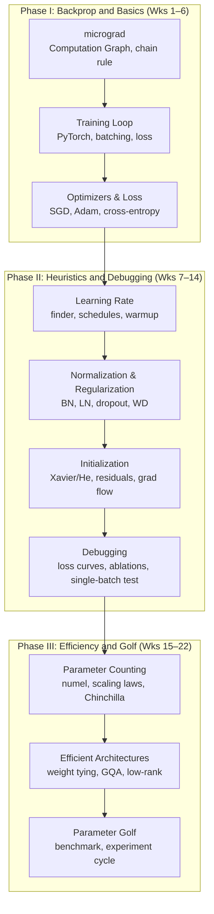

# Deep Learning Engineering: From Zero to Parameter Golf
*22 weeks · ~2 hrs/wk · ~44 hrs total*
*Profile: Python + some math, hands-on learner, goal = confident Parameter Golf experimentation*
*Focus: engineering intuition over formalism — every concept grounded in a concrete training experiment*

---

## Overview

| Phase | Weeks | Theme | File |
|-------|-------|-------|------|
| I | 1–6 | Backprop & Training Basics | [[curricula/deep-learning-engineering/phase-1-backprop-basics\|Phase I]] |
| II | 7–14 | Training Heuristics & Debugging | [[curricula/deep-learning-engineering/phase-2-heuristics-debugging\|Phase II]] |
| III | 15–22 | Parameter Efficiency & Golf | [[curricula/deep-learning-engineering/phase-3-efficiency-golf\|Phase III]] |

**PyTorch** is the implementation framework throughout. All code is written from scratch rather than using high-level trainer APIs — the goal is to understand what every line does before abstracting it away.

**Karpathy's "Neural Networks: Zero to Hero" series** is the primary resource for Phases I and II. Each video is a code-along: pause frequently, type the code yourself, run it, break it. Passive watching produces no learning.

---

## Dependency Map

---

## References

| Resource | Role |
|----------|------|
| Karpathy, [micrograd](https://www.youtube.com/watch?v=VMj-3S1tku0) (video, 2h25m) | Phase I primary: backprop from scratch |
| Karpathy, [makemore Part 1](https://www.youtube.com/watch?v=PaCmpygFfXo) (video, 1h57m) | Phase I: first real training loop |
| Karpathy, [makemore Part 3](https://www.youtube.com/watch?v=P6sfmUTpUmc) (video, 1h55m) | Phase II: BatchNorm and activation statistics |
| Karpathy, [makemore Part 4](https://www.youtube.com/watch?v=q8SA3rM6ckI) (video, 1h55m) | Phase II: initialization and gradient flow |
| Karpathy, [nanoGPT](https://www.youtube.com/watch?v=kCc8FmEb1nY) (video, 1h56m) | Phase III: transformer architecture, efficiency |
| Karpathy, ["A Recipe for Training Neural Networks"](http://karpathy.github.io/2019/04/25/recipe/) (blog) | Phase II: debugging heuristics |
| fast.ai, [Practical Deep Learning for Coders](https://course.fast.ai/) (course, free) | Phase II: practical training recipes |
| Fleuret, [*The Little Book of Deep Learning*](https://fleuret.org/public/lbdl.pdf) (book, free PDF) | Reference throughout; mathematical backbone |
| Hoffmann et al., [*Training Compute-Optimal Large Language Models*](https://arxiv.org/abs/2203.15556) (Chinchilla) | Phase III: scaling laws and parameter budgets |
| OpenAI, [Parameter Golf](https://openai.com/index/parameter-golf/) (blog) | Phase III: the benchmark |
