# ML Systems Curriculum: LLMs & Multimodal Models
*52 weeks · ~10 hrs/wk · ~520 hrs total*
*Profile: Python/PyTorch practitioner, GPU beginner, full-stack goal (inference + training + kernels)*

---

## Year Overview

| Part | Weeks | Theme |
|------|-------|-------|
| I | 1–12 | Foundations |
| II | 13–20 | Hardware Mastery |
| III | 21–29 | Training at Scale |
| IV | 30–37 | Advanced Inference |
| V | 38–46 | Emerging Architectures |
| VI | 47–52 | Compilers & Infrastructure |

---

## Dependency Map

```mermaid
flowchart TD
    subgraph P1["① Foundations · Wks 1–12"]
        roofline["Roofline & GPU Architecture"]
        txArith["Transformer Systems Arithmetic"]
        effAttn["Efficient Attention (Flash, GQA, MLA)"]
        inference["Quantization & Serving"]
        dist["Distributed Training (DP / TP / PP / ZeRO)"]
        kernels["Triton Kernels & torch.compile"]
    end

    subgraph P2["② Hardware Mastery · Wks 13–20"]
        advCuda["Advanced CUDA (Warps, Tensor Cores, cp.async)"]
        cutlass["CUTLASS / CuTe"]
        hopper["Hopper ISA (TMA, WGMMA, Ping-Pong)"]
        profiling["Nsight Profiling (Compute + Systems)"]
        interconnects["Interconnects & NCCL Basics"]
    end

    subgraph P3["③ Training at Scale · Wks 21–29"]
        seqPar["Sequence & Context Parallelism"]
        moeTraining["MoE Training (Expert Parallelism)"]
        dataPipe["Data Pipelines & Pretraining Infra"]
        peft["LoRA / QLoRA / PEFT"]
        rlhf["RLHF Systems (PPO, DPO, GRPO)"]
    end

    subgraph P4["④ Advanced Inference · Wks 30–37"]
        longCtx["Long-Context (YaRN, KV Eviction)"]
        advQuant["FP8 & Extreme Quantization"]
        advSpec["Advanced Spec Decoding (EAGLE, Medusa)"]
        disagg["Disaggregated Inference (DistServe)"]
        prodServing["Production Serving & SLO Scheduling"]
    end

    subgraph P5["⑤ Emerging Architectures · Wks 36–46"]
        mamba["Mamba / SSMs & Parallel Scan"]
        moeInf["MoE Inference & Expert Offload"]
        linAttn["Linear Attention & Hybrid Models"]
        diffusion["Diffusion Systems (DiT, Flow Matching)"]
    end

    subgraph P6["⑥ Compilers & Infra · Wks 43–52"]
        mlir["MLIR & Compiler IR Theory"]
        tvm["TVM / XLA / Autotuning"]
        adSys["Automatic Differentiation Systems"]
        memMgmt["CUDA Memory Management"]
        ncclDeep["NCCL Deep Dive & Collectives"]
    end

    %% Part I internal
    roofline --> txArith
    roofline --> kernels
    txArith --> effAttn
    effAttn --> inference
    effAttn --> dist

    %% P1 → P2
    roofline --> advCuda
    kernels --> cutlass
    advCuda --> cutlass
    cutlass --> hopper
    hopper --> profiling
    dist --> interconnects

    %% P1 → P3
    dist --> seqPar
    dist --> moeTraining
    txArith --> dataPipe
    inference --> peft
    peft --> rlhf
    seqPar --> rlhf

    %% P1 → P4
    effAttn --> longCtx
    inference --> advQuant
    inference --> advSpec
    inference --> disagg
    inference --> prodServing

    %% P2 → P4
    hopper --> advQuant

    %% P2 → P5
    hopper --> mamba
    kernels --> mamba

    %% P1 → P5
    effAttn --> linAttn
    txArith --> diffusion

    %% P3 → P5
    moeTraining --> moeInf

    %% P4 → P5
    disagg --> moeInf

    %% P2 → P6
    hopper --> mlir
    kernels --> mlir
    mlir --> tvm
    advCuda --> memMgmt
    interconnects --> ncclDeep
    kernels --> adSys
```

---

## Part I — Foundations

> **Goal:** Build the hardware intuition, transformer arithmetic, attention theory, inference fundamentals, distributed training basics, and kernel writing skills that underpin everything else.

### Week 1 — The Roofline Model

**Concepts to understand:**

- [ ] Arithmetic intensity: what it is and how to compute it for an op
- [ ] The roofline model: compute ceiling vs memory bandwidth ceiling
- [ ] Ridge point: the arithmetic intensity that separates memory-bound from compute-bound
- [ ] HBM vs SRAM: capacity, bandwidth, and latency tradeoffs
- [ ] GPU SM, warp, and thread hierarchy at a high level
- [ ] How to read a PyTorch profiler trace

**Reading:**

- [ ] [*Making Deep Learning Go Brrrr*](https://horace.io/brrr_intro.html) — Horace He *(1.5 hrs)*
- [ ] [*All About Rooflines*](https://jax-ml.github.io/scaling-book/roofline/) — JAX Scaling Book *(2 hrs)*
- [ ] [*Transformer Math 101*](https://blog.eleuther.ai/transformer-math/) — EleutherAI *(1.5 hrs)*
- [ ] [NVIDIA Hopper Architecture Whitepaper](https://resources.nvidia.com/en-us-tensor-core/nvidia-hopper-architecture-whitepaper) §1–3 *(1.5 hrs)*
- [ ] [PyTorch Profiler Tutorial](https://pytorch.org/tutorials/recipes/recipes/profiling_recipe.html) *(1 hr)*

**Hands-on:**

- [ ] Run PyTorch profiler on a forward pass of `GPT2LMHeadModel`. Identify the top 3 ops by CUDA time and classify each as compute- or memory-bound. *(1.5 hrs)*

> **Milestone:** Given `matmul(A, B)` with A=(4096,4096), B=(4096,4096) in fp16 on an A100 (312 TFLOP/s, 2 TB/s), compute arithmetic intensity and determine its roofline regime.

---

### Week 2 — CUDA Mental Model & Memory Hierarchy

**Concepts to understand:**

- [ ] Thread/block/grid hierarchy and how it maps to GPU hardware
- [ ] Shared memory (SMEM): capacity per SM, latency vs global memory
- [ ] Global memory coalescing: why access pattern matters for bandwidth
- [ ] Occupancy: how register and SMEM usage limits active warps per SM
- [ ] Bank conflicts in shared memory
- [ ] L1/L2 cache behavior

**Reading:**

- [ ] [*Programming Massively Parallel Processors*](https://www.oreilly.com/library/view/programming-massively-parallel/9780323984638/) Ch. 1–5 — Hwu & Kirk *(4 hrs)*
- [ ] [ECE408/CS483 Lecture Videos Weeks 1–3](https://developer.nvidia.com/gpu-teaching-kit) — UIUC via NVIDIA *(3 hrs)*
- [ ] [*An Even Easier Introduction to CUDA*](https://developer.nvidia.com/blog/even-easier-introduction-cuda/) — NVIDIA Blog *(1 hr)*

**Hands-on:**

- [ ] Write a naive CUDA vector-add kernel (in C or via Numba). Measure achieved bandwidth vs theoretical peak. *(2 hrs)*

> **Milestone:** Explain why a naively written matrix transpose kernel is memory-bandwidth-bound despite O(N²) reads and writes — and describe the shared memory tiling fix.

---

### Week 3 — Transformer Systems Arithmetic

**Concepts to understand:**

- [ ] Parameter count formula for a transformer (embedding, attn projections, MLP, LM head)
- [ ] FLOPs ≈ 6ND for training, ≈ 2ND for inference — where this comes from
- [ ] KV cache memory: `2 · n_layers · n_heads · d_head · seqlen · batch · dtype_bytes`
- [ ] Model FLOPs utilization (MFU): definition and how to measure it
- [ ] Scaling laws: compute-optimal training (Chinchilla)
- [ ] Why seqlen causes quadratic FLOPs but linear KV cache growth

**Reading:**

- [ ] [*Transformer Math 101*](https://blog.eleuther.ai/transformer-math/) — EleutherAI *(re-read carefully, 1.5 hrs)*
- [ ] [*Language Models are Few-Shot Learners*](https://arxiv.org/abs/2005.14165) §2 — GPT-3 *(1 hr)*
- [ ] [*Scaling Laws for Neural Language Models*](https://arxiv.org/abs/2001.08361) — Kaplan et al. *(2 hrs)*
- [ ] [JAX Scaling Book Ch. 2–3](https://jax-ml.github.io/scaling-book/) *(2 hrs)*

**Hands-on:**

- [ ] For a 7B-parameter LLaMA-2 in bf16, derive: (a) weight memory, (b) KV cache at batch=32 seqlen=2048, (c) FLOPs per forward pass. *(3 hrs)*

> **Milestone:** Why does doubling sequence length quadratically increase attention FLOPs but only linearly increase KV cache memory? Write out the derivation.

---

### Week 4 — Efficient Attention

**Concepts to understand:**

- [ ] IO complexity of standard attention: why materializing (seqlen × seqlen) is the bottleneck
- [ ] FlashAttention tiling: splitting Q/K/V into blocks to avoid writing the full attention matrix
- [ ] Online softmax: computing softmax incrementally across tiles
- [ ] GQA/MQA: sharing K/V heads across query heads and the memory savings
- [ ] MLA: low-rank KV compression in DeepSeek-V2 and the 64× cache reduction
- [ ] FlashAttention-2 improvements over v1

**Reading:**

- [ ] [*FlashAttention*](https://arxiv.org/abs/2205.14135) — Dao et al. 2022 *(2 hrs)*
- [ ] [*FlashAttention-2*](https://arxiv.org/abs/2307.08691) — Dao 2023 *(1.5 hrs)*
- [ ] [*GQA: Training Generalized Multi-Query Transformer Models*](https://arxiv.org/abs/2305.13245) *(1.5 hrs)*
- [ ] [*DeepSeek-V2*](https://arxiv.org/abs/2405.04434) §3 — MLA *(1 hr)*
- [ ] [FlashAttention-3 blog](https://tridao.me/blog/2024/flash3/) *(1 hr)*

**Hands-on:**

- [ ] Implement FlashAttention forward tiling logic in pure NumPy. Verify against `torch.nn.functional.scaled_dot_product_attention`. *(3 hrs)*

> **Milestone:** For a 70B model, 64 heads, d_head=128, seqlen=8192, batch=1 in fp16 — compute the memory footprint of the full attention matrix under standard MHA. Then state FlashAttention's peak SMEM usage and explain why.

---

### Week 5 — Quantization & Speculative Decoding

**Concepts to understand:**

- [ ] Post-training quantization (PTQ) vs quantization-aware training (QAT)
- [ ] Why outlier activations break naive int8 quantization (LLM.int8() mixed-precision)
- [ ] Weight-only quantization (GPTQ, AWQ) vs weight+activation quantization
- [ ] AWQ: activation-aware scaling to protect salient weights
- [ ] Speculative decoding: draft model generates K tokens, target verifies in parallel
- [ ] Token acceptance rate and when speculative decoding wins/loses

**Reading:**

- [ ] [*LLM.int8()*](https://arxiv.org/abs/2208.07339) — Dettmers et al. *(1.5 hrs)*
- [ ] [*GPTQ*](https://arxiv.org/abs/2210.17323) *(1.5 hrs)*
- [ ] [*AWQ: Activation-aware Weight Quantization*](https://arxiv.org/abs/2306.00978) *(1 hr)*
- [ ] [*Fast Inference via Speculative Decoding*](https://arxiv.org/abs/2211.17192) — Leviathan et al. *(1.5 hrs)*
- [ ] [Hugging Face quantization guide](https://huggingface.co/docs/transformers/quantization) *(1 hr)*

**Hands-on:**

- [ ] Load LLaMA-3-8B in fp16, int8 (bitsandbytes), and GPTQ 4-bit. Measure decode latency, throughput, and perplexity for each. *(3 hrs)*

---

### Week 6 — Serving Systems

**Concepts to understand:**

- [ ] Prefill vs decode phases: why prefill is compute-bound and decode is memory-bandwidth-bound
- [ ] TTFT (time-to-first-token) vs TPOT (time-per-output-token)
- [ ] Continuous batching (iteration-level scheduling)
- [ ] PagedAttention: virtual memory for KV cache, block table indirection
- [ ] KV cache fragmentation and how paging limits it to <4%
- [ ] SGLang vs vLLM tradeoffs

**Reading:**

- [ ] [*Efficient Memory Management for LLM Serving with PagedAttention*](https://arxiv.org/abs/2309.06180) — Kwon et al. *(2 hrs)*
- [ ] [*Orca: A Distributed Serving System for Transformer-Based LLMs*](https://www.usenix.org/conference/osdi22/presentation/yu) *(1.5 hrs)*
- [ ] [Continuous Batching — 23× LLM Throughput](https://www.anyscale.com/blog/continuous-batching-llm-inference) — Anyscale *(0.5 hrs)*
- [ ] [vLLM docs — quickstart + architecture](https://docs.vllm.ai) *(1 hr)*
- [ ] [*SGLang*](https://arxiv.org/abs/2312.07104) *(1.5 hrs)*

**Hands-on:**

- [ ] Serve LLaMA-3-8B with vLLM. Sweep batch size 1→64. Record throughput and TTFT. At what batch size does the system transition from memory-bound to compute-bound? *(3 hrs)*

> **Milestone (Weeks 5–6):** For a 7B model on one A100 (80GB), walk through: (1) VRAM available for KV cache after loading int4 weights, (2) concurrent sequences that fit, (3) why continuous batching improves utilization over static batching.

---

### Week 7 — Data Parallelism, Tensor Parallelism, Pipeline Parallelism

**Concepts to understand:**

- [ ] Data parallelism (DDP): gradient all-reduce, overlap with backward pass
- [ ] Tensor parallelism: column-parallel and row-parallel linear layers
- [ ] Pipeline parallelism: stage assignment, pipeline bubbles, 1F1B schedule
- [ ] Micro-batching to fill the pipeline
- [ ] 3D parallelism: how TP + PP + DP compose
- [ ] Communication primitives: all-reduce, all-gather, reduce-scatter

**Reading:**

- [ ] [*Megatron-LM*](https://arxiv.org/abs/1909.08053) — Shoeybi et al. *(1.5 hrs)*
- [ ] [*Efficient Large-Scale Language Model Training on GPU Clusters*](https://arxiv.org/abs/2104.04473) — Narayanan et al. *(2.5 hrs)*
- [ ] [*Everything About Distributed Training and Efficient Finetuning*](https://sumanthrh.com/post/distributed-and-efficient-finetuning/) *(2 hrs)*
- [ ] [JAX Scaling Book Ch. 4–5](https://jax-ml.github.io/scaling-book/) *(2 hrs)*

**Hands-on:**

- [ ] Using `torch.distributed`, run DDP on 2 GPUs. Profile all-reduce communication time vs. total step time at varying batch sizes. *(2 hrs)*

---

### Week 8 — ZeRO, FSDP, Mixed Precision, Gradient Checkpointing

**Concepts to understand:**

- [ ] ZeRO stages 1/2/3: what each stage shards
- [ ] ZeRO-3 / FSDP communication: all-gather before forward, reduce-scatter after backward
- [ ] Mixed precision: fp16/bf16 forward + fp32 master weights, loss scaling
- [ ] Why bf16 is preferred over fp16 for training
- [ ] Gradient checkpointing: recomputing activations vs storing them

**Reading:**

- [ ] [*ZeRO: Memory Optimizations Toward Training Trillion Parameter Models*](https://arxiv.org/abs/1910.02054) *(2 hrs)*
- [ ] [PyTorch FSDP2 blog](https://pytorch.org/blog/pytorch-native-architecture-optimization/) *(1 hr)*
- [ ] [*Mixed Precision Training*](https://arxiv.org/abs/1710.03740) *(1.5 hrs)*
- [ ] [NVIDIA Mixed Precision Training Guide](https://docs.nvidia.com/deeplearning/performance/mixed-precision-training/) *(1 hr)*
- [ ] [*Reducing Activation Recomputation in Large Transformer Models*](https://arxiv.org/abs/2205.05198) *(1 hr)*

**Hands-on:**

- [ ] Train a 1B-parameter toy transformer on 2 GPUs. Record peak memory under: (a) DDP fp32, (b) DDP bf16, (c) FSDP ZeRO-3 bf16. *(3 hrs)*

> **Milestone (Weeks 7–8):** For a 13B model on 8 GPUs with ZeRO-3: calculate per-GPU memory for parameters, gradients, and optimizer states. Estimate the all-gather + reduce-scatter communication volume per step vs. DDP baseline.

---

### Week 9 — Triton Foundations

**Concepts to understand:**

- [ ] What Triton is: a Python DSL compiling to PTX, sitting between CUDA C and PyTorch ops
- [ ] `tl.program_id`, `tl.load`, `tl.store`: the core primitives
- [ ] Block tiling in Triton: how BLOCK_SIZE maps to SMEM usage and occupancy
- [ ] Masking: handling tensor edges when shape isn't a multiple of BLOCK_SIZE
- [ ] `tl.dot`: Triton's matmul primitive
- [ ] Autotuning: `@triton.autotune` decorator and config search
- [ ] Fusion: why fusing elementwise ops into a matmul saves memory bandwidth

**Reading:**

- [ ] [*Triton: An Intermediate Language and Compiler for Tiled Neural Network Computations*](https://www.eecs.harvard.edu/~htk/publication/2019-mapl-tillet-kung-cox.pdf) *(1.5 hrs)*
- [ ] [Official Triton tutorials: vector add → fused softmax → matmul](https://triton-lang.org/main/getting-started/tutorials/) *(4 hrs)*
- [ ] [*Unleashing the Power of Triton*](https://towardsdatascience.com/unleashing-the-power-of-triton-mastering-gpu-kernel-optimization-in-python-160a3f52701e/) *(1 hr)*

**Hands-on:**

- [ ] Implement fused SiLU (`x * sigmoid(x)`) as a Triton kernel. Benchmark against PyTorch built-in and two-op naive version. Report bandwidth utilization. *(3.5 hrs)*

---

### Week 10 — torch.compile & Inductor

**Concepts to understand:**

- [ ] `torch.compile` pipeline: Dynamo → Inductor → Triton kernels
- [ ] Graph capture modes: `reduce-overhead` vs `max-autotune`
- [ ] Fusion in Inductor: which op patterns get fused automatically
- [ ] Graph breaks: what causes them and how to diagnose with `TORCH_COMPILE_DEBUG=1`
- [ ] When `torch.compile` is and isn't worth it (dynamic shapes, small models)
- [ ] How FlashAttention-3 uses Triton + Hopper TMA/WGMMA for ~75% peak FLOP/s

**Reading:**

- [ ] [*PyTorch 2*](https://arxiv.org/abs/2304.07640) *(1.5 hrs)*
- [ ] [torch.compile tutorial](https://pytorch.org/tutorials/intermediate/torch_compile_tutorial.html) *(1.5 hrs)*
- [ ] [FlashAttention-3 blog](https://tridao.me/blog/2024/flash3/) *(1.5 hrs)*
- [ ] [Triton blocked matmul tutorial](https://triton-lang.org/main/getting-started/tutorials/03-matrix-multiplication.html) *(2 hrs)*

**Hands-on:**

- [ ] Apply `torch.compile` to a full transformer forward pass. Use `TORCH_COMPILE_DEBUG=1` to inspect emitted Triton kernels. Identify which ops fused and which caused graph breaks. *(3.5 hrs)*

> **Milestone (Weeks 9–10):** Write a fused layernorm kernel in Triton that computes mean, variance, and normalization in a single pass. Compare throughput and bandwidth to `torch.nn.LayerNorm`. Explain why a single-pass implementation is faster.

---

### Week 11 — Vision-Language Model Serving

**Concepts to understand:**

- [ ] VLM anatomy: vision encoder (ViT) + projector + LLM backbone
- [ ] How image tokens are injected as "virtual" prefill tokens
- [ ] Resolution scaling: how image size determines token count
- [ ] Two serving regimes: encoder-heavy vs. LLM-decode-heavy
- [ ] Cross-attention injection (Flamingo) vs. token merge/concatenation (LLaVA)
- [ ] KV cache implications: image tokens inflate effective context length

**Reading:**

- [ ] [*CLIP*](https://arxiv.org/abs/2103.00020) *(1.5 hrs)*
- [ ] [*LLaVA: Visual Instruction Tuning*](https://arxiv.org/abs/2304.08485) *(1.5 hrs)*
- [ ] [*LLaVA-1.5*](https://arxiv.org/abs/2310.03744) *(1 hr)*
- [ ] [*Flamingo*](https://arxiv.org/abs/2204.14198) §3 *(1 hr)*
- [ ] [vLLM multimodal docs](https://docs.vllm.ai/en/latest/models/vlm.html) *(1 hr)*

**Hands-on:**

- [ ] Serve LLaVA-1.5-7B with vLLM. Measure: (a) vision encoder latency vs. LLM prefill latency, (b) how doubling image resolution changes latency and KV cache size. *(4 hrs)*

> **Milestone:** A 336×336 image produces 576 image tokens. For LLaVA-1.5-7B serving 16 concurrent users (one image + 64-token question each), compute effective prefill token count and compare KV cache memory to a text-only baseline.

---

### Week 12 — Part I Capstone

**Choose one track:**

- [ ] **Track A — LLM serving optimization:** Serve a 7B model on one GPU. Apply quantization, continuous batching, and speculative decoding sequentially. Document measured impact of each.
- [ ] **Track B — Custom attention kernel:** Implement simplified FlashAttention forward in Triton. Benchmark vs. PyTorch SDPA across seqlen 512→8192. Produce a roofline plot.
- [ ] **Track C — Distributed training audit:** Train a 1B model on 4 GPUs. Compare DDP, FSDP ZeRO-2, FSDP ZeRO-3. Identify the dominant communication bottleneck.

**Deliverable checklist:**

- [ ] Baseline profile (PyTorch profiler or Nsight output)
- [ ] Each optimization applied with before/after measurements
- [ ] Written explanation of *why* each change helped (roofline reasoning)
- [ ] One thing you'd do next with more time or hardware

---

## Part II — Hardware Mastery

> **Goal:** Go from Triton user to someone who can reason about hardware ISA-level behavior, write CUTLASS kernels, profile with Nsight Compute, and understand the full interconnect stack.

### Week 13 — Advanced CUDA: Warp Primitives & Tensor Cores

**Concepts to understand:**

- [ ] Warp shuffle functions: `__shfl_sync`, `__shfl_down_sync`, `__shfl_xor_sync` — register-to-register exchange within a warp without SMEM
- [ ] Warp vote functions: `__ballot_sync`, `__all_sync`, `__any_sync`
- [ ] Warp-level reduce patterns using shuffles
- [ ] Tensor Cores via WMMA API: `nvcuda::wmma` — fragment types, `load_matrix_sync`, `mma_sync`, `store_matrix_sync`
- [ ] Supported WMMA shapes (16×16×16, 8×32×16) and data types (FP16, BF16, TF32, INT8, FP8)
- [ ] PTX `mma.sync` for finer control below the WMMA abstraction

**Reading:**

- [ ] [NVIDIA Tensor Core Programming — Lei Mao's Log Book](https://leimao.github.io/blog/NVIDIA-Tensor-Core-Programming/) *(3 hrs)*
- [ ] [Programming Tensor Cores in CUDA 9](https://developer.nvidia.com/blog/programming-tensor-cores-cuda-9/) *(1.5 hrs)*
- [ ] [Warp Shuffle and Warp Vote Instructions — CSE 599I Slides](https://tschmidt23.github.io/cse599i/CSE%20599%20I%20Accelerated%20Computing%20-%20Programming%20GPUs%20Lecture%2018.pdf) *(1.5 hrs)*
- [ ] [GPU MODE Lectures 14–20](https://github.com/gpu-mode/lectures) *(3 hrs)*

**Hands-on:**

- [ ] Implement a fused LayerNorm kernel using warp shuffles for the reduction. Benchmark bandwidth against the naive two-pass version. *(3 hrs)*

---

### Week 14 — CUDA Concurrency: Streams, Graphs, Async Copy

**Concepts to understand:**

- [ ] `cp.async` (Ampere+): asynchronous SMEM copy from global memory; commit/wait groups; double-buffering pattern to overlap copy and compute
- [ ] CUDA streams: stream semantics, default vs. non-default streams, `cudaEventRecord`/`cudaEventSynchronize`
- [ ] Overlapping H2D copy, kernel, and D2H copy across streams
- [ ] CUDA Graphs: graph capture, instantiation, launch; constant-time ~2.5µs launch overhead; when graphs pay off (many small kernels, inference serving)
- [ ] Cooperative Groups: thread-block groups, multi-block cooperative kernels, grid-wide synchronization

**Reading:**

- [ ] [Controlling Data Movement on Ampere (cp.async)](https://developer.nvidia.com/blog/controlling-data-movement-to-boost-performance-on-ampere-architecture/) *(2 hrs)*
- [ ] [Getting Started with CUDA Graphs](https://developer.nvidia.com/blog/cuda-graphs/) *(1.5 hrs)*
- [ ] [Cooperative Groups](https://developer.nvidia.com/blog/cooperative-groups/) *(2 hrs)*
- [ ] [CUDA Streams and Synchronization](https://medium.com/@dmitrijtichonov/cuda-series-streams-and-synchronization-873a3d6c22f4) *(1 hr)*

**Hands-on:**

- [ ] Add `cp.async` double-buffering to your LayerNorm kernel from Week 13. Measure the memory bandwidth improvement vs. the synchronous version. *(3.5 hrs)*

> **Milestone (Weeks 13–14):** Implement a fused LayerNorm with warp-shuffle reduction and double-buffered `cp.async` pipelining. Profile in Nsight Compute and identify: (a) achieved bandwidth as % of theoretical, (b) dominant stall reason.

---

### Week 15 — CUTLASS & CuTe

**Concepts to understand:**

- [ ] What CUTLASS is: composable CUDA templates for GEMM and convolution; CUTLASS 2.x vs. 3.x (CuTe-based)
- [ ] CuTe layout algebra: `Layout = Shape × Stride`; composable tiling; how CuTe eliminates hand-coded index arithmetic
- [ ] CUTLASS 3.x GEMM pipeline: `CollectiveMma`, `CollectiveEpilogue`, `GemmUniversal`
- [ ] Warp specialization: producer warps (TMA-issued loads) vs. consumer warpgroups (WGMMA); `PipelineAsync` barriers; Ping-Pong scheduling
- [ ] CUTLASS vs. Triton: when to use each; most production kernels in vLLM/FlashAttention-3 are CUTLASS-based

**Reading:**

- [ ] [CUTLASS: Fast Linear Algebra in CUDA C++](https://developer.nvidia.com/blog/cutlass-linear-algebra-cuda/) *(2 hrs)*
- [ ] [CUTLASS: Principled Abstractions (CuTe overview)](https://developer.nvidia.com/blog/cutlass-principled-abstractions-for-handling-multidimensional-data-through-tensors-and-spatial-microkernels) *(2 hrs)*
- [ ] [Deep Dive on CUTLASS Ping-Pong GEMM](https://pytorch.org/blog/cutlass-ping-pong-gemm-kernel/) *(3 hrs)*
- [ ] [CutlassAcademy — curated tutorials](https://github.com/MekkCyber/CutlassAcademy) *(3 hrs)*

**Hands-on:**

- [ ] Write a CUTLASS 3.x GEMM using `GemmUniversal` with a custom epilogue (fused bias + ReLU). Profile against cuBLAS and a hand-rolled Triton kernel. *(3 hrs)*

---

### Week 16 — Hopper Architecture: TMA & WGMMA

**Concepts to understand:**

- [ ] Tensor Memory Accelerator (TMA): hardware DMA engine that accepts 5-D tensor descriptors; single-thread issue in producer warp; eliminates per-thread address calculation
- [ ] `wgmma.mma_async`: asynchronous warpgroup-level (128-thread) MMA; operand B must be in SMEM; requires `wgmma.fence` / `wgmma.commit_group`
- [ ] Thread-block clusters: groups of up to 16 CTAs on adjacent SMs sharing Distributed Shared Memory (DSMEM)
- [ ] Persistent kernel patterns: one CTA per SM, producer warpgroup feeds TMA, consumer warpgroup executes WGMMA
- [ ] Ping-pong warp specialization: alternating consumer warpgroups on back-to-back tiles to hide softmax latency

**Reading:**

- [ ] [Benchmarking and Dissecting the NVIDIA Hopper GPU Architecture](https://arxiv.org/pdf/2402.13499) *(4 hrs)*
- [ ] [Dissecting Hopper via Microbenchmarking](https://arxiv.org/html/2501.12084v2) *(3 hrs)*
- [ ] [CUTLASS Tutorial: WGMMA on Hopper — Colfax Research](https://research.colfax-intl.com/cutlass-tutorial-wgmma-hopper/) *(3 hrs)*

**Hands-on:**

- [ ] Implement a double-buffered GEMM on H100 using TMA + WGMMA (without CUTLASS). Read the generated PTX/SASS in Nsight Compute and verify `cp.async.bulk` and `wgmma.mma_async` appear in the hot loop. *(3 hrs)*

---

### Week 17 — FlashAttention-3 as Hopper Case Study

**Concepts to understand:**

- [ ] How FA3 combines: TMA-pipelined Q/K/V loads, ping-pong WGMMA between consumer warpgroups, and FP8 block quantization
- [ ] Why FA3 achieves ~740 TFLOPS/s (~75% SOL) on H100 while FA2 achieves ~35%
- [ ] Inside NVIDIA GPUs: anatomy of a high-performance matmul kernel
- [ ] Blackwell (B200) preview: UMMA, FP4 Tensor Cores, 5th-gen NVLink (1.8 TB/s/GPU)

**Reading:**

- [ ] [*FlashAttention-3*](https://arxiv.org/abs/2407.08608) *(4 hrs)*
- [ ] [Anatomy of High-Performance Matmul Kernels — Aleksa Gordić](https://www.aleksagordic.com/blog/matmul) *(4 hrs)*
- [ ] [Developing CUDA Kernels for Hopper — Colfax PDF](https://research.colfax-intl.com/wp-content/uploads/2023/12/colfax-gemm-kernels-hopper.pdf) *(3 hrs)*

**Hands-on:**

- [ ] Read the FlashAttention-3 Triton reference implementation. Annotate each section: which Hopper feature is it using, and what is the expected performance impact? *(3 hrs)*

> **Milestone (Weeks 15–17):** Write a fused FP8 attention kernel in CUTLASS 3.x with TMA + WGMMA + Ping-Pong scheduling. Profile vs. a Triton FlashAttention-2 implementation. Explain the performance delta using roofline analysis.

---

### Week 18 — Profiling Methodology: Nsight Compute & Nsight Systems

**Concepts to understand:**

- [ ] Nsight Compute workflow: capturing a kernel profile with `ncu --set full`
- [ ] Speed-of-Light (SOL): reading SM throughput vs. memory throughput as % of theoretical peak
- [ ] Memory Workload Analysis: L1/L2 hit rates, global load efficiency, bank conflicts
- [ ] Warp State Statistics: stall reasons (long scoreboard, memory dependency, no instruction, MIO throttle)
- [ ] Scheduler Statistics: issued IPC vs. theoretical IPC; interpreting occupancy
- [ ] Nsight Systems timeline: CPU-GPU synchronization bubbles, kernel gaps, multi-stream overlap
- [ ] Bottleneck taxonomy: memory-bound (bandwidth wall), compute-bound (FLOP wall), latency-bound (small tiles), launch-overhead-bound

**Reading:**

- [ ] [Nsight Compute Profiling Guide](https://docs.nvidia.com/nsight-compute/ProfilingGuide/index.html) *(5 hrs)*
- [ ] [Accelerating HPC with Nsight Compute Roofline Analysis](https://developer.nvidia.com/blog/accelerating-hpc-applications-with-nsight-compute-roofline-analysis/) *(2 hrs)*
- [ ] [Nsight Systems User Guide](https://docs.nvidia.com/nsight-systems/UserGuide/index.html) *(3 hrs)*

**Hands-on:**

- [ ] Take your WGMMA GEMM from Week 16. Do a full Nsight Compute profile: find the dominant stall reason, interpret the roofline position, implement one optimization, re-profile to verify improvement. *(3 hrs)*

---

### Week 19 — Alternative Accelerators

**Concepts to understand:**

- [ ] TPU architecture: systolic array, HBM bandwidth, inter-chip interconnect (ICI) mesh
- [ ] XLA compilation: HLO IR, fusion passes, layout assignment, SPMD partitioning
- [ ] PyTorch/XLA: lazy tensor execution, `mark_step()`, SPMD mesh partitioning
- [ ] AMD ROCm/HIP: near-identical to CUDA; wavefront size = 64 on CDNA; `hipify` for porting
- [ ] CDNA (MI300X): 192 GB unified HBM3, no separate VRAM boundary
- [ ] Groq LPU, Cerebras WSE-3, Gaudi: architectural tradeoffs at a conceptual level

**Reading:**

- [ ] [TPU Deep Dive — Henry Hmko](https://henryhmko.github.io/posts/tpu/tpu.html) *(2 hrs)*
- [ ] [PyTorch/XLA Overview](https://docs.pytorch.org/xla/master/learn/xla-overview.html) *(2 hrs)*
- [ ] [HIP Programming Model — AMD ROCm Docs](https://rocm.docs.amd.com/projects/HIP/en/latest/understand/programming_model.html) *(2 hrs)*
- [ ] [AI Accelerators Beyond GPUs](https://introl.com/blog/ai-accelerators-beyond-gpus-tpu-trainium-gaudi-cerebras) *(1.5 hrs)*

**Hands-on:**

- [ ] Port a Triton `matmul` kernel to HIP using `hipify`. Run on ROCm (cloud MI300X instance or ROCm Docker). Document any wavefront-size or memory-layout differences. *(2.5 hrs)*

---

### Week 20 — Interconnects, NCCL, & Part II Capstone

**Concepts to understand:**

- [ ] NVLink generations: NVLink 4.0 (H100, 900 GB/s bidirectional), NVSwitch fabric (all-to-all within DGX)
- [ ] InfiniBand: NDR/XDR generations, fat-tree and dragonfly topologies, IBTA architecture
- [ ] RDMA basics: memory registration, QP model, one-sided vs. two-sided operations
- [ ] GPUDirect RDMA: NIC reads/writes GPU HBM directly over PCIe — eliminates one bounce copy
- [ ] NCCL ring-AllReduce algorithm and bandwidth-latency tradeoff
- [ ] Tree-AllReduce for small messages; hierarchical collectives (intra-node NVLink + inter-node IB)
- [ ] NVSHMEM: device-initiated one-sided PUT/GET from within CUDA kernels

**Reading:**

- [ ] [Scaling Deep Learning Training with NCCL](https://developer.nvidia.com/blog/scaling-deep-learning-training-nccl/) *(2 hrs)*
- [ ] [Demystifying NCCL](https://arxiv.org/html/2507.04786v1) *(3 hrs)*
- [ ] [InfiniBand vs. RoCE — Juniper White Paper](https://www.juniper.net/content/dam/www/assets/white-papers/us/en/2024/juniper-artificial-intelligence-data-center-comparison-of-infiniband-and-rdma-over-converged-ethernet.pdf) *(2 hrs)*
- [ ] [Inside Multi-Node Training — Together.ai](https://www.together.ai/blog/multi-node-gpu-training) *(1.5 hrs)*

**Hands-on:**

- [ ] Write a custom AllReduce using NCCL primitives (ReduceScatter + AllGather). Benchmark against `dist.all_reduce` at varying message sizes. Plot effective bus bandwidth vs. message size. *(3 hrs)*

> **Milestone (Part II):** End-to-end kernel engineering capstone. Choose one: (a) fused FP8 attention with TMA + WGMMA, (b) INT8/FP8 GEMM with per-block dequantization epilogue vs. cuBLAS, or (c) roofline-guided optimization of an underperforming open-source kernel with 3 distinct improvements verified in Nsight Compute.

---

## Part III — Training at Scale

> **Goal:** Extend beyond the ZeRO/Megatron basics to cover sequence parallelism, MoE training, data infrastructure, fault tolerance, efficient finetuning, and RLHF systems.

### Week 21 — Sequence Parallelism & Context Parallelism

**Concepts to understand:**

- [ ] Why standard tensor parallelism doesn't help with O(N²) attention memory at long contexts
- [ ] Megatron-LM sequence parallelism: sharding LayerNorm/Dropout along the sequence dimension, using reduce-scatter/all-gather pairs instead of all-reduce
- [ ] Ring Attention: blockwise attention with KV blocks passed ring-wise; communication overlaps with local attention computation
- [ ] DeepSpeed Ulysses: all-to-all before QKV projection so each device attends to full sequence but a subset of heads; communication stays constant as sequence length and device count scale proportionally
- [ ] Combining sequence parallelism with TP+PP (4D parallelism)
- [ ] Context parallelism in Megatron-Core and TorchTitan

**Reading:**

- [ ] [*Ring Attention with Blockwise Transformers*](https://arxiv.org/abs/2310.01889) *(3 hrs)*
- [ ] [*DeepSpeed Ulysses*](https://arxiv.org/abs/2309.14509) *(3 hrs)*
- [ ] [TorchTitan](https://github.com/pytorch/torchtitan) — docs + architecture *(3 hrs)*

**Hands-on:**

- [ ] Implement Ring Attention for a toy transformer using `torch.distributed`. Measure effective sequence length per GPU vs. standard DP at equal memory budget. *(3 hrs)*

---

### Week 22 — MoE Training: Architecture & Routing

**Concepts to understand:**

- [ ] Sparse vs. dense compute: MoE activates K of N experts per token — decouples parameter count from FLOPs
- [ ] Top-K routing, gating network, load balancing auxiliary loss
- [ ] Switch Transformer: top-1 routing, capacity factor, token dropping under overflow
- [ ] GShard: expert parallelism via XLA annotations across 2048 TPUs
- [ ] Expert Choice routing: experts select tokens (inverted routing)
- [ ] Token dropping vs. capacity buffer padding tradeoffs
- [ ] MoE compute efficiency: 4× more compute-efficient than dense at low training budgets

**Reading:**

- [ ] [*Switch Transformers*](https://arxiv.org/abs/2101.03961) *(4 hrs)*
- [ ] [*GShard*](https://arxiv.org/abs/2006.16668) *(3 hrs)*
- [ ] [*Mixtral of Experts*](https://arxiv.org/abs/2401.04088) *(2 hrs)*
- [ ] [Cameron Wolfe: MoE LLMs](https://cameronrwolfe.substack.com/p/moe-llms) *(2 hrs)*

**Hands-on:**

- [ ] Implement a sparse MoE FFN layer in PyTorch with top-2 routing and load balancing loss. Train on a toy task and measure expert utilization over time. *(3 hrs)*

---

### Week 23 — MoE Training: Systems & Communication

**Concepts to understand:**

- [ ] Expert parallelism: sharding experts across devices, all-to-all communication for token dispatch and gather
- [ ] Why all-to-all is latency-sensitive at small batch sizes — the key serving challenge
- [ ] DeepSeek-MoE: fine-grained expert decomposition (mN sub-experts, mK active); shared expert mechanism
- [ ] Megablocks: block-sparse matrix formulation eliminating token dropping; 40% faster than Tutel
- [ ] Interaction between expert parallelism and TP/PP
- [ ] Expert collapse: diagnosing and preventing degenerate routing

**Reading:**

- [ ] [*MegaBlocks: Efficient Sparse Training with MoE*](https://arxiv.org/abs/2211.15841) *(3 hrs)*
- [ ] [*DeepSeekMoE*](https://arxiv.org/abs/2401.06066) *(3 hrs)*
- [ ] [Survey on MoE Inference Optimization](https://arxiv.org/abs/2412.14219) — training sections *(3 hrs)*

**Hands-on:**

- [ ] Replace naïve token-padded expert dispatch in your MoE from Week 22 with a block-sparse implementation. Measure GPU utilization improvement. *(3 hrs)*

> **Milestone (Weeks 22–23):** For a 47B MoE model (Mixtral-style, 8 experts, top-2), compute: (a) active parameters per token, (b) VRAM per GPU with EP=8, (c) all-to-all communication volume per forward pass. Compare to a 13B dense model with equivalent per-token FLOPs.

---

### Week 24 — Data Pipelines for Pretraining

**Concepts to understand:**

- [ ] The data loading bottleneck: CPU throughput vs. GPU compute; profiling with DataLoader workers and async prefetch
- [ ] WebDataset: tar-based sharded format, sequential streaming without random access
- [ ] MosaicML StreamingDataset (MDS): deterministic ordering regardless of GPU count, mid-epoch resumption, multi-cloud support
- [ ] NVIDIA DALI: GPU-accelerated preprocessing pipeline; eliminates CPU bottleneck for image/video/audio
- [ ] Tokenization at scale: pre-tokenizing and caching, memory-mapped numpy arrays for zero-copy loading
- [ ] Dataset mixing and weighting: sampling proportions, upsampling high-quality data
- [ ] Data quality filtering: MinHash LSH deduplication, perplexity filtering, rule-based heuristics, toxic content filtering

**Reading:**

- [ ] [MosaicML StreamingDataset](https://github.com/mosaicml/streaming) — docs *(3 hrs)*
- [ ] [NVIDIA DALI Documentation](https://docs.nvidia.com/deeplearning/dali/user-guide/docs/) *(3 hrs)*
- [ ] [*Training Compute-Optimal Large Language Models* (Chinchilla)](https://arxiv.org/abs/2203.15556) *(3 hrs)*
- [ ] [*LLaMA*](https://arxiv.org/abs/2302.13971) — data pipeline section *(2 hrs)*

**Hands-on:**

- [ ] Build a streaming data pipeline using MosaicML StreamingDataset. Profile data loading throughput (samples/sec) and measure how many DataLoader workers are needed to saturate a single GPU. *(3 hrs)*

---

### Week 25 — Fault Tolerance & Large-Scale Reliability

**Concepts to understand:**

- [ ] The scale problem: at 1000 GPUs, MTBF is hours not days
- [ ] Full checkpointing vs. sharded checkpointing (PyTorch DCP): save/load cost comparison
- [ ] Async checkpointing: save to host CPU memory in background while training continues
- [ ] NCCL error handling: `NCCL_ASYNC_ERROR_HANDLING`, timeout detection, error propagation to Python
- [ ] Elastic training: `torch.distributed.elastic` (`torchrun`), job preemption and resumption
- [ ] SLURM integration: `--signal` flag, `SIGUSR1` for preemption-aware checkpointing
- [ ] Monitoring: per-GPU throughput tracking, NaN/inf gradient detection, loss anomaly detection

**Reading:**

- [ ] [BLOOM Training Chronicle](https://huggingface.co/blog/bloom-megatron-deepspeed) *(3 hrs)*
- [ ] [OPT-175B Training Logbook](https://arxiv.org/abs/2205.01068) *(3 hrs)*
- [ ] [TorchElastic / `torchrun` documentation](https://pytorch.org/docs/stable/distributed.elastic.html) *(2 hrs)*
- [ ] [PyTorch Distributed Checkpoint (DCP) documentation](https://pytorch.org/docs/stable/distributed.checkpoint.html) *(2 hrs)*

**Hands-on:**

- [ ] Implement async sharded checkpointing for a distributed training job. Simulate a mid-training failure. Measure recovery time vs. full checkpoint. *(3 hrs)*

---

### Week 26 — Efficient Finetuning: LoRA, QLoRA, PEFT

**Concepts to understand:**

- [ ] Full finetuning memory breakdown: 16 bytes/param total (weights + gradients + Adam states)
- [ ] LoRA: injecting trainable W = BA into each attention projection; rank-r reduces trainable params by up to 10,000×; weights merge at inference — no latency cost
- [ ] QLoRA: NF4 quantization of frozen base + double quantization + paged optimizers; enables 65B finetuning on a single 48GB GPU
- [ ] PEFT library internals: `get_peft_model()`, `merge_and_unload()`, distributed training with FSDP + PEFT
- [ ] IA3: learns three scaling vectors rather than low-rank matrices — even fewer trainable params than LoRA

**Reading:**

- [ ] [*LoRA: Low-Rank Adaptation of Large Language Models*](https://arxiv.org/abs/2106.09685) *(3 hrs)*
- [ ] [*QLoRA: Efficient Finetuning of Quantized LLMs*](https://arxiv.org/abs/2305.14314) *(3 hrs)*
- [ ] [Hugging Face PEFT Library](https://huggingface.co/docs/peft) *(3 hrs)*
- [ ] [TRL smol-course](https://github.com/huggingface/smol-course) *(4 hrs)*

**Hands-on:**

- [ ] Finetune LLaMA-3-8B using: (a) full finetuning with FSDP, (b) LoRA rank-8, (c) QLoRA 4-bit. Record peak memory, training throughput, and eval accuracy for each. *(3 hrs)*

> **Milestone (Weeks 24–26):** Build a complete finetuning pipeline: streaming data loading → QLoRA training with async checkpointing → PEFT weight merge → evaluation. Document the memory and throughput profile at each stage.

---

### Week 27 — RLHF Systems: SFT, Reward Models & PPO

**Concepts to understand:**

- [ ] Why RLHF changes the training topology: four model instances coexist (Actor, Critic, Reward Model, Reference Model)
- [ ] Reference model and KL penalty: frozen initial policy produces per-token log-probs used in KL term `r_θ - λ * KL(π || π_ref)`
- [ ] The rollout bottleneck: generating on-policy samples is ~80% of wall-clock time in PPO
- [ ] OpenRLHF architecture: Ray orchestrates model groups; vLLM handles generation; DeepSpeed ZeRO-3 handles training
- [ ] SFT infrastructure: sequence packing, efficient attention masking for packed sequences
- [ ] Reward model training: Bradley-Terry preference model, ranking loss, process reward models (PRMs)

**Reading:**

- [ ] [Illustrating RLHF](https://huggingface.co/blog/rlhf) — Hugging Face *(1.5 hrs)*
- [ ] [OpenRLHF](https://github.com/OpenRLHF/OpenRLHF) — docs + architecture *(5 hrs)*
- [ ] [TRL Documentation](https://huggingface.co/docs/trl) *(4 hrs)*

**Hands-on:**

- [ ] Run a full PPO training loop on a 7B model using OpenRLHF. Profile wall-clock time split between rollout generation and model updates. Measure how vLLM integration affects total throughput. *(3 hrs)*

---

### Week 28 — RLHF Algorithm Variants: DPO, GRPO & Beyond

**Concepts to understand:**

- [ ] DPO: reformulates RLHF as a classification loss; no reward model or RL loop at training time; implicit reward is `log(π_θ(y_w|x)/π_ref(y_w|x)) - log(π_θ(y_l|x)/π_ref(y_l|x))`
- [ ] GRPO: eliminates critic network; normalizes rewards within a group of sampled outputs; reduces memory by removing the value network
- [ ] RLOO: leave-one-out baseline within a group of K samples; simpler than GRPO
- [ ] KTO: aligns using binary feedback (thumbs up/down); avoids need for paired data
- [ ] ORPO: combines SFT + preference loss in a single stage; no reference model needed
- [ ] Online vs. offline: DPO/KTO are offline; PPO/GRPO/RLOO are online (generate on-policy rollouts every step)

**Reading:**

- [ ] [*Direct Preference Optimization*](https://arxiv.org/abs/2305.18290) — Rafailov et al. *(3 hrs)*
- [ ] [*DeepSeekMath* — GRPO derivation](https://arxiv.org/abs/2402.03300) *(3 hrs)*
- [ ] [Putting RL back in RLHF](https://huggingface.co/blog/putting-rl-back-in-rlhf) — Hugging Face *(1.5 hrs)*

**Hands-on:**

- [ ] Train LLaMA-3-8B with DPO on a preference dataset. Compare reward margin and eval performance against the PPO run from Week 27. Measure training memory and time per step. *(3 hrs)*

> **Milestone (Part III):** Full RLHF pipeline: streaming data loading → QLoRA SFT → DPO training with async checkpointing → evaluation. Document GPU memory, throughput, and reward statistics at each stage.

---

## Part IV — Advanced Inference

> **Goal:** Go deep on long-context serving, next-generation quantization, model compression, advanced speculative decoding, disaggregated inference, and production-grade serving infrastructure.

### Week 29 — Long-Context Inference: Position Encodings

**Concepts to understand:**

- [ ] RoPE mechanics: encoding relative position as a rotation in the complex plane via `e^(imθ)`
- [ ] Why naive RoPE extrapolation fails beyond training sequence length
- [ ] Position interpolation (PI): linearly scaling position indices to fit within training range
- [ ] NTK-aware interpolation: applying PI non-uniformly across frequency components
- [ ] YaRN: ramp function + temperature correction for improved long-context performance
- [ ] LongRoPE: frequency-domain analysis of dimension-wise scaling

**Reading:**

- [ ] [*YaRN: Efficient Context Window Extension of Large Language Models*](https://arxiv.org/abs/2309.00071) *(3 hrs)*
- [ ] [EleutherAI blog: Extending the RoPE](https://blog.eleuther.ai/yarn/) *(1.5 hrs)*
- [ ] [Ring Attention for inference](https://arxiv.org/abs/2310.01889) — inference section *(1.5 hrs)*

**Hands-on:**

- [ ] Extend LLaMA-3-8B to 32K context using YaRN. Measure perplexity at 4K, 8K, 16K, 32K and compare to a model without YaRN. *(3 hrs)*

---

### Week 30 — Long-Context Inference: KV Cache Management

**Concepts to understand:**

- [ ] Chunked prefill: splitting long-prompt prefill into chunks to reduce head-of-line blocking
- [ ] Prefix caching: radix-tree KV reuse across requests sharing common prefixes
- [ ] H2O (Heavy-Hitter Oracle): evicting KV entries based on attention mass
- [ ] SnapKV: query-guided one-shot per-layer token selection before generation
- [ ] StreamingLLM: attention sinks + recency window for infinite-length generation with fixed VRAM
- [ ] SAGE-KV: one-shot token/head-level top-k eviction

**Reading:**

- [ ] [*SnapKV*](https://proceedings.neurips.cc/paper_files/paper/2024/file/28ab418242603e0f7323e54185d19bde-Paper-Conference.pdf) *(2 hrs)*
- [ ] [vLLM blog: Anatomy of a High-Throughput LLM Inference System](https://blog.vllm.ai/2025/09/05/anatomy-of-vllm.html) *(2 hrs)*
- [ ] [*StreamingLLM*](https://arxiv.org/abs/2309.17453) *(2 hrs)*

**Hands-on:**

- [ ] Implement H2O KV eviction on top of a vLLM-served model. Measure perplexity degradation vs. memory savings at 50% cache budget. *(3 hrs)*

> **Milestone (Weeks 29–30):** For a LLaMA-3-70B model on 4×A100 with tensor parallelism, compute: (a) baseline KV cache size at seqlen=32K, batch=8, (b) memory savings under 50% H2O eviction, (c) latency impact of chunked prefill at different chunk sizes.

---

### Week 31 — Advanced Quantization: FP8, GGUF, and Extreme Low-Bit

**Concepts to understand:**

- [ ] FP8 floating-point formats: E4M3 (range-optimized) vs. E5M2 (precision-optimized), scaling and saturation behavior
- [ ] FP8 inference on Hopper/Ada: NVIDIA TransformerEngine `fp8_autocast` API
- [ ] SmoothQuant: migrating quantization difficulty from activations to weights via per-channel scaling; joint W8A8
- [ ] GGUF format: K-quant families (Q2_K through Q6_K), block-scale encoding, CPU/GPU hybrid execution
- [ ] QuIP#: Hadamard incoherence processing + E8 lattice codebooks for 2-bit weights
- [ ] AQLM: additive quantization with learned codebooks; training cost vs. inference speed
- [ ] Mixed-precision quantization: per-layer bit selection via sensitivity analysis
- [ ] Calibration dataset design: representativeness, domain shift effects

**Reading:**

- [ ] [NVIDIA TransformerEngine FP8 Primer](https://docs.nvidia.com/deeplearning/transformer-engine/user-guide/examples/fp8_primer.html) *(2 hrs)*
- [ ] [*QuIP#*](https://arxiv.org/abs/2402.04396) *(3 hrs)*
- [ ] [*AQLM*](https://arxiv.org/abs/2401.06118) *(3 hrs)*
- [ ] [Which Quantization Should I Use? (systematic comparison)](https://arxiv.org/pdf/2601.14277) *(2 hrs)*

**Hands-on:**

- [ ] Benchmark LLaMA-3-8B in fp16, int8 (SmoothQuant), int4 (GPTQ), FP8 (TE), and GGUF Q4_K_M. Record throughput (tokens/sec), TTFT, and perplexity. *(3 hrs)*

---

### Week 32 — Model Compression: Pruning & Distillation

**Concepts to understand:**

- [ ] Unstructured pruning: magnitude pruning, SparseGPT (Hessian-based layer-wise), Wanda (weight × activation magnitude criterion)
- [ ] Structured pruning: head pruning, layer pruning, width pruning; hardware-efficiency tradeoffs
- [ ] 2:4 structured sparsity: what NVIDIA sparse tensor cores require
- [ ] Knowledge distillation at scale: sequence-level vs. token-level losses, forward KL vs. reverse KL (MiniLLM)
- [ ] NVIDIA Minitron: structured pruning + short distillation fine-tune as production recipe
- [ ] Combined pipelines: prune → distill → quantize stacking

**Reading:**

- [ ] [*Wanda: A Simple and Effective Pruning Method*](https://arxiv.org/abs/2306.11695) *(2 hrs)*
- [ ] [*MiniLLM: Knowledge Distillation of Large Language Models*](https://arxiv.org/abs/2306.08543) *(2.5 hrs)*
- [ ] [ACM Efficient Compressing and Tuning Methods for LLMs](https://dl.acm.org/doi/10.1145/3728636) — survey *(4 hrs)*

**Hands-on:**

- [ ] Apply Wanda unstructured pruning to LLaMA-3-8B at 50% sparsity. Measure throughput change (hint: unstructured sparsity doesn't help on dense hardware) then apply 2:4 structural pattern and remeasure. *(3 hrs)*

---

### Week 33 — Advanced Speculative Decoding

**Concepts to understand:**

- [ ] Review: draft-model speculative decoding, acceptance rate, expected speedup derivation
- [ ] Medusa: multiple decoding heads on frozen backbone; Medusa-1 (frozen LM) vs. Medusa-2 (joint fine-tune); predicts positions +1…+5
- [ ] Tree-structured candidate verification: constructing a candidate tree, batching the verify forward pass, token acceptance mask
- [ ] EAGLE-1: draft at the feature level (not token level) using a shallow auto-regressive head on frozen LM embeddings
- [ ] EAGLE-2: context-aware dynamic draft tree; confidence-score-based acceptance rate; 20–40% faster than EAGLE-1
- [ ] Self-speculative decoding (layer skipping): same model with skipped layers as draft — no auxiliary model needed

**Reading:**

- [ ] [*Medusa*](https://arxiv.org/abs/2401.10774) *(2.5 hrs)*
- [ ] [*EAGLE*](https://arxiv.org/abs/2401.15077) *(3 hrs)*
- [ ] [*EAGLE-2*](https://arxiv.org/abs/2406.16858) *(2 hrs)*
- [ ] [vLLM blog: Speculative Decoding up to 2.8×](https://blog.vllm.ai/2024/10/17/spec-decode.html) *(1 hr)*

**Hands-on:**

- [ ] Enable Medusa and EAGLE-2 in vLLM for LLaMA-3-8B. Measure speedup at greedy and temperature=1 decoding. Compare acceptance rates. *(3 hrs)*

> **Milestone (Weeks 31–33):** Given a 70B model with 50% Wanda pruning + AQLM 2-bit quantization + EAGLE-2 speculative decoding: estimate theoretical tokens/sec vs. the uncompressed baseline. Identify which technique gives the highest throughput-per-quality-point tradeoff.

---

### Week 34 — Disaggregated & Distributed Inference

**Concepts to understand:**

- [ ] Why prefill and decode have fundamentally different compute/memory profiles (roofline)
- [ ] Splitwise: phase splitting onto heterogeneous hardware (H100 prefill / A100 decode), KV migration protocol
- [ ] DistServe: goodput-optimized disaggregation, independent parallelism strategies per phase
- [ ] Tensor parallelism for inference: column/row partition, all-reduce cost
- [ ] Multi-GPU vLLM: `--tensor-parallel-size`, worker topology, NVLink vs. PCIe bandwidth sensitivity
- [ ] 2025 landscape: disaggregation as the default (NVIDIA Dynamo, SGLang, LMCache)

**Reading:**

- [ ] [*DistServe*](https://arxiv.org/abs/2401.09670) *(3 hrs)*
- [ ] [Hao AI Lab: Disaggregated Inference 18 Months Later](https://haoailab.com/blogs/distserve-retro/) *(1 hr)*
- [ ] [NVIDIA Dynamo announcement](https://developer.nvidia.com/blog/introducing-nvidia-dynamo-a-low-latency-distributed-inference-framework-for-scaling-reasoning-ai-models/) *(1 hr)*

**Hands-on:**

- [ ] Deploy LLaMA-3-70B with tensor parallelism across 2 GPUs using vLLM. Measure TTFT and throughput vs. single-GPU with 4-bit quantization. Identify which strategy gives better throughput/VRAM tradeoff. *(3 hrs)*

---

### Week 35 — Production Serving Infrastructure

**Concepts to understand:**

- [ ] SLO taxonomy: TTFT, TBT (time-between-tokens), P50/P99 targets
- [ ] SLO-aware scheduling: global queue management, preemption, priority classes
- [ ] Load balancing across replicas: session affinity for prefix cache hits, least-outstanding-requests
- [ ] Autoscaling: request-rate-based vs. queue-depth-based triggers, custom Prometheus metrics, K8s HPA
- [ ] Triton Inference Server: model repository, backend API, dynamic batching, ensemble models
- [ ] TensorRT-LLM: plugin system, inflight batching, paged KV cache, quantized kernel dispatch
- [ ] Cost modeling: $/token, GPU utilization targets, spot instance fault tolerance

**Reading:**

- [ ] [SLO-Aware Scheduling for LLM Inferences](https://arxiv.org/html/2504.14966v2) *(2.5 hrs)*
- [ ] [AWS: Multi-node TensorRT-LLM + Triton on EKS](https://aws.amazon.com/blogs/hpc/scaling-your-llm-inference-workloads-multi-node-deployment-with-tensorrt-llm-and-triton-on-amazon-eks/) *(3 hrs)*
- [ ] [A Survey on Inference Engines for LLMs](https://arxiv.org/abs/2505.01658) *(4 hrs)*

**Hands-on:**

- [ ] Deploy LLaMA-3-8B with TensorRT-LLM + Triton Inference Server. Set TTFT P99 < 500ms as an SLO. Measure max throughput (tokens/sec) while holding the SLO. *(4 hrs)*

> **Milestone (Part IV):** End-to-end serving system: FP8-quantized 70B model on disaggregated prefill/decode infrastructure, with SLO-aware scheduling, autoscaling, and cost monitoring. Document latency, throughput, GPU utilization, and $/token achieved.

---

## Part V — Emerging Architectures

> **Goal:** Understand Mamba/SSMs, MoE inference, linear attention variants, diffusion systems, and advanced multimodal architectures — always through the systems lens of compute, memory, and parallelism.

### Week 36 — State Space Models: Mamba

**Concepts to understand:**

- [ ] Selective SSM recurrence: input-dependent (A, B, C) parameters break time-invariance — preventing FFT shortcut
- [ ] Parallel associative scan: the core primitive — associativity of state-update operator, tree reduction, work vs. depth analysis
- [ ] Mamba's kernel fusion: why the naïve sequential scan is memory-bandwidth-bound; how kernel fusion eliminates HBM materialization (analogous to FlashAttention tiling)
- [ ] Inference memory profile: O(1) KV-cache equivalent — fixed-size recurrent state regardless of sequence length
- [ ] Mamba-2 / SSD (Structured State Space Duality): reformulating selective SSM as semiseparable matrix multiplication; enables tensor-core utilization; 2–8× speedup over Mamba-1

**Reading:**

- [ ] [*Mamba: Linear-Time Sequence Modeling with Selective State Spaces*](https://arxiv.org/abs/2312.00752) *(4 hrs)*
- [ ] [Tri Dao: SSD Blog series (Parts I–III)](https://tridao.me/blog/2024/mamba2-part1-model/) *(3 hrs)*
- [ ] [Princeton PLI: Mamba-2 Algorithms and Systems](https://pli.princeton.edu/blog/2024/mamba-2-algorithms-and-systems) *(2 hrs)*

**Hands-on:**

- [ ] Implement the Mamba selective scan in pure PyTorch. Verify output matches the reference implementation. Profile memory usage at seqlen 4K, 16K, 64K — compare to FlashAttention-2. *(3 hrs)*

---

### Week 37 — Mamba-2, Triton Scan Kernels & Hybrid Architectures

**Concepts to understand:**

- [ ] Mamba-2/SSD: block-decomposable structure enabling sequence parallelism across devices
- [ ] Implementing efficient parallel scan in Triton: tile sizes, recomputation vs. checkpointing of states, variable-length batches
- [ ] Hybrid architectures (Jamba, Zamba): the 1:7 attention-to-Mamba ratio; interleaved MoE layers; systems implications for serving
- [ ] flash-linear-attention library: unified Triton kernels for GLA/Mamba/RWKV

**Reading:**

- [ ] [*Mamba-2 / SSD*](https://arxiv.org/abs/2405.21060) *(5 hrs)*
- [ ] [Mamba: The Hard Way — Sasha Rush (annotated Triton)](https://srush.github.io/annotated-mamba/hard.html) *(6 hrs)*
- [ ] [*Jamba: Hybrid Transformer-Mamba Language Model*](https://arxiv.org/abs/2403.19887) *(2 hrs)*

**Hands-on:**

- [ ] Implement a simplified parallel selective scan in Triton. Benchmark against the sequential Mamba reference at seqlen 1K→64K. Measure FLOP/s and memory bandwidth utilization. *(4 hrs)*

> **Milestone (Weeks 36–37):** Build a Mamba-2 inference server. Measure: (a) per-token VRAM at seqlen 1K vs. 64K vs. 256K (should be constant), (b) throughput vs. an equivalent-parameter transformer at each seqlen, (c) the crossover point where Mamba becomes faster.

---

### Week 38 — MoE Architecture & Inference Serving

**Concepts to understand:**

- [ ] Sparse MoE inference: expert weight storage, all-to-all routing, GPU utilization at small batch sizes
- [ ] Expert offloading: streaming expert weights from CPU DRAM; expert prediction/caching to reduce transfer cost
- [ ] Serving Mixtral 8×7B and DeepSeek-MoE: how vLLM/SGLang handle expert-parallel routing at batching time
- [ ] MoE vs. dense at inference: same FLOPs per token, 4× more parameters — memory bandwidth bottleneck is worse

**Reading:**

- [ ] [*Efficient Large Scale Language Modeling with MoE*](https://arxiv.org/abs/2112.10684) — empirical efficiency study *(2 hrs)*
- [ ] [Survey on MoE Inference Optimization](https://arxiv.org/abs/2412.14219) — inference sections *(3 hrs)*
- [ ] [DeepSeekMoE](https://arxiv.org/abs/2401.06066) *(3 hrs)*

**Hands-on:**

- [ ] Serve Mixtral-8×7B with vLLM. Profile GPU memory and expert routing distribution. Measure how batch size affects expert utilization and throughput. *(3 hrs)*

---

### Week 39 — Linear Attention & Hybrid Architectures

**Concepts to understand:**

- [ ] Kernel-trick reformulation of softmax attention: replacing `exp(qᵀk)` with `φ(q)ᵀφ(k)` — the root of O(1)-memory inference
- [ ] Why pure linear attention underperforms: missing normalizer term, forgetting over long sequences
- [ ] GLA (Gated Linear Attention): chunked-form training kernel in Triton; faster than FlashAttention-2 at 1K seqlen
- [ ] RWKV dual-mode: parallel training (WKV operator along sequence) vs. pure RNN inference (O(1) per-token, fixed VRAM)
- [ ] RetNet: decay matrix as structured (diagonal + low-rank) operator enabling efficient chunkwise computation
- [ ] flash-linear-attention: how subquadratic kernels share the same tiling and recomputation strategy as FlashAttention

**Reading:**

- [ ] [*GLA: Gated Linear Attention Transformers with Hardware-Efficient Training*](https://arxiv.org/abs/2312.06635) *(3 hrs)*
- [ ] [*RWKV: Reinventing RNNs for the Transformer Era*](https://arxiv.org/abs/2305.13048) *(3 hrs)*
- [ ] [flash-linear-attention](https://github.com/fla-org/flash-linear-attention) — code + docs *(3 hrs)*

**Hands-on:**

- [ ] Benchmark GLA vs. FlashAttention-2 vs. Mamba at seqlen 512, 1K, 2K, 4K, 8K. Plot throughput (tokens/sec) and memory per token. Identify the regime where each is fastest. *(3 hrs)*

---

### Week 40 — Diffusion Model Systems: Samplers & Architectures

**Concepts to understand:**

- [ ] DDPM reverse process: N forward passes per image — O(N × model_FLOPs) inference cost
- [ ] DDIM and DPM-Solver: deterministic ODE-based samplers reducing steps from ~1000 to 10–20 without retraining
- [ ] Flow matching: velocity field over straight ODE trajectories — fewer NFEs at inference; numerically better-conditioned
- [ ] Consistency models: self-consistency along ODE trajectory → single-step inference
- [ ] DiT (Diffusion Transformer) vs. U-Net: patching the latent space with a ViT backbone; uniform FLOP distribution per layer; simpler tensor parallelism

**Reading:**

- [ ] [*DiT: Scalable Diffusion Models with Transformers*](https://arxiv.org/abs/2212.09748) *(3 hrs)*
- [ ] [*DPM-Solver*](https://arxiv.org/abs/2206.00927) *(3 hrs)*
- [ ] [*Flow Matching for Generative Modeling*](https://arxiv.org/abs/2210.02747) *(3 hrs)*
- [ ] [Efficient Diffusion Models Survey](https://github.com/AIoT-MLSys-Lab/Efficient-Diffusion-Model-Survey) *(4 hrs)*

**Hands-on:**

- [ ] Profile DiT-XL/2 inference. Measure latency at 50 steps (DDPM) vs. 10 steps (DPM-Solver) vs. 1 step (consistency). Plot quality (FID) vs. latency tradeoff. *(3 hrs)*

---

### Week 41 — Diffusion Serving & Distributed Execution

**Concepts to understand:**

- [ ] Batching strategies for diffusion: requests are embarrassingly parallel within a batch; variable CFG guidance scale complicates batching
- [ ] DistriFusion: asynchronous parallel denoising over devices — exploiting temporal redundancy across steps
- [ ] PipeFusion: pipeline parallelism across transformer layers for DiT
- [ ] Long-context sparse attention patterns: BigBird's random + local + global, Longformer sliding-window + global
- [ ] ALiBi: per-head linear bias on attention logits proportional to distance — no positional embedding parameters; generalizes to unseen lengths

**Reading:**

- [ ] [*BigBird: Transformers for Longer Sequences*](https://arxiv.org/abs/2007.14062) *(3 hrs)*
- [ ] [*Hyena Hierarchy*](https://arxiv.org/abs/2302.10866) *(3 hrs)*
- [ ] [Efficient Attention Mechanisms for LLMs Survey](https://arxiv.org/abs/2507.19595) *(4 hrs)*

**Hands-on:**

- [ ] Implement DistriFusion for DiT-XL/2 inference across 2 GPUs. Compare latency to single-GPU at the same step count. Measure communication overhead. *(3 hrs)*

> **Milestone (Weeks 40–41):** For a DiT-XL/2 model serving at 256 requests/sec, design an architecture: (a) step count vs. quality tradeoff using DPM-Solver, (b) batching strategy with variable CFG, (c) multi-GPU with DistriFusion — estimate total GPU count needed to hit 100ms TTFT P99.

---

### Week 42 — Advanced Multimodal: Video & Audio

**Concepts to understand:**

- [ ] ViT FLOP profile: patch count `n = (H × W) / p²` grows quadratically with resolution — direct analogy to seqlen scaling
- [ ] Image tokenization tradeoffs: continuous patch embeddings vs. discrete VQ-VAE tokens; 32-token tokenization (NeurIPS 2024)
- [ ] Video model systems: naive 3D attention is O((T·H·W)²); space-time factored attention; sliding-window temporal attention; memory management for long video sequences
- [ ] Frame batching strategies: independent frames (cheap, no temporal coherence) vs. tubelet embeddings (3D patch tokens)
- [ ] Audio models (Whisper, EnCodec): spectrogram-to-patch tokenization, streaming inference, causal attention latency constraints
- [ ] Cross-modal fusion: Q-Former / cross-attention layers (BLIP-2, Flamingo) vs. simple projection (LLaVA)

**Reading:**

- [ ] [*An Image is Worth 16×16 Words: ViT*](https://arxiv.org/abs/2010.11929) *(2 hrs)*
- [ ] [*An Image is Worth 32 Tokens for Reconstruction and Generation*](https://proceedings.neurips.cc/paper_files/paper/2024/file/e91bf7dfba0477554994c6d64833e9d8-Paper-Conference.pdf) *(2 hrs)*
- [ ] [Image and Video Tokenization (ICLR 2025)](https://openreview.net/pdf?id=yGnsH3gQ6U) *(2 hrs)*
- [ ] [Vision Transformers on the Edge: Model Compression Survey](https://arxiv.org/abs/2503.02891) *(3 hrs)*

**Hands-on:**

- [ ] Serve a video-language model (e.g., LLaVA-Video or VideoLLaMA). Profile: (a) video tokenization latency vs. LLM prefill vs. decode, (b) how video length and resolution affect KV cache size and TTFT. *(4 hrs)*

> **Milestone (Part V):** Implement a Mamba-2 parallel scan kernel and benchmark it end-to-end: compare throughput, memory, and quality against FlashAttention-2 at seqlens from 2K to 256K. Write a one-page analysis of which architecture you'd choose for which use case.

---

## Part VI — Compilers & Infrastructure

> **Goal:** Understand the full compiler stack from MLIR down to PTX, the internals of automatic differentiation, memory allocation, and production MLOps infrastructure.

### Week 43 — Compiler IR Theory & MLIR

**Concepts to understand:**

- [ ] SSA (Static Single Assignment): basic blocks, CFGs, dominance frontiers, liveness analysis, φ-functions
- [ ] MLIR architecture: op, attribute, type, region, block; built-in dialects (`func`, `arith`, `affine`, `linalg`, `memref`, `scf`)
- [ ] Dialect conversion framework and the Transform dialect for compiler-controlled transformations
- [ ] Lowering chains: MLIR → LLVM dialect → LLVM IR → PTX
- [ ] torch.compile internals: Dynamo bytecode interception (PEP 523), FX graph, guard mechanism, graph breaks

**Reading:**

- [ ] [SSA-Based Compiler Design (free PDF)](https://pfalcon.github.io/ssabook/latest/book-full.pdf) — selective chapters *(5 hrs)*
- [ ] [MLIR Toy Tutorial Chapters 1–6](https://mlir.llvm.org/docs/Tutorials/Toy/) *(8 hrs)*
- [ ] [depyf: decompiles torch.compile bytecode](https://depyf.readthedocs.io/en/latest/walk_through.html) *(3 hrs)*
- [ ] [PyTorch Dynamo Deep-Dive](https://docs.pytorch.org/docs/stable/user_guide/torch_compiler/torch.compiler_dynamo_deepdive.html) *(4 hrs)*

**Hands-on:**

- [ ] Complete all 6 chapters of the MLIR Toy tutorial. Then use `depyf` to inspect the Dynamo FX graph of a transformer forward pass. Identify 3 graph breaks and explain what causes them. *(3 hrs)*

---

### Week 44 — TVM, XLA & Autotuning

**Concepts to understand:**

- [ ] TVM / TensorIR: first-class schedulable IR; MetaSchedule stochastic search space (block tiling, loop reordering, vectorization); how tuning records are stored
- [ ] Ansor: program search space for high-performance tensor programs; cost-model-driven auto-scheduling
- [ ] XLA HLO instruction set: algebraic simplification, fusion, layout assignment, buffer assignment
- [ ] XLA SPMD partitioner: sharding annotations, per-op partitioning semantics, automatic collective insertion
- [ ] GSPMD: generalizing SPMD to arbitrary parallelism strategies

**Reading:**

- [ ] [Machine Learning Compilation (MLC) course](https://mlc.ai/courses.html) — TensorIR + MetaSchedule chapters *(8 hrs)*
- [ ] [OpenXLA GPU Architecture Overview](https://openxla.org/xla/gpu_architecture) *(3 hrs)*
- [ ] [*GSPMD*](https://arxiv.org/pdf/2105.04663) *(3 hrs)*
- [ ] [*Ansor*](https://arxiv.org/pdf/2006.06762) *(2 hrs)*

**Hands-on:**

- [ ] Autotune a matrix multiplication using TVM MetaSchedule. Compare achieved FLOP/s to: (a) a naive implementation, (b) cuBLAS, (c) your hand-written Triton kernel. *(3 hrs)*

---

### Week 45 — Automatic Differentiation Systems

**Concepts to understand:**

- [ ] JVP (forward-mode AD) as Jacobian–vector product; VJP (reverse-mode) as vector–Jacobian product
- [ ] Why reverse mode dominates for ML: O(m) VJPs vs. O(n) JVPs for n-input, m-output functions
- [ ] JAX transformation model: `jax.jvp`, `jax.vjp`, `jax.grad`; Jaxpr as the internal lambda calculus IR
- [ ] `vmap` as a batch-dimension lifting transformation; how `jit` + `vmap` + `grad` compose
- [ ] Custom derivatives in JAX: `custom_jvp` and `custom_vjp` for non-differentiable ops and numerical stability fixes
- [ ] PyTorch autograd internals: dynamic computation graph, `Function.forward`/`backward`, `AccumulateGrad` nodes, C++ engine thread pool
- [ ] AOTAutograd: ahead-of-time joint forward+backward graph capture; why graph breaks hurt backward compilation

**Reading:**

- [ ] [JAX Autodiff Cookbook](https://docs.jax.dev/en/latest/notebooks/autodiff_cookbook.html) *(4 hrs)*
- [ ] [JAX JVP/VJP documentation](https://docs.jax.dev/en/latest/jacobian-vector-products.html) *(2 hrs)*
- [ ] [JAX Custom derivative rules](https://docs.jax.dev/en/latest/notebooks/Custom_derivative_rules_for_Python_code.html) *(2 hrs)*
- [ ] [How Computational Graphs are Constructed in PyTorch](https://pytorch.org/blog/computational-graphs-constructed-in-pytorch/) *(2 hrs)*

**Hands-on:**

- [ ] Implement a custom `vjp` in JAX for numerically stable log-softmax. Verify the gradient matches `jax.grad` on stable inputs but doesn't NaN on extreme inputs. Then implement the same in PyTorch with `torch.autograd.Function`. *(3 hrs)*

---

### Week 46 — Memory Management & Allocators

**Concepts to understand:**

- [ ] PyTorch CUDA caching allocator: block splitting and reuse, per-stream caching, rounding policy, when `cudaMalloc`/`cudaFree` are actually called
- [ ] Memory fragmentation: external fragmentation from variable-size tensors across streams; `max_split_size_mb`; `PYTORCH_CUDA_ALLOC_CONF` knobs
- [ ] `cudaMallocAsync` backend: CUDA 11.4+ virtual memory pools, stream-ordered allocation semantics; when it beats the native allocator
- [ ] Memory snapshot tooling: `torch.cuda.memory._record_memory_history()` + `_dump_snapshot()` + pytorch.org/memory_viz
- [ ] Gradient checkpointing + activation CPU offload: separate CUDA streams for overlap; FSDP + offload combinations

**Reading:**

- [ ] [A Guide to PyTorch's CUDA Caching Allocator — Zach DeVito](https://zdevito.github.io/2022/08/04/cuda-caching-allocator.html) *(2.5 hrs)*
- [ ] [Understanding GPU Memory 1: Visualizing All Allocations over Time](https://pytorch.org/blog/understanding-gpu-memory-1/) *(1.5 hrs)*
- [ ] [PyTorch CUDA semantics — `PYTORCH_CUDA_ALLOC_CONF` reference](https://docs.pytorch.org/docs/stable/notes/cuda.html) *(1 hr)*
- [ ] [torchtune: Memory Optimization Overview](https://docs.pytorch.org/torchtune/0.5/tutorials/memory_optimizations.html) *(2 hrs)*

**Hands-on:**

- [ ] Capture a memory snapshot for a distributed training run with FSDP ZeRO-3. Use pytorch.org/memory_viz to identify the peak allocation event. Reduce peak memory by 20% through allocator tuning and partial activation offload. *(3 hrs)*

---

### Week 47 — NCCL Deep Dive

**Concepts to understand:**

- [ ] NCCL ring-AllReduce: bandwidth-optimal for large messages; latency formula `O(2(n-1)/n × α + 2(n-1)/n × β × M)`
- [ ] Double binary tree: logarithmic latency with full bandwidth; when to prefer tree over ring
- [ ] NCCL protocols: `Simple` (bandwidth-optimal), `LL` (latency-optimal 8-byte writes), `LL128` (balanced); dynamic selection based on message size
- [ ] NCCL tuning: `NCCL_ALGO`, `NCCL_PROTO`, channel count, thread count; benchmarking with `nccl-tests`
- [ ] Compute-communication overlap: async collectives on separate CUDA streams; NCCL 2.28 copy-engine collectives
- [ ] SHARP: in-network reduction on InfiniBand switches — eliminating the final merge step

**Reading:**

- [ ] [Understanding NCCL Tuning](https://developer.nvidia.com/blog/understanding-nccl-tuning-to-accelerate-gpu-to-gpu-communication/) *(2 hrs)*
- [ ] [Fast Multi-GPU Collectives with NCCL](https://developer.nvidia.com/blog/fast-multi-gpu-collectives-nccl/) *(1.5 hrs)*
- [ ] [NCCL 2.28 Copy Engine Collectives](https://developer.nvidia.com/blog/fusing-communication-and-compute-with-new-device-api-and-copy-engine-collectives-in-nvidia-nccl-2-28/) *(1.5 hrs)*
- [ ] [Demystifying NCCL](https://arxiv.org/html/2507.04786v1) *(3 hrs)*

**Hands-on:**

- [ ] Use `nccl-tests` to benchmark AllReduce across 2 and 8 GPUs at message sizes 1KB to 1GB. Plot bus bandwidth vs. message size. Identify the crossover between latency-dominated and bandwidth-dominated regimes. *(3 hrs)*

---

### Week 48 — Deployment & Production Infrastructure

**Concepts to understand:**

- [ ] Experiment tracking: MLflow (runs, artifacts, model registry) vs. W&B (sweeps, artifact versioning, comparison); when to use which
- [ ] ONNX export pipeline: `torch.onnx.export` dynamo-based path; opset versioning; ONNX Runtime graph optimization levels (basic, extended, all); execution provider selection (CUDA EP, TensorRT EP)
- [ ] Kubernetes for ML: resource requests/limits for GPU pods (`nvidia.com/gpu`), Kubeflow Pipelines, KubeRay, autoscaling GPU node pools
- [ ] Cost optimization: spot/preemptible instances, bin-packing, inference-time quantization, request batching

**Reading:**

- [ ] [ONNX Runtime — Graph Optimizations](https://onnxruntime.ai/docs/performance/model-optimizations/graph-optimizations.html) *(2 hrs)*
- [ ] [ONNX Runtime — Execution Providers](https://onnxruntime.ai/docs/execution-providers/) *(1.5 hrs)*
- [ ] [Ray for ML Infrastructure](https://docs.ray.io/en/latest/ray-air/getting-started.html) *(4 hrs)*
- [ ] [Full Stack Deep Learning Lecture 6: MLOps](https://fullstackdeeplearning.com/spring2021/lecture-6/) *(2 hrs)*

**Hands-on:**

- [ ] Export LLaMA-3-8B to ONNX. Deploy with ONNX Runtime using the TensorRT EP. Compare latency to vLLM serving. Identify which graph optimizations ONNX Runtime applies automatically. *(3 hrs)*

---

### Week 49 — Advanced Profiling & Distributed Debugging

**Concepts to understand:**

- [ ] Nsight Compute kernel analysis: SOL section, Memory Workload Analysis chart, Warp State Statistics stall taxonomy, Scheduler Statistics, Source/SASS views for line-level attribution
- [ ] Nsight Systems: NVTX range annotations, correlating host-side Python/C++ with device execution, multi-node traces for straggler identification
- [ ] Distributed training debugging: `NCCL_DEBUG=INFO`, rank asymmetry (one rank hangs while others wait), common NCCL error classes (mismatched tensor shapes/dtypes, communicator reuse bugs)
- [ ] PyTorch memory profiler: `profile_memory=True`, memory snapshot workflow, `memory_stats` counters

**Reading:**

- [ ] [Using Nsight Compute to Inspect Your Kernels](https://developer.nvidia.com/blog/using-nsight-compute-to-inspect-your-kernels/) *(2.5 hrs)*
- [ ] [Debugging NCCL Errors in Distributed Training](https://medium.com/@devaru.ai/debugging-nccl-errors-in-distributed-training-a-comprehensive-guide-28df87512a34) *(1.5 hrs)*
- [ ] [Debugging PyTorch Memory Use with Snapshots — Zach DeVito](https://zdevito.github.io/2022/08/16/memory-snapshots.html) *(1.5 hrs)*
- [ ] [PyTorch Mosaic Memory Profiling Tutorial](https://docs.pytorch.org/tutorials/beginner/mosaic_memory_profiling_tutorial.html) *(1.5 hrs)*

**Hands-on:**

- [ ] Run a multi-GPU training job where one rank is intentionally slower (add a sleep). Use Nsight Systems + `NCCL_DEBUG=INFO` to identify the straggler. Then fix the bottleneck and verify the speedup. *(3 hrs)*

---

### Week 50 — Integrating the Compiler Stack

**Concepts to understand:**

- [ ] Full stack: Python → Dynamo FX graph → AOTAutograd joint graph → Inductor loop IR → Triton / CUTLASS → PTX → SASS
- [ ] How each layer in the stack creates or destroys optimization opportunities
- [ ] TorchInductor design: define-by-run IR, symbolic shapes, persistent reduction fusions
- [ ] When to bypass each layer: hand-written Triton for custom ops, CUTLASS for peak GEMM performance, XLA for TPU/multi-host SPMD

**Reading:**

- [ ] [TorchInductor design doc](https://dev-discuss.pytorch.org/t/torchinductor-a-pytorch-native-compiler-with-define-by-run-ir-and-symbolic-shapes/747) *(2 hrs)*
- [ ] [PyTorch 2 paper](https://arxiv.org/abs/2304.07640) — re-read for architecture *(2 hrs)*
- [ ] [GSPMD paper](https://arxiv.org/pdf/2105.04663) — re-read for the SPMD big picture *(2 hrs)*

**Hands-on:**

- [ ] Write a custom PyTorch operator that falls through the entire stack: implement the forward in Triton, register a custom `torch.autograd.Function` with a `custom_vjp`, and verify `torch.compile` can capture and fuse it. *(4 hrs)*

---

### Week 51 — Reading Week & Integration

A structured review week with no new material. Revisit the notes, exercises, and milestone answers from the hardest weeks.

**Suggested review targets:**

- [ ] Re-read FlashAttention-3, Mamba-2, and DistServe papers with fresh eyes
- [ ] Re-derive: ZeRO-3 communication volume, arithmetic intensity for every major op type, speculative decoding speedup formula
- [ ] Review your Nsight Compute profiles from Weeks 18 and 49 — do you understand every row now?
- [ ] Read [Taming the Titans: A Survey of Efficient LLM Inference Serving](https://arxiv.org/html/2504.19720v1) as a capstone survey *(4 hrs)*
- [ ] Read [A Survey on Efficient Inference for Large Language Models](https://arxiv.org/abs/2404.14294) *(5 hrs)*

---

### Week 52 — Year-End Capstone

> **Goal:** Ship something production-quality that integrates at least 3 domains from the curriculum. The deliverable should be something you'd be comfortable presenting as a portfolio piece.

**Choose one track:**

- [ ] **Track A — Full-Stack LLM Serving System:** Design and deploy a serving system for a 70B model: disaggregated prefill/decode, FP8 quantization, EAGLE-2 speculative decoding, SLO-aware scheduling, autoscaling on K8s. Document latency, throughput, cost, and the roofline analysis behind each design decision.
- [ ] **Track B — Custom Kernel + Compiler Integration:** Write a Mamba-2 parallel scan kernel in CUTLASS using TMA + WGMMA. Register it as a custom PyTorch op, verify torch.compile can capture it, profile end-to-end in Nsight Compute. Compare to the Triton reference implementation and cuBLAS-equivalent GEMM.
- [ ] **Track C — RLHF System Optimization:** Implement a complete RLHF training pipeline (SFT → reward model → GRPO) for a 13B model. Optimize rollout generation with vLLM, training with FSDP + QLoRA, and checkpointing with async DCP. Achieve ≥80% GPU utilization throughout the training loop.
- [ ] **Track D — Diffusion Systems:** Build a production DiT serving stack: DPM-Solver with 10 steps, FP8 inference, DistriFusion across 4 GPUs, TensorRT-LLM backend. Measure samples/sec at various quality levels and plot the quality–latency Pareto frontier.

**Deliverable checklist:**

- [ ] Architecture diagram showing which curriculum concepts were applied and why
- [ ] Baseline measurement (before optimizations)
- [ ] Each optimization applied with before/after numbers
- [ ] Roofline analysis at the bottleneck point
- [ ] What you'd do next if you had more hardware or time

---

## Reference Lists

### Canonical Papers by Week

| Paper | Topic | Week |
|-------|-------|------|
| [*Attention Is All You Need*](https://arxiv.org/abs/1706.03762) | Transformer | prerequisite |
| [*Scaling Laws for Neural Language Models*](https://arxiv.org/abs/2001.08361) | Scaling | 3 |
| [*FlashAttention*](https://arxiv.org/abs/2205.14135) | Efficient attention | 4 |
| [*FlashAttention-2*](https://arxiv.org/abs/2307.08691) | Efficient attention | 4 |
| [*GQA*](https://arxiv.org/abs/2305.13245) | KV compression | 4 |
| [*DeepSeek-V2* §3 MLA](https://arxiv.org/abs/2405.04434) | KV compression | 4 |
| [*LLM.int8()*](https://arxiv.org/abs/2208.07339) | Quantization | 5 |
| [*GPTQ*](https://arxiv.org/abs/2210.17323) | Quantization | 5 |
| [*AWQ*](https://arxiv.org/abs/2306.00978) | Quantization | 5 |
| [*Speculative Decoding*](https://arxiv.org/abs/2211.17192) | Inference | 5 |
| [*PagedAttention / vLLM*](https://arxiv.org/abs/2309.06180) | Serving | 6 |
| [*Orca*](https://www.usenix.org/conference/osdi22/presentation/yu) | Serving | 6 |
| [*SGLang*](https://arxiv.org/abs/2312.07104) | Serving | 6 |
| [*Megatron-LM*](https://arxiv.org/abs/1909.08053) | Distributed | 7 |
| [*Megatron 3D*](https://arxiv.org/abs/2104.04473) | Distributed | 7 |
| [*ZeRO*](https://arxiv.org/abs/1910.02054) | Distributed | 8 |
| [*Mixed Precision Training*](https://arxiv.org/abs/1710.03740) | Training | 8 |
| [*Activation Recomputation*](https://arxiv.org/abs/2205.05198) | Training | 8 |
| [*Triton*](https://www.eecs.harvard.edu/~htk/publication/2019-mapl-tillet-kung-cox.pdf) | Kernels | 9 |
| [*PyTorch 2*](https://arxiv.org/abs/2304.07640) | Compilation | 10 |
| [*CLIP*](https://arxiv.org/abs/2103.00020) | Multimodal | 11 |
| [*LLaVA*](https://arxiv.org/abs/2304.08485) | Multimodal | 11 |
| [*FlashAttention-3*](https://arxiv.org/abs/2407.08608) | Hardware | 17 |
| [*Ring Attention*](https://arxiv.org/abs/2310.01889) | Seq parallelism | 21 |
| [*DeepSpeed Ulysses*](https://arxiv.org/abs/2309.14509) | Seq parallelism | 21 |
| [*Switch Transformers*](https://arxiv.org/abs/2101.03961) | MoE | 22 |
| [*GShard*](https://arxiv.org/abs/2006.16668) | MoE | 22 |
| [*MegaBlocks*](https://arxiv.org/abs/2211.15841) | MoE | 23 |
| [*Chinchilla*](https://arxiv.org/abs/2203.15556) | Scaling | 24 |
| [*LoRA*](https://arxiv.org/abs/2106.09685) | Finetuning | 26 |
| [*QLoRA*](https://arxiv.org/abs/2305.14314) | Finetuning | 26 |
| [*DPO*](https://arxiv.org/abs/2305.18290) | RLHF | 28 |
| [*DeepSeekMath* (GRPO)](https://arxiv.org/abs/2402.03300) | RLHF | 28 |
| [*YaRN*](https://arxiv.org/abs/2309.00071) | Long context | 29 |
| [*SnapKV*](https://proceedings.neurips.cc/paper_files/paper/2024/file/28ab418242603e0f7323e54185d19bde-Paper-Conference.pdf) | KV eviction | 30 |
| [*QuIP#*](https://arxiv.org/abs/2402.04396) | Quantization | 31 |
| [*AQLM*](https://arxiv.org/abs/2401.06118) | Quantization | 31 |
| [*Wanda*](https://arxiv.org/abs/2306.11695) | Pruning | 32 |
| [*EAGLE*](https://arxiv.org/abs/2401.15077) | Spec decode | 33 |
| [*EAGLE-2*](https://arxiv.org/abs/2406.16858) | Spec decode | 33 |
| [*DistServe*](https://arxiv.org/abs/2401.09670) | Disaggregated | 34 |
| [*Mamba*](https://arxiv.org/abs/2312.00752) | SSMs | 36 |
| [*Mamba-2 / SSD*](https://arxiv.org/abs/2405.21060) | SSMs | 37 |
| [*GLA*](https://arxiv.org/abs/2312.06635) | Linear attn | 39 |
| [*RWKV*](https://arxiv.org/abs/2305.13048) | Linear attn | 39 |
| [*DiT*](https://arxiv.org/abs/2212.09748) | Diffusion | 40 |
| [*DPM-Solver*](https://arxiv.org/abs/2206.00927) | Diffusion | 40 |
| [*Flow Matching*](https://arxiv.org/abs/2210.02747) | Diffusion | 40 |
| [*GSPMD*](https://arxiv.org/pdf/2105.04663) | Compilers | 44 |
| [*Demystifying NCCL*](https://arxiv.org/html/2507.04786v1) | Networking | 47 |

### Key Blogs & References

| Resource | What It's Good For | Link |
|----------|-------------------|------|
| *Making Deep Learning Go Brrrr* | Compute/memory bottleneck taxonomy | https://horace.io/brrr_intro.html |
| *Transformer Math 101* (EleutherAI) | FLOP/memory arithmetic reference | https://blog.eleuther.ai/transformer-math/ |
| JAX Scaling Book | Roofline, sharding, distributed training | https://jax-ml.github.io/scaling-book/ |
| Stas Bekman's ML Engineering | Practical distributed training cookbook | https://github.com/stas00/ml-engineering |
| GPU MODE Lectures | Advanced CUDA, CUTLASS, Triton | https://github.com/gpu-mode/lectures |
| Lilian Weng's blog | Broad ML coverage, well-cited | https://lilianweng.github.io |
| Sebastian Raschka's newsletter | LLM research summaries | https://magazine.sebastianraschka.com |
| CutlassAcademy | CUTLASS 3.x tutorials | https://github.com/MekkCyber/CutlassAcademy |
| flash-linear-attention | Triton kernels for SSMs/linear attn | https://github.com/fla-org/flash-linear-attention |
| LLM Inference Optimization Papers | Curated inference paper list | https://github.com/chenhongyu2048/LLM-inference-optimization-paper |

---

*Last updated: 2026-03-15. Revisit pacing at Part boundaries.*
