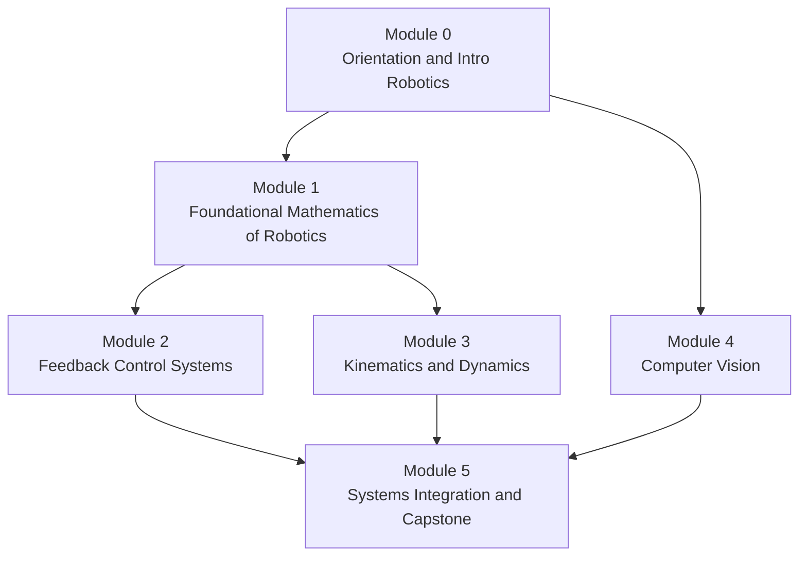

# SO-101 Robotics Curriculum

## Table of Contents

- [[#Overview|Overview]]
- [[#Module 0: Orientation and Intro Robotics|Module 0: Orientation and Intro Robotics]]
- [[#Module 1: Foundational Mathematics of Robotics|Module 1: Foundational Mathematics of Robotics]]
- [[#Module 2: Feedback Control Systems|Module 2: Feedback Control Systems]]
- [[#Module 3: Kinematics and Dynamics|Module 3: Kinematics and Dynamics]]
- [[#Module 4: Computer Vision|Module 4: Computer Vision]]
- [[#Module 5: Systems Integration and Capstone|Module 5: Systems Integration and Capstone]]
- [[#Deferred|Deferred]]
- [[#References|References]]

## Overview

🤖 This curriculum uses the physical [SO-101](https://huggingface.co/docs/lerobot/en/so101) arm as the hands-on companion for a self-study robotics track, modeled on [Carnegie Mellon's Bachelor of Science in Robotics](https://www.ri.cmu.edu/education/academic-programs/bachelor-of-science-in-robotics/) curriculum. General undergraduate math (calculus, linear algebra, discrete math, probability) and general CS (imperative programming, systems, algorithms) are assumed already known and are **not** re-taught here — see [[curricula/robotics/so101-arm-buildout|SO-101 Build & Vendor Comparison]] for the hardware acquisition decision (Hiwonder DIY kit) that this curriculum assumes is complete before Module 0 begins.

Each module maps to one or more CMU BSR courses, substituting the best freely-available public course materials found for each (CMU's own course sites are largely login-walled). Pacing below assumes roughly 5–8 hrs/week; treat it as a default scaffold, not a fixed calendar — compress or stretch modules freely.

> [!NOTE] Why the module order isn't a strict chain
> Module 4 (Computer Vision) has no hard dependency on Modules 1–3 and can run in parallel with them if you prefer — it's placed after Module 0 in the diagram for that reason. Modules 2 and 3 both depend on Module 1's rotation/transform machinery but not on each other, so their order is interchangeable.

## Module 0: Orientation and Intro Robotics

*(≈ 2 weeks — maps to CMU 16-180/16-280/16-281 General Robotics)*

**Concept goals:** systems-thinking overview of what a robot *is* — sensing, planning, actuation, feedback loops — and orientation to the toolchain before deep-diving into any one subfield.

**Materials:**
- [ ] **Modern Robotics** (Lynch & Park) — [free full PDF](http://hades.mech.northwestern.edu/images/7/7f/MR.pdf), read Ch. 1–2 (configuration space, degrees of freedom) as orientation
- [ ] CMU 16-281 [labs index](https://www.cs.cmu.edu/~16311/current/labs/labsindex.html) — since the SO-101 is a stationary manipulator, not a mobile robot, only a subset of the 10 labs is directly relevant. Do:
  - [ ] **Vision** lab
  - [ ] **Controls** lab
  - [ ] **Inverse Kinematics** lab
  - Skip as not applicable to a fixed-base arm: Rube Goldberg Machine, Line Following & Odometry, Path Planning, Localization, Remote Control (USAR), Wheel-Free locomotion — these are mobile-robotics-specific

**Milestone:** ✅ SO-101 fully assembled, wired, motor IDs configured, and calibrated (`lerobot-calibrate`) per the [[curricula/robotics/so101-arm-buildout|build doc]] — this *is* the hands-on deliverable for this module, since it exercises exactly the sense/act/feedback loop the module is about.

## Module 1: Foundational Mathematics of Robotics

*(≈ 2–3 weeks — maps to CMU 16-211)*

**Concept goals:** rigid-body motion representations — rotation matrices, homogeneous transforms, exponential coordinates (screw theory) — the coordinate-frame machinery every later module depends on.

**Materials:**
- [ ] **Modern Robotics** Ch. 3 (Rigid-Body Motions) — rotation matrices, angular velocities, exponential coordinates for rotation
- [ ] **Modern Robotics** Ch. 4 (Forward Kinematics) — product-of-exponentials formula, Denavit-Hartenberg convention
- [ ] Selected [16-811 lecture notes](https://www.cs.cmu.edu/~me/courses/811/notes/handouts.html) (Matt Mason, CMU) for supplementary rigor:
  - [ ] Solving Linear Equations
  - [ ] Differential Geometry (Frenet Frames and Surface Curvature)
  - [ ] Two-Dimensional Configuration Space

**Milestone:** derive the SO-101's own forward-kinematics chain by hand, frame-by-frame, using the joint/gear-ratio table already recorded in [[curricula/robotics/so101-arm-buildout|the build doc]] — six frames from base to gripper.

> [!QUESTION] Open question
> Modern Robotics uses the product-of-exponentials (PoE) convention throughout rather than classical Denavit-Hartenberg (DH) parameters. Worth deciding early whether to derive the SO-101's kinematics in PoE form (matches the textbook) or DH form (more common in older robotics literature and in some LeRobot internals) — may be worth doing both once, to see the correspondence.

## Module 2: Feedback Control Systems

*(≈ 3–4 weeks — maps to CMU 16-299)*

**Concept goals:** PID control, state-space representations, stability analysis, LQR — the theory underlying what the STS3215 servo firmware is already doing for you, made explicit.

**Materials:** full public course site at [cs.cmu.edu/~cga/controls-intro](http://www.cs.cmu.edu/~cga/controls-intro/)
- [ ] Textbook: **Feedback Systems** (Åström & Murray) — [free full PDF](https://fbswiki.org/wiki/index.php/Feedback_Systems:_An_Introduction_for_Scientists_and_Engineers)
- [ ] Lecture: Introduction and Intuition (the Math)
- [ ] Lecture: State-space methods (CGA Lecture 4)
- [ ] Lecture: State Estimation (CGA Lecture 6)
- [ ] Lecture: Frequency Domain (CGA Lecture 9)
- [ ] Lecture: Deriving Dynamics Equations
- [ ] Lecture: LQR & DDP
- [ ] Assignment 2 ([ass2.html](http://www.cs.cmu.edu/~cga/controls-intro/ass2.html)) and Assignment 3 (fitting a linear model to real robot data) — the course's own hardware is an Elegoo-based mobile robot, not the SO-101; treat these as worked exercises and re-derive the equivalent single-joint model for one SO-101 servo instead of replicating on the course's hardware

**Milestone:** write a simple position controller for one SO-101 joint from scratch (bypassing the servo's built-in position-control firmware, if the Feetech SDK exposes raw PWM/current control), and compare its step response against the servo's native controller.

## Module 3: Kinematics and Dynamics

*(≈ 3–4 weeks — maps to CMU 16-384)*

**Concept goals:** velocity kinematics (Jacobians), inverse kinematics, equations of motion (Lagrangian dynamics) — completing what Module 1 started.

**Materials:** continue in **Modern Robotics** ([free PDF](http://hades.mech.northwestern.edu/images/7/7f/MR.pdf))
- [ ] Ch. 5 (Velocity Kinematics and Statics) — space/body Jacobians, singularities
- [ ] Ch. 6 (Inverse Kinematics) — Newton-Raphson iterative IK
- [ ] Ch. 8 (Dynamics of Open Chains) — Lagrangian formulation, mass matrix, Coriolis terms
- [ ] Companion exercises/videos at modernrobotics.org

**Milestone:** implement forward and inverse kinematics for the SO-101 in code (Python), validate against the physical arm by commanding a target end-effector pose and checking the achieved pose; derive the Jacobian and identify the arm's singular configurations.

> [!NOTE] Forward pointer to Module 5
> §2 of the ["Robot Learning: A Tutorial"](https://arxiv.org/abs/2510.12403) paper used in Module 5 recaps classical robotics — explicit/implicit models, feedback loops, limitations of dynamics-based control — as a bridge into why learning-based methods (RL, imitation learning) emerged. Short enough to be worth reading now as a preview, immediately after this module's kinematics work, rather than waiting until Module 5.

## Module 4: Computer Vision

*(≈ 6–8 weeks — maps to CMU 16-385, the heaviest module)*

**Concept goals:** classical geometric vision (filtering, features, camera models, homographies) through learned vision (CNNs) — the perception stack that imitation-learning policies consume.

**Materials:** full public course site at [16385.courses.cs.cmu.edu/spring2026](http://16385.courses.cs.cmu.edu/spring2026/) (27 lectures, [full topic list with readings](http://16385.courses.cs.cmu.edu/spring2026/lectures))
- [ ] Textbook: **Computer Vision: Algorithms and Applications** (Szeliski) — [free PDF](https://szeliski.org/Book/download.php)
- [ ] Core lectures: Image Filtering, Image Pyramids/Frequency Domain, Hough Transform, Feature Detectors/Descriptors, 2D Transformations, Image Homographies, Geometric Camera Models, Neural Networks, Convolutional Neural Networks
- [ ] Deep-dive (valuable but skippable under time pressure): Two-View Geometry, Stereo, Radiometry/Reflectance, Photometric Stereo, Digital Photography pipeline
- [ ] Assignments (all [publicly downloadable](http://16385.courses.cs.cmu.edu/spring2026/assignments)):
  - [ ] [Assignment 0: Intro to Python](https://16385.courses.cs.cmu.edu/spring2026/assets/assignments/assgn0.pdf)
  - [ ] [Assignment 1: Image Filtering and Hough Transform](https://16385.courses.cs.cmu.edu/spring2026/assets/assignments/assgn1.zip)
  - [ ] [Assignment 2: AR with Planar Homographies](https://16385.courses.cs.cmu.edu/spring2026/assets/assignments/assgn2.zip)
  - [ ] [Assignment 5: Neural Networks for Recognition](https://16385.courses.cs.cmu.edu/spring2026/assets/assignments/assgn5.zip) — most directly relevant to the learned-vision backbones LeRobot policies use
  - [ ] Optional: [Assignment 3 (3D Reconstruction)](https://16385.courses.cs.cmu.edu/spring2026/assets/assignments/assgn3.zip), [Assignment 4 (Bag-of-Words Scene Recognition)](https://16385.courses.cs.cmu.edu/spring2026/assets/assignments/assgn4.zip), [Assignment 6 (Video Tracking)](https://16385.courses.cs.cmu.edu/spring2026/assets/assignments/assgn6.zip)

**Milestone:** calibrate the SO-101's workspace camera(s), and implement one classical-vision task (e.g. homography-based workspace alignment) plus one learned-vision task (e.g. a small object-detection or classification model) against real footage from the arm's own camera.

## Module 5: Systems Integration and Capstone

*(≈ 4–6 weeks — maps to CMU 16-450/16-474; no public CMU materials exist for these, since they're process/project courses)*

**Concept goals:** everything from Modules 0–4 integrated into one working pipeline: hardware, control, kinematics, and perception feeding a learned policy.

**Materials:** primary anchor is **[Capuano, Pascal, Zouitine, Wolf & Aractingi — "Robot Learning: A Tutorial"](https://arxiv.org/abs/2510.12403)** (Oxford/Hugging Face, Oct 2025) — this replaces a vaguer earlier pointer to "LeRobot docs + source code." It's written by the LeRobot core team specifically as a guide from classical robotics through RL/behavioral cloning to generalist VLA policies, with runnable code examples in `lerobot` throughout, and several code snippets load actual public SO-101 datasets (e.g. `lerobot/svla_so101_pickplace`) directly — this is about as close to purpose-built for this curriculum as an external source gets. Work through it in this order:
- [ ] §1 — `LeRobotDataset` format and the streaming/batching API (code examples included) — do this first regardless of RL vs. BC focus, since every later section depends on it
- [ ] §2 — Classical Robotics (explicit/implicit models, planar manipulation, feedback loops, limitations of dynamics-based robotics) — a compact bridge chapter connecting back to Modules 1 and 3; worth reading even though it covers ground already built there
- [ ] §3 — Robot Reinforcement Learning (RL primer, real-world RL for robotics with code, limitations: simulators and reward design)
- [ ] §4 — Robot Imitation Learning: generative models primer (VAEs, diffusion models, flow matching) → **Action Chunking Transformers (ACT)** with training code → **Diffusion Policy** with training code → optimized/async inference
- [ ] §5 — Generalist Robot Policies: VLAs, VLMs-for-VLAs, **π0** with code, **SmolVLA** with code
- [ ] [Getting started with real-world robots](https://huggingface.co/docs/lerobot/il_robots) tutorial (LeRobot docs) — teleoperation and dataset-recording mechanics not covered by the tutorial's conceptual focus

**Milestones (the actual capstone):**
- [ ] Collect a demonstration dataset via leader-follower teleoperation for one manipulation task, using `LeRobotDataset`
- [ ] Train a policy (ACT or Diffusion Policy, §4) on the collected dataset using LeRobot
- [ ] Evaluate the trained policy on the physical follower arm and characterize failure modes
- [ ] *(Stretch)* Fine-tune or evaluate SmolVLA (§5) on the same task/dataset for comparison — or, before collecting your own data at all, load the public `lerobot/svla_so101_pickplace` dataset referenced in the tutorial's own code examples as a first no-hardware-risk trial run of the training pipeline

## Deferred

> [!WARNING] 16-220 Robot Building Practices — deferred
> CMU's hands-on hardware course (CAD, 3D printing, laser cutting, circuit design, PCB layout, soldering, motor controllers) is intentionally left out of this curriculum for now. No public CMU course site was found, and the two MIT OCW substitutes investigated (2.017J Design of Electromechanical Robotic Systems, 2.737 Mechatronics) only partially cover the material — mainly the electronics/motor-control side, not CAD/fabrication. Since the SO-101 is being built from a pre-printed unassembled kit rather than designed and printed from scratch, the CAD/fabrication gap isn't exercised by the build either. Revisit if a future project calls for designing custom parts (e.g. a custom end-effector).

## References

| Reference Name | Brief Summary | Link to Reference |
|---|---|---|
| CMU Bachelor of Science in Robotics — Curriculum | Source curriculum this self-study path is modeled on | [ri.cmu.edu](https://www.ri.cmu.edu/education/academic-programs/bachelor-of-science-in-robotics/), [full course catalog](http://coursecatalog.web.cmu.edu/schools-colleges/schoolofcomputerscience/robotics/) |
| Modern Robotics (Lynch & Park) | Free textbook covering rigid-body motion, forward/inverse kinematics, Jacobians, and dynamics — anchor text for Modules 1 and 3 | [Free PDF](http://hades.mech.northwestern.edu/images/7/7f/MR.pdf), [modernrobotics.org](http://modernrobotics.org) |
| 16-811 Math Fundamentals for Robotics (Matt Mason, CMU) | Grad-level lecture notes on math foundations for robotics, supplementary to Module 1 | [cs.cmu.edu/~me/courses/811](https://www.cs.cmu.edu/~me/courses/811/mathfund.html) |
| 16-281 General Robotics (CMU) | Public labs/homework index used for Module 0 | [cs.cmu.edu/~16311/current](https://www.cs.cmu.edu/~16311/current) |
| 16-299 Introduction to Feedback Control Systems (CMU) | Full public course site, anchor for Module 2 | [cs.cmu.edu/~cga/controls-intro](http://www.cs.cmu.edu/~cga/controls-intro/) |
| Feedback Systems (Åström & Murray) | Free textbook for Module 2 | [Free PDF](https://fbswiki.org/wiki/index.php/Feedback_Systems:_An_Introduction_for_Scientists_and_Engineers) |
| 16-385 Computer Vision (CMU) | Full public course site with 27 lectures and 7 assignments, anchor for Module 4 | [16385.courses.cs.cmu.edu](http://16385.courses.cs.cmu.edu/spring2026/) |
| Computer Vision: Algorithms and Applications (Szeliski) | Free textbook for Module 4 | [szeliski.org/Book](https://szeliski.org/Book/download.php) |
| Robot Learning: A Tutorial (Capuano, Pascal, Zouitine, Wolf, Aractingi — Oxford/Hugging Face, 2025) | Primary anchor for Module 5 — classical robotics bridge, RL, imitation learning (ACT, Diffusion Policy), generalist VLA policies (π0, SmolVLA), all with runnable `lerobot` code examples using real SO-101 datasets | [arXiv:2510.12403](https://arxiv.org/abs/2510.12403) |
| LeRobot documentation (Hugging Face) | Secondary source for Module 5 — teleoperation and dataset-recording mechanics | [huggingface.co/docs/lerobot](https://huggingface.co/docs/lerobot/en/index) |
| 2.017J Design of Electromechanical Robotic Systems (MIT OCW) | Investigated as a 16-220 substitute; deferred, see [[#Deferred]] | [ocw.mit.edu](https://ocw.mit.edu/courses/2-017j-design-of-electromechanical-robotic-systems-fall-2009/) |
