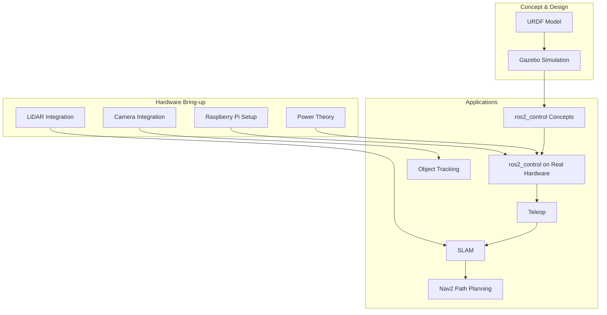

# Stage 2 Mobile Robot: Build vs. Buy, and a ROS2 Learning Path

## Sources

| Source | Type | Key Contribution | Link |
|--------|------|-------------------|------|
| Articulated Robotics — "Build a Mobile Robot with ROS" series (Josh Newans) | tutorial series | Primary anchor — full free build guide from URDF/simulation through real hardware to SLAM/Nav2 | [articulatedrobotics.xyz/tutorials](https://articulatedrobotics.xyz/tutorials/) |
| `articubot_one` (GitHub template repo, Josh Newans) | repo | Companion ROS2 package template for the tutorial series (URDF, launch files, config) | [github.com/joshnewans/articubot_one](https://github.com/joshnewans/articubot_one) |
| RPLIDAR A1 (SLAMTEC) product page | vendor listing | LiDAR spec and pricing cross-check | [slamtec.com/en/lidar/a1](https://www.slamtec.com/en/lidar/a1), [Adafruit listing](https://www.adafruit.com/product/4010) |
| TurtleBot 4 (Clearpath Robotics / Open Robotics) | vendor listing | Official ROS2 reference platform, considered and ruled out on cost/learning-value grounds | [clearpathrobotics.com/turtlebot-4](https://clearpathrobotics.com/turtlebot-4/) |
| TurtleBot 3 (ROBOTIS) | vendor listing | Older official platform, considered and ruled out — pricier than expected and lower learning value than full DIY | [robotis.us](https://www.robotis.us/turtlebot-3-waffle-pi-rpi4-4gb-us/) |
| Nav2 documentation — "Navigating with a Physical TurtleBot 3" | doc | Cross-check for what a from-scratch Nav2 bring-up needs to replicate | [docs.nav2.org](https://docs.nav2.org/tutorials/docs/navigation2_on_real_turtlebot3.html) |

## Context and Motivation

Stage 2 of the [[curricula/robotics/curriculum|staged robotics-to-flight progression]] needs a mobile platform to teach odometry, SLAM, path planning, sensor fusion, and ROS2 — none of which the [[curricula/robotics/curriculum|SO-101 manipulator]] (Stage 1) or the [[curricula/robotics/mobile-robotics|XRP warm-up]] exercise. [[curricula/robotics/mobile-robotics|mobile-robotics.md]] scaffolded two directions: LeKiwi (stay inside the LeRobot ecosystem) or a "generic ROS2 differential-drive rover." This doc resolves the second direction into a concrete decision, following the same hands-on-learning-first reasoning that decided the SO-101 build (Path C there: assemble and configure everything by hand rather than buy pre-built, since the mechanical/wiring/configuration work *is* the point).

## Platform Comparison

| Path | What you do yourself | Est. cost | Learning captured |
|---|---|---|---|
| **TurtleBot 4 Lite** (official, Clearpath/Open Robotics) | Unbox an iRobot Create3 base + Raspberry Pi 4 + RPLiDAR, mostly pre-integrated | **$1,195** | Nav2/SLAM software only — the hardware-integration and `ros2_control` layer is done for you |
| **TurtleBot 3** (Burger/Waffle Pi, ROBOTIS, official) | Assemble Dynamixel-servo kit + OpenCR board + Raspberry Pi | **$900–$1,900** (surprisingly high current pricing/scarcity) | Real assembly, but still a closed, purpose-built kit — no chassis/motor-selection decisions to make |
| **DIY — Articulated Robotics build** (Josh Newans tutorial series) | Source commodity parts yourself (Pi, motors, LiDAR, camera, driver board, chassis), wire and configure everything, write/adapt the URDF and `ros2_control` hardware interface | **~$275–350** | Everything: mechanical design, motor/encoder wiring, `ros2_control` hardware interface from scratch, plus the SLAM/Nav2 software layer — closest analog to the SO-101's Path C |
| Commercial cheap kits (Yahboom, MentorPi, etc.) | Unbox a pre-integrated Pi 5 + LiDAR + camera car | ~$300–600 | Software-layer only; hardware-integration claims from Chinese vendors are unverified — same red-flag pattern the SO-101 research hit with Hiwonder |

**Decision: DIY, following the Articulated Robotics series.** Same rationale as the SO-101 build — the dominant learning value in this stage is in **motor/encoder wiring, writing the `ros2_control` hardware interface, and configuring SLAM/Nav2 against real, self-integrated hardware**, not in unboxing a pre-validated platform. TurtleBot 3/4 remove exactly the hardware-integration work that makes this stage worth doing on new hardware rather than just reusing LeKiwi. The commercial cheap-kit tier is excluded for the same unverified-claims reason Hiwonder was demoted in the SO-101 research — worth revisiting only if a specific listing's documentation and BOM can be independently confirmed.

> [!NOTE] Why not TurtleBot 3/4 despite their official status
> Their documentation is genuinely excellent and they're literally the robots used in Nav2's own tutorials — that's real value if the goal were purely to learn Nav2/SLAM *software* as fast as possible. But this curriculum's Stage 1 already established that hands-on integration work is the priority over speed, and TurtleBot's price ($900–$1,900) buys convenience this curriculum doesn't want to buy.

## Bill of Materials (DIY path)

Per the Articulated Robotics hardware pages, cross-checked against current vendor listings where noted:

| Component | Est. price | Notes |
|---|---|---|
| Raspberry Pi 4B (4GB) or 5 | ~$89 | Street price has drifted well above the original $55 MSRP; verify current stock/price before ordering — same volatility the SO-101 research hit with Pi-adjacent and servo pricing |
| RPLIDAR A1 (SLAMTEC) | **$99.95** (verified in stock, [Adafruit](https://www.adafruit.com/product/4010)) | "One of the cheapest 2D lidars on the market" per the tutorial; other listings quoted $180–220, so shop around |
| Arduino Nano (or clone) | ~$15–25 | Handles motor-speed control, bridges to the Pi over serial |
| 2× brushed DC gearmotors with encoders | ~$15–25 | Tutorial explicitly picks brushed-with-encoders for cost, not brushless |
| L298N motor driver board | ~$6–10 | Standard dual H-bridge driver |
| Raspberry Pi Camera v2 | ~$25–30 | For the object-tracking application module |
| 3S LiPo battery (~12V) + charger | ~$25–35 | Powers motors; Pi typically powered separately or via a regulated tap |
| Chassis + mounting hardware | ~$20–30 | The tutorial literally uses a plastic storage container — a purpose-built small robot chassis kit is a safer default absent a fabrication habit already established |

**Total estimate: ~$275–350** — roughly a quarter of TurtleBot 4's price and a third of TurtleBot 3's, for materially more hands-on integration work.

> [!WARNING] No fixed vendor BOM
> Unlike the SO-101 research (where a single vendor's exact kit was pinned down), this path is deliberately open-BOM — the tutorial's whole premise is sourcing your own parts. Before ordering, re-verify current prices/stock on each line item; the figures above are a planning estimate, not a locked shopping list the way the SO-101 vendor table was.

## Curriculum Mapping

The tutorial series (per its site's own category structure) maps directly onto this stage's [[curricula/robotics/mobile-robotics#Scope|Scope]]:

| Scope topic | Covered by |
|---|---|
| Odometry | Wheel encoders wired through the `ros2_control` hardware interface (Hardware Bring-up + `ros2_control` episodes) |
| Localization and mapping (SLAM) | Dedicated SLAM episode, using `slam_toolbox` against the RPLiDAR A1 |
| Path planning and obstacle avoidance | Dedicated Nav2 episode |
| Sensor fusion | LiDAR + camera integration episodes; IMU fusion not covered by this series specifically — likely needs supplementing when reached |
| ROS2 middleware | The entire series is ROS2-native (Jazzy on Ubuntu 24.04 at time of research) — no separate middleware module needed, unlike LeKiwi where this would have to be layered on top |

This resolves the `mobile-robotics.md` Planned Modules section directly — see that doc for the module breakdown using this structure.

## Open Questions

- No IMU fusion step was found in the series' own episode list — confirm whether a later/updated episode covers it, or whether this needs a supplementary source once Stage 2 reaches sensor fusion.
- Re-verify Raspberry Pi 4/5 and RPLiDAR A1 pricing/stock immediately before ordering — both showed meaningful price spread across vendors during this research pass.
- The tutorial's own chassis (a plastic storage container) is a valid zero-cost option; decide before ordering whether to replicate that literally or buy a small chassis kit instead (added cost, less about-the-container-specifically fabrication skill, easier mounting).
- Confirm current ROS2 distro used by the tutorial series at the time this stage actually starts — Jazzy was current as of this research pass, but the series may track newer LTS releases by the time hardware is ordered.
