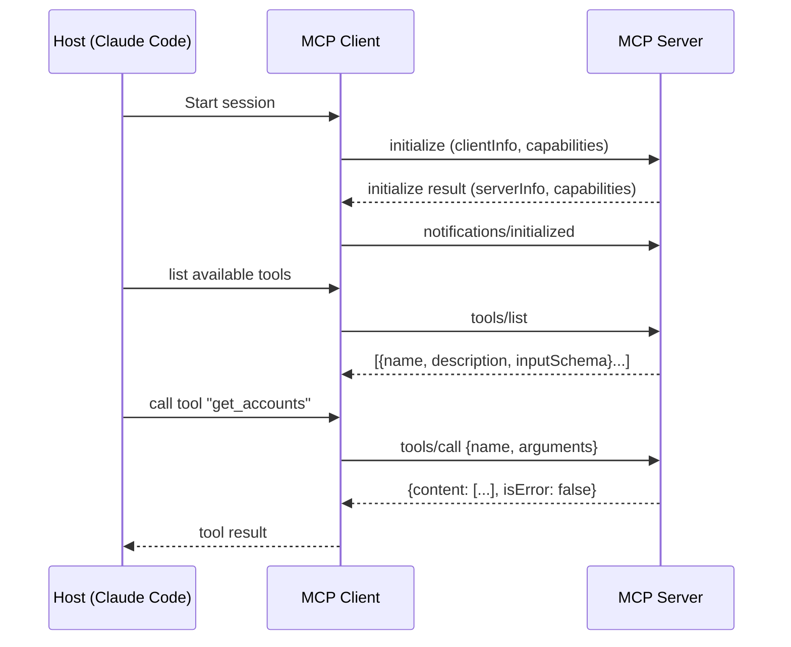
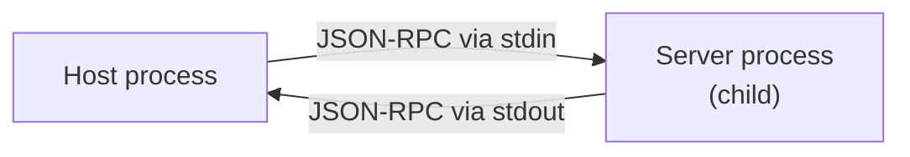
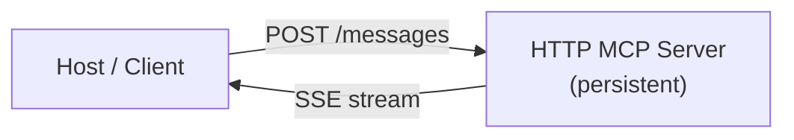
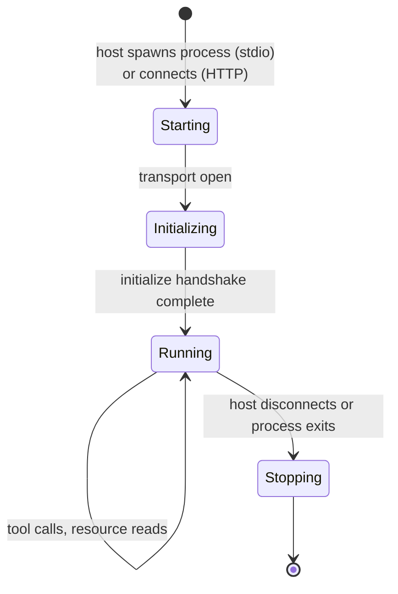

# 🔌 Model Context Protocol (MCP)

## Table of Contents

- [[#Overview|Overview]]
- [[#Architecture|Architecture]]
  - [[#Roles host, client, server|Roles: host, client, server]]
  - [[#Message flow|Message flow]]
- [[#Transport Layer|Transport Layer]]
  - [[#stdio|stdio]]
  - [[#HTTP SSE|HTTP + SSE]]
  - [[#Streamable HTTP|Streamable HTTP]]
- [[#JSON-RPC Protocol|JSON-RPC Protocol]]
  - [[#Capability negotiation|Capability negotiation]]
  - [[#Tool definition schema|Tool definition schema]]
  - [[#Tool invocation|Tool invocation]]
- [[#Lifecycle|Lifecycle]]
- [[#Local Configuration Claude Code|Local Configuration (Claude Code)]]
- [[#Python Environment Considerations|Python Environment Considerations]]
- [[#References|References]]

---

## 🗺️ Overview

*Model Context Protocol (MCP)* is an open standard (Anthropic, 2024) for attaching external tools and data sources to LLM-based agents. It decouples the AI *host* from the tool implementation: any compliant server can be dropped in and the host discovers capabilities at runtime, without any host-side code changes.

The protocol is layered:

| Layer | Technology | Role |
|-------|-----------|------|
| Application | MCP message types | Tool definitions, invocations, resource reads |
| RPC | JSON-RPC 2.0 | Request/response framing, error codes |
| Transport | stdio / HTTP+SSE / Streamable HTTP | Byte delivery |

> [!INFO] Why not just function calling?
> OpenAI-style function calling is host-specific — the schema is defined by the model provider and the tool code lives inside the application. MCP externalizes both: tool schema and implementation live in the server process, decoupled from host and model. This enables reuse across hosts (Claude Code, Cursor, custom agents) without code duplication.

---

## 🏗️ Architecture

### Roles: host, client, server

**Definition (MCP Roles).**

- **Host** — the application that runs the LLM and decides when to invoke tools (e.g., Claude Code, a custom agent).
- **Client** — a protocol-level connection object embedded in the host; manages one server connection.
- **Server** — an independent process or service that exposes tools, resources, and prompts.

A host may manage multiple clients, each connected to a different server.

### Message flow



---

## 🚦 Transport Layer

The transport layer is responsible only for byte delivery — MCP semantics are independent of it.

### stdio

The server runs as a **child process** of the host. JSON-RPC messages are written to the server's stdin and read from its stdout, newline-delimited.



**Properties:**
- Host spawns and owns the server lifecycle
- Zero networking — works fully offline
- Single client per server instance (no sharing)
- *Best for:* local developer tools, CLI integrations

### HTTP + SSE

The server runs as a standalone HTTP service. The host POSTs requests; responses stream back via *Server-Sent Events*.



**Properties:**
- Server lifecycle is independent of any client
- Multiple hosts can share one server
- Can run remotely (non-localhost)
- *Best for:* shared infrastructure, stateful servers, high startup-cost servers

### Streamable HTTP

The newer standard (MCP spec 2025-03-26), replacing SSE. Uses a single `/mcp` endpoint; responses are either plain JSON (non-streaming) or an SSE stream depending on content negotiation. Simplifies reverse-proxy compatibility.

> [!NOTE] Adoption
> As of mid-2025, most SDK implementations support all three transports. stdio remains dominant for local tooling; Streamable HTTP is the preferred choice for new remote deployments.

---

## 📐 JSON-RPC Protocol

MCP uses [JSON-RPC 2.0](https://www.jsonrpc.org/specification) as its RPC layer. Every message is either a *request* (has `id`), a *response* (has matching `id`), or a *notification* (no `id`, no response expected).

### Capability negotiation

On connection, client and server exchange `initialize` messages declaring supported capability sets:

```json
// Client → Server
{
  "jsonrpc": "2.0",
  "id": 1,
  "method": "initialize",
  "params": {
    "protocolVersion": "2024-11-05",
    "clientInfo": { "name": "claude-code", "version": "1.0" },
    "capabilities": { "roots": {}, "sampling": {} }
  }
}

// Server → Client
{
  "jsonrpc": "2.0",
  "id": 1,
  "result": {
    "protocolVersion": "2024-11-05",
    "serverInfo": { "name": "monarch-mcp-server", "version": "0.1.0" },
    "capabilities": { "tools": {} }
  }
}
```

### Tool definition schema

Servers expose tools via `tools/list`. Each tool carries a [JSON Schema](https://json-schema.org/) for its `inputSchema`:

```json
{
  "name": "get_accounts",
  "description": "List all Monarch Money accounts with current balances.",
  "inputSchema": {
    "type": "object",
    "properties": {
      "include_closed": {
        "type": "boolean",
        "description": "Whether to include closed accounts.",
        "default": false
      }
    },
    "required": []
  }
}
```

The host feeds this schema directly to the LLM as part of its tool-use context — the model reasons over the schema to decide when and how to call the tool.

### Tool invocation

```json
// Host → Server: call
{
  "jsonrpc": "2.0",
  "id": 42,
  "method": "tools/call",
  "params": {
    "name": "get_accounts",
    "arguments": { "include_closed": false }
  }
}

// Server → Host: result
{
  "jsonrpc": "2.0",
  "id": 42,
  "result": {
    "content": [
      { "type": "text", "text": "[{\"name\": \"Checking\", \"balance\": 4210.50}, ...]" }
    ],
    "isError": false
  }
}
```

> [!WARNING] Error handling
> Tool errors should set `isError: true` in the result (not use JSON-RPC error codes). JSON-RPC-level errors are reserved for protocol/transport failures (malformed request, unknown method). Conflating the two causes hosts to mishandle domain errors.

---

## ♻️ Lifecycle



For stdio servers, the server process exits when the host closes stdin (or the host process dies). The host is responsible for restarting on crash if desired.

---

## ⚙️ Local Configuration (Claude Code)

MCP servers are declared in `~/.claude/settings.json` (global) or `.claude/settings.json` (project-local):

```json
{
  "mcpServers": {
    "monarch": {
      "command": "python",
      "args": ["-m", "monarch_mcp_server"],
      "env": {
        "MONARCH_TOKEN": "your-api-token"
      }
    }
  }
}
```

Claude Code reads this at startup and spawns the process automatically — no manual `python server.py` required.

| Field | Description |
|-------|------------|
| `command` | Executable to run (Python interpreter path, `uvx`, `node`, etc.) |
| `args` | Arguments passed to the command |
  | `env` | Environment variables injected into the server process |

> [!TIP] Use `uvx` for zero-setup Python servers
> If the server is published to PyPI, `"command": "uvx"` with `"args": ["monarch-mcp-server"]` lets `uv` resolve and run it in an isolated environment without a manual `pip install`.

---

## 🐍 Python Environment Considerations

Since Python resolves imports from the interpreter's environment, the `command` must point to the interpreter that has the server's dependencies installed:

| Scenario | `command` value |
|----------|----------------|
| Global install | `"python3"` |
| virtualenv | `"/path/to/venv/bin/python"` |
| conda env | `"/opt/anaconda3/envs/myenv/bin/python"` |
| `uv`-managed | `"uvx"` (handles deps automatically) |

*Importantly,* each MCP server runs in its own process — dependency conflicts between servers are impossible, since each server uses whichever interpreter is configured for it.

---

## 📚 References

| Reference | Brief Summary | Link |
|-----------|--------------|------|
| MCP Specification (Anthropic, 2024) | Canonical protocol spec: message types, transport, lifecycle | [modelcontextprotocol.io/specification](https://modelcontextprotocol.io/specification) |
| JSON-RPC 2.0 Specification | The underlying RPC framing standard MCP builds on | [jsonrpc.org/specification](https://www.jsonrpc.org/specification) |
| MCP Python SDK | Official Python library for building MCP servers and clients | [github.com/modelcontextprotocol/python-sdk](https://github.com/modelcontextprotocol/python-sdk) |
| monarch-mcp-server | Community MCP server for Monarch Money personal finance | [github.com/robcerda/monarch-mcp-server](https://github.com/robcerda/monarch-mcp-server) |
| Claude Code MCP Docs | How to configure MCP servers in Claude Code settings | [docs.anthropic.com/en/docs/claude-code/mcp](https://docs.anthropic.com/en/docs/claude-code/mcp) |
