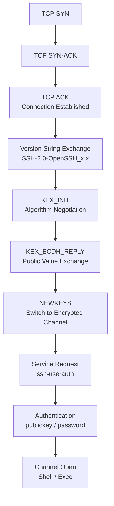

# SSH Daemon, Key Exchange, and Connection Diagnostics

## Table of Contents

- [[#🔌 The SSH Daemon|🔌 The SSH Daemon]]
- [[#🔐 Key Exchange (KEX)|🔐 Key Exchange (KEX)]]
  - [[#Diffie-Hellman Key Exchange|Diffie-Hellman Key Exchange]]
  - [[#ECDH — Elliptic Curve Variant|ECDH — Elliptic Curve Variant]]
- [[#🩺 Connection Diagnostics — Reading the Handshake|🩺 Connection Diagnostics — Reading the Handshake]]
  - [[#The SSH Handshake as a State Machine|The SSH Handshake as a State Machine]]
  - [[#Where Failures Occur and What They Mean|Where Failures Occur and What They Mean]]
- [[#⚙️ MaxStartups and Session Slot Exhaustion|⚙️ MaxStartups and Session Slot Exhaustion]]
- [[#🛠️ Prevention — Keepalives and Timeouts|🛠️ Prevention — Keepalives and Timeouts]]
- [[#🔀 Out-of-Band Access|🔀 Out-of-Band Access]]
- [[#📚 References|📚 References]]

---

## 🔌 The SSH Daemon

A *daemon* is a long-running background process that starts at boot, has no controlling terminal, and waits for work to arrive. The naming convention (trailing `d`) is a Unix tradition: `sshd`, `httpd`, `crond`. Daemons are distinct from user-initiated processes in that they persist indefinitely and are owned by the init system (e.g. `systemd` on Linux).

`sshd` is the **server-side SSH daemon**. It:

1. Binds to port 22 (TCP) and calls `listen()`
2. On each incoming connection, calls `accept()` to get a socket file descriptor
3. Negotiates encryption and authenticates the user
4. Forks a child process that execs the user's shell

The *client* (`ssh user@host`) is a short-lived process you invoke; `sshd` is always-on. They are entirely separate programs — the daemon handles all cryptographic and auth state on the server side.

> [!INFO] Why port 22?
> Port 22 was assigned to SSH by IANA when Tatu Ylönen designed the protocol in 1995. It was chosen partly because ports 21 (FTP) and 23 (Telnet) were already taken, and 22 was conveniently between them.

---

## 🔐 Key Exchange (KEX)

Once TCP connects, both sides need a *shared secret key* for symmetric encryption — but they've never communicated before and cannot yet trust the channel. *Key exchange* solves this: two parties derive an identical secret without ever transmitting it, even over a fully observed network.

### Diffie-Hellman Key Exchange

The classical construction (RFC 4253 for SSH) uses modular arithmetic. Fix a large prime $p$ and a generator $g$ (both public). Each side draws a private random scalar:

$$a \xleftarrow{R} \mathbb{Z}_p^*, \quad b \xleftarrow{R} \mathbb{Z}_p^*$$

and exchanges *public values*:

$$A = g^a \bmod p, \quad B = g^b \bmod p$$

Each side then computes the shared secret:

$$K = B^a \bmod p = A^b \bmod p = g^{ab} \bmod p$$

Security rests on the *discrete logarithm problem*: given $g, p, A$, recovering $a$ is believed to require $O(\exp(\sqrt[3]{\log p}))$ time (index calculus), which is infeasible for $p \approx 2^{2048}$.

> [!WARNING] Static DH vs. Ephemeral DH
> Static DH reuses key material across sessions, breaking *forward secrecy* — if the server's private key is later compromised, all past sessions can be decrypted. Modern SSH uses **ephemeral DH** (EDH/DHE): fresh scalars are drawn per session, so past sessions remain secure even if long-term keys leak.

### ECDH — Elliptic Curve Variant

Modern SSH defaults to *Curve25519* (RFC 8731), an elliptic curve defined over $\mathbb{F}_{2^{255}-19}$:

$$E: y^2 = x^3 + 486662 x^2 + x \pmod{2^{255}-19}$$

Points on $E$ form an abelian group under the chord-and-tangent law. The private key is a scalar $a \in \mathbb{Z}_n$ (where $n = |E(\mathbb{F}_p)|$), and the public key is the group point $A = a \cdot G$ (scalar multiplication). The shared secret is:

$$K = a \cdot B = b \cdot A = (ab) \cdot G$$

Security rests on the *elliptic curve discrete logarithm problem* (ECDLP), which has no known subexponential algorithm on generic curves. Curve25519 achieves ~128-bit security with only 32-byte keys — far more efficient than 2048-bit classical DH.

> [!NOTE] Why "25519"?
> The prime $2^{255} - 19$ is the largest prime below $2^{255}$. The name Curve25519 encodes both the field size and the near-power-of-two structure that enables fast arithmetic via Montgomery reduction.

---

## 🩺 Connection Diagnostics — Reading the Handshake

### The SSH Handshake as a State Machine



Each arrow is a distinct protocol state. Failures at different nodes have different root causes.

### Where Failures Occur and What They Mean

| Stage | Error Observed | Likely Cause |
|---|---|---|
| TCP SYN | Connection refused / timeout | Port 22 not open; firewall; host down |
| Version string | `kex_exchange_identification: Connection reset` | `sshd` accepted socket but immediately closed it (daemon state, `MaxStartups`) |
| KEX_INIT | `no matching key exchange method` | Algorithm mismatch between client and server |
| Authentication | `Permission denied (publickey)` | Wrong key, `authorized_keys` misconfigured |
| Channel Open | Hangs silently | `sshd` child process stuck; pty allocation failure |

**The diagnostic used here:** `ssh -v` shows the last successful stage. The output was:

```
debug1: Connection established.         ← TCP ✓
kex_exchange_identification: Connection reset by peer  ← failed at version string
```

TCP connected but `sshd` reset before sending its version banner. This rules out network issues entirely — the failure is inside the daemon, not on the wire.

> [!EXAMPLE]- Full verbose output from the failing session
> ```
> debug1: OpenSSH_10.2p1, LibreSSL 3.3.6
> debug1: Reading configuration data /Users/calvinwoo/.ssh/config
> debug1: /Users/calvinwoo/.ssh/config line 1: Applying options for pylon
> debug1: Connecting to pylon [100.64.92.46] port 22.
> debug1: Connection established.
> kex_exchange_identification: read: Connection reset by peer
> Connection reset by 100.64.92.46 port 22
> ```
> `100.64.92.46` is a Tailscale CGNAT address (100.64.0.0/10 range, RFC 6598). The host was reachable (`ping` succeeded, `nc -zv pylon 22` succeeded) but `sshd` dropped the connection immediately after TCP accept.

---

## ⚙️ MaxStartups and Session Slot Exhaustion

`sshd` tracks connections that are mid-handshake (accepted TCP socket, but not yet authenticated). The `MaxStartups` directive controls how many such *unauthenticated* connections it will tolerate:

```
MaxStartups start:rate:full
```

- **start** — allow this many simultaneous unauthenticated connections freely
- **rate** — once `start` is exceeded, randomly drop new connections with probability `rate/100`
- **full** — refuse all new connections above this count

Default: `MaxStartups 10:30:100`. Interpretation:

$$P(\text{drop new connection}) = \begin{cases} 0 & \text{if } n \leq 10 \\ 0.30 \cdot \frac{n - 10}{90} & \text{if } 10 < n \leq 100 \\ 1 & \text{if } n > 100 \end{cases}$$

A **frozen session** occupies one of these slots indefinitely. If the OS TCP stack still considers the socket half-open (common when a connection freezes rather than cleanly closes), `sshd` counts it toward `MaxStartups`. With only a few frozen sessions, you can hit the probabilistic drop threshold — explaining why subsequent connections are reset at the identification stage.

> [!DANGER] Frozen ≠ Closed
> The OS marks a connection as closed only after a FIN/RST exchange or a timeout (`tcp_keepalive_time`, default 2 hours on Linux). A session that *appears* frozen to the user may still be ESTABLISHED from the kernel's perspective. This is why frozen sessions can block new logins — the daemon and kernel disagree about whether the connection is live.

---

## 🛠️ Prevention — Keepalives and Timeouts

Add to `~/.ssh/config` for the affected host:

```
Host pylon
  HostName pylon
  User calvinwoo
  ServerAliveInterval 30
  ServerAliveCountMax 3
```

`ServerAliveInterval 30` causes the SSH client to send a keepalive probe every 30 seconds of silence. `ServerAliveCountMax 3` means after 3 missed probes (90 seconds total), the client terminates the connection cleanly — freeing the `MaxStartups` slot and avoiding the frozen-session trap.

> [!TIP] Escaping a frozen SSH session without closing the terminal
> SSH has a built-in escape character sequence: type `~.` (tilde then period) on a new line. This sends an escape sequence the *client* interprets — it terminates the connection locally without needing the server to respond. Other useful sequences: `~C` opens a command line, `~#` lists forwarded connections, `~?` lists all escape sequences.

---

## 🔀 Out-of-Band Access

*Out-of-band* means accessing a system through a different channel than the one that's broken.

If SSH is the broken channel, any fix that also relies on SSH is useless — you need an independent path in. Options that don't depend on `sshd`:

| Method | How it works | Dependency |
|---|---|---|
| Physical console | Keyboard + monitor directly on the machine | None — bypasses all networking |
| Tailscale SSH | SSH implementation inside the Tailscale daemon | Tailscale network reachability, not `sshd` |
| IPMI / iDRAC / iLO | Dedicated management controller on server hardware | Separate management NIC + power |
| Cloud serial console | Browser-based console via AWS/GCP/Azure control plane | Cloud provider API, not VM networking |

> [!INFO] Origin of the term
> *In-band* signaling uses the same channel as the data it controls — e.g. DTMF tones on a phone call travel over the voice channel. *Out-of-band* signaling uses a separate, independent channel. The term migrated from telecom into systems administration to mean any recovery path that doesn't depend on the primary (broken) channel.

---

## 📚 References

| Reference Name | Brief Summary | Link |
|---|---|---|
| RFC 4253 — The Secure Shell Transport Layer Protocol | Defines the SSH handshake, KEX, and encryption negotiation | [RFC 4253](https://www.rfc-editor.org/rfc/rfc4253) |
| RFC 8731 — Secure Shell Key Exchange Using Curve25519 | Specifies Curve25519/X25519 for SSH KEX | [RFC 8731](https://www.rfc-editor.org/rfc/rfc8731) |
| D.J. Bernstein — Curve25519: New Diffie-Hellman Speed Records | Original paper introducing Curve25519 | [cr.yp.to](https://cr.yp.to/ecdh/curve25519-20060209.pdf) |
| OpenSSH `sshd_config` man page | Documents `MaxStartups`, `ServerAliveInterval`, and all server configuration | [man sshd_config](https://man.openbsd.org/sshd_config) |
| Diffie & Hellman — New Directions in Cryptography (1976) | Original DH paper; introduced public-key cryptography | [IEEE](https://ieeexplore.ieee.org/document/1055638) |
