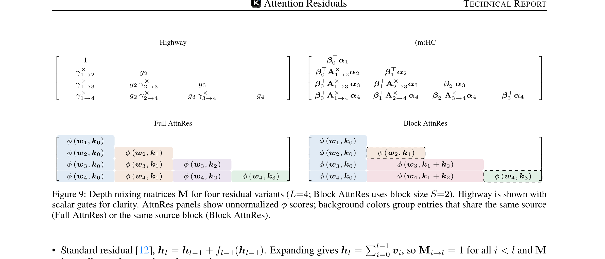
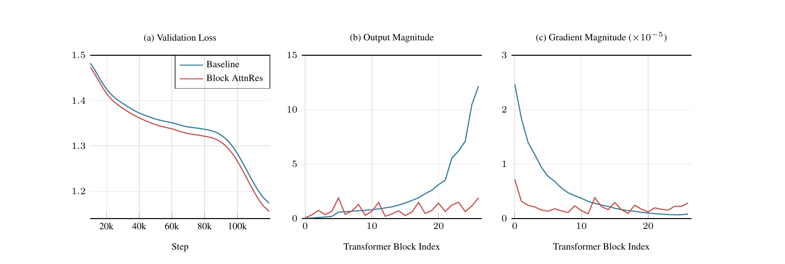
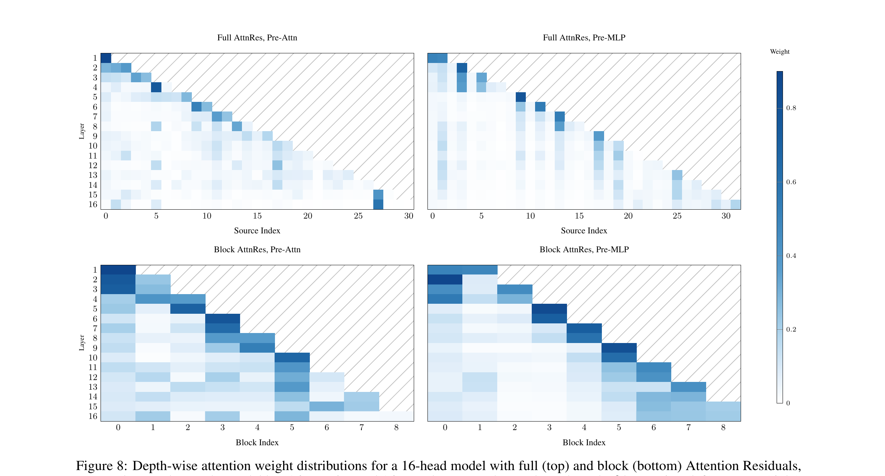

# Attention Residuals

*Kimi Team (Guangyu Chen, Yu Zhang, Jianlin Su, et al.) — arXiv:2603.15031, March 2026*

| Dimension | Prior State | This Paper | Key Result |
|-----------|-------------|------------|------------|
| Depth aggregation | Fixed unit-weight residual sum | Learned softmax attention over preceding layer outputs | 1.25× compute advantage (Block AttnRes at scale) |
| PreNorm dilution | $\|h_l\|=O(\sqrt{l})$ growth, each layer's contribution shrinks | AttnRes bounds growth within each block via selective aggregation | Bounded periodic output magnitudes across depth |
| Gradient distribution | Disproportionately large in early layers (normalization Jacobian amplification) | Softmax competition regulates gradient flow proportionally | Near-uniform gradient magnitudes across depth |
| Memory overhead | Full AttnRes: $O(Ld)$ prohibitive at scale | Block AttnRes: $O(Nd)$, $N\approx 8$ blocks | $< 4$% training overhead; $< 2$% inference latency |
| Benchmark performance | Kimi Linear baseline (48B MoE, 1.4T tokens) | Block AttnRes on same architecture | Consistent improvements across all 15 evaluated benchmarks |

## Relations

**Builds on:** [[papers/muon-optimizer|Muon (Liu et al., 2025)]] *(same Kimi team; Muon used as optimizer)*, [[papers/deep-residual-learning|Deep Residual Learning (He et al., 2015)]] *(no note yet)*, [[papers/prenorm-transformer|On Layer Normalization in the Transformer Architecture (Xiong et al., 2020)]] *(no note yet)*
**Extended by:** [[papers/siamese-norm|SiameseNorm (Tianyu Li et al., 2026)]] *(no note yet)* — provides formal analysis of PreNorm dilution that this paper leverages
**Concepts used:** [[concepts/attention-mechanisms/standard-attention|Standard Attention]], [[concepts/deep-learning-engineering/layer-normalization|Layer Normalization]] *(no note yet)*

---

## Table of Contents

- [[#1. The Residual Bottleneck|1. The Residual Bottleneck]]
  - [[#1.1 Residuals as Depth-Wise Accumulation|1.1 Residuals as Depth-Wise Accumulation]]
  - [[#1.2 The Gradient Highway|1.2 The Gradient Highway]]
  - [[#1.3 Limitations of the Fixed Additive Recurrence|1.3 Limitations of the Fixed Additive Recurrence]]
- [[#2. PreNorm Dilution: A Formal Analysis|2. PreNorm Dilution: A Formal Analysis]]
  - [[#2.1 Hidden-State Magnitude Growth|2.1 Hidden-State Magnitude Growth]]
  - [[#2.2 Dilution and Forced Compensation|2.2 Dilution and Forced Compensation]]
- [[#3. Why Gradients Blow Up in Early Layers|3. Why Gradients Blow Up in Early Layers]]
  - [[#3.1 The Normalization Jacobian|3.1 The Normalization Jacobian]]
  - [[#3.2 Cumulative Gradient Amplification|3.2 Cumulative Gradient Amplification]]
- [[#4. The Time-Depth Duality|4. The Time-Depth Duality]]
- [[#5. Attention Residuals (AttnRes)|5. Attention Residuals (AttnRes)]]
  - [[#5.1 Full AttnRes|5.1 Full AttnRes]]
  - [[#5.2 Block AttnRes|5.2 Block AttnRes]]
- [[#6. Residuals as Structured Matrices|6. Residuals as Structured Matrices]]
  - [[#6.1 The Depth Mixing Matrix|6.1 The Depth Mixing Matrix]]
  - [[#6.2 Prior Residuals as Depth-Wise Linear Attention|6.2 Prior Residuals as Depth-Wise Linear Attention]]
- [[#7. Training Dynamics Analysis|7. Training Dynamics Analysis]]
  - [[#7.1 Output Magnitude|7.1 Output Magnitude]]
  - [[#7.2 Gradient Distribution|7.2 Gradient Distribution]]
- [[#8. Learned AttnRes Patterns|8. Learned AttnRes Patterns]]
- [[#9. Experimental Results|9. Experimental Results]]
  - [[#9.1 Scaling Laws|9.1 Scaling Laws]]
  - [[#9.2 Ablations|9.2 Ablations]]
  - [[#9.3 Benchmarks|9.3 Benchmarks]]
- [[#10. When Does AttnRes Win?|10. When Does AttnRes Win?]]
- [[#References|References]]

---

## 1. The Residual Bottleneck

### 1.1 Residuals as Depth-Wise Accumulation

📐 **Notation.** Consider a Transformer with $L$ layers and hidden dimension $d$. Write $h_l \in \mathbb{R}^d$ for the hidden state entering layer $l$, with $h_1$ being the token embedding. Each layer applies a transformation $f_l$ (either a self-attention module or an MLP). The *PreNorm* update is:

$$h_{l+1} = h_l + f_l(\operatorname{Norm}(h_l))$$

Unrolling the recurrence, the hidden state at any layer $l$ is the cumulative sum:

$$h_l = h_1 + \sum_{i=1}^{l-1} f_i(\operatorname{Norm}(h_i))$$

Denote the *layer contribution* $v_i := f_i(\operatorname{Norm}(h_i))$, so that:

$$h_l = h_1 + \sum_{i=1}^{l-1} v_i = \sum_{i=0}^{l-1} v_i$$

with the convention $v_0 = h_1$. Every layer thus receives the **same uniformly-weighted sum** of all prior layer outputs — there is no mechanism to selectively emphasize or suppress individual contributions.

### 1.2 The Gradient Highway

The principal virtue of residual connections is the *identity path*: since $h_{l+1} = h_l + f_l(\cdot)$, the gradient of the loss $\mathcal{L}$ with respect to an intermediate hidden state satisfies:

$$\frac{\partial \mathcal{L}}{\partial h_l} = \frac{\partial \mathcal{L}}{\partial h_L} \cdot \prod_{j=l}^{L-1} \frac{\partial h_{j+1}}{\partial h_j} = \frac{\partial \mathcal{L}}{\partial h_L} \cdot \prod_{j=l}^{L-1} \left(I + \frac{\partial f_j(\operatorname{Norm}(h_j))}{\partial h_j}\right)$$

Expanding the product yields the identity matrix $I$ plus higher-order Jacobian terms. The pure identity term guarantees a *direct gradient highway* from the loss to any layer regardless of depth — residuals solve the vanishing gradient problem by construction.

### 1.3 Limitations of the Fixed Additive Recurrence

Despite this, the uniform aggregation carries three structural costs:

1. **No selective access.** Layer $l$ receives the aggregated state $h_l$, which conflates all earlier outputs. Individual contributions cannot be retrieved or upweighted; information lost through aggregation is irreversible.
2. **Output growth.** Because $\|h_l\|$ grows with depth (§2), later layers must learn increasingly large outputs to maintain influence over the residual stream — a *dynamic instability*.
3. **Gradient imbalance.** The normalization Jacobian $\partial_h \operatorname{Norm}(h) \propto 1/\|h\|$ amplifies gradients more strongly at early layers where $\|h\|$ is small (§3).

> [!QUESTION] Exercise 1: Gradient Highway Identity
> *This problem establishes why the identity connection ensures non-vanishing gradients even in the absence of careful weight initialization.*
>
> > **Prerequisites:** [[#1.2 The Gradient Highway|§1.2 The Gradient Highway]]
>
> Consider a depth-$L$ residual network $h_{l+1} = h_l + f_l(h_l)$ (PostNorm omitted for simplicity). Show that the gradient $\partial \mathcal{L}/\partial h_l$ contains a term $\partial \mathcal{L}/\partial h_L$ independent of the Jacobians $\partial f_j/\partial h_j$. Why does this guarantee a lower bound on gradient magnitude regardless of how the Jacobians behave?

> [!TIP]- Solution to Exercise 1
> **Key insight:** Each Jacobian factor is $I + \partial f_j/\partial h_j$, so their product expands as $I$ plus cross terms. The identity term persists regardless of the layer Jacobians' magnitude or sign.
>
> **Sketch:** Expanding $\prod_{j=l}^{L-1}(I + J_j)$ where $J_j = \partial f_j/\partial h_j$ by the product rule gives $I + \sum_j J_j + \sum_{i<j} J_i J_j + \ldots$. The leading $I$ term contributes $\partial \mathcal{L}/\partial h_L$ directly to $\partial \mathcal{L}/\partial h_l$, independent of all $J_j$. Even if every $J_j = 0$, the gradient is at least $\partial \mathcal{L}/\partial h_L$, so information always flows from the loss to every layer.

---

## 2. PreNorm Dilution: A Formal Analysis

### 2.1 Hidden-State Magnitude Growth

🔬 With PreNorm, the input to each layer is $\operatorname{Norm}(h_l)$, which has unit scale by definition ($\|\operatorname{RMSNorm}(x)\| = \sqrt{d}$, or unit variance for LayerNorm). The layer's output is therefore:

$$v_l = f_l(\operatorname{Norm}(h_l))$$

Since the input to $f_l$ is always unit-scale, $\|v_l\|$ is governed only by the layer's weight magnitudes, not by $\|h_l\|$. Under stable training, this norm is roughly constant across layers: $\|v_l\| \approx c$ for some constant $c$.

Because $h_l = \sum_{i=0}^{l-1} v_i$ and the contributions are approximately uncorrelated across layers (they process representations at different abstraction levels), the squared norm satisfies:

$$\mathbb{E}[\|h_l\|^2] \approx \|h_1\|^2 + (l-1)c^2$$

For $l \gg 1$ this gives:

$$\|h_l\| \approx c\sqrt{l}$$

**The hidden-state magnitude grows as $O(\sqrt{l})$ with depth.** This is *PreNorm dilution* in its raw form: the residual stream accumulates a random-walk-like growth because every layer injects a contribution of roughly fixed magnitude into an ever-growing sum.

> [!NOTE] Why uncorrelated?
> The independence is approximate but well-motivated: $v_i = f_i(\operatorname{Norm}(h_i))$ processes the full representation at layer $i$, while $v_j$ processes the representation at layer $j > i$, which incorporates $v_i$ already. In practice, the correlation $\langle v_i, v_j\rangle$ is small for $|i - j| \geq 2$, and empirical measurement confirms the $\sqrt{l}$ growth (Fig. 5(b)).

### 2.2 Dilution and Forced Compensation

The relative contribution of layer $i$ to the final hidden state $h_L$ is:

$$\frac{\|v_i\|}{\|h_L\|} \approx \frac{c}{c\sqrt{L}} = \frac{1}{\sqrt{L}}$$

*In an $L$-layer network, each individual layer contributes a fraction $O(1/\sqrt{L})$ of the final representation — this fraction shrinks as the network deepens.*

**The compensation mechanism.** For a layer to retain meaningful influence over $h_L$, it must produce an output $v_l$ whose magnitude is comparable to $c\sqrt{L}$, not just $c$. However, the layer always receives a unit-scale input after normalization and has no signal about the *total depth* of the network. The optimizer closes this gap by increasing the layer's weight magnitudes: later layers learn progressively larger weights to remain influential. This is exactly the monotonically increasing output magnitudes seen empirically in Fig. 5(b).

> [!WARNING] The vicious cycle
> As layers learn larger outputs to compensate for dilution, $\|v_l\|$ grows, which *further increases* $\|h_L\|$, which requires even larger compensating outputs. This can cause training instability in very deep networks, and is one reason why a significant fraction of layers can be pruned with minimal loss — many layers produce outputs that are small relative to the total residual stream and have negligible influence.

> [!QUESTION] Exercise 2: The O(√l) Growth
> *This problem makes the random-walk analogy precise.*
>
> > **Prerequisites:** [[#2.1 Hidden-State Magnitude Growth|§2.1 Hidden-State Magnitude Growth]]
>
> Let $h_l = \sum_{i=0}^{l-1} v_i$ where $v_i \in \mathbb{R}^d$ are i.i.d. random vectors with $\mathbb{E}[v_i] = 0$ and $\mathbb{E}[\|v_i\|^2] = c^2$. Compute $\mathbb{E}[\|h_l\|^2]$ and conclude that $\mathbb{E}[\|h_l\|] = \Theta(\sqrt{l})$. What assumption on the $v_i$ can you relax while still recovering the $\sqrt{l}$ scaling?

> [!TIP]- Solution to Exercise 2
> **Key insight:** The variance of a sum of independent zero-mean vectors grows linearly in the number of terms.
>
> **Sketch:** $\mathbb{E}[\|h_l\|^2] = \mathbb{E}[\|\sum_{i=0}^{l-1} v_i\|^2] = \sum_{i,j} \mathbb{E}[\langle v_i, v_j\rangle] = \sum_i \mathbb{E}[\|v_i\|^2] = l \cdot c^2$ (cross-terms vanish by independence and zero mean). By Jensen's inequality $\mathbb{E}[\|h_l\|] \leq \sqrt{\mathbb{E}[\|h_l\|^2]} = c\sqrt{l}$, and the reverse bound follows from Cauchy-Schwarz / concentration, giving $\mathbb{E}[\|h_l\|] = \Theta(\sqrt{l})$.
>
> The zero-mean assumption can be relaxed: if $\mathbb{E}[v_i] = \mu \neq 0$ but $\|\mu\| \ll c\sqrt{l}$, the growth is still dominated by the variance term. The independence assumption can be relaxed to *pairwise uncorrelated* contributions; weak positive correlation shifts the constant factor but preserves the $\sqrt{l}$ scaling.

---

## 3. Why Gradients Blow Up in Early Layers

📐 This section derives the core gradient-imbalance mechanism. It relies on the *normalization Jacobian* — a term that is often glossed over in informal presentations of PreNorm.

### 3.1 The Normalization Jacobian

Consider a single PreNorm step, $h_{l+1} = h_l + f_l(\operatorname{Norm}(h_l))$. The Jacobian of this map is:

$$\frac{\partial h_{l+1}}{\partial h_l} = I + J_{f_l}(\operatorname{Norm}(h_l)) \cdot J_{\operatorname{Norm}}(h_l)$$

where $J_{f_l}$ is the Jacobian of the layer function evaluated at its (unit-scale) input, and $J_{\operatorname{Norm}}(h_l)$ is the Jacobian of the normalization operation evaluated at $h_l$.

For **RMSNorm**, $\operatorname{RMSNorm}(x) = x / \operatorname{rms}(x)$ where $\operatorname{rms}(x) = \sqrt{\frac{1}{d}\|x\|^2}$. Differentiating:

$$J_{\operatorname{RMSNorm}}(x) = \frac{1}{\operatorname{rms}(x)}\left(I - \frac{1}{d}\hat{x}\hat{x}^\top\right)$$

where $\hat{x} = x/\|x\|$ is the unit vector. This is a rank-$(d-1)$ projection scaled by $1/\operatorname{rms}(x) = \sqrt{d}/\|x\|$. In operator norm:

$$\|J_{\operatorname{RMSNorm}}(x)\| \leq \frac{\sqrt{d}}{\|x\|}$$

**Key observation:** The normalization Jacobian has operator norm inversely proportional to $\|h_l\|$.

Since $\|h_l\| \approx c\sqrt{l}$ (§2.1):

$$\|J_{\operatorname{Norm}}(h_l)\| \leq \frac{\sqrt{d}}{c\sqrt{l}}$$

*The normalization Jacobian is largest at early layers (small $l$) and shrinks with depth.* For deep layers where $\|h_l\|$ is large, normalization is a strong operation (high compression), so small perturbations in $h_l$ lead to small perturbations in $\operatorname{Norm}(h_l)$ — the Jacobian is small. Conversely, at early layers where $\|h_l\|$ is near the embedding scale, the Jacobian is large.

### 3.2 Cumulative Gradient Amplification

In the backward pass, the gradient flows from layer $L$ to layer $l$ as:

$$g_l := \frac{\partial \mathcal{L}}{\partial h_l} = g_L \prod_{j=l}^{L-1} \frac{\partial h_{j+1}}{\partial h_j} = g_L \prod_{j=l}^{L-1} \left(I + J_{f_j}^T J_{\operatorname{Norm}}^T(h_j)\right)$$

At each layer $j$, the gradient receives an additive contribution of magnitude:

$$\delta_j := \|J_{f_j}\| \cdot \|J_{\operatorname{Norm}}(h_j)\| \leq \frac{C\sqrt{d}}{c\sqrt{j}}$$

where $C = \sup_j \|J_{f_j}\|$ bounds the layer Jacobians. Taking a first-order approximation (valid when $\delta_j \ll 1$):

$$\|g_l\| \approx \|g_L\| \cdot \prod_{j=l}^{L-1}(1 + \delta_j) \approx \|g_L\| \cdot \exp\!\left(\sum_{j=l}^{L-1} \delta_j\right) \leq \|g_L\| \cdot \exp\!\left(\frac{C\sqrt{d}}{c} \sum_{j=l}^{L-1} \frac{1}{\sqrt{j}}\right)$$

Since $\sum_{j=l}^{L-1} j^{-1/2} \approx 2(\sqrt{L} - \sqrt{l})$:

$$\|g_l\| \lesssim \|g_L\| \cdot \exp\!\left(\frac{2C\sqrt{d}}{c}\left(\sqrt{L} - \sqrt{l}\right)\right)$$

**For the earliest layers ($l \approx 1$), the amplification is $\exp(O(C\sqrt{dL}/c))$, growing with network depth.** For the deepest layers ($l \approx L$), the exponent is near zero and the gradient is nearly equal to $g_L$.

This is the gradient imbalance: under PreNorm, early layers receive exponentially larger gradient signals than deep layers. The mechanism is not mysterious — it follows directly from the normalization Jacobian being large where $\|h_l\|$ is small.

> [!INFO] Gradient imbalance vs. vanishing gradients
> This is the *opposite* of the vanishing gradient problem that residuals were designed to solve. PostNorm suffers from vanishing gradients: normalization on the residual path kills the identity term, and deep layers receive near-zero gradients. PreNorm restores the identity path (fixing vanishing gradients) but introduces this *gradient amplification* at early layers instead. AttnRes addresses both simultaneously by making the contribution weights learnable.

> [!QUESTION] Exercise 3: Gradient Amplification Bound
> *This problem derives the depth-dependence of gradient amplification more carefully.*
>
> > **Prerequisites:** [[#3.1 The Normalization Jacobian|§3.1]], [[#2.1 Hidden-State Magnitude Growth|§2.1]]
>
> Assume $\|h_l\| = c\sqrt{l}$ exactly and $\sup_j \|J_{f_j}\| \leq C$. Using the bound $\|J_{\operatorname{Norm}}(h_l)\| \leq \sqrt{d}/\|h_l\|$ and the inequality $\prod_j (1+\epsilon_j) \leq e^{\sum_j \epsilon_j}$, show that:
> $$\|g_l\| \leq \|g_L\| \cdot \exp\left(\frac{C\sqrt{d}}{c}\cdot 2(\sqrt{L} - \sqrt{l})\right)$$
> For what ratio $l/L$ does the amplification factor exceed $e^1$?

> [!TIP]- Solution to Exercise 3
> **Key insight:** The cumulative amplification is controlled by the integral $\int_l^L j^{-1/2} dj = 2(\sqrt{L} - \sqrt{l})$.
>
> **Sketch:** Each step contributes $\delta_j \leq C \cdot \sqrt{d}/(c\sqrt{j})$ to the exponent. Sum: $\sum_{j=l}^{L-1} \delta_j \leq (C\sqrt{d}/c) \sum_{j=l}^{L-1} j^{-1/2} \leq (C\sqrt{d}/c) \int_l^L j^{-1/2} dj = (C\sqrt{d}/c) \cdot 2(\sqrt{L} - \sqrt{l})$.
>
> The amplification exceeds $e^1$ when $(C\sqrt{d}/c) \cdot 2(\sqrt{L} - \sqrt{l}) \geq 1$, i.e., $\sqrt{l} \leq \sqrt{L} - c/(2C\sqrt{d})$. For large $L$, this is satisfied by all layers $l < L - O(c^2/(C^2 d))$, which is almost all layers — gradient amplification affects the vast majority of the network.

---

## 4. The Time-Depth Duality

🔗 The limitations above are not accidents of design but consequences of a structural analogy: residuals over depth behave like RNNs over time, and are subject to the same bottlenecks that Transformers solved in the sequence domain.

| Sequence (time) | Depth |
|-----------------|-------|
| RNN: $s_t = f(s_{t-1}, x_t)$ | Residual: $h_l = h_{l-1} + f_{l-1}(h_{l-1})$ |
| Compressed all history into $s_{t-1}$ | Compressed all prior outputs into $h_{l-1}$ |
| Highway nets: gated $s_t$ | Highway: gated $h_l$ |
| Transformer: attention over all positions | AttnRes: attention over all preceding layers |

In both cases the *recurrence bottleneck* is the same: the current state is a single compressed vector from which individual past contributions cannot be selectively retrieved. The Transformer solved this for sequences by replacing recurrence with *full attention*. AttnRes applies the same cure in the depth dimension.

**Formal duality.** The unrolled residual $h_l = \sum_{i=0}^{l-1} v_i$ is exactly a *depth-wise linear attention* with uniform weights $M_{i \to l} = 1$. Highway networks use input-dependent scalar weights (stick-breaking attention). mHC maintains $m$ parallel streams with matrix-valued weights ($m$-semiseparable). All of these are depth-wise *linear* attention — AttnRes completes the analogy by introducing *softmax* attention over depth (§6).

---

## 5. Attention Residuals (AttnRes)

🧮 The core idea: replace the fixed uniform weights $M_{i\to l} = 1$ with learned, input-dependent attention weights $\alpha_{i\to l}$:

$$h_l = \sum_{i=0}^{l-1} \alpha_{i\to l} \cdot v_i, \qquad \sum_{i=0}^{l-1} \alpha_{i\to l} = 1$$

where $v_0 = h_1$ (token embedding) and $v_i = f_i(h_i)$ for $i \geq 1$.

### 5.1 Full AttnRes

The attention weights are computed via a *learned pseudo-query* $w_l \in \mathbb{R}^d$ per layer:

$$\alpha_{i\to l} = \frac{\exp\!\left(w_l^\top \operatorname{RMSNorm}(v_i)\right)}{\sum_{j=0}^{l-1} \exp\!\left(w_l^\top \operatorname{RMSNorm}(v_j)\right)}$$

Equivalently, with keys $k_i = \operatorname{RMSNorm}(v_i)$ and values $k_i = v_i$:

$$h_l = \operatorname{softmax}(W^\top K^\top)_{1:l} \cdot V_{1:l}$$

where $W = [w_1, \ldots, w_{l-1}]$ stacks the layer pseudo-queries.

**Three design choices** are worth noting:

1. **Learned pseudo-query** $w_l$ (not input-dependent). Using $w_l = \text{const}$ per layer — decoupled from the hidden state — means the attention weights can be computed in parallel across all layers within a block. An input-dependent query (projecting $h_l$) gives slightly lower loss (1.731 vs. 1.737 in ablations) but requires sequential computation and adds $d \times d$ parameters per layer.

2. **RMSNorm on keys** $k_i = \operatorname{RMSNorm}(v_i)$. This prevents layers with large $\|v_i\|$ from dominating the softmax, which is critical under PreNorm dilution where later layers learn large outputs.

3. **Softmax normalization**. Replacing softmax with sigmoid degrades performance — the *competitive normalization* of softmax (all weights must sum to 1) forces sharper selection and regulates gradient flow proportionally to weight magnitude.

**Initialization.** All pseudo-queries $w_l$ must be initialized to zero. This ensures that at the start of training, $w_l^\top k_i = 0$ for all $i$, making the softmax uniform: $\alpha_{i\to l} = 1/(l-1)$ — an equal-weight average. This reduces AttnRes to standard averaging at initialization, ensuring training stability.

> [!INFO] Why zero init matters
> If $w_l$ were initialized randomly, the initial attention weights would be non-uniform and biased toward the pseudo-query's random direction. This breaks the standard residual connection interpretation at initialization and causes training instability. Zero init ensures a smooth transition: the model starts as a standard residual (uniform weights) and gradually learns specialization.

### 5.2 Block AttnRes

Full AttnRes requires storing all $L$ layer outputs simultaneously — $O(Ld)$ memory per token. At scale, with activation recomputation and pipeline parallelism, this is prohibitive. Block AttnRes reduces this to $O(Nd)$ by partitioning the $L$ layers into $N$ blocks of size $S = L/N$ each.

**Intra-block accumulation.** Within block $n$, layer outputs are summed into a single *block representation*:
$$b_n = \sum_{j \in \mathcal{B}_n} f_j(h_j)$$

**Inter-block attention.** For the $i$-th layer in block $n$, the input is:

$$h_l \propto \sum_{k=0}^{n-1} \alpha_{k\to l} \cdot b_k + \alpha_{n\to l} \cdot b_n^{(i-1)}$$

where $b_n^{(i-1)}$ is the *partial sum* within the current block up to layer $i-1$. The full sequence of previous blocks plus the growing partial sum of the current block provides the value set.

```python
def block_attn_res(blocks, partial_block, proj, norm):
    # blocks: list of N completed block reps [B, T, D]
    # partial_block: intra-block partial sum [B, T, D]
    V = torch.stack(blocks + [partial_block])       # [N+1, B, T, D]
    K = norm(V)
    logits = torch.einsum('d, n b t d -> n b t', proj.weight.squeeze(), K)
    return torch.einsum('n b t, n b t d -> b t d', logits.softmax(0), V)
```

**Efficiency tradeoff.** $N$ interpolates between two extremes:
- $N = 1$: standard residual connections (all layers collapsed to one block)
- $N = L$: Full AttnRes (each layer is its own block)

Empirically, $N \approx 8$ recovers most of the benefit of Full AttnRes while keeping memory $O(Nd) = O(8d)$ — a fixed overhead independent of network depth.

---

## 6. Residuals as Structured Matrices

🧭 Every residual variant defines a *depth mixing matrix* $M \in \mathbb{R}^{L \times L}$ where $M_{i\to l}$ is the weight layer $l$ assigns to the output of layer $i$. The entry $M_{i\to l}$ is nonzero only for $i < l$ (causal). The unrolled input to layer $l$ is:

$$h_l = \sum_{i=0}^{l-1} M_{i\to l} \cdot v_i$$

This unified view reveals the structural differences between methods.

### 6.1 The Depth Mixing Matrix



*Figure 9 (Kimi Team, 2026): Depth mixing matrices M for Highway, mHC, Full AttnRes, and Block AttnRes (L=4). Background colors group entries sharing the same source. AttnRes panels show unnormalized ϕ scores.*

| Method | $M_{i\to l}$ | Structure | Semiseparable rank |
|--------|-------------|-----------|-------------------|
| Standard residual | $1$ (all $i < l$) | All-ones lower-triangular | 1 |
| ReZero / LayerScale | $\alpha_l$ (per-layer scalar) | Diagonal-scaled lower-triangular | 1 |
| Highway | $g_{i+1} \prod_{j=i+2}^{l}(1-g_j)$ | Stick-breaking products | 1-semiseparable |
| mHC ($m$ streams) | $\beta_i^\top A^\times_{i+1\to l} \alpha_l$ | Matrix carry products | $m$-semiseparable |
| Full AttnRes | $\alpha_{i\to l} = \varphi(w_l, k_i) / \sum_j \varphi(w_l, k_j)$ | Dense, input-dependent | rank $L$ |
| Block AttnRes | $\alpha_{n\to l}$ shared within block $n$ | Block-structured, input-dependent | $N$ to $N+S$ |

**The semiseparable rank** captures the expressive power of the depth mixing. Standard residual and its close variants are rank-1 — all layer weights are computable from a single scalar per layer. mHC's $m$ parallel streams raise this to $m$-semiseparable. Full AttnRes achieves a *dense, full-rank* $M$, where each entry is independently learnable and input-dependent.

### 6.2 Prior Residuals as Depth-Wise Linear Attention

The structured-matrix lens reveals that all prior methods are instances of *depth-wise linear attention*. For example, the mHC weight:

$$M_{i\to l} = \beta_i^\top A^\times_{i+1\to l} \alpha_l$$

has a natural attention interpretation: $\alpha_l$ is the query issued by layer $l$, $\beta_i$ is the key summarizing layer $i$'s contribution, and $A^\times_{i+1\to l} = \prod_{k=i+1}^l A_k$ is a depth-positional operator governing the query–key interaction. The $m$ streams correspond to *state expansion* along the depth axis.

**AttnRes completes the depth-wise attention hierarchy**: just as softmax attention over sequences outperforms linear attention by enabling sharper, data-dependent selection, softmax attention over depth enables richer depth-wise routing than any linear-attention variant.

---

## 7. Training Dynamics Analysis

📊 The authors compare the 48B Kimi Linear model with and without Block AttnRes ($N = 9$ blocks), both trained on 1T tokens.



*Figure 5 (Kimi Team, 2026): Training dynamics of Baseline vs. Block AttnRes. (a) Validation loss. (b) Output magnitude per transformer block at end of training. (c) Gradient magnitude per transformer block.*

### 7.1 Output Magnitude

**Baseline:** Hidden-state magnitudes grow monotonically with depth, as predicted by the $O(\sqrt{l})$ analysis. Deeper layers compensate by producing larger outputs, driving the growth further.

**Block AttnRes:** The periodic reset at block boundaries breaks the accumulation. Within each block, layers still accumulate; but at each block boundary, selective aggregation via softmax attention can *downweight* the accumulated block representation, preventing runaway growth. The result is a *bounded periodic pattern* — output magnitude stays roughly constant across blocks.

### 7.2 Gradient Distribution

**Baseline:** With fixed unit weights, the only mechanism for gradient flow is the identity path. Gradient amplification via the normalization Jacobian (§3) causes disproportionately large gradients at early layers.

**Block AttnRes:** The softmax weights $\alpha_{i\to l}$ provide a *gradient regulation* mechanism. A layer that receives attention weight $\alpha$ from layer $l$ also receives a fraction $\alpha$ of layer $l$'s gradient through the attention backward pass. Since softmax weights must sum to 1, this is a zero-sum competition: if one source is upweighted, others are downweighted. The result is a more uniform gradient distribution across depth, visible in Fig. 5(c).

> [!TIP] The softmax gradient highway
> In AttnRes, the gradient of the loss w.r.t. source $v_i$ through layer $l$'s attention is:
> $$\frac{\partial \mathcal{L}}{\partial v_i} \supseteq \frac{\partial \mathcal{L}}{\partial h_l} \cdot \alpha_{i\to l}$$
> Layers with small attention weight receive proportionally less gradient — a natural gradient regularization that the fixed-weight residual lacks entirely.

---

## 8. Learned AttnRes Patterns

🔑 Visualizing the learned weights $\alpha_{i\to l}$ across the trained model reveals consistent structural patterns:



*Figure 8 (Kimi Team, 2026): Learned $\alpha_{i\to l}$ weight distributions, averaged over tokens. Rows = layer index; columns = source index. Full AttnRes (top), Block AttnRes (bottom), for pre-attention (left) and pre-MLP (right) layers.*

Three patterns emerge:

1. **Preserved locality.** Each layer attends most strongly to its immediate predecessor — the standard residual path is the primary information highway even when alternatives are available. This is consistent with the model discovering that the local path is most information-rich in practice.

2. **Layer specialization.** Pre-attention layers show broader receptive fields (attention distributed over distant sources), while pre-MLP layers show sharp diagonal dominance (relying heavily on the recent representation). This is mechanistically sensible: attention layers need long-range context and benefit from diverse layer histories; MLP layers do local feature processing and want the most recent refined representation.

3. **Depth-wise attention sinks.** The token embedding $h_1$ (source 0) retains non-trivial weight throughout, especially in pre-attention layers. This mirrors *sequence-wise attention sinks* — certain tokens/layers systematically attract high attention regardless of content, and the model uses them as neutral aggregation points.

---

## 9. Experimental Results

### 9.1 Scaling Laws

The authors train five model sizes (194M–528M activated parameters) under three variants: PreNorm baseline, Full AttnRes, and Block AttnRes ($N \approx 8$). All fit power laws $L = A \times C^{-\alpha}$:

| Variant | $A$ | $\alpha$ | Compute advantage at 5.6 PFLOP/s-days |
|---------|-----|----------|---------------------------------------|
| Baseline | 1.891 | 0.057 | 1.0× |
| Block AttnRes | 1.870 | 0.058 | **1.25×** |
| Full AttnRes | 1.865 | 0.057 | 1.28× |

The scaling exponents are nearly identical, meaning the improvement is a *constant vertical shift* in the loss curve — AttnRes does not change the rate of improvement with compute, but consistently achieves lower loss at every scale.

### 9.2 Ablations

Key findings from the 16-layer model ablation:

- **Input-independent mixing (DenseFormer-style):** Fixed scalar coefficients per layer show *no gain* over baseline (1.767 vs. 1.766). Input dependence is necessary.
- **SWA (sliding window):** Retaining only the 8 nearest prior layers achieves 1.764 — better than baseline but far below Block AttnRes (1.746). *Selective access to distant layers matters more than access to many nearby ones.*
- **Block size sweep:** Loss degrades gracefully from $S=1$ (Full AttnRes, 1.737) to $S=32$ (near baseline). $S \in \{2, 4, 8\}$ all land near 1.746 — a broad plateau of good performance.
- **Softmax vs. sigmoid:** Sigmoid: 1.741 vs. softmax: 1.737. Competitive normalization helps.
- **Multihead:** Per-head depth aggregation ($H=16$) hurts (1.752 vs. 1.746). The optimal depth mixture is largely uniform across channels — when a layer's output is relevant, its full representation is relevant.

### 9.3 Benchmarks

After training the 48B MoE model on 1.4T tokens, Block AttnRes matches or exceeds the baseline on all 15 benchmarks. The largest improvements appear on compositional reasoning: **GPQA-Diamond +7.5, HumanEval +3.1, MATH +3.6** — consistent with the hypothesis that improved depth-wise information flow benefits multi-step compositional tasks requiring selective retrieval of earlier-layer representations.

---

## 10. When Does AttnRes Win?

🤔 Ziming Liu's [blog post analysis](https://kindxiaoming.github.io/blog/2026/attention-residual/) probes the conditions for AttnRes superiority. The core insight is a No-Free-Lunch argument: AttnRes is not unconditionally superior.

**Structured tasks (high $\alpha_{\text{clean}}$):** When the task has a linear-like structure (e.g., the label is a smooth function of the input), AttnRes's learned routing efficiently isolates the relevant computation. The model can learn to focus on specific earlier-layer representations that encode the relevant transformation, bypassing irrelevant intermediate computation.

**Memorization tasks (low $\alpha_{\text{clean}}$):** For tasks requiring memorization of arbitrary patterns (random labels), standard residuals outperform. AttnRes's uniform-weight initialization introduces a bias toward averaging; in the pure memorization regime, each example requires distinct layer contributions and averaging works against this. The competition enforced by softmax is a disadvantage when every source needs independent weight.

**The NLP interpretation.** Natural language has considerably more structure than random memorization. Linguistic patterns, syntactic regularities, and semantic compositionality all favor AttnRes's assumption that useful structure can be selectively retrieved from earlier layers. This explains why Kimi's results on language tasks are positive.

> [!WARNING] The stability-expressivity tension
> Liu identifies a potential tension: AttnRes's uniform initialization (all weights equal) favors stability at the expense of expressivity at step 0. In memorization tasks, breaking symmetry early via random layer weights is beneficial. This tension underlies the tradeoff — AttnRes sacrifices early expressivity for stable training dynamics, a worthwhile trade for structured tasks but harmful for random ones.

---

## References

| Reference | Brief Summary | Link |
|-----------|--------------|------|
| [Attention Residuals (Kimi Team, 2026)](https://arxiv.org/abs/2603.15031) | Proposes AttnRes: learned softmax attention over preceding layer outputs; Block AttnRes reduces overhead to O(Nd) | https://arxiv.org/abs/2603.15031 |
| [On Layer Normalization in the Transformer Architecture (Xiong et al., 2020)](https://arxiv.org/abs/2002.04745) | Formal analysis of PreNorm vs. PostNorm; shows PreNorm improves gradient flow but introduces magnitude growth | https://arxiv.org/abs/2002.04745 |
| [SiameseNorm (Tianyu Li et al., 2026)](https://arxiv.org/abs/2602.08064) | Two-stream PreNorm+PostNorm architecture; formal analysis of PreNorm dilution that AttnRes cites | https://arxiv.org/abs/2602.08064 |
| [Deep Residual Learning for Image Recognition (He et al., 2015)](https://arxiv.org/abs/1512.03385) | Original residual connections paper | https://arxiv.org/abs/1512.03385 |
| [Hyper-Connections (Zhu et al., 2025)](https://arxiv.org/abs/2409.19606) | Multi-stream residuals with learned mixing; predecessor to mHC | https://arxiv.org/abs/2409.19606 |
| [mHC: Manifold-Constrained Hyper-Connections (Xie et al., 2026)](https://arxiv.org/abs/2512.24880) | Stabilized mHC with doubly-stochastic transition matrices | https://arxiv.org/abs/2512.24880 |
| [DenseFormer (Pagliardini et al., 2024)](https://arxiv.org/abs/2402.02622) | Cross-layer access with fixed learned scalar coefficients; shows input-dependence is necessary | https://arxiv.org/abs/2402.02622 |
| [DeepNet (Wang et al., 2022)](https://arxiv.org/abs/2203.00555) | Scaled residual paths for 1000-layer Transformers | https://arxiv.org/abs/2203.00555 |
| [When does Kimi's "Attention Residuals" Work? (Ziming Liu, 2026)](https://kindxiaoming.github.io/blog/2026/attention-residual/) | No-Free-Lunch analysis; structured vs. memorization regimes | https://kindxiaoming.github.io/blog/2026/attention-residual/ |
| [Transformers are SSMs (Dao & Gu, 2024)](https://arxiv.org/abs/2405.21060) | Structured State Space Duality; semiseparable matrix framework used in §6 | https://arxiv.org/abs/2405.21060 |
