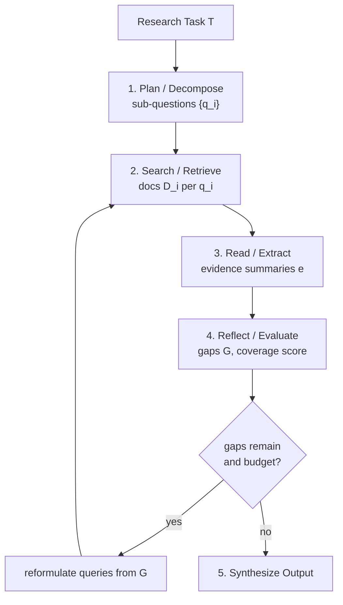
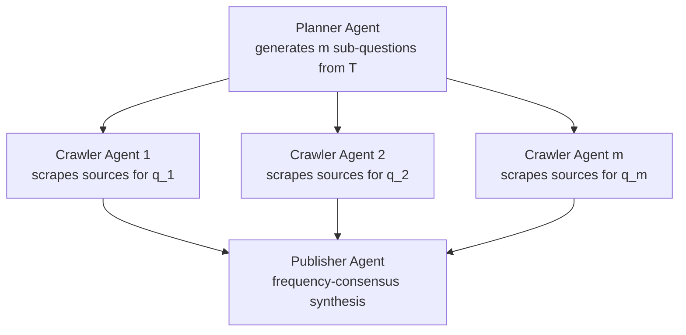

# Autoresearch: Autonomous Agentic Research Loops

*Andrej Karpathy (karpathy/autoresearch, March 2026); Assaf Elovic (GPT-Researcher, 2023); Wenlin Zhang et al. (Deep Research Survey, 2025); practitioners across multiple venues.*

| Dimension | Prior State | This Paper | Key Result |
|---|---|---|---|
| Research automation | Manual query-answer with single LLM call | Closed agentic loop: propose → execute → evaluate → iterate | ~700 experiments overnight, 11% improvement on GPT-2 training benchmark |
| Scope of search | Single retrieval pass, no iteration | Recursive tree-structured retrieval with query reformulation | BFS/DFS hybrid cuts redundant queries; frequency-consensus reduces hallucination |
| Evaluation signal | Human judgment, offline evals | Fixed proxy metric in immutable harness (val_bpb) | Metric gaming isolated by scope containment + held-out eval |
| Systems available | Closed commercial tools | Open-source: GPT-Researcher (25.7k stars), AI-Scientist-v2, karpathy/autoresearch | 93.8% implementation completeness on Scientist-Bench (AI-Researcher) |

## Relations

**Builds on:** [[papers/multi-agent-design|Multi-Agent Design Patterns]]
**Concepts used:** [[concepts/neural-scaling-laws/note|Neural Scaling Laws]], [[concepts/mixture-of-experts/note|Mixture of Experts]]

---

## Table of Contents

- [[#1. What is Autoresearch|1. What is Autoresearch]]
  - [[#1.1 Definition|1.1 Definition]]
  - [[#1.2 Contrast with Naive LLM Querying|1.2 Contrast with Naive LLM Querying]]
  - [[#1.3 Information-Theoretic Motivation|1.3 Information-Theoretic Motivation]]
- [[#2. The Core Loop|2. The Core Loop]]
  - [[#2.1 The Canonical Five-Step Cycle|2.1 The Canonical Five-Step Cycle]]
  - [[#2.2 Formal Pseudocode|2.2 Formal Pseudocode]]
  - [[#2.3 Convergence and Termination|2.3 Convergence and Termination]]
- [[#3. Key Components|3. Key Components]]
  - [[#3.1 Search and Retrieval Tools|3.1 Search and Retrieval Tools]]
  - [[#3.2 Reader and Scraper Agents|3.2 Reader and Scraper Agents]]
  - [[#3.3 Synthesis LLM|3.3 Synthesis LLM]]
  - [[#3.4 Memory and Context Management|3.4 Memory and Context Management]]
  - [[#3.5 Evaluation Harness|3.5 Evaluation Harness]]
- [[#4. Design Patterns and Strategies|4. Design Patterns and Strategies]]
  - [[#4.1 Breadth-First vs. Depth-First Exploration|4.1 Breadth-First vs. Depth-First Exploration]]
  - [[#4.2 Query Reformulation|4.2 Query Reformulation]]
  - [[#4.3 Source Deduplication and Frequency Consensus|4.3 Source Deduplication and Frequency Consensus]]
  - [[#4.4 Scope Containment and Revert Semantics|4.4 Scope Containment and Revert Semantics]]
  - [[#4.5 Reflection Prompts|4.5 Reflection Prompts]]
- [[#5. Failure Modes and Mitigations|5. Failure Modes and Mitigations]]
  - [[#5.1 Hallucination and Factual Drift|5.1 Hallucination and Factual Drift]]
  - [[#5.2 Context Saturation|5.2 Context Saturation]]
  - [[#5.3 Rabbit-Holing and Plan Brittleness|5.3 Rabbit-Holing and Plan Brittleness]]
  - [[#5.4 Metric Gaming and Reward Hacking|5.4 Metric Gaming and Reward Hacking]]
  - [[#5.5 Source Quality and Prompt Injection|5.5 Source Quality and Prompt Injection]]
- [[#6. Practical Implementations|6. Practical Implementations]]
  - [[#6.1 karpathy/autoresearch|6.1 karpathy/autoresearch]]
  - [[#6.2 GPT-Researcher|6.2 GPT-Researcher]]
  - [[#6.3 AI Scientist v2|6.3 AI Scientist v2]]
  - [[#6.4 AI-Researcher|6.4 AI-Researcher]]
  - [[#6.5 Commercial Systems|6.5 Commercial Systems]]
- [[#7. Evaluation|7. Evaluation]]
  - [[#7.1 Search-Oriented Benchmarks|7.1 Search-Oriented Benchmarks]]
  - [[#7.2 Research-Oriented Benchmarks|7.2 Research-Oriented Benchmarks]]
  - [[#7.3 Evaluation Dimensions|7.3 Evaluation Dimensions]]
- [[#8. References|8. References]]

---

## 1. What is Autoresearch

### 1.1 Definition

💡 **Definition (Autoresearch).** *Autoresearch* is an autonomous AI workflow in which an LLM-backed agent iterates through cycles of query formulation, evidence retrieval, reading, reflection, and synthesis — without human intervention between cycles — until a termination criterion is met. The output is a grounded artifact: a research report, an optimized training script, a set of hypotheses, or any other verifiable product of systematic inquiry.

The term entered broad usage in March 2026 when Andrej Karpathy published [`karpathy/autoresearch`](https://github.com/karpathy/autoresearch), a minimal demonstration of the pattern applied to ML training optimization. The concept is, however, broader: GPT-Researcher (Assaf Elovic, 2023) and Sakana AI's AI Scientist (2024) instantiate the same pattern for open-domain literature synthesis and scientific hypothesis generation respectively.

Two flavors of autoresearch are worth distinguishing from the outset:

| Flavor | Domain | Mutation Target | Fitness Signal |
|---|---|---|---|
| *Experimental optimization* | ML training | Source code / hyperparameters | Proxy metric (val_bpb, accuracy) |
| *Literature synthesis* | Any knowledge domain | Research queries / report draft | Coverage, citation precision, coherence |

Both share the same underlying loop structure; they differ only in what is mutated and how fitness is measured.

### 1.2 Contrast with Naive LLM Querying

A single-pass LLM query — "tell me about topic X" — suffers from two structural limitations:

1. **Fixed context horizon**: the LLM can only reason over information already in its training distribution or a single retrieved chunk. No new evidence is incorporated during generation.
2. **No self-correction**: the model cannot detect when its output contradicts a retrieved source or when a knowledge gap remains unaddressed.

Autoresearch replaces this one-shot pass with a *closed feedback loop*. The agent maintains a growing evidence buffer, detects gaps through reflection, issues follow-up queries, and revises its synthesis. This mirrors the structure of human scientific inquiry: form hypothesis → gather evidence → update belief → repeat.

### 1.3 Information-Theoretic Motivation

Let $H(T)$ denote the entropy of the answer to a research task $T$, and let $I_k$ denote the mutual information between the $k$-th retrieved document and $T$. A single retrieval pass yields expected information gain

$$\mathbb{E}[I_1] = I(D_1; T)$$

where $D_1$ is drawn from the retrieval distribution induced by the initial query $q_0$. After $n$ independent retrieval steps, the total information about $T$ in the evidence buffer is (assuming approximate independence of retrieved documents)

$$\sum_{k=1}^{n} I(D_k; T \mid D_1, \ldots, D_{k-1}).$$

*Heuristically*, each additional step has diminishing marginal gain — a saturation effect — unless the agent *adapts its queries* based on what it has already learned. Query reformulation is the mechanism that maintains high marginal information gain across iterations: by conditioning each new query $q_k$ on the current evidence buffer $\mathcal{E}_{k-1}$, the agent steers retrieval toward the residual uncertainty in $T$.

**Iterative retrieval with adaptive query reformulation provides strictly higher expected coverage of $H(T)$ than any fixed query set of the same size** — assuming the LLM's query proposals are positively correlated with the actual residual uncertainty. This is the information-theoretic justification for the loop.

---

## 2. The Core Loop

### 2.1 The Canonical Five-Step Cycle

🔄 The *agentic research cycle* consists of five stages executed repeatedly until termination:

1. **Plan / Decompose**: Given task $T$, decompose it into a set of sub-questions $\{q_1, \ldots, q_m\}$ that jointly cover $T$. In experimental optimization, this step is replaced by a mutation proposal.
2. **Search / Retrieve**: For each $q_i$, execute search tool calls (API or browser) to retrieve a candidate document set $\mathcal{D}_i$.
3. **Read / Extract**: Scrape, parse, and compress each document into evidence summaries $\{e_{i,j}\}$, discarding irrelevant material.
4. **Reflect / Evaluate**: Assess whether the accumulated evidence $\mathcal{E} = \bigcup_{i,j} e_{i,j}$ sufficiently answers $T$. Identify remaining gaps $G$.
5. **Iterate or Terminate**: If $G \neq \emptyset$ and budget remains, reformulate queries from $G$ and return to step 2. Otherwise, synthesize $\mathcal{E}$ into the final output.

![[papers/figures/autoresearch/deep-research-survey-fig1-overview.png]]
*Figure 1 (Zhang et al., Deep Research Survey, 2025): High-level architecture of a deep research system. The pipeline stages — Plan, Query, Web Explorer (iterative search), Finding, and Report — map directly onto the five-step cycle above. The lower tier lists the agentic capabilities each stage demands: structural/learnable planning, reward/supervision-driven question development, API/browser-based web exploration, and factual/integrity-controlled report generation.*



### 2.2 Formal Pseudocode

```python
def autoresearch(task: str, budget: int) -> str:
    evidence: set[str] = set()        # evidence buffer
    queries: list[str] = decompose(task)  # initial sub-question set

    for _ in range(budget):
        gaps = reflect(task, evidence)    # identify residual gaps
        if not gaps:
            break
        for q in queries:
            for doc in search(q):
                evidence.add(read_and_compress(doc))
        queries = reformulate(gaps, evidence)  # new queries targeting gaps

    return synthesize(task, evidence)


def reflect(task: str, evidence: set[str]) -> list[str]:
    # prompt LLM: "Given task T and evidence E,
    #              list the questions that remain unanswered."
    return llm(reflect_prompt(task, evidence))


def reformulate(gaps: list[str], evidence: set[str]) -> list[str]:
    # prompt LLM: "Given gaps G and what we know E,
    #              generate search queries to resolve each gap."
    return llm(query_gen_prompt(gaps, evidence))
```

*This pseudocode is intentionally model-agnostic. In Karpathy's ML-optimization variant, `SEARCH` becomes `RUN_EXPERIMENT`, `READ_AND_COMPRESS` becomes `EVALUATE_METRIC`, and `SYNTHESIZE` becomes `COMMIT_BEST_WEIGHTS`.*

### 2.3 Convergence and Termination

The loop has no guaranteed convergence in the information-retrieval sense: the evidence buffer $\mathcal{E}$ can grow without bound, and the LLM's GAPS function may generate new sub-questions faster than existing ones are resolved (the *rabbit-holing* failure mode, treated in §5.3).

Practical termination criteria include:

- **Hard budget**: maximum iterations $B$ or wall-clock time $\tau$.
- **Metric plateau**: in experimental optimization, halt when $\Delta(\text{metric}) < \epsilon$ for $k$ consecutive iterations.
- **Gap saturation**: halt when $|G| = 0$ or when all gaps are classified as "low priority."
- **Context capacity**: halt when $|\mathcal{E}|$ approaches the LLM context window $L$ (§3.4).

**In practice, hard budget constraints dominate — most systems run for a fixed number of iterations or a fixed wall-clock window (e.g., overnight).** This is a pragmatic simplification that trades completeness for reproducibility.

---

## 3. Key Components

### 3.1 Search and Retrieval Tools

🔍 The retrieval layer is the system's primary interface with the external knowledge base. Two paradigms exist:

**API-based retrieval** calls a search engine's programmatic interface (Bing, Google, Brave, Tavily) and returns a ranked list of URLs with snippets. It is fast, predictable, and easily rate-limited; it cannot handle JavaScript-heavy pages.

**Browser-based retrieval** drives a headless browser (Selenium, Playwright) to render full page content, enabling JavaScript execution, form interaction, and access to dynamically generated content. It is slower and resource-intensive.

GPT-Researcher combines both, using API retrieval to identify candidate URLs and browser-based scraping for full-text extraction. Domain-specific retrievers (CNKI for Chinese academic literature, arXiv for ML papers) can be substituted as required.

### 3.2 Reader and Scraper Agents

Once a URL is retrieved, a *reader agent* is responsible for:

1. Fetching and rendering the raw HTML.
2. Parsing into clean text (removing navigation, ads, boilerplate).
3. Compressing the text into an evidence summary by prompting the LLM: "Summarize only the parts of this document relevant to query $q$."

This compression step is critical for context management (§3.4). Without it, a 20-source research run would exhaust the LLM's context window on raw text alone.

### 3.3 Synthesis LLM

The *synthesis LLM* performs three roles:

- **Planner**: Generates the initial sub-question decomposition and subsequent query reformulations.
- **Reflector**: Evaluates evidence sufficiency and identifies gaps.
- **Writer**: Produces the final output from the compressed evidence buffer.

These roles can be handled by a single model (monolithic architecture) or split across specialized agents (multi-agent architecture). The AI Scientist v2 and AI-Researcher use multi-agent designs with specialized sub-agents for literature review, code generation, and manuscript writing. The karpathy/autoresearch system uses a single coding model (Claude Opus or equivalent) as both planner and writer. See [[papers/multi-agent-design|Multi-Agent Design Patterns]] for a general treatment of the architectural tradeoffs.

### 3.4 Memory and Context Management

Context management is one of the hardest engineering challenges in autoresearch. As iteration count grows, the evidence buffer $\mathcal{E}$ risks exceeding the LLM's context window $L$ (typically $10^5$ to $10^6$ tokens for frontier models).

Three strategies exist:

| Strategy | Mechanism | Tradeoff |
|---|---|---|
| *Sliding window* | Keep only the $k$ most recent or most relevant evidence items | Simple; loses old evidence |
| *Hierarchical compression* | Recursively summarize evidence groups into meta-summaries | Preserves structure; introduces summary error |
| *External memory* | Store evidence in a vector database; retrieve by similarity at synthesis time | Scalable; retrieval adds latency and approximation error |

Karpathy's system uses *Git as memory* — each accepted experiment is committed, giving the agent a queryable history of past mutations. This is a domain-specific instance of external memory well-suited to the code-mutation setting.

### 3.5 Evaluation Harness

⚠️ *The evaluation harness must be immutable from the agent's perspective. Any harness the agent can modify is a harness the agent will eventually corrupt.*

In experimental optimization, the harness is the held-out evaluation set and the metric computation script. In literature synthesis, the harness is an external benchmark (DeepResearch Bench, BrowseComp) or a human reviewer. The key requirements are:

- **Immutability**: the agent cannot write to or read training signal from the harness.
- **Reproducibility**: same inputs produce same metric (deterministic evaluator).
- **Alignment**: the proxy metric must correlate with the real downstream objective.

---

## 4. Design Patterns and Strategies

### 4.1 Breadth-First vs. Depth-First Exploration

🗺️ The tree structure of the evidence-gathering process admits two exploration orderings, with meaningfully different behavior:

**Breadth-first search (BFS)**: At each level, explore all sub-questions before going deeper into any one branch. BFS provides broad coverage quickly and is less susceptible to rabbit-holing. The SMTL framework (Search More, Think Less) provides formal support: expanding retrieval breadth is a more efficient scaling axis for long-horizon search than increasing reasoning depth per query.

**Depth-first search (DFS)**: Pursue one sub-question to exhaustion before moving to the next. DFS produces deeper, more thorough treatment of individual sub-topics but risks allocating the full budget to a single branch.

**Practical recommendation:** Use BFS for the first 1–2 iterations to establish broad coverage, then switch to DFS on the highest-uncertainty branches identified during reflection. GPT-Researcher's Deep Research mode implements this hybrid as a configurable `depth` and `breadth` parameter pair.

### 4.2 Query Reformulation

*Query reformulation* is the mechanism by which the agent adapts its retrieval queries based on accumulated evidence. Three techniques are used in practice:

1. **Gap-targeting**: The reflector identifies specific unanswered questions; the planner converts each into one or more search queries. This is the default strategy in the pseudocode of §2.2.

2. **Paraphrase expansion**: The planner generates $k$ semantically equivalent rephrasings of each query to increase retrieval diversity. This is useful when a single query formulation misses relevant results due to vocabulary mismatch.

3. **RL-based query optimization**: Systems like DeepResearcher and Search-R1 train the query-generation policy with reinforcement learning, using format and accuracy rewards. *This is the most powerful approach but requires training data and significant compute.*

### 4.3 Source Deduplication and Frequency Consensus

When multiple retrieved documents make the same claim, that claim receives higher evidential weight — it is statistically unlikely that many independent sources would simultaneously fabricate the same assertion. GPT-Researcher formalizes this as *frequency-based consensus*: the publisher agent counts how many sources support each claim and preferentially includes high-count claims in the final report.

**Frequency consensus provides a weak but practical defense against hallucination at the source level.** It does not protect against systematic biases common to many sources (e.g., widespread misconceptions in the training distribution of web text).

### 4.4 Scope Containment and Revert Semantics

In experimental optimization, *scope containment* is the single most important design principle: the agent is permitted to modify exactly one file (`train.py` in karpathy/autoresearch). All other files — data preparation, evaluation harness, tokenizer — are locked. This constraint:

- Keeps diffs reviewable by humans.
- Prevents the agent from gaming the metric by modifying the evaluator.
- Limits the blast radius of a bad change.

*Revert semantics* complement containment: if the new experiment fails to improve the metric, the agent resets the file to the previous commit via `git reset`. This makes the hill-climbing procedure exact: only improvements survive.

### 4.5 Reflection Prompts

The reflection step is what distinguishes autoresearch from a single-pass pipeline. A well-designed reflection prompt must elicit:

1. An explicit enumeration of *what has been established* so far.
2. An enumeration of *what remains unknown or uncertain*.
3. A *prioritization* of gaps by relevance to the original task.

Example reflection prompt template:

```
Given research task: {{T}}
Current evidence summary: {{E}}

List:
1. Established facts (with source references)
2. Remaining open questions, ordered by importance
3. Suggested search queries to close the top-3 gaps

Be specific. Do not repeat questions already answered in E.
```

The explicit prohibition against repeating answered questions is critical — without it, the LLM tends to regenerate previously issued queries, wasting budget.

---

## 5. Failure Modes and Mitigations

### 5.1 Hallucination and Factual Drift

⚠️ *Hallucination is the most structurally dangerous failure mode because it is self-reinforcing: a hallucinated claim added to the evidence buffer $\mathcal{E}$ can be cited by the synthesis step as "established," producing a laundered hallucination that appears sourced.*

**Mitigations:**
- Maintain explicit source provenance for every evidence item $e \in \mathcal{E}$; never include unattributed claims.
- At synthesis time, use the LLM to verify each claim in the output against its cited source (post-hoc verification).
- Apply frequency consensus (§4.3) to down-weight singleton claims.
- Use factuality-focused synthesis prompts (FaithfulRAG pattern): "Only state what is explicitly supported by the evidence. Mark any inference as inference."

### 5.2 Context Saturation

As the evidence buffer grows, two degradation phenomena occur:

1. **Lost-in-the-middle**: LLMs attend poorly to information in the middle of long contexts. Evidence summaries from early iterations are effectively forgotten.
2. **Coherence collapse**: Synthesis quality degrades non-linearly once context exceeds $\sim$75% of the window limit.

**Mitigations:**
- Apply hierarchical compression: recursively summarize evidence groups before they saturate the window.
- Use an external vector store with similarity-based retrieval at synthesis time.
- Hard-cap the evidence buffer at a fixed token budget, evicting least-recently-used or lowest-relevance items.

### 5.3 Rabbit-Holing and Plan Brittleness

*Rabbit-holing* occurs when the agent pursues a tangential sub-question to exhaustion, consuming the entire iteration budget on a detail irrelevant to the original task. This is a manifestation of *plan brittleness*: current LLM planners lack robustness to ambiguous or underspecified questions, and gap-detection prompts can generate new sub-questions faster than they resolve them.

**Mitigations:**
- Enforce a maximum branching depth $d_{\max}$ in the exploration tree.
- Score each gap by estimated relevance to $T$ before scheduling it; discard low-relevance gaps.
- Reserve a fixed fraction of the budget for breadth (§4.1), preventing any single branch from consuming all iterations.

### 5.4 Metric Gaming and Reward Hacking

In experimental optimization, the agent can inflate the metric through shortcuts that do not reflect genuine improvement: reducing model quality to reduce runtime, or accessing training data statistics that should be held out. Karpathy's system specifically calls out "metric gaming" as a failure mode of time-based budgets: throughput optimizations (more tokens processed per second) can dominate over genuine modeling improvements.

**Mitigations:**
- Store the eval harness in an immutable file outside the agent's write scope.
- Use a *held-out* evaluation set the agent never sees during training.
- Cross-validate improvements on a secondary metric (e.g., improve on val_bpb *and* maintain or improve perplexity on a separate corpus).
- Confirm improvements transfer across scales before trusting them (depth 12 → 24 transfer checks in karpathy/autoresearch discussions).

### 5.5 Source Quality and Prompt Injection

When the agent reads content scraped from the open web, it is exposed to *prompt injection*: adversarial text embedded in a web page designed to hijack the agent's instructions. Issue #64 in the karpathy/autoresearch repository documents this concretely: an agent reading its own run logs can encounter injected instructions in a prior experiment's output.

**Mitigations:**
- Sanitize scraped content before inserting it into the LLM context (strip instruction-like patterns).
- Use a separate "content reader" model with a restricted system prompt that cannot issue tool calls.
- Treat any behavioral change following a web-scraping step as a potential injection event.

---

## 6. Practical Implementations

### 6.1 karpathy/autoresearch

[karpathy/autoresearch](https://github.com/karpathy/autoresearch) is a minimal reference implementation targeting ML training optimization on a single GPU. Its architecture is defined by three files:

| File | Role | Mutable? |
|---|---|---|
| `program.md` | Natural-language instructions to the agent (loop governance, constraints) | Human-edited |
| `prepare.py` | Data download, BPE tokenizer training, evaluation utilities | Locked |
| `train.py` | GPT model, optimizer (Muon + AdamW), training loop (~630 lines) | Agent-edited |

The fitness signal is `val_bpb` (validation bits-per-byte), computed on a fixed held-out set in `prepare.py`. Each experiment runs for exactly 300 wall-clock seconds; Git commit/revert provides keep/discard semantics.

Observed results: 700 experiments over 2 days on an H100 yielded ~20 surviving mutations and an 11% reduction in "time to GPT-2 performance" (from 2.02 hours to 1.80 hours). Agent discoveries included attention regularization gaps, suboptimal weight initialization, and conservative hyperparameter schedules. **Model choice mattered substantially: Claude Opus 4.6 ran 118 experiments over 12+ hours without interruption; Codex could not sustain the loop.**

![[papers/figures/autoresearch/karpathy-progress.png]]
*Progress chart from karpathy/autoresearch: each dot is one experiment; green dots are accepted improvements, grey dots are discarded. The running best (green step function) shows `val_bpb` falling from ~0.999 to ~0.976 over 83 experiments. Annotations describe what each accepted mutation changed — e.g. attention QK normalization, warm learning rate schedule, sliding window attention — giving a readable history of the agent's hill-climbing trajectory.*

### 6.2 GPT-Researcher

[GPT-Researcher](https://github.com/assafelovic/gpt-researcher) (Assaf Elovic, 2023) is the most widely adopted open-source literature synthesis system (25.7k GitHub stars as of March 2026). It implements a *planner-executor-publisher* pattern:



Parallel crawler agents execute concurrently (via async Python), aggregating 20+ sources per sub-question. The publisher applies frequency consensus (§4.3) before synthesizing the final report. Deep Research mode adds recursive depth: each sub-question spawns its own mini-autoresearch loop with configurable `depth` and `breadth` parameters, realizing the hybrid BFS/DFS strategy of §4.1.

![[papers/figures/autoresearch/gpt-researcher-architecture.png]]
*Architecture diagram from GPT-Researcher (Elovic, 2023): the Task enters a Research Questions Generator (planner), which fans out into $m$ parallel query agents, each retrieving and scraping sources for one sub-question. All agents report to a central Report Agent (publisher) that applies frequency-consensus synthesis to produce the final report. This planner-executor-publisher decomposition is the reference implementation of the parallel-crawling pattern described above.*

### 6.3 AI Scientist v2

[AI Scientist v2](https://github.com/SakanaAI/AI-Scientist-v2) (Sakana AI) extends the autoresearch pattern to the full scientific cycle: hypothesis generation, experimental design, code execution, result analysis, and manuscript writing. It replaces fixed-template generation with *agentic tree search*: the planner maintains a tree of candidate research directions, pruning branches based on preliminary experimental results.

*Surprisingly,* AI Scientist v2 removes reliance on human-authored paper templates entirely, using the agent to construct the manuscript structure from scratch — a capability that earlier systems (AI Scientist v1) could not match.

### 6.4 AI-Researcher

[AI-Researcher](https://arxiv.org/html/2505.18705v1) (arXiv 2505.18705) is a three-stage multi-agent framework evaluated on *Scientist-Bench* (22 papers across diffusion models, VQ, GNNs, recommenders). Its stages:

1. **Literature Analysis and Ideation**: Knowledge Acquisition Agent + Resource Analyst + Idea Generator.
2. **Implementation and Validation**: Code Agent + Advisor Agent (iterative refinement cycle mirroring academic mentorship).
3. **Documentation**: Hierarchical synthesis to publication-ready manuscript.

![[papers/figures/autoresearch/ai-researcher-fig2-architecture.png]]
*Figure 2 (AI-Researcher, arXiv 2505.18705): The three-stage framework in full. Left: Literature Review and Idea Generation — the Knowledge Acquisition Agent browses and collects papers, the Resource Analyst takes notes, and the Idea Generator produces ranked ideas. Centre: New Algorithm Design, Implementation and Validation — the Code Agent implements in a coding loop; the Advisor Agent reviews and provides feedback in a refinement loop. Right: Automated Scientific Documentation — hierarchical writing using a paper template derived from references.*

![[papers/figures/autoresearch/ai-researcher-fig3-implementation.png]]
*Figure 3 (AI-Researcher, arXiv 2505.18705): Left panel shows the multi-stage refinement architecture — the Coder starts from a plan and a reference implementation, runs quick 1–2 epoch experiments on data subsets, then progressively scales to full experiments under Advisor feedback. Right panel shows the scientific documentation pipeline: reference papers are mined for method/experiment/introduction sections to populate a writing template, which is then revised into the final manuscript.*

Evaluation results: Claude-series models achieved 93.8% implementation completeness with average correctness 2.65/5.0. *Surprisingly,* performance on open-ended tasks exceeded guided tasks, suggesting autonomous knowledge synthesis currently outperforms instruction-following in this domain.

### 6.5 Commercial Systems

| System | Search Stack | Notable Feature |
|---|---|---|
| OpenAI Deep Research | Bing | Integrated o-series reasoning models |
| Gemini Deep Research | Google Search | Proprietary knowledge graph integration |
| Perplexity Deep Research | Hybrid multi-source | Citation-linked streaming output |
| ManuSearch | Open-source transparent | Deterministic rules, fully auditable |

---

## 7. Evaluation

### 7.1 Search-Oriented Benchmarks

Benchmarks that measure the agent's ability to locate specific facts via multi-step web navigation:

| Benchmark | Task | Primary Metric |
|---|---|---|
| [Mind2Web 2](https://arxiv.org/html/2506.10408) | Multi-step web task completion | Task success rate |
| [BrowseComp](https://arxiv.org/html/2506.18959v1) | Compositional web research | Accuracy |
| [WebArena](https://arxiv.org/html/2601.12560v1) | Web navigation agent evaluation | Task success rate |

### 7.2 Research-Oriented Benchmarks

Benchmarks that measure the quality of the full research artifact:

| Benchmark | What is Measured | Key Metrics |
|---|---|---|
| **DeepResearch Bench** | Full pipeline with citation accuracy | Citation precision, report fidelity |
| **DeepResearchGym** | Sandbox knowledge precision/recall | Knowledge precision, recall, clarity |
| **Scientist-Bench** | Implementation correctness + scientific quality | Completeness %, correctness score, pairwise quality |

![[papers/figures/autoresearch/ai-researcher-fig4-performance.png]]
*Figure 4 (AI-Researcher, arXiv 2505.18705): Scientist-Bench results across four research domains (Diffusion, GNN, Recommendation, VQ). Blue bars show implementation completeness; orange bars show correctness scores (right axis, 0–5). The overall completeness of 93.8% reflects near-complete code generation; the overall correctness of 2.65/5.0 indicates the agent produces working but imperfect implementations. GNN is the hardest domain, with correctness falling to 2.33.*

![[papers/figures/autoresearch/ai-researcher-fig5-model-comparison.png]]
*Figure 5 (AI-Researcher, arXiv 2505.18705): Claude-series vs. GPT-4o-series model comparison on a Scientist-Bench subset. Claude achieves 87.5% overall completeness vs. 50.0% for 4o; correctness is 2.75 vs. 1.00. The gap is most pronounced in the Diffusion domain where 4o achieves 0% completeness. This quantifies the model dependency observed qualitatively in karpathy/autoresearch (§6.1), where Codex could not sustain the loop.*

### 7.3 Evaluation Dimensions

📐 A comprehensive evaluation of an autoresearch system should assess at minimum four dimensions:

**Coverage** measures what fraction of the ground-truth information relevant to task $T$ appears in the output. Formally, if $K^* = \{k_1, \ldots, k_n\}$ is the set of relevant facts and $K^{\text{out}}$ is the set of facts in the output, then

$$\text{Coverage} = \frac{|K^{\text{out}} \cap K^*|}{|K^*|}.$$

**Citation Precision** measures what fraction of citations in the output actually support the claim they are attached to:

$$\text{CitPrec} = \frac{\text{# citations that genuinely support their claim}}{\text{total citations}}.$$

**Factual Accuracy** measures what fraction of output claims are factually correct, regardless of citation:

$$\text{FactAcc} = \frac{\text{# correct claims}}{\text{total claims}}.$$

**Coherence** is the hardest dimension to formalize; it is typically assessed by LLM-as-judge comparisons (pairwise quality ratings) or human review. AI-Researcher uses multiple LLM reviewers for pairwise comparison against human-authored papers as a proxy for coherence.

*These four dimensions trade off against each other under a fixed token budget: higher coverage typically requires more iterations, which increases context saturation risk and can degrade factual accuracy.*

---

## 8. References

| Reference Name | Brief Summary | Link to Reference |
|---|---|---|
| [karpathy/autoresearch (GitHub)](https://github.com/karpathy/autoresearch) | Minimal ML training optimization autoresearch loop by Andrej Karpathy; uses val_bpb fitness, 5-min budget, git-based memory | [github.com/karpathy/autoresearch](https://github.com/karpathy/autoresearch) |
| [GPT-Researcher (GitHub)](https://github.com/assafelovic/gpt-researcher) | Open-source planner-executor-publisher research agent with deep research recursive mode; 25.7k stars | [github.com/assafelovic/gpt-researcher](https://github.com/assafelovic/gpt-researcher) |
| [Deep Research: A Survey of Autonomous Research Agents](https://arxiv.org/html/2508.12752v1) | Comprehensive taxonomy of autonomous research agents: planning, retrieval, synthesis architectures and evaluation benchmarks | [arxiv.org/html/2508.12752v1](https://arxiv.org/html/2508.12752v1) |
| [AI-Researcher: Autonomous Scientific Innovation](https://arxiv.org/html/2505.18705v1) | Three-stage multi-agent framework (literature → implementation → documentation); evaluated on Scientist-Bench (22 papers) | [arxiv.org/html/2505.18705v1](https://arxiv.org/html/2505.18705v1) |
| [AI Scientist v2 (GitHub)](https://github.com/SakanaAI/AI-Scientist-v2) | Sakana AI's full scientific cycle agent using agentic tree search; generates hypotheses, runs experiments, writes manuscripts | [github.com/SakanaAI/AI-Scientist-v2](https://github.com/SakanaAI/AI-Scientist-v2) |
| [Search More, Think Less (arXiv 2602.22675)](https://arxiv.org/html/2602.22675) | SMTL framework: breadth expansion is a more efficient scaling axis for long-horizon search than reasoning depth | [arxiv.org/html/2602.22675](https://arxiv.org/html/2602.22675) |
| [Agentic Deep ReSearch (arXiv 2506.18959)](https://arxiv.org/html/2506.18959v1) | Formal treatment of incentivizing search with reasoning agents; BrowseComp benchmark | [arxiv.org/html/2506.18959v1](https://arxiv.org/html/2506.18959v1) |
| [FlowSearch (arXiv 2510.08521)](https://arxiv.org/html/2510.08521v1) | Multi-agent dynamic knowledge flow framework with parallel exploration and hierarchical task decomposition | [arxiv.org/html/2510.08521v1](https://arxiv.org/html/2510.08521v1) |
| [Autoresearch: Karpathy's Minimal Agent Loop (Kingy AI)](https://kingy.ai/ai/autoresearch-karpathys-minimal-agent-loop-for-autonomous-llm-experimentation/) | Practitioner summary of karpathy/autoresearch design patterns, failure modes, and documented results | [kingy.ai](https://kingy.ai/ai/autoresearch-karpathys-minimal-agent-loop-for-autonomous-llm-experimentation/) |
| [Exploring Karpathy's Autoresearch (Ken Huang, Substack)](https://kenhuangus.substack.com/p/exploring-andrej-karpathys-autoresearch) | Detailed walkthrough of autoresearch components, harness requirements, failure modes (metric gaming, KV cache issues) | [kenhuangus.substack.com](https://kenhuangus.substack.com/p/exploring-andrej-karpathys-autoresearch) |
| [AINews: Autoresearch Sparks of Recursive Self Improvement (Latent Space)](https://www.latent.space/p/ainews-autoresearch-sparks-of-recursive) | Community analysis: model dependency (Opus vs Codex), harness affordances, shift from generation to verification as bottleneck | [latent.space](https://www.latent.space/p/ainews-autoresearch-sparks-of-recursive) |
| [Agentic AI Architectures (arXiv 2601.12560)](https://arxiv.org/html/2601.12560v1) | Broad taxonomy of LLM-based agentic systems: memory, planning, tool use, evaluation | [arxiv.org/html/2601.12560v1](https://arxiv.org/html/2601.12560v1) |
| [philschmid.de/autoresearch](https://www.philschmid.de/autoresearch) | Practitioner guide covering the Karpathy loop, application scope (SKILL.md, system prompts, content templates), cost model (~$0.10/cycle) | [philschmid.de/autoresearch](https://www.philschmid.de/autoresearch) |
| [sidsaladi.substack.com: Autoresearch 101](https://sidsaladi.substack.com/p/autoresearch-101-builders-playbook) | Builders' playbook: binary evaluation criteria, three-to-six criterion design, real-world results (53% faster rendering, 61% memory reduction) | [sidsaladi.substack.com](https://sidsaladi.substack.com/p/autoresearch-101-builders-playbook) |
| [thecreatorsai.com: Autoresearch the Loop](https://thecreatorsai.com/p/autoresearch-the-loop-that-improves) | Conceptual framing of compounding gains and scope containment principles | [thecreatorsai.com](https://thecreatorsai.com/p/autoresearch-the-loop-that-improves) |
