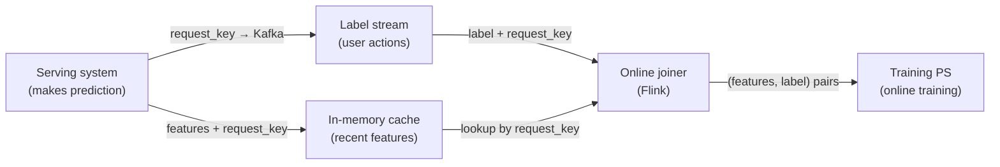

# Monolith: Real-Time Recommendation System With Collisionless Embedding Table

*Liu et al., ByteDance, 2022 — [arXiv:2209.07663](https://arxiv.org/abs/2209.07663)*

| Dimension | Prior State | This Paper | Key Result |
|---|---|---|---|
| Embedding collisions | Hash-trick: 7.73% user / 2.86% movie collision on MovieLens | Cuckoo hash → zero collisions | Higher AUC from epoch 1, production AUC sustained improvement |
| Training freshness | Daily batch retraining; serving model is stale by hours | Online training with minute-level sparse param sync | +14–18% production AUC over 7 days (ads A/B test) |
| Memory footprint | All IDs stored regardless of frequency | Frequency filtering + TTL expiry | Manageable memory at production scale |

## Relations

**Extended by:** [[papers/collisionless-embeddings/mpzch|MPZCH (Zhao et al., 2026)]]

---

## Table of Contents

- [[#1. The Two Problems Monolith Solves|1. The Two Problems Monolith Solves]]
- [[#2. Collisionless Embedding Table|2. Collisionless Embedding Table]]
  - [[#2.1 The Hash Trick and Its Failure Mode|2.1 The Hash Trick and Its Failure Mode]]
  - [[#2.2 Cuckoo Hashing|2.2 Cuckoo Hashing]]
  - [[#2.3 Frequency Filtering|2.3 Frequency Filtering]]
  - [[#2.4 TTL Expiration|2.4 TTL Expiration]]
- [[#3. Online Training Architecture|3. Online Training Architecture]]
  - [[#3.1 Batch vs. Online Training|3.1 Batch vs. Online Training]]
  - [[#3.2 Feature Joining and Streaming|3.2 Feature Joining and Streaming]]
  - [[#3.3 Delta Parameter Synchronization|3.3 Delta Parameter Synchronization]]
- [[#4. Fault Tolerance|4. Fault Tolerance]]
- [[#5. Experiments|5. Experiments]]
- [[#References|References]]

---

## 1. The Two Problems Monolith Solves

Large-scale recommendation systems (TikTok, BytePlus) face two structural problems that standard ML frameworks don't address:

**Problem 1 — Sparse ID explosion.** A recommendation model may have thousands of *sparse features* — user IDs, item IDs, hashtags, creator IDs — each with a vocabulary of millions to billions. These are stored as *embedding tables*: each ID maps to a learned dense vector $\mathbf{e} \in \mathbb{R}^d$. The standard approach is the *hash trick*:

$$\text{slot}(x) = \text{hash}(x) \bmod N$$

where $N$ is a fixed table size much smaller than the true vocabulary. This causes *collisions*: two distinct IDs $x \neq y$ with $\text{hash}(x) \equiv \text{hash}(y) \pmod{N}$ share a single embedding — they cannot be distinguished by the model. On MovieLens, MD5 hashing into a typical table produces 7.73% user and 2.86% movie collision rates, measurably degrading AUC from epoch 1.

**Problem 2 — Concept drift.** User interest in a trending video or a breaking news event can peak and decay within hours. A model trained on yesterday's batch data has already missed the trend. TikTok requires *online training* — continuous model updates from streaming user actions — but standard frameworks (TensorFlow's ParameterServer) were built around batch training and cannot efficiently serve models being updated in real time.

Monolith addresses both problems in a single system: a *collisionless cuckoo-hash embedding table* for Problem 1, and an *online training + delta synchronization architecture* for Problem 2.

---

## 2. Collisionless Embedding Table

### 2.1 The Hash Trick and Its Failure Mode

The hash trick trades correctness for bounded memory. At table size $N$ and vocabulary size $V \gg N$, the expected collision rate for a uniformly random ID is $1 - (1 - 1/N)^{V-1} \approx V/N$ for $V \ll N^2$. In practice, IDs follow a *power-law* distribution — popular IDs appear millions of times, rare IDs appear only once — so the effective collision rate at the high-frequency end is lower, but any collision degrades the model's ability to distinguish the affected entities.

### 2.2 Cuckoo Hashing

Monolith replaces the hash trick with a *cuckoo hash table*, which guarantees zero collisions as long as the table has sufficient capacity.

A cuckoo hash table maintains two sub-tables $T_0, T_1$ of equal size $M$, with two independent hash functions $h_0, h_1$. Every ID $x$ can occupy exactly one of two possible slots: $T_0[h_0(x)]$ or $T_1[h_1(x)]$.

**Insertion algorithm:**

```python
def insert(tables, h, x, max_iters=500):
    # Try to place x; if occupied, evict the resident and re-insert it
    for _ in range(max_iters):
        slot = h[0](x)
        if tables[0][slot] is None:
            tables[0][slot] = x
            return True
        x, tables[0][slot] = tables[0][slot], x  # evict resident
        slot = h[1](x)
        if tables[1][slot] is None:
            tables[1][slot] = x
            return True
        x, tables[1][slot] = tables[1][slot], x  # evict resident
    return False  # cycle detected -> rehash
```

**Lookup** checks exactly two slots — $T_0[h_0(x)]$ and $T_1[h_1(x)]$ — and is always $O(1)$.

**Deletion** is $O(1)$: find the occupied slot of the two candidates and clear it.

> [!NOTE] Cycle detection triggers rehash
> The only failure mode is an insertion *cycle* — the eviction chain revisits a slot without finding a free slot, indicating the table is too full. In practice, cuckoo hashing maintains $O(1)$ amortized insertion when load factor $\alpha = |\text{IDs}|/(2M) \lesssim 0.5$. Cycles are rare in this regime; when detected, the system rehashes with larger $M$.

> [!INFO] Why two tables, not one?
> Single-table cuckoo hashing is also possible (each element has $k>2$ candidate slots), but the two-table variant is simpler to implement and provides the same $O(1)$ worst-case lookup. The two independent hash functions ensure that collisions in $T_0$ do not cluster at the same locations in $T_1$.

> [!QUESTION] Exercise 1: Cuckoo Hash Load Factor Bound
> *This exercise establishes why cuckoo hashing maintains O(1) operations at moderate load.*
>
> > **Prerequisites:** [[#2.2 Cuckoo Hashing|§2.2 Cuckoo Hashing]]
>
> Let $T_0, T_1$ each have $M$ slots. Model each ID's two candidate slots as a random edge in a bipartite graph $G$ with left vertices $[M]$ (slots in $T_0$) and right vertices $[M]$ (slots in $T_1$). An ID $x$ corresponds to the edge $(h_0(x), h_1(x))$.
>
> (a) Show that a cuckoo hash table can accommodate all $n$ IDs without cycles if and only if the bipartite graph $G$ is a *forest* (contains no cycle). Why does a cycle in $G$ imply an insertion failure?
>
> (b) The probability that a random bipartite graph on $2M$ vertices with $n$ edges is acyclic is approximately $\exp(-(n/M)^2 / 2)$ for $n/M$ small. Use this to argue that for $n < M$ (load factor $\alpha < 0.5$), the expected number of rehashes per $n$ insertions is $O(1)$.

> [!TIP]- Solution to Exercise 1
> **Key insight:** A valid cuckoo assignment is a matching in the bipartite graph — each slot in $T_i$ can hold at most one ID. A matching exists if and only if $G$ has no cycle (since a cycle forces at least one slot to hold two edges, violating the one-per-slot constraint).
>
> **(a)** If $G$ has a cycle $x_1 \to x_2 \to \cdots \to x_k \to x_1$, then inserting $x_1$ evicts $x_2$, which evicts $x_3$, …, which tries to evict $x_1$ again — an infinite loop. The algorithm detects this after `max_iters` iterations and reports failure.
>
> **(b)** A random bipartite graph with $n$ edges on $2M$ vertices has expected cycle count $\approx (n/M)^2/2$ for $n \ll M$. For $n < M$, the expected number of cycles is $< 0.5$, so with constant probability the graph is acyclic and no rehash is needed. Across $n$ insertions, the expected total number of rehash-triggering insertions is $O(1)$, giving $O(1)$ amortized cost.

### 2.3 Frequency Filtering

IDs follow a heavy-tailed (power-law) distribution: a tiny fraction of IDs account for most training examples. Assigning a 128-dim embedding to an ID that appears only once wastes memory and provides no useful gradient signal (one gradient update from a single example cannot learn a meaningful embedding).

Monolith applies a two-stage filter:

1. **Occurrence threshold**: An ID is not inserted into the cuckoo table until it has been seen $\geq k_\text{min}$ times (e.g., $k_\text{min} = 5$). Before that, the model uses a zero or default embedding.
2. **Probabilistic pre-filter**: A count-min sketch tracks approximate occurrence counts for all IDs seen so far, allowing the threshold check without storing every distinct ID in memory.

*This directly mirrors the design of [[papers/sampling-bias-corrected-retrieval|Sampling Bias-Corrected Retrieval]], where rare items are downweighted to avoid noise from sparse gradient estimates.*

### 2.4 TTL Expiration

A recommendation system's ID space grows monotonically — new users sign up, new videos are posted. Without eviction, the cuckoo table fills up and eventually rehashing cannot accommodate all IDs.

Monolith assigns each embedding a *time-to-live* (TTL): if an ID has not appeared in any training example for longer than the TTL (configurable per feature type), its slot is freed. This implements an *LRU-like* eviction: inactive users and outdated items are removed, freeing space for fresh IDs.

> [!WARNING] TTL eviction resets the embedding
> When a TTL-expired slot is freed and later reused by a new ID, the new ID inherits the old embedding weights. This *stale embedding inheritance* is a correctness issue: a brand-new video that happens to be assigned the slot of an old, rarely-watched video starts with an embedding biased toward the old video's features. Monolith does not address this explicitly; it is the central motivation for MPZCH's optimizer-state reset mechanism.

---

## 3. Online Training Architecture

### 3.1 Batch vs. Online Training

Monolith distinguishes two training modes:

| Mode | Data Source | Update Frequency | Use Case |
|---|---|---|---|
| Batch training | Historical logs (HDFS) | Daily/weekly full re-train | Architecture changes, cold start |
| Online training | Real-time Kafka stream | Continuous (minute-level sync) | Ongoing operation, concept drift |

In online training, the model sees data in *chronological order* — unlike batch training, which shuffles examples. This is critical for recommendation: the model must learn from today's user behavior to predict tonight's.

### 3.2 Feature Joining and Streaming

A training example for a recommendation model requires two pieces of data that arrive at *different times*:

- **Features**: The context at serve time (user history, candidate item, page state) — available *immediately* when the model makes a prediction.
- **Labels**: The user's eventual action (click, watch, share) — available *seconds to minutes later*.

Monolith's *online joiner* joins these streams:



The `request_key` uniquely identifies each serve event, allowing the joiner to correctly match asynchronous labels to their features. Features that haven't yet received a label are held in cache; after a timeout, they're treated as negative examples (no engagement).

### 3.3 Delta Parameter Synchronization

The training parameter server (PS) and serving PS are separate systems. After online training updates embedding weights, the serving PS must be refreshed — but transferring the full multi-terabyte model every minute is infeasible.

Monolith exploits three properties of recommendation model parameters:

1. **Sparse parameters dominate size** (embedding tables >> dense layers)
2. **Only a small fraction of IDs are trained in any short window** (users/items seen in the last minute)
3. **Dense parameters (MLP weights) change slowly** and don't need frequent sync

The *delta sync* strategy:
- Training PS tracks a **touched-keys set**: the set of IDs whose embeddings were updated since the last sync.
- Every $\Delta t$ minutes, only the embeddings for touched IDs are pushed to the serving PS (~400 MB/min for 100K IDs at 1024 dims, vs. terabytes for a full sync).
- Dense parameters sync daily during low-traffic periods.

> [!EXAMPLE] Why dense params can lag
> A 4-layer MLP with 1024 hidden dims has ~4M parameters — perhaps 16 MB. Even with daily sync, its gradients accumulate across millions of training examples. The effective "staleness" of the dense weights is measured in training steps, not wall-clock time. Sparse embeddings, by contrast, may see only a handful of updates before the model is queried again, so minute-level sync is essential for them.

---

## 4. Fault Tolerance

Monolith explicitly *trades reliability for real-time responsiveness*. The system takes daily snapshots of the full parameter state. On PS shard failure, one day's online training updates are lost for the affected shard's IDs.

The expected impact is bounded: with a 0.01% daily shard failure rate across 1,000 PS shards and 15M daily active users, one shard failure affects $15\text{M} / 1000 \approx 15\text{K}$ users — 0.1% of DAU, losing one day of sparse embedding updates for those users. Given that users return daily and re-generate training signal, the quality loss is transient and negligible.

---

## 5. Experiments

### Collision Impact on Model Quality

**MovieLens** (162,541 users, 59,047 movies, DeepFM model):

| Metric | Hash trick (MD5, collision rate: 7.73% users / 2.86% movies) | Monolith (zero collision) |
|---|---|---|
| AUC @ epoch 1 | Lower | Higher |
| Final AUC | Degraded | Improved |

*Collisionless training improves from epoch 1 — the advantage is not a convergence artifact.*

### Online Training vs. Batch (Criteo Ads, 7-day data)

| Sync interval | Online AUC | Batch AUC |
|---|---|---|
| 5 hours | 79.66 ± 0.020 | 79.42 ± 0.026 |
| 1 hour | 79.78 ± 0.005 | 79.44 ± 0.030 |
| 30 minutes | 79.80 ± 0.008 | 79.43 ± 0.025 |

Shorter sync intervals consistently improve online AUC; batch AUC is flat (no benefit from more frequent sync in batch mode, confirming the benefit is from freshness, not numerical precision).

### Production A/B (Ads Model, 7 days)

Online training vs. batch training AUC delta:

| Day | AUC Improvement |
|---|---|
| 1 | +14.4% |
| 2 | +16.9% |
| 3 | +17.1% |
| 4 | +14.0% |
| 5 | +18.1% |
| 6 | +16.4% |
| 7 | +15.2% |

**Consistent 14–18% AUC gains** across all 7 days, demonstrating that real-time training is not a marginal improvement but a qualitative shift in the system's ability to track user behavior.

---

## References

| Reference | Brief Summary | Link |
|---|---|---|
| [Monolith: Real-Time Recommendation System With Collisionless Embedding Table](https://arxiv.org/abs/2209.07663) | ByteDance system paper: cuckoo-hash embedding tables + online training architecture for TikTok | [arXiv:2209.07663](https://arxiv.org/abs/2209.07663) |
| [MPZCH: Multi-Probe Zero Collision Hash](https://arxiv.org/abs/2602.17050) | Successor technique: linear probing with TTL/LRU eviction + optimizer reset; zero collisions at 3B MAU scale | [arXiv:2602.17050](https://arxiv.org/abs/2602.17050) |
| [Sampling Bias-Corrected Neural Modeling for Large Corpus Item Recommendations](https://dl.acm.org/doi/10.1145/3298689.3346996) | Google's approach to frequency-aware item sampling in retrieval; thematically adjacent to frequency filtering | [ACM DL](https://dl.acm.org/doi/10.1145/3298689.3346996) |
| [Cuckoo Hashing (Pagh & Rodler, 2001)](https://www.brics.dk/RS/01/32/BRICS-RS-01-32.pdf) | Original cuckoo hashing paper; proves O(1) worst-case lookup and O(1) amortized insertion | [BRICS](https://www.brics.dk/RS/01/32/BRICS-RS-01-32.pdf) |
