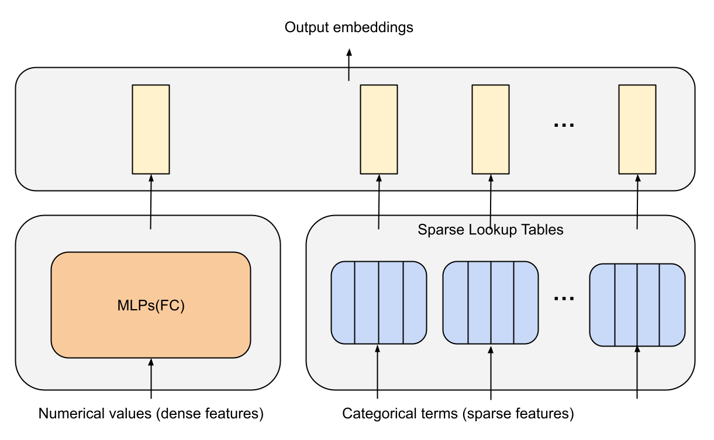
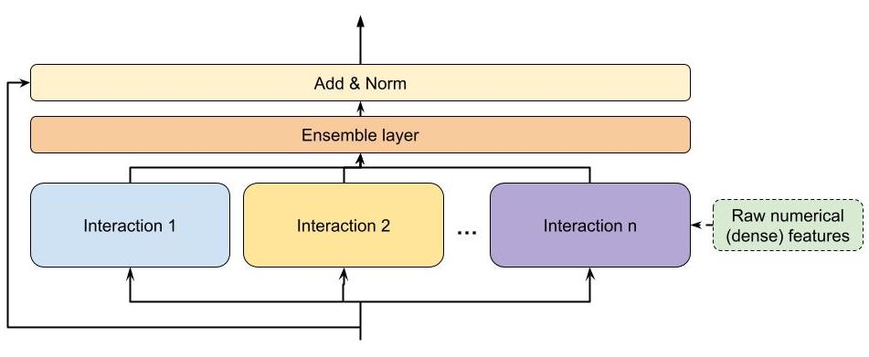
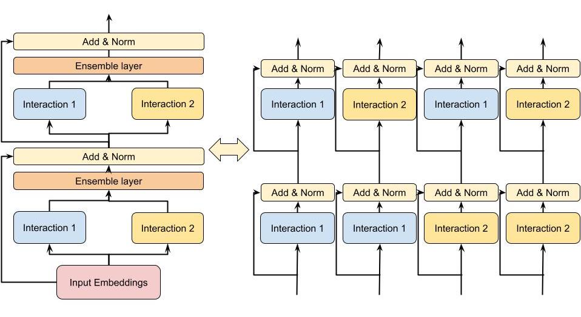
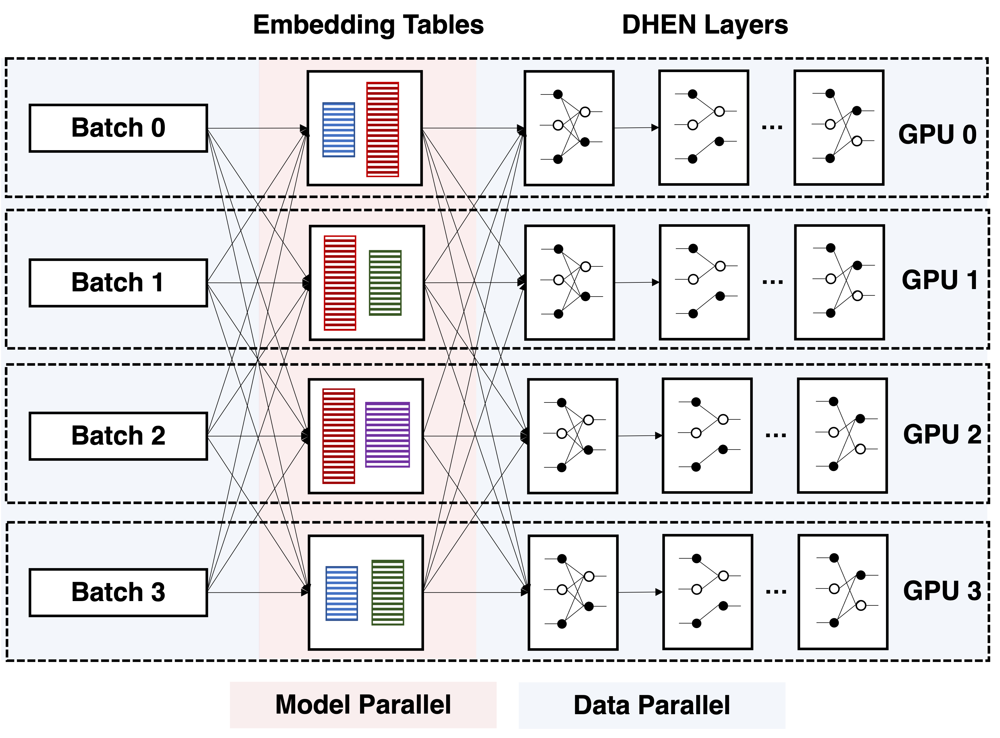
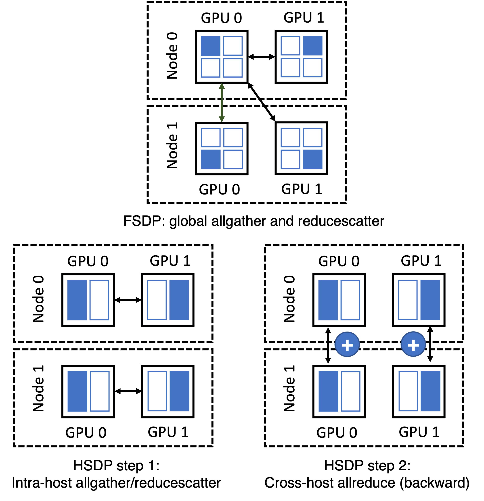
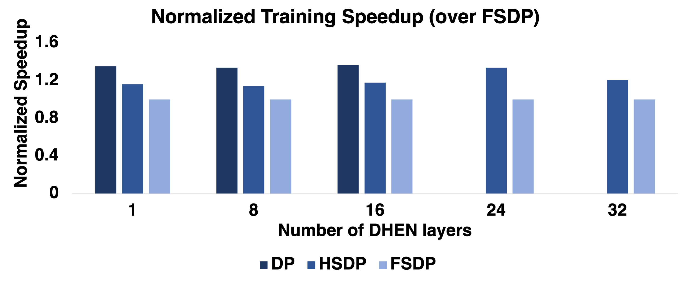

# DHEN: A Deep and Hierarchical Ensemble Network for Large-Scale Click-Through Rate Prediction

Buyun Zhang, Liang Luo, Xi Liu, Jay Li, Zeliang Chen, Weilin Zhang, Xiaohan Wei, Yuchen Hao, Michael Tsang, Wenjun Wang, Yang Liu, Huayu Li, Yasmine Badr, Jongsoo Park, Jiyan Yang, Dheevatsa Mudigere, Ellie Wen. KDD 2022. Meta Platforms, Inc.

| Dimension | Prior State | This Paper | Key Result |
|---|---|---|---|
| Model architecture | Single interaction module stacked homogeneously (DCN, AutoInt, xDeepFM, etc.) | Hierarchical ensemble of heterogeneous interaction modules stacked in multiple layers | +0.27% NE improvement over AdvancedDLRM (= −0.273% NE at 25B examples) |
| Interaction modeling | One module type per model; high-order interactions from deeper stacking of the same block | Five module types (AdvancedDLRM, self-attention, DCN, linear, convolution) combined per layer; each layer feeds into the next | $k^N$ distinct interaction compositions with $k$ modules and $N$ layers |
| Ensemble approach | Implicit (ensemble by training multiple separate models) or absent | Explicit intra-layer ensemble with residual shortcut; ensemble output is the next layer's input | Heterogeneous ensemble outperforms every individual module and homogeneous stack at all depths |
| Training | Standard data parallel or model parallel; DP limited to model sizes fitting in per-GPU HBM | Hybrid Sharded Data Parallel (HSDP): shard within host over NVLink, allreduce across hosts | HSDP achieves 1.2x throughput over FSDP on a 256-GPU cluster |
| Empirical gains | State-of-the-art AdvancedDLRM (internal Meta baseline) | +0.27% NE improvement; 1.2x training throughput over FSDP on a 256-GPU cluster | DHEN outperforms MoE at matched FLOPs: -0.26% NE vs. -0.10% NE at ~5G FLOPs |

## Relations

**Extended by:** [[papers/generative-recommenders/wukong|Wukong]], [[papers/generative-recommenders/hstu|HSTU]]
**Concepts used:** [[concepts/ab-testing/foundations|A/B Testing Foundations]]

## Table of Contents

- [[#1. Motivation and Background|1. Motivation and Background]]
  - [[#1.1 Limitations of Prior Ranking Architectures|1.1 Limitations of Prior Ranking Architectures]]
  - [[#1.2 The Non-Overlapping Information Hypothesis|1.2 The Non-Overlapping Information Hypothesis]]
- [[#2. Architecture Overview|2. Architecture Overview]]
  - [[#2.1 Feature Processing Layer|2.1 Feature Processing Layer]]
  - [[#2.2 The DHEN Layer: Formal Definition|2.2 The DHEN Layer: Formal Definition]]
- [[#3. Feature Interaction Modules|3. Feature Interaction Modules]]
  - [[#3.1 AdvancedDLRM|3.1 AdvancedDLRM]]
  - [[#3.2 Self-Attention|3.2 Self-Attention]]
  - [[#3.3 Deep Cross Net|3.3 Deep Cross Net]]
  - [[#3.4 Linear|3.4 Linear]]
  - [[#3.5 Convolution|3.5 Convolution]]
- [[#4. Hierarchical Ensemble|4. Hierarchical Ensemble]]
  - [[#4.1 Ensemble Aggregation|4.1 Ensemble Aggregation]]
  - [[#4.2 Residual Shortcut and Dimension Matching|4.2 Residual Shortcut and Dimension Matching]]
  - [[#4.3 Stacking and Mixture of High-Order Interactions|4.3 Stacking and Mixture of High-Order Interactions]]
- [[#5. Relation to Prior Work|5. Relation to Prior Work]]
- [[#6. Training and System Details|6. Training and System Details]]
  - [[#6.1 Distributed Training Strategy|6.1 Distributed Training Strategy]]
  - [[#6.2 Fully Sharded Data Parallel|6.2 Fully Sharded Data Parallel]]
  - [[#6.3 Hybrid Sharded Data Parallel|6.3 Hybrid Sharded Data Parallel]]
  - [[#6.4 Common Optimizations|6.4 Common Optimizations]]
- [[#7. Experiments|7. Experiments]]
  - [[#7.1 Setup|7.1 Setup]]
  - [[#7.2 Interaction Module Ablation|7.2 Interaction Module Ablation]]
  - [[#7.3 DHEN vs. AdvancedDLRM|7.3 DHEN vs. AdvancedDLRM]]
  - [[#7.4 Scaling Efficiency vs. Mixture of Experts|7.4 Scaling Efficiency vs. Mixture of Experts]]
  - [[#7.5 Training Throughput|7.5 Training Throughput]]
- [[#8. References|8. References]]

---

## 1. Motivation and Background

*Click-through rate* (CTR) prediction is the core inference task in online advertising: given a user context and an ad candidate, estimate $p(\text{click} \mid \text{user}, \text{ad})$. The revenue implications are enormous; the US digital ad market reached \$284.3B in 2021.

### 1.1 Limitations of Prior Ranking Architectures

The evolution of ranking models follows a rough trajectory:

1. **Linear models** (logistic regression): $p = \sigma(\mathbf{w}^\top \mathbf{x})$. Cannot capture non-linear feature interactions.
2. ***Factorization Machines* (FM)**: Model second-order interactions via latent embeddings, $\hat{y} = w_0 + \sum_i w_i x_i + \sum_{i<j} \langle \mathbf{v}_i, \mathbf{v}_j \rangle x_i x_j$. Shallow; limited expressivity.
3. **Deep FM / Wide & Deep / DCN / xDeepFM / AutoInt**: Stack a deep neural network alongside or on top of an explicit interaction module to capture high-order interactions. These all share a common structural limitation: each model is built around a *single type* of interaction module, homogeneously stacked.

The paper identifies three concrete limitations of the homogeneous-stacking paradigm:

- **Performance variance across datasets.** Different interaction modules (claiming the same bounded interaction degree) achieve different rankings on different datasets, indicating that the information they capture is not identical.
- **Diminishing or negative returns from depth.** Empirically, stacking more layers of the same module can *hurt* performance (documented in DCN Figure 3, xDeepFM Figure 7a, InterHAt Figure 4, xDeepInt Table 2, GIN Figure 3a). This is theoretically surprising: higher-order interactions should be at least as expressive.
- **No mechanism to capture module correlations.** A homogeneous stack cannot learn how the outputs of *different* interaction types relate to one another.

### 1.2 The Non-Overlapping Information Hypothesis

The paper's central hypothesis is:

> Different interaction modules — even those designed to capture the same order of interaction — encode *non-overlapping information* about the feature space.

This motivates an ensemble of *heterogeneous* modules within each layer. Rather than depth alone yielding richer interactions, the combination of diverse module outputs yields complementary signal. The hierarchical stacking of such ensemble layers then compounds the benefit across orders.

---

## 2. Architecture Overview

DHEN follows the same high-level template as modern vision and NLP architectures (ResNet, Transformer, MetaFormer): a deep stacking structure where a repeating block processes inputs recursively. The novelty is that each block is not a single interaction module, but a *hierarchical ensemble* of heterogeneous interaction modules.

The full DHEN pipeline is:

$$\text{raw features} \;\longrightarrow\; \text{Feature Processing Layer} \;\longrightarrow\; \underbrace{[\text{DHEN Layer}] \;\times\; N}_{\text{hierarchical ensemble}} \;\longrightarrow\; \text{prediction head}$$

### 2.1 Feature Processing Layer

CTR inputs contain two feature types:

- ***Sparse* (categorical) features**: mapped via *embedding lookup* tables. Each categorical term is assigned a trainable $d$-dimensional vector.
- ***Dense* (numerical) features**: processed by a stack of MLP layers to produce a $d$-dimensional vector.

After concatenation, the output of the feature processing layer is:

$$X^0 = (x^0_1, x^0_2, \ldots, x^0_m) \in \mathbb{R}^{d \times m}$$

where $m$ is the total number of output embedding slots (sparse lookups plus dense MLP outputs) and $d$ is the embedding dimension. This representation $X^0$ is the input to the first DHEN layer.


*Figure 3 (Zhang et al., 2022): The feature processing layer in DHEN — sparse categorical features go through embedding lookup tables while dense numerical features go through MLP layers; outputs are concatenated to form $X^0 \in \mathbb{R}^{d \times m}$.*

### 2.2 The DHEN Layer: Formal Definition

Let $X_n \in \mathbb{R}^{d \times m}$ denote the embedding matrix input to the $n$-th DHEN layer (with $X_0 \equiv X^0$). The output of a single DHEN layer is:

$$Y = \text{Norm}\!\left(\operatorname{Ensemble}_{i=1}^{k} \operatorname{Interaction}_i(X_n) + \operatorname{ShortCut}(X_n)\right) \tag{1}$$

where:

$$\operatorname{ShortCut}(X_n) = \begin{cases} X_n & \text{if } \operatorname{len}(X_n) = \operatorname{len}(Y) \\ W_n X_n & \text{if } \operatorname{len}(X_n) \neq \operatorname{len}(Y) \end{cases} \tag{2}$$

- $\text{Norm}(\cdot)$ is *layer normalization*.
- $\operatorname{Ensemble}_{i=1}^{k}$ denotes an aggregation function over $k$ interaction module outputs; options include concatenation, sum, or weighted sum.
- $W_n \in \mathbb{R}^{\operatorname{len}(X_n) \times \operatorname{len}(Y)}$ is a learned linear projection applied only when dimension mismatch occurs.
- The output $Y$ becomes the input $X_{n+1}$ to the next layer.

The shortcut plays a dual role: it acts as a *residual shortcut* (stabilizing gradient flow across depth) and as a dimension-matching projection.


*Figure 1 (Zhang et al., 2022): A general DHEN hierarchical ensemble building block. Multiple heterogeneous interaction modules run in parallel on the same input $X_n$; their outputs are aggregated (ensemble), added to a residual shortcut from $X_n$, and normalized to produce the next layer's input $X_{n+1}$.*

> [!QUESTION] Exercise 1: DHEN Forward Pass with Tensor Shapes
> *A complete DHEN forward pass with shape tracking reveals where tensor dimensions change and where projections are required. This problem builds the full forward pass pseudocode for a 2-layer DHEN with self-attention and linear modules.*
>
> (a) **Data structures and inputs.** Define all parameters and inputs needed for a 2-layer DHEN with self-attention + linear modules, concatenation aggregation, and layer normalization. For batch size $B$, $m$ feature slots, embedding dimension $d$, attention head dimension $d_k$, and $h$ attention heads: list every parameter tensor with its shape.
>
> (b) **Per-layer pseudocode.** Write the pseudocode for one DHEN layer, annotating every intermediate tensor with shape $(B, d, m)$ or equivalent. Include: (i) self-attention module forward; (ii) linear module forward; (iii) concatenation ensemble; (iv) shortcut (identity or projection); (v) LayerNorm.
>
> (c) **Full 2-layer forward pass.** Chain two DHEN layers and add the prediction head (flatten + MLP + sigmoid). Annotate the complete data flow from input $X_0 \in \mathbb{R}^{B \times d \times m}$ to output $\hat{p} \in \mathbb{R}^B$. Identify all points where a projection is required due to dimension mismatch.

> [!SUCCESS]- Solution 1
> **Key insight:** Concatenation aggregation forces the shortcut to apply a learned projection whenever $kl \neq m$; tracking shapes explicitly at each step reveals exactly which operations require projection parameters.
>
> **Sketch:**
>
> (a) **Parameters for 2-layer DHEN (self-attention + linear, concat aggregation):**
> ```
> # Attention: W^Q, W^K, W^V each (d, d_k * h); W^O: (d_v * h, d)
> # Linear: W_lin: (m, l)  -- maps embedding count m -> l
> # Concatenation output per layer: d x (l_attn + l_lin) = d x 2l  (if l_attn = l_lin = l)
> # Shortcut projection (if 2l != m): W_sc: (m, 2l)
> # LayerNorm: gamma, beta: (d,) each
> # Prediction head: W_head: (d * 2l, hidden), ...
> ```
>
> (b) **One DHEN layer pseudocode (batch dim B suppressed):**
> ```
> def dhen_layer(Xn, params):
>     # Xn: (B, d, m)
>     u_attn = attention(Xn, W_Q, W_K, W_V, W_O)  # (B, d, l)
>     u_lin  = linear(Xn, W_lin)                   # (B, d, l)
>     ensemble = concat([u_attn, u_lin], dim=-1)   # (B, d, 2l)
>     if 2l == m:
>         shortcut = Xn                             # (B, d, m)
>     else:
>         shortcut = Xn @ W_sc                      # (B, d, 2l): W_sc (m, 2l)
>     Y = LayerNorm(ensemble + shortcut)            # (B, d, 2l)
>     return Y
> ```
>
> (c) **Full 2-layer forward pass:**
> ```
> X0: (B, d, m)          # feature processing output
> X1 = dhen_layer(X0)    # (B, d, 2l) -- projection needed if 2l != m
> X2 = dhen_layer(X1)    # (B, d, 2l) -- identity shortcut if dims match
> flat = reshape(X2, (B, d*2l))
> logits = MLP(flat)     # (B, 1)
> p_hat = sigmoid(logits)  # (B,)
> # Projection required: at layer 1 shortcut (if 2l != m);
> # layer 2 shortcut is identity if output dim of layer 1 = 2l.
> ```

---

## 3. Feature Interaction Modules

Each interaction module $\operatorname{Interaction}_i$ takes $X_n \in \mathbb{R}^{d \times m}$ as input and produces a list of embeddings $u \in \mathbb{R}^{d \times l}$, where $l$ is the output embedding count (potentially different from $m$). When a module instead outputs a single tensor $v \in \mathbb{R}^{1 \times h}$ (as in MLP-style modules), a projection $W_m \in \mathbb{R}^{h \times (d \cdot l)}$ maps it to the embedding list format.

### 3.1 AdvancedDLRM

AdvancedDLRM is a DLRM-style interaction module (the in-house production baseline at Meta). Given input embeddings $X_n$, the module computes pairwise dot-product interactions among all embedding pairs, concatenates them with dense features, and passes the result through MLP layers. Formally:

$$u = W_m \cdot \operatorname{AdvancedDLRM}(X_n) \tag{3}$$

The internal DLRM interaction step computes all inner products $\langle x_i, x_j \rangle$ for $i \leq j$, producing an explicit second-order feature crossing. The subsequent MLP layers lift this to effectively higher-order implicit interactions.

> [!QUESTION] Exercise 2: FM Complexity Reduction via the Kernel Trick
> *The Factorization Machine second-order term naively requires $O(m^2 d)$ operations for $m$ features of dimension $d$. This problem establishes the $O(md)$ identity that makes FM-style interactions tractable, and traces its consequence for the AdvancedDLRM computation.*
>
> (a) Let $v_i \in \mathbb{R}^d$ for $i = 1, \ldots, m$ and let $x_i \in \mathbb{R}$ be scalar feature values. Prove the identity
>
> $$\sum_{i < j} \langle v_i, v_j \rangle x_i x_j = \frac{1}{2}\left[\left\|\sum_{i=1}^m x_i v_i\right\|^2 - \sum_{i=1}^m x_i^2 \|v_i\|^2\right]$$
>
> and show this reduces the computation from $O(m^2 d)$ to $O(md)$.
>
> (b) For binary features ($x_i \in \{0, 1\}$), let $\mathcal{A} = \{i : x_i = 1\}$ be the set of active features. Show that the identity from (a) reduces to
>
> $$\sum_{i < j,\, i,j \in \mathcal{A}} \langle v_i, v_j \rangle = \frac{1}{2}\left[\left\|\sum_{i \in \mathcal{A}} v_i\right\|^2 - \sum_{i \in \mathcal{A}} \|v_i\|^2\right]$$
>
> and interpret this as "sum pooling then squared norm minus self-norms," which is the computation used in DLRM's embedding interaction step.
>
> (c) AdvancedDLRM retains all individual pairwise scores $s_{ij} = \langle v_i, v_j \rangle$ before passing them to an MLP. Show that the FM trick output is a fixed linear combination of $\{s_{ij}\}$ (specifically with coefficient 1 for all pairs), whereas retaining individual scores allows the downstream MLP to learn an arbitrary function $f(s_{11}, \ldots, s_{mm})$. Conclude that the FM trick is a strict computational relaxation of the full pairwise approach, trading expressivity for efficiency.

> [!SUCCESS]- Solution 2
> **Key insight:** The squared-norm identity converts the $O(m^2)$ sum over pairs into a single $O(m)$ accumulation by exploiting the bilinearity of the inner product.
>
> **Sketch:**
>
> (a) Expand $\|\sum_i x_i v_i\|^2 = \sum_i x_i^2 \|v_i\|^2 + 2\sum_{i < j} x_i x_j \langle v_i, v_j \rangle$. Rearranging gives the identity. The right-hand side requires one pass to compute $s = \sum_i x_i v_i$ ($O(md)$), one pass for $\sum_i x_i^2 \|v_i\|^2$ ($O(md)$), and one norm ($O(d)$): total $O(md)$ vs. the naive $O(m^2 d)$.
>
> (b) For $x_i \in \{0,1\}$, $x_i^2 = x_i$, so the identity becomes $\sum_{i < j, i,j \in \mathcal{A}} \langle v_i, v_j \rangle = \frac{1}{2}[\|\sum_{i \in \mathcal{A}} v_i\|^2 - \sum_{i \in \mathcal{A}} \|v_i\|^2]$. This is exactly "sum active embeddings, square, subtract self-norms," recovering DLRM's sum-pooling interaction.
>
> (c) The FM trick output is $\sum_{i<j} s_{ij} = \frac{1}{2}[\|\sum x_i v_i\|^2 - \sum x_i^2 \|v_i\|^2]$, which is a fixed linear combination of $\{s_{ij}\}$ with all coefficients 1. Retaining the full vector $(s_{ij})_{i<j} \in \mathbb{R}^{\binom{m}{2}}$ and applying an MLP allows learning any function $f: \mathbb{R}^{\binom{m}{2}} \to \mathbb{R}$, a strictly richer function class.

### 3.2 Self-Attention

*[[concepts/attention-mechanisms/standard-attention|Self-attention]]*, the core of Transformer encoders, was introduced to CTR tasks in AutoInt and InterHAt. For DHEN, the module applies a standard Transformer encoder layer:

$$u = W \cdot \operatorname{TransformerEncoderLayer}(X_n) \tag{4}$$

where $W \in \mathbb{R}^{m \times l}$ projects the output to the shared embedding list dimension.

The Transformer encoder layer computes multi-head scaled dot-product attention:

$$\operatorname{Attn}(Q, K, V) = \operatorname{softmax}\!\left(\frac{QK^\top}{\sqrt{d_k}}\right) V$$

with $Q = X_n W^Q$, $K = X_n W^K$, $V = X_n W^V$. This captures *feature-wise* interactions: the attention weights $A_{ij} = \operatorname{softmax}(\cdot)_{ij}$ indicate how much feature $i$ attends to feature $j$, enabling adaptive, content-dependent interaction modeling.

> [!QUESTION] Exercise 3: Self-Attention as Data-Dependent Feature Recombination
> *Self-attention produces outputs that are non-linear data-dependent linear combinations of value vectors. This problem makes precise what "feature-level interaction" means for the attention module and contrasts it with bit-level interactions from DCN.*
>
> (a) For a single attention head with input $X \in \mathbb{R}^{m \times d}$ (rows are feature embeddings), define $Q = XW^Q$, $K = XW^K$, $V = XW^V$. Write the output at feature position $i$ as
>
> $$z_i = \sum_{j=1}^m A_{ij} (x_j W^V), \qquad A_{ij} = \operatorname{softmax}_j\!\left(\frac{q_i k_j^\top}{\sqrt{d_k}}\right)$$
>
> Show that $A_{ij}$ depends on $x_i$ and $x_j$ only through the scalar $q_i k_j^\top = x_i W^Q (x_j W^K)^\top$, making each attention weight a function of a single inner product between projected features.
>
> (b) Show that $z_i$ is a weighted average of value vectors $\{x_j W^V\}$, where the weights $A_{ij}$ sum to 1 and depend on the entire input $X$ (not just $x_i$). Conclude that the output at position $i$ is not a polynomial of bounded degree in the entries of $X$, because the softmax normalization makes $A_{ij}$ a rational function of all inner products $\{q_i k_{j'}^\top\}_{j'=1}^m$.
>
> (c) The DCN cross module in DHEN computes $u = W(X X^\top) + b$. Show that this operates on the outer product $X X^\top \in \mathbb{R}^{m \times m}$, where entry $(i,j)$ is the inner product $\langle x_i, x_j \rangle$ across all embedding dimensions simultaneously. Contrast: in DCN, the interaction weight between features $i$ and $j$ is fixed (given by $\langle x_i, x_j \rangle$ summed over all dimensions); in attention, the interaction weight $A_{ij}$ is computed in a subspace determined by $W^Q, W^K$. Formalize this distinction.

> [!SUCCESS]- Solution 3
> **Key insight:** The attention weight $A_{ij}$ is a softmax-normalized inner product of projected features, making the output a rational function of the input — not a polynomial — which puts attention outside the expressive class of any DCN with finite depth.
>
> **Sketch:**
>
> (a) $A_{ij} = \frac{\exp(q_i k_j^\top / \sqrt{d_k})}{\sum_{j'} \exp(q_i k_{j'}^\top / \sqrt{d_k})}$ where $q_i = x_i W^Q$ and $k_j = x_j W^K$. Each $q_i k_j^\top = x_i W^Q (W^K)^\top x_j^\top$ is a scalar quadratic in the input, making $A_{ij}$ a ratio of exponentials of quadratics in $\{x_j\}$.
>
> (b) $z_i = \sum_j A_{ij} x_j W^V$ is a convex combination (weights sum to 1) of value vectors. The weights $A_{ij}$ depend on all inputs $\{x_{j'}\}$ through the softmax denominator, making $z_i$ a non-polynomial rational function of the entire input matrix $X$.
>
> (c) DCN computes $u = W(XX^\top) + b$ where entry $(i,j)$ of $XX^\top$ is $\langle x_i, x_j \rangle = \sum_r x_i[r] x_j[r]$ — a sum over all $d$ embedding dimensions. Attention computes $q_i k_j^\top = \sum_r (x_i W^Q)_r (x_j W^K)_r$ — a sum in the projected subspace of dimension $d_k < d$. DCN's interaction weight is a fixed bilinear form in the full embedding space; attention's is a learned bilinear form in a lower-dimensional subspace, but made adaptive via softmax normalization.

### 3.3 Deep Cross Net

Deep Cross Net (DCN, Wang et al. 2017) introduces a *cross network* that efficiently learns bounded-degree feature interactions. In DHEN's formulation:

$$u = W \cdot (X_n X_n^\top) + b \tag{7}$$

where $W$ and $b$ are learned weight and bias matrices. This can be understood as a bilinear transformation over the outer product $X_n X_n^\top \in \mathbb{R}^{m \times m}$, which encodes all pairwise embedding interactions. The paper notes that the skip connection from the original DCN paper is omitted since DHEN already provides skip connections via the $\operatorname{ShortCut}$ mechanism at the layer level.

The key distinction from self-attention is that DCN operates at the *bit-level interaction* level (individual scalar dimensions within embedding vectors), whereas self-attention operates at the *feature-level interaction* level (entire embedding vectors as units).

> [!QUESTION] Exercise 4: DCN Cross Network Polynomial Degree via Induction
> *The DCN cross network produces feature interactions of bounded polynomial degree. This problem proves the tight degree bound by induction and identifies the exact leading-degree term at each layer, making precise why stacking more cross layers yields higher-order interactions.*
>
> (a) The DCN cross recurrence is $x_{\ell+1} = x_0 (x_\ell^\top w_\ell) + b_\ell + x_\ell$, where $x_\ell, x_0, b_\ell \in \mathbb{R}^d$ and $w_\ell \in \mathbb{R}^d$. Prove by induction on $\ell$ that $x_\ell$ is a polynomial in the components of $x_0$ of degree exactly $\ell + 1$. Explicitly identify the degree-$(\ell+1)$ monomial term at each step of the induction.
>
> (b) Show that no degree-$(\ell+2)$ term can appear in $x_\ell$: the inductive step multiplies degree-$\ell$ terms by $x_0$ (degree 1), giving degree $\ell+1$ at most. Conclude that a DCN with $L$ cross layers captures feature interactions of degree at most $L+1$, establishing the tight upper bound.
>
> (c) In a stack of $N$ DHEN layers, each layer's DCN module takes the previous layer's output $X_n$ both as its input and as its cross-layer anchor $x_0^{(n)}$. Prove by induction on $N$ that the maximum polynomial degree of the final output satisfies the recurrence $D_{N+1} = D_N \cdot (L+1)$ when each layer applies $L$ cross operations with the updated anchor, giving $D_N = (L+1)^N$. Explain precisely why this multiplicative recurrence holds across layers (where the anchor changes) but NOT within a single DCN module (where $x_0$ is fixed and degree grows additively as $D_0 + \ell$ after $\ell$ operations).

> [!SUCCESS]- Solution 4
> **Key insight:** Each cross step multiplies the current iterate by the scalar $x_\ell^\top w_\ell$, raising the polynomial degree by exactly 1, so the degree grows linearly with layer count and is tight.
>
> **Sketch:**
>
> (a) Base case: $x_1 = x_0(x_0^\top w_0) + b_0 + x_0$; the term $x_0(x_0^\top w_0)$ has degree 2 in $x_0$ components. Inductive step: $x_{\ell+1} = x_0(x_\ell^\top w_\ell) + b_\ell + x_\ell$. The product $x_0 \cdot (x_\ell^\top w_\ell)$ multiplies degree-1 ($x_0$) by degree-$\ell$ ($x_\ell^\top w_\ell$), giving degree $\ell+1$. The term $x_\ell$ has degree $\ell$. So $\deg(x_{\ell+1}) = \ell + 1$.
>
> (b) For degree $\ell+2$ to appear in $x_{\ell+1}$, we would need $\deg(x_0) \cdot \deg(x_\ell^\top w_\ell) \geq \ell + 2$, i.e., $1 \cdot \ell \geq \ell+1$, which is false. So the upper bound $\ell+1$ is tight.
>
> (c) Within a single DCN module (fixed anchor $x_0$), each cross layer adds 1 to the degree — additive growth. Across DHEN layers, the anchor updates to the previous output, turning additive growth into multiplicative: degree $L+1$ output from layer $n$ becomes the degree-$(L+1)$ anchor for layer $n+1$, whose $L$ cross ops give degree $(L+1)+(L+1)\cdot L = (L+1)^2$. Induction: $D_1 = L+1$, $D_{N+1} = D_N\cdot(L+1)$, so $D_N = (L+1)^N$. A plain depth-$NL$ DCN achieves degree $NL+1$. Since $(L+1)^N \gg NL+1$ for $N, L \geq 2$, hierarchical stacking yields super-linear degree growth.

> [!QUESTION] Exercise 5: The Full Jacobian of a DCN Cross Layer
> *The DCN cross operation $x_{\ell+1} = x_0(x_\ell^\top w_\ell) + b_\ell + x_\ell$ has a Jacobian with a specific rank-1 plus identity structure. Computing this Jacobian exactly clarifies why DCN gradients are well-conditioned by construction.*
>
> (a) Treating $x_0$ as a fixed input and $x_\ell$ as the variable, compute the Jacobian $J_\ell = \frac{\partial x_{\ell+1}}{\partial x_\ell} \in \mathbb{R}^{d \times d}$. Show that it factors as
>
> $$J_\ell = I + x_0 w_\ell^\top$$
>
> a rank-1 update of the identity matrix.
>
> (b) Using the matrix determinant lemma, show that $\det(J_\ell) = 1 + w_\ell^\top x_0$. Derive the condition on $w_\ell$ and $x_0$ under which $J_\ell$ is invertible, and write the inverse explicitly using the Sherman-Morrison formula.
>
> (c) The singular values of $J_\ell = I + x_0 w_\ell^\top$ determine gradient magnification or attenuation. Show that $J_\ell$ has $d-1$ singular values equal to 1 and one singular value equal to $\sqrt{1 + \|x_0\|^2 \|w_\ell\|^2 + (w_\ell^\top x_0)^2}$ (approximately). Conclude that the DCN cross layer cannot cause exponential gradient vanishing even without explicit residual shortcuts — the Jacobian is inherently near-identity.

> [!SUCCESS]- Solution 5
> **Key insight:** The rank-1 update structure $J_\ell = I + x_0 w_\ell^\top$ follows directly from differentiating the cross recurrence, and the Sherman-Morrison formula then gives the inverse and singular-value structure in closed form.
>
> **Sketch:**
>
> (a) $x_{\ell+1} = x_0(x_\ell^\top w_\ell) + b_\ell + x_\ell$. Differentiating with respect to $x_\ell$: $\frac{\partial x_{\ell+1}}{\partial x_\ell} = x_0 w_\ell^\top + I$. This is exactly $J_\ell = I + x_0 w_\ell^\top$.
>
> (b) Matrix determinant lemma: $\det(I + uv^\top) = 1 + v^\top u$. So $\det(J_\ell) = 1 + w_\ell^\top x_0$; $J_\ell$ is invertible iff $w_\ell^\top x_0 \neq -1$. By Sherman-Morrison: $J_\ell^{-1} = I - \frac{x_0 w_\ell^\top}{1 + w_\ell^\top x_0}$.
>
> (c) $J_\ell = I + x_0 w_\ell^\top$ is a rank-1 perturbation of the identity. All singular vectors orthogonal to both $x_0$ and $w_\ell$ have singular value 1. The remaining two-dimensional subspace has singular values $\approx 1 \pm \|x_0\|\|w_\ell\|$ (to first order). Since all singular values are $O(1)$ for bounded weights, the cross layer cannot cause exponential gradient explosion or vanishing.

> [!QUESTION] Exercise 6: Bit-Level vs. Feature-Level Interaction
> *DHEN combines modules that operate at different granularities: DCN mixes individual scalar dimensions ("bit-level"), while self-attention treats each embedding vector as an atomic unit ("feature-level"). This problem formalizes the distinction and shows neither class subsumes the other.*
>
> (a) DCN's cross operation applied to $x \in \mathbb{R}^{md}$ (a flattened embedding matrix) produces a scalar interaction $x^\top w$ and multiplies it back into $x_0$. Show that this is equivalent to a bilinear form $x_0^\top M x$ with $M = w \mathbf{1}^\top$ (rank-1). In particular, every scalar coordinate of $x_0$ gets scaled by the same global scalar $x^\top w$, mixing all embedding dimensions uniformly.
>
> (b) Self-attention produces, at position $i$, an output $z_i = \sum_j A_{ij} x_j W^V$. Show that $z_i$ mixes only the embedding dimension via the projection $W^V$, and that the combination coefficients $A_{ij}$ act at the level of whole feature vectors (not individual scalar dimensions). Specifically, $[z_i]_r = \sum_j A_{ij} \sum_s x_j[s] W^V[s,r]$: the mixing of embedding dimension $s$ into output dimension $r$ is the same for every feature $j$ (governed by $W^V$).
>
> (c) Give a concrete example of an interaction that DCN can represent but attention cannot (in a single layer), and one that attention can represent but DCN cannot. Conclude that the two are complementary, providing formal justification for including both in an ensemble.

> [!SUCCESS]- Solution 6
> **Key insight:** DCN's scalar $x^\top w$ scales the entire vector $x_0$ uniformly (bit-level: all embedding dimensions get the same multiplicative update), while attention's $A_{ij}$ scales entire feature vectors $x_j$ (feature-level: all embedding dimensions of feature $j$ are weighted together).
>
> **Sketch:**
>
> (a) DCN cross: $x_{\ell+1}[r] = x_0[r] \cdot (x_\ell^\top w) + x_\ell[r]$ for all dimensions $r$. The scalar $x_\ell^\top w = \sum_s x_\ell[s] w[s]$ mixes all dimensions $s$ of $x_\ell$ into one number, then this single number multiplies every dimension $r$ of $x_0$. In bilinear form: $x_0^\top M x$ with $M = w \mathbf{1}^\top$ (rank 1, same row for all output dimensions).
>
> (b) Attention: $[z_i]_r = \sum_j A_{ij} \sum_s x_j[s] W^V[s,r]$. The embedding dimension mixing $\sum_s x_j[s] W^V[s,r]$ is governed by $W^V$ and is the same for every feature $j$; the per-feature weighting $A_{ij}$ does not mix embedding dimensions. So attention weights whole feature vectors, not individual scalars.
>
> (c) DCN can represent: "global importance weighting" — scaling all output dimensions by the same feature cross score. Attention cannot do this in a single layer (it must use $W^V$ uniformly). Attention can represent: "select a specific feature subset based on content" (e.g., $A_{ij} \approx 1$ for one $j$ and 0 elsewhere), which DCN cannot do (DCN's output is always a function of $x_0$ scaled by a global scalar). These examples confirm the modules are incomparable and complementary.

> [!QUESTION] Exercise 7: DCN Cross Layer as a Bilinear Operation
> *The DCN-V2 cross layer has a low-rank factorization that reduces its dominant $O(d^2)$ cost to $O(dr)$. This problem develops the pseudocode for both the full and low-rank variants and assembles the complete DCN module used in DHEN.*
>
> (a) **Full cross layer pseudocode.** Write pseudocode for the DCN-V2 cross layer $x_{\ell+1} = x_0 \odot (W_\ell x_\ell + b_\ell) + x_\ell$ where $W_\ell \in \mathbb{R}^{d \times d}$, $x_0, x_\ell, b_\ell \in \mathbb{R}^d$. Annotate every operation with its FLOP count. Identify the dominant cost.
>
> (b) **Low-rank factorization.** For $W_\ell = U_\ell V_\ell^\top$ with $U_\ell, V_\ell \in \mathbb{R}^{d \times r}$ ($r \ll d$), write pseudocode for the low-rank cross layer. Show that the dominant cost reduces from $O(d^2)$ to $O(dr)$. Annotate all shapes and FLOPs.
>
> (c) **Full DCN module in DHEN.** Sketch the complete DCN module: $L$ stacked cross layers applied to the flattened input $x_0 = \operatorname{flatten}(X_n) \in \mathbb{R}^{md}$, followed by a projection $W_m \in \mathbb{R}^{md \times dl}$ back to embedding list format $\mathbb{R}^{d \times l}$. List all learned parameters with their shapes. Write the forward pass pseudocode with shape annotations at each step.

> [!SUCCESS]- Solution 7
> **Key insight:** The low-rank factorization $W_\ell = U_\ell V_\ell^\top$ reduces the dominant $O(d^2)$ matrix-vector product to two sequential $O(dr)$ projections, cutting cost by factor $d/r$ while preserving the rank-$r$ interaction subspace.
>
> **Sketch:**
>
> (a) **Full cross layer pseudocode:**
> ```
> def cross_layer_full(x0, xl, W, b):
>     # W: (d, d), x0, xl, b: (d,)
>     s = W @ xl          # O(d^2) -- dominant cost
>     s = s + b           # O(d)
>     out = x0 * s        # O(d)  element-wise
>     out = out + xl      # O(d)  residual
>     return out          # shape: (d,)
> ```
> Dominant FLOP cost: $O(d^2)$ for the matrix-vector product.
>
> (b) **Low-rank cross layer:**
> ```
> def cross_layer_lowrank(x0, xl, U, V, b):
>     # U, V: (d, r), r << d
>     t = V.T @ xl        # O(dr): project to rank-r subspace
>     t = U @ t           # O(dr): project back to d-dim
>     t = t + b           # O(d)
>     out = x0 * t        # O(d)
>     out = out + xl      # O(d)
>     return out          # shape: (d,)
> ```
> Total: $O(dr)$ vs. $O(d^2)$; speedup factor $d/r$.
>
> (c) **Full DCN module in DHEN:**
> ```
> def dcn_module(Xn, x0_flat, cross_layers, Wm):
>     # Xn: (d, m), x0_flat = flatten(Xn): (md,)
>     # cross_layers: list of L (U_l, V_l, b_l) tuples
>     # Wm: (md, d*l) projection back to embedding list
>     xl = x0_flat                            # (md,)
>     for (U_l, V_l, b_l) in cross_layers:   # L iterations
>         xl = cross_layer_lowrank(x0_flat, xl, U_l, V_l, b_l)
>     u_flat = Wm.T @ xl                      # (d*l,): O(md * dl)
>     u = reshape(u_flat, (d, l))             # (d, l)
>     return u
> # Parameters: {U_l in R^{md x r}, V_l in R^{md x r}, b_l in R^{md}} x L; Wm in R^{md x dl}
> ```

### 3.4 Linear

The linear module simply applies a learned projection to the input embeddings:

$$u = W \cdot X_n \tag{6}$$

where $W \in \mathbb{R}^{m \times l}$ is the linear weight. This module captures raw information from the original feature embeddings without any non-linearity or explicit interaction, serving as an information-preserving bypass within the ensemble. Despite its simplicity, the ablation study shows it is highly effective as a partner module in hierarchical ensembles.

### 3.5 Convolution

Convolutional layers, standard in vision and used in NLP (Conformer) and CTR (Liu et al. 2019), are adapted here as:

$$u = W \cdot \operatorname{Conv2d}(X_n) \tag{5}$$

where $W \in \mathbb{R}^{m \times l}$ re-projects the convolution output. The input $X_n \in \mathbb{R}^{d \times m}$ is treated as a 2D signal (embedding dimension $d$ as one axis, feature count $m$ as the other). Conv2d applies local receptive field filters over this 2D arrangement, capturing local co-occurrence patterns among neighboring features in the embedding matrix layout.

> [!QUESTION] Exercise 8: Convolution as Local Co-occurrence Capture
> *The convolution module applies 2D filters to the embedding matrix $X_n \in \mathbb{R}^{d \times m}$, treating the embedding dimension $d$ and feature count $m$ as spatial axes. This problem analyzes what interactions a convolutional filter captures and why locality in the embedding matrix is a meaningful inductive bias.*
>
> (a) A Conv2d filter of kernel size $(k_d, k_m)$ applied to $X_n \in \mathbb{R}^{d \times m}$ produces an output at position $(r, s)$ as $\sum_{p=0}^{k_d-1}\sum_{q=0}^{k_m-1} w_{pq} X_n[r+p, s+q]$. Show that this computes a weighted sum of $k_d \times k_m$ scalar entries from a local patch of the embedding matrix, mixing embedding dimensions $r$ through $r+k_d-1$ with features $s$ through $s+k_m-1$.
>
> (b) The DHEN embedding matrix $X_n$ has rows corresponding to embedding dimensions (not features) and columns corresponding to feature slots. The ordering of features in the matrix is determined by the feature processing layer (embedding table ordering). Argue that the convolutional module's locality assumption — that adjacent features in the matrix have correlated interaction patterns — is an inductive bias that may or may not match the true feature correlation structure. Formalize: what ordering of features would make this assumption maximally valid?
>
> (c) Compare the parameter count of a Conv2d module (kernel size $(k_d, k_m)$, $C_\text{out}$ output channels) with the self-attention module (head dimension $d_k$, $h$ heads). Show that for large $m$ and $d$, convolution is significantly more parameter-efficient if $k_d \ll d$ and $k_m \ll m$, while attention's parameter count is independent of $m$ (the number of features). Conclude that convolution and attention represent different parameter-efficiency/expressivity tradeoffs.

> [!SUCCESS]- Solution 8
> **Key insight:** Conv2d applied to the embedding matrix $X_n \in \mathbb{R}^{d \times m}$ captures local correlations among neighboring features and adjacent embedding dimensions, with parameter count independent of $m$ (unlike attention), making it efficient when the number of features is large.
>
> **Sketch:**
>
> (a) A $(k_d, k_m)$ filter computes $\text{out}[r,s] = \sum_{p=0}^{k_d-1}\sum_{q=0}^{k_m-1} w_{pq} X_n[r+p, s+q]$, a weighted sum of a $k_d \times k_m$ patch. This mixes embedding dimensions $r, \ldots, r+k_d-1$ with feature slots $s, \ldots, s+k_m-1$ jointly in the same filter computation.
>
> (b) Locality assumption: features at adjacent columns of $X_n$ have correlated interaction patterns. This holds when features are ordered by semantic similarity or by co-occurrence frequency. Maximally valid ordering: place highly correlated feature groups (e.g., same entity type: all user features together, all ad features together) in contiguous columns. If features are randomly ordered, the locality assumption is violated and convolution degrades toward a global interaction.
>
> (c) Conv2d parameters: $k_d \times k_m \times C_\text{in} \times C_\text{out}$ — independent of $m$ and $d$ (assuming $k_d, k_m \ll d, m$). Self-attention parameters: $3d \cdot d_k \cdot h$ (for $Q, K, V$ projections, $h$ heads) + $d_v h \cdot d$ (output projection) — also independent of $m$. Both scale quadratically with $d$ and linearly with head count/channel count, but convolution scales with filter size not sequence length. For very large $m$, the key difference is computational: attention costs $O(m^2 d_k)$ per forward pass, convolution costs $O(m d k_m k_d)$ — convolution is linear in $m$ while attention is quadratic.

---

## 4. Hierarchical Ensemble

### 4.1 Ensemble Aggregation

At each DHEN layer, the $k$ interaction modules are applied in parallel to the same input $X_n$, producing outputs $\{u_1, u_2, \ldots, u_k\}$ where $u_i \in \mathbb{R}^{d \times l}$. The aggregation function $\operatorname{Ensemble}_{i=1}^{k}$ combines these into a single embedding matrix before the shortcut addition and normalization. The paper considers three aggregation strategies:

- **Concatenation**: $\operatorname{Ensemble}(u_1, \ldots, u_k) = [u_1 \| u_2 \| \cdots \| u_k] \in \mathbb{R}^{d \times (kl)}$
- **Sum**: $\operatorname{Ensemble}(u_1, \ldots, u_k) = \sum_{i=1}^{k} u_i \in \mathbb{R}^{d \times l}$
- **Weighted sum**: $\operatorname{Ensemble}(u_1, \ldots, u_k) = \sum_{i=1}^{k} \alpha_i u_i$ with learned scalars $\alpha_i$

The choice of aggregation determines how information from different modules is fused before being passed to the next layer.

> [!QUESTION] Exercise 9: Ensemble Variance Reduction
> *Combining heterogeneous modules reduces prediction variance relative to any single module, under the standard bias-variance decomposition. This problem formalizes why ensemble diversity — not just model capacity — drives DHEN's gains.*
>
> (a) Let $\hat{y}_1, \ldots, \hat{y}_k$ be the predictions from $k$ modules with individual expected squared errors $\mathbb{E}[(y - \hat{y}_i)^2] = B_i^2 + V_i$, where $B_i$ is bias and $V_i$ is variance. For the average ensemble $\hat{y}_\text{ens} = \frac{1}{k}\sum_i \hat{y}_i$, show that
>
> $$\mathbb{E}\left[(y - \hat{y}_\text{ens})^2\right] = \left(\frac{1}{k}\sum_i B_i\right)^2 + \frac{1}{k^2}\sum_{i,j} \operatorname{Cov}(\hat{y}_i, \hat{y}_j)$$
>
> (b) Show that if the modules are uncorrelated ($\operatorname{Cov}(\hat{y}_i, \hat{y}_j) = 0$ for $i \neq j$) and have equal variance $V$, the ensemble variance is $V/k$, a $k$-fold reduction. Show further that the variance reduction is maximized when module predictions are negatively correlated, and is eliminated when modules are perfectly correlated.
>
> (c) The non-overlapping information hypothesis asserts that different DHEN modules capture complementary (low-correlation) information. Formalize: if $\operatorname{Cov}(\hat{y}_i, \hat{y}_j) = \rho V$ for $i \neq j$ with $0 \leq \rho < 1$, show that the ensemble variance is $V(1 + (k-1)\rho)/k$. For $\rho = 0.5$, $k = 2$, compute the variance ratio and interpret it in the context of the ablation (self-attention + linear vs. either alone).

> [!SUCCESS]- Solution 9
> **Key insight:** Ensemble variance equals the average pairwise covariance of module predictions; uncorrelated modules reduce variance by $1/k$, and lower inter-module correlation (the non-overlapping information hypothesis) is directly what drives variance reduction.
>
> **Sketch:**
>
> (a) $\hat{y}_\text{ens} = \frac{1}{k}\sum_i \hat{y}_i$. $\mathbb{E}[(y - \hat{y}_\text{ens})^2] = \mathbb{E}[(y - \frac{1}{k}\sum_i \hat{y}_i)^2]$. Expand: $= \mathbb{E}[y^2] - \frac{2}{k}\sum_i \mathbb{E}[y \hat{y}_i] + \frac{1}{k^2}\sum_{i,j}\mathbb{E}[\hat{y}_i \hat{y}_j]$. Recognizing that $\mathbb{E}[\hat{y}_i \hat{y}_j] = \operatorname{Cov}(\hat{y}_i, \hat{y}_j) + \mathbb{E}[\hat{y}_i]\mathbb{E}[\hat{y}_j]$ and collecting terms gives the stated form.
>
> (b) With $\operatorname{Cov}(\hat{y}_i, \hat{y}_j) = 0$ for $i \neq j$ and $\operatorname{Var}(\hat{y}_i) = V$: ensemble variance $= V/k$. For negative correlation $\rho < 0$, the cross-terms decrease the ensemble variance further; for $\rho = 1$ (identical predictions), ensemble variance $= V$ (no reduction).
>
> (c) $\operatorname{Cov}(\hat{y}_i, \hat{y}_j) = \rho V$ for $i \neq j$. Ensemble variance $= \frac{1}{k^2}[kV + k(k-1)\rho V] = V\frac{1 + (k-1)\rho}{k}$. For $\rho=0.5$, $k=2$: variance ratio $= \frac{1 + 0.5}{2} = 0.75$. So the ensemble has 75% the variance of a single module — consistent with the ablation showing attention+linear outperforms either alone by combining two modules with complementary predictions.

### 4.2 Residual Shortcut and Dimension Matching

Equation (2) defines the shortcut as a conditional operation. When the ensemble output and input $X_n$ have matching embedding counts ($\operatorname{len}(X_n) = \operatorname{len}(Y)$), the shortcut is an identity: $\operatorname{ShortCut}(X_n) = X_n$. This is analogous to the standard ResNet shortcut and ensures that gradient flow is not blocked by depth.

When dimensions mismatch (e.g., after concatenation aggregation increases the embedding count), a learned linear projection $W_n \in \mathbb{R}^{\operatorname{len}(X_n) \times \operatorname{len}(Y)}$ is applied. This is analogous to the 1x1 convolution projection shortcut in ResNet.

> [!QUESTION] Exercise 10: Gradient Flow Through Residual DHEN Layers
> *The DHEN shortcut connection $X_{n+1} = F_n(X_n) + X_n$ has a specific effect on gradient flow. This problem derives the exact gradient formula and identifies the term that prevents vanishing gradients regardless of the ensemble Jacobian.*
>
> (a) For an $N$-layer DHEN with identity shortcuts and no normalization, $X_{n+1} = F_n(X_n) + X_n$. By the chain rule, write
>
> $$\frac{\partial \mathcal{L}}{\partial X_0} = \prod_{n=0}^{N-1} \frac{\partial X_{n+1}}{\partial X_n}$$
>
> and show that $\frac{\partial X_{n+1}}{\partial X_n} = I + J_n$ where $J_n = \frac{\partial F_n(X_n)}{\partial X_n}$ is the Jacobian of the ensemble at layer $n$.
>
> (b) Expand the product $\prod_{n=0}^{N-1}(I + J_n)$ as a sum over subsets $S \subseteq \{0, \ldots, N-1\}$:
>
> $$\prod_{n=0}^{N-1}(I + J_n) = \sum_{S \subseteq [N]} \prod_{n \in S} J_n$$
>
> (state precisely in what sense this expansion holds for non-commuting matrix factors). Identify the $S = \emptyset$ term and explain why it guarantees a non-vanishing gradient path.
>
> (c) In the presence of layer normalization, the Jacobian of Norm is $\frac{\partial \operatorname{Norm}(z)}{\partial z} = \frac{1}{\sigma}(I - \frac{1}{d}\mathbf{1}\mathbf{1}^\top - \hat{z}\hat{z}^\top)$ where $\hat{z}$ is the normalized vector. Show that this projection matrix has rank $d-2$ and all nonzero eigenvalues equal to $1/\sigma$. Argue that while LayerNorm introduces some gradient attenuation, the identity shortcut term still prevents complete gradient vanishing.

> [!SUCCESS]- Solution 10
> **Key insight:** The identity shortcut means $\frac{\partial X_{n+1}}{\partial X_n} = I + J_n$, so the product of Jacobians across all layers always contains the identity path ($S = \emptyset$ term) which by itself transmits the full gradient signal from output to input.
>
> **Sketch:**
>
> (a) $\frac{\partial X_{n+1}}{\partial X_n} = \frac{\partial}{\partial X_n}[F_n(X_n) + X_n] = J_n + I$.
>
> (b) $\prod_{n=0}^{N-1}(I + J_n) = \sum_{S \subseteq [N]} \prod_{n \in S} J_n$ holds when expanding the product by choosing either $I$ or $J_n$ at each factor (valid for any matrices, not just commuting ones — the sum over subsets exactly enumerates all $2^N$ choices). The $S = \emptyset$ term is $I$, contributing $\frac{\partial \mathcal{L}}{\partial X_N}$ directly to $\frac{\partial \mathcal{L}}{\partial X_0}$.
>
> (c) LayerNorm Jacobian: $\frac{\partial \operatorname{Norm}(z)}{\partial z} = \frac{1}{\sigma}P_\perp$ where $P_\perp = I - \frac{1}{d}\mathbf{1}\mathbf{1}^\top - \hat{z}\hat{z}^\top$ projects out the mean and $\hat{z}$ directions. This has $d-2$ nonzero eigenvalues equal to $1/\sigma$. The identity shortcut bypasses LayerNorm, so the $S = \emptyset$ path still carries the full gradient even when LayerNorm attenuates the ensemble-path contribution.

> [!QUESTION] Exercise 11: Vanishing Gradient Bound for Residual vs. Plain Stacks
> *This problem proves quantitatively that plain (non-residual) deep stacks suffer exponential gradient decay under mild spectral assumptions, while the residual shortcut bounds the gradient away from zero.*
>
> (a) For a plain non-residual $N$-layer stack $X_{n+1} = F_n(X_n)$, the gradient is $\frac{\partial \mathcal{L}}{\partial X_0} = \prod_{n=0}^{N-1} J_n$. Suppose all singular values of each $J_n$ are bounded above by $\sigma < 1$ (contractive maps). Show that $\left\|\frac{\partial \mathcal{L}}{\partial X_0}\right\|_F \leq \sigma^N \left\|\frac{\partial \mathcal{L}}{\partial X_N}\right\|_F$, so the gradient vanishes geometrically as $N \to \infty$.
>
> (b) The $S = \emptyset$ term in the expansion contributes exactly $\partial\mathcal{L}/\partial X_N$ to $\partial\mathcal{L}/\partial X_0$. Argue that this term is non-zero whenever $\partial\mathcal{L}/\partial X_N \neq 0$, and hence the gradient $\partial\mathcal{L}/\partial X_0$ cannot identically vanish even when all $J_n$ are contractive — the identity path provides a non-vanishing additive contribution. (Note: this does NOT imply $\|\partial\mathcal{L}/\partial X_0\|_F \geq \|\partial\mathcal{L}/\partial X_N\|_F$ in general, since other terms may cancel.)
>
> (c) Empirically, DHEN achieves positive NE gains at $N = 8$ layers (Table 2 in the paper). Under the contractive assumption, a plain 8-layer stack would attenuate gradients by factor $\sigma^8$. For $\sigma = 0.9$, compute $\sigma^8$ and contrast it with the residual case, where the identity path keeps a non-vanishing additive contribution to the gradient regardless of depth. Argue that without residual shortcuts, training an 8-layer DHEN would require significantly larger learning rates or careful initialization.

> [!SUCCESS]- Solution 11
> **Key insight:** For contractive maps ($\|J_n\|_\text{op} < 1$), the plain stack gradient decays as $\sigma^N \to 0$. The $S=\emptyset$ term (identity path) always contributes exactly $\partial\mathcal{L}/\partial X_N$ to the upstream gradient — residual connections prevent complete gradient vanishing by ensuring a non-zero additive contribution, even if other terms cancel.
>
> **Sketch:**
>
> (a) $\|\prod_{n=0}^{N-1} J_n\|_F \leq \prod_n \|J_n\|_\text{op} \leq \sigma^N$. So $\|\frac{\partial \mathcal{L}}{\partial X_0}\|_F \leq \sigma^N \|\frac{\partial \mathcal{L}}{\partial X_N}\|_F \to 0$ as $N \to \infty$.
>
> (b) The $S = \emptyset$ term in the residual expansion is $I$, so it contributes exactly $\frac{\partial \mathcal{L}}{\partial X_N}$ to $\frac{\partial \mathcal{L}}{\partial X_0}$. Whenever $\frac{\partial \mathcal{L}}{\partial X_N} \neq 0$, this additive contribution is non-zero, so $\frac{\partial \mathcal{L}}{\partial X_0}$ cannot identically vanish even when all $J_n$ are contractive. Note: the other terms in the sum (with $S \neq \emptyset$) can partially cancel this contribution, so this does NOT establish $\|\frac{\partial \mathcal{L}}{\partial X_0}\|_F \geq \|\frac{\partial \mathcal{L}}{\partial X_N}\|_F$ in general — the correct claim is weaker: the identity path prevents complete gradient vanishing.
>
> (c) $\sigma^8 = 0.9^8 \approx 0.43$. So a plain 8-layer stack attenuates gradients to 43% of their original magnitude; 22-layer stacks give $0.9^{22} \approx 0.098$ (10% attenuation). With residual shortcuts the gradient from the identity path remains at 100%, explaining why DHEN can train stably at $N = 8$ and the paper's HSDP experiments push to $N = 22+$.

> [!QUESTION] Exercise 12: Shortcut Aggregation and Dimension Matching
> *The DHEN shortcut applies a learned projection $W_n$ only when the ensemble output dimension differs from the input dimension, analogous to the 1x1 convolution shortcut in ResNet. This problem characterizes when dimension mismatch occurs and what the projection learns.*
>
> (a) Suppose the DHEN layer uses concatenation aggregation with $k$ modules, each producing output $u_i \in \mathbb{R}^{d \times l}$. The ensemble output is $[u_1 \| \cdots \| u_k] \in \mathbb{R}^{d \times (kl)}$. The input is $X_n \in \mathbb{R}^{d \times m}$. Show that a dimension mismatch occurs unless $kl = m$, and that the shortcut projection $W_n \in \mathbb{R}^{m \times kl}$ must be applied. Compute the number of parameters in $W_n$.
>
> (b) For sum aggregation with $k$ modules each producing $u_i \in \mathbb{R}^{d \times l}$, show that the ensemble output has dimension $d \times l$. Identify the condition on $l$ and $m$ under which the identity shortcut can be used. When $l \neq m$, how many parameters does the projection require compared to the concatenation case?
>
> (c) The shortcut projection $W_n$ plays a dual role: dimension matching and information compression/expansion. Argue that when concatenation grows the embedding count ($kl > m$), the shortcut projects from a lower-dimensional input space to a higher-dimensional ensemble output space — this is an information expansion, not a bottleneck. Contrast with the ResNet 1x1 projection shortcut, which always projects between equal-dimensional spaces (identity) or reduces dimensions (bottleneck). Identify which DHEN regime is more analogous to which ResNet case.

> [!SUCCESS]- Solution 12
> **Key insight:** Concatenation aggregation always triggers the projection shortcut (unless $kl = m$ by coincidence), requiring $ml \cdot k$ parameters, while sum aggregation only triggers projection when $l \neq m$, and the projection has $ml$ parameters — a $k$-fold difference.
>
> **Sketch:**
>
> (a) Concatenation output: $[u_1 \| \cdots \| u_k] \in \mathbb{R}^{d \times kl}$. Input: $X_n \in \mathbb{R}^{d \times m}$. Mismatch when $kl \neq m$. Projection $W_n \in \mathbb{R}^{m \times kl}$ has $m \cdot kl$ parameters.
>
> (b) Sum output: $\sum_i u_i \in \mathbb{R}^{d \times l}$. Identity shortcut possible when $l = m$. When $l \neq m$, projection $W_n \in \mathbb{R}^{m \times l}$ has $ml$ parameters (factor $k$ fewer than concatenation case).
>
> (c) When concatenation grows the embedding count ($kl > m$): the shortcut projects $\mathbb{R}^m \to \mathbb{R}^{kl}$, mapping a lower-dimensional input to a higher-dimensional ensemble space — an information expansion (the shortcut creates new embedding slots). ResNet's 1x1 projection shortcut maps between same-dimension feature maps (identity case) or reduces depth in bottleneck blocks. The DHEN expansion shortcut is most analogous to the ResNet learned projection used to match channel dimensions when stride-2 downsampling changes spatial size — both add parameters to handle dimension changes, not to compress information.

### 4.3 Stacking and Mixture of High-Order Interactions

The critical insight of DHEN is that stacking $N$ hierarchical ensemble layers produces an exponentially rich mixture of high-order interactions. For a two-layer, two-module example with modules $I_1$ and $I_2$, the second layer processes embeddings that are already themselves outputs of module compositions. The second layer then computes, among others:

$$I_1(I_1(X_0)), \quad I_1(I_2(X_0)), \quad I_2(I_1(X_0)), \quad I_2(I_2(X_0))$$

(all mixed together via the ensemble). Thus DHEN is capable of capturing interactions of the form "interaction type $A$ applied to the output of interaction type $B$," which is qualitatively different from what any homogeneous stack can produce. **With $k$ module types and $N$ layers, the number of distinct interaction compositions grows as $k^N$, giving DHEN *combinatorial expressivity* over the space of module sequences.**

Formally, the full DHEN forward pass (for a $N$-layer model) can be written as:

$$X_{n+1} = \text{Norm}\!\left(\operatorname{Ensemble}_{i=1}^{k} \operatorname{Interaction}_i(X_n) + \operatorname{ShortCut}(X_n)\right), \quad n = 0, 1, \ldots, N-1$$

The final $X_N$ is passed to a prediction head (typically an MLP followed by sigmoid) to produce $\hat{p}(\text{click})$.


*Figure 2 (Zhang et al., 2022): A two-layer, two-module DHEN (left) and its expanded interaction graph (right). The second layer's modules operate on composed outputs of first-layer modules, yielding all four compositions $I_1(I_1(X_0))$, $I_1(I_2(X_0))$, $I_2(I_1(X_0))$, $I_2(I_2(X_0))$ — illustrating how DHEN achieves combinatorial expressivity over interaction compositions.*

> [!QUESTION] Exercise 13: The k^N Interaction Composition Count
> *Stacking $N$ DHEN layers with $k$ modules per layer produces $k^N$ distinct interaction compositions. This problem proves the count rigorously, distinguishes sum from concatenation aggregation, and contrasts with homogeneous stacks.*
>
> (a) For a 2-layer, 2-module DHEN with modules $I_1$ and $I_2$ and sum aggregation at each layer, write $X_1 = I_1(X_0) + I_2(X_0) + X_0$ (including shortcut). Then write $X_2$ explicitly as a function of $X_0$ by substituting the expression for $X_1$. Enumerate all the distinct functional compositions of $I_1$ and $I_2$ that appear in $X_2$, and count them.
>
> (b) With concatenation aggregation, $X_1 = [I_1(X_0) \| I_2(X_0)]$ (ignoring shortcut for clarity). Each second-layer module takes $X_1$ as input; e.g., $I_1(X_1) = I_1([I_1(X_0) \| I_2(X_0)])$. Explain why this produces a strictly richer set of interactions than sum aggregation: the concatenation preserves the individual module outputs separately, allowing each second-layer module to distinguish contributions from different first-layer modules.
>
> (c) Prove by induction that for an $N$-layer DHEN with $k$ modules per layer (sum aggregation, no shortcuts for simplicity), the number of distinct functional compositions reachable at the output grows as at least $k^N$. Contrast: a depth-$N$ homogeneous stack with a single module type produces exactly 1 distinct functional form at each layer (composition of the same function $N$ times). Compute $k^N$ for $k = 5$, $N = 4$ and state what this means for expressivity.

> [!SUCCESS]- Solution 13
> **Key insight:** In a $k$-module, $N$-layer DHEN, each of the $k^N$ length-$N$ sequences of module choices corresponds to a distinct functional composition, and sum aggregation mixes them in a fixed linear combination while concatenation aggregation exposes them individually to the next layer.
>
> **Sketch:**
>
> (a) $X_1 = I_1(X_0) + I_2(X_0) + X_0$ (with shortcut). $X_2 = I_1(X_1) + I_2(X_1) + X_1$. Substituting: $X_2 = I_1(I_1(X_0)+I_2(X_0)+X_0) + I_2(I_1(X_0)+I_2(X_0)+X_0) + I_1(X_0)+I_2(X_0)+X_0$. The distinct composition terms are $I_1 \circ I_1$, $I_1 \circ I_2$, $I_2 \circ I_1$, $I_2 \circ I_2$ plus lower-order terms: 4 distinct pairwise compositions plus $I_1, I_2$, identity = 7 terms total (more if shortcut interactions count separately).
>
> (b) With concatenation: $X_1 = [I_1(X_0) \| I_2(X_0)]$ presents both module outputs as distinct channels. When $I_1$ at layer 2 receives $X_1$, it jointly processes both $I_1(X_0)$ and $I_2(X_0)$ as separate features — it can learn to weight them differently. With sum, $I_1$ at layer 2 sees only $I_1(X_0) + I_2(X_0)$ and cannot distinguish which part came from which module.
>
> (c) By induction: with $k$ modules and sum aggregation at each layer, layer $n$'s output is a sum of all $k^n$ distinct $n$-deep compositions. The count multiplies by $k$ each time we add a layer: $k^N$ distinct paths. A homogeneous stack with 1 module type produces only the single composition $I^N$ at depth $N$. For $k=5$, $N=4$: $5^4 = 625$ distinct composition paths.

---

## 5. Relation to Prior Work

| Model | Interaction type | High-order? | Heterogeneous modules? | End-to-end? | Notes |
|---|---|---|---|---|---|
| Wide & Deep | Wide (manual crosses) + Deep (MLP) | Implicit via MLP | No (two fixed branches) | Yes | Shallow part needs manual engineering |
| DeepFM | FM (2nd order) + MLP | Implicit via MLP | No | Yes | FM replaces Wide part |
| DCN | Cross network + MLP | Bounded degree, bit-level | No | Yes | Output constrained to specific format |
| DCN-V2 | Cross network (improved) + MLP | Bounded degree | No | Yes | Fixes expressivity of DCN cross net |
| xDeepFM | CIN (feature-wise) + MLP | Explicit higher-order | No | Yes | CIN is resource-intensive |
| AutoInt | Multi-head self-attention + MLP | Via attention stacking | Multi-head (homogeneous) | No (2-stage) | Each head is same module type |
| GIN | Multi-branch attention + pruning | Via stacking | Multi-head (homogeneous) | No (2-stage) | Requires re-training stage |
| InterHAt | Hierarchical attention aggregation | Via stacking | No | Yes | Good explainability; lower compute |
| xDeepInt | Subspace crossing | Feature-wise + bit-wise | No | Yes | No jointly-trained DNN |
| **DHEN** | Ensemble of 5 module types | Exponential via stacking | **Yes** | **Yes** | Hierarchical; no manual engineering |

The two architecturally closest predecessors are **GIN** and **AutoInt**:

- **AutoInt** uses a multi-branch structure, but each branch within a layer is the same attention module type (multi-*head*, not multi-*type*). It also requires two-stage training (pre-train then fine-tune).
- **GIN** similarly uses multi-head attention and requires a second re-training stage to prune unimportant interactions.

DHEN's key differentiators: (1) genuinely heterogeneous modules per layer, not just multiple heads of the same module; (2) fully end-to-end single-stage training; (3) the hierarchical stacking that allows each module at layer $n+1$ to operate on the *composed* outputs of all modules at layer $n$.

---

## 6. Training and System Details

DHEN's deeper, multi-layer structure increases parameter count, activation memory, and FLOPs substantially beyond what any single-server system can handle. The training infrastructure is built on the ZionEX system (Mudigere et al. 2021).

### 6.1 Distributed Training Strategy

The deployment unit is a **supernode** (pod) of 16 hosts, each with 8 A100 GPUs connected via *NVLink* (600 GB/s intra-host). Hosts within a pod communicate at up to 200 GB/s (RoCEv2, shared across 8 GPUs). A single pod thus contains 128 A100 GPUs, 5 TB HBM, and 40 PF/s BF16 compute.

The hybrid training paradigm:

1. **Sparse embedding tables** are distributed across the pod using *model parallel* sharding. Oversized tables are column-sharded, and shards are load-balanced via the LPT (Longest Processing Time First) algorithm using an empirical cost function that captures both compute and communication overhead.
2. **Dense DHEN layers** are replicated on each GPU and trained with *data parallel* (DP) training. The choice of DP for dense layers reflects that activation sizes can far exceed weight sizes, so it is cheaper to synchronize weights (*allreduce*) than to send activations across the network.
3. Each training batch thus follows: DP forward (dense) → model-parallel embedding lookup → DP forward/backward (dense DHEN layers) → allreduce gradients for dense weights.


*Figure 4 (Zhang et al., 2022): The hybrid distributed training strategy for DHEN (shown for 4 GPUs). Embedding tables are model-parallel across the pod; dense DHEN layers are replicated on each GPU and trained with data parallelism, with allreduce for gradient synchronization.*

### 6.2 Fully Sharded Data Parallel

Standard DP imposes a ceiling on model size equal to per-GPU HBM capacity. To go beyond, the authors use ***fully sharded data parallel* (FSDP)** (FairScale / DeepSpeed ZeRO). FSDP shards model weights across all GPUs, materializing each layer's weights via *allgather* on the forward/backward critical path, then immediately discarding them. Additional memory techniques: activation checkpointing (recompute activations in backward), CPU offloading (parameters/gradients stored in CPU RAM, fetched to GPU just before use).

*However, at production scale (hundreds of GPUs), naive FSDP is inefficient because the `allgather` on the critical path must span all GPUs in the cluster. Each shard becomes very small, making it impossible to saturate network bandwidth; the resulting latency dominates.*

### 6.3 Hybrid Sharded Data Parallel

The paper proposes ***hybrid sharded data parallel* (HSDP)**, co-designed with DHEN's architecture and the ZionEX cluster topology. HSDP exploits the 24x bandwidth asymmetry between NVLink (600 GB/s) and RoCEv2 (25 GB/s):

1. **Intra-host sharding**: HSDP shards the entire dense model across GPUs *within* a single host. All `allgather` and `reducescatter` operations during the forward and backward passes operate exclusively over NVLink at full bandwidth.
2. **Cross-host gradient synchronization**: After the intra-host `reducescatter` completes in the backward pass, HSDP registers a backward hook to launch asynchronous `allreduce` operations across hosts (one per GPU-local-ID group). Each `allreduce` averages gradients for the local shard across all hosts with the same intra-host position.
3. The async `allreduce` overlaps with the computation of subsequent backward pass layers, hiding its latency.

HSDP tradeoffs vs. FSDP:
- **Benefit**: `allgather` latency on the critical path is reduced dramatically (NVLink vs. RoCE); communication collectives scale with number of hosts, not number of GPUs globally.
- **Cost**: *Supports models up to $8\times$ (GPUs per host) the size of pure DP, not arbitrarily large; adds 1.125x communication overhead in bytes due to the additional `allreduce`, though this is hidden by pipelining.*

*In practice, small-to-medium DHENs use HSDP; very large DHENs fall back to FSDP.*


*Figure 5 (Zhang et al., 2022): FSDP (top) vs. HSDP (bottom) shown for 2 hosts with 2 GPUs each. In FSDP, allgather must span all GPUs cluster-wide over slow RoCEv2. In HSDP, allgather is confined to NVLink-connected GPUs within a single host; cross-host gradient averaging is done asynchronously via allreduce over RoCEv2, overlapped with backward computation.*

> [!QUESTION] Exercise 14: HSDP Communication Latency Analysis
> *HSDP exploits a 24x bandwidth asymmetry between NVLink and RoCEv2 to reduce critical-path communication latency. This problem derives the exact latency savings and the memory tradeoffs.*
>
> (a) A cluster has $H$ hosts with $G$ GPUs each; NVLink bandwidth is $B_\text{NV}$ per GPU and cross-host bandwidth is $B_\text{net}$ per GPU with $B_\text{NV}/B_\text{net} \approx 24$. The dense model has $P$ parameters (BF16 = 2 bytes each). In FSDP across all $GH$ GPUs, each GPU holds a shard of size $P/(GH)$. The allgather on the forward-pass critical path communicates approximately $P$ bytes per GPU over the bottleneck cross-host links. Estimate the FSDP allgather critical-path latency as $L_\text{FSDP} \approx P / B_\text{net}$.
>
> (b) In HSDP, the forward-pass allgather is confined to the $G$ GPUs within a single host (over NVLink). Each GPU's shard is $P/G$, and the total bytes communicated per GPU in the intra-host allgather is approximately $P(G-1)/G \approx P$. Show that the HSDP allgather critical-path latency is $L_\text{HSDP} \approx P / B_\text{NV}$, and conclude that HSDP reduces critical-path latency by a factor of $B_\text{NV}/B_\text{net} \approx 24$ compared to FSDP.
>
> (c) Compute the peak memory per GPU in bytes for: (i) plain data parallel (DP); (ii) FSDP across $GH$ GPUs; (iii) HSDP. Express answers in terms of $P$, $G$, $H$, and the optimizer state multiplier $s$ (e.g., $s = 3$ for Adam: 1 for parameters + 2 for first and second moments). Note which strategy HSDP uses for gradient buffers — specifically that the asynchronous cross-host allreduce requires buffering a full $P/G$-parameter gradient shard during the backward pass.

> [!SUCCESS]- Solution 14
> **Key insight:** HSDP moves the allgather from the slow cross-host network (RoCEv2) to the fast intra-host network (NVLink), reducing critical-path communication latency by the bandwidth ratio $B_\text{NV}/B_\text{net} \approx 24$.
>
> **Sketch:**
>
> (a) FSDP allgather: each GPU must receive all $GH - 1$ other shards, each of size $P/(GH)$ bytes, for a total of $(GH-1) \cdot P/(GH) \approx P$ bytes per GPU. The bottleneck is the cross-host RoCEv2 links (capacity $B_\text{net}$ per GPU). So $L_\text{FSDP} \approx P / B_\text{net}$.
>
> (b) HSDP allgather: confined to $G$ GPUs within one host over NVLink. Each GPU receives $G-1$ shards each of size $P/G$, totalling $(G-1) \cdot P/G \approx P$ bytes, communicated at $B_\text{NV}$. So $L_\text{HSDP} \approx P/B_\text{NV}$. Ratio: $L_\text{FSDP}/L_\text{HSDP} = B_\text{NV}/B_\text{net} \approx 24$.
>
> (c) Peak memory per GPU:
> - DP: $sP$ (full parameters + optimizer state) + activations. Total: $sP + \text{activations}$.
> - FSDP: $sP/(GH)$ (sharded parameters + optimizer state) + one layer's unsharded weights (materialized during allgather): $\approx sP/(GH) + P_\text{layer}$. In practice $\approx sP/(GH)$ amortized.
> - HSDP: $sP/G$ (parameters sharded across $G$ intra-host GPUs) + gradient buffer for async allreduce: $P/G$ extra. Total: $(s+1)P/G$.
> - HSDP requires $(s+1)P/G$ vs. FSDP's $sP/(GH)$: HSDP stores $H(s+1)/s$ times more than FSDP, traded for $24\times$ lower critical-path latency.

> [!QUESTION] Exercise 15: HSDP Forward and Backward Pass Pseudocode
> *HSDP restricts the critical-path allgather to NVLink-connected intra-host GPUs and moves cross-host gradient averaging off the critical path via asynchronous allreduce. This problem traces the exact communication schedule through the forward and backward passes.*
>
> (a) **HSDP data structures.** Define the parameter sharding scheme: each GPU holds a shard of size $P/G$ parameters (for $G$ GPUs per host). Specify which parameters are sharded (dense DHEN weights) and which are replicated (none, in the full HSDP model). List the communication buffers each GPU maintains.
>
> (b) **Forward pass pseudocode.** Write the HSDP forward pass for a single DHEN layer. Include: (i) intra-host allgather of weight shards over NVLink to reconstruct full layer weights; (ii) forward computation using full weights; (iii) intra-host reducescatter of activations (if used). Annotate each communication step with: operation type, participants (which GPUs), bandwidth used (NVLink or RoCEv2), and whether it is on the critical path.
>
> (c) **Backward pass and async allreduce.** Write the HSDP backward pass. Include: (i) gradient computation; (ii) intra-host reducescatter of gradients; (iii) registration of an async allreduce hook to average the local gradient shard across hosts over RoCEv2; (iv) overlap of the allreduce with subsequent backward layers. Explain why this async overlap is valid and what synchronization is required before the optimizer step.

> [!SUCCESS]- Solution 15
> **Key insight:** HSDP restricts the critical-path allgather to fast NVLink (intra-host), then asynchronously allreduces gradient shards across hosts over slow RoCEv2, overlapping the network communication with computation of earlier backward layers.
>
> **Sketch:**
>
> (a) **HSDP data structures:**
> ```
> # Each GPU (host h, local rank g) holds:
> #   param_shard[g]: P/G parameters (its local shard of all dense DHEN weights)
> #   grad_shard[g]:  P/G gradient buffer (for async cross-host allreduce)
> #   full_params:    P parameters (materialized during forward via allgather; freed after use)
> # No parameters are replicated across hosts; all are uniquely held by one GPU per host.
> ```
>
> (b) **HSDP forward pass for one layer:**
> ```
> def hsdp_forward_layer(layer_idx, input_activation):
>     # Step 1: allgather weight shards from G GPUs on same host (NVLink -- critical path)
>     full_weights = intra_host_allgather(param_shard[local_rank])
>     # full_weights: P/num_layers parameters for this layer, shape (d_out, d_in)
>     # Bandwidth: B_NV; latency: ~P_layer / B_NV
>
>     # Step 2: forward computation with full weights
>     output = layer_forward(input_activation, full_weights)
>
>     # Step 3: free full_weights (not stored; recomputed in backward if activation ckpt)
>     del full_weights
>
>     return output
> ```
>
> (c) **HSDP backward pass:**
> ```
> def hsdp_backward_layer(layer_idx, grad_output):
>     # Step 1: re-allgather weights (or use activation checkpointing recompute)
>     full_weights = intra_host_allgather(param_shard[local_rank])  # NVLink
>
>     # Step 2: compute gradients
>     grad_input = layer_backward_input(grad_output, full_weights)
>     grad_weight = layer_backward_weight(grad_output, saved_input)  # (P_layer,)
>
>     # Step 3: intra-host reducescatter: each GPU accumulates its shard of grad_weight
>     grad_shard_local = intra_host_reducescatter(grad_weight)  # NVLink, critical path
>
>     # Step 4: register async allreduce across hosts (RoCEv2, OFF critical path)
>     async_handle = allreduce_async(grad_shard_local, group=same_local_rank_across_hosts)
>     pending_allreduces.append(async_handle)
>
>     # Step 5: continue backward (allreduce overlaps with next layer's backward)
>     return grad_input
>
> # Before optimizer step: synchronize all pending allreduces
> for handle in pending_allreduces:
>     handle.wait()
> optimizer.step()  # grad_shard now contains globally averaged gradient
> ```

### 6.4 Common Optimizations

- **Large-batch training**: reduces synchronization frequency.
- **FP16 embeddings with stochastic rounding**: halves embedding memory with numerically stable updates.
- **BF16 optimizer**: leverages BF16's larger dynamic range for stability.
- **Quantized AllReduce and AllToAll**: reduces communication bandwidth by sending compressed gradients and embedding updates; leverages Tensor Cores.

---

## 7. Experiments

### 7.1 Setup

All experiments use a proprietary large-scale industrial CTR dataset (not publicly released). Features include hundreds of sparse (categorical) features and thousands of dense (numerical) features. The metric throughout is ***normalized entropy* (NE)** loss, defined as the binary cross-entropy normalized by the entropy of the empirical click rate:

$$\text{NE} = \frac{-\frac{1}{n}\sum_{i=1}^{n} [y_i \log \hat{p}_i + (1-y_i)\log(1-\hat{p}_i)]}{-(p \log p + (1-p)\log(1-p))}$$

where $p$ is the dataset's empirical click-through rate. Lower NE is better; NE differences are reported as relative improvements over the AdvancedDLRM baseline.

> [!QUESTION] Exercise 16: Normalized Entropy as a Calibration Measure
> *Normalized entropy (NE) normalizes binary cross-entropy by the entropy of the empirical click rate, making it comparable across datasets with different base click rates. This problem establishes the calibration interpretation: NE = 1 means the model adds no information beyond the marginal rate.*
>
> (a) Show that a constant predictor $\hat{p}_i = p$ for all $i$ achieves exactly $\text{NE} = 1$, where $p$ is the empirical click rate, regardless of the dataset. Compute the numerator and denominator separately and show they are equal.
>
> (b) The cross-entropy decomposes as $H(\hat{p}, y) = H(p) + D_\text{KL}(p_\text{data} \| p_\theta) + \text{(calibration gap)}$ where $H(p)$ is the entropy of the marginal distribution and $D_\text{KL}$ captures the model's discriminative power. Show that $\text{NE} = 1 + \frac{D_\text{KL}(p_\text{data} \| p_\theta)}{H(p)} + \frac{\text{(calibration gap)}}{H(p)}$, and conclude that $\text{NE} < 1$ iff the model's conditional predictions $\hat{p}_i$ carry information beyond the marginal rate $p$.
>
> (c) Derive the exact condition on the predicted probabilities $\{\hat{p}_i\}$ under which $\text{NE} = 1$ exactly. Show that this condition is equivalent to: the model's predictions carry zero conditional mutual information $I(y ; \hat{p} \mid \text{context}) = 0$, i.e., the model is no better than chance given any feature context.

> [!SUCCESS]- Solution 16
> **Key insight:** NE normalizes binary cross-entropy by the entropy of the marginal click rate, so NE = 1 exactly when the model's conditional predictions add zero mutual information over the base rate predictor.
>
> **Sketch:**
>
> (a) Numerator of NE: $-\frac{1}{n}\sum_i[y_i \log p + (1-y_i)\log(1-p)]$. Since $\frac{1}{n}\sum_i y_i = p$: this equals $-(p \log p + (1-p)\log(1-p)) = H(p)$. Denominator is $H(p)$. So $\text{NE} = H(p)/H(p) = 1$.
>
> (b) Cross-entropy decomposes as $H(\hat{p}, y) = H(p) + D_\text{KL}(p_\text{data} \| p_\theta) + \text{calibration gap}$ (standard result from information theory). Dividing by $H(p)$ gives $\text{NE} = 1 + (D_\text{KL} + \text{calib. gap})/H(p)$. Thus $\text{NE} < 1$ iff $D_\text{KL} + \text{calib. gap} < 0$, which is impossible for a calibrated model — actually $\text{NE} < 1$ iff $D_\text{KL} > 0$ and calibration gap is handled correctly, meaning the model genuinely discriminates labels.
>
> (c) $\text{NE} = 1$ exactly when $\hat{p}_i = p$ for all $i$ (from part a), equivalently when the model's predictions are independent of all input features. This is the condition $I(y; \hat{p} \mid \text{context}) = 0$: predictions carry zero information about labels beyond the marginal.

> [!QUESTION] Exercise 17: Numerically Stable Distributed NE Computation
> *Computing NE in distributed training requires an allreduce for the global click rate and numerically stable cross-entropy computation for the numerator. This problem develops the complete distributed NE pseudocode.*
>
> (a) **Allreduce for global click rate.** In distributed training with $W$ workers, each holding a local shard of $n/W$ examples, describe the allreduce operations needed to compute the global empirical click rate $p = \frac{1}{n}\sum_i y_i$. Show that allreducing the pair $(\sum_\text{local} y_i, n/W)$ and computing $p = \frac{\text{global sum of } y_i}{n}$ gives the correct result.
>
> (b) **Numerically stable cross-entropy.** The binary cross-entropy $-[y \log \hat{p} + (1-y)\log(1-\hat{p})]$ is unstable when $\hat{p}$ is near 0 or 1. Using logits $s_i$ where $\hat{p}_i = \sigma(s_i)$, show that $\log \hat{p}_i = -\operatorname{softplus}(-s_i)$ and $\log(1-\hat{p}_i) = -\operatorname{softplus}(s_i)$, giving the stable formula $\operatorname{CE}(y_i, s_i) = \operatorname{softplus}(s_i) - y_i \cdot s_i$.
>
> (c) **Complete distributed NE pseudocode.** Write `distributed_NE(local_logits, local_labels, n_global)` that: (i) computes local cross-entropy in a numerically stable way using the formula from (b); (ii) allreduces to obtain global cross-entropy sum and global label sum; (iii) computes $p$ and the NE denominator $H(p)$; (iv) returns NE. Annotate each allreduce with what is communicated and why.

> [!SUCCESS]- Solution 17
> **Key insight:** Replace $\log \sigma(s)$ with $-\operatorname{softplus}(-s)$ to avoid numerical underflow near 0/1; then allreduce only scalar sums (CE sum and label sum) to compute NE in $O(1)$ communication volume regardless of local batch size.
>
> **Sketch:**
>
> (a) Each worker $w$ computes local sums $(S_y^{(w)}, S_n^{(w)}) = (\sum_\text{local} y_i, n/W)$. AllReduce-sum gives $S_y = \sum_w S_y^{(w)}$ and $n = \sum_w S_n^{(w)}$. Then $p = S_y / n$. This requires a single AllReduce of 2 scalars.
>
> (b) For logit $s_i$ with $\hat{p}_i = \sigma(s_i)$:
> $\log \hat{p}_i = \log \sigma(s_i) = -\log(1 + e^{-s_i}) = -\operatorname{softplus}(-s_i)$
> $\log(1-\hat{p}_i) = \log(1 - \sigma(s_i)) = -\log(1 + e^{s_i}) = -\operatorname{softplus}(s_i)$
> CE$(y_i, s_i) = \operatorname{softplus}(s_i) - y_i \cdot s_i$ (numerically stable for all $s_i$).
>
> (c) **Complete pseudocode:**
> ```
> def distributed_NE(local_logits, local_labels, n_global):
>     # local_logits, local_labels: (n_local,)
>     local_ce = softplus(local_logits) - local_labels * local_logits  # (n_local,)
>     local_ce_sum = sum(local_ce)            # scalar
>     local_label_sum = sum(local_labels)     # scalar
>
>     # AllReduce: sum CE and label counts across all workers
>     global_ce_sum = allreduce_sum(local_ce_sum)    # 1 scalar communicated
>     global_label_sum = allreduce_sum(local_label_sum)  # 1 scalar communicated
>
>     p = global_label_sum / n_global                # empirical CTR
>     H_p = -(p * log(p) + (1-p) * log(1-p))        # NE denominator (nats)
>     numerator = global_ce_sum / n_global            # mean cross-entropy
>     return numerator / H_p                          # NE
> ```

### 7.2 Interaction Module Ablation

The ablation studies in Table 1 (paper) evaluate the hierarchical ensemble over DCN, self-attention, CNN, and linear modules using 5 stacked layers ($N=5$). Key findings:

| Model | Interaction types | NE diff at 10B | NE diff at 20B | NE diff at 35B |
|---|---|---|---|---|
| 1 (baseline) | DCN | — | — | — |
| 2 | Self-attention | +0.036% | +0.026% | **-1.044%** |
| 3 | CNN | -1.441% | -1.535% | -1.534% |
| 4 | Linear | -1.461% | -1.546% | -1.538% |
| 5 | DCN + Linear | -0.002% | -0.004% | -0.004% |
| 6 | Self-attention + Linear | -1.363% | -1.537% | **-1.576%** |
| 7 | Self-attention + CNN | +0.024% | -1.270% | -1.508% |

(Negative NE diff = improvement over DCN baseline.)

Key observations:

- **Linear alone outperforms DCN** at all training checkpoints, suggesting that in this feature space, preserving raw embedding information is more valuable than explicit cross-network interactions.
- **Self-attention alone converges slowly** — it requires more data to realize its benefit (barely improving at 20B, hurting at 35B without ensemble).
- **Hierarchical ensemble of self-attention + linear** is the best configuration: better than either alone, and achieves -1.576% NE at 35B. The ensemble stabilizes self-attention's convergence by coupling it with the fast-converging linear module.
- **Not all ensembles are beneficial**: DCN + Linear underperforms linear alone, and self-attention + CNN underperforms self-attention + linear. This confirms that the *non-overlapping information hypothesis* is necessary but not sufficient — module complementarity depends on the specific dataset.

> [!QUESTION] Exercise 18: Ensemble Stabilization of Slow-Converging Modules
> *Self-attention alone converges slowly in the DHEN ablation, but attention + linear converges faster and achieves better final NE. This problem derives the gradient-sharing mechanism that explains this stabilization effect.*
>
> (a) With sum aggregation, $Y = I_\text{attn}(X) + I_\text{lin}(X) + \operatorname{ShortCut}(X)$. The gradient with respect to $I_\text{attn}$'s parameters $\theta_\text{attn}$ is
>
> $$\frac{\partial \mathcal{L}}{\partial \theta_\text{attn}} = \frac{\partial \mathcal{L}}{\partial Y} \cdot \frac{\partial I_\text{attn}(X)}{\partial \theta_\text{attn}}$$
>
> Show that $\frac{\partial \mathcal{L}}{\partial Y}$ is shared across all modules. Argue that adding $I_\text{lin}(X)$ reduces the variance of $\frac{\partial \mathcal{L}}{\partial Y}$ compared to the case where attention is the sole module (the loss surface the ensemble navigates is smoother).
>
> (b) At initialization, self-attention with small random weights produces outputs near zero (approximately uniform attention weights $A_{ij} \approx 1/m$, giving $z_i \approx \frac{1}{m}\sum_j x_j W^V \approx 0$ for small $W^V$). The linear module with near-identity initialization produces $I_\text{lin}(X) \approx X$, a reasonable initial predictor. Show that the ensemble's prediction at initialization is therefore dominated by the linear module, providing a stable gradient signal even before attention has learned.
>
> (c) Draw the explicit parallel to ResNet training dynamics: explain how the DHEN ensemble at initialization behaves like an "effective shallow model" and gradually shifts to exploit the attention module as training progresses. State this as a formal analogy (not just a verbal description): identify the correspondence between DHEN components and ResNet components.

> [!SUCCESS]- Solution 18
> **Key insight:** The shared gradient $\frac{\partial \mathcal{L}}{\partial Y}$ becomes smoother when the linear module provides an accurate baseline prediction early in training, reducing gradient variance and allowing the attention module to learn from a cleaner signal.
>
> **Sketch:**
>
> (a) With $Y = I_\text{attn}(X) + I_\text{lin}(X) + \text{ShortCut}(X)$, the gradient to each module is $\frac{\partial \mathcal{L}}{\partial I_j(X)} = \frac{\partial \mathcal{L}}{\partial Y}$ (same for all modules by chain rule). The variance of $\frac{\partial \mathcal{L}}{\partial Y}$ is lower when $Y$ is a better predictor (lower loss residuals). Since $I_\text{lin}$ contributes a reasonable early-training prediction, the ensemble $Y$ is closer to the truth than $I_\text{attn}(X)$ alone, reducing $\operatorname{Var}(\frac{\partial \mathcal{L}}{\partial Y})$.
>
> (b) At initialization with small $W^V$: $I_\text{attn}(X) \approx 0$ (uniform attention gives $z_i \approx \frac{1}{m}\sum_j x_j W^V \approx 0$). Near-identity linear: $I_\text{lin}(X) \approx X$. So $Y \approx X + \text{ShortCut}(X) \approx 2X$, a reasonable baseline. The gradient to $\theta_\text{attn}$ starts from a meaningful signal.
>
> (c) ResNet analogy: at initialization, ResNet behaves like a shallow network because $F_n \approx 0$ (small random init) and $X_{n+1} \approx X_n$. The effective depth gradually increases as $F_n$ learns. DHEN analogously behaves like "linear module + shortcut = identity" at init; attention gradually becomes non-trivial. Formal correspondence: DHEN's $I_\text{lin}$ plays the role of ResNet's identity shortcut; DHEN's $I_\text{attn}$ plays the role of ResNet's residual branch $F_n$.

> [!QUESTION] Exercise 19: Why Linear Can Outperform DCN
> *The ablation shows that a simple linear projection module outperforms the DCN cross-network module in isolation. This problem derives two formal hypotheses — feature redundancy and optimization landscape — explaining this counterintuitive result.*
>
> (a) **Feature redundancy hypothesis.** Suppose the input embeddings $X_0$ already contain explicit feature crosses: the embedding table contains entries $v_{ij}$ for feature pairs $(i,j)$ alongside individual feature embeddings $v_i$. Show that DCN's degree-2 term $x_0(x_0^\top w)$ in the cross network is then in the linear span of the input embeddings, meaning DCN's crossing adds no information not already present in $X_0$. By contrast, the linear module $u = WX_0$ simply re-projects all available information, including the pre-computed crosses.
>
> (b) **Optimization landscape hypothesis.** The cross network recurrence $x_{\ell+1} = x_0(x_\ell^\top w_\ell) + b_\ell + x_\ell$ introduces bilinear coupling between $x_0$ and the parameter $w_\ell$ via the product $x_\ell^\top w_\ell$. Show that the Hessian of the loss with respect to $w_\ell$ contains second-order terms $\propto x_0 x_0^\top$, creating curvature that grows with embedding magnitude. For sparse embedding inputs where $\|x_0\|$ varies wildly across features, argue that this creates an ill-conditioned optimization problem relative to the linear module's constant-curvature landscape.
>
> (c) Given both hypotheses, identify the dataset conditions under which DCN would outperform the linear module. Specifically, state a concrete property of the feature space (e.g., features are raw one-hot categoricals with no pre-computed crosses) and a training regime property (e.g., small learning rate, strong regularization) where DCN's explicit crossing should dominate.

> [!SUCCESS]- Solution 19
> **Key insight:** In production feature spaces with pre-computed crosses already present in the input embeddings, DCN recomputes information already in the input (feature redundancy), while its bilinear coupling also creates ill-conditioned gradients for sparse embeddings (optimization landscape).
>
> **Sketch:**
>
> (a) If $X_0$ contains embedding entries corresponding to feature pairs $(i,j)$ — i.e., $X_0 = [v_1, \ldots, v_m, v_{12}, v_{13}, \ldots]$ with $v_{ij}$ a pre-computed cross embedding — then DCN's degree-2 term $x_0(x_0^\top w) \in \text{span}(x_0)$, and cross terms in $x_0^\top w$ are linear combinations of the already-available $v_{ij}$ entries. DCN adds nothing not already in $\text{span}(X_0)$, while the linear module $WX_0$ accesses all of $\text{span}(X_0)$ directly.
>
> (b) Hessian of loss w.r.t. $w_\ell$: $\frac{\partial^2 \mathcal{L}}{\partial w_\ell^2} \propto x_0 x_0^\top$. The condition number of this Hessian is $\|x_0\|^2 / \lambda_\text{min}(x_0 x_0^\top)$. For sparse embeddings, $x_0$ varies across features (some near zero, some large), making the effective Hessian highly ill-conditioned. The linear module's Hessian is $X_0 X_0^\top$ (a full-rank matrix in expectation), better conditioned.
>
> (c) DCN would outperform linear when: features are raw one-hot encodings with no pre-computed crosses; the corpus is small enough that the crossed features have not appeared frequently enough to be estimated well; and the optimizer is heavily regularized (forcing the linear module toward near-zero weights while DCN can still learn the explicit crossing via $x_0 x_0^\top w$).

### 7.3 DHEN vs. AdvancedDLRM

Table 2 (paper) compares DHEN stacks of varying depth $N \in \{1, 2, 4, 8\}$ against the AdvancedDLRM baseline (using AdvancedDLRM + Linear as the module pair):

| Model | $N$ | NE diff at 5B | NE diff at 15B | NE diff at 25B |
|---|---|---|---|---|
| AdvancedDLRM (baseline) | — | — | — | — |
| DHEN | 2 | -0.0315% | -0.134% | -0.176% |
| DHEN | 4 | -0.071% | -0.197% | -0.255% |
| DHEN | 8 | -0.068% | -0.208% | -0.273% |

All DHEN configurations outperform the baseline. Deeper models achieve larger NE improvement, and crucially, the gap *widens with more training data* — suggesting that DHEN's ability to capture higher-order interactions and module correlations requires more samples to manifest, but yields durable gains. **The 8-layer DHEN achieves -0.273% NE at 25B examples, reaching the reported -0.27% NE improvement over AdvancedDLRM with additional data.**

> [!QUESTION] Exercise 20: NE and Mutual Information
> *This problem formalizes the connection between NE improvement and mutual information, giving a precise information-theoretic interpretation to the 0.27% NE gain reported for DHEN over AdvancedDLRM.*
>
> (a) Show that the NE of a model $p_\theta$ equals $1 - I(y; \hat{p}_\theta) / H(p)$ in expectation, where $I(y; \hat{p}_\theta)$ is the mutual information between the label $y$ and the model's prediction $\hat{p}_\theta$. Use the decomposition from Exercise 8(b) with zero calibration gap for a perfectly calibrated model.
>
> (b) For two models with NE values $\text{NE}_1$ and $\text{NE}_2 < \text{NE}_1$, show that
>
> $$\text{NE}_1 - \text{NE}_2 = \frac{I(y; \hat{p}_{\theta_2}) - I(y; \hat{p}_{\theta_1})}{H(p)}$$
>
> i.e., the NE improvement is proportional to the gain in mutual information, normalized by the marginal entropy.
>
> (c) The paper reports a 0.27% NE improvement for DHEN over AdvancedDLRM. If the empirical click rate is $p = 0.05$ (a typical display ad CTR), compute $H(p)$ in nats. Then compute the additional mutual information (in nats) that DHEN's predictions capture about click outcomes compared to AdvancedDLRM. Interpret the result.

> [!SUCCESS]- Solution 20
> **Key insight:** For a perfectly calibrated model, the NE equals $1 - I(y;\hat{p})/H(p)$, so NE improvement directly measures the gain in normalized mutual information between predictions and labels.
>
> **Sketch:**
>
> (a) For a perfectly calibrated model, the calibration gap is zero. The cross-entropy decomposition gives $H(\hat{p}, y) = H(p) - I(y; \hat{p})$ (using $H(y \mid \hat{p}) = H(y) - I(y;\hat{p})$ and calibration meaning $H(y|\hat{p}_\theta) = H(\hat{p}_\theta)$). Dividing by $H(p)$: $\text{NE} = 1 - I(y;\hat{p})/H(p)$.
>
> (b) $\text{NE}_1 - \text{NE}_2 = (1 - I_1/H(p)) - (1 - I_2/H(p)) = (I_2 - I_1)/H(p)$, directly the normalized mutual information gain.
>
> (c) $H(0.05) = -(0.05 \ln 0.05 + 0.95 \ln 0.95) \approx 0.199$ nats. DHEN's 0.27% NE improvement corresponds to $\Delta I = 0.0027 \times 0.199 \approx 0.000537$ nats of additional mutual information. This is a small absolute gain, but relative to the information-theoretic ceiling $H(p) = 0.199$ nats, it represents about 0.27% of the maximum achievable gain — meaningful at the scale of industrial CTR systems.

### 7.4 Scaling Efficiency vs. Mixture of Experts

Table 3 (paper) benchmarks DHEN depth-scaling against [[concepts/mixture-of-experts/note|MoE]]-based MLP scaling, both on top of AdvancedDLRM:

| Model | FLOPs | NE diff at 50B |
|---|---|---|
| AdvancedDLRM | 0.06G | — |
| 4-expert MoE | 1.3G | -0.06% |
| 2-layer DHEN | 1.44G | **-0.11%** |
| 8-expert MoE | 3.3G | -0.09% |
| 4-layer DHEN | 3G | **-0.21%** |
| 16-expert MoE | 6G | -0.10% |
| 6-layer DHEN | 4.6G | **-0.26%** |

At matched or lower FLOP budgets, DHEN consistently outperforms MoE. MoE scales the MLP layers wider by routing to expert sub-networks but remains within a single interaction paradigm (dense MLP). DHEN's heterogeneous module stacking yields strictly better return on FLOPs.

> [!QUESTION] Exercise 21: DHEN vs. MoE: Interaction Diversity vs. Capacity
> *At matched FLOPs, DHEN consistently outperforms MoE-based scaling. This problem formalizes the distinction between interaction diversity (DHEN) and model capacity (MoE), and identifies conditions under which MoE could be preferable.*
>
> (a) MoE with $E$ experts and top-1 routing processes each example through exactly one expert. Show that the expected FLOPs per example equal the FLOPs of a single expert (not $E$ times). DHEN with $k$ modules processes each example through all $k$ modules, so its FLOPs per example scale exactly as $k$. For matched FLOPs budget $F$: MoE can have $E = F / F_\text{expert}$ experts (increasing capacity), while DHEN can have $k = F / F_\text{module}$ modules (increasing diversity). Formalize the tradeoff.
>
> (b) Construct a formal scenario in which MoE outperforms DHEN: suppose the data distribution is a mixture of $E$ sub-populations with qualitatively different optimal interaction structures $f_1^*, \ldots, f_E^*$, such that $f_e^*$ is not well-approximated by any convex combination of $\{f_1^*, \ldots, f_E^*\}$. Show that DHEN's ensemble (a single model applied to all examples) cannot match MoE's per-example specialization in this setting.
>
> (c) Propose a hybrid "MoE-DHEN" architecture: an MoE layer where each expert is itself a small DHEN ensemble with $k_\text{expert}$ modules. Write the forward pass formally, specifying which parameters are shared across experts and which are expert-specific. For $E = 2$ experts and $k_\text{expert} = 2$ modules (DCN + Linear), count the total distinct interaction paths per example.

> [!SUCCESS]- Solution 21
> **Key insight:** MoE uses sparsity (each example sees one expert) to amortize capacity across sub-populations; DHEN uses density (each example sees all modules) to maximize interaction diversity per example — these are complementary strategies suited to different data distributions.
>
> **Sketch:**
>
> (a) MoE top-1 routing: expected FLOPs per example $= F_\text{expert}$ (only one expert is active). DHEN: FLOPs per example $= k \cdot F_\text{module}$. At matched total FLOPs budget $F$: MoE can instantiate $E = F / F_\text{expert}$ experts (with each example seeing $F_\text{expert}$ FLOPs); DHEN can instantiate $k = F / F_\text{module}$ modules (each example sees all $k$ modules for $k \cdot F_\text{module} = F$ FLOPs). MoE adds capacity ($E$ distinct functions); DHEN adds diversity (all $k$ functions applied per example).
>
> (b) Formal scenario: suppose $p(\text{data}) = \sum_e \pi_e p_e(\text{data})$ with $E$ sub-populations, each with optimal predictor $f_e^*$ satisfying $\|f_e^* - \sum_j \alpha_j f_j^*\|^2 > \epsilon > 0$ for all $\alpha \in \Delta^E$ ($f_e^*$ are not convex combinations of each other). Then no fixed ensemble of $\{f_e^*\}$ achieves the per-sub-population optimal; only routing (MoE) does.
>
> (c) For $E=2$, $k=2$ (DCN + Linear): MoE-DHEN routes each example to one expert; that expert runs DCN + Linear ensemble. Per-example interaction paths: 2 (one per expert's DCN and Linear). Shared parameters: gating network $g$. Expert-specific parameters: all DCN and Linear weights within each expert. Total distinct paths: $2 \times 2 = 4$ per routing decision, vs. DHEN's $2^N$ across layers.

> [!QUESTION] Exercise 22: MoE-DHEN Hybrid Architecture
> *A hybrid architecture combining MoE routing with DHEN ensembles within each expert could capture both per-example routing specialization and interaction diversity. This problem develops the complete forward pass and analyzes the computational cost.*
>
> (a) **Architecture specification.** Design a "MoE-DHEN" layer: an MoE layer with $E$ experts, where each expert is a DHEN ensemble with $k$ modules (DCN + Linear). Define the gating network $g: \mathbb{R}^{d \times m} \to \Delta^E$ (maps input to a probability simplex over experts), the expert networks $\{\text{DHEN}_e\}_{e=1}^E$, and the output aggregation. Specify which parameters are shared across experts and which are expert-specific.
>
> (b) **Forward pass pseudocode.** Write pseudocode for the MoE-DHEN layer forward pass with top-1 routing. Include: (i) gating score computation; (ii) expert selection and dispatch; (iii) DHEN ensemble computation within the selected expert; (iv) output assembly. Annotate shapes at each step for batch size $B$, $m$ features, embedding dimension $d$.
>
> (c) **FLOPs and parameter count analysis.** For $E$ experts with $k$ modules per expert, each module with $F_\text{module}$ FLOPs per example: compute total FLOPs per example (top-1 routing) and total parameter count. Compare to: (i) a plain $k$-module DHEN (no MoE); (ii) a plain $E$-expert MoE with single-module experts. Identify the parameter-efficiency and compute-efficiency regimes where MoE-DHEN dominates each baseline.

> [!SUCCESS]- Solution 22
> **Key insight:** MoE-DHEN separates routing specialization (the gating network selects which expert's interaction structure to apply) from interaction diversity (each expert's DHEN ensemble applies multiple module types), combining both benefits at the cost of $E \times$ the parameter count of a single DHEN.
>
> **Sketch:**
>
> (a) **Architecture specification:**
> ```
> # Shared: gating network g: R^{d x m} -> Delta^E
> #   g(Xn) = softmax(W_gate * flatten(Xn))  -- W_gate: (E, dm), shared
> # Expert-specific (for e = 1..E):
> #   DHEN_e: k interaction modules {I_1^e, ..., I_k^e} with their own weights
> #   Each module: DCN weights {U_l^e, V_l^e, b_l^e} or Linear weights W_lin^e
> # No sharing of interaction module weights across experts.
> ```
>
> (b) **Forward pass (top-1 routing):**
> ```
> def moe_dhen_layer(Xn, gate, experts):
>     # Xn: (B, d, m)
>     scores = gate(flatten(Xn))              # (B, E): gating logits
>     expert_idx = argmax(scores, dim=1)      # (B,): top-1 selection
>
>     output = zeros_like(Xn)
>     for e in range(E):
>         mask = (expert_idx == e)            # (B,) boolean
>         if mask.any():
>             Xn_e = Xn[mask]                # (B_e, d, m): routed sub-batch
>             u_dcn  = experts[e].dcn(Xn_e)  # (B_e, d, l)
>             u_lin  = experts[e].linear(Xn_e)  # (B_e, d, l)
>             u_ens  = concat([u_dcn, u_lin], dim=-1)  # (B_e, d, 2l)
>             output[mask] = u_ens + shortcut(Xn_e)    # residual
>     return LayerNorm(output)                # (B, d, 2l)
> ```
>
> (c) **FLOPs and parameter analysis:**
> - FLOPs per example (top-1): $F_\text{gate} + k \cdot F_\text{module}$ (one expert's ensemble + gating). Same compute as single DHEN + gating overhead.
> - Total parameters: $P_\text{gate} + E \cdot k \cdot P_\text{module}$ (each expert has its own $k$ modules). $E$ times more than plain DHEN.
> - vs. plain DHEN ($k$ modules, no MoE): MoE-DHEN has $E \times$ more parameters for the same per-example FLOPs.
> - vs. plain MoE ($E$ experts, 1 module each): MoE-DHEN has $k$ times more per-example compute (all $k$ modules run within chosen expert) and same parameter count if each MoE expert $\equiv$ one module. MoE-DHEN dominates plain MoE when interaction diversity per example matters; MoE-DHEN dominates plain DHEN when sub-population specialization matters.

### 7.5 Training Throughput

On a 256-GPU cluster, experiments with an 8-layer DHEN using DP yield 1.08x end-to-end speedup from: FP16 embedding + AMP + quantized BF16 allreduce + quantized AllToAll. The remaining bottleneck is optimizer cost and AllToAll latency not fully overlapped with dense layer compute.

*For depth beyond 22 layers, DP fails (OOM).* **HSDP supports larger models than DP and achieves up to 1.2x throughput over FSDP for the same model size.** FSDP supports arbitrary depth but with high `allgather` latency on the critical path across all cluster GPUs; HSDP restricts `allgather` to NVLink within a single host, eliminating the RoCEv2 bottleneck.


*Figure 6 (Zhang et al., 2022): Training throughput comparison across DP, FSDP, and HSDP at varying DHEN layer counts on a 256-GPU cluster. DP succeeds only up to 22 layers (OOM beyond); HSDP consistently achieves up to 1.2x the throughput of FSDP by replacing cluster-wide allgather with fast intra-host NVLink allgather.*

---

## 8. References

| Reference Name | Brief Summary | Link to Reference |
|---|---|---|
| Zhang et al. 2022 (DHEN) | This paper; proposes the DHEN hierarchical ensemble architecture for CTR prediction | https://arxiv.org/abs/2203.11014 |
| Naumov et al. 2019 (DLRM) | Deep Learning Recommendation Model; baseline interaction architecture using dot-product feature crossing | https://arxiv.org/abs/1906.00091 |
| Wang et al. 2017 (DCN) | Deep & Cross Network; introduces cross network for bounded-degree feature interaction learning | https://dl.acm.org/doi/10.1145/3124749.3124754 |
| Wang et al. 2021 (DCN-V2) | Improved DCN; addresses limitations of DCN's bit-level interaction constraints | https://dl.acm.org/doi/10.1145/3442381.3450078 |
| Lian et al. 2018 (xDeepFM) | Extreme DeepFM; introduces Compressed Interaction Network for explicit higher-order feature-wise interactions | https://dl.acm.org/doi/10.1145/3219819.3220023 |
| Song et al. 2019 (AutoInt) | AutoInt; uses multi-head self-attention to learn feature interactions with explainability | https://dl.acm.org/doi/10.1145/3357384.3357925 |
| Guo et al. 2017 (DeepFM) | DeepFM; replaces Wide part of Wide & Deep with FM for automatic second-order crossing | https://arxiv.org/abs/1703.04247 |
| Cheng et al. 2016 (Wide & Deep) | Wide & Deep Learning; combines shallow wide model with deep MLP for Google Play recommendations | https://dl.acm.org/doi/10.1145/2988450.2988454 |
| Li et al. 2020 (InterHAt) | Interpretable CTR prediction through hierarchical attention with lower compute than Wide & Deep | https://dl.acm.org/doi/10.1145/3336191.3371785 |
| Lang et al. 2021 (GIN) | GIN (Architecture and Operation Adaptive Network); multi-head attention with two-stage interaction pruning | https://dl.acm.org/doi/10.1145/3447548.3467069 |
| Yan & Li 2021 (xDeepInt) | xDeepInt; subspace crossing for joint feature-wise and bit-wise high-order interaction without a DNN | https://dl.acm.org/doi/10.1145/3474085.3475679 |
| Rendle 2010 (FM) | Factorization Machines; models second-order feature interactions via inner products of latent embeddings | https://ieeexplore.ieee.org/document/5694074 |
| Shazeer et al. 2017 (MoE) | Sparsely-Gated Mixture-of-Experts; scales model capacity via routing to expert sub-networks | https://arxiv.org/abs/1701.06538 |
| Mudigere et al. 2021 (ZionEX) | Software-hardware co-design for fast and scalable training of DLRM-class recommendation models | https://arxiv.org/abs/2104.05158 |
| Vaswani et al. 2017 (Transformer) | Attention is All You Need; introduces the Transformer architecture with multi-head self-attention | https://arxiv.org/abs/1706.03762 |
| He et al. 2016 (ResNet) | Deep Residual Learning; introduces residual skip connections enabling training of very deep networks | https://arxiv.org/abs/1512.03385 |
| Ba et al. 2016 (LayerNorm) | Layer Normalization; normalizes activations along the feature dimension for stable deep training | https://arxiv.org/abs/1607.06450 |
| Liu et al. 2019 (CNN for CTR) | Feature generation by CNN for CTR prediction; applies convolution to categorical embeddings | https://dl.acm.org/doi/10.1145/3308558.3313535 |
| He et al. 2014 (NE metric) | Practical Lessons from Predicting Clicks on Ads at Facebook; defines and motivates the NE evaluation metric | https://dl.acm.org/doi/10.1145/2648584.2648589 |
| Blondel et al. 2016 (HOFM) | Higher-Order Factorization Machines; extends FM to arbitrary interaction order at high computational cost | https://papers.nips.cc/paper/2016/hash/158fc2ddd52ec2cf54d3c161f2dd6517-Abstract.html |
