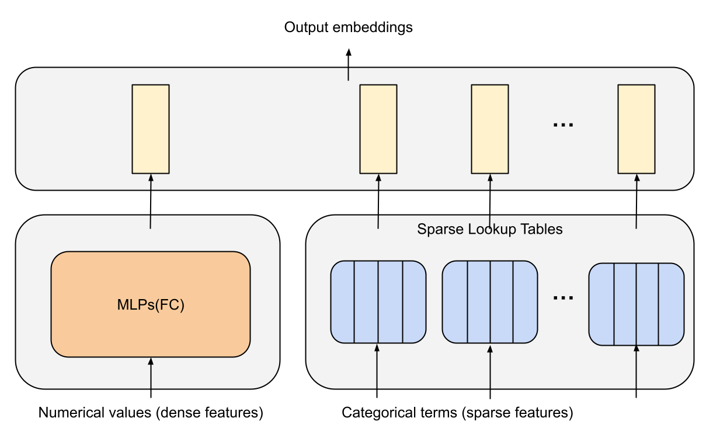
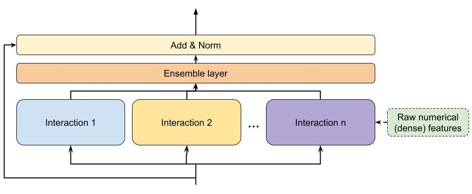
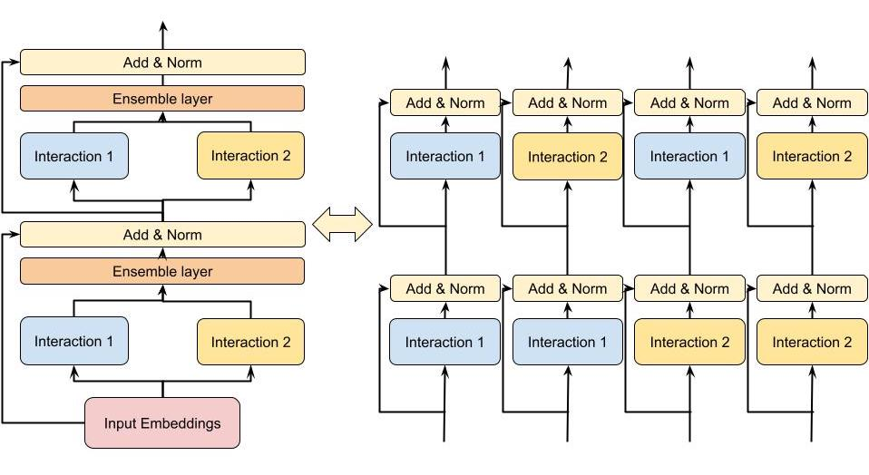
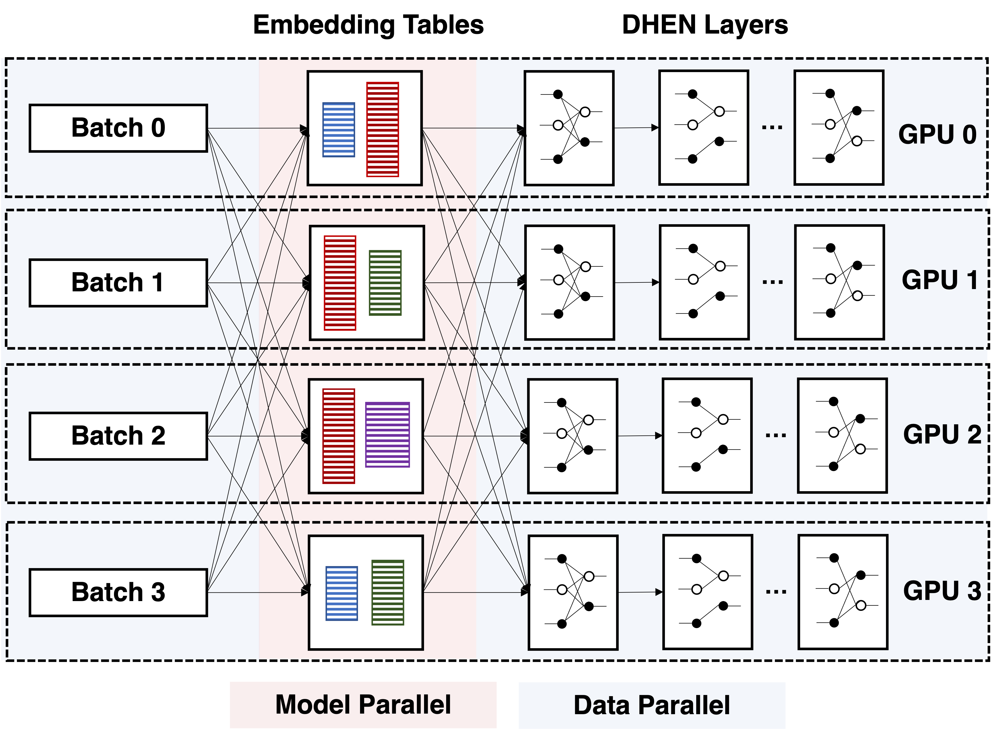
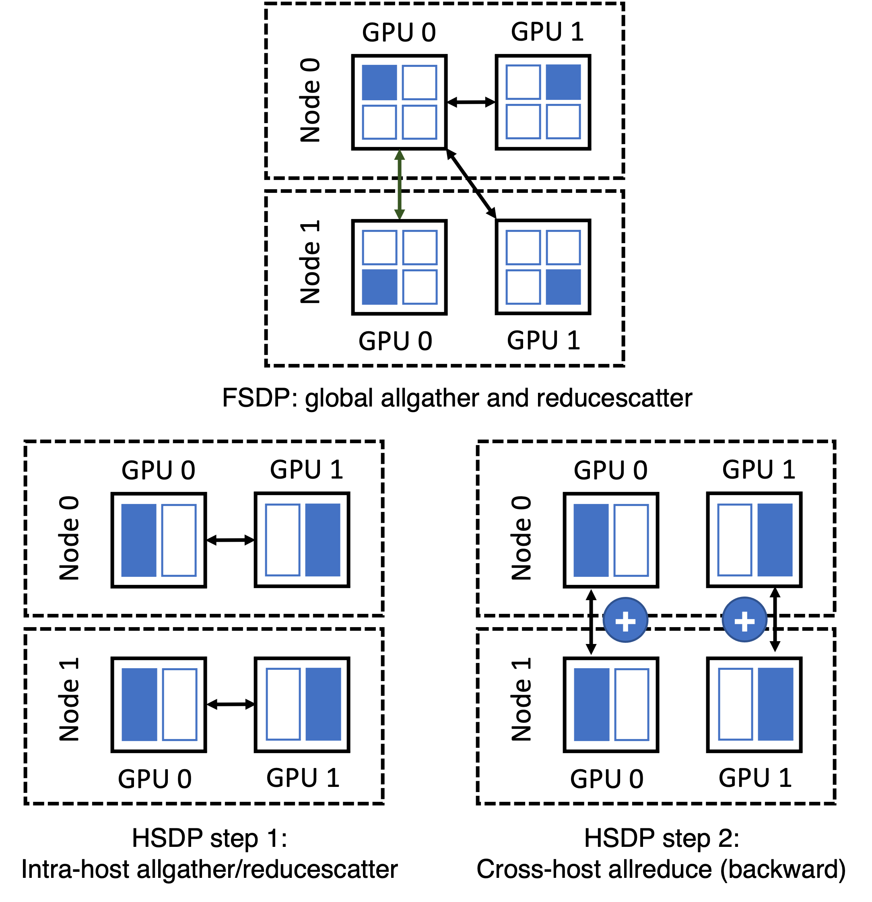
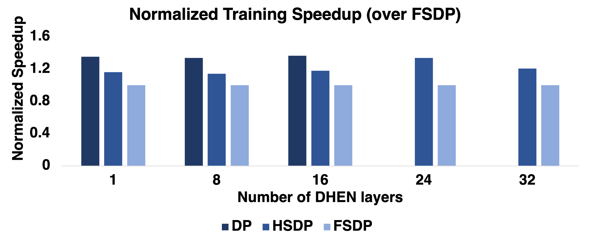

# DHEN: A Deep and Hierarchical Ensemble Network for Large-Scale Click-Through Rate Prediction

Buyun Zhang, Liang Luo, Xi Liu, Jay Li, Zeliang Chen, Weilin Zhang, Xiaohan Wei, Yuchen Hao, Michael Tsang, Wenjun Wang, Yang Liu, Huayu Li, Yasmine Badr, Jongsoo Park, Jiyan Yang, Dheevatsa Mudigere, Ellie Wen. KDD 2022. Meta Platforms, Inc.

| Dimension | Prior State | This Paper |
|---|---|---|
| Model architecture | Single interaction module stacked homogeneously (DCN, AutoInt, xDeepFM, etc.) | Hierarchical ensemble of heterogeneous interaction modules stacked in multiple layers |
| Interaction modeling | One module type per model; high-order interactions from deeper stacking of the same block | Five module types (AdvancedDLRM, self-attention, DCN, linear, convolution) combined per layer; each layer feeds into the next |
| Ensemble approach | Implicit (ensemble by training multiple separate models) or absent | Explicit intra-layer ensemble with residual shortcut; ensemble output is the next layer's input |
| Training | Standard data parallel or model parallel; DP limited to model sizes fitting in per-GPU HBM | Hybrid Sharded Data Parallel (HSDP): shard within host over NVLink, allreduce across hosts |
| Empirical gains | State-of-the-art AdvancedDLRM (internal Meta baseline) | +0.27% NE improvement; 1.2x training throughput over FSDP on a 256-GPU cluster |

## Table of Contents

- [[#1. Motivation and Background|1. Motivation and Background]]
  - [[#1.1 Limitations of Prior Ranking Architectures|1.1 Limitations of Prior Ranking Architectures]]
  - [[#1.2 The Non-Overlapping Information Hypothesis|1.2 The Non-Overlapping Information Hypothesis]]
- [[#2. Architecture Overview|2. Architecture Overview]]
  - [[#2.1 Feature Processing Layer|2.1 Feature Processing Layer]]
  - [[#2.2 The DHEN Layer: Formal Definition|2.2 The DHEN Layer: Formal Definition]]
- [[#3. Feature Interaction Modules|3. Feature Interaction Modules]]
  - [[#3.1 AdvancedDLRM|3.1 AdvancedDLRM]]
  - [[#3.2 Self-Attention|3.2 Self-Attention]]
  - [[#3.3 Deep Cross Net|3.3 Deep Cross Net]]
  - [[#3.4 Linear|3.4 Linear]]
  - [[#3.5 Convolution|3.5 Convolution]]
- [[#4. Hierarchical Ensemble|4. Hierarchical Ensemble]]
  - [[#4.1 Ensemble Aggregation|4.1 Ensemble Aggregation]]
  - [[#4.2 Residual Shortcut and Dimension Matching|4.2 Residual Shortcut and Dimension Matching]]
  - [[#4.3 Stacking and Mixture of High-Order Interactions|4.3 Stacking and Mixture of High-Order Interactions]]
- [[#5. Relation to Prior Work|5. Relation to Prior Work]]
- [[#6. Training and System Details|6. Training and System Details]]
  - [[#6.1 Distributed Training Strategy|6.1 Distributed Training Strategy]]
  - [[#6.2 Fully Sharded Data Parallel|6.2 Fully Sharded Data Parallel]]
  - [[#6.3 Hybrid Sharded Data Parallel|6.3 Hybrid Sharded Data Parallel]]
  - [[#6.4 Common Optimizations|6.4 Common Optimizations]]
- [[#7. Experiments|7. Experiments]]
  - [[#7.1 Setup|7.1 Setup]]
  - [[#7.2 Interaction Module Ablation|7.2 Interaction Module Ablation]]
  - [[#7.3 DHEN vs. AdvancedDLRM|7.3 DHEN vs. AdvancedDLRM]]
  - [[#7.4 Scaling Efficiency vs. Mixture of Experts|7.4 Scaling Efficiency vs. Mixture of Experts]]
  - [[#7.5 Training Throughput|7.5 Training Throughput]]
- [[#8. References|8. References]]

---

## 1. Motivation and Background

*Click-through rate* (CTR) prediction is the core inference task in online advertising: given a user context and an ad candidate, estimate $p(\text{click} \mid \text{user}, \text{ad})$. The revenue implications are enormous; the US digital ad market reached \$284.3B in 2021.

### 1.1 Limitations of Prior Ranking Architectures

The evolution of ranking models follows a rough trajectory:

1. **Linear models** (logistic regression): $p = \sigma(\mathbf{w}^\top \mathbf{x})$. Cannot capture non-linear feature interactions.
2. ***Factorization Machines* (FM)**: Model second-order interactions via latent embeddings, $\hat{y} = w_0 + \sum_i w_i x_i + \sum_{i<j} \langle \mathbf{v}_i, \mathbf{v}_j \rangle x_i x_j$. Shallow; limited expressivity.
3. **Deep FM / Wide & Deep / DCN / xDeepFM / AutoInt**: Stack a deep neural network alongside or on top of an explicit interaction module to capture high-order interactions. These all share a common structural limitation: each model is built around a *single type* of interaction module, homogeneously stacked.

The paper identifies three concrete limitations of the homogeneous-stacking paradigm:

- **Performance variance across datasets.** Different interaction modules (claiming the same bounded interaction degree) achieve different rankings on different datasets, indicating that the information they capture is not identical.
- **Diminishing or negative returns from depth.** Empirically, stacking more layers of the same module can *hurt* performance (documented in DCN Figure 3, xDeepFM Figure 7a, InterHAt Figure 4, xDeepInt Table 2, GIN Figure 3a). This is theoretically surprising: higher-order interactions should be at least as expressive.
- **No mechanism to capture module correlations.** A homogeneous stack cannot learn how the outputs of *different* interaction types relate to one another.

### 1.2 The Non-Overlapping Information Hypothesis

The paper's central hypothesis is:

> Different interaction modules — even those designed to capture the same order of interaction — encode *non-overlapping information* about the feature space.

This motivates an ensemble of *heterogeneous* modules within each layer. Rather than depth alone yielding richer interactions, the combination of diverse module outputs yields complementary signal. The hierarchical stacking of such ensemble layers then compounds the benefit across orders.

---

## 2. Architecture Overview

DHEN follows the same high-level template as modern vision and NLP architectures (ResNet, Transformer, MetaFormer): a deep stacking structure where a repeating block processes inputs recursively. The novelty is that each block is not a single interaction module, but a *hierarchical ensemble* of heterogeneous interaction modules.

The full DHEN pipeline is:

$$\text{raw features} \;\longrightarrow\; \text{Feature Processing Layer} \;\longrightarrow\; \underbrace{[\text{DHEN Layer}] \;\times\; N}_{\text{hierarchical ensemble}} \;\longrightarrow\; \text{prediction head}$$

### 2.1 Feature Processing Layer

CTR inputs contain two feature types:

- ***Sparse* (categorical) features**: mapped via *embedding lookup* tables. Each categorical term is assigned a trainable $d$-dimensional vector.
- ***Dense* (numerical) features**: processed by a stack of MLP layers to produce a $d$-dimensional vector.

After concatenation, the output of the feature processing layer is:

$$X^0 = (x^0_1, x^0_2, \ldots, x^0_m) \in \mathbb{R}^{d \times m}$$

where $m$ is the total number of output embedding slots (sparse lookups plus dense MLP outputs) and $d$ is the embedding dimension. This representation $X^0$ is the input to the first DHEN layer.

*Figure 3 (Zhang et al., 2022): The feature processing layer in DHEN — sparse categorical features go through embedding lookup tables while dense numerical features go through MLP layers; outputs are concatenated to form $X^0 \in \mathbb{R}^{d \times m}$.*

### 2.2 The DHEN Layer: Formal Definition

Let $X_n \in \mathbb{R}^{d \times m}$ denote the embedding matrix input to the $n$-th DHEN layer (with $X_0 \equiv X^0$). The output of a single DHEN layer is:

$$Y = \text{Norm}\!\left(\operatorname{Ensemble}_{i=1}^{k} \operatorname{Interaction}_i(X_n) + \operatorname{ShortCut}(X_n)\right) \tag{1}$$

where:

$$\operatorname{ShortCut}(X_n) = \begin{cases} X_n & \text{if } \operatorname{len}(X_n) = \operatorname{len}(Y) \\ W_n X_n & \text{if } \operatorname{len}(X_n) \neq \operatorname{len}(Y) \end{cases} \tag{2}$$

- $\text{Norm}(\cdot)$ is *layer normalization*.
- $\operatorname{Ensemble}_{i=1}^{k}$ denotes an aggregation function over $k$ interaction module outputs; options include concatenation, sum, or weighted sum.
- $W_n \in \mathbb{R}^{\operatorname{len}(X_n) \times \operatorname{len}(Y)}$ is a learned linear projection applied only when dimension mismatch occurs.
- The output $Y$ becomes the input $X_{n+1}$ to the next layer.

The shortcut plays a dual role: it acts as a *residual shortcut* (stabilizing gradient flow across depth) and as a dimension-matching projection.

*Figure 1 (Zhang et al., 2022): A general DHEN hierarchical ensemble building block. Multiple heterogeneous interaction modules run in parallel on the same input $X_n$; their outputs are aggregated (ensemble), added to a residual shortcut from $X_n$, and normalized to produce the next layer's input $X_{n+1}$.*

---

## 3. Feature Interaction Modules

Each interaction module $\operatorname{Interaction}_i$ takes $X_n \in \mathbb{R}^{d \times m}$ as input and produces a list of embeddings $u \in \mathbb{R}^{d \times l}$, where $l$ is the output embedding count (potentially different from $m$). When a module instead outputs a single tensor $v \in \mathbb{R}^{1 \times h}$ (as in MLP-style modules), a projection $W_m \in \mathbb{R}^{h \times (d \cdot l)}$ maps it to the embedding list format.

### 3.1 AdvancedDLRM

AdvancedDLRM is a DLRM-style interaction module (the in-house production baseline at Meta). Given input embeddings $X_n$, the module computes pairwise dot-product interactions among all embedding pairs, concatenates them with dense features, and passes the result through MLP layers. Formally:

$$u = W_m \cdot \operatorname{AdvancedDLRM}(X_n) \tag{3}$$

The internal DLRM interaction step computes all inner products $\langle x_i, x_j \rangle$ for $i \leq j$, producing an explicit second-order feature crossing. The subsequent MLP layers lift this to effectively higher-order implicit interactions.

### 3.2 Self-Attention

*Self-attention*, the core of Transformer encoders, was introduced to CTR tasks in AutoInt and InterHAt. For DHEN, the module applies a standard Transformer encoder layer:

$$u = W \cdot \operatorname{TransformerEncoderLayer}(X_n) \tag{4}$$

where $W \in \mathbb{R}^{m \times l}$ projects the output to the shared embedding list dimension.

The Transformer encoder layer computes multi-head scaled dot-product attention:

$$\operatorname{Attn}(Q, K, V) = \operatorname{softmax}\!\left(\frac{QK^\top}{\sqrt{d_k}}\right) V$$

with $Q = X_n W^Q$, $K = X_n W^K$, $V = X_n W^V$. This captures *feature-wise* interactions: the attention weights $A_{ij} = \operatorname{softmax}(\cdot)_{ij}$ indicate how much feature $i$ attends to feature $j$, enabling adaptive, content-dependent interaction modeling.

### 3.3 Deep Cross Net

Deep Cross Net (DCN, Wang et al. 2017) introduces a *cross network* that efficiently learns bounded-degree feature interactions. In DHEN's formulation:

$$u = W \cdot (X_n X_n^\top) + b \tag{7}$$

where $W$ and $b$ are learned weight and bias matrices. This can be understood as a bilinear transformation over the outer product $X_n X_n^\top \in \mathbb{R}^{m \times m}$, which encodes all pairwise embedding interactions. The paper notes that the skip connection from the original DCN paper is omitted since DHEN already provides skip connections via the $\operatorname{ShortCut}$ mechanism at the layer level.

The key distinction from self-attention is that DCN operates at the *bit-level interaction* level (individual scalar dimensions within embedding vectors), whereas self-attention operates at the *feature-level interaction* level (entire embedding vectors as units).

### 3.4 Linear

The linear module simply applies a learned projection to the input embeddings:

$$u = W \cdot X_n \tag{6}$$

where $W \in \mathbb{R}^{m \times l}$ is the linear weight. This module captures raw information from the original feature embeddings without any non-linearity or explicit interaction, serving as an information-preserving bypass within the ensemble. Despite its simplicity, the ablation study shows it is highly effective as a partner module in hierarchical ensembles.

### 3.5 Convolution

Convolutional layers, standard in vision and used in NLP (Conformer) and CTR (Liu et al. 2019), are adapted here as:

$$u = W \cdot \operatorname{Conv2d}(X_n) \tag{5}$$

where $W \in \mathbb{R}^{m \times l}$ re-projects the convolution output. The input $X_n \in \mathbb{R}^{d \times m}$ is treated as a 2D signal (embedding dimension $d$ as one axis, feature count $m$ as the other). Conv2d applies local receptive field filters over this 2D arrangement, capturing local co-occurrence patterns among neighboring features in the embedding matrix layout.

---

## 4. Hierarchical Ensemble

### 4.1 Ensemble Aggregation

At each DHEN layer, the $k$ interaction modules are applied in parallel to the same input $X_n$, producing outputs $\{u_1, u_2, \ldots, u_k\}$ where $u_i \in \mathbb{R}^{d \times l}$. The aggregation function $\operatorname{Ensemble}_{i=1}^{k}$ combines these into a single embedding matrix before the shortcut addition and normalization. The paper considers three aggregation strategies:

- **Concatenation**: $\operatorname{Ensemble}(u_1, \ldots, u_k) = [u_1 \| u_2 \| \cdots \| u_k] \in \mathbb{R}^{d \times (kl)}$
- **Sum**: $\operatorname{Ensemble}(u_1, \ldots, u_k) = \sum_{i=1}^{k} u_i \in \mathbb{R}^{d \times l}$
- **Weighted sum**: $\operatorname{Ensemble}(u_1, \ldots, u_k) = \sum_{i=1}^{k} \alpha_i u_i$ with learned scalars $\alpha_i$

The choice of aggregation determines how information from different modules is fused before being passed to the next layer.

### 4.2 Residual Shortcut and Dimension Matching

Equation (2) defines the shortcut as a conditional operation. When the ensemble output and input $X_n$ have matching embedding counts ($\operatorname{len}(X_n) = \operatorname{len}(Y)$), the shortcut is an identity: $\operatorname{ShortCut}(X_n) = X_n$. This is analogous to the standard ResNet shortcut and ensures that gradient flow is not blocked by depth.

When dimensions mismatch (e.g., after concatenation aggregation increases the embedding count), a learned linear projection $W_n \in \mathbb{R}^{\operatorname{len}(X_n) \times \operatorname{len}(Y)}$ is applied. This is analogous to the 1x1 convolution projection shortcut in ResNet.

### 4.3 Stacking and Mixture of High-Order Interactions

The critical insight of DHEN is that stacking $N$ hierarchical ensemble layers produces an exponentially rich mixture of high-order interactions. For a two-layer, two-module example with modules $I_1$ and $I_2$, the second layer processes embeddings that are already themselves outputs of module compositions. The second layer then computes, among others:

$$I_1(I_1(X_0)), \quad I_1(I_2(X_0)), \quad I_2(I_1(X_0)), \quad I_2(I_2(X_0))$$

(all mixed together via the ensemble). Thus DHEN is capable of capturing interactions of the form "interaction type $A$ applied to the output of interaction type $B$," which is qualitatively different from what any homogeneous stack can produce. **With $k$ module types and $N$ layers, the number of distinct interaction compositions grows as $k^N$, giving DHEN *combinatorial expressivity* over the space of module sequences.**

Formally, the full DHEN forward pass (for a $N$-layer model) can be written as:

$$X_{n+1} = \text{Norm}\!\left(\operatorname{Ensemble}_{i=1}^{k} \operatorname{Interaction}_i(X_n) + \operatorname{ShortCut}(X_n)\right), \quad n = 0, 1, \ldots, N-1$$

The final $X_N$ is passed to a prediction head (typically an MLP followed by sigmoid) to produce $\hat{p}(\text{click})$.

*Figure 2 (Zhang et al., 2022): A two-layer, two-module DHEN (left) and its expanded interaction graph (right). The second layer's modules operate on composed outputs of first-layer modules, yielding all four compositions $I_1(I_1(X_0))$, $I_1(I_2(X_0))$, $I_2(I_1(X_0))$, $I_2(I_2(X_0))$ — illustrating how DHEN achieves combinatorial expressivity over interaction compositions.*

---

## 5. Relation to Prior Work

| Model | Interaction type | High-order? | Heterogeneous modules? | End-to-end? | Notes |
|---|---|---|---|---|---|
| Wide & Deep | Wide (manual crosses) + Deep (MLP) | Implicit via MLP | No (two fixed branches) | Yes | Shallow part needs manual engineering |
| DeepFM | FM (2nd order) + MLP | Implicit via MLP | No | Yes | FM replaces Wide part |
| DCN | Cross network + MLP | Bounded degree, bit-level | No | Yes | Output constrained to specific format |
| DCN-V2 | Cross network (improved) + MLP | Bounded degree | No | Yes | Fixes expressivity of DCN cross net |
| xDeepFM | CIN (feature-wise) + MLP | Explicit higher-order | No | Yes | CIN is resource-intensive |
| AutoInt | Multi-head self-attention + MLP | Via attention stacking | Multi-head (homogeneous) | No (2-stage) | Each head is same module type |
| GIN | Multi-branch attention + pruning | Via stacking | Multi-head (homogeneous) | No (2-stage) | Requires re-training stage |
| InterHAt | Hierarchical attention aggregation | Via stacking | No | Yes | Good explainability; lower compute |
| xDeepInt | Subspace crossing | Feature-wise + bit-wise | No | Yes | No jointly-trained DNN |
| **DHEN** | Ensemble of 5 module types | Exponential via stacking | **Yes** | **Yes** | Hierarchical; no manual engineering |

The two architecturally closest predecessors are **GIN** and **AutoInt**:

- **AutoInt** uses a multi-branch structure, but each branch within a layer is the same attention module type (multi-*head*, not multi-*type*). It also requires two-stage training (pre-train then fine-tune).
- **GIN** similarly uses multi-head attention and requires a second re-training stage to prune unimportant interactions.

DHEN's key differentiators: (1) genuinely heterogeneous modules per layer, not just multiple heads of the same module; (2) fully end-to-end single-stage training; (3) the hierarchical stacking that allows each module at layer $n+1$ to operate on the *composed* outputs of all modules at layer $n$.

---

## 6. Training and System Details

DHEN's deeper, multi-layer structure increases parameter count, activation memory, and FLOPs substantially beyond what any single-server system can handle. The training infrastructure is built on the ZionEX system (Mudigere et al. 2021).

### 6.1 Distributed Training Strategy

The deployment unit is a **supernode** (pod) of 16 hosts, each with 8 A100 GPUs connected via *NVLink* (600 GB/s intra-host). Hosts within a pod communicate at up to 200 GB/s (RoCEv2, shared across 8 GPUs). A single pod thus contains 128 A100 GPUs, 5 TB HBM, and 40 PF/s BF16 compute.

The hybrid training paradigm:

1. **Sparse embedding tables** are distributed across the pod using *model parallel* sharding. Oversized tables are column-sharded, and shards are load-balanced via the LPT (Longest Processing Time First) algorithm using an empirical cost function that captures both compute and communication overhead.
2. **Dense DHEN layers** are replicated on each GPU and trained with *data parallel* (DP) training. The choice of DP for dense layers reflects that activation sizes can far exceed weight sizes, so it is cheaper to synchronize weights (*allreduce*) than to send activations across the network.
3. Each training batch thus follows: DP forward (dense) → model-parallel embedding lookup → DP forward/backward (dense DHEN layers) → allreduce gradients for dense weights.

*Figure 4 (Zhang et al., 2022): The hybrid distributed training strategy for DHEN (shown for 4 GPUs). Embedding tables are model-parallel across the pod; dense DHEN layers are replicated on each GPU and trained with data parallelism, with allreduce for gradient synchronization.*

### 6.2 Fully Sharded Data Parallel

Standard DP imposes a ceiling on model size equal to per-GPU HBM capacity. To go beyond, the authors use ***fully sharded data parallel* (FSDP)** (FairScale / DeepSpeed ZeRO). FSDP shards model weights across all GPUs, materializing each layer's weights via *allgather* on the forward/backward critical path, then immediately discarding them. Additional memory techniques: activation checkpointing (recompute activations in backward), CPU offloading (parameters/gradients stored in CPU RAM, fetched to GPU just before use).

*However, at production scale (hundreds of GPUs), naive FSDP is inefficient because the `allgather` on the critical path must span all GPUs in the cluster. Each shard becomes very small, making it impossible to saturate network bandwidth; the resulting latency dominates.*

### 6.3 Hybrid Sharded Data Parallel

The paper proposes ***hybrid sharded data parallel* (HSDP)**, co-designed with DHEN's architecture and the ZionEX cluster topology. HSDP exploits the 24x bandwidth asymmetry between NVLink (600 GB/s) and RoCEv2 (25 GB/s):

1. **Intra-host sharding**: HSDP shards the entire dense model across GPUs *within* a single host. All `allgather` and `reducescatter` operations during the forward and backward passes operate exclusively over NVLink at full bandwidth.
2. **Cross-host gradient synchronization**: After the intra-host `reducescatter` completes in the backward pass, HSDP registers a backward hook to launch asynchronous `allreduce` operations across hosts (one per GPU-local-ID group). Each `allreduce` averages gradients for the local shard across all hosts with the same intra-host position.
3. The async `allreduce` overlaps with the computation of subsequent backward pass layers, hiding its latency.

HSDP tradeoffs vs. FSDP:
- **Benefit**: `allgather` latency on the critical path is reduced dramatically (NVLink vs. RoCE); communication collectives scale with number of hosts, not number of GPUs globally.
- **Cost**: *Supports models up to $8\times$ (GPUs per host) the size of pure DP, not arbitrarily large; adds 1.125x communication overhead in bytes due to the additional `allreduce`, though this is hidden by pipelining.*

*In practice, small-to-medium DHENs use HSDP; very large DHENs fall back to FSDP.*

*Figure 5 (Zhang et al., 2022): FSDP (top) vs. HSDP (bottom) shown for 2 hosts with 2 GPUs each. In FSDP, allgather must span all GPUs cluster-wide over slow RoCEv2. In HSDP, allgather is confined to NVLink-connected GPUs within a single host; cross-host gradient averaging is done asynchronously via allreduce over RoCEv2, overlapped with backward computation.*

### 6.4 Common Optimizations

- **Large-batch training**: reduces synchronization frequency.
- **FP16 embeddings with stochastic rounding**: halves embedding memory with numerically stable updates.
- **BF16 optimizer**: leverages BF16's larger dynamic range for stability.
- **Quantized AllReduce and AllToAll**: reduces communication bandwidth by sending compressed gradients and embedding updates; leverages Tensor Cores.

---

## 7. Experiments

### 7.1 Setup

All experiments use a proprietary large-scale industrial CTR dataset (not publicly released). Features include hundreds of sparse (categorical) features and thousands of dense (numerical) features. The metric throughout is ***normalized entropy* (NE)** loss, defined as the binary cross-entropy normalized by the entropy of the empirical click rate:

$$\text{NE} = \frac{-\frac{1}{n}\sum_{i=1}^{n} [y_i \log \hat{p}_i + (1-y_i)\log(1-\hat{p}_i)]}{-(p \log p + (1-p)\log(1-p))}$$

where $p$ is the dataset's empirical click-through rate. Lower NE is better; NE differences are reported as relative improvements over the AdvancedDLRM baseline.

### 7.2 Interaction Module Ablation

The ablation studies in Table 1 (paper) evaluate the hierarchical ensemble over DCN, self-attention, CNN, and linear modules using 5 stacked layers ($N=5$). Key findings:

| Model | Interaction types | NE diff at 10B | NE diff at 20B | NE diff at 35B |
|---|---|---|---|---|
| 1 (baseline) | DCN | — | — | — |
| 2 | Self-attention | +0.036% | +0.026% | **-1.044%** |
| 3 | CNN | -1.441% | -1.535% | -1.534% |
| 4 | Linear | -1.461% | -1.546% | -1.538% |
| 5 | DCN + Linear | -0.002% | -0.004% | -0.004% |
| 6 | Self-attention + Linear | -1.363% | -1.537% | **-1.576%** |
| 7 | Self-attention + CNN | +0.024% | -1.270% | -1.508% |

(Negative NE diff = improvement over DCN baseline.)

Key observations:

- **Linear alone outperforms DCN** at all training checkpoints, suggesting that in this feature space, preserving raw embedding information is more valuable than explicit cross-network interactions.
- **Self-attention alone converges slowly** — it requires more data to realize its benefit (barely improving at 20B, hurting at 35B without ensemble).
- **Hierarchical ensemble of self-attention + linear** is the best configuration: better than either alone, and achieves -1.576% NE at 35B. The ensemble stabilizes self-attention's convergence by coupling it with the fast-converging linear module.
- **Not all ensembles are beneficial**: DCN + Linear underperforms linear alone, and self-attention + CNN underperforms self-attention + linear. This confirms that the *non-overlapping information hypothesis* is necessary but not sufficient — module complementarity depends on the specific dataset.

### 7.3 DHEN vs. AdvancedDLRM

Table 2 (paper) compares DHEN stacks of varying depth $N \in \{1, 2, 4, 8\}$ against the AdvancedDLRM baseline (using AdvancedDLRM + Linear as the module pair):

| Model | $N$ | NE diff at 5B | NE diff at 15B | NE diff at 25B |
|---|---|---|---|---|
| AdvancedDLRM (baseline) | — | — | — | — |
| DHEN | 2 | -0.0315% | -0.134% | -0.176% |
| DHEN | 4 | -0.071% | -0.197% | -0.255% |
| DHEN | 8 | -0.068% | -0.208% | -0.273% |

All DHEN configurations outperform the baseline. Deeper models achieve larger NE improvement, and crucially, the gap *widens with more training data* — suggesting that DHEN's ability to capture higher-order interactions and module correlations requires more samples to manifest, but yields durable gains. **The 8-layer DHEN achieves -0.273% NE at 25B examples, reaching the reported -0.27% NE improvement over AdvancedDLRM with additional data.**

### 7.4 Scaling Efficiency vs. Mixture of Experts

Table 3 (paper) benchmarks DHEN depth-scaling against MoE-based MLP scaling, both on top of AdvancedDLRM:

| Model | FLOPs | NE diff at 50B |
|---|---|---|
| AdvancedDLRM | 0.06G | — |
| 4-expert MoE | 1.3G | -0.06% |
| 2-layer DHEN | 1.44G | **-0.11%** |
| 8-expert MoE | 3.3G | -0.09% |
| 4-layer DHEN | 3G | **-0.21%** |
| 16-expert MoE | 6G | -0.10% |
| 6-layer DHEN | 4.6G | **-0.26%** |

At matched or lower FLOP budgets, DHEN consistently outperforms MoE. MoE scales the MLP layers wider by routing to expert sub-networks but remains within a single interaction paradigm (dense MLP). DHEN's heterogeneous module stacking yields strictly better return on FLOPs.

### 7.5 Training Throughput

On a 256-GPU cluster, experiments with an 8-layer DHEN using DP yield 1.08x end-to-end speedup from: FP16 embedding + AMP + quantized BF16 allreduce + quantized AllToAll. The remaining bottleneck is optimizer cost and AllToAll latency not fully overlapped with dense layer compute.

*For depth beyond 22 layers, DP fails (OOM).* **HSDP supports larger models than DP and achieves up to 1.2x throughput over FSDP for the same model size.** FSDP supports arbitrary depth but with high `allgather` latency on the critical path across all cluster GPUs; HSDP restricts `allgather` to NVLink within a single host, eliminating the RoCEv2 bottleneck.

*Figure 6 (Zhang et al., 2022): Training throughput comparison across DP, FSDP, and HSDP at varying DHEN layer counts on a 256-GPU cluster. DP succeeds only up to 22 layers (OOM beyond); HSDP consistently achieves up to 1.2x the throughput of FSDP by replacing cluster-wide allgather with fast intra-host NVLink allgather.*

---

## 8. References

| Reference Name | Brief Summary | Link to Reference |
|---|---|---|
| Zhang et al. 2022 (DHEN) | This paper; proposes the DHEN hierarchical ensemble architecture for CTR prediction | https://arxiv.org/abs/2203.11014 |
| Naumov et al. 2019 (DLRM) | Deep Learning Recommendation Model; baseline interaction architecture using dot-product feature crossing | https://arxiv.org/abs/1906.00091 |
| Wang et al. 2017 (DCN) | Deep & Cross Network; introduces cross network for bounded-degree feature interaction learning | https://dl.acm.org/doi/10.1145/3124749.3124754 |
| Wang et al. 2021 (DCN-V2) | Improved DCN; addresses limitations of DCN's bit-level interaction constraints | https://dl.acm.org/doi/10.1145/3442381.3450078 |
| Lian et al. 2018 (xDeepFM) | Extreme DeepFM; introduces Compressed Interaction Network for explicit higher-order feature-wise interactions | https://dl.acm.org/doi/10.1145/3219819.3220023 |
| Song et al. 2019 (AutoInt) | AutoInt; uses multi-head self-attention to learn feature interactions with explainability | https://dl.acm.org/doi/10.1145/3357384.3357925 |
| Guo et al. 2017 (DeepFM) | DeepFM; replaces Wide part of Wide & Deep with FM for automatic second-order crossing | https://arxiv.org/abs/1703.04247 |
| Cheng et al. 2016 (Wide & Deep) | Wide & Deep Learning; combines shallow wide model with deep MLP for Google Play recommendations | https://dl.acm.org/doi/10.1145/2988450.2988454 |
| Li et al. 2020 (InterHAt) | Interpretable CTR prediction through hierarchical attention with lower compute than Wide & Deep | https://dl.acm.org/doi/10.1145/3336191.3371785 |
| Lang et al. 2021 (GIN) | GIN (Architecture and Operation Adaptive Network); multi-head attention with two-stage interaction pruning | https://dl.acm.org/doi/10.1145/3447548.3467069 |
| Yan & Li 2021 (xDeepInt) | xDeepInt; subspace crossing for joint feature-wise and bit-wise high-order interaction without a DNN | https://dl.acm.org/doi/10.1145/3474085.3475679 |
| Rendle 2010 (FM) | Factorization Machines; models second-order feature interactions via inner products of latent embeddings | https://ieeexplore.ieee.org/document/5694074 |
| Shazeer et al. 2017 (MoE) | Sparsely-Gated Mixture-of-Experts; scales model capacity via routing to expert sub-networks | https://arxiv.org/abs/1701.06538 |
| Mudigere et al. 2021 (ZionEX) | Software-hardware co-design for fast and scalable training of DLRM-class recommendation models | https://arxiv.org/abs/2104.05158 |
| Vaswani et al. 2017 (Transformer) | Attention is All You Need; introduces the Transformer architecture with multi-head self-attention | https://arxiv.org/abs/1706.03762 |
| He et al. 2016 (ResNet) | Deep Residual Learning; introduces residual skip connections enabling training of very deep networks | https://arxiv.org/abs/1512.03385 |
| Ba et al. 2016 (LayerNorm) | Layer Normalization; normalizes activations along the feature dimension for stable deep training | https://arxiv.org/abs/1607.06450 |
| Liu et al. 2019 (CNN for CTR) | Feature generation by CNN for CTR prediction; applies convolution to categorical embeddings | https://dl.acm.org/doi/10.1145/3308558.3313535 |
| He et al. 2014 (NE metric) | Practical Lessons from Predicting Clicks on Ads at Facebook; defines and motivates the NE evaluation metric | https://dl.acm.org/doi/10.1145/2648584.2648589 |
| Blondel et al. 2016 (HOFM) | Higher-Order Factorization Machines; extends FM to arbitrary interaction order at high computational cost | https://papers.nips.cc/paper/2016/hash/158fc2ddd52ec2cf54d3c161f2dd6517-Abstract.html |
