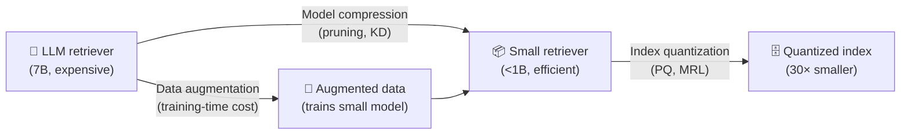
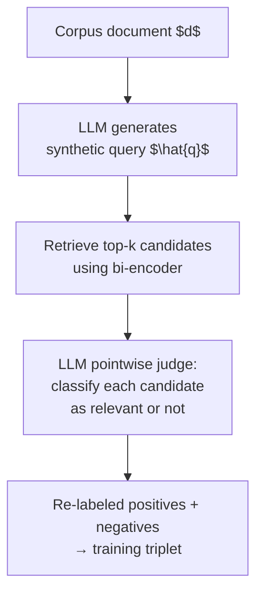
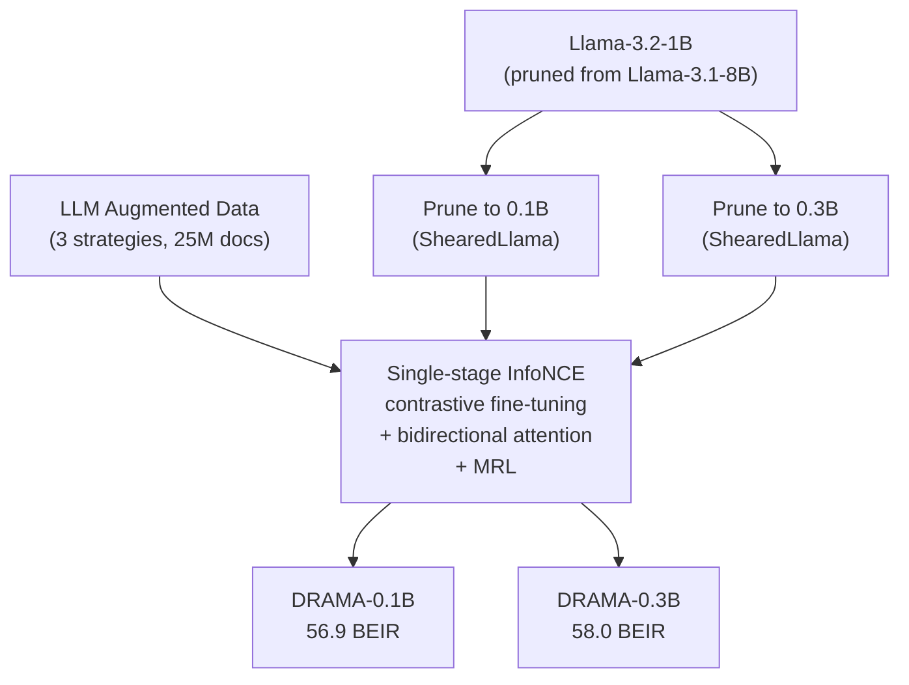

# Efficient Dense Retrieval at Scale: A Survey

*Calvin Woo — May 2026 | Survey spanning 19 papers across 6 sub-themes*

| Approach Family | Representative Papers | Key Idea | Best Reported BEIR nDCG@10 |
|---|---|---|---|
| LLM-based retrievers | RepLlama, E5-mistral, NV-Embed | Fine-tune 7B+ LLM as bi-encoder | 59.0 (MistralE5, 7B) |
| Encoder-based retrievers | Contriever, SimLM, E5, BGE-M3 | Multi-stage contrastive training of BERT-class encoders | 56.1 (BGE-large, 303M) |
| Knowledge distillation | TAS-B | Cross-encoder or bi-encoder teacher distills into compact student | 51.6 (TAS-B, 110M) |
| LLM data augmentation | InPars, Promptagator, Gecko | LLM generates synthetic queries/triplets/judgments for retrieval training | 58.0 (Gecko, 1B) |
| Pruned LLM backbone | DRAMA, ShearedLlama | Structured pruning of a decoder LLM → compact retriever with LLM priors | 59.1 (DRAMA, 1B) |
| Quantization / ANN | JPQ, FAISS, MRL | Joint encoder+PQ training or nested-dimension embeddings for index compression | 58.5 (DRAMA-MRL 768d) |

## Relations

**Builds on:** [[papers/matryoshka-representation-learning|Matryoshka Representation Learning (Kusupati et al.)]], [[papers/sampling-bias-corrected-retrieval|Sampling Bias-Corrected Retrieval]]
**Concepts used:** [[concepts/self-supervised-vision/contrastive-learning|Contrastive Learning]] *(no note yet)*

---

## Table of Contents

- [[#1. Introduction The Efficiency-Quality Tension|1. Introduction: The Efficiency-Quality Tension]]
- [[#2. Background Dense Retrieval Fundamentals|2. Background: Dense Retrieval Fundamentals]]
  - [[#2.1 The Bi-Encoder Model|2.1 The Bi-Encoder Model]]
  - [[#2.2 Training with InfoNCE|2.2 Training with InfoNCE]]
  - [[#2.3 ANN Infrastructure and Benchmarks|2.3 ANN Infrastructure and Benchmarks]]
- [[#3. The Quality Frontier LLM-Based Dense Retrievers|3. The Quality Frontier: LLM-Based Dense Retrievers]]
  - [[#3.1 Decoder-Only LLMs as Bi-Encoders|3.1 Decoder-Only LLMs as Bi-Encoders]]
  - [[#3.2 Key Approaches|3.2 Key Approaches]]
  - [[#3.3 The Inference Cost Problem|3.3 The Inference Cost Problem]]
- [[#4. The Efficiency Baseline Encoder-Based Retrievers|4. The Efficiency Baseline: Encoder-Based Retrievers]]
  - [[#4.1 Contrastive Pre-Training Contriever|4.1 Contrastive Pre-Training: Contriever]]
  - [[#4.2 Enhanced Pre-Training Objectives SimLM|4.2 Enhanced Pre-Training Objectives: SimLM]]
  - [[#4.3 Multi-Stage Supervised Training E5 and GTE|4.3 Multi-Stage Supervised Training: E5 and GTE]]
  - [[#4.4 Multilingual and Multi-Functional BGE-M3|4.4 Multilingual and Multi-Functional: BGE-M3]]
- [[#5. Knowledge Distillation for Retrieval|5. Knowledge Distillation for Retrieval]]
  - [[#5.1 Cross-Encoder as Teacher|5.1 Cross-Encoder as Teacher]]
  - [[#5.2 TAS-B Topic-Aware Sampling with Dual Teacher|5.2 TAS-B: Topic-Aware Sampling with Dual Teacher]]
- [[#6. LLM Data Augmentation Shifting Cost to Training Time|6. LLM Data Augmentation: Shifting Cost to Training Time]]
  - [[#6.1 Synthetic Query Generation InPars and Promptagator|6.1 Synthetic Query Generation: InPars and Promptagator]]
  - [[#6.2 Gecko Two-Stage LLM Distillation|6.2 Gecko: Two-Stage LLM Distillation]]
  - [[#6.3 DRAMA's Systematic Augmentation Comparison|6.3 DRAMA's Systematic Augmentation Comparison]]
- [[#7. Model Compression Pruning Decoder LLMs into Small Retrievers|7. Model Compression: Pruning Decoder LLMs into Small Retrievers]]
  - [[#7.1 Structured Pruning ShearedLlama|7.1 Structured Pruning: ShearedLlama]]
  - [[#7.2 DRAMA's Pruning Strategy|7.2 DRAMA's Pruning Strategy]]
  - [[#7.3 Bidirectional Attention for Dense Retrieval|7.3 Bidirectional Attention for Dense Retrieval]]
- [[#8. Matryoshka Representation Learning Flexible Dimension Reduction|8. Matryoshka Representation Learning: Flexible Dimension Reduction]]
- [[#9. Quantization and Index-Side Efficiency|9. Quantization and Index-Side Efficiency]]
  - [[#9.1 Product Quantization and FAISS|9.1 Product Quantization and FAISS]]
  - [[#9.2 Joint Training of Encoder and PQ Index JPQ|9.2 Joint Training of Encoder and PQ Index: JPQ]]
- [[#10. DRAMA A Synthesis of Efficiency Axes|10. DRAMA: A Synthesis of Efficiency Axes]]
- [[#11. Open Problems and Frontiers|11. Open Problems and Frontiers]]
- [[#References|References]]

---

## 1. Introduction: The Efficiency-Quality Tension

🔑 Dense retrieval has a fundamental efficiency-quality tension that no single design choice resolves cleanly.

*Dense retrieval* (DR) maps queries $q$ and documents $d$ into a shared embedding space $\mathbb{R}^m$ and retrieves the $k$ documents with highest similarity to the query embedding. Compared to traditional lexical retrieval (BM25), dense retrievers generalize better across phrasings and semantics. But they introduce two distinct computational burdens:

1. **Inference-time encoding**: every document in a corpus of size $|\mathcal{C}|$ must be embedded offline; every query must be embedded at serve time. With a 7B-parameter LLM backbone, this is ~40× more expensive than a BERT-sized (110M) encoder.
2. **Training-time data**: dense retrievers are brittle without supervised query–document pairs. Annotating retrieval data is expensive; synthetic data is lower quality but scalable.

The field has evolved along three *efficiency axes*, each reducing one type of cost:

The central challenge is that quality degrades along each axis. This survey organizes approaches by which axis they optimize and by how much they recover lost quality.

**Evaluation benchmarks** used throughout:
- **BEIR** (Thakur et al., 2021): 18 heterogeneous retrieval datasets for zero-shot generalization; reported as nDCG@10 averaged over a standard 13-subset.
- **MTEB** (Muennighoff et al., 2022): massive text embedding benchmark; retrieval subtask most relevant here.
- **MIRACL** (Zhang et al., 2023): multilingual retrieval across 18 languages; nDCG@10.

---

## 2. Background: Dense Retrieval Fundamentals

### 2.1 The Bi-Encoder Model

The dominant architecture is the *bi-encoder* (or *dual encoder*): two independent text encoders $f_\theta, g_\phi$ (often weight-sharing) that embed query and document independently:

$$\mathbf{q} = f_\theta(q) \in \mathbb{R}^m, \quad \mathbf{d} = g_\phi(d) \in \mathbb{R}^m$$

Retrieval reduces to finding the $k$ nearest neighbors of $\mathbf{q}$ in $\{\mathbf{d}_i\}_{i=1}^{|\mathcal{C}|}$ under cosine similarity:

$$\text{Sim}(q, d) = \frac{\mathbf{q} \cdot \mathbf{d}}{\|\mathbf{q}\|\|\mathbf{d}\|}$$

The key architectural trade-off is between bi-encoders and *cross-encoders*:

| Architecture | Query–Doc Interaction | Corpus Offline Indexing? | Retrieval Latency |
|---|---|---|---|
| Bi-encoder | None (independent) | ✓ (pre-compute $\mathbf{d}$) | $O(1)$ per query (ANN) |
| Cross-encoder | Full attention (joint) | ✗ | $O(|\mathcal{C}|)$ per query |
| Late interaction (ColBERT) | Token-level max-sim | ✓ (expensive) | $O(|\mathcal{C}| \cdot L_d)$ |

Bi-encoders are the only architecture tractable for large-scale retrieval. Cross-encoders serve as *rerankers* applied to a shortlist retrieved by a bi-encoder, not as first-stage retrievers.

### 2.2 Training with InfoNCE

Given a batch of $(q_i, d_i^+, \{d_j^-\})$ triplets, a dense retriever is trained with the *InfoNCE loss* (van den Oord et al., 2019):

$$\mathcal{L}(q, d^+, \{d_j^-\}) = -\log \frac{\exp\!\left(\text{Sim}(q, d^+)/\tau\right)}{\exp\!\left(\text{Sim}(q, d^+)/\tau\right) + \sum_{j} \exp\!\left(\text{Sim}(q, d_j^-)/\tau\right)}$$

where $\tau > 0$ is a temperature hyperparameter and $\{d_j^-\}$ includes both explicit *hard negatives* (documents that look relevant but aren't) and *in-batch negatives* (positive documents of other queries in the batch). *Hard negative mining* — using a retriever to find near-miss documents — is critical for generalization.

> [!NOTE] Why hard negatives matter
> Random negatives are trivially easy: any irrelevant document is far from $\mathbf{q}$ in embedding space. Hard negatives push the model to learn fine-grained distinctions, driving most of the BEIR performance gains beyond simple pre-training.

### 2.3 ANN Infrastructure and Benchmarks

Exact nearest-neighbor search is $O(|\mathcal{C}|)$ per query — infeasible at web scale. Approximate nearest-neighbor (ANN) libraries like [FAISS](https://arxiv.org/abs/1702.08734) (Johnson et al., 2017) enable sub-linear retrieval via:

- **Inverted file index (IVF)**: cluster documents, search only the nearest cluster(s).
- **Product quantization (PQ)**: compress each $m$-dim embedding into a short code; compute approximate distances in compressed space.
- **HNSW**: hierarchical graph-based ANN with $O(\log |\mathcal{C}|)$ expected retrieval.

*FAISS is the infrastructure layer underpinning essentially all modern dense retrieval systems.* Its PQ compresses a 768-dim float32 embedding (3 KB) to as few as 64 bytes — a 50× reduction — with controlled recall loss.

---

## 3. The Quality Frontier: LLM-Based Dense Retrievers

### 3.1 Decoder-Only LLMs as Bi-Encoders

Large language models pre-trained on massive text corpora encode richer semantic knowledge than BERT-class encoders. The key insight: *the same model that can reason about language is a powerful prior for relevance*. Fine-tuning an LLM as a dense retriever leverages this prior directly.

The main technical challenge is that decoder-only LLMs use *causal self-attention* — each token attends only to its left context. For encoding a document into a single vector, this means only the last token has access to the full document. Several solutions have been proposed: using the EOS token embedding, inserting a learned pooling layer (NV-Embed), or simply turning off causal masking during retriever fine-tuning (as DRAMA does).

> [!TIP] Bidirectional attention unlocks dense retrieval
> Enabling bidirectional attention during retriever fine-tuning of a decoder-only LLM consistently outperforms keeping causal masking. The document embedding then has full access to all tokens, mirroring how BERT-class encoders work. This is a free performance gain requiring no architectural change — just a masking flag.

### 3.2 Key Approaches

**[RepLlama](https://arxiv.org/abs/2310.08319)** (Ma et al., 2023) established the baseline for LLM-based dense retrieval. Fine-tuning Llama-2-7B as a bi-encoder with standard InfoNCE on MS MARCO passage retrieval outperforms all prior BERT-based retrievers despite simpler training (no multi-stage contrastive pre-training).

**[E5-mistral / E5-instruct](https://arxiv.org/abs/2401.00368)** (Wang et al., 2024) extends the LLM retriever approach by generating diverse synthetic training data using a proprietary LLM — 93 languages, hundreds of task types. Fine-tuning Mistral-7B (and later Llama-3) on this synthetic data achieves 59.0 nDCG@10 on BEIR, state of the art among open-source models.

**[NV-Embed](https://arxiv.org/abs/2405.17428)** (Lee et al., 2024, ICLR 2025 Spotlight) introduces two architectural innovations: (1) *latent attention pooling* — a small attention module aggregates all token embeddings into a single fixed vector, replacing the EOS-token pooling used by RepLlama; (2) removing causal masking during contrastive training. Combined with a two-stage instruction-tuning curriculum, NV-Embed achieves top performance on the MTEB leaderboard.

**[Gecko](https://arxiv.org/abs/2403.20327)** (Lee et al., 2024) takes a distillation-first perspective: its 1B-parameter embedding model is distilled from a much larger LLM via *Fetch and FeedForward* — first synthesizing queries per document, then using an LLM as a pointwise relevance judge to relabel retrieved candidates as positives/negatives. The key result: Gecko's 256-dim embeddings outperform 7× larger models with 768-dim embeddings on MTEB retrieval, demonstrating that *data quality dominates model scale*.

**[SFR-Embedding](https://www.salesforce.com/blog/sfr-embedding/)** and **[Linq-Embed-Mistral](https://arxiv.org/abs/2412.03223)** are refinements of E5-mistral's training recipe — task-homogeneous batching, harder negative mining, task-specific data curation — showing that post-training data quality improvements compound on top of a strong LLM prior.

### 3.3 The Inference Cost Problem

*Surprisingly,* LLM-based retrievers are rarely deployed in production retrieval systems despite their quality advantage. The bottleneck is corpus encoding: indexing a 25M-document corpus with a 7B-parameter encoder requires hundreds of GPU-hours. RepLlama's Llama-3.1-8B encoder costs ~40× more than a BERT-base encoder per document. For corpora that update frequently (news, e-commerce), this cost is prohibitive.

> [!WARNING] The deployment gap
> There is a systematic gap between what BEIR/MTEB benchmarks measure and what production retrieval demands. Benchmarks evaluate retrieval quality in isolation; production systems require throughput (queries/second), latency (p95), and corpus update latency. LLM retrievers score well on the first axis and poorly on all others.

---

## 4. The Efficiency Baseline: Encoder-Based Retrievers

Pre-LLM-era dense retrievers use *encoder-only* architectures (BERT, RoBERTa, XLM-R) with ~100–300M parameters. Their inference cost is 10–40× lower than 7B LLM retrievers. The challenge is achieving strong zero-shot generalization — LLMs generalize naturally from pre-training; encoders need careful training recipes to compensate.

### 4.1 Contrastive Pre-Training: Contriever

**[Contriever](https://arxiv.org/abs/2112.09118)** (Izacard et al., 2021) demonstrates that *unsupervised* contrastive pre-training alone yields a retriever that outperforms BM25 on 11 of 15 BEIR datasets. The key idea: treat two random crops of the same document as a positive pair and use InfoNCE with in-batch negatives — no labeled data required. This provides a strong general initialization for subsequent supervised fine-tuning.

### 4.2 Enhanced Pre-Training Objectives: SimLM

**[SimLM](https://arxiv.org/abs/2207.02578)** (Wang et al., 2022) improves on BERT's masked language modeling by adding a *representation bottleneck*: the encoder compresses the document to a single vector, and a decoder reconstructs masked tokens from that vector. This closer alignment between pre-training and fine-tuning objectives (both compress to a fixed embedding) yields ~2–3 nDCG@10 gains over Contriever on BEIR.

### 4.3 Multi-Stage Supervised Training: E5 and GTE

The current encoder-retriever paradigm uses *two-stage training*:

1. **Stage 1 — Weakly supervised pre-training**: contrastive learning over large-scale web data (noisy query–passage pairs from Common Crawl, mined via anchor text and title–body co-occurrence).
2. **Stage 2 — Supervised fine-tuning**: InfoNCE with hard negatives on labeled retrieval datasets (MS MARCO, NLI, etc.).

**[E5](https://arxiv.org/abs/2212.03533)** (Wang et al., 2022) follows this recipe with the curated CCPairs corpus, achieving 56.1 nDCG@10 (large, 303M) vs. 47.5 for Contriever. **[GTE](https://arxiv.org/abs/2308.03281)** (Li et al., 2023) extends with richer data mixtures and achieves comparable quality at 110M.

> [!INFO] Multi-stage training is the encoder-retriever workhorse
> The two-stage recipe (weak pre-training → supervised fine-tuning) is now standard for all competitive encoder-based retrievers. The quality ceiling is set by the quantity and quality of stage-1 data and the breadth of stage-2 supervised labels, not model architecture.

### 4.4 Multilingual and Multi-Functional: BGE-M3

**[BGE-M3](https://arxiv.org/abs/2402.03216)** (Chen et al., 2024) extends the encoder paradigm to 100+ languages and three retrieval modes — dense, sparse (SPLADE-style), and multi-vector (ColBERT-style) — in a single 568M-parameter model. The key innovation is *self-knowledge distillation*: each retrieval head's scores serve as teacher signals for the others, unifying training without separate teacher models. BGE-M3 achieves 50.0 on BEIR (dense mode) but 71.4 on MIRACL — strong multilingual coverage at moderate English cost.

---

## 5. Knowledge Distillation for Retrieval

📐 Knowledge distillation (KD) attacks the inference-time axis directly: train a compact *student* bi-encoder to mimic a more powerful *teacher* (either a cross-encoder or a larger bi-encoder).

### 5.1 Cross-Encoder as Teacher

A cross-encoder reranker attends jointly to query and document, modeling their interaction with full bidirectional attention. Its ranking scores are much better calibrated than bi-encoder cosine similarities, making it an ideal teacher. The KD objective augments the contrastive loss:

$$\mathcal{L}_\text{KD} = \alpha \cdot \mathcal{L}_\text{InfoNCE} + (1-\alpha) \cdot \mathcal{L}_\text{MSE}(\text{Sim}_\text{student}(q,d),\; s_\text{teacher}(q,d))$$

where $s_\text{teacher}$ is the cross-encoder score.

### 5.2 TAS-B: Topic-Aware Sampling with Dual Teacher

**[TAS-B](https://arxiv.org/abs/2104.06967)** (Hofstätter et al., 2021) makes two concrete improvements to retrieval KD:

1. **Topic-aware batch sampling**: query-side batches are grouped by topic cluster (k-means on query embeddings), ensuring hard negatives within a batch are genuinely hard (same topic) rather than random.
2. **Dual teacher**: a BERT-CAT cross-encoder provides pair-level scores; a ColBERT multi-vector model provides complementary signals. Distilling both teachers into a single bi-encoder outperforms either alone.

*Result:* TAS-B (110M) achieves 51.6 nDCG@10 on BEIR, training on a single consumer GPU in under 48 hours — a compelling efficiency operating point.

> [!EXAMPLE] Why topic batching matters
> A random batch containing queries from both "legal document" and "biomedical" topics means any document is trivially hard for queries in the other topic cluster. Topic-aware batching ensures all in-batch negatives are within the same cluster, making the contrastive task genuinely harder and the gradients more informative.

---

## 6. LLM Data Augmentation: Shifting Cost to Training Time

💡 Instead of using an LLM as the retriever at inference, we can use it as a *data oracle* at training time — paying the LLM inference cost once to generate synthetic data that trains a small, efficient retriever.

### 6.1 Synthetic Query Generation: InPars and Promptagator

**[InPars](https://arxiv.org/abs/2202.05144)** (Bonifacio et al., 2022) is the foundational work: prompt a few-shot LLM to generate a synthetic query $\hat{q}$ for each document $d$ in the target corpus. These $(d, \hat{q})$ pairs, combined with BM25-retrieved hard negatives, train a dense retriever without any human-labeled queries. InPars demonstrates substantial out-of-domain gains on BEIR using early GPT-3 generation.

**[Promptagator](https://arxiv.org/abs/2209.11755)** (Dai et al., 2022) scales this idea: using a 540B-parameter LLM with only 8 task-specific examples produces enough synthetic queries to train dense retrievers that outperform ColBERTv2 on 11 BEIR tasks — without any MS MARCO supervision. *Surprisingly,* the quality of the few-shot examples matters more than the volume of generated data.

The shared limitation: these methods generate *queries for documents* but don't control the quality of hard negatives. A synthetic query that retrieves multiple plausible positives creates noisy training signal.

### 6.2 Gecko: Two-Stage LLM Distillation

**[Gecko](https://arxiv.org/abs/2403.20327)** (Lee et al., 2024) addresses the hard-negative quality problem with a two-stage pipeline:

The key insight: the retrieval step provides *real* candidate documents (not LLM hallucinations); the LLM relevance judgment removes false negatives from the retrieved set. This two-stage approach produces much cleaner training signal than either InPars (no relevance filtering) or pure LLM triplet generation (fully hallucinated documents).

*Result:* Gecko's 256-dim embeddings outperform models 7× larger with 768-dim embeddings on MTEB — data quality dominates model scale.

### 6.3 DRAMA's Systematic Augmentation Comparison

**[DRAMA](https://arxiv.org/abs/2502.18460)** (Ma et al., 2025) provides the first *controlled* comparison of augmentation strategies — same LLMs, same corpus, same evaluation — across four approaches:

| Augmentation Strategy | Queries From | Positives/Negatives From | Compute Cost |
|---|---|---|---|
| Cropped sentences (DRAGON-style) | Random sentence crop | 8B LLM retriever on full corpus | Low |
| LLM-generated queries | 70B Instruct LLM | 8B LLM retriever on full corpus | Moderate |
| LLM listwise rerank | 70B Instruct LLM | 70B LLM reranking of retriever candidates | High |
| LLM triplet generation | 70B Instruct LLM | 70B LLM generates both documents | High |

Key findings from DRAMA's ablation:
- **Cropped sentences alone**: 53.1 nDCG@10 on BEIR (cheap but effective baseline)
- **Adding LLM-generated queries**: +0.8 points
- **Adding LLM listwise rerank**: +0.6 additional points
- **All three combined**: 54.5 nDCG@10 — only 1.4 points above cheapest strategy
- **LLM triplet generation fails**: fully synthetic documents hurt, not help — the "retrieval over real corpus" step in Gecko and DRAGON is load-bearing

**The key takeaway**: most of the data augmentation gain comes from cheap corpus-based augmentation. Expensive LLM-generated relevance judgments add meaningful but diminishing returns.

> [!WARNING] Triplet generation does not substitute for real corpus retrieval
> Directly prompting an LLM to generate (query, positive, negative) triplets — as in Mistral-E5 — produces training data that doesn't generalize well in DRAMA's controlled comparison. The hypothesis: real corpus documents have statistical properties (length distribution, style, domain) that matter for the retriever; hallucinated documents lack these properties.

---

## 7. Model Compression: Pruning Decoder LLMs into Small Retrievers

📐 Rather than training encoder-only models from scratch or distilling a large LLM into a BERT-class model, one can *prune* an LLM into an intermediate-sized model that retains the LLM's pre-trained representations while dramatically reducing inference cost.

### 7.1 Structured Pruning: ShearedLlama

**[ShearedLlama](https://arxiv.org/abs/2310.06694)** (Xia et al., 2023) provides the pruning methodology underlying DRAMA. The goal is to reduce a Llama-2-7B model to target sizes (1.3B, 2.7B) while preserving as much capability as possible.

The pruning formulation is a constrained optimization: learn binary masks $z = (z^\text{layer}, z^\text{head}, z^\text{hidden}, z^\text{int})$ over structural components (layers, attention heads, hidden dimensions, FFN intermediate dimensions) using *hard concrete distributions* (a continuous relaxation of discrete gates):

$$\mathcal{L}_\text{prune}(\theta, z, \lambda, \phi) = \underbrace{\mathcal{L}_\text{LM}(\theta, z)}_\text{task loss} + \sum_j \left[\tilde{\mathcal{L}}_j^\text{head} + \tilde{\mathcal{L}}_j^\text{int} + \tilde{\mathcal{L}}_j^\text{hidden} + \tilde{\mathcal{L}}^\text{layer}\right]$$

where each $\tilde{\mathcal{L}}$ enforces a Lagrange-multiplied constraint that the expected number of active parameters in that dimension equals the target. After pruning, a *continued pre-training* stage recovers performance on language modeling.

*Key result:* ShearedLlama-1.3B trained on only 3% of LLaMA-2-7B's compute achieves competitive performance, validating that structured pruning is a sample-efficient alternative to training small models from scratch.

### 7.2 DRAMA's Pruning Strategy

DRAMA applies ShearedLlama-style pruning to Llama-3.2-1B (itself a distilled version of Llama-3.1-8B) to produce 0.1B and 0.3B models:

| Model | Non-Embedding Params | Comparable Encoder | BEIR nDCG@10 |
|---|---|---|---|
| DRAMA-0.1B | 113M | BERT-base | 56.9 |
| DRAMA-0.3B | 265M | XLM-RoBERTa-Large | 58.0 |
| DRAMA-1B | 1B | — | 59.1 |
| BGE-base (encoder) | 86M | BERT-base | 55.0 |
| BGE-large (encoder) | 303M | RoBERTa-Large | 56.1 |
| Gecko (LLM distill) | 1B | — | 58.0 |
| MistralE5 (LLM) | 7B | — | 59.0 |

**DRAMA-0.3B matches Gecko-1B on BEIR** at less than a third the parameter count — a striking result. The pruned LLM backbone brings two structural advantages over training encoders from scratch: (1) inherited multilingual knowledge from LLM pre-training; (2) longer context windows (Llama-3.2's 128K context carries over to the pruned model's architecture, enabling long-context retrieval even without long-context training data).

### 7.3 Bidirectional Attention for Dense Retrieval

Decoder-only LLMs use causal masking by default. For retrieval, this means a document embedding (last-token or mean-pool) has full context access, but early tokens attend only to preceding tokens — creating an asymmetry that hurts encoding quality.

DRAMA's ablation shows that enabling *bidirectional attention* during retriever fine-tuning is the single most important architectural choice — more important than pooling strategy (last-token vs. mean). This mirrors NV-Embed's finding and is now a consensus best practice for decoder-to-encoder adaptation.

> [!NOTE] Bidirectional vs. causal: the mechanism
> With causal masking, the representation at position $i$ is $f(x_1, \ldots, x_i)$. With bidirectional attention, it is $f(x_1, \ldots, x_n)$. For the last-token pooling scheme (the most common for decoder-LLM retrievers), causal vs. bidirectional doesn't change the last token's representation. But for mean-pooling — where all positions contribute — bidirectional attention substantially improves early-token representations and thus the aggregate embedding.

---

## 8. Matryoshka Representation Learning: Flexible Dimension Reduction

📦 *Matryoshka Representation Learning* (MRL, [[papers/matryoshka-representation-learning|Kusupati et al., 2022]]) trains a single embedding model to produce *nested* representations: the first $m'$ dimensions of a $m$-dim embedding are themselves a high-quality $m'$-dim embedding, for all $m' \in \{m_1, \ldots, m\}$.

The MRL training objective jointly optimizes cross-entropy losses at each dimension granularity:

$$\mathcal{L}_\text{MRL} = \sum_{m' \in \mathcal{M}} c_{m'} \cdot \mathcal{L}(W_{m'} \mathbf{e}_{1:m'}, \mathbf{y})$$

where $\mathcal{M} = \{8, 16, 32, \ldots, m\}$ is the set of representation sizes, $\mathbf{e}_{1:m'}$ is the first $m'$ dimensions of the full embedding, and $W_{m'}$ is a linear head specific to each granularity.

**Why this matters for retrieval efficiency**: a system can use:
- Full $m$-dim embeddings for high-stakes re-ranking
- Truncated $m'$-dim embeddings for fast first-stage retrieval
- The same model serves multiple operating points without retraining

DRAMA adopts MRL for DRAMA-1B, enabling flexible deployment: the first 768 dimensions of DRAMA-1B's 2048-dim embedding achieve 58.5 nDCG@10 on BEIR — a gap of only 0.6 vs. the full 2048-dim embedding (59.1). This makes DRAMA-1B index-compatible with legacy systems built for 768-dim vectors.

> [!EXAMPLE] MRL as a deployment dial
> A production retrieval system with a two-stage design can use 256-dim DRAMA-1B embeddings for coarse ANN retrieval over the full corpus (fast, small index), then re-embed the top-100 with full 2048-dim embeddings for precise re-ranking. A single trained model serves both stages.

---

## 9. Quantization and Index-Side Efficiency

### 9.1 Product Quantization and FAISS

**[FAISS](https://arxiv.org/abs/1702.08734)** (Johnson et al., 2017) provides the standard implementation of *product quantization* (PQ) for large-scale ANN search. PQ decomposes a $m$-dim vector into $M$ sub-vectors of dimension $m/M$ and quantizes each independently using a $k$-means codebook of $K$ centroids:

$$\text{PQ}(\mathbf{x}) = \left(\text{quant}_1(\mathbf{x}_{1:m/M}),\; \ldots,\; \text{quant}_M(\mathbf{x}_{m-m/M:m})\right) \in \{1,\ldots,K\}^M$$

A PQ code requires only $M \log_2 K$ bits per vector. With $M=8, K=256$: 8 bytes instead of 3072 bytes for a 768-dim float32 embedding — a 384× reduction. The asymmetric distance computation (ADC) computes approximate dot products in $O(M)$ using pre-computed sub-space distance tables, enabling extremely fast retrieval.

The limitation of standard PQ: the quantizer is learned *post-hoc* from pre-computed embeddings and is not optimized for retrieval ranking quality.

### 9.2 Joint Training of Encoder and PQ Index: JPQ

**[JPQ](https://arxiv.org/abs/2108.00644)** (Zhan et al., 2021) addresses this by training the query encoder and PQ codebook *jointly* under a ranking-oriented objective:

$$\mathcal{L}_\text{JPQ} = -\log \frac{\exp\!\left(\text{ADC}(\hat{q}, \text{PQ}(d^+))\right)}{\exp\!\left(\text{ADC}(\hat{q}, \text{PQ}(d^+))\right) + \sum_j \exp\!\left(\text{ADC}(\hat{q}, \text{PQ}(d_j^-))\right)}$$

where $\hat{q}$ is the query encoder output and $\text{ADC}(\hat{q}, \text{PQ}(d))$ is the asymmetric distance computation using the joint PQ codebook. Joint training aligns the query encoder's output distribution with the PQ codebook's quantization regions, achieving **30× index compression and 10× CPU speedup** with near-lossless retrieval quality.

*The key insight:* quantization is not a post-processing afterthought — the encoder should know the quantization structure exists and learn representations that survive quantization.

---

## 10. DRAMA: A Synthesis of Efficiency Axes

🔑 DRAMA (Ma et al., 2025) is the most complete attempt to date to simultaneously optimize all three efficiency axes in a single training framework.

**What makes DRAMA's design principled:**

1. **Backbone**: Pruned Llama-3.2-1B inherits multilingual capability, long-context architecture, and the LLM's pre-trained representations — advantages no BERT-initialized encoder can replicate.
2. **Data**: Three complementary augmentation strategies cover the cost-quality Pareto frontier, with the cheap cropped-sentence strategy providing most of the gain and LLM reranking providing refinement.
3. **Training**: Single-stage contrastive fine-tuning with bidirectional attention and MRL — no multi-stage pipeline, no specialized pre-training objective. Simpler than the two-stage encoder recipe.
4. **Deployment**: MRL enables the same model to serve 768-dim (legacy) and 2048-dim (high-quality) retrieval settings.

**Where DRAMA falls short:** DRAMA does not address index-side quantization (JPQ/PQ) — it relies on exact MIPS over dense float32 embeddings. Combining DRAMA's backbone with JPQ-style joint quantization is an open direction.

---

## 11. Open Problems and Frontiers

> [!QUESTION] Does the encoder/decoder architecture distinction matter at fixed parameter count?
> DRAMA shows pruned decoder-only LLMs outperform encoder-only models at the same parameter budget. But the pruned model inherits LLM pre-training on far more data. Controlled comparisons at fixed *total pre-training FLOPs* (not parameter count) are lacking. Is the gain architectural, or purely from pre-training data scale?

> [!QUESTION] Can joint encoder + quantization training scale to LLM-based encoders?
> JPQ was demonstrated on BERT-base encoders. Applying the joint PQ training objective to a 1B+ decoder-based retriever — where the encoder is updated simultaneously with the PQ codebook — is technically straightforward but practically untested at scale. This could yield another 10–30× index compression on top of DRAMA's quality gains.

> [!QUESTION] What is the right teacher for retrieval distillation from LLMs?
> TAS-B distills from cross-encoders. DRAMA distills implicitly through augmented data. Gecko distills through LLM relevance judgments. None of these approaches distill the LLM retriever's embedding geometry directly (e.g., via embedding-space KD). Geometry-preserving distillation from LLM retrievers to small decoders is underexplored.

> [!QUESTION] How does retrieval efficiency interact with RAG system quality?
> Most retrieval benchmarks evaluate recall in isolation. In retrieval-augmented generation (RAG) pipelines, a small drop in retrieval recall may be amplified by the downstream generator or may be irrelevant if the generator can compensate. The correct efficiency-quality trade-off for a retriever may depend on the generator it is paired with.

---

## References

| Reference Name | Brief Summary | Link |
|---|---|---|
| [DRAMA: Diverse Augmentation from LLMs to Smaller Dense Retrievers](https://arxiv.org/abs/2502.18460) | Uses pruned Llama-3.2 backbones (0.1B–1B) + multi-strategy LLM data augmentation to train efficient generalizable dense retrievers | [arXiv:2502.18460](https://arxiv.org/abs/2502.18460) |
| [RepLlama: Fine-Tuning LLaMA for Multi-Stage Text Retrieval](https://arxiv.org/abs/2310.08319) | Establishes that fine-tuning Llama-2-7B as a bi-encoder outperforms all prior smaller retrievers on BEIR | [arXiv:2310.08319](https://arxiv.org/abs/2310.08319) |
| [E5-mistral: Improving Text Embeddings with LLMs](https://arxiv.org/abs/2401.00368) | Synthesizes diverse multilingual training data using a proprietary LLM; fine-tunes Mistral-7B to achieve 59.0 BEIR | [arXiv:2401.00368](https://arxiv.org/abs/2401.00368) |
| [NV-Embed: Improved Techniques for Training LLMs as Embedding Models](https://arxiv.org/abs/2405.17428) | Introduces latent attention pooling and removes causal masking; two-stage instruction tuning; ICLR 2025 Spotlight | [arXiv:2405.17428](https://arxiv.org/abs/2405.17428) |
| [Gecko: Versatile Text Embeddings Distilled from LLMs](https://arxiv.org/abs/2403.20327) | Two-stage LLM distillation (synthetic queries + LLM relevance relabeling); 256-dim Gecko beats 7× larger models on MTEB | [arXiv:2403.20327](https://arxiv.org/abs/2403.20327) |
| [Linq-Embed-Mistral Technical Report](https://arxiv.org/abs/2412.03223) | Refines E5-mistral training with task-specific data curation and harder negative mining | [arXiv:2412.03223](https://arxiv.org/abs/2412.03223) |
| [SFR-Embedding-Mistral](https://www.salesforce.com/blog/sfr-embedding/) | Task-homogeneous batching + hard negatives on E5-mistral; topped MTEB leaderboard (67.6 avg) | [Salesforce blog](https://www.salesforce.com/blog/sfr-embedding/) |
| [Contriever: Unsupervised Dense Retrieval with Contrastive Learning](https://arxiv.org/abs/2112.09118) | Unsupervised document-crop contrastive pre-training yields a retriever beating BM25 on 11/15 BEIR tasks | [arXiv:2112.09118](https://arxiv.org/abs/2112.09118) |
| [SimLM: Pre-training with Representation Bottleneck](https://arxiv.org/abs/2207.02578) | ELECTRA-style replaced LM objective with representation bottleneck aligns pre-training with retriever fine-tuning | [arXiv:2207.02578](https://arxiv.org/abs/2207.02578) |
| [E5: Text Embeddings by Weakly-Supervised Contrastive Pre-training](https://arxiv.org/abs/2212.03533) | Two-stage pipeline (weakly supervised CCPairs → supervised fine-tuning) establishing the encoder-retriever standard | [arXiv:2212.03533](https://arxiv.org/abs/2212.03533) |
| [GTE: General Text Embeddings with Multi-stage Contrastive Learning](https://arxiv.org/abs/2308.03281) | 110M BERT-based model with rich data mixtures competitive with much larger models | [arXiv:2308.03281](https://arxiv.org/abs/2308.03281) |
| [BGE-M3: Multi-Lingual, Multi-Functionality, Multi-Granularity](https://arxiv.org/abs/2402.03216) | 568M encoder supporting dense/sparse/multi-vector retrieval in 100+ languages via self-knowledge distillation | [arXiv:2402.03216](https://arxiv.org/abs/2402.03216) |
| [TAS-B: Efficiently Teaching an Effective Dense Retriever](https://arxiv.org/abs/2104.06967) | Topic-aware batch construction + dual cross-encoder/ColBERT teacher KD; trains on single GPU in <48h | [arXiv:2104.06967](https://arxiv.org/abs/2104.06967) |
| [Matryoshka Representation Learning](https://arxiv.org/abs/2205.13147) | Trains nested embeddings jointly at multiple dimensions; up to 14× dimension reduction with negligible accuracy loss | [arXiv:2205.13147](https://arxiv.org/abs/2205.13147) |
| [JPQ: Jointly Optimizing Query Encoder and Product Quantization](https://arxiv.org/abs/2108.00644) | End-to-end joint encoder+PQ training under ranking loss; 30× index compression, 10× CPU speedup | [arXiv:2108.00644](https://arxiv.org/abs/2108.00644) |
| [FAISS: Billion-Scale Similarity Search with GPUs](https://arxiv.org/abs/1702.08734) | Standard library for large-scale ANN search; GPU k-selection and optimized product quantization | [arXiv:1702.08734](https://arxiv.org/abs/1702.08734) |
| [InPars: Data Augmentation for IR using LLMs](https://arxiv.org/abs/2202.05144) | Few-shot LLM prompting generates synthetic queries per document; out-of-domain gains on BEIR | [arXiv:2202.05144](https://arxiv.org/abs/2202.05144) |
| [Promptagator: Few-shot Dense Retrieval From 8 Examples](https://arxiv.org/abs/2209.11755) | 540B LLM with 8 task examples generates enough queries to outperform ColBERTv2 on 11 BEIR tasks | [arXiv:2209.11755](https://arxiv.org/abs/2209.11755) |
| [ShearedLlama: Structured Pruning for LLM Pre-training](https://arxiv.org/abs/2310.06694) | Targeted structured pruning of Llama-2 using hard concrete distributions + Lagrange constraints; 1.3B model from 3% compute | [arXiv:2310.06694](https://arxiv.org/abs/2310.06694) |
