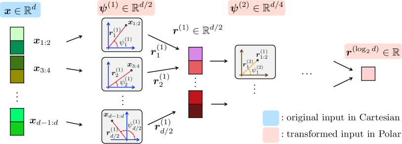
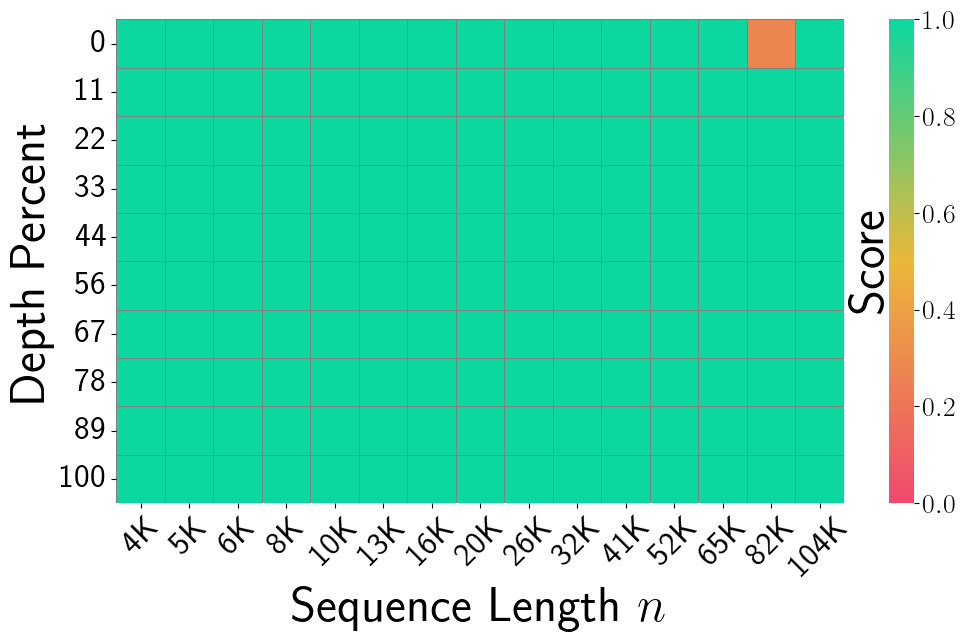
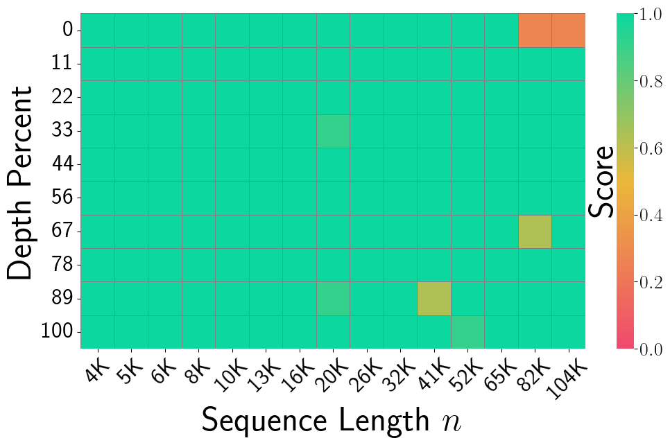
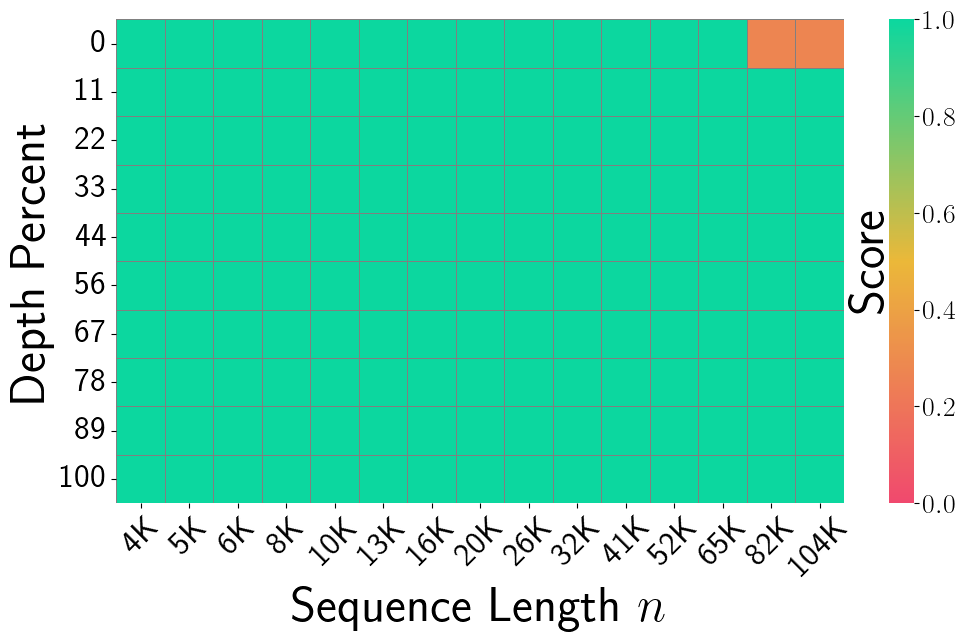
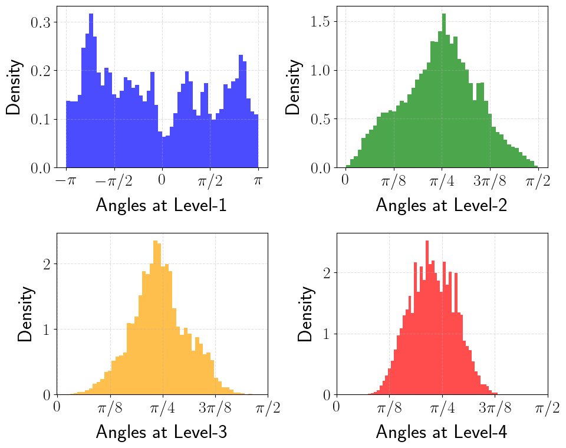
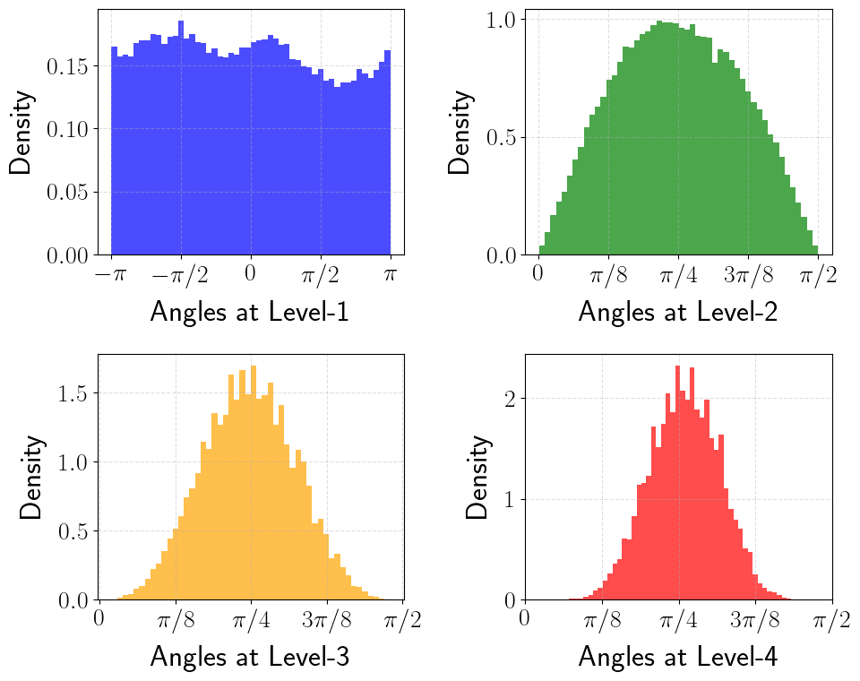

# PolarQuant: Quantizing KV Caches with Polar Transformation

**Insu Han, Praneeth Kacham, Vahab Mirrokni, Amin Karbasi, Amir Zandieh** — arXiv:2502.02617 [cs.LG], February 2025

| Dimension | Prior State | This Paper | Key Result |
|-----------|-------------|------------|------------|
| Quantization space | Cartesian coordinates; requires per-block normalization (min/max) stored in FP16 | Polar coordinates after random preconditioning; angle distribution is known analytically | No stored normalization constants |
| Angle distribution | Unknown / data-dependent | After random rotation, each level-$\ell$ angle independently follows $\propto \sin^{2^{\ell-1}-1}(2\psi)$ with $\text{Var}(\psi) = O(1/\sqrt{d})$ | Enables offline optimal codebook design |
| Compression | KIVI 3 bits, KVQuant 4.3 bits | 3.875 bits per coordinate (4+2+2+2 bit levels + 1 stored radius) | >4.2× compression vs. FP16 |
| Long-context recall | KIVI NIAH score 0.984; SnapKV 0.858 | PolarQuant NIAH score **0.991** | Best quality on needle-in-haystack at 104K context |

## Relations

**Builds on:** [[papers/kv-cache-quantization/qjl|QJL]] (random preconditioning idea; same research group)
**Extended by:** [[papers/kv-cache-quantization/turboquant|TurboQuant]] *(similar random-rotation paradigm)*
**Concepts used:** [[concepts/randomized-algorithms/metric-geometry-and-dimension-reduction|JL Transform and Metric Dimension Reduction]]

## Table of Contents

- [[#1. Motivation: Why Polar Coordinates?|1. Motivation: Why Polar Coordinates?]]
- [[#2. Random Preconditioning and Angle Distributions|2. Random Preconditioning and Angle Distributions]]
  - [[#2.1 Isotropic Gaussian After Preconditioning|2.1 Isotropic Gaussian After Preconditioning]]
  - [[#2.2 Angle Distribution in 2D (Lemma 1)|2.2 Angle Distribution in 2D (Lemma 1)]]
- [[#3. Recursive Polar Transformation|3. Recursive Polar Transformation]]
  - [[#3.1 Definition|3.1 Definition]]
  - [[#3.2 Distribution of All Angles (Lemma 2)|3.2 Distribution of All Angles (Lemma 2)]]
- [[#4. PolarQuant Algorithm|4. PolarQuant Algorithm]]
  - [[#4.1 Codebook Construction|4.1 Codebook Construction]]
  - [[#4.2 Main Error Bound (Theorem 1)|4.2 Main Error Bound (Theorem 1)]]
- [[#5. KV Cache Application|5. KV Cache Application]]
- [[#6. Experiments|6. Experiments]]
- [[#7. References|7. References]]

---

## 1. Motivation: Why Polar Coordinates?

📐 Classical block quantization of Cartesian coordinates requires storing a *scale* and *zero-point* per block because the range of coordinates is data-dependent. The overhead is unavoidable without knowing the distribution in advance.

The key insight of PolarQuant: **after a random rotation, the distribution of each embedding vector becomes (approximately) isotropic Gaussian regardless of the original data**. A Gaussian vector's polar representation — its angles — then has a known, analytically-computable distribution. This means we can design optimal quantization codebooks *offline* and store them as constants, eliminating all per-vector normalization overhead.

> [!NOTE] Contrast with QJL
> [[papers/kv-cache-quantization/qjl|QJL]] also applies a random projection as a preprocessing step, but quantizes in the Cartesian (sign-bit) domain. PolarQuant instead converts to polar coordinates and quantizes the angles, yielding a different trade-off: richer quantization at the cost of a more complex encoding/decoding algorithm.

---

## 2. Random Preconditioning and Angle Distributions

### 2.1 Isotropic Gaussian After Preconditioning

**Fact (Preconditioning induces Gaussianity).** For any fixed $x \in \mathbb{R}^d$, if $S \in \mathbb{R}^{d \times d}$ has i.i.d. entries $S_{ij} \sim \mathcal{N}(0,1)$, then

$$S \cdot x \sim \mathcal{N}(0, \|x\|_2^2 \cdot I_d).$$

The resulting vector is *isotropic* up to scaling by $\|x\|_2$. Any two coordinates $i \neq j$ of $Sx$ are independent zero-mean Gaussians with the same variance. This isotropy is what makes the angle distribution analytically tractable.

> [!INFO] Practical implementation uses a random rotation matrix
> In practice, PolarQuant uses a random *rotation* matrix $S$ satisfying $S^\top S = I$ rather than an i.i.d. Gaussian matrix. This preserves norms and inner products *exactly*, whereas an i.i.d. Gaussian matrix preserves them only approximately (up to JL distortion). The independence property used in the analysis is slightly weaker for rotation matrices but the empirical behavior is similar.

### 2.2 Angle Distribution in 2D (Lemma 1)

**Lemma 1.** Let $x, y \geq 0$ be i.i.d. samples from the generalized Gamma distribution with PDF

$$f_Z(z) = \frac{2}{2^{d/2} \Gamma(d/2)}\, z^{d-1} e^{-z^2/2}.$$

Define the polar angle $\theta := \tan^{-1}(y/x) \in [0, \pi/2]$. Then

$$f_\Theta(\theta) = \frac{\Gamma(d)}{2^{d-2}\,\Gamma(d/2)^2}\,\sin^{d-1}(2\theta),$$

with $\mathbb{E}[\Theta] = \pi/4$ and $\text{Var}(\Theta) = O(1/\sqrt{d})$.

📐 *Interpretation:* The angle concentrates near $\pi/4$ (equal contributions from both coordinates) and its variance *shrinks* as $d$ grows. For large $d$, the angle is nearly a point mass at $\pi/4$. This concentration is what allows very few bits to represent these angles accurately — there is simply not much variability to encode.

> [!EXAMPLE] Concentration of angles
> At $d = 128$ (typical LLM embedding dim), $\text{Var}(\theta) \approx O(d^{-1/2}) \approx 0.09$ radians, meaning angles deviate from $\pi/4$ by about $\pm 17°$ on average. A uniform 3-bit quantizer over $[0, \pi/2]$ already achieves low error. PolarQuant's *optimal* (Lloyd-Max) quantizer does even better.

---

## 3. Recursive Polar Transformation

### 3.1 Definition

🔑 **Definition 1 (Cartesian to Polar Transformation).** For $d = 2^J$ (a power of two), define a *tree-structured* polar transform of $x \in \mathbb{R}^d$ with $\log_2 d$ levels. At level $\ell \in \{1, \ldots, \log_2 d\}$, there are $d/2^\ell$ angles:

$$\psi_j^{(\ell)} := \tan^{-1}\!\left(\frac{\|r^{(\ell-1)}_{(j-1/2) \cdot 2 + 1 : j \cdot 2}\|_2}{\|r^{(\ell-1)}_{(j-1) \cdot 2 + 1 : (j-1/2) \cdot 2}\|_2}\right), \quad j \in [d/2^\ell],$$

where $r^{(0)} = x$ and $r_j^{(\ell)} = \|r^{(\ell-1)}_{2j-1:2j}\|_2$ are the Euclidean norms of successive pairs.

The transform produces $d - 1$ angles across $\log_2 d$ levels (level 1 has $d/2$ angles in $[0, 2\pi)$; levels $\ell \geq 2$ have $d/2^\ell$ angles each in $[0, \pi/2]$) plus a single final radius $r^{(\log_2 d)} = \|x\|_2$.

```python
def polar_transform(x):
    """Tree-structured Cartesian-to-polar transform. d must be power of 2."""
    d = len(x)
    r = x.copy()
    angles = []
    for level in range(int(np.log2(d))):
        new_r = []
        level_angles = []
        for j in range(len(r) // 2):
            a, b = r[2*j], r[2*j+1]
            level_angles.append(np.arctan2(b, a))  # angle in [0, 2pi) for level 0
            new_r.append(np.hypot(a, b))            # norm of pair
        angles.append(np.array(level_angles))
        r = np.array(new_r)
    return r[0], angles  # (scalar radius, list of angle vectors)
```


*Figure 1 (Han et al., 2025): The tree-structured polar transformation applied to a $d$-dimensional input (shown in blue, left). At each level, successive coordinate pairs are replaced by their Euclidean norm (propagated upward, shown in red) and their arctangent angle (stored as output). After $\log_2 d$ levels, the representation consists of $d-1$ angles at varying levels plus a single scalar radius.*

> [!INFO] Information content of the representation
> The $d-1$ angles plus 1 radius together encode the full $d$-dimensional vector. The radius $\|x\|_2$ is stored in FP16 (16 bits). The angles are quantized with varying bit widths per level, as described in Section 4.

### 3.2 Distribution of All Angles (Lemma 2)

**Lemma 2 (Distribution of Gaussian vector under polar transformation).** For $x \sim \mathcal{N}(0, I_d)$, the joint PDF of the radius $r = \|x\|_2$ and all angles $\psi^{(1)}, \ldots, \psi^{(\log_2 d)}$ **factorizes**:

$$f_{R, \Psi_d}(r, \psi_d(x)) = f_R(r) \cdot \prod_{\ell=1}^{\log_2 d} f_{\Psi^{(\ell)}}(\psi^{(\ell)}),$$

where level-$\ell$ angles are i.i.d. with PDF

$$f_\ell(\psi) = \frac{\Gamma(2^{\ell-1})}{2^{2^{\ell-1}-2}\,\Gamma(2^{\ell-2})^2}\,\sin^{2^{\ell-1}-1}(2\psi).$$

*Proof.* By induction on $d$. Base case $d=2$: the Jacobian of the polar change of variables for $(y_1, y_2) \mapsto (r, \theta)$ is $r$, giving $f_{R,\Theta} = (1/2\pi) \cdot r e^{-r^2/2}$, which factors. Inductive step: writing $x = (x_{1:d/2}, x_{d/2+1:d})$ with $r_1 = \|x_{1:d/2}\|_2$, $r_2 = \|x_{d/2+1:d}\|_2$, and $\theta = \tan^{-1}(r_2/r_1)$, the joint density factors into contributions from each half (since $x_{1:d/2} \perp x_{d/2+1:d}$ under the Gaussian), applying the inductive hypothesis to each half. $\square$

> [!NOTE] Key implication: angles at different levels are independent
> The factored form means each angle can be quantized *independently* to minimize the total MSE. There is no benefit from joint coding, so the algorithm quantizes each angle separately with a 1D Lloyd-Max quantizer tuned to $f_\ell$.

**Concentration across levels.** The density $\sin^{2^{\ell-1}-1}(2\psi)$ becomes *more concentrated* around $\pi/4$ as $\ell$ increases (larger exponent → tighter peak). This means higher-level angles require *fewer bits* to quantize accurately. PolarQuant exploits this by using more bits at level 1 and fewer at deeper levels.

---

## 4. PolarQuant Algorithm

### 4.1 Codebook Construction

For each level $\ell$, the quantization problem is a continuous 1D $k$-means: partition $[0, \pi/2]$ into $2^b$ intervals and find centroids $\theta_1, \ldots, \theta_{2^b}$ minimizing

$$\mathbb{E}_{\psi \sim f_\ell}\!\left[\min_j (\psi - \theta_j)^2\right].$$

Since $f_\ell$ is known analytically, this can be solved offline by the *Lloyd-Max algorithm* (iterative 1D $k$-means). The resulting codebooks are precomputed constants — they do not depend on the data.

> [!TIP] Bit allocation per level
> Practical implementation uses 4 levels ($L = 4$), giving blocks of 16 coordinates. Bit allocation:
> - Level 1: **4 bits** (range $[0, 2\pi)$, 4× wider than other levels)
> - Levels 2–4: **2 bits each**
> - Plus 1 FP16 radius per block of 16 coordinates
>
> Total: $(16 + 32 + 8 + 4 + 2)/16 = 62/16 = \mathbf{3.875}$ bits/coordinate.

### 4.2 Main Error Bound (Theorem 1)

**Theorem 1.** For $x \sim \mathcal{N}(0, I_d)$, the PolarQuant scheme using $O(\log 1/\varepsilon)$ bits per coordinate reconstructs $x'$ satisfying

$$\mathbb{E}\!\left[\|x - x'\|_2^2\right] = \varepsilon \cdot \|x\|_2^2.$$

This matches the optimal ε-net construction (which rounds $x/\|x\|_2$ to the nearest point in an ε-net of $S^{d-1}$ of size $(1/\varepsilon)^d$) without the impractical codebook storage of size $(1/\varepsilon)^d$.

> [!WARNING] Gaussian assumption
> Theorem 1 is stated for a Gaussian input; after random preconditioning, any fixed vector can be treated as approximately Gaussian (Fact 3), so the theorem applies. *Strictly speaking*, the result requires the random preconditioning matrix to have i.i.d. Gaussian entries, not just a rotation. The practical rotation-matrix implementation is justified empirically.

---

## 5. KV Cache Application

Given a stream of queries, keys, and values $(q_i, k_i, v_i) \in \mathbb{R}^d$, the attention output is

$$\text{softmax}\!\left(\frac{K_{:i} q_i^\top}{\sqrt{d}}\right) V_{:i}.$$

PolarQuant applies Algorithm 1 to each $k_i$ and $v_i$ before caching. At query time, the *dequantized* keys $\hat{k}_i$ are used directly in the inner product computation. The angle codebooks are precomputed offline or via lightweight online $k$-means during the prefill phase (online variant has slightly better quality).

Memory analysis for Llama-3.1-8B-Instruct ($d = 128$, FP16):
$$\text{Naive: } d \cdot 16 = 2048 \text{ bits}. \qquad \text{PolarQuant: } 16 + (127 \cdot 3.875) \approx 508 \text{ bits} \approx 4 \times \text{ compression.}$$

---

## 6. Experiments

All experiments on a single RTX A6000 GPU (48 GB). Benchmarks: LongBench (long-context QA), RULER (synthetic long-range recall), and Needle-In-A-Haystack (NIAH).

| Method | ~Bits/Coord | NIAH Score (Llama-3.1-8B, 4K–104K) |
|--------|------------|-------------------------------------|
| FP16 (exact) | 16 | 0.995 |
| SnapKV | — | 0.858 |
| PyramidKV | — | 0.891 |
| KIVI | ~3 | 0.984 |
| **PolarQuant** | **~3.875** | **0.991** |
| PolarQuant-R (random codebook) | ~3.875 | 0.990 |


*Figure 3, FP16 Exact (Han et al., 2025): Needle-In-A-Haystack recall heatmap for the unquantized FP16 baseline on Llama-3.1-8B-Instruct. Sequence lengths range from 4K to 104K (x-axis) and needle depth from 0–100% (y-axis). Near-perfect recall (solid green) across all depths and lengths, with only a single orange cell at the very long context boundary — the ceiling reference.*


*Figure 3, KIVI (Han et al., 2025): NIAH recall under KIVI 3-bit Cartesian quantization. Yellow and light-green patches appear at longer contexts (20K–65K) and certain depths, indicating recall failures from quantization errors on outlier key coordinates.*


*Figure 3, PolarQuant (Han et al., 2025): NIAH recall for PolarQuant (~3.875 bits/coord) with random preconditioning. The heatmap closely matches the FP16 baseline — almost entirely solid green — demonstrating that the polar quantization scheme with preconditioning preserves long-context retrieval fidelity with greater than 4× compression over FP16.*

*Surprising result:* PolarQuant's random-preconditioning eliminates the outlier problem that plagues KIVI and requires special handling in QJL. As shown in Figure 2 of the paper, preconditioning "flattens" the angle distribution and removes outliers, allowing a single codebook to work well for all tokens across all layers.


*Figure 2a (Han et al., 2025): Angle distributions at levels 1–4 of the polar transform **without** random preconditioning, measured on real key embeddings. Level-1 angles are multimodal with pronounced spikes near $\pm\pi$, reflecting the non-isotropic structure of raw key vectors. A single offline codebook tuned to the theoretical $\sin^{d-1}(2\psi)$ density would perform poorly here.*


*Figure 2b (Han et al., 2025): The same angle distributions **after** random preconditioning. Level-1 angles are now nearly uniform over $[-\pi, \pi]$, and levels 2–4 are well-concentrated bell-shaped distributions centered at $\pi/4$, closely matching the theoretical prediction of Lemma 2. The offline codebook is now optimal for the actual data distribution.*

---

## 7. References

| Reference | Brief Summary | Link |
|-----------|---------------|------|
| Han et al. (PolarQuant, 2025) | This paper | [arXiv:2502.02617](https://arxiv.org/abs/2502.02617) |
| Zandieh et al. (QJL, 2024) | 1-bit sign-based KV cache quantization | [arXiv:2406.03482](https://arxiv.org/abs/2406.03482) |
| Dasgupta & Gupta (JL, 2003) | Elementary JL proof | [Paper](https://onlinelibrary.wiley.com/doi/10.1002/rsa.10073) |
| Touvron et al. (Llama-2, 2023) | Open-source LLM used in experiments | [arXiv:2307.09288](https://arxiv.org/abs/2307.09288) |
| Liu et al. (KIVI, 2024) | Asymmetric 2-bit KV cache quantization | [arXiv:2402.02750](https://arxiv.org/abs/2402.02750) |
| Bai et al. (LongBench, 2023) | Long-context bilingual benchmark | [arXiv:2308.14508](https://arxiv.org/abs/2308.14508) |
