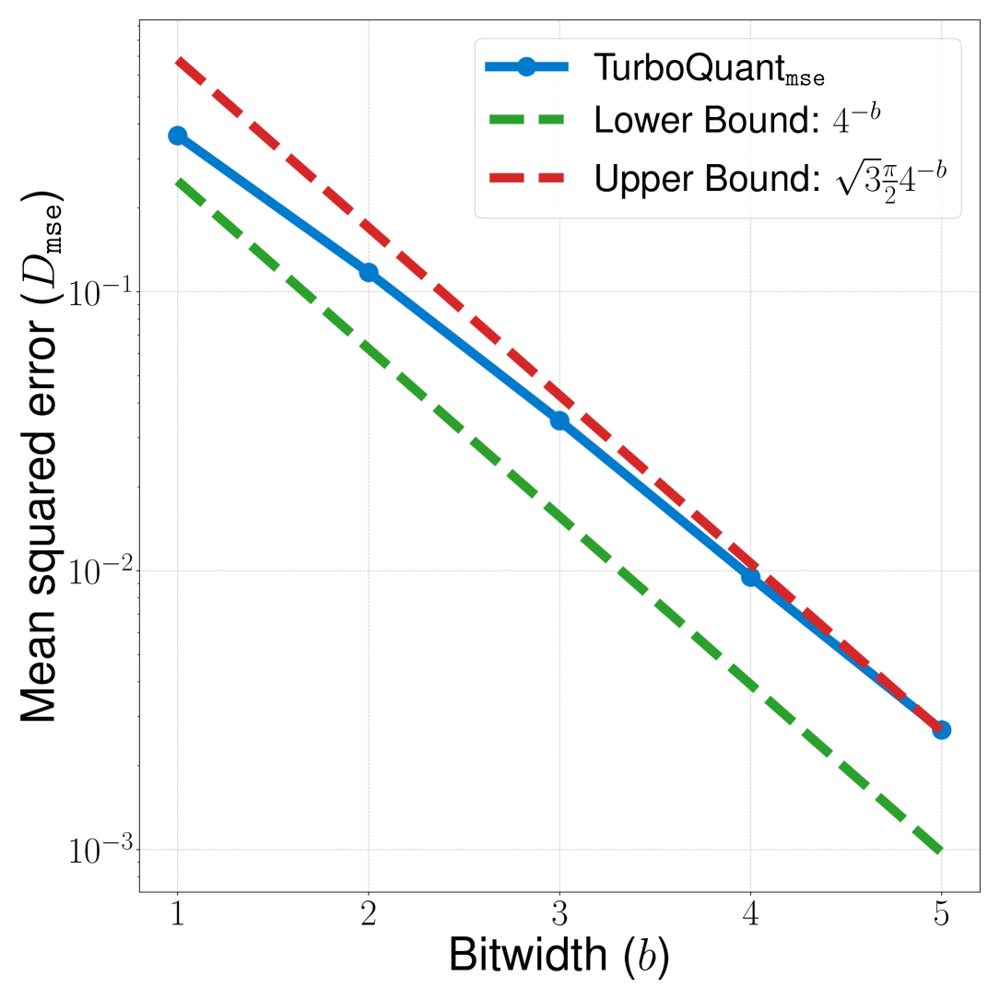
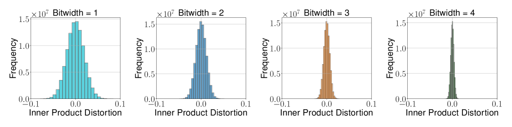
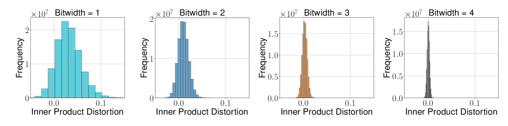
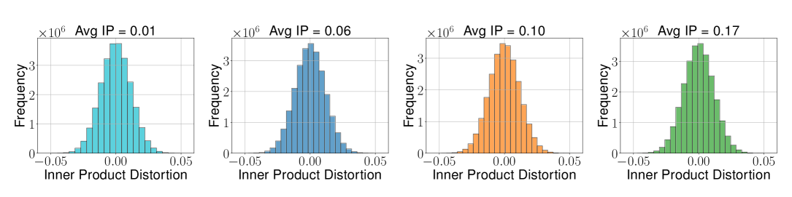
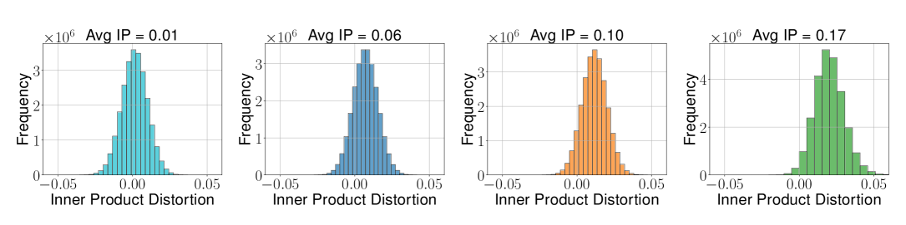
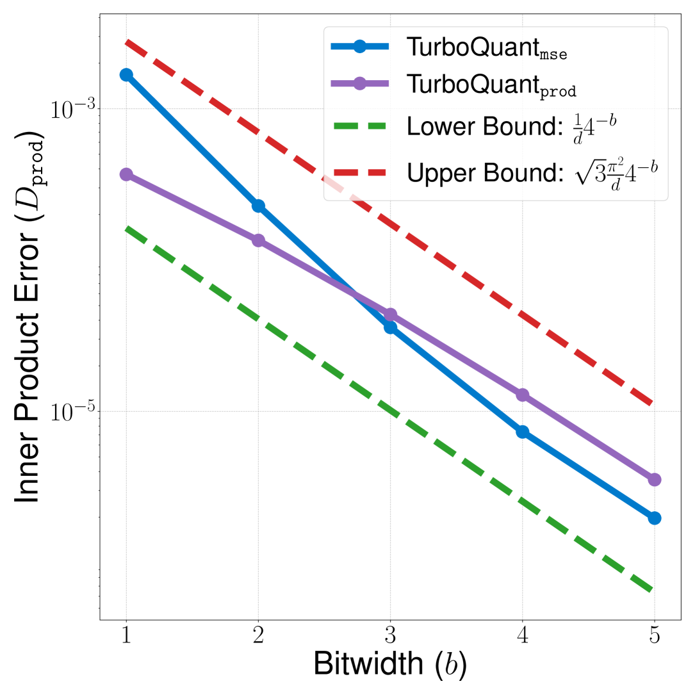
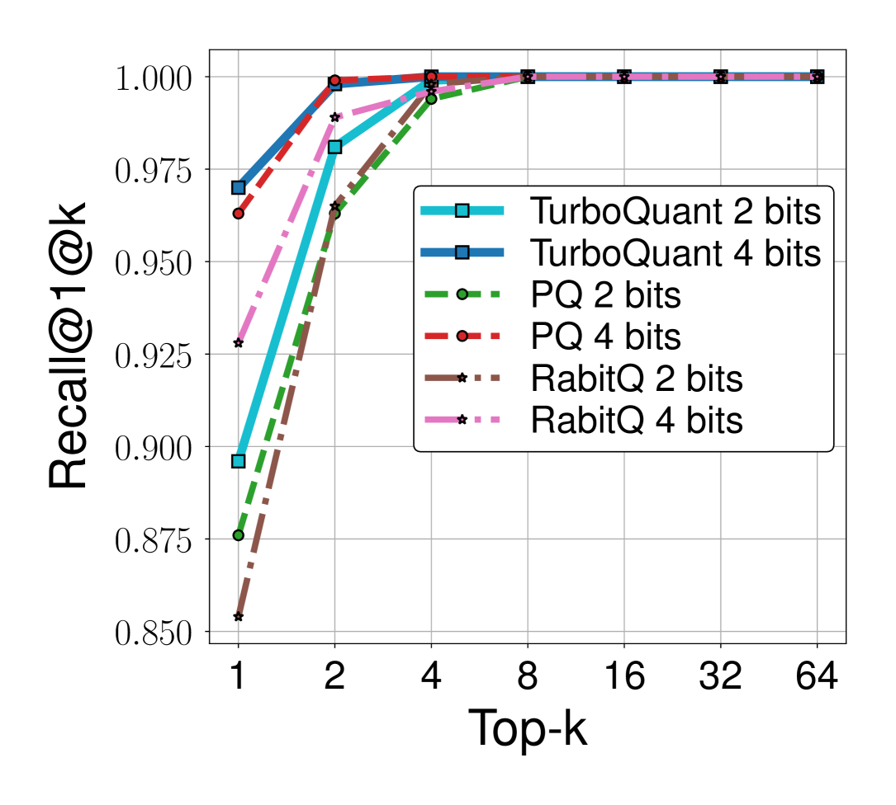

# TurboQuant: Online Vector Quantization with Near-optimal Distortion Rate

**Amir Zandieh, Majid Daliri, Majid Hadian, Vahab Mirrokni** — arXiv:2504.19874 [cs.LG], April 2025

| Dimension | Prior State | This Paper | Key Result |
|-----------|-------------|------------|------------|
| MSE distortion rate | No prior data-oblivious method had tight $O(1/4^b)$ dependence | Random rotation → Beta distribution → scalar Lloyd-Max quantizer | $D_{\text{mse}} \leq \frac{2\sqrt{3\pi}}{1} \cdot 4^{-b}$, within $2.7\times$ of information-theoretic lower bound |
| Inner product bias | MSE-optimal quantizers are biased for inner products (bias $= 2/\pi$ at $b=1$) | Two-stage: $(b-1)$-bit MSE quantizer + 1-bit QJL on residual | Unbiased estimator; $D_{\text{prod}} \leq \frac{3\pi^2\|y\|_2^2}{d} \cdot 4^{-b}$ |
| Information-theoretic lower bound | Not formally proved for expected distortion of randomized quantizers | Yao minimax + Shannon lower bound | Any $b$-bit quantizer satisfies $D_{\text{mse}} \geq 4^{-b}$, $D_{\text{prod}} \geq \frac{1}{d} 4^{-b}$ |
| KV cache quality neutrality | KIVI achieves neutrality at 3 bits | TurboQuant achieves neutrality at **3.5 bits**, marginal degradation at 2.5 bits | Tighter distortion-rate trade-off |

## Relations

**Builds on:** [[papers/kv-cache-quantization/qjl|QJL]] (used as inner-product bias-correction subroutine)
**Builds on:** [[papers/kv-cache-quantization/polarquant|PolarQuant]] *(parallel work; same random-rotation approach)*
**Concepts used:** [[concepts/randomized-algorithms/metric-geometry-and-dimension-reduction|JL Transform and Metric Dimension Reduction]]

## Table of Contents

- [[#1. Problem Definition|1. Problem Definition]]
- [[#2. Information-Theoretic Lower Bounds|2. Information-Theoretic Lower Bounds]]
  - [[#2.1 Shannon Distortion-Rate Function|2.1 Shannon Distortion-Rate Function]]
  - [[#2.2 Lower Bound via Yao Minimax (Theorem 3)|2.2 Lower Bound via Yao Minimax (Theorem 3)]]
- [[#3. TurboQuantmse: MSE-Optimal Quantization|3. TurboQuantmse: MSE-Optimal Quantization]]
  - [[#3.1 Beta Distribution from Random Rotation|3.1 Beta Distribution from Random Rotation]]
  - [[#3.2 Near-Independence of Coordinates|3.2 Near-Independence of Coordinates]]
  - [[#3.3 Scalar Lloyd-Max Quantizer|3.3 Scalar Lloyd-Max Quantizer]]
  - [[#3.4 MSE Distortion Bound (Theorem 1)|3.4 MSE Distortion Bound (Theorem 1)]]
- [[#4. TurboQuantprod: Unbiased Inner Product Quantization|4. TurboQuantprod: Unbiased Inner Product Quantization]]
  - [[#4.1 Bias of MSE Quantizers|4.1 Bias of MSE Quantizers]]
  - [[#4.2 Two-Stage QJL Residual Scheme|4.2 Two-Stage QJL Residual Scheme]]
  - [[#4.3 Inner Product Distortion Bound (Theorem 2)|4.3 Inner Product Distortion Bound (Theorem 2)]]
- [[#5. Experiments|5. Experiments]]
- [[#6. References|6. References]]

---

## 1. Problem Definition

🔑 **Problem setup.** A *$b$-bit vector quantizer* is a pair $(Q, Q^{-1})$ where $Q : \mathbb{R}^d \to \{0,1\}^{bd}$ compresses $x$ into $bd$ bits and $Q^{-1}: \{0,1\}^{bd} \to \mathbb{R}^d$ reconstructs an approximation. Two distortion objectives:

$$D_{\text{mse}}(Q) := \mathbb{E}_Q\!\left[\|x - Q^{-1}(Q(x))\|_2^2\right] \quad \text{(MSE distortion)}$$

$$D_{\text{prod}}(Q) := \mathbb{E}_Q\!\left[(\langle y, x\rangle - \langle y, Q^{-1}(Q(x))\rangle)^2\right] \quad \text{(inner product distortion)}$$

For the inner product objective, we additionally require *unbiasedness*: $\mathbb{E}_Q[\langle y, Q^{-1}(Q(x))\rangle] = \langle y, x\rangle$ for all $y$.

> [!NOTE] Why two separate objectives?
> MSE measures average reconstruction error in $\ell_2$ norm. Inner product distortion directly measures how well attention scores (which are inner products) are preserved. *MSE-optimal quantizers are not unbiased for inner products* — TurboQuant addresses both with different algorithms ($Q_{\text{mse}}$ and $Q_{\text{prod}}$).

The goal is *online* (data-oblivious, no offline training) quantizers achieving near-optimal distortion rate, expressed as a function of bit-width $b$.

---

## 2. Information-Theoretic Lower Bounds

### 2.1 Shannon Distortion-Rate Function

Shannon's source coding theory establishes that for a source $X \sim P$ and distortion measure $D$, the minimum achievable distortion at rate $R$ bits is

$$D^*(R) = \min_{P_{\hat{X}|X}: I(X;\hat{X}) \leq R} \mathbb{E}[d(X, \hat{X})].$$

For $X$ uniform on $S^{d-1}$ with MSE distortion, a classical result (Zador 1963, via sphere packing) gives $D_{\text{mse}}^*(b) = \Theta(4^{-b})$. TurboQuant's lower bound is proved for the *expected* distortion of randomized quantizers, which is more directly comparable to its upper bounds.

### 2.2 Lower Bound via Yao Minimax (Theorem 3)

🔑 **Theorem 3 (Lower bound on best achievable distortion).** For any randomized quantizer $Q : S^{d-1} \to \{0,1\}^{bd}$ and any reconstruction map $Q^{-1}$, there exists $x \in S^{d-1}$ such that

$$D_{\text{mse}}(Q) \geq \frac{1}{4^b}.$$

Furthermore, there exists $y \in S^{d-1}$ such that

$$D_{\text{prod}}(Q) \geq \frac{1}{d} \cdot \frac{1}{4^b}.$$

📐 *Proof.* By **Yao's minimax principle**: the worst-case expected error of the best *randomized* algorithm equals the average-case error of the best *deterministic* algorithm under the hardest input distribution. So

$$\min_{\text{randomized } Q} \max_x \mathbb{E}[D(Q, x)] = \min_{\text{deterministic } Q} \mathbb{E}_{x \sim \pi^*}[D(Q, x)],$$

where $\pi^*$ is the hardest input distribution. By Shannon's lower bound (Lemma 3 in the paper), the RHS is $\geq 4^{-b}$ when $x$ is uniform on $S^{d-1}$.

For the inner product bound: from the MSE bound $D_{\text{mse}} \geq 4^{-b}$ we have $\sum_{j=1}^d \mathbb{E}[(\langle e_j, x\rangle - \langle e_j, \hat{x}\rangle)^2] \geq 4^{-b}$. By the pigeonhole principle, some coordinate $j^*$ satisfies $\mathbb{E}[(\langle e_{j^*}, x\rangle - \langle e_{j^*}, \hat{x}\rangle)^2] \geq \frac{1}{d} \cdot 4^{-b}$, completing the proof. $\square$

**Optimality gap:** TurboQuant achieves $D_{\text{mse}} \leq \frac{2\sqrt{3\pi}}{1} \cdot 4^{-b} \approx 2.7 \cdot 4^{-b}$, so the gap is at most a factor of $2\sqrt{3\pi} \approx 2.7$ — and much smaller at low bit-widths ($b=1$: gap is $\approx 1.45\times$).

---

## 3. TurboQuantmse: MSE-Optimal Quantization

### 3.1 Beta Distribution from Random Rotation

The core technique: apply a random orthogonal rotation $\Pi \in \mathbb{R}^{d \times d}$ ($\Pi^\top \Pi = I$) to $x \in S^{d-1}$ before quantizing. By rotational invariance of the uniform distribution on $S^{d-1}$, $\Pi x$ is again uniform on $S^{d-1}$.

**Key fact:** If $z = \Pi x$ with $x \in S^{d-1}$ and $\Pi$ a random rotation, each coordinate $z_i$ follows a distribution with

$$z_i^2 \sim \text{Beta}\!\left(\tfrac{1}{2}, \tfrac{d-1}{2}\right), \quad z_i \in [-1, 1].$$

In high dimensions $d \gg 1$, by concentration of measure (CLT):

$$z_i \approx \mathcal{N}\!\left(0, \frac{1}{d}\right),$$

with the distribution concentrating tightly around 0. The Beta distribution provides the exact analytical form needed to design an optimal scalar quantizer.

> [!EXAMPLE] Why Beta?
> On $S^{d-1}$, the marginal distribution of a single coordinate is known by the classical "shadow" computation: integrating out $d-1$ coordinates of the uniform sphere gives $f(z_1) \propto (1 - z_1^2)^{(d-3)/2}$, which is precisely $\text{Beta}(1/2, (d-1)/2)$ after the change of variables $t = z_1^2$.

### 3.2 Near-Independence of Coordinates

A deeper fact is that, for large $d$, any two distinct coordinates $z_i, z_j$ of a uniform random unit vector are *nearly independent* — not just uncorrelated. Formally, their total variation distance from independence vanishes as $d \to \infty$. This *near-independence* justifies applying a separate 1D optimal quantizer to each coordinate independently, without incurring significant loss from ignoring cross-coordinate structure.

> [!NOTE] Near-independence vs. uncorrelatedness
> In general, uncorrelated random variables need not be independent. The near-independence of sphere coordinates requires a finer argument using hypercontractivity of the Bonami-Beckner operator on the sphere. The practical upshot is that optimizing each coordinate's quantizer independently is (asymptotically) as good as optimizing their joint quantizer.

### 3.3 Scalar Lloyd-Max Quantizer

Given the analytical distribution $f_b := \text{Beta}(1/2, (d-1)/2)$ for each coordinate, we find the optimal $2^b$-level scalar quantizer by solving a 1D continuous $k$-means problem:

$$\min_{\{I_k, c_k\}_{k=1}^{2^b}} \mathbb{E}_{z \sim f_b}\!\left[\sum_k \mathbf{1}[z \in I_k]\,(z - c_k)^2\right].$$

This is solved by the *Lloyd-Max algorithm*: iterate between assigning each point to the nearest centroid and recomputing centroids as conditional expectations. The resulting codebooks are precomputed offline for practically useful bit-widths $b \in \{1, 2, 3, 4\}$ — a constant-size lookup table.

```python
def lloyd_max_quantizer(pdf, support, num_levels, n_iter=100):
    """Solve 1D continuous k-means for optimal scalar quantizer."""
    # Initialize centroids uniformly
    centroids = np.linspace(support[0], support[1], num_levels)
    for _ in range(n_iter):
        # E-step: compute Voronoi boundaries (midpoints between centroids)
        boundaries = (centroids[:-1] + centroids[1:]) / 2
        boundaries = np.concatenate([[support[0]], boundaries, [support[1]]])
        # M-step: recompute centroids as conditional expectations
        new_centroids = []
        for k in range(num_levels):
            lo, hi = boundaries[k], boundaries[k+1]
            mass = quad(pdf, lo, hi)[0]
            mean = quad(lambda z: z * pdf(z), lo, hi)[0] / mass
            new_centroids.append(mean)
        centroids = np.array(new_centroids)
    return centroids, boundaries
```

### 3.4 MSE Distortion Bound (Theorem 1)

🔑 **Theorem 1.** The $b$-bit TurboQuant$_{\text{mse}}$ quantizer $Q_{\text{mse}} : \mathbb{R}^d \to \{0,1\}^{bd}$ satisfies, for any $x \in S^{d-1}$:

$$D_{\text{mse}}(Q_{\text{mse}}) \leq \frac{2\sqrt{3\pi}}{1} \cdot \frac{1}{4^b}.$$

For small bit-widths: $b=1,2,3,4$ gives $D_{\text{mse}} \approx 0.36, 0.117, 0.03, 0.009$.

The constant $2\sqrt{3\pi} \approx 6.1$ translates to a factor of $\approx 2.7$ over the lower bound $4^{-b}$.


*Figure 3b (Zandieh et al., 2025): MSE distortion $D_{\text{mse}}$ of TurboQuant$_{\text{mse}}$ (solid blue) plotted against the information-theoretic lower bound $4^{-b}$ (green dashed) and the theoretical upper bound $\sqrt{3\pi/2} \cdot 4^{-b}$ (red dashed) on a log scale. All three scale with the same $4^{-b}$ exponent, and the actual distortion stays tightly sandwiched within the $\approx 2.7\times$ gap.*

---

## 4. TurboQuantprod: Unbiased Inner Product Quantization

### 4.1 Bias of MSE Quantizers

MSE-optimal quantizers are *not* unbiased for inner products. Consider $b=1$: the optimal 1-bit MSE codebook for coordinates of a unit sphere consists of $\pm\sqrt{2/(\pi d)}$. This means $Q_{\text{mse}}(x) = \text{sign}(\Pi x)$ and the dequantization map is $Q_{\text{mse}}^{-1}(z) = \sqrt{2/(\pi d)} \cdot \Pi^\top z$. Then:

$$\mathbb{E}[\langle y, Q_{\text{mse}}^{-1}(Q_{\text{mse}}(x))\rangle] = \frac{2}{\pi} \langle y, x\rangle \neq \langle y, x\rangle.$$

**The bias is $2/\pi \approx 0.637$**, a significant multiplicative error. This bias decreases as $b$ increases (the MSE quantizer converges to identity), but is present for all finite $b$.


*Figure 1a (Zandieh et al., 2025): Inner product distortion histogram for TurboQuant$_{\text{prod}}$ at bit-widths $b=1,2,3,4$. The distribution is symmetric and centered at zero, confirming the unbiasedness of the two-stage scheme.*


*Figure 1b (Zandieh et al., 2025): Inner product distortion histogram for TurboQuant$_{\text{mse}}$ at the same bit-widths. The distribution is visibly skewed with a non-zero mean, showing the systematic bias of the MSE-optimal quantizer when used for inner product estimation.*

> [!DANGER] Why bias matters in applications
> In nearest-neighbor search, a biased estimator would score all database points systematically low relative to the true inner products, distorting rankings and reducing recall. In KV cache quantization, a multiplicative bias on attention logits directly distorts attention weights and degrades generation quality.

### 4.2 Two-Stage QJL Residual Scheme

The fix: compose $Q_{\text{mse}}$ at bit-width $b-1$ with a [[papers/kv-cache-quantization/qjl|QJL]] 1-bit sketch on the *residual*.

Let $r := x - Q_{\text{mse}}^{-1}(Q_{\text{mse}}(x))$ be the quantization residual. Define

$$Q_{\text{prod}}(x) := \bigl(Q_{\text{mse}}(x),\; Q_{\text{qjl}}(r),\; \|r\|_2\bigr),$$

where $Q_{\text{qjl}}$ is a QJL sketch matrix $S \in \mathbb{R}^{d \times d}$ followed by sign-bit quantization. Dequantization:

$$Q_{\text{prod}}^{-1}(\cdot) = Q_{\text{mse}}^{-1}(Q_{\text{mse}}(x)) + \|r\|_2 \cdot Q_{\text{qjl}}^{-1}(Q_{\text{qjl}}(r)),$$

where the QJL dequantization is the [[papers/kv-cache-quantization/qjl|QJL asymmetric inner product estimator]].

```python
def turbo_quant_prod(x, codebook_b_minus_1, S):
    """Two-stage: MSE quantizer at (b-1) bits + QJL on residual."""
    # Stage 1: MSE quantization at (b-1) bits
    idx_mse = quantize(x, codebook_b_minus_1)          # d × (b-1) bits
    x_mse = dequantize(idx_mse, codebook_b_minus_1)
    # Stage 2: QJL on residual
    r = x - x_mse
    gamma = np.linalg.norm(r)                           # 1 FP16 scalar
    qjl_bits = np.sign(S @ r)                           # d × 1 bits
    return idx_mse, qjl_bits, gamma

def inner_product_estimate(y, idx_mse, qjl_bits, gamma, codebook, S):
    x_mse = dequantize(idx_mse, codebook)
    qjl_estimate = (np.sqrt(np.pi / 2) / len(qjl_bits)) * gamma * np.dot(S @ y, qjl_bits)
    return np.dot(y, x_mse) + qjl_estimate             # unbiased!
```


*Figure 2a (Zandieh et al., 2025): Inner product error distribution for TurboQuant$_{\text{prod}}$ conditioned on different average inner product values (b=2). The spread remains constant regardless of the average IP, confirming homoskedasticity.*


*Figure 2b (Zandieh et al., 2025): Inner product error distribution for TurboQuant$_{\text{mse}}$ at the same settings. The variance grows with the average inner product — a direct consequence of the multiplicative bias: the error $\langle y,x\rangle(1 - 2/\pi)$ scales with the true inner product.*

### 4.3 Inner Product Distortion Bound (Theorem 2)

🔑 **Theorem 2.** $Q_{\text{prod}}$ at bit-width $b$ satisfies, for any $x \in S^{d-1}$ and any $y$:

1. **Unbiasedness:** $\mathbb{E}[\langle y, Q_{\text{prod}}^{-1}(Q_{\text{prod}}(x))\rangle] = \langle y, x\rangle$.

2. **Distortion:** $D_{\text{prod}} \leq \dfrac{3\pi^2 \|y\|_2^2}{d} \cdot \dfrac{1}{4^b}$.

For $b = 1,2,3,4$: $D_{\text{prod}} \approx 1.57/d,\; 0.56/d,\; 0.18/d,\; 0.047/d$.

📐 *Proof sketch.* Let $\tilde{x}_{\text{mse}} = Q_{\text{mse}}^{-1}(Q_{\text{mse}}(x))$ and $r = x - \tilde{x}_{\text{mse}}$.

**Unbiasedness:** By law of total expectation and linearity,

$$\mathbb{E}[\langle y, \hat{x}\rangle \mid \tilde{x}_{\text{mse}}] = \langle y, \tilde{x}_{\text{mse}}\rangle + \mathbb{E}[\langle y, \hat{x}_{\text{qjl}}\rangle \mid \tilde{x}_{\text{mse}}] = \langle y, \tilde{x}_{\text{mse}}\rangle + \langle y, r\rangle = \langle y, x\rangle,$$

using QJL unbiasedness for the middle step. Taking the outer expectation gives unbiasedness.

**Distortion:** Conditioning on $\tilde{x}_{\text{mse}}$ and applying the QJL variance bound (Lemma 3.5 of [[papers/kv-cache-quantization/qjl|QJL]]):

$$\mathbb{E}\bigl[|\langle y, x\rangle - \langle y, \hat{x}\rangle|^2 \mid \tilde{x}_{\text{mse}}\bigr] = \text{Var}[\langle y, \hat{x}_{\text{qjl}}\rangle] \leq \frac{\pi}{2d} \|r\|_2^2 \|y\|_2^2.$$

Averaging over $\tilde{x}_{\text{mse}}$ and applying Theorem 1 at bit-width $b-1$:

$$D_{\text{prod}} \leq \frac{\pi \|y\|_2^2}{2d} \cdot D_{\text{mse}}(b-1) \leq \frac{\pi \|y\|_2^2}{2d} \cdot \frac{2\sqrt{3\pi}}{4^{b-1}} = \frac{3\pi^2 \|y\|_2^2}{d} \cdot \frac{1}{4^b}. \quad \square$$


*Figure 3a (Zandieh et al., 2025): Inner product error $D_{\text{prod}}$ vs bit-width $b$ for TurboQuant$_{\text{prod}}$ (purple) and TurboQuant$_{\text{mse}}$ (blue), plotted against the information-theoretic lower bound $\frac{1}{d}4^{-b}$ (green dashed) and the theoretical upper bound $\frac{\sqrt{3}\pi^2}{d}4^{-b}$ (red dashed). TurboQuant$_{\text{prod}}$ consistently outperforms the unbiased-but-lossy MSE approach at all bit-widths, and both track the $4^{-b}$ scaling law.*

---

## 5. Experiments

All experiments on a single NVIDIA A100 GPU.

**KV Cache Quantization (Llama-3.1 and Llama-3.2 families):**

| Method | Bits | Quality |
|--------|------|---------|
| FP16 (exact) | 16 | Neutral baseline |
| TurboQuant$_{\text{prod}}$ | **3.5** | Absolute quality neutrality |
| TurboQuant$_{\text{prod}}$ | **2.5** | Marginal quality degradation |

**Nearest Neighbor Search (DBpedia, 1536-dim OpenAI embeddings):**

- At the same bit budget, TurboQuant$_{\text{prod}}$ outperforms product quantization (PQ) and ScaNN variants in recall@1.
- Indexing time is *virtually zero* (no offline $k$-means training required) vs. hours for PQ.


*Figure 5b (Zandieh et al., 2025): Recall@1 at top-$k$ on OpenAI 1536-dimensional embeddings. TurboQuant at 2 bits matches or exceeds PQ and RabitQ at 2 bits across all values of $k$, and at 4 bits it converges to near-perfect recall at $k=4$. Crucially, TurboQuant requires no offline training while PQ requires expensive $k$-means clustering.*

> [!NOTE] Empirical validation of the Beta distribution
> The paper verifies that after random rotation, the coordinate histogram of actual LLM key embeddings matches the predicted Beta distribution closely. This confirms that the theoretical analysis — designed for worst-case unit sphere vectors — accurately predicts behavior on real LLM activations.

---

## 6. References

| Reference | Brief Summary | Link |
|-----------|---------------|------|
| Zandieh et al. (TurboQuant, 2025) | This paper | [arXiv:2504.19874](https://arxiv.org/abs/2504.19874) |
| Zandieh et al. (QJL, 2024) | 1-bit JL quantizer used as subroutine | [arXiv:2406.03482](https://arxiv.org/abs/2406.03482) |
| Shannon (1948, 1959) | Source coding and rate-distortion theory | Classic |
| Zador (1963) | High-resolution VQ distortion-rate theory | [Paper](https://ieeexplore.ieee.org/document/1057613) |
| Lloyd (1982), Max (1960) | Scalar quantizer optimization (Lloyd-Max algorithm) | Classic |
| Gersho (1979) | Vector quantization theory and Gersho's conjecture | [Paper](https://ieeexplore.ieee.org/document/1095832) |
| Han et al. (PolarQuant, 2025) | Parallel work using random preconditioning + polar transform | [arXiv:2502.02617](https://arxiv.org/abs/2502.02617) |
