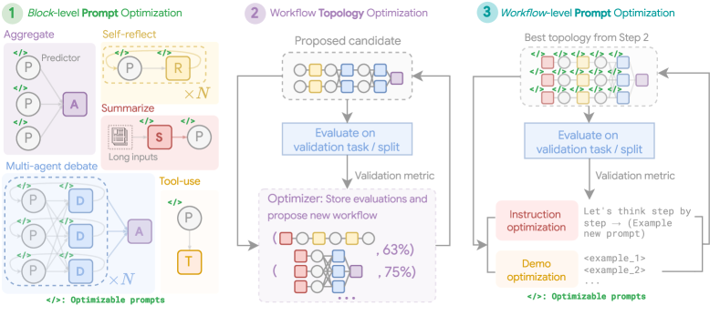
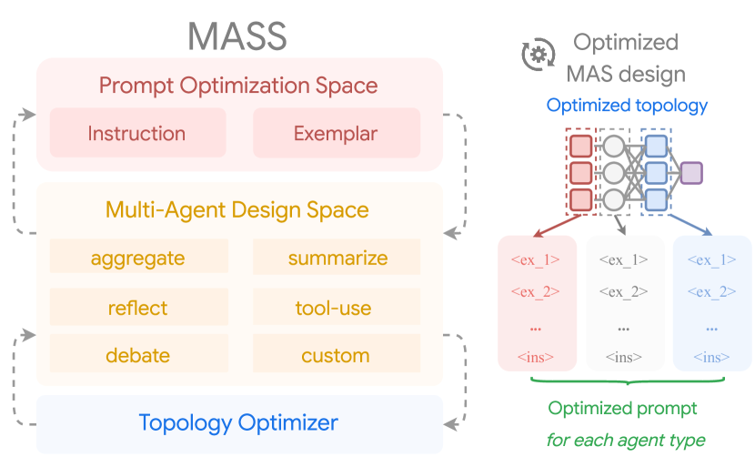
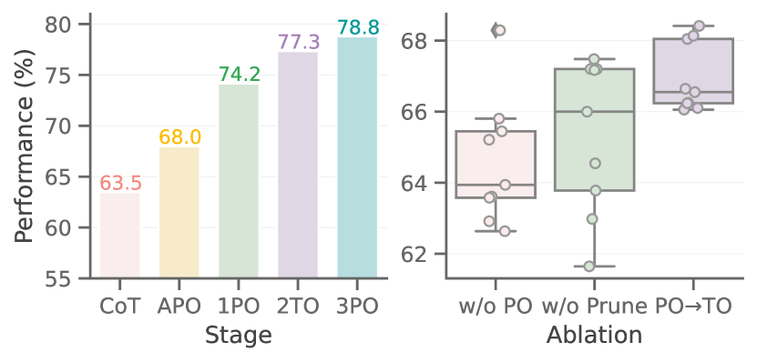
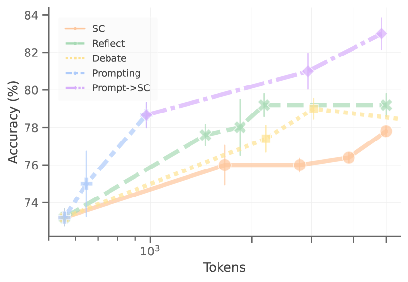

# Multi-Agent Design: Optimizing Agents with Better Prompts and Topologies

**Han Zhou, Xingchen Wan, Ruoxi Sun, Hamid Palangi, Shariq Iqbal, Ivan Vulić, Anna Korhonen, Sercan Ö. Arık**
*ICLR 2026 · [arXiv 2502.02533](https://arxiv.org/abs/2502.02533)*

---

| Dimension | Prior State | This Paper | Key Result |
|-----------|-------------|------------|------------|
| MAS design paradigm | Topology search is the primary lever; prompts treated as fixed or hand-crafted | Prompts and topologies are co-optimized in a three-stage pipeline | +8.5 pp average over multi-agent debate baseline across 8 benchmarks |
| Prompt role in MAS | Often overlooked; single-agent APO not extended to multi-agent blocks | Block-level + workflow-level APO both contribute independently and jointly | Block-level APO alone lifts average from 67.4% to 74.6% |
| Search space | Full combinatorial topology space with uniform sampling | Influence-weighted pruning focuses search on empirically effective building blocks | Topology search adds ~3 pp on top of prompt-optimized blocks |
| Generalization | Methods often tied to specific LLM backbone | MASS evaluated on Gemini 1.5 Pro, Claude 3.5 Sonnet, and Mistral Nemo-12B | Consistent +12–15 pp over CoT baseline across all three model families |

## Relations

**Builds on:** [MIPRO (Automatic Prompt Optimization)](https://arxiv.org/abs/2406.11695) *(no note yet)*, [ADAS: Automated Design of Agentic Systems](https://arxiv.org/abs/2408.08435) *(no note yet)*, [AFlow](https://arxiv.org/abs/2410.10762) *(no note yet)*
**Concepts used:** [[concepts/ml-theory/power-law-scaling|Neural Scaling Laws]], [[concepts/mixture-of-experts/note|Mixture of Experts]]

---

## Table of Contents

- [[#1. Background and Motivation|1. Background and Motivation]]
  - [[#1.1 The Multi-Agent Design Problem|1.1 The Multi-Agent Design Problem]]
  - [[#1.2 Why Multi-Agent Systems Improve Performance|1.2 Why Multi-Agent Systems Improve Performance]]
  - [[#1.3 A Taxonomy of Interaction Topologies|1.3 A Taxonomy of Interaction Topologies]]
  - [[#1.4 Agentic Design Patterns|1.4 Agentic Design Patterns]]
  - [[#1.5 Automated MAS Design: Prior Work|1.5 Automated MAS Design: Prior Work]]
- [[#2. The Design Space|2. The Design Space]]
  - [[#2.1 Agent Configuration|2.1 Agent Configuration]]
  - [[#2.2 Topology Building Blocks|2.2 Topology Building Blocks]]
  - [[#2.3 Combined Search Space|2.3 Combined Search Space]]
- [[#3. The MASS Framework|3. The MASS Framework]]
  - [[#3.1 Formal Optimization Objective|3.1 Formal Optimization Objective]]
  - [[#3.2 Stage 1: Block-Level Prompt Optimization|3.2 Stage 1: Block-Level Prompt Optimization]]
  - [[#3.3 Stage 2: Workflow Topology Optimization|3.3 Stage 2: Workflow Topology Optimization]]
  - [[#3.4 Stage 3: Workflow-Level Prompt Optimization|3.4 Stage 3: Workflow-Level Prompt Optimization]]
- [[#4. Empirical Results|4. Empirical Results]]
  - [[#4.1 Main Results on Gemini 1.5 Pro|4.1 Main Results on Gemini 1.5 Pro]]
  - [[#4.2 Ablation Study|4.2 Ablation Study]]
  - [[#4.3 Cross-Model Generalization|4.3 Cross-Model Generalization]]
  - [[#4.4 Token Efficiency|4.4 Token Efficiency]]
- [[#5. Design Principles|5. Design Principles]]
  - [[#5.1 Task-Topology Affinity|5.1 Task-Topology Affinity]]
  - [[#5.2 Optimization Ordering|5.2 Optimization Ordering]]
- [[#6. Comparison with Prior Automated MAS Methods|6. Comparison with Prior Automated MAS Methods]]
- [[#7. Limitations and Open Questions|7. Limitations and Open Questions]]
- [[#References|References]]

---

## 1. Background and Motivation 🤖

### 1.1 The Multi-Agent Design Problem

A *multi-agent system* (MAS) for language models is a computational graph in which multiple LLM-based agents, each with their own prompt (instruction text and optionally few-shot demonstrations), interact through a defined communication *topology* to produce a joint output on some task. The central design question is: given a task distribution $\mathcal{D}$ over input-output pairs $(x, y)$, which agent prompt templates and which interaction topology jointly maximize expected task performance?

The difficulty is the size of the joint space. Prompt space is effectively unbounded — natural language instructions and demonstrations admit infinitely many variations. Topology space, even when restricted to a finite catalog of interaction patterns, is combinatorial in the number and configuration of agents. Prior work has addressed these two dimensions separately: hand-crafting prompts and searching topologies, or vice versa.

### 1.2 Why Multi-Agent Systems Improve Performance

The formal justification for multi-agent systems rests on ensemble diversity. If each of $N$ agents independently produces the correct answer with probability $p > 0.5$, the probability that the majority vote is wrong is:

$$P(\text{majority wrong}) = \sum_{k > N/2} \binom{N}{k} (1-p)^k p^{N-k}$$

This bound decreases exponentially in $N$ — majority voting concentrates probability mass on the correct answer as agents are added, provided they make *independent* errors. For LLM-based agents sharing the same backbone, true independence is impossible, but functional diversity arises from prompt variation, role specialization, and sampling randomness.

[Du et al. (2023)](https://arxiv.org/abs/2305.14325) instantiate this with debate: when multiple LLM instances exchange competing claims and are required to defend their answers, factual accuracy improves because incorrect confident claims face explicit adversarial pressure. [Wang et al. (2023)](https://arxiv.org/abs/2203.11171) demonstrate a simpler version via *self-consistency*: sampling $k$ independent chain-of-thought traces and taking majority vote over final answers consistently outperforms single greedy decoding, purely by reducing variance in reasoning paths.

Beyond voting, multi-agent systems enable *division of cognitive labor*: separate agents can specialize in subtasks (decomposition, verification, synthesis), analogous to role-based routing in [[concepts/mixture-of-experts/note|Mixture of Experts]] architectures. The critical question — which this paper answers — is *which* combination of specialization, aggregation, and interaction rounds yields the best return on tokens spent.

### 1.3 A Taxonomy of Interaction Topologies

Agent interaction topologies vary along two axes: *directionality* (how information flows) and *connectivity* (the graph structure). Six canonical patterns appear across the literature:

| Topology | Connectivity | Information Flow | Representative Systems |
|----------|-------------|-----------------|----------------------|
| Sequential | Linear chain | Unidirectional; each agent processes and forwards | HuggingGPT (Shen et al., 2023) |
| Parallel (aggregation) | Star/broadcast | One producer → many independent voters → aggregator | Self-Consistency (Wang et al., 2023) |
| Self-critique (reflection) | Self-loop | Agent critiques its own output and revises iteratively | Reflexion (Shinn et al., 2023), Self-Refine (Madaan et al., 2023) |
| Debate | Fully-connected | Agents exchange competing claims; consensus via synthesis | Du et al. (2023) |
| Hierarchical | Rooted tree | Controller decomposes task, dispatches to workers, synthesizes | [AutoGen](https://arxiv.org/abs/2308.08155) (Wu et al., 2023) |
| Peer graph | Arbitrary graph | Agents communicate with neighbors; no central authority | Generative Agents (Park et al., 2023) |

MASS spans most of this taxonomy through its five building blocks. Aggregate instantiates parallel aggregation; Reflect is self-critique; Debate is debate; Summarize is a sequential preprocessing step; Tool-use extends any topology with environment interaction. The key design parameters are *depth* (rounds of interaction: $N_r, N_d$) and *width* (agents in parallel: $N_a$). [G-Designer (Zhuge et al., 2024)](https://arxiv.org/abs/2410.11782) extends the learned-topology direction further by encoding agents and tasks as nodes in a variational graph autoencoder, generating task-adaptive sparse graphs that match dense hand-crafted ones at 95% fewer tokens.

### 1.4 Agentic Design Patterns

Design patterns for agents are canonical, reusable architectures — analogous to software design patterns — that package a recurring interaction structure. Five patterns directly underlie MASS's building blocks:

**Chain-of-Thought** ([Wei et al., 2022](https://arxiv.org/abs/2201.11903)): The primitive reasoning step. Agents decompose problems into explicit intermediate steps before producing a final answer. Every MASS agent role incorporates CoT via its optimized instruction; block-level APO discovers which CoT style is most effective for each role.

**Tool-use** ([Schick et al., 2023 — Toolformer](https://arxiv.org/abs/2302.04761); [Yao et al., 2023 — ReAct](https://arxiv.org/abs/2210.03629)): Agents call external tools (code interpreters, search engines, APIs) mid-reasoning. ReAct interleaves reasoning traces with environment actions in a single loop; Toolformer learns self-supervised API calls. MASS's Tool-use block is the binary activation of this pattern ($N_T \in \{0, 1\}$).

**Reflection** ([Shinn et al., 2023 — Reflexion](https://arxiv.org/abs/2303.11366); [Madaan et al., 2023 — Self-Refine](https://arxiv.org/abs/2303.17651)): An agent critiques its own output using a linguistic feedback signal — either from a separate critic or self-generated — and iteratively revises. Reflexion stores feedback in episodic memory and outperforms ReAct on code generation without gradient updates. MASS's Reflect block runs $N_r$ critique-revision rounds.

**Debate** ([Du et al., 2023](https://arxiv.org/abs/2305.14325)): Multiple agents present competing answers; a synthesizer produces a consensus. Structured argumentation forces models to articulate and defend positions, reducing confident hallucination. MASS's Debate block runs $N_d$ exchange rounds across $\geq 2$ predictor agents plus one dedicated debater/synthesizer.

**Hierarchical decomposition** ([Shen et al., 2023 — HuggingGPT](https://arxiv.org/abs/2303.17580)): A planner decomposes a complex task into a DAG of subtasks, dispatches each to a specialist agent, and synthesizes results. This is the architectural basis for multi-hop QA and code generation pipelines evaluated in MASS. *Surprisingly,* explicit hierarchical decomposition is not among MASS's building blocks — MASS achieves multi-hop gains instead through Debate topology, which forces cross-agent factual checking.

### 1.5 Automated MAS Design: Prior Work

*Automated Design of Agentic Systems* ([ADAS; Hu et al., 2024](https://arxiv.org/abs/2408.08435)) uses a meta-agent that iteratively proposes new agent system code. While expressive, it achieves only marginal empirical gains because it does not systematically optimize agent-level prompts before composing agents into workflows. *AFlow* ([Zhang et al., 2024](https://arxiv.org/abs/2410.10762)) applies Monte Carlo Tree Search over a predefined operator library to discover effective workflows, but its meta-prompt is not backbone-agnostic, complicating fair comparison across LLMs — the meta-optimizer must be Claude 3.5 Sonnet regardless of the executor model.

The shared failure mode is *asymmetric treatment of the two design axes*: topology receives algorithmic attention while prompts are left sub-optimized, or vice versa. Neither axis is sufficient alone: a well-searched topology running sub-optimal prompts is beaten by a well-prompted single agent (§4.4), and a well-optimized single agent misses the gains from structured multi-agent interaction. MASS addresses this by treating both axes as co-equal optimization targets, staged to respect their natural dependency ordering.

---

## 2. The Design Space 📐

### 2.1 Agent Configuration

Each agent $a$ is characterized by:
- A *role prompt* $p_{\text{inst}} \in \mathcal{P}$ — a natural-language instruction string
- A *demonstration set* $p_{\text{demo}} \subseteq \mathcal{D}^k$ — up to $k$ few-shot exemplars
- A *model backbone* $\mathcal{M}$ — the underlying LLM

Let $a = (p_{\text{inst}}, p_{\text{demo}}, \mathcal{M})$ and let $\mathcal{A}$ denote the space of all agent configurations.

### 2.2 Topology Building Blocks

💡 MASS defines a finite catalog of five *topology building blocks*, each parameterized by a count or binary variable. A workflow is built by composing these blocks.

**Definition (Topology Building Blocks).** The five building blocks are:

| Block | Symbol | Parameter $N$ | Semantics |
|-------|--------|--------------|-----------|
| Aggregate | $\mathcal{T}_{\text{agg}}$ | $N_a \in \{1,3,5,7,9\}$ | $N_a$ parallel agents; majority-vote or consistent-prediction aggregation |
| Reflect | $\mathcal{T}_{\text{ref}}$ | $N_r \in \{0,1,2,3,4\}$ | $N_r$ rounds of self-critique and revision |
| Debate | $\mathcal{T}_{\text{deb}}$ | $N_d \in \{0,1,2,3,4\}$ | $N_d$ rounds of multi-agent opinion exchange; requires $\geq 2$ predictors + 1 debater |
| Summarize | $\mathcal{T}_{\text{sum}}$ | $N_s \in \{0,1,2,3,4\}$ | Long-context compression via $N_s$ abstraction rounds |
| Tool-use | $\mathcal{T}_{\text{tool}}$ | $N_T \in \{0,1\}$ | Binary: include external retrieval or code execution |

Each block contributes independently to the workflow when activated (parameter $> 0$).

*Figure 4 (Zhou et al., 2025): The five topology building blocks — Aggregate, Reflect, Debate, Summarize, and Tool-use — and how they compose into a full workflow. Each block is independently parameterized by a count or binary variable, and the predefined composition order is Summarize → Reflect → Debate → Aggregate.*

### 2.3 Combined Search Space

A full configuration is a tuple $\mathbf{a} = (a_0, a_1, \ldots, a_K, N_a, N_r, N_d, N_s, N_T)$ where $a_0$ is the base predictor and $a_1, \ldots, a_K$ are the specialized agents for each activated block. The total number of agents $\mathcal{N}(\mathbf{a})$ must satisfy a budget constraint $\mathcal{N}(\mathbf{a}) < B$.

The search space $\mathcal{A}$ is the Cartesian product of:
- Unbounded prompt space for each agent role
- Discrete parameter spaces $\{1,3,5,7,9\} \times \{0,\ldots,4\}^3 \times \{0,1\}$ for the five blocks

This space is intractably large without structure. MASS's key contribution is imposing staged optimization and influence-based pruning to render it tractable.

---

## 3. The MASS Framework 🔑

*Figure 1 (Zhou et al., 2025): The MASS framework. A hand-crafted MAS (left) is transformed into an optimized design (right) by interleaving block-level prompt optimization, influence-weighted topology search, and workflow-level prompt optimization.*

### 3.1 Formal Optimization Objective

**Definition (MAS Optimization Problem).** Let $\mathcal{W}(\mathbf{a})(x)$ denote the output of workflow $\mathcal{W}$ instantiated with configuration $\mathbf{a}$ on input $x$. The optimization objective is:

$$\mathbf{a}^* = \arg\max_{\mathbf{a} \sim \mathcal{A}} \; \mathbb{E}_{(x,y) \sim \mathcal{D}} \left[ f\!\left(\mathcal{W}(\mathbf{a})(x),\, y\right) \right]$$

where $f(\cdot, \cdot)$ is a task-specific scoring function (e.g., exact match, execution accuracy). Because $\mathcal{A}$ is combinatorially large, MASS decomposes this into three sequential sub-problems.

### 3.2 Stage 1: Block-Level Prompt Optimization

💡 The first stage optimizes agent prompts *independently* for each building block, conditioning on a fixed base agent.

**Step 1a — Base agent optimization.** Given an initial base predictor $a_0$ with default instruction and no demonstrations, run automatic prompt optimization (MIPRO) on $\mathcal{D}$:

$$a_0^* \leftarrow \mathcal{O}_{\mathcal{D}}(a_0)$$

MIPRO jointly optimizes instructions and demonstrations. Concretely: it generates 10 instruction candidates per agent (incorporating dataset summaries and diversity hints), bootstraps up to 3 demonstrations from the model's correct validation predictions, and runs 10 optimization rounds via Bayesian search over the combined space.

**Step 1b — Block-conditioned optimization.** For each topology block $\mathcal{T}_i$ with its associated agent role $a_i$, optimize $a_i$ conditioned on $a_0^*$:

$$a_i^* \leftarrow \mathcal{O}_{\mathcal{D}}(a_i \mid a_0^*)$$

**Step 1c — Influence scoring.** Define the *incremental influence* of block $i$ as the ratio of its optimized performance to baseline:

$$I_{a_i} = \frac{\mathcal{E}(a_i^*)}{\mathcal{E}(a_0^*)}$$

where $\mathcal{E}(\cdot)$ denotes empirical accuracy on a held-out validation split. A block with $I_{a_i} > 1$ provides net benefit; $I_{a_i} < 1$ indicates degradation.

### 3.3 Stage 2: Workflow Topology Optimization

⚙️ Stage 2 uses the influence scores from Stage 1 to bias the topology search toward productive building blocks.

**Definition (Influence-Weighted Sampling).** The inclusion probability for block $i$ is:

$$p_{a_i} = \text{Softmax}(I_{a_i}, t)$$

where $t = 0.05$ is a temperature parameter that *sharpens* the distribution, concentrating probability mass on high-influence blocks. For each candidate workflow configuration, each block dimension $a_i$ is included by drawing $u \sim \text{Uniform}(0,1)$ and retaining the block iff $u \leq p_{a_i}$.

**Rejection sampling.** Configurations violating the agent budget $\mathcal{N}(\mathbf{a}) \geq B$ are rejected and resampled. This ensures computational feasibility without biasing the marginal inclusion probabilities.

**Topology ordering.** The predefined composition order is: Summarize → Reflect → Debate → Aggregate. This ordering reflects the natural information flow: compress context first, then refine individual outputs, then debate across agents, then aggregate.

The topology search evaluates $M$ sampled configurations on the validation set and selects the best-performing workflow $\mathcal{W}^*$.

### 3.4 Stage 3: Workflow-Level Prompt Optimization

🔑 Stage 3 re-runs APO on the *entire best workflow* $\mathcal{W}^*$ end-to-end, allowing agent prompts to adapt to the multi-agent context they will operate in.

$$\mathbf{a}^* \leftarrow \mathcal{O}_{\mathcal{D}}\!\left(\mathbf{a}_{\mathcal{W}^*}\right)$$

The rationale is that agent roles are not independent in context: a reflector agent's optimal instruction differs depending on whether a debate stage follows. Block-level optimization (Stage 1) treats each agent in isolation; Stage 3 captures these *interdependencies*.

**Key conclusion: the three stages are not interchangeable in ordering.** Local optimization must precede topology search (otherwise topology is evaluated on sub-optimal agents), and topology must be fixed before global optimization (otherwise the prompt adapts to the wrong workflow structure). **Each stage contributes approximately 3–7 percentage points of additional accuracy on average.**

---

## 4. Empirical Results 📊

### 4.1 Main Results on Gemini 1.5 Pro

Benchmarks span mathematical reasoning (MATH), discrete reasoning over text (DROP), multi-hop QA (HotpotQA, MuSiQue, 2WikiMQA), and code generation (MBPP, HumanEval, LiveCodeBench). All scores are accuracy (%) averaged over three seeds.

| Task | CoT | Self-Consistency | Multi-Agent Debate | ADAS | MASS |
|------|-----|------------------|--------------------|------|------|
| MATH | 71.67 | 77.33 | 78.67 | 80.00 | **84.67** |
| DROP | 70.59 | 74.06 | 71.78 | 72.96 | **90.52** |
| HotpotQA | 57.43 | 58.60 | 64.87 | 65.88 | **69.91** |
| MuSiQue | 37.81 | 41.81 | 46.00 | 41.95 | **51.40** |
| 2WikiMQA | 63.39 | 67.79 | 71.78 | 71.14 | **73.34** |
| MBPP | 68.33 | 69.50 | 68.67 | 73.00 | **86.50** |
| HumanEval | 86.67 | 86.00 | 86.67 | 87.67 | **91.67** |
| LiveCodeBench | 66.33 | 70.33 | 73.67 | 65.17 | **82.33** |
| **Average** | 65.28 | 68.18 | 70.26 | 69.72 | **78.79** |

**MASS achieves 78.79% average accuracy, a +8.5 pp improvement over multi-agent debate and +9.1 pp over ADAS.**

*Figure 5 (Zhou et al., 2025): Left — average performance across 8 tasks on Gemini 1.5 Pro as each MASS stage is added (Base CoT → APO → 1PO → 2TO → 3PO). Right — comparative ablation on topology optimization strategies, showing influence-weighted sampling outperforms uniform search.*

### 4.2 Ablation Study

The ablation incrementally applies each stage of MASS on top of the preceding stage (Gemini 1.5 Pro):

| Configuration | MATH | DROP | HotpotQA | MuSiQue | 2WikiMQA | MBPP | HumanEval | LCB | Avg. |
|---------------|------|------|----------|---------|----------|------|-----------|-----|------|
| Base CoT | 62.33 | 71.65 | 56.96 | 43.32 | 49.20 | 68.83 | 89.33 | 66.33 | 63.54 |
| + APO (base agent) | 79.33 | 77.51 | 59.72 | 43.97 | 61.49 | 67.00 | 86.33 | 68.50 | 67.44 |
| + 1PO (block prompts) | 80.00 | 86.45 | 62.52 | 48.86 | 67.40 | 80.33 | 91.67 | 76.00 | 74.56 |
| + 2TO (topology search) | 83.00 | 86.75 | 65.22 | 52.61 | 72.82 | 85.00 | 92.00 | 81.33 | 77.55 |
| + 3PO (workflow prompts) | 84.67 | 90.52 | 69.91 | 51.40 | 73.34 | 86.50 | 91.67 | 82.33 | **78.40** |

Each stage contributes positively in aggregate. *Note the non-monotonicity on MuSiQue at Stage 3PO (51.40 vs. 52.61): workflow-level re-optimization can occasionally specialize prompts away from the configuration optimal for that task alone — a known risk of joint optimization over multi-component systems.*

### 4.3 Cross-Model Generalization

MASS is evaluated across three model families to assess backbone dependence:

| Model | CoT Baseline | MASS | Delta |
|-------|-------------|------|-------|
| Gemini 1.5 Pro | 65.28 | 78.79 | +13.5 pp |
| Claude 3.5 Sonnet | 60.21 | 72.43 | +12.2 pp |
| Mistral Nemo-12B | 40.40 | 55.90 | +15.5 pp |

**MASS delivers consistent double-digit improvements across all three backbone families.** The relative gain is largest for the weakest model (Mistral Nemo-12B), suggesting that structured prompt and topology optimization is especially valuable when the base model has lower instruction-following capacity.

*Note: AFlow requires Claude 3.5 Sonnet as the meta-optimizer regardless of executor LLM, making cross-backbone comparison to AFlow methodologically fraught.*

### 4.4 Token Efficiency

⚠️ A critical finding is that prompt-optimized single agents frequently outperform multi-agent scaling approaches when token budget is held fixed. Spending tokens on better prompts for a single agent can dominate spending the same tokens on additional agents running default prompts. This challenges the naive scaling intuition that more agents is always better.

*The implication: topology complexity should be justified by demonstrated task-specific benefit (measurable via influence scoring), not assumed to be universally helpful.*

*Figure 2 (Zhou et al., 2025): Token efficiency comparison on MATH with Gemini 1.5 Pro. A prompt-optimized single agent (APO) achieves better accuracy-per-token than self-consistency, self-refine, or multi-agent debate scaling at equivalent token budgets — demonstrating that prompt quality dominates raw agent count.*

---

## 5. Design Principles 💡

### 5.1 Task-Topology Affinity

Not all topologies improve performance on all tasks. The paper identifies a pattern:

| Task Type | Effective Topologies | Rationale |
|-----------|---------------------|-----------|
| Multi-hop QA (HotpotQA, MuSiQue, 2WikiMQA) | Debate | Debate elicits truthful cross-checking across agents on factual chains |
| Mathematical reasoning (MATH, DROP) | Aggregate (self-consistency) | Multiple independent samples reduce variance on deterministic reasoning |
| Code generation (MBPP, HumanEval, LCB) | Reflect + Tool-use | Execution feedback enables precise error correction |

*Surprisingly,* on some multi-hop tasks, topologies like Aggregate and Reflect actually *degrade* performance relative to a well-prompted single agent, highlighting that blanket multi-agent composition is not a safe default.

### 5.2 Optimization Ordering

Three overarching design principles emerge:

**Principle 1 (Local before global).** Optimizing individual agents properly before composing them into workflows outweighs the gains from complex unoptimized topologies. A well-prompted single agent defeats a poorly-prompted multi-agent system.

**Principle 2 (Influence-guided search).** High-influence building blocks represent a small fraction of the full topology space. Concentrating search budget on these blocks via influence-weighted sampling is more sample-efficient than uniform exploration.

**Principle 3 (Interdependence matters).** Workflow-level joint optimization captures prompt interdependencies that block-level optimization misses. The optimal instruction for a Reflect agent depends on the Debate context it will receive.

---

## 6. Comparison with Prior Automated MAS Methods 🔍

| Method | Prompt Optimization | Topology Search | Backbone Agnostic | Avg. Accuracy (Gemini 1.5 Pro) |
|--------|--------------------|-----------------|--------------------|-------------------------------|
| CoT | None (default) | None (fixed single agent) | Yes | 65.28 |
| Self-Consistency | None | Fixed (parallel sample) | Yes | 68.18 |
| Multi-Agent Debate | None | Fixed (debate) | Yes | 70.26 |
| ADAS | Implicit (meta-agent) | LLM-generated code | Yes | 69.72 |
| AFlow | None explicit | MCTS over operators | Partially (meta uses Claude) | ~70 |
| **MASS** | **Block + workflow APO** | **Influence-weighted sampling** | **Yes** | **78.79** |

*ADAS* proposes complex topologies but achieves only subtle gains because prompt optimization is not systematically applied to each block. *AFlow* brings competitive topology search via MCTS but lacks the prompt optimization stages that account for the majority of MASS's gain.

---

## 7. Limitations and Open Questions 🔍

- **Communication topology**: Debate currently assumes fully-connected agent communication. Sparse or structured communication graphs (e.g., ring, tree) could improve efficiency without sacrificing performance.
- **Search algorithm**: The influence-weighted sampling approach is a heuristic. Bayesian optimization or other structured search methods over the topology space could improve sample efficiency.
- **Error-based feedback**: APO in MASS uses correct predictions for demonstration bootstrapping. Incorporating error logs and failure analysis into the prompt optimizer could yield higher-quality instructions.
- **Dynamic topologies**: MASS discovers a fixed workflow at optimization time. Adaptive topologies that select routing at inference time (cf. [[concepts/mixture-of-experts/note|Mixture of Experts]]-style routing) remain unexplored in this setting.
- **Search space coverage**: The five building blocks are comprehensive but not exhaustive. Specialized topologies for structured generation or tool-augmented reasoning could extend the framework.

---

## References

| Reference Name | Brief Summary | Link to Reference |
|----------------|--------------|-------------------|
| [Zhou et al. (2025) — MASS](https://arxiv.org/abs/2502.02533) | Introduces MASS: three-stage MAS optimization via block APO, influence-weighted topology search, and workflow APO | [arXiv 2502.02533](https://arxiv.org/abs/2502.02533) |
| [MIPRO (Opsahl-Ong et al., 2024)](https://arxiv.org/abs/2406.11695) | Automatic prompt optimization jointly over instructions and few-shot demonstrations using Bayesian search | [arXiv 2406.11695](https://arxiv.org/abs/2406.11695) |
| [ADAS (Hu et al., 2024)](https://arxiv.org/abs/2408.08435) | LLM meta-agent that iteratively proposes and evaluates new agentic systems in code | [arXiv 2408.08435](https://arxiv.org/abs/2408.08435) |
| [AFlow (Zhang et al., 2024)](https://arxiv.org/abs/2410.10762) | Monte Carlo Tree Search over predefined agentic operators to discover effective workflows | [arXiv 2410.10762](https://arxiv.org/abs/2410.10762) |
| [Du et al. (2023) — Multi-Agent Debate](https://arxiv.org/abs/2305.14325) | Demonstrates that debate between LLM agents improves factual accuracy and reasoning | [arXiv 2305.14325](https://arxiv.org/abs/2305.14325) |
| [Wang et al. (2023) — Self-Consistency](https://arxiv.org/abs/2203.11171) | Samples multiple reasoning chains and takes majority vote to improve CoT accuracy | [arXiv 2203.11171](https://arxiv.org/abs/2203.11171) |
| [Madaan et al. (2023) — Self-Refine](https://arxiv.org/abs/2303.17651) | Iterative self-feedback and revision loop for LLM output improvement | [arXiv 2303.17651](https://arxiv.org/abs/2303.17651) |
| [Gemini 1.5 Pro (Google, 2024)](https://arxiv.org/abs/2403.05530) | Primary backbone LLM used in MASS main experiments | [arXiv 2403.05530](https://arxiv.org/abs/2403.05530) |

### Agent Topologies

| Reference Name | Brief Summary | Link to Reference |
|---|---|---|
| [Guo et al. (2024) — LLM-based Multi-Agents Survey](https://arxiv.org/abs/2402.01680) | IJCAI 2024 survey categorizing LLM multi-agent systems across five streams: framework design, orchestration, problem solving, world simulation, and benchmarks. Most widely cited taxonomy of agent profiling and communication. | [arXiv 2402.01680](https://arxiv.org/abs/2402.01680) |
| [Wang et al. (2024) — Autonomous Agents Survey](https://arxiv.org/abs/2308.11432) | Unified agent framework covering planning, memory, tool use, and action; foundational reference for the functional modules that nodes in a multi-agent graph must implement. | [arXiv 2308.11432](https://arxiv.org/abs/2308.11432) |
| [Chen et al. (2025) — Multi-Agent Collaboration Mechanisms](https://arxiv.org/abs/2501.06322) | Systematically characterizes collaboration along five dimensions: actors, type (cooperation/competition/coopetition), structure (peer-to-peer, centralized, distributed), strategy, and coordination protocols. Most structurally precise survey of communication topology variants. | [arXiv 2501.06322](https://arxiv.org/abs/2501.06322) |
| [Liu et al. (2025) — Topological Structure Learning as Research Priority](https://arxiv.org/abs/2505.22467) | Position paper formally identifying topology — agent selection, structure profiling, topology synthesis — as an underexplored dimension in LLM-MAS; proposes a three-stage framework for topology-aware system design. | [arXiv 2505.22467](https://arxiv.org/abs/2505.22467) |
| [Zhuge et al. (2024) — G-Designer](https://arxiv.org/abs/2410.11782) | Encodes agents and tasks as nodes in a variational graph autoencoder to generate task-adaptive communication graphs. Learned sparse topologies match or outperform dense hand-crafted ones with up to 95% token reduction on MMLU and HumanEval. | [arXiv 2410.11782](https://arxiv.org/abs/2410.11782) |
| [Park et al. (2023) — Generative Agents](https://arxiv.org/abs/2304.03442) | 25 LLM-powered agents in a shared sandbox with a memory-reflection-retrieval architecture; influential instantiation of a decentralized flat-graph topology for world simulation. | [arXiv 2304.03442](https://arxiv.org/abs/2304.03442) |
| [Wu et al. (2023) — AutoGen](https://arxiv.org/abs/2308.08155) | Generalizes agent interaction as a programmable conversation graph supporting sequential, group-chat, and hierarchical topologies; de facto systems reference for multi-agent orchestration patterns. | [arXiv 2308.08155](https://arxiv.org/abs/2308.08155) |
| [Liu et al. (2025) — MultiAgentBench](https://arxiv.org/abs/2503.01935) | Benchmark comparing star, chain, tree, and full-graph coordination protocols across collaborative and competitive tasks; graph topology consistently outperforms simpler structures. | [arXiv 2503.01935](https://arxiv.org/abs/2503.01935) |
| [Luo et al. (2025) — LLM Agent Survey](https://arxiv.org/abs/2503.21460) | Comprehensive 2025 survey categorizing collaboration paradigms into centralized control, decentralized cooperation, and hybrid architectures; examines decision hierarchy, communication topology, and task allocation. | [arXiv 2503.21460](https://arxiv.org/abs/2503.21460) |

### Agentic Design Patterns

| Reference Name | Brief Summary | Link to Reference |
|---|---|---|
| [Wei et al. (2022) — Chain-of-Thought](https://arxiv.org/abs/2201.11903) | NeurIPS 2022; few-shot chain-of-thought exemplars unlock multi-step reasoning. The primitive reasoning pattern underlying nearly all subsequent agentic planning patterns. | [arXiv 2201.11903](https://arxiv.org/abs/2201.11903) |
| [Schick et al. (2023) — Toolformer](https://arxiv.org/abs/2302.04761) | Self-supervised training enabling LLMs to decide when and how to call external APIs; establishes the canonical interface between language reasoning and external action. | [arXiv 2302.04761](https://arxiv.org/abs/2302.04761) |
| [Yao et al. (2023) — ReAct](https://arxiv.org/abs/2210.03629) | Interleaves reasoning traces with environment actions in a unified loop; one of the highest-cited agentic design patterns with strong results on HotpotQA and ALFWorld. | [arXiv 2210.03629](https://arxiv.org/abs/2210.03629) |
| [Shinn et al. (2023) — Reflexion](https://arxiv.org/abs/2303.11366) | Self-reflection loop: LLM evaluates its trajectory via linguistic feedback stored in episodic memory, then retries. Outperforms ReAct on code generation without gradient updates. | [arXiv 2303.11366](https://arxiv.org/abs/2303.11366) |
| [Shen et al. (2023) — HuggingGPT](https://arxiv.org/abs/2303.17580) | Controller-executor pattern: LLM planner parses requests into a task DAG, selects specialist models, and synthesizes outputs. Early clear instantiation of hierarchical decomposition + tool dispatch. | [arXiv 2303.17580](https://arxiv.org/abs/2303.17580) |
| [Wang et al. (2024) — LLM Agent Planning Survey](https://arxiv.org/abs/2402.02716) | First systematic survey of LLM-agent planning, taxonomized into five patterns: task decomposition, plan selection, external module use, reflection, and memory. | [arXiv 2402.02716](https://arxiv.org/abs/2402.02716) |
| [Masterman et al. (2024) — AI Agent Architecture Landscape](https://arxiv.org/abs/2404.11584) | Survey comparing single-agent ReAct loops, multi-agent delegation, and hierarchical planner-executor designs; discusses how leadership structure affects task outcomes. | [arXiv 2404.11584](https://arxiv.org/abs/2404.11584) |
| [Roth et al. (2026) — Agentic AI Survey](https://arxiv.org/abs/2601.12560) | Decomposes agents along six axes — Perception, Brain, Planning, Action, Tool Use, Collaboration — tracking evolution from fixed API patterns to multi-agent hierarchies. Most complete single-source taxonomy of agentic design patterns. | [arXiv 2601.12560](https://arxiv.org/abs/2601.12560) |
| [Schmied et al. (2026) — Design Patterns for Agentic Communities](https://arxiv.org/abs/2601.03624) | Applies GoF-style design patterns to multi-agent LLM systems; formally specifies reusable patterns for coordination, delegation, reflection, and ensemble composition. | [arXiv 2601.03624](https://arxiv.org/abs/2601.03624) |
