# Token Mixing for Industrial Ranking: RankMixer and TokenMixer-Large

*Jie Zhu et al. (ByteDance) — **RankMixer**, CIKM 2025, arXiv:2507.15551*
*Yuchen Jiang et al. (ByteDance) — **TokenMixer-Large**, arXiv:2602.06563 (2026)*

**RankMixer TL;DR**

| Dimension | Prior State | This Paper | Key Result |
|-----------|------------|------------|------------|
| Architecture | DLRM + DCN/DHEN cross-modules; CPU-era memory-bound ops | Multi-head token mixing + per-token FFN; large-GEMM-first design | RankMixer-100M: +0.64% Finish AUC vs DLRM-MLP baseline at lower FLOPs than Wukong |
| Model FLOPs Utilization | 4.51% on DLRM baseline | Compute-bound large GEMM topology | **MFU 4.51% → 44.57% (≈10× improvement)** |
| Parameter scaling at fixed latency | 8.7M params at 16.12 ms | 1B dense at 14.3 ms (3% faster despite 115× more params) | **115× parameter increase, shorter latency** |
| Sparse MoE scalability | Vanilla top-k MoE degrades under sparsity | ReLU routing + DTSI-MoE preserves accuracy through 8× sparsity | +50% inference throughput, <0.1% AUC loss at 1/8 expert activation |
| Online Feed Recommendation | DLRM-MLP production baseline | 1B RankMixer, full-traffic Douyin + Douyin lite | +0.20% active days, **+1.08% total app duration** |
| Online Advertising | DLRM-MLP production baseline | RankMixer-1B ad ranking | +0.73% AUC, **+3.90% advertiser value (ADVV)** |
| Scaling law steepness | DHEN, Wukong, HiFormer plateau quickly | Steepest AUC vs params/FLOPs curve among all tested models | Consistent log-linear gains from 8.7M to 1B+ params |

**TokenMixer-Large TL;DR**

| Dimension | Prior State | This Paper | Key Result |
|-----------|------------|------------|------------|
| Architecture at scale | RankMixer saturates ~567M, constrained by dimension-mismatch residuals | Mixing-and-Reverting + inter-layer residuals enable stable depth at 7B–15B | +0.10% ΔAUC vs RankMixer at 500M |
| Sparse MoE routing | Global sequence-level MoE (Switch Transformer style) | Per-token expert assignment, "sparse train, sparse infer" | 4B SP-MoE (2.3B active) matches dense 4B at 50.7% FLOPs (15.1T vs 29.8T) |
| Scaling law | Scaling laws unexplored for ranking | Offline scaling curves to 15B across three Douyin verticals | Consistent log-linear AUC gain to 15B |
| Production GMV | Prior RankMixer baseline | TokenMixer-Large deployed to hundreds of millions of users | **+2.98% per-capita preview payment GMV**, +1.66% orders (e-commerce) |
| Compute efficiency | No FP8 in ranking | FP8 + custom MoE kernels + 4-way Token Parallel | 1.7× serving speedup (FP8); 29.2% training throughput gain |

## Relations

**Builds on:** MLP-Mixer *(no note yet)*, DLRM *(no note yet)*, DCN V2 *(no note yet)*, [[papers/dhen-ranking|DHEN]], Wukong *(no note yet)*
**Concepts used:** [[concepts/mixture-of-experts/note|Mixture of Experts]], [[concepts/ml-theory/power-law-scaling|Neural Scaling Laws]], [[concepts/deep-learning-engineering/memory-bound-inference|Memory-Bound Inference]], [[concepts/attention-mechanisms/standard-attention|Standard Attention]]

## Table of Contents

**Part I: RankMixer (CIKM 2025)**

1. [[#1. Background and Motivation|Background and Motivation]]
   - [[#1.1 The DLRM Baseline and Its Limitations|The DLRM Baseline and Its Limitations]]
   - [[#1.2 Model FLOPs Utilization: Formal Definition|Model FLOPs Utilization: Formal Definition]]
   - [[#1.3 Memory-Bound vs Compute-Bound: The Roofline Dichotomy|Memory-Bound vs Compute-Bound: The Roofline Dichotomy]]
   - [[#1.4 Why Self-Attention Fails in Recommendation|Why Self-Attention Fails in Recommendation]]
2. [[#2. Architecture|Architecture]]
   - [[#2.1 Feature Tokenization|Feature Tokenization]]
   - [[#2.2 Multi-Head Token Mixing|Multi-Head Token Mixing]]
   - [[#2.3 Per-Token Feed-Forward Network (PFFN)|Per-Token Feed-Forward Network (PFFN)]]
   - [[#2.4 Full RankMixer Block|Full RankMixer Block]]
   - [[#2.5 Mermaid Diagram|Mermaid Diagram]]
3. [[#3. Hardware Efficiency Analysis|Hardware Efficiency Analysis]]
   - [[#3.1 Arithmetic Intensity of Self-Attention|Arithmetic Intensity of Self-Attention]]
   - [[#3.2 Arithmetic Intensity of Token Mixing and PFFN|Arithmetic Intensity of Token Mixing and PFFN]]
   - [[#3.3 MFU Measurement and Serving Cost Decomposition|MFU Measurement and Serving Cost Decomposition]]
   - [[#3.4 Engineering Optimizations|Engineering Optimizations]]
4. [[#4. Scaling Experiments|Scaling Experiments]]
   - [[#4.1 Offline Baselines at 100M Parameters|Offline Baselines at 100M Parameters]]
   - [[#4.2 Scaling Law Curves|Scaling Law Curves]]
   - [[#4.3 Optimal Scaling Directions|Optimal Scaling Directions]]
5. [[#5. Sparse MoE Variant|Sparse MoE Variant]]
   - [[#5.1 Motivation: Two Failure Modes of Vanilla MoE in RankMixer|Motivation: Two Failure Modes of Vanilla MoE in RankMixer]]
   - [[#5.2 ReLU Routing|ReLU Routing]]
   - [[#5.3 Dense-Training Sparse-Inference (DTSI-MoE)|Dense-Training Sparse-Inference (DTSI-MoE)]]
   - [[#5.4 Scalability Results|Scalability Results]]
6. [[#6. Online A/B Results — RankMixer|Online A/B Results — RankMixer]]
   - [[#6.1 Feed Recommendation|Feed Recommendation]]
   - [[#6.2 Advertising and Search|Advertising and Search]]
7. [[#7. Ablation Studies — RankMixer|Ablation Studies — RankMixer]]
8. [[#8. Discussion and Limitations — RankMixer|Discussion and Limitations — RankMixer]]

**Part II: TokenMixer-Large (2026)**

9. [[#9. Why Scale Beyond 1B: The Three Failure Modes|Why Scale Beyond 1B: The Three Failure Modes]]
10. [[#10. Architecture Innovations|Architecture Innovations]]
    - [[#10.1 Tokenization|Tokenization]]
    - [[#10.2 Mixing-and-Reverting Operation|Mixing-and-Reverting Operation]]
    - [[#10.3 Per-Token SwiGLU|Per-Token SwiGLU]]
    - [[#10.4 Residuals and Normalization|Residuals and Normalization]]
    - [[#10.5 Inter-Residual and Auxiliary Loss|Inter-Residual and Auxiliary Loss]]
    - [[#10.6 Block Architecture Diagram|Block Architecture Diagram]]
11. [[#11. Sparse Per-Token MoE|Sparse Per-Token MoE]]
    - [[#11.1 Formulation|Formulation]]
    - [[#11.2 First Enlarge, Then Sparsify|First Enlarge, Then Sparsify]]
    - [[#11.3 Shared Expert|Shared Expert]]
    - [[#11.4 Gate Value Scaling|Gate Value Scaling]]
    - [[#11.5 Down-Matrix Small Initialization|Down-Matrix Small Initialization]]
12. [[#12. Scaling to 7B–15B|Scaling to 7B–15B]]
    - [[#12.1 Offline Scaling Curves|Offline Scaling Curves]]
    - [[#12.2 Data Hunger at Scale|Data Hunger at Scale]]
    - [[#12.3 DCN Diminishing Returns|DCN Diminishing Returns]]
13. [[#13. Training and Serving Optimizations|Training and Serving Optimizations]]
    - [[#13.1 Custom MoE Operators|Custom MoE Operators]]
    - [[#13.2 FP8 Quantization|FP8 Quantization]]
    - [[#13.3 Token Parallel Distributed Training|Token Parallel Distributed Training]]
14. [[#14. Online Experiments — TokenMixer-Large|Online Experiments — TokenMixer-Large]]
    - [[#14.1 Business Metrics|Business Metrics]]
    - [[#14.2 Feed Recommendation Breakdown|Feed Recommendation Breakdown]]
15. [[#15. Ablation Studies — TokenMixer-Large|Ablation Studies — TokenMixer-Large]]
16. [[#16. Discussion and Limitations — TokenMixer-Large|Discussion and Limitations — TokenMixer-Large]]
17. [[#References|References]]

---

## Part I: RankMixer (CIKM 2025)

---

## 1. Background and Motivation

🏛️ Industrial recommendation ranking systems must evaluate hundreds of millions of candidate items per second under strict latency budgets (typically <20 ms end-to-end). The dominant architecture family — *Deep Learning Recommendation Models* (DLRMs) — pairs sparse embedding lookup with a dense neural stack that computes feature interactions. Despite years of accuracy-focused engineering, this lineage suffers from a structural hardware mismatch: the interaction modules were designed for CPUs and are catastrophically inefficient on modern GPUs.

### 1.1 The DLRM Baseline and Its Limitations

**Definition (DLRM).** A DLRM decomposes input into sparse categorical features $\{f_i\}_{i=1}^{N}$ and dense numerical features $\mathbf{x}_{\text{dense}} \in \mathbb{R}^{d_{\text{dense}}}$. Each categorical feature is looked up in an embedding table:

$$e_i = \text{EmbeddingLookup}(f_i) \in \mathbb{R}^{d_e}$$

The resulting embeddings are passed through an *interaction layer* (e.g., element-wise products, DCN, self-attention), concatenated with dense features, and fed to an output MLP that produces a click/conversion probability.

The interaction layer is where the architecture family fragments. *DCN V2*, *AutoInt*, *DHEN*, and related models all propose different interaction operators layered on top of this core. Each operator is typically a small, irregular computation — pairwise inner products, attention score matrices over a handful of tokens — that generates very little arithmetic relative to the bytes it touches. On a GPU, this makes the layer *memory-bandwidth-bound*, not compute-bound.

### 1.2 Model FLOPs Utilization: Formal Definition

**Definition (MFU).** Let $\Pi_{\text{HW}}$ denote the GPU's peak theoretical FLOPs per second and $T_{\text{wall}}$ the wall-clock time for a forward pass consuming $C_{\text{model}}$ floating-point operations. Then:

$$\text{MFU} = \frac{C_{\text{model}}}{T_{\text{wall}} \cdot \Pi_{\text{HW}}}$$

MFU lies in $(0, 1]$; it equals 1 only if the GPU is running at full arithmetic throughput with no stalls from memory latency, kernel launch overhead, or IO-compute imbalance. State-of-the-art LLM training achieves 40–60% MFU on A100/H100 hardware. The DLRM baseline at ByteDance achieves **4.51%** — less than one-tenth of what modern hardware should deliver.

> [!WARNING] MFU vs hardware utilization
> MFU measures *arithmetic* utilization against peak FLOPs. A model can have very high memory-bandwidth utilization (saturate the memory bus) while having very low MFU. Memory-bound workloads are bottlenecked by bandwidth, not FLOPs — so the denominator $\Pi_{\text{HW}}$ (in FLOPs/sec) is the wrong reference for them. The 4.51% figure for DLRM reflects that it spends most GPU cycles waiting for data, not computing.

### 1.3 Memory-Bound vs Compute-Bound: The Roofline Dichotomy

**Definition (Arithmetic Intensity).** For a computation requiring $F$ floating-point operations and $B$ bytes of memory traffic (weights + activations read/written), the *arithmetic intensity* is:

$$I = \frac{F}{B} \quad \text{[FLOPs/byte]}$$

**Definition (Ridge Point).** For a GPU with peak compute throughput $\Pi$ [FLOPs/s] and peak memory bandwidth $\beta$ [bytes/s], the *ridge point* is:

$$I^* = \frac{\Pi}{\beta}$$

A kernel with $I < I^*$ is *memory-bandwidth-bound*: performance is limited by how fast bytes can be transferred, not how fast arithmetic can proceed. A kernel with $I > I^*$ is *compute-bound*.

*Modern GPUs (e.g., A100 SXM4) have $\Pi \approx 312$ TFLOP/s (BF16 tensor cores) and $\beta \approx 2$ TB/s, giving $I^* \approx 156$ FLOPs/byte.* To be compute-bound, a layer must do at least 156 arithmetic operations per byte loaded — a threshold only large matrix multiplications (GEMMs) consistently reach.

The design insight of RankMixer is to restructure every computation into large GEMMs so that $I \gg I^*$ throughout, pushing MFU from 4.5% to near 45%.

> [!INFO] Relation to roofline model
> The full roofline formalism, including per-GPU ridge-point values across hardware generations, is developed in [[concepts/deep-learning-engineering/memory-bound-inference|Memory-Bound Inference]].

### 1.4 Why Self-Attention Fails in Recommendation

Self-attention computes pairwise similarities between token pairs. For $T$ tokens of dimension $D$, the attention matrix $A = \text{softmax}(QK^\top / \sqrt{D/H}) \in \mathbb{R}^{T \times T}$ requires $O(T^2 D)$ FLOPs. In NLP, this is justified because all tokens share a unified vocabulary embedding space — inner products between token embeddings are semantically meaningful.

In recommendation, feature tokens are *heterogeneous*: a user-ID embedding and an item-category embedding live in different, unrelated spaces. *The inner product between them has no semantic grounding* and must be learned from scratch via attention weight matrices. The paper's ablation confirms this: replacing multi-head token mixing with self-attention costs only −0.03% AUC but uses +16% parameters and +71.8% FLOPs. Self-attention is not catastrophically wrong — it is simply compute-inefficient for the heterogeneous-feature regime.

> [!QUESTION] Exercise 1: Attention vs Token Mixing FLOPs
> *This problem quantifies the FLOPs comparison between scaled dot-product attention and multi-head token mixing for a fixed token budget.*
>
> > **Prerequisites:** [[#1.3 Memory-Bound vs Compute-Bound: The Roofline Dichotomy|Memory-Bound vs Compute-Bound: The Roofline Dichotomy]], [[#2.2 Multi-Head Token Mixing|Multi-Head Token Mixing]]
>
> Let $T$ tokens of dimension $D$ pass through (a) multi-head self-attention with $H$ heads, and (b) multi-head token mixing (§2.2). Compute the FLOPs for each, ignoring bias terms. Then compute the ratio $\text{FLOPs}_{\text{attn}} / \text{FLOPs}_{\text{mixing}}$ for $T = 32$, $D = 1536$, $H = T = 32$. What does the ratio tell you about scaling $T$?

> [!TIP]- Solution to Exercise 1
> **Key insight:** Attention has quadratic cost in $T$; token mixing is parameter-free, so its cost comes only from the PFFN and the ratio grows as $O(T)$.
>
> **Sketch:** Self-attention FLOPs: $Q, K, V$ projections cost $6TD^2$; attention scores $QK^\top$ cost $2T^2D$; weighted sum $AV$ costs $2T^2D$; output projection costs $2TD^2$. Total: $8TD^2 + 4T^2D$. Token mixing is parameter-free (a data permutation), so FLOPs come entirely from the PFFN: $4kTD^2$ for expansion factor $k$. For $T=32$, $D=1536$, $k=2$: attention FLOPs $\approx 8 \times 32 \times 1536^2 + 4 \times 32^2 \times 1536 \approx 610\text{M}$; PFFN FLOPs $\approx 604\text{M}$. The ratio is near 1 here — but attention's $4T^2D$ term grows $O(T)$ faster, making it $O(T)$-worse as $T$ increases.

---

## 2. Architecture

🏗️ A RankMixer model processes an input of $T$ feature tokens through $L$ successive blocks, then applies mean pooling to produce a final representation for task-specific scoring.

### 2.1 Feature Tokenization

Raw inputs include hundreds of heterogeneous fields: user IDs, video IDs, author metadata, sequence features, and numerical signals. These are first converted to dense embeddings:

$$e_i = \text{EmbeddingLookup}(f_i) \in \mathbb{R}^{d_i}$$

**Definition (Feature Tokenization).** Features are grouped into $T$ semantically coherent clusters via domain knowledge. The $i$-th token is projected to the common hidden dimension $D$:

$$x_i = \text{Proj}\!\left(e_{\text{input}}\left[d \cdot (i-1) : d \cdot i\right]\right) \in \mathbb{R}^D, \quad i = 1, \ldots, T$$

The full token matrix fed to the backbone is:

$$\mathbf{X}_0 = \text{stack}[x_1, \ldots, x_T] \in \mathbb{R}^{T \times D}$$

> [!NOTE] Why semantic grouping matters
> With too many tokens, each token receives too few parameters in the PFFN, underutilizing GPU through small matrix multiplications. With too few, high-frequency features dominate low-frequency signals. Semantic grouping targets the Goldilocks regime: $T = 16$–$32$ tokens.

> [!EXAMPLE] Running example setup ($T=2$, $D=4$)
> We will trace a single forward pass through the architecture using $T=2$ tokens, $D=4$ dimensions, $H=T=2$ heads (so each head has $D/H=2$ dimensions). Say our two semantic groups are **user** (user-ID, watch history, age, location) and **item** (video-ID, category, duration, author). After embedding and projecting to $D=4$:
>
> $$x_{\text{user}} = [1,\, 2,\, 3,\, 4], \qquad x_{\text{item}} = [5,\, 6,\, 7,\, 8]$$
>
> The input token matrix entering the block is:
>
> $$\mathbf{X} = \begin{bmatrix} 1 & 2 & 3 & 4 \\ 5 & 6 & 7 & 8 \end{bmatrix} \in \mathbb{R}^{2 \times 4}$$
>
> Row 0 = user token; row 1 = item token. Each row is entirely self-contained — no cross-token interaction has occurred yet.

### 2.2 Multi-Head Token Mixing

Given $\mathbf{X} \in \mathbb{R}^{T \times D}$ at the input to a block, each token $x_t \in \mathbb{R}^D$ is split into $H$ heads of dimension $D/H$ (the paper sets $H = T$):

**Definition (Head Splitting).** For each token $x_t$, define the $h$-th head as:

$$x_t^{(h)} = x_t\!\left[(h-1) \cdot \frac{D}{H} : h \cdot \frac{D}{H}\right] \in \mathbb{R}^{D/H}$$

**Definition (Token Mixing).** The $h$-th mixed token $s^{(h)}$ is assembled by concatenating the $h$-th head slice from every input token:

$$s^{(h)} = \text{concat}\!\left[x_1^{(h)},\, x_2^{(h)},\, \ldots,\, x_T^{(h)}\right] \in \mathbb{R}^{T \cdot D/H}$$

The full mixed output is:

$$\mathbf{S} = \text{stack}\!\left[s^{(1)}, \ldots, s^{(H)}\right] \in \mathbb{R}^{H \times (T \cdot D/H)}$$

Because $H = T$, this is a matrix in $\mathbb{R}^{T \times D}$ — the same shape as the input $\mathbf{X}$.

**Proposition (Token Mixing is a Parameter-Free Permutation).** The token mixing operation is an index permutation on the entries of $\mathbf{X}$. Entry $(t, d)$ in $\mathbf{X}$ maps to:

$$\text{head index:}\; h = \left\lfloor \frac{d \cdot H}{D} \right\rfloor, \qquad \text{position in }s^{(h)}\text{:}\; (t-1) \cdot \frac{D}{H} + \left(d \bmod \frac{D}{H}\right)$$

This is a bijection on $\{1, \ldots, TD\}$, so no information is lost and no parameters are consumed.

With residual and layer normalization:

$$\mathbf{S} = \text{LN}\!\left(\text{TokenMixing}(\mathbf{X}) + \mathbf{X}\right) \in \mathbb{R}^{T \times D}$$

> [!NOTE] Contrast with MLP-Mixer
> MLP-Mixer (Tolstikhin et al., 2021) applies a shared learnable linear layer across the token dimension, costing $O(T^2 D)$ parameters and FLOPs. RankMixer's token mixing is *parameter-free* — it is purely a reshape/scatter. All learning happens in the PFFN (§2.3), where parameters map cleanly to large batched GEMMs.

> [!EXAMPLE] Head splitting and token mixing on the running example
> Continuing with $T=2$, $D=4$, $H=2$. Split each row into $H=2$ heads of size $D/H=2$:
>
> | | head 0 (dims 0–1) | head 1 (dims 2–3) |
> |---|---|---|
> | user | $[1,\, 2]$ | $[3,\, 4]$ |
> | item | $[5,\, 6]$ | $[7,\, 8]$ |
>
> Token mixing gathers each head index *across all tokens* and concatenates:
>
> $$s^{(0)} = \text{concat}[\underbrace{1,\,2}_{\text{user, h0}},\;\underbrace{5,\,6}_{\text{item, h0}}] = [1,\,2,\,5,\,6]$$
> $$s^{(1)} = \text{concat}[\underbrace{3,\,4}_{\text{user, h1}},\;\underbrace{7,\,8}_{\text{item, h1}}] = [3,\,4,\,7,\,8]$$
>
> $$\text{TokenMixing}(\mathbf{X}) = \begin{bmatrix} 1 & 2 & 5 & 6 \\ 3 & 4 & 7 & 8 \end{bmatrix}$$
>
> **After mixing, rows no longer represent individual tokens.** Row 0 is now "head-0 slice from every token concatenated"; row 1 is "head-1 slice from every token concatenated". Both user and item information are present in *each* row — this is the cross-token information exchange.
>
> Adding the residual (before LayerNorm):
>
> $$\text{TokenMixing}(\mathbf{X}) + \mathbf{X} = \begin{bmatrix} 1+1 & 2+2 & 5+3 & 6+4 \\ 3+1 & 4+2 & 7+3 & 8+4 \end{bmatrix} = \begin{bmatrix} 2 & 4 & 8 & 10 \\ 4 & 6 & 14 & 16 \end{bmatrix}$$
>
> LayerNorm normalizes each row independently; call the result $\mathbf{S}$.

### 2.3 Per-Token Feed-Forward Network (PFFN)

After token mixing, each mixed token $s_t \in \mathbb{R}^D$ is processed by a *dedicated* two-layer MLP — one per token position, **not** shared across positions.

**Definition (PFFN).** For the $t$-th token:

$$v_t = f_{\text{pffn}}^{t,2}\!\left(\text{GELU}\!\left(f_{\text{pffn}}^{t,1}(s_t)\right)\right) \in \mathbb{R}^D$$

with $W_{\text{pffn}}^{t,1} \in \mathbb{R}^{D \times kD}$ and $W_{\text{pffn}}^{t,2} \in \mathbb{R}^{kD \times D}$, where $k$ is the expansion factor.

**Why per-token weights?** After token mixing, token $t$ contains a concatenation of one head from each original input token. Because the semantic content of each mixed token position is structurally distinct, a *shared* FFN would apply the same weights to representations with different semantic structure. The per-token weights allow each position to learn a transformation appropriate for its specific head mixture.

The ablation confirms this: replacing PFFN with a shared FFN costs −0.31% AUC.

> [!EXAMPLE] Per-token FFN on the running example
> After LayerNorm, $\mathbf{S}$ has two rows. Each gets its own dedicated 2-layer MLP:
>
> - Row 0 $\approx [2,\, 4,\, 8,\, 10]$ (normalized) → processed by $\text{MLP}_0$ with weights $W_{\text{pffn}}^{0,1} \in \mathbb{R}^{4 \times 8},\; W_{\text{pffn}}^{0,2} \in \mathbb{R}^{8 \times 4}$ → output $v_0 \in \mathbb{R}^4$
> - Row 1 $\approx [4,\, 6,\, 14,\, 16]$ (normalized) → processed by $\text{MLP}_1$ with *different* weights $W_{\text{pffn}}^{1,1} \in \mathbb{R}^{4 \times 8},\; W_{\text{pffn}}^{1,2} \in \mathbb{R}^{8 \times 4}$ → output $v_1 \in \mathbb{R}^4$
>
> Why different weights? Row 0 always carries "head-0 slices from all tokens"; row 1 always carries "head-1 slices from all tokens". They have structurally different content at every forward pass, so a single shared MLP would be systematically mismatched for at least one of them.
>
> Adding the residual and applying LayerNorm gives block output $\mathbf{X}_1 \in \mathbb{R}^{2 \times 4}$, which feeds into the next block. After $L=2$ blocks, MeanPool collapses both rows into a single $\mathbb{R}^4$ vector for the output MLP.

**Parameter and FLOPs count.** For $T$ tokens, $D$ hidden dimension, $L$ layers, expansion factor $k$:

$$\#\text{Param} \approx 2kLTD^2, \qquad \text{FLOPs} \approx 4kLTD^2$$

Parameter count scales linearly with $T$, enabling fine-grained capacity control. The FLOPs/Param ratio is 2, independent of architecture details. The baseline DLRM achieves 5.9 GFLOPs/param(M), Wukong 3.6, and RankMixer-1B only 2.1 — more parameters per unit compute.

### 2.4 Full RankMixer Block

**Definition (RankMixer Block).** Let $\mathbf{X}_{n-1} \in \mathbb{R}^{T \times D}$ be the input to block $n$:

$$\mathbf{S}_{n-1} = \text{LN}\!\left(\text{TokenMixing}(\mathbf{X}_{n-1}) + \mathbf{X}_{n-1}\right)$$

$$\mathbf{X}_n = \text{LN}\!\left(\text{PFFN}(\mathbf{S}_{n-1}) + \mathbf{S}_{n-1}\right)$$

After $L$ blocks, the final representation is obtained by mean pooling across tokens:

$$\hat{y} = \text{MLP}_{\text{out}}\!\left(\text{MeanPool}(\mathbf{X}_L)\right)$$

> [!INFO] What each step does to the data (running example summary)
>
> | Step | Tensor shape | Semantic meaning of each row |
> |------|-------------|------------------------------|
> | Input $\mathbf{X}$ | $(2, 4)$ | Each row = one feature group (user, item) |
> | After Token Mixing | $(2, 4)$ | Each row = one head-slice gathered across all groups |
> | After PFFN + residual | $(2, 4)$ | Each row = learned transformation of its cross-token composite |
> | After Mean Pool | $(4,)$ | Global representation combining all head composites |
>
> The cross-token interaction — what DCN and self-attention accomplish with learned weights — happens entirely at the Token Mixing step **using zero parameters**. The PFFN then does all the learning *after* that structural exchange has already occurred. This separation is why RankMixer is compute-efficient: the expensive parameters (the per-row MLPs) map cleanly to large batched GEMMs, while the cross-token mixing itself costs nothing.

### 2.5 Mermaid Diagram

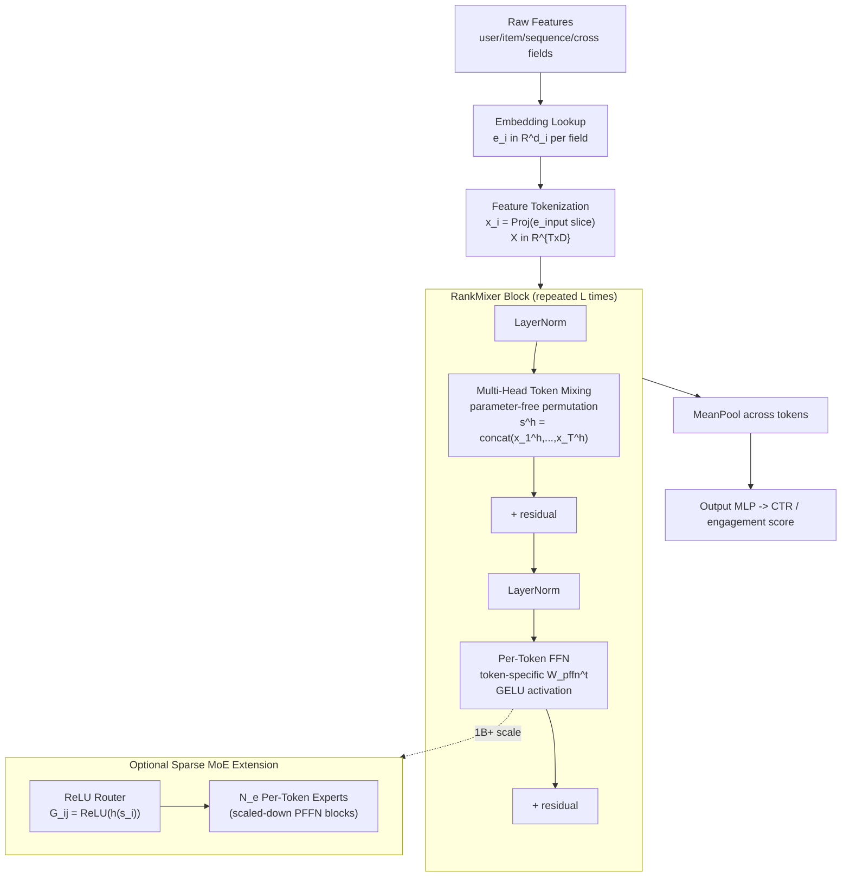

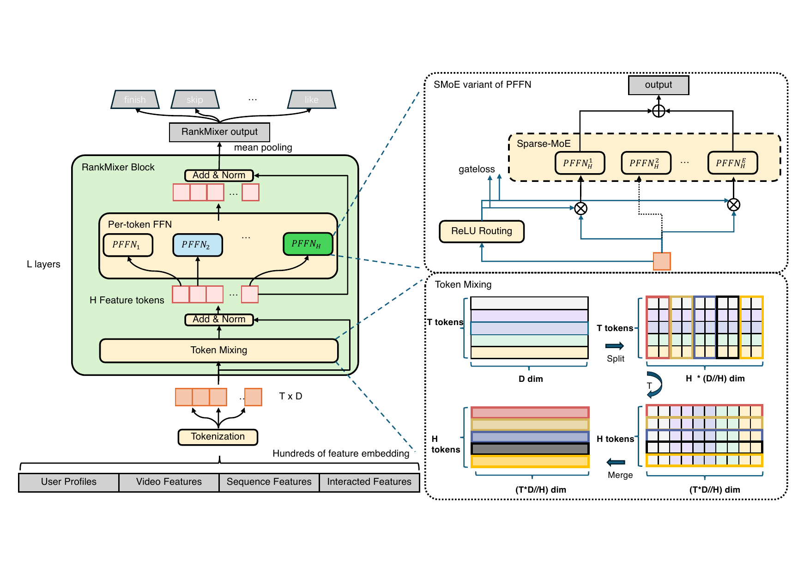

*Figure 1 (Zhu et al., 2025): The RankMixer block architecture. Multi-head token mixing (parameter-free permutation) interleaves head slices across tokens; the per-token FFN (PFFN) then applies token-specific MLP transformations. The optional SMoE extension replaces the dense PFFN at 1B+ scale.*

> [!QUESTION] Exercise 2: Parameter Count at 1B Scale
> *This problem verifies the 1B parameter target from the paper's scaling formula.*
>
> > **Prerequisites:** [[#2.3 Per-Token Feed-Forward Network (PFFN)|Per-Token Feed-Forward Network (PFFN)]]
>
> The paper reports the 1B model uses $D = 1536$, $T = 32$, $L = 2$, expansion factor $k = 2$. Use the formula $\#\text{Param} \approx 2kLTD^2$ to estimate the total dense parameter count. Compare to the reported 1B figure and explain any discrepancy.

> [!TIP]- Solution to Exercise 2
> **Key insight:** The formula captures only PFFN parameters; the embedding table dominates total model parameters but is excluded from the dense param count.
>
> **Sketch:** $\#\text{Dense Param} = 2 \times 2 \times 2 \times 32 \times 1536^2 \approx 0.6\text{B}$. With per-token output projection layers, plus layer norm and bias terms, the total grows to ~1B. The formula ignores the tokenization projection $\text{Proj}(\cdot)$, input/output MLP weights, and bias terms.

---

## 3. Hardware Efficiency Analysis

⚡ The central claim of RankMixer is a 10× MFU improvement over the DLRM baseline.

### 3.1 Arithmetic Intensity of Self-Attention

For $T$ tokens of dimension $D$ with $H$ heads, consider the attention score computation $QK^\top \in \mathbb{R}^{H \times T \times T}$:

- FLOPs: $2HT^2(D/H) = 2T^2 D$
- Memory traffic: read $Q, K \in \mathbb{R}^{H \times T \times D/H}$: $2TD$ elements; write $A \in \mathbb{R}^{H \times T \times T}$: $HT^2$ elements

For $T = 32$, $D = 1536$, $H = 32$ (FP16, 2 bytes/element):

$$I_{\text{attn}} = \frac{2T^2 D}{2 \times (2TD + HT^2)} \approx 12 \text{ FLOPs/byte}$$

*Surprisingly,* this is far below the A100 ridge point of $I^* \approx 156$ FLOPs/byte, placing the attention score kernel firmly in the memory-bandwidth-bound regime.

### 3.2 Arithmetic Intensity of Token Mixing and PFFN

Token mixing is a parameter-free data permutation — it touches each byte exactly once and performs no arithmetic. Its arithmetic intensity is 0 FLOPs/byte. The entire computation in a RankMixer block therefore comes from the PFFN.

For the PFFN upward projection applied to a batch of $B$ samples:

- FLOPs: $B \times T \times 2D \times kD = 2BkTD^2$
- Memory traffic (weights, assuming activations in SRAM): $2kTD^2$ bytes

$$I_{\text{PFFN}} = \frac{2BkTD^2}{2kTD^2} = B$$

**For batch size $B = 1024$, arithmetic intensity $= 1024$ FLOPs/byte, far above the ridge point of $\approx 156$.** The PFFN is deeply compute-bound.

> [!NOTE] Why batch size = arithmetic intensity (for GEMM)
> For a matrix multiplication $AB$ where $A \in \mathbb{R}^{M \times K}$ and $B \in \mathbb{R}^{K \times N}$, FLOPs $= 2MKN$ and weight bytes $= 2KN$, giving $I = M$. Batch size $M$ directly controls whether the operation is memory-bound ($M < I^*$) or compute-bound ($M > I^*$). This is why small-batch inference is memory-bound even for large models — see [[concepts/deep-learning-engineering/memory-bound-inference|Memory-Bound Inference]].

### 3.3 MFU Measurement and Serving Cost Decomposition

| Model | Dense Params | FLOPs/Batch | GFLOPs/Param(M) | MFU | Latency |
|-------|------------|------------|----------------|-----|---------|
| Base DLRM-8.7M | 8.7M | 52G | 5.9 | 4.51% | 16.12 ms |
| Wukong ($l=8$, $nL=32$) | 122M | 442G | 3.6 | 18.51% | 33.7 ms |
| RankMixer-1B | 1B | 2,106G | 2.1 | 44.57% | 14.3 ms |

**The 100× parameter increase from DLRM to RankMixer translates to only a 3% latency decrease.** Two factors multiply: (1) FLOPs/Param ratio is 2.8× lower (fewer FLOPs per parameter), and (2) MFU is 9.9× higher (each FLOP is more productive). **Together they nearly cancel the raw FLOPs increase, leaving latency nearly unchanged despite 100× more parameters.**

### 3.4 Engineering Optimizations

Three system-level techniques further reduce inference latency for the deployed 1B model:

1. **Per-token FFN operator fusion** — multiple PFFN computations merged into a single 3D tensor operation: +30% throughput.
2. **Mixed-precision inference (FP16)** — matrix multiplications use FP16; LayerNorm uses FP32: +45% throughput, −31.5% latency.
3. **Sparse-GEMM acceleration** — custom sparse-GEMM for the SMoE variant (§5): −40% latency.

> [!QUESTION] Exercise 3: Latency Budget Arithmetic
> *This problem reconstructs how RankMixer-1B serves at 14.3 ms despite 115× more parameters than the 8.7M baseline.*
>
> > **Prerequisites:** [[#3.3 MFU Measurement and Serving Cost Decomposition|MFU Measurement and Serving Cost Decomposition]]
>
> Suppose latency is proportional to $\text{FLOPs} / (\text{MFU} \times \Pi_{\text{HW}})$. Using the numbers from §3.3, verify that the ratio $\text{Latency}_{\text{RankMixer}} / \text{Latency}_{\text{DLRM}}$ is approximately correct. Then identify which factor — FLOPs reduction or MFU improvement — contributes more to latency parity.

> [!TIP]- Solution to Exercise 3
> **Key insight:** The latency ratio is $(\text{FLOPs}_{\text{RM}} / \text{MFU}_{\text{RM}}) / (\text{FLOPs}_{\text{DLRM}} / \text{MFU}_{\text{DLRM}})$.
>
> **Sketch:** Ratio $= (2106 / 0.4457) / (52 / 0.0451) = 4726 / 1153 \approx 4.1$. But the measured ratio is $14.3 / 16.12 \approx 0.89$ — RankMixer is faster. The ~4.6× discrepancy is explained by the engineering optimizations (§3.4) applied to the deployed model. Of the two factors: MFU improvement contributes $\approx 9.9\times$ and FLOPs increase contributes $\approx 40.5\times$ in the wrong direction. **MFU improvement ($\approx 10\times$) more than offsets the FLOPs increase** — the gap is closed by engineering optimizations.

---

## 4. Scaling Experiments

📈

### 4.1 Offline Baselines at 100M Parameters

Experiments use Douyin's production training data over a two-week window, with 300+ input features. An improvement of 0.01% AUC is considered confidently significant at production scale.

| Model | Finish AUC gain | Finish UAUC gain | Skip AUC gain | Dense Params | FLOPs/Batch |
|-------|---------------|-----------------|--------------|-------------|------------|
| DLRM-MLP (base) | 0.0 | 0.0 | 0.0 | 8.7M | 52G |
| DLRM-MLP-100M | +0.15% | — | +0.15% | 95M | 185G |
| DCN V2 | +0.13% | +0.13% | +0.15% | 22M | 170G |
| [[papers/dhen-ranking\|DHEN]] | +0.18% | +0.26% | +0.36% | 22M | 158G |
| HiFormer | +0.48% | — | — | 116M | 326G |
| Wukong | +0.29% | +0.29% | +0.49% | 122M | 442G |
| **RankMixer-100M** | **+0.64%** | **+0.72%** | **+0.86%** | **107M** | **233G** |
| **RankMixer-1B** | **+0.95%** | **+1.22%** | **+1.25%** | **1B** | **2,106G** |

RankMixer-100M outperforms every baseline including Wukong while using 47% fewer FLOPs per batch. Scaling to 1B adds a further +0.31% Finish AUC with a 9× FLOPs increase.

### 4.2 Scaling Law Curves

The paper plots Finish AUC gain as a function of both parameter count and FLOPs across five architectures. Key observations:

- RankMixer exhibits the steepest slope on *both* the AUC vs parameters and AUC vs FLOPs curves.
- Wukong's parameter-curve slope is steep but its FLOPs-curve slope is gentler.
- DHEN shows non-ideal scaling, reflecting limited scalability of cross-structure stacking.

**The steepness of RankMixer's scaling curve is the primary architectural claim**: for a given parameter or FLOPs budget, RankMixer extracts more AUC gain than any alternative tested.

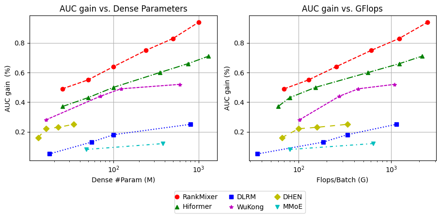

*Figure 2 (Zhu et al., 2025): Scaling laws comparing Finish AUC gain vs parameter count (left) and FLOPs (right) across DLRM-MLP, DCN V2, DHEN, Wukong, and RankMixer. RankMixer exhibits the steepest slope on both axes. The x-axis is logarithmic.*

### 4.3 Optimal Scaling Directions

RankMixer scales along four orthogonal axes: token count $T$, hidden dimension $D$, number of layers $L$, and number of MoE experts $E$. The paper finds:

- Model quality correlates primarily with *total parameter count*; different $(T, D, L)$ combinations achieving the same total reach nearly identical AUC.
- Increasing $D$ (wider) is preferable to increasing $L$ (deeper): wider $D$ generates larger GEMM shapes, achieving higher MFU.

**Final configurations chosen:**
- RankMixer-100M: $D = 768$, $T = 16$, $L = 2$
- RankMixer-1B: $D = 1536$, $T = 32$, $L = 2$

> [!WARNING] Shallow depth is intentional
> $L = 2$ blocks may seem surprisingly shallow for a 1B-parameter model. Because each block already has $T$ separate MLP heads each of width $D \times kD$, each block already has $O(TD^2)$ parameters. Adding more blocks would inflate FLOPs without further MFU improvement. Part II (TokenMixer-Large, §9) addresses why naive depth scaling fails and how the Mixing-and-Reverting operation fixes it.

---

## 5. Sparse MoE Variant

⚙️ Scaling RankMixer beyond 1B parameters while maintaining fixed inference latency requires a *Sparse Mixture-of-Experts* (SMoE) extension that decouples parameter count from active FLOPs.

### 5.1 Motivation: Two Failure Modes of Vanilla MoE in RankMixer

Standard sparse MoE (Switch Transformer style with top-$k$ + softmax gating) degrades markedly when naively applied to RankMixer's PFFN:

1. **Uniform routing ignores token information content.** Different feature tokens carry different amounts of information — a rich user behavior sequence token conveys far more signal than a sparse cross-feature token. Top-$k$ routing allocates the same number of expert activations to every token regardless, wasting capacity on low-information tokens.

2. **Expert under-training from token-count explosion.** PFFN already multiplies parameter count by $T$. Adding $N_e$ non-shared experts multiplies further: total experts becomes $T \times N_e$. With a fixed routing budget of $k$ experts per token, most experts receive very few gradient updates, leading to expert starvation.

### 5.2 ReLU Routing

**Definition (ReLU Routing).** Let $h(\cdot) : \mathbb{R}^D \to \mathbb{R}^{N_e}$ be a learned router (linear layer). For token $s_i$ and expert $j$, the gate value is:

$$G_{i,j} = \text{ReLU}\!\left(h(s_i)_j\right) \geq 0$$

The aggregated output for token $s_i$ is:

$$v_i = \sum_{j=1}^{N_e} G_{i,j} \cdot e_{i,j}(s_i)$$

*Unlike softmax + top-$k$*, ReLU routing allows a variable number of experts to activate per token. Sparsity level is steered via a regularization loss:

$$\mathcal{L} = \mathcal{L}_{\text{task}} + \lambda \mathcal{L}_{\text{reg}}, \qquad \mathcal{L}_{\text{reg}} = \sum_{i=1}^{N_t} \sum_{j=1}^{N_e} G_{i,j}$$

The $\ell_1$ penalty on gate values directly penalizes the total number of active expert slots, adaptively controlling the average activation ratio without fixing it per-token.

> [!NOTE] Why ReLU is better than softmax for adaptive routing
> Softmax assigns gate weights summing to 1 — forcing competition among experts even when no expert is needed. ReLU treats each expert independently: gate $j$ fires only if the router output is positive. This allows the degenerate case (all gates zero) for uninformative tokens, and dense activation for highly informative ones.

### 5.3 Dense-Training Sparse-Inference (DTSI-MoE)

**Definition (DTSI-MoE).** Two router functions $h_{\text{train}}$ and $h_{\text{infer}}$ are both updated during training. The regularization loss $\mathcal{L}_{\text{reg}}$ is applied only to $h_{\text{infer}}$:

- $h_{\text{train}}$: unregularized, tends toward dense activation, providing broad gradient coverage to all experts.
- $h_{\text{infer}}$: regularized via $\mathcal{L}_{\text{reg}}$, tends toward sparse activation, enabling fast inference.

At inference, only $h_{\text{infer}}$ is used. The experts are trained on dense gradient signals but evaluated under sparse routing, preventing the "dying expert" failure where sparsity at training time starves most experts.

> [!INFO] Connection to knowledge distillation
> DTSI-MoE is structurally analogous to knowledge distillation: $h_{\text{train}}$ plays the role of a dense "teacher" ensuring all experts are well-trained, while $h_{\text{infer}}$ is a sparse "student" that learns to approximate with fewer active experts. Unlike standard distillation, both are trained jointly end-to-end.

### 5.4 Scalability Results

- **Vanilla SMoE (top-k):** AUC degrades monotonically as sparsity increases.
- **Vanilla SMoE + load-balancing loss:** Some recovery, but still substantially below dense.
- **DTSI + ReLU routing:** Near-flat AUC curve from full activation down to 1/8 sparsity.

**RankMixer with DTSI + ReLU routing scales to 8× sparsity with nearly no AUC loss and a +50% throughput improvement**, validating the approach as a practical path to 10B+ parameters without proportional cost increase.

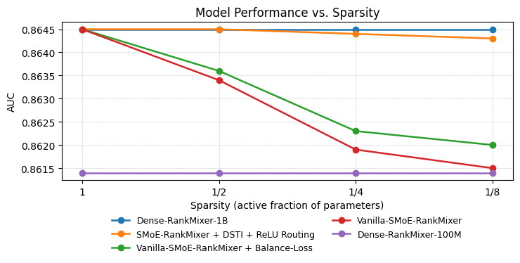

*Figure 3 (Zhu et al., 2025): AUC performance of RankMixer variants at decreasing expert activation ratios (1, 1/2, 1/4, 1/8). Dense-training + ReLU-routed SMoE (DTSI-MoE) preserves near-full accuracy of the 1B dense model across all sparsity levels, while vanilla top-k MoE degrades monotonically.*

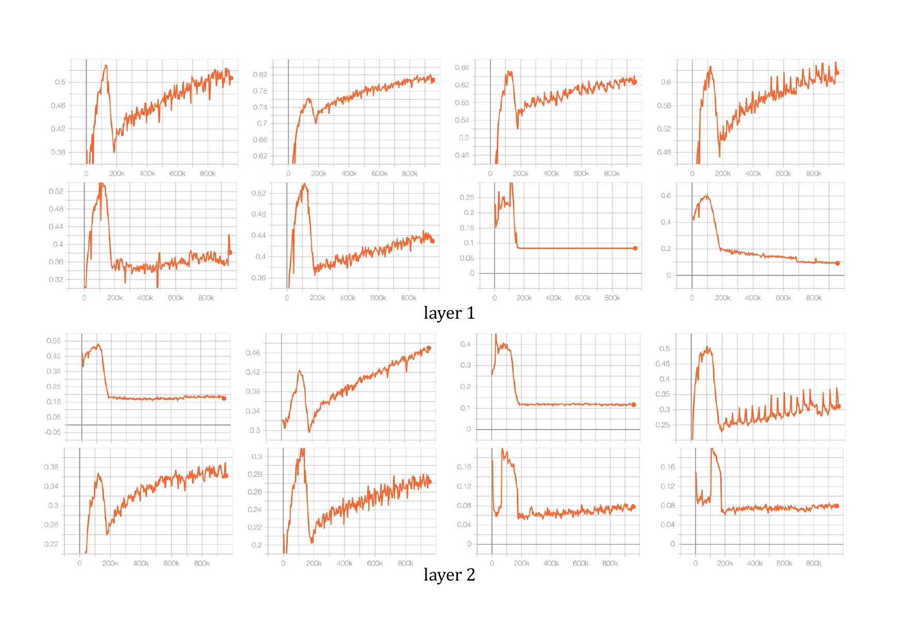

*Figure 4 (Zhu et al., 2025): Activated expert ratio for different token positions in RankMixer. ReLU routing produces adaptive, token-dependent activation patterns — information-rich tokens activate more experts than sparse or low-signal tokens, naturally allocating capacity where it is most needed.*

> [!QUESTION] Exercise 4: ReLU Routing Sparsity Budget
> *This problem derives the expected expert activation rate as a function of the regularization coefficient lambda.*
>
> > **Prerequisites:** [[#5.2 ReLU Routing|ReLU Routing]]
>
> Assume the pre-ReLU router output $h(s_i) \in \mathbb{R}^{N_e}$ has components drawn i.i.d. from $\mathcal{N}(0, \sigma^2)$ at initialization. (a) Compute the expected fraction of active gates per token as a function of $\sigma$. (b) Explain qualitatively how the $\ell_1$ penalty $\lambda \mathcal{L}_{\text{reg}}$ shifts this fraction during training. (c) If the target inference budget is $k/N_e$ active experts per token, what property of $\lambda$ ensures convergence to this budget?

> [!TIP]- Solution to Exercise 4
> **Key insight:** At initialization, ReLU fires on the positive half of a Gaussian, so 50% of gates are active regardless of $\sigma$. The $\ell_1$ penalty must push this below the target budget.
>
> **Sketch:** (a) $\mathbb{P}[G_{i,j} > 0] = \mathbb{P}[\mathcal{N}(0,\sigma^2) > 0] = 0.5$ — exactly half experts active at init. (b) The gradient of $\mathcal{L}_{\text{reg}}$ w.r.t. the router output is $+1$ for each active gate; this shifts the distribution of $h(s_i)$ downward during training, reducing the fraction of positive outputs. (c) $\lambda$ is tuned by sweeping and checking the empirical activation ratio — a fixed $\lambda$ causes the distribution mean to drift until the $\ell_1$ gradient is balanced by the task gradient.

---

## 6. Online A/B Results — RankMixer

🚀 RankMixer-1B was deployed for full production traffic across Feed Recommendation, Advertising, and Search on Douyin. Experiments ran for five months.

### 6.1 Feed Recommendation

| Metric | Douyin Overall | Douyin Low-active | Douyin Mid-active | Douyin High-active |
|--------|---------------|-----------------|-----------------|------------------|
| Active Days | +0.20% | +0.457% | +0.432% | +0.124% |
| Duration | +0.50% | +0.859% | +1.186% | +0.492% |
| Like | +0.29% | +0.656% | +0.678% | +0.272% |
| Finish | +1.60% | +1.752% | +1.956% | +1.313% |

Low-active users benefit disproportionately — their active day lift (0.46%) is 3.7× that of high-active users (0.12%). **Larger model capacity helps most when personal history is sparse**: the model draws on richer cross-feature and cross-user statistical patterns.

### 6.2 Advertising and Search

| Scenario | Metric | Lift |
|----------|--------|------|
| Advertising | ΔAUC | +0.73% |
| Advertising | Advertiser Value (ADVV) | **+3.90%** |
| Search | ΔAUC | +1.75% |
| Search | Query change rate | −1.00% |

The search −1.0% query change rate means users find what they want with fewer reformulations, indicating genuine relevance improvement.

---

## 7. Ablation Studies — RankMixer

🔬

**Block component ablations (100M scale)**

| Ablation | Finish AUC change |
|----------|------------------|
| Remove multi-head token mixing | −0.50% |
| Per-token FFN → shared FFN | −0.31% |
| Remove skip connections | −0.07% |
| Remove layer normalization | −0.05% |

**Token routing strategy comparison (100M scale)**

| Routing Strategy | Finish AUC change | ΔParams | ΔFLOPs |
|-----------------|------------------|---------|--------|
| All-Concat-MLP (single large MLP) | −0.18% | 0% | 0% |
| All-Share (single shared FFN) | −0.25% | 0% | 0% |
| Self-Attention | −0.03% | +16% | +71.8% |

The comparison to self-attention is particularly revealing: self-attention costs only −0.03% AUC but requires +71.8% more FLOPs. Token mixing trades a negligible 0.03% AUC for a 42% FLOPs reduction relative to self-attention.

> [!QUESTION] Exercise 5: Efficiency Frontier
> *This problem frames the ablation results as a Pareto frontier comparison.*
>
> > **Prerequisites:** [[#7. Ablation Studies — RankMixer|Ablation Studies — RankMixer]], [[#3. Hardware Efficiency Analysis|Hardware Efficiency Analysis]]
>
> Plot (conceptually) the four configurations from the routing ablation table on a two-axis chart: x-axis = relative FLOPs (normalized to RankMixer = 1.0), y-axis = relative AUC gain. Identify which configurations are Pareto-dominated. Then define formally what it means for a model to be on the Pareto frontier in this space and verify that RankMixer lies on it.

> [!TIP]- Solution to Exercise 5
> **Key insight:** A point is Pareto-dominated if another point achieves both higher AUC *and* lower FLOPs.
>
> **Sketch:** Assign RankMixer coordinates $(1.0, 1.0)$. All-Share: $(1.0, 0.75)$ — same FLOPs, lower AUC — dominated. All-Concat-MLP: $(1.0, 0.82)$ — dominated. Self-Attention: $(1.718, 0.97)$ — higher FLOPs, slightly higher AUC. Formally, model $A$ dominates model $B$ iff $\text{FLOPs}_A \leq \text{FLOPs}_B$ and $\text{AUC}_A \geq \text{AUC}_B$ with at least one strict inequality. Self-Attention is not dominated by RankMixer but is also not the unique Pareto optimum. **RankMixer lies on the Pareto frontier: no other tested configuration achieves its combination of AUC gain and FLOPs level.**

---

## 8. Discussion and Limitations — RankMixer

💬

**Architectural unification.** The core thesis is that a single well-designed block — parameter-free token mixing followed by per-token FFN — subsumes the functionality of an entire zoo of handcrafted interaction modules (DCN, AutoInt, DHEN, FM-based approaches).

**Hardware-aware design philosophy.** The design choices are explicitly reverse-engineered from GPU arithmetic intensity requirements: large GEMMs, parameter-free permutations for cross-token interaction, and batch-size-amplified FLOPs-per-byte.

**Limitations:**

- *Residual dimension mismatch.* The token mixing operation changes the layout of the token matrix (from $\mathbb{R}^{T \times D}$ to $\mathbb{R}^{H \times (T \cdot D/H)}$), creating an impedance mismatch for inter-block residuals at large depths. The paper uses only $L = 2$ blocks. Part II (§9) addresses this.

- *No head count ($H$) ablation.* The paper sets $H = T$ throughout but provides no sensitivity analysis.

- *Retrieval stage unexplored.* All results pertain to re-ranking (scoring shortlisted candidates). Whether the architecture transfers to embedding-based retrieval is not addressed.

- *Single-task framing.* Multi-task optimization challenges that arise at scale are not discussed.

---

## Part II: TokenMixer-Large (2026)

---

## 9. Why Scale Beyond 1B: The Three Failure Modes

🏛️ TokenMixer-Large begins from a precise diagnosis of why naively scaling RankMixer past ~1B parameters fails. Three architectural failure modes are identified:

1. **Dimension mismatch.** The mixing output $\mathbf{H} \in \mathbb{R}^{H \times (T \cdot D/H)}$ has a different layout than the input $\mathbf{X} \in \mathbb{R}^{T \times D}$ even though they contain the same number of scalars. A reshape is required before any residual connection back to $\mathbf{X}$, which breaks pre-norm symmetry and degrades gradient magnitude at depth.

2. **Gradient vanishing at depth.** Without skip connections spanning multiple blocks, gradients to early layers become vanishingly small as depth grows beyond ~20 blocks.

3. **Uniform dense FFN.** The per-token SwiGLU treats all tokens identically. At 7B+ parameters, this wastes capacity by forcing every expert computation to fire for every token.

**TokenMixer-Large addresses each failure mode systematically: Mixing-and-Reverting for (1), inter-residual connections for (2), and Sparse Per-token MoE for (3).**

---

## 10. Architecture Innovations

🏗️

### 10.1 Tokenization

Each raw categorical feature $F_i$ is embedded:

$$e_i = \text{Embedding}(F_i, d_i) \in \mathbb{R}^{d_i}$$

Features are organized into $T-1$ semantic groups $G_0, \ldots, G_{T-2}$. Each group is projected to dimension $D$ by a group-specific MLP:

$$X_i = \text{MLP}_i\!\bigl(\text{concat}[e_l, \ldots, e_m]\bigr) \in \mathbb{R}^D$$

A *global token* $X_G$ aggregates cross-group information:

$$X_G = \text{MLP}_g\!\bigl(\text{concat}[G_1, \ldots, G_{T-1}]\bigr) \in \mathbb{R}^D$$

The full token matrix is $\mathbf{X} = \text{concat}[X_G, X_0, \ldots, X_{T-1}] \in \mathbb{R}^{T \times D}$.

> [!NOTE] Global token role
> The global token plays a role analogous to the `[CLS]` token in BERT — it provides a summary position that accumulates cross-feature context through all subsequent mixing layers, and its output is used for the final score prediction.

> [!EXAMPLE] Running example: adding a global token ($T=3$, $D=4$)
> Extend the RankMixer example by prepending a global token $x_G \in \mathbb{R}^4$ computed as a small MLP over one representative vector from each semantic group:
>
> $$x_G = \text{MLP}_g([G_{\text{user}}, G_{\text{item}}]) = [0,\, 0,\, 0,\, 0] \quad \text{(at init; will diverge during training)}$$
>
> The full token matrix entering the block stack is now:
>
> $$\mathbf{X} = \begin{bmatrix} 0 & 0 & 0 & 0 \\ 1 & 2 & 3 & 4 \\ 5 & 6 & 7 & 8 \end{bmatrix} \in \mathbb{R}^{3 \times 4}$$
>
> Row 0 = global summary token; row 1 = user token; row 2 = item token. The global token starts near zero but through training accumulates a cross-feature summary used for the final score prediction. The subsequent Mix-and-Revert operations in §10.2 are demonstrated with the simpler $T=2$ sub-example from Part I to keep the arithmetic clean.

### 10.2 Mixing-and-Reverting Operation

The central innovation is a *two-phase symmetric transform* that resolves the dimension-mismatch problem.

**Definition (Mixing Phase).** Given $\mathbf{X} \in \mathbb{R}^{T \times D}$, for each head $h$, concatenate the $h$-th slice from every token:

$$\text{Mix}: \quad H_h = \text{concat}[x_1^{(h)}, x_2^{(h)}, \ldots, x_T^{(h)}] \in \mathbb{R}^{T \cdot D/H}$$

Stacking gives $\mathbf{H} = \text{stack}[H_1, \ldots, H_H] \in \mathbb{R}^{H \times (T \cdot D/H)}$. A pSwiGLU is applied in this mixed layout to produce $\mathbf{H}' \in \mathbb{R}^{H \times (T \cdot D/H)}$.

**Definition (Reverting Phase).** The reverting operation is the inverse permutation of mixing: for each position $t$, gather slice $h$ from $H_h'$ to reconstruct the token:

$$\text{Revert}: \quad X_t^{\text{rev}} = \text{concat}[x'^{(1)}_t, x'^{(2)}_t, \ldots, x'^{(H)}_t] \in \mathbb{R}^D$$

This yields $\mathbf{X}^{\text{rev}} \in \mathbb{R}^{T \times D}$ — exactly the same shape as the input $\mathbf{X}$.

**Definition (TokenMixer-Large Block Output).**

$$\mathbf{X}^{\text{next}} = \text{Norm}\!\bigl(\text{pSwiGLU}(\mathbf{X}^{\text{rev}}) + \mathbf{X}\bigr) \in \mathbb{R}^{T \times D}$$

The residual $+ \mathbf{X}$ is now dimensionally consistent. *Reverting is not merely a reshape* — it explicitly recombines mixed-head representations back into per-token vectors, allowing the subsequent pSwiGLU to operate in the original token-feature space.

> [!INFO] Why reverting matters for deep models
> In a pre-norm transformer, the residual stream maintains a fixed shape $\mathbb{R}^{T \times D}$ throughout all layers. The reverting step restores this invariant after each mixing operation, enabling stable pre-norm + RMSNorm stacks at 50+ layers.

> [!EXAMPLE] Mix → pSwiGLU → Revert on the running example ($T=2$, $D=4$, $H=2$)
> Use the same $\mathbf{X}$ from Part I. Mixing produces (as before):
>
> $$\mathbf{H} = \text{Mix}(\mathbf{X}) = \begin{bmatrix} 1 & 2 & 5 & 6 \\ 3 & 4 & 7 & 8 \end{bmatrix} \in \mathbb{R}^{2 \times 4}$$
>
> Row 0 of $\mathbf{H}$ = head-0 slices from all tokens; row 1 = head-1 slices from all tokens. The pSwiGLU is applied *in this head-major layout*, learning transformations of each cross-token composite. Suppose pSwiGLU scales by $0.5$ (for illustration):
>
> $$\mathbf{H}' = \text{pSwiGLU}(\mathbf{H}) = \begin{bmatrix} 0.5 & 1 & 2.5 & 3 \\ 1.5 & 2 & 3.5 & 4 \end{bmatrix}$$
>
> **Reverting:** for each token position $t$, gather the $t$-th slice of size $D/H=2$ from each row of $\mathbf{H}'$:
>
> $$X^{\text{rev}}_0 = \text{concat}\!\left[\underbrace{\mathbf{H}'[0,\, 0:2]}_{\text{user's h0, processed}},\; \underbrace{\mathbf{H}'[1,\, 0:2]}_{\text{user's h1, processed}}\right] = [0.5,\, 1,\, 1.5,\, 2]$$
>
> $$X^{\text{rev}}_1 = \text{concat}\!\left[\underbrace{\mathbf{H}'[0,\, 2:4]}_{\text{item's h0, processed}},\; \underbrace{\mathbf{H}'[1,\, 2:4]}_{\text{item's h1, processed}}\right] = [2.5,\, 3,\, 3.5,\, 4]$$
>
> $$\mathbf{X}^{\text{rev}} = \begin{bmatrix} 0.5 & 1 & 1.5 & 2 \\ 2.5 & 3 & 3.5 & 4 \end{bmatrix} \in \mathbb{R}^{2 \times 4}$$
>
> Row 0 is now "all processed heads re-assembled for the user token"; row 1 for the item token. The residual is now semantically correct:
>
> $$\mathbf{X}^{\text{rev}} + \mathbf{X} = \begin{bmatrix} 0.5+1 & 1+2 & 1.5+3 & 2+4 \\ 2.5+5 & 3+6 & 3.5+7 & 4+8 \end{bmatrix} = \begin{bmatrix} 1.5 & 3 & 4.5 & 6 \\ 7.5 & 9 & 10.5 & 12 \end{bmatrix}$$
>
> Row 0 = (processed user features) + (original user features) ✓ Row 1 = (processed item features) + (original item features) ✓
>
> **Contrast with RankMixer** (no reverting — adds $\mathbf{H}'$ directly to $\mathbf{X}$):
>
> $$\mathbf{H}' + \mathbf{X} = \begin{bmatrix} 0.5+1 & 1+2 & \mathbf{2.5+3} & \mathbf{3+4} \\ 1.5+5 & 2+6 & 3.5+7 & 4+8 \end{bmatrix} = \begin{bmatrix} 1.5 & 3 & \mathbf{5.5} & \mathbf{7} \\ 6.5 & 8 & 10.5 & 12 \end{bmatrix}$$
>
> Row 0, positions 2–3: adds *item*'s head-0 (2.5, 3) to the *user* token's second half-dimensions (3, 4) — semantically mismatched. At shallow depths ($L=2$) the PFFN can compensate for this scrambling; at 50+ layers the accumulated mismatch in the residual stream degrades gradient flow.

### 10.3 Per-Token SwiGLU

TokenMixer-Large uses *per-token SwiGLU* (pSwiGLU), where each token position $t$ has its own projection matrices:

$$\text{pSwiGLU}(\cdot) = FC_{\text{down}}\!\bigl(\text{Swish}(FC_{\text{gate}}(\cdot)) \odot FC_{\text{up}}(\cdot)\bigr)$$

with token-specific projections $FC_i(\mathbf{x}) = W_i^t x_t + b_i^t$, where $\{W_{\text{up}}^t, W_{\text{gate}}^t\} \in \mathbb{R}^{D \times nD}$ and $W_{\text{down}}^t \in \mathbb{R}^{nD \times D}$.

> [!EXAMPLE] pSwiGLU vs plain ReLU FFN
> For token position $t$ with reverted representation $X^{\text{rev}}_t \in \mathbb{R}^D$, the pSwiGLU computes:
>
> $$\text{pSwiGLU}(X^{\text{rev}}_t) = W_{\text{down}}^t \cdot \underbrace{\bigl(\text{Swish}(W_{\text{gate}}^t X^{\text{rev}}_t) \odot W_{\text{up}}^t X^{\text{rev}}_t\bigr)}_{\text{gated hidden state} \in \mathbb{R}^{nD}}$$
>
> The Swish gate $\sigma = \text{Swish}(W_{\text{gate}}^t X^{\text{rev}}_t) \in \mathbb{R}^{nD}$ is a learned, input-dependent mask: each of the $nD$ hidden dimensions can be suppressed (near zero) or passed through (near one) based on the content of $X^{\text{rev}}_t$. This lets each token position selectively activate different parts of its FFN capacity depending on what it received from the mixing step.
>
> A plain per-token ReLU FFN ($W_2^t \cdot \text{ReLU}(W_1^t X^{\text{rev}}_t)$) has fixed sparsity from the ReLU nonlinearity but no input-dependent gating — every feature competes equally. The ablation (−0.10% for ReLU vs −0.21% for shared SwiGLU) shows that per-token weights matter more than the gating mechanism, but gating contributes an additional 0.10% on top.

> [!EXAMPLE] Ablation evidence (from paper)
> Replacing pSwiGLU with a standard shared SwiGLU costs −0.21% AUC; replacing it with a per-token FFN (ReLU, no gating) costs −0.10% AUC. The per-token gating mechanism contributes more than the token-specificity alone.

### 10.4 Residuals and Normalization

Pre-Norm with RMSNorm throughout, consistent with modern LLM practice:

$$\text{Output} = \text{SubLayer}(\text{RMSNorm}(\mathbf{X})) + \mathbf{X}$$

### 10.5 Inter-Residual and Auxiliary Loss

For networks beyond ~20 blocks, standard residuals are insufficient to propagate gradients to early layers. TokenMixer-Large introduces *inter-residual connections*: skip connections that bypass 2–3 consecutive blocks.

**Definition (Inter-Residual).** Let $\mathbf{X}^{(\ell)}$ denote the output of block $\ell$. An inter-residual with stride $s$ adds:

$$\mathbf{X}^{(\ell+s)} \leftarrow \mathbf{X}^{(\ell+s)} + \mathbf{X}^{(\ell)}$$

at regular intervals $s \in \{2, 3\}$ throughout the network.

An *auxiliary loss* is applied at intermediate block outputs:

$$\mathcal{L}_{\text{total}} = \mathcal{L}_{\text{CE}}(y, \hat{y}^{(L)}) + \lambda \sum_{\ell \in S} \mathcal{L}_{\text{CE}}(y, \hat{y}^{(\ell)})$$

> [!TIP]- Why auxiliary loss helps (intuition)
> At depth 50+, the gradient of $\mathcal{L}_{\text{CE}}$ with respect to block 5's parameters has been attenuated by ~45 Jacobian multiplications. The auxiliary loss at block $\ell$ provides a *direct* gradient signal to all blocks $\leq \ell$, bypassing the deep chain. This is analogous to GoogLeNet's auxiliary classifiers.

Ablation: removing both inter-residuals and auxiliary loss costs −0.04% AUC at the 4B scale; removing the standard within-block residual costs −0.15% AUC.

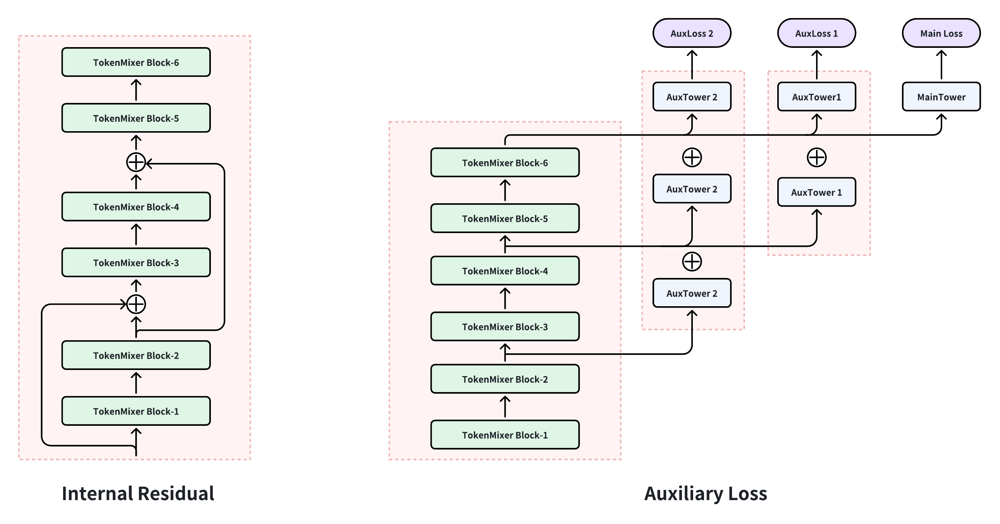

*Figure 5 (Jiang et al., 2026): Inter-residual connections and auxiliary loss in TokenMixer-Large. Skip connections with stride $s \in \{2, 3\}$ bypass groups of consecutive blocks, and auxiliary cross-entropy losses at intermediate layers provide direct gradient signals to early blocks — essential for stable training at 50+ block depth.*

> [!EXAMPLE] Inter-residual with stride $s=2$ across 4 blocks
> With $s=2$, every other block's output is added to the block two steps ahead. Tracing the signal path for a single token vector:
>
> ```
> X^(0) ──► Block 1 ──► X^(1) ──► Block 2 ──► X^(2)
>    └──────────────── (+) ──────────────────►  X^(2) += X^(0)
>
> X^(2) ──► Block 3 ──► X^(3) ──► Block 4 ──► X^(4)
>    └──────────────── (+) ──────────────────►  X^(4) += X^(2)
> ```
>
> Without inter-residuals, a gradient flowing back to block 1 must pass through Jacobians for blocks 2, 3, and 4 — four multiplications that can each attenuate it. With stride-2 inter-residuals, the gradient from block 3's loss also has a direct path back to block 1 (bypassing block 2), and the auxiliary loss at block 2 directly supervises blocks 1 and 2. At 50 blocks the difference between chaining 50 Jacobians and having skip connections every 2 steps is the difference between stable and vanishing gradients.

> [!INFO] What each step does to the data — TokenMixer-Large block
>
> | Step | Tensor shape | Semantic meaning of each row |
> |------|-------------|------------------------------|
> | Input $\mathbf{X}$ | $(T, D)$ | Each row = one feature group (global, user, item, …) |
> | After Mix | $(T, D)$ | Each row = one head-slice gathered across all groups |
> | After pSwiGLU (in mixed layout) | $(T, D)$ | Each row = gated transformation of cross-token composite |
> | After Revert | $(T, D)$ | Each row = processed heads **re-assembled per token** (shape-consistent with input) |
> | After residual $+ \mathbf{X}$ and RMSNorm | $(T, D)$ | Each row = token-specific representation enriched by cross-token context |
> | After second pSwiGLU + residual | $(T, D)$ | Block output: same shape, ready for next block or pooling |
>
> The Revert step is the key difference from RankMixer: it restores the token-major semantics of each row before the residual addition, enabling semantically correct skip connections at any depth.

### 10.6 Block Architecture Diagram

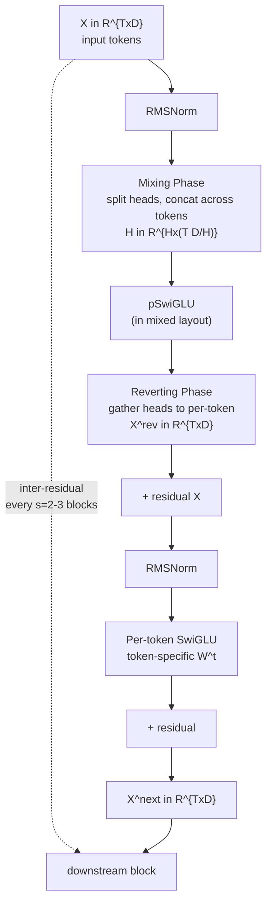

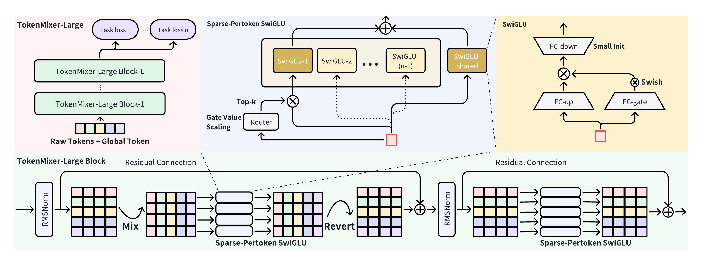

*Figure 6 (Jiang et al., 2026): The TokenMixer-Large block architecture. Each block consists of (RMSNorm → Mixing → SP-MoE → Reverting → RMSNorm → SP-MoE) with inner and inter-block residuals. The Reverting phase restores the token-major layout after mixing, enabling dimensionally consistent residuals at any depth. SP-MoE replaces the dense pSwiGLU at 7B–15B scale.*

> [!QUESTION] Exercise 6: Mixing Permutation as a Matrix
> *This problem makes precise that mixing-and-reverting is an exact permutation, not a learned projection.*
>
> > **Prerequisites:** [[#10.2 Mixing-and-Reverting Operation|Mixing-and-Reverting Operation]]
>
> Let $\mathbf{X} \in \mathbb{R}^{T \times D}$ with $H$ heads. Write the mixing operation $\mathbf{H} = \text{Mix}(\mathbf{X})$ explicitly as a matrix multiplication $\mathbf{H} = P \cdot \text{vec}(\mathbf{X})$ for a permutation matrix $P$. Then show that the reverting operation satisfies $\text{Revert}(\mathbf{H}) = P^\top \mathbf{H}$. Conclude that $\text{Revert}(\text{Mix}(\mathbf{X})) = \mathbf{X}$ exactly — there is no information loss.

> [!TIP]- Solution to Exercise 6
> **Key insight:** Mixing concatenates the $h$-th head slice of each token; reverting interleaves them back. Both are index permutations on the flattened vector $\text{vec}(\mathbf{X})$.
>
> **Sketch:** Index $(t, d)$ in $\mathbf{X}$ maps to head $h = \lfloor d \cdot H / D \rfloor$ and within-head position $d' = d \bmod (D/H)$. In $\mathbf{H}$, this scalar lives at position $(h, t \cdot D/H + d')$. This is a bijection on $\{1, \ldots, TD\}$, hence a permutation matrix $P$. The reverting applies $P^{-1} = P^\top$ (permutation matrices are orthogonal). Therefore $P^\top P \cdot \text{vec}(\mathbf{X}) = \text{vec}(\mathbf{X})$.

---

## 11. Sparse Per-Token MoE

⚡ At 7B–15B parameters, it becomes infeasible to activate all parameters for every token at every layer. TokenMixer-Large introduces *Sparse Per-token MoE* (SP-MoE).

### 11.1 Formulation

Let there be $E$ experts, each a scaled-down pSwiGLU. For token $x_t$, a gating network selects the top-$k$ experts:

$$\text{SP-MoE}(x_t) = \sum_{j=1}^{k} g_j(x_t) \cdot \text{Expert}_j(x_t)$$

where $g_j(x_t) = \text{softmax}(\text{top-}k(W_g x_t))_j$. Each expert has width $nD/E$, so that each expert is $1/E$ the width of the corresponding dense pSwiGLU.

*Per-token routing* means each token independently selects its $k$ experts. This contrasts with *sequence-level* MoE (Switch Transformer), which routes entire sequence positions identically — suboptimal for ranking where different semantic token groups (user vs. item vs. context) should leverage different experts.

> [!NOTE] Contrast with Switch Transformer
> Switch Transformer uses top-1 routing with a capacity factor $C$ that hard-caps how many tokens each expert can process. SP-MoE uses top-$k$ with $k \geq 2$ and a shared expert, and does not apply a hard capacity cap (sequence length $T$ is small enough that capacity constraints are less severe).

### 11.2 First Enlarge, Then Sparsify

The strategy is *sparse train, sparse infer* — sparsity is fixed at training time so inference requires no special conversion. For a $1:2$ sparsity model, active FLOPs drop by approximately $2\times$ while parameter count doubles relative to a single-expert baseline.

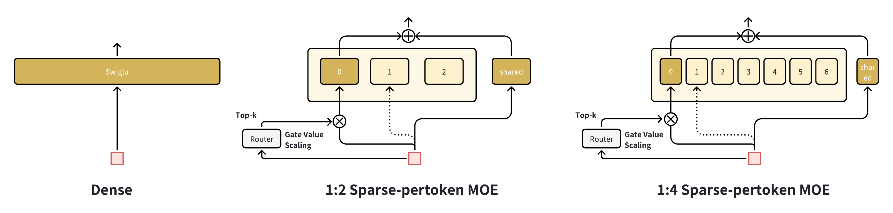

*Figure 7 (Jiang et al., 2026): "First Enlarge, Then Sparsify" illustration. Starting from a dense baseline, the model is first enlarged by adding experts (increasing total parameters), then sparsified so only a fraction of experts activate per token at inference. This sequence — train sparse from the start — avoids the dense-to-sparse conversion gap that degrades accuracy in post-hoc pruning.*

> [!EXAMPLE] FLOPs comparison
> TokenMixer-Large 4B dense: 29.8T FLOPs/batch.
> TokenMixer-Large 4B SP-MoE (2.3B active, $1:2$ sparsity): 15.1T FLOPs/batch.
> AUC: both achieve +1.14% vs the 500M baseline. **The SP-MoE halves inference cost with no AUC penalty.**

### 11.3 Shared Expert

One expert is always active, regardless of gating:

$$\text{SP-MoE}(x_t) = \sum_{i=1}^{k-1} g_i(x_t) \cdot \text{Expert}_i(x_t) + \text{SharedExpert}(x_t)$$

The shared expert acts as a "default path" ensuring all tokens receive at least one full transformation, preventing catastrophic forgetting of common patterns when the router is uncertain. Removing it costs −0.02% AUC.

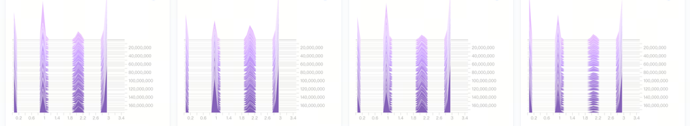

*Figure 9 (Jiang et al., 2026): SP-MoE expert activation load balance at 1:2 sparsity. Each bar shows the fraction of tokens routed to each expert across the sequence. The distribution is approximately uniform, confirming that the auxiliary load-balancing loss prevents expert collapse even under per-token routing.*

### 11.4 Gate Value Scaling

A scalar $\alpha$ is applied to the gated sum, set inversely proportional to the sparsity ratio: $\alpha = 2$ for $1:2$ sparsity, $\alpha = 4$ for $1:4$ sparsity. Without this correction, the softmax gate values sum to 1 over $k-1$ selected experts, so the magnitude of the routed contribution decreases as $k$ shrinks. Removing $\alpha$ costs −0.03% AUC.

### 11.5 Down-Matrix Small Initialization

The down-projection matrix $W_{\text{down}}^{t,j}$ of each expert pSwiGLU is initialized with standard deviation $0.01$ (vs. default $1.0$). This forces expert outputs near-zero at initialization, so the model starts close to a passthrough and learns expert specialization gradually. *This is analogous to small-init residual branches in NTK theory.* Removing it costs −0.03% AUC.

> [!QUESTION] Exercise 7: Load Balancing in SP-MoE
> *This problem derives why uniform routing is a local optimum of the auxiliary load balancing objective.*
>
> > **Prerequisites:** [[#11.1 Formulation|Formulation]]
>
> Consider $E$ routable experts and $B$ tokens per batch. Define the load of expert $j$ as $\ell_j = \sum_{t=1}^B \mathbf{1}[\text{token } t \text{ routes to expert } j]$ and the soft routing probability $p_j = \frac{1}{B}\sum_{t=1}^B g_j(x_t)$. The standard auxiliary loss is $\mathcal{L}_{\text{bal}} = \alpha_{\text{bal}} \cdot E \sum_{j=1}^E \ell_j \cdot p_j$. Show that this loss is minimized when $\ell_j = B/E$ for all $j$, and explain why the product $\ell_j \cdot p_j$ is a tighter surrogate than $\ell_j^2$ for penalizing imbalance.

> [!TIP]- Solution to Exercise 7
> **Key insight:** The product form $\ell_j \cdot p_j$ is differentiable in $p_j$ (unlike $\ell_j$, which is discrete), so its gradient can be back-propagated to the gating network.
>
> **Sketch:** By AM-GM, $\sum_j \ell_j p_j \geq E \cdot (\prod_j \ell_j p_j)^{1/E}$. When $\sum_j \ell_j = B$ and $\sum_j p_j = 1$, the sum $\sum_j \ell_j p_j$ is minimized subject to these constraints when $\ell_j = B/E$ and $p_j = 1/E$ — any deviation creates a larger product sum. The product $\ell_j \cdot p_j$ couples the discrete routing ($\ell_j$) with the differentiable gate ($p_j$), enabling gradient flow; $\ell_j^2$ alone has no gradient w.r.t. the gating network parameters.

---

## 12. Scaling to 7B–15B

📈

### 12.1 Offline Scaling Curves

The paper fits a log-linear relationship between parameter count $N$ and AUC gain:

$$\Delta\text{AUC}(N) \approx a \cdot \log N + b$$

Key offline results (vs. DLRM-MLP-500M baseline):

| Model | ΔAUC | Params | FLOPs/Batch |
|-------|------|--------|-------------|
| Wukong | +0.76% | 513M | 4.6T |
| RankMixer (TokenMixer) | +0.84% | 567M | 4.6T |
| **TokenMixer-Large 500M** | **+0.94%** | 501M | 4.2T |
| TokenMixer-Large 4B | +1.14% | 4.6B | 29.8T |
| TokenMixer-Large 7B | +1.20% | 7.6B | 49.0T |
| TokenMixer-Large 4B SP-MoE | +1.14% | 2.3B active | 15.1T |

A key finding: **beyond 1B parameters, scaling requires balanced expansion across width $D$, depth $L$, and expansion factor $n$ simultaneously** — scaling any single dimension yields diminishing returns.

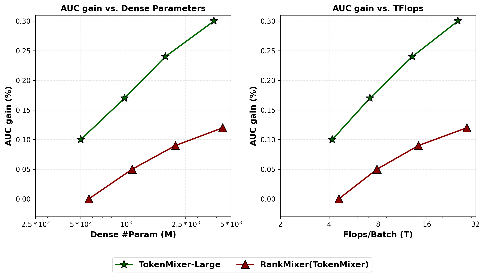

*Figure 8 (Jiang et al., 2026): Scaling laws comparing AUC gain vs parameter count (left) and FLOPs (right) for Wukong, RankMixer (TokenMixer), and TokenMixer-Large across multiple Douyin scenarios (e-commerce 15B, 7B, 4B). TokenMixer-Large achieves consistent log-linear AUC improvements up to 15B parameters, with the steepest scaling slope among all tested models. The x-axis is logarithmic.*

The paper further notes that DCN-style cross-network components become less valuable at larger scales:

| Params | DCN Gain |
|--------|----------|
| 150M | +0.09% |
| 500M | +0.04% |
| 700M | +0.00% |

*This suggests the token-mixing backbone subsumes the cross-feature interaction function that DCN was designed to provide, making DCN redundant at scale.*

### 12.2 Data Hunger at Scale

| Params | Convergence Training Days | ΔUAUC |
|--------|--------------------------|-------|
| 90M | 14 days | +0.94% |
| 500M | 30 days | +0.62% |
| 2.3B | 30 days | +0.41% |
| 2.3B | 60 days | +0.70% |

The 2.3B model trained for 30 days underperforms the 500M model — it simply has not seen enough data to fill its capacity. At 60 days, it recovers and exceeds the 500M baseline. **Larger models require proportionally more training data, consistent with Chinchilla-style scaling laws.**

### 12.3 DCN Diminishing Returns

> [!WARNING] Architectural co-design implication
> The vanishing DCN gain at 700M+ parameters indicates that the cross-feature interaction capability of explicit polynomial cross networks is *already captured* by the depth and width of the token-mixing stack at scale. Including DCN at large scale adds FLOPs (125.8T vs 4.6T for Wukong/TokenMixer at 500M) without AUC benefit.

> [!QUESTION] Exercise 8: Scaling Exponent Estimation
> *This problem estimates the effective scaling exponent from the offline AUC data.*
>
> > **Prerequisites:** [[#12.1 Offline Scaling Curves|Offline Scaling Curves]], [[concepts/ml-theory/power-law-scaling|Neural Scaling Laws]]
>
> Using the three data points (TokenMixer-Large 500M: +0.94%, 4B: +1.14%, 7B: +1.20%) as $\Delta\text{AUC}(N)$ vs $N$ (in billions), fit a power law $\Delta\text{AUC}(N) = c \cdot N^\alpha$ by taking logarithms. Estimate $\alpha$. Is the observed exponent consistent with the $\alpha \approx 0.1$ scaling exponent commonly reported for language model loss?

> [!TIP]- Solution to Exercise 8
> **Key insight:** The gains are compressing logarithmically, implying a small but positive exponent.
>
> **Sketch:** Taking logs: $\ln(0.94) \approx -0.062$, $\ln(1.14) \approx 0.131$, $\ln(1.20) \approx 0.182$; $\ln(0.5) \approx -0.693$, $\ln(4) \approx 1.386$, $\ln(7) \approx 1.946$. Linear regression gives slope $\alpha \approx (0.182 - (-0.062)) / (1.946 - (-0.693)) \approx 0.09$. This is close to the $\alpha \approx 0.07$–$0.1$ range for LLM scaling. A smaller $\alpha$ implies steeply diminishing returns — doubling parameters yields only a $2^\alpha - 1 \approx 6\%$ relative gain in $\Delta\text{AUC}$, justifying the focus on compute-efficient SP-MoE.

---

## 13. Training and Serving Optimizations

🔧

### 13.1 Custom MoE Operators

| Operator | Train Time (ms) | Train % | Serving Time (ms) | Serving % |
|----------|----------------|---------|------------------|-----------|
| MoEGroupedFFN | 136.77 | 89.18% | 7.43 | 98.35% |
| MoEPermute | 6.32 | 4.12% | 0.06 | 0.75% |
| MoEUnpermute | 10.27 | 6.69% | 0.07 | 0.90% |

The permute and unpermute operations reorder token activations so that all tokens routed to expert $j$ are contiguous in memory before the GroupedFFN kernel executes — essential for batched matrix multiplication efficiency. The GroupedFFN dominates at both training (89%) and serving (98%), making it the target for FP8 quantization.

### 13.2 FP8 Quantization

The MoEGroupedFFN is quantized to FP8 (E4M3 format) for serving, providing 2× memory bandwidth reduction vs FP16 and hardware-accelerated matrix multiplication on H100 GPUs. Result: **1.7× serving speedup** with negligible AUC degradation.

> [!INFO] Why FP8 is safe here
> The GroupedFFN at serving is memory-bandwidth bound (Table 13.1). FP8 directly reduces bytes transferred per matrix multiplication, unlocking the memory bandwidth bottleneck. Compute-bound operations would benefit less.

### 13.3 Token Parallel Distributed Training

Token parallelism partitions the $T$ tokens across $P$ GPUs, keeping model parameters on each device while splitting the sequence. Each GPU processes $T/P$ tokens; an all-reduce aggregates after the per-token FFN.

A 4-way token parallel configuration yields:
- **29.2% throughput improvement** (raw, without communication overlap)
- **96.6% throughput improvement** with communication-computation overlap
- MFU improved to **60%** in the advertising backbone

---

## 14. Online Experiments — TokenMixer-Large

🚀

### 14.1 Business Metrics

| Scenario | Model Scale | ΔAUC | Business Metric | Lift |
|----------|------------|------|-----------------|------|
| Feed Ads | 15B | +0.35% | ADSS | +2.0% |
| E-Commerce | 7B | +0.51% | Orders | +1.66% |
| E-Commerce | 7B | +0.51% | Per-capita preview GMV | **+2.98%** |
| Live Streaming | 4B | +0.70% ΔUAUC | Pay revenue | +1.4% |

**The +2.98% GMV gain on e-commerce is the headline result**, representing one of the largest single-model improvements reported in recent industrial recommender papers.

### 14.2 Feed Recommendation Breakdown

| User Segment | Active Day Lift | Watch Duration Lift | Like Lift |
|--------------|----------------|---------------------|-----------|
| Low-active | +1.74% | +3.64% | +8.16% |
| Middle-active | +0.71% | +1.53% | +2.58% |
| High-active | +0.14% | +0.63% | +1.83% |

Low-active users benefit most — ~12× vs high-active users on like rate — consistent with larger model capacity helping most when user histories are sparse.

> [!QUESTION] Exercise 9: Statistical Power for Online Experiments
> *This problem estimates the minimum detectable effect for the reported business metric lifts.*
>
> > **Prerequisites:** [[#14.1 Business Metrics|Business Metrics]]
>
> Suppose the e-commerce A/B test assigns 50%/50% traffic split with $n = 10^7$ users per arm. Assume per-user GMV follows a log-normal distribution with coefficient of variation (CV = std/mean) of 2.0. Using a two-sample $t$-test at $\alpha = 0.05$ two-sided, $\beta = 0.20$ (80% power), derive the minimum detectable effect (MDE) as a percentage lift in mean GMV. Is the +2.98% GMV lift detectable at this sample size?

> [!TIP]- Solution to Exercise 9
> **Key insight:** The MDE for a relative lift in mean is $\text{MDE} = (z_{\alpha/2} + z_\beta) \cdot \text{CV} / \sqrt{n/2}$.
>
> **Sketch:** For $z_{0.025} = 1.96$, $z_{0.20} = 0.84$: $\text{MDE} = (1.96 + 0.84) \cdot 2.0 / \sqrt{5 \times 10^6} = 2.80 \cdot 2.0 / 2236 \approx 0.25\%$. The reported +2.98% lift is approximately $12\times$ the MDE — not borderline. At $10^7$ users per arm and CV=2, even a 0.25% relative lift is detectable.

---

## 15. Ablation Studies — TokenMixer-Large

🔬

**TokenMixer-Large Block ablations (4B scale)**

| Ablation | ΔAUC |
|----------|------|
| w/o Global Token | −0.02% |
| **w/o Mixing and Reverting** | **−0.27%** |
| w/o Residual | −0.15% |
| w/o Inter-Residual and AuxLoss | −0.04% |
| pSwiGLU → SwiGLU (shared) | −0.21% |
| pSwiGLU → Per-token FFN | −0.10% |

**SP-MoE ablations (4B scale)**

| Ablation | ΔAUC | ΔParams | ΔFLOPs |
|----------|------|---------|--------|
| w/o Shared Expert | −0.02% | 0% | 0% |
| w/o Gate Value Scaling | −0.03% | 0% | 0% |
| w/o Down-Matrix Small Init | −0.03% | 0% | 0% |
| SP-MoE → Sparse MoE (global routing) | −0.10% | 0% | 0% |

The last row is the most informative: replacing per-token routing with global (sequence-level) MoE routing costs −0.10% AUC at zero parameter or FLOPs overhead. **This confirms that per-token routing is qualitatively more expressive than global routing for the heterogeneous-feature setting of recommendation ranking.**

---

## 16. Discussion and Limitations — TokenMixer-Large

💬

**Pure model design.** A recurring theme is the elimination of *fragmented operators* — ad-hoc task-specific components accumulated over years of system iteration. TokenMixer-Large argues that a single well-designed block (Mixing-and-Reverting + pSwiGLU + SP-MoE) subsumes the functionality of these operators while being easier to scale and profile.

**Scaling to 15B is not free.** Three practical constraints:

1. *Data constraint.* The 2.3B model requires ≥60 days of Douyin training data to converge; scaling to 15B implies even longer horizons or faster data pipelines.
2. *Latency constraint.* Serving a 15B model within a 10 ms SLA requires careful FP8 quantization, model parallelism, and hardware-specific kernel tuning.
3. *Scenario-specific saturation.* The e-commerce scenario saturates at 7B; live streaming at 4B. Continued scaling should be driven by scenario-specific offline scaling laws, not a global parameter target.

**Limitations:**

- *No retrieval-stage results.* TokenMixer-Large is a ranking model; transfer to embedding-based retrieval (ANN search) is unexplored.
- *Cursory load balancing analysis.* Expert activation distributions are shown but routing collapse or expert specialization are not quantified.
- *No ablation on head count $H$.* A critical hyperparameter for Mixing-and-Reverting, but no sensitivity analysis is provided.

---

## References

| Reference Name | Brief Summary | Link to Reference |
|----------------|--------------|------------------|
| [RankMixer (Zhu et al., 2025)](https://arxiv.org/abs/2507.15551) | Primary paper: multi-head token mixing, per-token FFN, ReLU+DTSI MoE; MFU 4.5%→44.6% | https://arxiv.org/abs/2507.15551 |
| [TokenMixer-Large (Jiang et al., 2026)](https://arxiv.org/abs/2602.06563) | Follow-up: Mixing-and-Reverting, SP-MoE; scales to 7B–15B, +2.98% GMV | https://arxiv.org/abs/2602.06563 |
| [MLP-Mixer (Tolstikhin et al., 2021)](https://arxiv.org/abs/2105.01601) | Vision architecture replacing attention with token-mixing and channel-mixing MLPs; direct inspiration | https://arxiv.org/abs/2105.01601 |
| [DLRM (Naumov et al., 2019)](https://arxiv.org/abs/1906.00091) | Facebook's deep learning recommendation model; defines the baseline architecture | https://arxiv.org/abs/1906.00091 |
| [DCN V2 (Wang et al., 2021)](https://arxiv.org/abs/2008.13535) | Deep & Cross Network V2; explicit polynomial cross-feature interactions; beaten by RankMixer-100M | https://arxiv.org/abs/2008.13535 |
| [DHEN (Zhang et al., 2022)](https://arxiv.org/abs/2203.11014) | Deep hierarchical ensemble network; strong 100M-scale baseline | https://arxiv.org/abs/2203.11014 |
| [Wide & Deep (Cheng et al., 2016)](https://arxiv.org/abs/1606.07792) | Foundational two-tower ranking model; ancestor of DLRM | https://arxiv.org/abs/1606.07792 |
| [Wukong (Zhang et al., 2024)](https://arxiv.org/abs/2403.02545) | Stacked FM and LCB blocks; closest prior-art comparison at 100M–500M scale | https://arxiv.org/abs/2403.02545 |
| [Switch Transformers (Fedus et al., 2022)](https://arxiv.org/abs/2101.03961) | Sparse MoE with top-1 routing; motivates design of DTSI-MoE and SP-MoE | https://arxiv.org/abs/2101.03961 |
| [Scaling Laws for NLMs (Kaplan et al., 2020)](https://arxiv.org/abs/2001.08361) | Power-law scaling of language model loss; framework applied to ranking AUC gains | https://arxiv.org/abs/2001.08361 |
| [Chinchilla (Hoffmann et al., 2022)](https://arxiv.org/abs/2203.15556) | Compute-optimal scaling: model size and data must scale together; directly relevant to §12.2 | https://arxiv.org/abs/2203.15556 |
| [SwiGLU (Shazeer, 2020)](https://arxiv.org/abs/2002.05202) | Gated linear unit variant used as activation in TokenMixer-Large's FFN sub-layers | https://arxiv.org/abs/2002.05202 |
