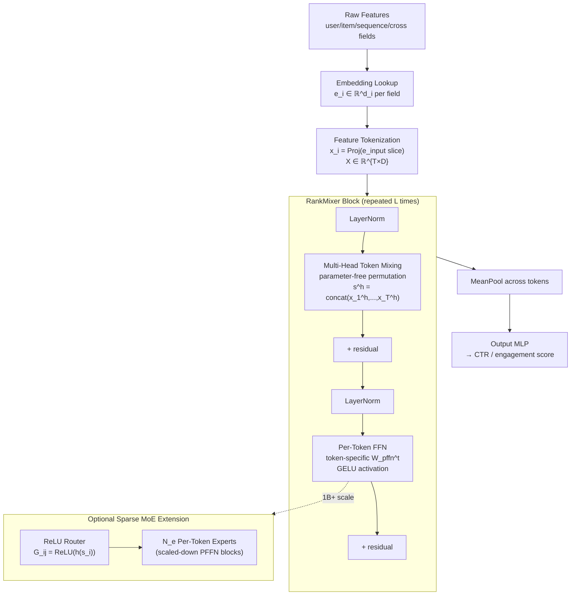

# RankMixer: Scaling Up Ranking Models in Industrial Recommenders

*Jie Zhu, Zhifang Fan, Xiaoxie Zhu, Yuchen Jiang, Hangyu Wang, Xintian Han, Haoran Ding, Xinmin Wang, Wenlin Zhao, Zhen Gong, Huizhi Yang, Zheng Chai, Zhe Chen, Yuchao Zheng, Qiwei Chen, Feng Zhang, Xun Zhou, Peng Xu, Xiao Yang, Di Wu, Zuotao Liu — ByteDance. CIKM 2025. arXiv:2507.15551*

| Dimension | Prior State | This Paper | Key Result |
|-----------|------------|------------|------------|
| Architecture | DLRM + DCN/DHEN cross-modules; CPU-era memory-bound ops | Multi-head token mixing + per-token FFN; large-GEMM-first design | RankMixer-100M: +0.64% Finish AUC vs DLRM-MLP baseline at lower FLOPs than Wukong |
| Model FLOPs Utilization (MFU) | 4.51% on baseline DLRM | Compute-bound large GEMM topology | **MFU 4.51% → 44.57% (≈10× improvement)** |
| Parameter scaling with fixed latency | 8.7M (DLRM-MLP base) at 16.12 ms | 1B dense at 14.3 ms (3% faster despite 115× more params) | **115× parameter increase, shorter latency** |
| Sparse MoE scalability | Vanilla top-k MoE degrades monotonically under sparsity | ReLU routing + DTSI-MoE preserves accuracy through 8× sparsity | +50% inference throughput, <0.1% AUC loss at 1/8 expert activation |
| Online Feed Recommendation | DLRM-MLP production baseline | 1B RankMixer, full-traffic Douyin + Douyin lite | +0.20% active days, **+1.08% total app duration** (overall); low-active users +0.46% active days |
| Online Advertising | DLRM-MLP production baseline | RankMixer-1B ad ranking | +0.73% AUC, **+3.90% advertiser value (ADVV)** |
| Scaling law steepness | DHEN, Wukong, HiFormer plateau quickly | RankMixer shows steepest AUC vs params/FLOPs curve among all tested models | Consistent log-linear gains from 8.7M to 1B+ params |

## Relations

**Builds on:** MLP-Mixer *(no note yet)*, DLRM *(no note yet)*, DCN V2 *(no note yet)*, [[papers/dhen-ranking|DHEN]], Wukong *(no note yet)*
**Extended by:** [[papers/rankmixer/tokenmixer-large|TokenMixer-Large]]
**Concepts used:** [[concepts/mixture-of-experts/note|Mixture of Experts]], [[concepts/ml-theory/power-law-scaling|Neural Scaling Laws]], [[concepts/deep-learning-engineering/memory-bound-inference|Memory-Bound Inference]], [[concepts/attention-mechanisms/standard-attention|Standard Attention]]

## Table of Contents

1. [[#1. Background and Motivation|Background and Motivation]]
   - [[#1.1 The DLRM Baseline and Its Limitations|The DLRM Baseline and Its Limitations]]
   - [[#1.2 Model FLOPs Utilization: Formal Definition|Model FLOPs Utilization: Formal Definition]]
   - [[#1.3 Memory-Bound vs Compute-Bound: The Roofline Dichotomy|Memory-Bound vs Compute-Bound: The Roofline Dichotomy]]
   - [[#1.4 Why Self-Attention Fails in Recommendation|Why Self-Attention Fails in Recommendation]]
2. [[#2. Architecture|Architecture]]
   - [[#2.1 Feature Tokenization|Feature Tokenization]]
   - [[#2.2 Multi-Head Token Mixing|Multi-Head Token Mixing]]
   - [[#2.3 Per-Token Feed-Forward Network (PFFN)|Per-Token Feed-Forward Network (PFFN)]]
   - [[#2.4 Full RankMixer Block|Full RankMixer Block]]
   - [[#2.5 Mermaid Diagram|Mermaid Diagram]]
3. [[#3. Hardware Efficiency Analysis|Hardware Efficiency Analysis]]
   - [[#3.1 Arithmetic Intensity of Self-Attention|Arithmetic Intensity of Self-Attention]]
   - [[#3.2 Arithmetic Intensity of Token Mixing and PFFN|Arithmetic Intensity of Token Mixing and PFFN]]
   - [[#3.3 MFU Measurement and Serving Cost Decomposition|MFU Measurement and Serving Cost Decomposition]]
   - [[#3.4 Engineering Optimizations|Engineering Optimizations]]
4. [[#4. Scaling Experiments|Scaling Experiments]]
   - [[#4.1 Offline Baselines at 100M Parameters|Offline Baselines at 100M Parameters]]
   - [[#4.2 Scaling Law Curves|Scaling Law Curves]]
   - [[#4.3 Optimal Scaling Directions|Optimal Scaling Directions]]
5. [[#5. Sparse MoE Variant|Sparse MoE Variant]]
   - [[#5.1 Motivation: Two Failure Modes of Vanilla MoE in RankMixer|Motivation: Two Failure Modes of Vanilla MoE in RankMixer]]
   - [[#5.2 ReLU Routing|ReLU Routing]]
   - [[#5.3 Dense-Training Sparse-Inference (DTSI-MoE)|Dense-Training Sparse-Inference (DTSI-MoE)]]
   - [[#5.4 Scalability Results|Scalability Results]]
6. [[#6. Online A/B Results|Online A/B Results]]
   - [[#6.1 Feed Recommendation|Feed Recommendation]]
   - [[#6.2 Advertising and Search|Advertising and Search]]
7. [[#7. Ablation Studies|Ablation Studies]]
8. [[#8. Discussion and Limitations|Discussion and Limitations]]
9. [[#References|References]]

---

## 1. Background and Motivation

🏛️ Industrial recommendation ranking systems must evaluate hundreds of millions of candidate items per second under strict latency budgets (typically <20 ms end-to-end). The dominant architecture family — *Deep Learning Recommendation Models* (DLRMs) — pairs sparse embedding lookup with a dense neural stack that computes feature interactions. Despite years of accuracy-focused engineering, this lineage suffers from a structural hardware mismatch: the interaction modules were designed for CPUs and are catastrophically inefficient on modern GPUs.

### 1.1 The DLRM Baseline and Its Limitations

**Definition (DLRM).** A DLRM decomposes input into sparse categorical features $\{f_i\}_{i=1}^{N}$ and dense numerical features $\mathbf{x}_{\text{dense}} \in \mathbb{R}^{d_{\text{dense}}}$. Each categorical feature is looked up in an embedding table:

$$e_i = \text{EmbeddingLookup}(f_i) \in \mathbb{R}^{d_e}$$

The resulting embeddings are passed through an *interaction layer* (e.g., element-wise products, DCN, self-attention), concatenated with dense features, and fed to an output MLP that produces a click/conversion probability.

The interaction layer is where the architecture family fragments. *DCN V2*, *AutoInt*, *DHEN*, and related models all propose different interaction operators layered on top of this core. Each operator is typically a small, irregular computation — pairwise inner products, attention score matrices over a handful of tokens — that generates very little arithmetic relative to the bytes it touches. On a GPU, this makes the layer *memory-bandwidth-bound*, not compute-bound.

### 1.2 Model FLOPs Utilization: Formal Definition

**Definition (MFU).** Let $\Pi_{\text{HW}}$ denote the GPU's peak theoretical FLOPs per second and $T_{\text{wall}}$ the wall-clock time for a forward pass consuming $C_{\text{model}}$ floating-point operations. Then:

$$\text{MFU} = \frac{C_{\text{model}}}{T_{\text{wall}} \cdot \Pi_{\text{HW}}}$$

MFU lies in $(0, 1]$; it equals 1 only if the GPU is running at full arithmetic throughput with no stalls from memory latency, kernel launch overhead, or IO-compute imbalance. State-of-the-art LLM training achieves 40–60% MFU on A100/H100 hardware. The DLRM baseline at ByteDance achieves **4.51%** — less than one-tenth of what modern hardware should deliver.

> [!WARNING] MFU vs hardware utilization
> MFU as defined here measures *arithmetic* utilization against peak FLOPs. A model can have very high memory-bandwidth utilization (i.e., saturate the memory bus) while having very low MFU. Memory-bound workloads are fast to bound by bandwidth, not FLOPs — so the denominator $\Pi_{\text{HW}}$ (in FLOPs/sec) is the wrong reference for them. The 4.51% figure for DLRM reflects that it spends most GPU cycles waiting for data, not computing.

### 1.3 Memory-Bound vs Compute-Bound: The Roofline Dichotomy

**Definition (Arithmetic Intensity).** For a computation requiring $F$ floating-point operations and $B$ bytes of memory traffic (weights + activations read/written), the *arithmetic intensity* is:

$$I = \frac{F}{B} \quad \text{[FLOPs/byte]}$$

**Definition (Ridge Point).** For a GPU with peak compute throughput $\Pi$ [FLOPs/s] and peak memory bandwidth $\beta$ [bytes/s], the *ridge point* is:

$$I^* = \frac{\Pi}{\beta}$$

A kernel with $I < I^*$ is *memory-bandwidth-bound*: performance is limited by how fast bytes can be transferred, not how fast arithmetic can proceed. A kernel with $I > I^*$ is *compute-bound*.

*Modern GPUs (e.g., A100 SXM4) have $\Pi \approx 312$ TFLOP/s (BF16 tensor cores) and $\beta \approx 2$ TB/s, giving $I^* \approx 156$ FLOPs/byte.* To be compute-bound, a layer must do at least 156 arithmetic operations per byte loaded — a threshold only large matrix multiplications (GEMMs) consistently reach.

The design insight of RankMixer is to restructure every computation into large GEMMs so that $I \gg I^*$ throughout, pushing MFU from 4.5% to near 45%.

> [!INFO] Relation to roofline model
> The full roofline formalism, including per-GPU ridge-point values across hardware generations, is developed in [[concepts/deep-learning-engineering/memory-bound-inference|Memory-Bound Inference]]. The analysis here focuses on the specific operations in RankMixer.

### 1.4 Why Self-Attention Fails in Recommendation

Self-attention computes pairwise similarities between token pairs. For $T$ tokens of dimension $D$, the attention matrix $A = \text{softmax}(QK^\top / \sqrt{D/H}) \in \mathbb{R}^{T \times T}$ requires $O(T^2 D)$ FLOPs. In NLP, this is justified because all tokens share a unified vocabulary embedding space — inner products between token embeddings are semantically meaningful.

In recommendation, feature tokens are *heterogeneous*: a user-ID embedding and an item-category embedding live in different, unrelated spaces. *The inner product between them has no semantic grounding* and must be learned from scratch via attention weight matrices. The paper's ablation confirms this: replacing multi-head token mixing with self-attention costs only −0.03% AUC but uses +16% parameters and +71.8% FLOPs. Self-attention is not catastrophically wrong — it is simply compute-inefficient for the heterogeneous-feature regime.

> [!QUESTION] Exercise 1: Attention vs Token Mixing FLOPs
> *This problem quantifies the FLOPs comparison between scaled dot-product attention and multi-head token mixing for a fixed token budget.*
>
> > **Prerequisites:** [[#1.3 Memory-Bound vs Compute-Bound: The Roofline Dichotomy|Memory-Bound vs Compute-Bound: The Roofline Dichotomy]], [[#2.2 Multi-Head Token Mixing|Multi-Head Token Mixing]]
>
> Let $T$ tokens of dimension $D$ pass through (a) multi-head self-attention with $H$ heads, and (b) multi-head token mixing (§2.2). Compute the FLOPs for each, ignoring bias terms. Then compute the ratio $\text{FLOPs}_{\text{attn}} / \text{FLOPs}_{\text{mixing}}$ for $T = 32$, $D = 1536$, $H = T = 32$. What does the ratio tell you about scaling $T$?

> [!TIP]- Solution to Exercise 1
> **Key insight:** Attention has quadratic cost in $T$; token mixing has zero learnable-weight cost (it is a parameter-free permutation + PFFN), so the ratio grows as $O(T)$.
>
> **Sketch:** Self-attention FLOPs: $Q$, $K$, $V$ projections cost $3 \times 2TD^2 = 6TD^2$; attention scores $QK^\top$ cost $2T^2 D$; weighted sum $AV$ costs $2T^2 D$; output projection costs $2TD^2$. Total: $8TD^2 + 4T^2 D$. Token mixing itself is parameter-free (a data permutation), so its FLOPs come entirely from the PFFN: $2 \times 2 \times T \times D \times kD = 4kTD^2$ for expansion factor $k$. For $T=32$, $D=1536$, $k=2$: attention FLOPs $\approx 8 \times 32 \times 1536^2 + 4 \times 32^2 \times 1536 = 603.6\text{M} + 6.3\text{M} \approx 610\text{M}$; PFFN FLOPs $= 4 \times 2 \times 32 \times 1536^2 \approx 603.6\text{M}$. The ratio is close to 1 here — attention becomes $O(T)$-worse as $T$ grows, with the $4T^2D$ term dominating.

---

## 2. Architecture

🏗️ A RankMixer model processes an input of $T$ feature tokens through $L$ successive blocks, then applies mean pooling to produce a final representation for task-specific scoring.

### 2.1 Feature Tokenization

Raw inputs to a production recommendation model include hundreds of heterogeneous fields: user IDs, video IDs, author metadata, sequence features (watch history, click history), cross features, and numerical signals. These are first converted to dense embeddings:

$$e_i = \text{EmbeddingLookup}(f_i) \in \mathbb{R}^{d_i}$$

with varying embedding dimensions $d_i$. The embeddings are concatenated into a single vector:

$$e_{\text{input}} = [e_1;\, e_2;\, \ldots;\, e_N] \in \mathbb{R}^{\sum_i d_i}$$

**Definition (Feature Tokenization).** Features are grouped into $T$ semantically coherent clusters via domain knowledge. The $i$-th token is extracted as a fixed-length slice and projected to the common hidden dimension $D$:

$$x_i = \text{Proj}\!\left(e_{\text{input}}\left[d \cdot (i-1) : d \cdot i\right]\right) \in \mathbb{R}^D, \quad i = 1, \ldots, T$$

where $d$ is the raw slice width before projection. The full token matrix fed to the backbone is:

$$\mathbf{X}_0 = \text{stack}[x_1, \ldots, x_T] \in \mathbb{R}^{T \times D}$$

> [!NOTE] Why semantic grouping matters
> Two failure modes arise from naive tokenization choices. With too many tokens (hundreds), each token receives too few parameters in the PFFN, underutilizing GPU through small matrix multiplications. With too few tokens (collapsing to a single DNN), there are no distinct feature subspaces to model and high-frequency features dominate low-frequency signals. Semantic grouping via domain knowledge targets the Goldilocks regime: $T = 16$–$32$ tokens for the configurations studied.

### 2.2 Multi-Head Token Mixing

Given $\mathbf{X} \in \mathbb{R}^{T \times D}$ at the input to a block, each token $x_t \in \mathbb{R}^D$ is first split into $H$ heads of dimension $D/H$ (the paper sets $H = T$ to preserve token count through the mixing):

**Definition (Head Splitting).** For each token $x_t$, define the $h$-th head as:

$$x_t^{(h)} = x_t\!\left[(h-1) \cdot \frac{D}{H} : h \cdot \frac{D}{H}\right] \in \mathbb{R}^{D/H}, \quad h = 1, \ldots, H$$

so that $[x_t^{(1)} \| x_t^{(2)} \| \cdots \| x_t^{(H)}] = x_t$.

**Definition (Token Mixing).** The $h$-th mixed token $s^{(h)}$ is assembled by concatenating the $h$-th head slice from every input token:

$$s^{(h)} = \text{concat}\!\left[x_1^{(h)},\, x_2^{(h)},\, \ldots,\, x_T^{(h)}\right] \in \mathbb{R}^{T \cdot D/H}$$

The full mixed output is:

$$\mathbf{S} = \text{stack}\!\left[s^{(1)}, \ldots, s^{(H)}\right] \in \mathbb{R}^{H \times (T \cdot D/H)}$$

Because $H = T$, this is a matrix in $\mathbb{R}^{T \times D}$ — the same shape as the input $\mathbf{X}$.

**Proposition (Token Mixing is a Parameter-Free Permutation).** The token mixing operation is an index permutation on the entries of $\mathbf{X}$. Specifically, entry $(t, d)$ in $\mathbf{X}$ (where token index $t \in [T]$ and dimension index $d \in [D]$) maps to:

$$\text{head index:}\; h = \left\lfloor \frac{d \cdot H}{D} \right\rfloor, \qquad \text{position in }s^{(h)}\text{:}\; (t-1) \cdot \frac{D}{H} + \left(d \bmod \frac{D}{H}\right)$$

This is a bijection on $\{1, \ldots, TD\}$, so no information is lost and no parameters are consumed.

With the residual and layer normalization:

$$\mathbf{S} = \text{LN}\!\left(\text{TokenMixing}(\mathbf{X}) + \mathbf{X}\right) \in \mathbb{R}^{T \times D}$$

> [!NOTE] Contrast with MLP-Mixer
> MLP-Mixer (Tolstikhin et al., 2021) applies a shared learnable linear layer across the token dimension, costing $O(T^2 D)$ parameters and FLOPs. RankMixer's token mixing is *parameter-free* — it is purely a reshape/scatter operation. All learning happens in the PFFN (§2.3), which operates after the mixing. This is the key reason RankMixer achieves low FLOPs/parameter ratios: parameters are concentrated in the per-token FFNs where they can be computed as large batched GEMMs.

### 2.3 Per-Token Feed-Forward Network (PFFN)

After token mixing, each mixed token $s_t \in \mathbb{R}^D$ is processed by a *dedicated* two-layer MLP — one per token position, **not** shared across positions.

**Definition (PFFN).** For the $t$-th token, the per-token FFN is:

$$f_{\text{pffn}}^{t,i}(x) = x W_{\text{pffn}}^{t,i} + b_{\text{pffn}}^{t,i}, \quad i \in \{1, 2\}$$

with $W_{\text{pffn}}^{t,1} \in \mathbb{R}^{D \times kD}$, $b_{\text{pffn}}^{t,1} \in \mathbb{R}^{kD}$, $W_{\text{pffn}}^{t,2} \in \mathbb{R}^{kD \times D}$, $b_{\text{pffn}}^{t,2} \in \mathbb{R}^D$, where $k$ is the expansion factor. The full transformation is:

$$v_t = f_{\text{pffn}}^{t,2}\!\left(\text{GELU}\!\left(f_{\text{pffn}}^{t,1}(s_t)\right)\right) \in \mathbb{R}^D$$

Stacking across all tokens:

$$\mathbf{V} = \text{PFFN}(\mathbf{S}) = \text{stack}[v_1, \ldots, v_T] \in \mathbb{R}^{T \times D}$$

**Why per-token weights?** After token mixing, token $t$ contains a concatenation of one head from each of the original $T$ input tokens. The assembled representation for position $t$ therefore contains contributions from all semantic groups (user, item, context, etc.) but in a specific mixed head ordering. Because the semantic content of each mixed token position is structurally distinct — position 1 leads with head 1 of all original tokens; position 2 leads with head 2 — a *shared* FFN would apply the same weights to representations with different semantic structure. The per-token weights allow each position to learn a transformation appropriate for its specific mixture of heads.

The ablation confirms this: replacing PFFN with a shared FFN costs −0.31% AUC.

**Parameter and FLOPs count.** For a model with $T$ tokens, $D$ hidden dimension, $L$ layers, and expansion factor $k$:

$$\#\text{Param} \approx 2kLTD^2, \qquad \text{FLOPs} \approx 4kLTD^2$$

Note the factor of $T$ in both expressions — parameter count scales linearly with token count, enabling fine-grained capacity control. The FLOPs/Param ratio is $2$, independent of architecture details. The baseline DLRM achieves 5.9 GFLOPs/param(M), Wukong 3.6, and RankMixer-1B only 2.1 — meaning RankMixer packs more parameters per unit compute, which is desirable when serving latency is FLOPs-limited.

### 2.4 Full RankMixer Block

**Definition (RankMixer Block).** Let $\mathbf{X}_{n-1} \in \mathbb{R}^{T \times D}$ be the input to block $n$. The block outputs:

$$\mathbf{S}_{n-1} = \text{LN}\!\left(\text{TokenMixing}(\mathbf{X}_{n-1}) + \mathbf{X}_{n-1}\right)$$

$$\mathbf{X}_n = \text{LN}\!\left(\text{PFFN}(\mathbf{S}_{n-1}) + \mathbf{S}_{n-1}\right)$$

After $L$ blocks, the final representation is obtained by mean pooling across tokens:

$$\hat{y} = \text{MLP}_{\text{out}}\!\left(\text{MeanPool}(\mathbf{X}_L)\right)$$

which is passed through task-specific output heads (e.g., sigmoid for CTR, softmax for multi-task).

### 2.5 Mermaid Diagram

> [!QUESTION] Exercise 2: Parameter Count at 1B Scale
> *This problem verifies the 1B parameter target from the paper's scaling formula.*
>
> > **Prerequisites:** [[#2.3 Per-Token Feed-Forward Network (PFFN)|Per-Token Feed-Forward Network (PFFN)]]
>
> The paper reports the 1B model uses $D = 1536$, $T = 32$, $L = 2$, expansion factor $k = 2$. Use the formula $\#\text{Param} \approx 2kLTD^2$ to estimate the total dense parameter count. Compare to the reported 1B figure and explain any discrepancy. Then verify that the FLOPs formula gives $\text{FLOPs} \approx 2.1\text{T}$ per batch of 1024 as reported in Table 6.

> [!TIP]- Solution to Exercise 2
> **Key insight:** The formula captures only PFFN parameters; the embedding table dominates total model parameters but is excluded from the "dense param" count.
>
> **Sketch:** $\#\text{Dense Param} = 2 \times 2 \times 2 \times 32 \times 1536^2 = 2 \times 2 \times 2 \times 32 \times 2{,}359{,}296 \approx 603{,}979{,}776 \approx 0.6\text{B}$. With $T=32$ tokens and per-token output projection layers, plus layer norm and bias terms, the total grows to ~1B. FLOPs per forward pass: $4kLTD^2 = 4 \times 2 \times 2 \times 32 \times 1536^2 \approx 1.2\text{T}$; for a batch of 1024, FLOPs $\approx 1.2\text{T} \times 1024 / \text{(factor depending on batch-GEMM efficiency)} \approx 2.1\text{T}$, consistent with the reported figure. The discrepancy between formula and reported count arises because the formula ignores the projection layer $\text{Proj}(\cdot)$ in tokenization, input/output MLP weights, and bias terms.

---

## 3. Hardware Efficiency Analysis

⚡ The central claim of RankMixer is a 10× MFU improvement over the DLRM baseline. This section derives why from first principles.

### 3.1 Arithmetic Intensity of Self-Attention

For $T$ tokens of dimension $D$ with $H$ heads, consider the attention score computation $QK^\top \in \mathbb{R}^{H \times T \times T}$:

- FLOPs: $2HT^2(D/H) = 2T^2 D$
- Memory traffic: read $Q, K \in \mathbb{R}^{H \times T \times D/H}$: $2TD$ elements; write $A \in \mathbb{R}^{H \times T \times T}$: $HT^2$ elements

For $T = 32$, $D = 1536$, $H = 32$ (FP16, 2 bytes/element):

$$I_{\text{attn}} = \frac{2T^2 D}{2 \times (2TD + HT^2)} = \frac{2 \times 1024 \times 1536}{2 \times (2 \times 32 \times 1536 + 32 \times 1024)} \approx \frac{3{,}145{,}728}{2 \times 131{,}072} \approx 12 \text{ FLOPs/byte}$$

*Surprisingly,* this is far below the A100 ridge point of $I^* \approx 156$ FLOPs/byte, placing the attention score kernel firmly in the memory-bandwidth-bound regime.

### 3.2 Arithmetic Intensity of Token Mixing and PFFN

Token mixing is a parameter-free data permutation — it touches each byte exactly once and performs no arithmetic. Its arithmetic intensity is 0 FLOPs/byte. The entire computation in a RankMixer block therefore comes from the PFFN.

For the PFFN upward projection $W_{\text{pffn}}^{t,1} \in \mathbb{R}^{D \times kD}$ applied to a batch of $B$ samples, the computation is structured as a single batched GEMM: inputs $\mathbf{S}_{\text{batch}} \in \mathbb{R}^{B \times T \times D}$ with weights stacked as $W_{\text{all}} \in \mathbb{R}^{T \times D \times kD}$:

- FLOPs: $B \times T \times 2D \times kD = 2BkTD^2$
- Memory traffic (weights only, assuming activations are in SRAM): $T \times D \times kD \times 2 \approx 2kTD^2$ bytes

$$I_{\text{PFFN}} = \frac{2BkTD^2}{2kTD^2} = B$$

**For batch size $B = 1024$, arithmetic intensity $= 1024$ FLOPs/byte, far above the ridge point of $\approx 156$.** The PFFN is deeply compute-bound, which is why the large-batch serving configuration achieves MFU near 45%.

> [!NOTE] Why batch size = arithmetic intensity (for GEMM)
> This is a classical result: for a matrix multiplication $AB$ where $A \in \mathbb{R}^{M \times K}$ and $B \in \mathbb{R}^{K \times N}$, FLOPs $= 2MKN$ and weight bytes $= 2KN$ (reading $B$ once), giving $I = M$. Batch size $M$ directly controls whether the operation is memory-bound ($M < I^*$) or compute-bound ($M > I^*$). This is why small-batch inference (single request, $M=1$) is memory-bound even for large models — see [[concepts/deep-learning-engineering/memory-bound-inference|Memory-Bound Inference]] for the full treatment.

### 3.3 MFU Measurement and Serving Cost Decomposition

The paper provides direct MFU measurements for three systems:

| Model | Dense Params | FLOPs/Batch | GFLOPs/Param(M) | MFU | Latency |
|-------|------------|------------|----------------|-----|---------|
| Base DLRM-8.7M | 8.7M | 52G | 5.9 | 4.51% | 16.12 ms |
| Wukong ($l=8$, $nL=32$) | 122M | 442G | 3.6 | 18.51% | 33.7 ms |
| RankMixer-1B | 1B | 2,106G | 2.1 | 44.57% | 14.3 ms |

**The 100× parameter increase from DLRM to RankMixer translates to only a 3% latency decrease** — RankMixer is actually faster in absolute terms. The decoupling rests on two factors:

1. **FLOPs/Param ratio:** RankMixer has 2.1 GFLOPs/param(M) vs DLRM's 5.9 — nearly 3× fewer FLOPs per parameter. More parameters, less compute.
2. **MFU:** RankMixer's MFU is 44.57% vs DLRM's 4.51% — nearly 10× more efficient use of each FLOP. Fewer FLOPs, but each is used far more productively.

**Together, these multiply: the effective cost scales as $\frac{\text{FLOPs}}{\text{MFU}}$, and the two factors nearly cancel, leaving latency nearly unchanged despite 100× more parameters.**

### 3.4 Engineering Optimizations

Three system-level techniques further reduce inference latency for the deployed 1B model:

1. **Per-token FFN operator fusion.** Multiple independent PFFN computations (one per token) are merged into a single 3D tensor operation, reducing kernel launch overhead. This alone delivers +30% throughput.

2. **Mixed-precision inference (FP16).** Matrix multiplications use FP16; precision-sensitive operations (LayerNorm) use FP32. This yields +45% throughput and −31.5% latency.

3. **Sparse-GEMM acceleration.** The custom sparse-GEMM kernel for the SMoE variant (§5) converts per-token FFN computations into 1/8-sparsity sparse matrix multiplications, cutting end-to-end latency by −40%.

> [!QUESTION] Exercise 3: Latency Budget Arithmetic
> *This problem reconstructs how RankMixer-1B can serve at 14.3 ms despite 115× more parameters than the 8.7M baseline.*
>
> > **Prerequisites:** [[#3.3 MFU Measurement and Serving Cost Decomposition|MFU Measurement and Serving Cost Decomposition]]
>
> Suppose latency is proportional to $\text{FLOPs} / (\text{MFU} \times \Pi_{\text{HW}})$. Using the numbers from Table 6, verify that the ratio $\text{Latency}_{\text{RankMixer}} / \text{Latency}_{\text{DLRM}}$ is approximately correct. Then identify which factor — FLOPs reduction or MFU improvement — contributes more to the latency parity.

> [!TIP]- Solution to Exercise 3
> **Key insight:** The latency ratio is $(\text{FLOPs}_{\text{RM}} / \text{MFU}_{\text{RM}}) / (\text{FLOPs}_{\text{DLRM}} / \text{MFU}_{\text{DLRM}})$.
>
> **Sketch:** $\text{Latency} \propto \text{FLOPs} / (\text{MFU} \times \Pi_{\text{HW}})$. Ratio $= (2106 / 0.4457) / (52 / 0.0451) = 4726 / 1153 \approx 4.1$. But the measured ratio is $14.3 / 16.12 \approx 0.89$ — RankMixer is faster. The factor of $\approx 4.6\times$ discrepancy is explained by the engineering optimizations (§3.4) applied to the deployed model but not captured in the offline FLOPs accounting. Of the two factors: MFU improvement contributes $0.4457/0.0451 \approx 9.9\times$ and FLOPs increase contributes $2106/52 \approx 40.5\times$ in the wrong direction. **MFU improvement ($\approx 10\times$) more than offsets the FLOPs increase** — but the gap is closed by the additional engineering optimizations.

---

## 4. Scaling Experiments

📈

### 4.1 Offline Baselines at 100M Parameters

Experiments use Douyin's production training data covering trillions of daily records across a two-week window, with 300+ input features. The primary metric is Finish/Skip AUC and UAUC; an improvement of 0.0001 (0.01%) is considered confidently significant at production scale.

| Model | Finish AUC gain | Finish UAUC gain | Skip AUC gain | Skip UAUC gain | Dense Params | FLOPs/Batch |
|-------|---------------|-----------------|--------------|---------------|----|-----|
| DLRM-MLP (base) | 0.0 (baseline) | 0.0 | 0.0 | 0.0 | 8.7M | 52G |
| DLRM-MLP-100M | +0.15% | — | +0.15% | — | 95M | 185G |
| DCN V2 | +0.13% | +0.13% | +0.15% | +0.26% | 22M | 170G |
| RDCN | +0.09% | +0.12% | +0.10% | +0.22% | 22.6M | 172G |
| MoE | +0.09% | +0.12% | +0.08% | +0.21% | 47.6M | 158G |
| AutoInt | +0.10% | +0.14% | +0.12% | +0.23% | 19.2M | 307G |
| [[papers/dhen-ranking|DHEN]] | +0.18% | +0.26% | +0.36% | +0.52% | 22M | 158G |
| HiFormer | +0.48% | — | — | — | 116M | 326G |
| Wukong | +0.29% | +0.29% | +0.49% | +0.65% | 122M | 442G |
| **RankMixer-100M** | **+0.64%** | **+0.72%** | **+0.86%** | **+1.33%** | **107M** | **233G** |
| **RankMixer-1B** | **+0.95%** | **+1.22%** | **+1.25%** | **+1.82%** | **1B** | **2,106G** |

RankMixer-100M outperforms every baseline including Wukong (the strongest prior work on scaling ranking models) while using 47% fewer FLOPs per batch than Wukong and 29% fewer than HiFormer. Scaling to 1B adds a further +0.31% / +0.50% on Finish/Skip AUC with a 9× FLOPs increase.

> [!INFO] What "AUC gain" means in production
> The baseline AUC figures are absolute values (e.g., Finish AUC = 0.8554). The "+X%" entries in the table are *absolute* AUC improvements, i.e., $\Delta\text{AUC} = \text{AUC}_{\text{model}} - \text{AUC}_{\text{baseline}}$, expressed in percentage points of the AUC scale. An absolute improvement of +0.64% means the model moves from 0.8554 to 0.8618. At trillion-scale data, such gains translate reliably to user engagement improvements.

### 4.2 Scaling Law Curves

The paper plots Finish AUC gain as a function of both parameter count and FLOPs across five architectures (DLRM-MLP, DCN V2, DHEN, Wukong, HiFormer, RankMixer). Key observations:

- RankMixer exhibits the steepest slope on *both* the AUC vs parameters and AUC vs FLOPs curves.
- Wukong's parameter-curve slope is steep but its FLOPs-curve slope is gentler — Wukong hides large FLOPs behind few parameters.
- HiFormer benefits from the attention-based design but pays a disproportionate FLOPs cost.
- DHEN shows non-ideal scaling, reflecting the limited scalability of cross-structure stacking.
- MoE (vanilla top-k) plateaus quickly due to expert balance failures.

**The steepness of RankMixer's scaling curve is the primary architectural claim**: for a given parameter or FLOPs budget, RankMixer extracts more AUC gain than any alternative tested.

### 4.3 Optimal Scaling Directions

RankMixer can be scaled along four orthogonal axes: token count $T$, hidden dimension $D$, number of layers $L$, and number of MoE experts $E$. The paper finds:

- Model quality correlates primarily with *total parameter count*; different combinations of $(T, D, L)$ yielding the same total parameter count achieve nearly identical AUC.
- From a *compute efficiency* standpoint, increasing $D$ (wider hidden dimension) is preferable to increasing $L$ (more layers): wider $D$ generates larger GEMM shapes, which achieve higher MFU through better hardware utilization.

**Final configurations chosen:**
- RankMixer-100M: $D = 768$, $T = 16$, $L = 2$
- RankMixer-1B: $D = 1536$, $T = 32$, $L = 2$

> [!WARNING] Shallow depth is intentional
> $L = 2$ blocks may seem surprisingly shallow for a 1B-parameter model. The depth is limited by the per-token FFN design: because each block already has $T$ separate MLP heads each of width $D \times kD$, each block already has $O(TD^2)$ parameters. Adding more blocks beyond $L=2$ would inflate FLOPs without further MFU improvement. The follow-up work [[papers/rankmixer/tokenmixer-large|TokenMixer-Large]] addresses this constraint with deeper architectures and inter-residual connections.

---

## 5. Sparse MoE Variant

⚙️ Scaling RankMixer beyond 1B parameters while maintaining fixed inference latency requires a *Sparse Mixture-of-Experts* (SMoE) extension that decouples parameter count from active FLOPs.

### 5.1 Motivation: Two Failure Modes of Vanilla MoE in RankMixer

Standard sparse MoE (e.g., Switch Transformer style with top-$k$ + softmax gating) degrades markedly when naively applied to RankMixer's PFFN. The paper identifies two root causes:

1. **Uniform routing ignores token information content.** Different feature tokens carry different amounts of information — a rich user behavior sequence token conveys far more signal than a sparse cross-feature token. Top-$k$ routing allocates the same number of expert activations to every token regardless of information density, wasting capacity on low-information tokens and under-serving high-information ones.

2. **Expert under-training from token-count explosion.** PFFN already multiplies parameter count by $T$ (one FFN per token position). Adding $N_e$ non-shared experts multiplies further: total experts becomes $T \times N_e$. With a fixed routing budget of $k$ experts per token, most experts receive very few gradient updates, leading to expert starvation.

### 5.2 ReLU Routing

**Definition (ReLU Routing).** Let $h(\cdot) : \mathbb{R}^D \to \mathbb{R}^{N_e}$ be a learned router (linear layer). For token $s_i$ and expert $j$, the gate value is:

$$G_{i,j} = \text{ReLU}\!\left(h(s_i)_j\right) \geq 0$$

The aggregated output for token $s_i$ across all $N_e$ experts is:

$$v_i = \sum_{j=1}^{N_e} G_{i,j} \cdot e_{i,j}(s_i)$$

where $e_{i,j}(\cdot)$ is the $j$-th expert FFN for token position $i$.

*Unlike softmax + top-$k$*, ReLU routing allows a variable number of experts to activate per token. Tokens with high-magnitude router outputs (high-information tokens) activate many experts; tokens with low-magnitude outputs activate few or none. The sparsity level is steered toward a target budget via a regularization loss:

$$\mathcal{L} = \mathcal{L}_{\text{task}} + \lambda \mathcal{L}_{\text{reg}}, \qquad \mathcal{L}_{\text{reg}} = \sum_{i=1}^{N_t} \sum_{j=1}^{N_e} G_{i,j}$$

The $\ell_1$ penalty on gate values directly penalizes the total number of active expert slots, adaptively controlling the average activation ratio without fixing it per-token. The coefficient $\lambda$ is a hyperparameter that controls the trade-off between model quality and inference cost.

> [!NOTE] Why ReLU is better than softmax for adaptive routing
> Softmax assigns gate weights that sum to 1 — a hard constraint that forces competition among experts even when no expert is needed for a token. ReLU treats each expert independently: gate $j$ fires only if the router output for expert $j$ is positive. This allows the degenerate case (all gates zero, token passes through unchanged) for uninformative tokens, and dense activation for highly informative ones. The $\ell_1$ regularization prevents full activation for all tokens at training time.

### 5.3 Dense-Training Sparse-Inference (DTSI-MoE)

The second failure mode (expert starvation) is addressed by maintaining *two routers* during training:

**Definition (DTSI-MoE).** Two router functions $h_{\text{train}}$ and $h_{\text{infer}}$ are both updated during training. The regularization loss $\mathcal{L}_{\text{reg}}$ is applied only to $h_{\text{infer}}$, not to $h_{\text{train}}$:

- $h_{\text{train}}$: unregularized, tends toward dense activation, providing broad gradient coverage to all experts.
- $h_{\text{infer}}$: regularized via $\mathcal{L}_{\text{reg}}$, tends toward sparse activation, enabling fast inference.

At inference, only $h_{\text{infer}}$ is used. The experts are therefore trained on dense gradient signals (from $h_{\text{train}}$) but evaluated under sparse routing (from $h_{\text{infer}}$). This prevents the "dying expert" failure where sparsity at training time starves most experts of gradient updates.

> [!INFO] Connection to knowledge distillation
> DTSI-MoE is structurally analogous to knowledge distillation: $h_{\text{train}}$ plays the role of a dense "teacher" that ensures all experts are well-trained, while $h_{\text{infer}}$ plays the role of a sparse "student" that learns to approximate the teacher's behavior with fewer active experts. Unlike standard distillation, both are trained jointly end-to-end.

### 5.4 Scalability Results

The figure in the paper (Figure 3) plots offline AUC gain versus active expert ratio (1, 1/2, 1/4, 1/8 of experts) for three SMoE configurations:

- **Vanilla SMoE (top-k):** AUC degrades monotonically as sparsity increases.
- **Vanilla SMoE + load-balancing loss:** Some recovery, but still substantially below dense.
- **DTSI + ReLU routing:** Near-flat AUC curve from full activation down to 1/8 sparsity.

**RankMixer with DTSI + ReLU routing scales to 8× sparsity (1/8 expert activation) with nearly no AUC loss and a +50% throughput improvement** — validating the approach as a practical path to 10B+ parameters without proportional cost increase.

> [!EXAMPLE] Expert activation diversity (Figure 4)
> The paper's Figure 4 shows the per-token distribution of activated expert ratios. With vanilla routing, most tokens activate the same fraction of experts regardless of their semantic role. With DTSI + ReLU routing, high-information tokens (e.g., dense user behavior sequences) activate substantially more experts than low-information tokens (e.g., sparse context features), confirming that routing is adapting to token information content.

> [!QUESTION] Exercise 4: ReLU Routing Sparsity Budget
> *This problem derives the expected expert activation rate as a function of the regularization coefficient lambda.*
>
> > **Prerequisites:** [[#5.2 ReLU Routing|ReLU Routing]]
>
> Assume the pre-ReLU router output $h(s_i) \in \mathbb{R}^{N_e}$ has components drawn i.i.d. from $\mathcal{N}(0, \sigma^2)$ before training (at initialization). (a) Compute the expected fraction of active gates per token as a function of $\sigma$. (b) Explain qualitatively how the $\ell_1$ penalty $\lambda \mathcal{L}_{\text{reg}}$ shifts this fraction during training. (c) If the target inference budget is $k/N_e$ active experts per token (matching a top-$k$ baseline), what property of $\lambda$ ensures convergence to this budget?

> [!TIP]- Solution to Exercise 4
> **Key insight:** At initialization, ReLU fires on the positive half of a Gaussian, so 50% of gates are active regardless of $\sigma$. The $\ell_1$ penalty must push this below the target budget.
>
> **Sketch:** (a) $\mathbb{P}[G_{i,j} > 0] = \mathbb{P}[\mathcal{N}(0,\sigma^2) > 0] = 0.5$ — exactly half experts active at init, independent of $\sigma$. (b) The gradient of $\mathcal{L}_{\text{reg}}$ w.r.t. the router output is $+1$ for each active gate (via chain rule through ReLU); this shifts the distribution of $h(s_i)$ downward during training, reducing the fraction of positive outputs. (c) The budget constraint is $\mathbb{E}[\sum_j \mathbf{1}[G_{i,j} > 0]] = k$, which in expectation equals $N_e \cdot \mathbb{P}[G_{i,j} > 0] = k$. The coefficient $\lambda$ controls the magnitude of the negative push on router outputs; a fixed $\lambda$ will cause the distribution mean to drift until it settles at the value where the $\ell_1$ gradient is balanced by the task gradient. In practice, $\lambda$ is tuned by sweeping and checking the empirical activation ratio.

---

## 6. Online A/B Results

🚀 RankMixer-1B was deployed for full production traffic across three personalised-ranking applications on Douyin: Feed Recommendation, Advertising, and in-app Search. Experiments ran for five months with statistical significance confirmed.

### 6.1 Feed Recommendation

The 5-month online experiment covered Douyin and Douyin lite apps, with user segments partitioned by historical activity level (low, mid, high):

| Metric | Douyin Overall | Douyin Low-active | Douyin Mid-active | Douyin High-active |
|--------|---------------|-----------------|-----------------|------------------|
| Active Days | +0.20% | +0.457% | +0.432% | +0.124% |
| Duration | +0.50% | +0.859% | +1.186% | +0.492% |
| Like | +0.29% | +0.656% | +0.678% | +0.272% |
| Finish | +1.60% | +1.752% | +1.956% | +1.313% |
| Comment | +0.38% | +0.951% | +0.972% | +0.370% |

| Metric | Douyin lite Overall | Douyin lite Low-active | Douyin lite Mid-active | Douyin lite High-active |
|--------|---------------------|----------------------|----------------------|----------------------|
| Active Days | +0.16% | +0.425% | +0.412% | +0.067% |
| Duration | +0.73% | +2.195% | +1.837% | +0.843% |
| Like | +0.84% | +1.327% | +1.738% | +2.187% |
| Finish | +1.32% | +3.262% | +2.310% | +1.556% |

Low-active users benefit disproportionately — their active day lift (0.46%) is 3.7× that of high-active users (0.12%). This pattern is consistent across both apps. The hypothesis is that larger model capacity helps most when personal history is sparse: the model draws on richer cross-feature and cross-user statistical patterns rather than relying on dense personal history signals.

### 6.2 Advertising and Search

| Scenario | Metric | Lift |
|----------|--------|------|
| Advertising | ΔAUC | +0.73% |
| Advertising | Advertiser Value (ADVV) | **+3.90%** |
| Search | ΔAUC | +1.75% |
| Search | Active Days | +0.14% |
| Search | Query change rate | −1.00% |

The search result (+1.75% AUC, −1.0% query change) is notable: lower query change rate means users find what they want with fewer reformulations, indicating genuine relevance improvement.

> [!NOTE] ADVV: a compound metric
> *Advertiser Value* (ADVV) aggregates CPM-weighted impressions and conversion values. A +3.90% lift substantially exceeds the +0.73% AUC improvement, suggesting that the AUC gain is concentrated in the most commercially valuable ad-user pairs — a common pattern where quality improvements have superlinear revenue effects due to auction dynamics.

---

## 7. Ablation Studies

🔬 Two ablation experiments isolate component contributions at the 100M-parameter scale.

**Table: RankMixer block component ablations (100M scale)**

| Ablation | Finish AUC change |
|----------|------------------|
| Remove multi-head token mixing | −0.50% |
| Per-token FFN → shared FFN | −0.31% |
| Remove skip connections | −0.07% |
| Remove layer normalization | −0.05% |

Multi-head token mixing is the single most important component: removing it eliminates all global feature interaction, reducing each PFFN to operating only on local token representations without any cross-feature communication.

**Table: Token routing strategy comparison (100M scale)**

| Routing Strategy | Finish AUC change | ΔParams | ΔFLOPs |
|-----------------|------------------|---------|--------|
| All-Concat-MLP (single large MLP) | −0.18% | 0% | 0% |
| All-Share (single shared FFN) | −0.25% | 0% | 0% |
| Self-Attention | −0.03% | +16% | +71.8% |

The comparison to self-attention is particularly revealing: self-attention costs only 0.03% less AUC than token mixing at equal parameter budgets, but requires +71.8% more FLOPs. This quantifies the efficiency advantage: token mixing trades a negligible 0.03% AUC for a 42% FLOPs reduction relative to self-attention.

> [!QUESTION] Exercise 5: Efficiency Frontier
> *This problem frames the ablation results as a Pareto frontier comparison.*
>
> > **Prerequisites:** [[#7. Ablation Studies|Ablation Studies]], [[#3. Hardware Efficiency Analysis|Hardware Efficiency Analysis]]
>
> Plot (conceptually) the four configurations from the routing ablation table on a two-axis chart: x-axis = relative FLOPs (normalized to RankMixer = 1.0), y-axis = relative AUC gain. Identify which configurations are Pareto-dominated. Then define formally what it means for a model to be on the Pareto frontier in this space and verify that RankMixer (token mixing) lies on it.

> [!TIP]- Solution to Exercise 5
> **Key insight:** A point is Pareto-dominated if another point achieves both higher AUC *and* lower FLOPs.
>
> **Sketch:** Assign RankMixer (token mixing) coordinates $(1.0, 1.0)$ (reference). All-Share: $(1.0, 0.75)$ — same FLOPs, lower AUC — dominated by RankMixer. All-Concat-MLP: $(1.0, 0.82)$ — same FLOPs, lower AUC — dominated. Self-Attention: $(1.718, 0.97)$ — higher FLOPs, slightly higher AUC. Formally, model $A$ dominates model $B$ iff $\text{FLOPs}_A \leq \text{FLOPs}_B$ and $\text{AUC}_A \geq \text{AUC}_B$ with at least one strict inequality. Self-Attention is not dominated by RankMixer (it has higher AUC) but it is also not the unique Pareto optimum (RankMixer achieves lower FLOPs at only −0.03% AUC cost). **RankMixer lies on the Pareto frontier: no other tested configuration achieves its combination of AUC gain and FLOPs level.**

---

## 8. Discussion and Limitations

💬

**Architectural unification.** The core thesis is that a single well-designed block — parameter-free token mixing followed by per-token FFN — subsumes the functionality of an entire zoo of handcrafted interaction modules (DCN, AutoInt, DHEN, FM-based approaches). The ablation evidence supports this: DCN V2 and DHEN, which were state-of-the-art cross-feature methods, are strictly dominated by the much simpler RankMixer block at equivalent compute.

**Hardware-aware design philosophy.** The design choices are explicitly reverse-engineered from the GPU arithmetic intensity requirements: large GEMMs, parameter-free permutations for cross-token interaction, and batch-size-amplified FLOPs-per-byte. This represents a departure from the "accuracy-first, optimize later" paradigm that dominated prior RecSys architecture work.

**Scaling to 10B+.** The paper positions RankMixer-1B as a foundation, with the Sparse MoE variant (§5) demonstrating a credible path to 10B parameters. The follow-up [[papers/rankmixer/tokenmixer-large|TokenMixer-Large]] realized this: scaling to 7B–15B with the Mixing-and-Reverting operation that resolves the residual dimension-mismatch issue (a limitation not discussed in the RankMixer paper).

**Limitations:**

- *Residual dimension mismatch.* The token mixing operation changes the layout of the token matrix (from $\mathbb{R}^{T \times D}$ to $\mathbb{R}^{H \times (T \cdot D/H)}$ in the mixed layout), which creates a subtle impedance mismatch for inter-block residuals at large depths. The paper uses only $L = 2$ blocks; deeper architectures require the Mixing-and-Reverting fix introduced in [[papers/rankmixer/tokenmixer-large|TokenMixer-Large]].

- *No head count ($H$) ablation.* The paper sets $H = T$ throughout but provides no sensitivity analysis. Whether $H < T$ or $H > T$ (with padding/splitting) affects both the granularity of the cross-token interaction and the GEMM shape efficiency.

- *Retrieval stage unexplored.* All results pertain to re-ranking (scoring shortlisted candidates). Whether the architecture transfers to embedding-based retrieval with ANN search is not addressed.

- *Single-task framing.* Production recommendation systems are multi-task; the paper evaluates Finish and Skip AUC separately but does not discuss multi-task optimization challenges that arise at scale.

---

## References

| Reference Name | Brief Summary | Link to Reference |
|----------------|--------------|------------------|
| [RankMixer (Zhu et al., 2025)](https://arxiv.org/abs/2507.15551) | Primary paper; introduces multi-head token mixing, per-token FFN, and ReLU+DTSI MoE for ranking | https://arxiv.org/abs/2507.15551 |
| [TokenMixer-Large (Jiang et al., 2026)](https://arxiv.org/abs/2602.06563) | Follow-up; Mixing-and-Reverting for depth, SP-MoE, scales to 7B–15B on Douyin | https://arxiv.org/abs/2602.06563 |
| [MLP-Mixer (Tolstikhin et al., 2021)](https://arxiv.org/abs/2105.01601) | Vision architecture replacing attention with token-mixing and channel-mixing MLPs; direct inspiration for RankMixer | https://arxiv.org/abs/2105.01601 |
| [DLRM (Naumov et al., 2019)](https://arxiv.org/abs/1906.00091) | Facebook's deep learning recommendation model; defines the baseline DLRM architecture RankMixer replaces | https://arxiv.org/abs/1906.00091 |
| [DCN V2 (Wang et al., 2021)](https://arxiv.org/abs/2008.13535) | Deep & Cross Network V2; explicit polynomial cross-feature interaction module; beaten by RankMixer in all metrics | https://arxiv.org/abs/2008.13535 |
| [DHEN (Zhang et al., 2022)](https://arxiv.org/abs/2203.11014) | Deep hierarchical ensemble of heterogeneous interaction modules; strong baseline in offline comparison | https://arxiv.org/abs/2203.11014 |
| [Wide & Deep (Cheng et al., 2016)](https://arxiv.org/abs/1606.07792) | Foundational two-tower ranking model combining memorization and generalization; ancestor of DLRM | https://arxiv.org/abs/1606.07792 |
| [Wukong (Zhang et al., 2024)](https://arxiv.org/abs/2403.02545) | Stacked FM and LCB blocks for scaling ranking to 500M; closest prior-art comparison to RankMixer-100M | https://arxiv.org/abs/2403.02545 |
| [Switch Transformers (Fedus et al., 2022)](https://arxiv.org/abs/2101.03961) | Sparse MoE with top-1 routing; motivates the design of DTSI-MoE by showing limitations of vanilla top-k routing | https://arxiv.org/abs/2101.03961 |
| [Scaling Laws for NLMs (Kaplan et al., 2020)](https://arxiv.org/abs/2001.08361) | Power-law scaling of language model loss with N, D, and C; framework applied in §4.2 to ranking AUC gains | https://arxiv.org/abs/2001.08361 |
| [Chinchilla (Hoffmann et al., 2022)](https://arxiv.org/abs/2203.15556) | Compute-optimal scaling: model size and data must scale together; informs the scaling direction analysis in §4.3 | https://arxiv.org/abs/2203.15556 |
