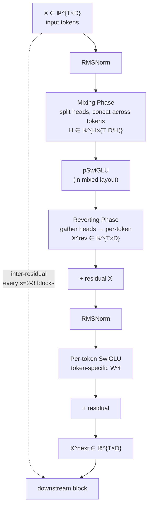

# TokenMixer-Large: Scaling Up Large Ranking Models in Industrial Recommenders

*Yuchen Jiang, Jie Zhu, Xintian Han, Hui Lu, Kunmin Bai, Mingyu Yang, Shikang Wu, Ruihao Zhang, Wenlin Zhao, Shipeng Bai, Sijin Zhou, Huizhi Yang, Tianyi Liu, Wenda Liu, Ziyan Gong, Haoran Ding, Zheng Chai, Deping Xie, Zhe Chen, Yuchao Zheng, Peng Xu — ByteDance, arXiv:2602.06563 (2026)*

| Dimension | Prior State | This Paper | Key Result |
|-----------|------------|------------|------------|
| Architecture at scale | RankMixer (TokenMixer) saturates ~567M, constrained by dimension-mismatch residuals | Mixing-and-Reverting + inter-layer residuals enable stable depth at 7B–15B | +0.10% ΔAUC vs RankMixer at 500M (Table 3) |
| Sparse MoE routing | Global sequence-level MoE (Switch Transformer style) | Per-token expert assignment, "sparse train, sparse infer" | 4B SP-MoE (2.3B active) matches dense 4B at 50.7% FLOPs (15.1T vs 29.8T) |
| Scaling law | Scaling laws studied for LLMs; unexplored for ranking | Offline scaling curves to 15B across three Douyin verticals | Consistent log-linear AUC gain to 15B; balanced width/depth/factor expansion required |
| Production GMV | Prior RankMixer baseline | TokenMixer-Large deployed to hundreds of millions of users | **+2.98% per-capita preview payment GMV**, +1.66% orders (e-commerce) |
| Compute efficiency | MFU ~baseline; no FP8 in ranking | FP8 quantization + custom MoE kernels + 4-way Token Parallel | 1.7× serving speedup (FP8); 29.2% training throughput gain (Token Parallel) |
| Feed recommendation | Prior baseline | 15B model on Feed Ads | +2.0% ADSS; low-active users +1.74% active days, +3.64% watch duration |

## Relations

**Builds on:** [[papers/rankmixer/rankmixer|RankMixer]], MLP-Mixer *(no note yet)*, Switch Transformers *(no note yet)*
**Extended by:** — none yet
**Concepts used:** [[concepts/mixture-of-experts/note|Mixture of Experts]], [[concepts/ml-theory/power-law-scaling|Neural Scaling Laws]]

## Table of Contents

1. [[#1. Background: RankMixer and the Limits of 1B-Scale Ranking|Background: RankMixer and the Limits of 1B-Scale Ranking]]
   - [[#1.1 The RankMixer Block|The RankMixer Block]]
   - [[#1.2 Why RankMixer Stalls at Scale|Why RankMixer Stalls at Scale]]
2. [[#2. Architecture Innovations|Architecture Innovations]]
   - [[#2.1 Tokenization|Tokenization]]
   - [[#2.2 Mixing-and-Reverting Operation|Mixing-and-Reverting Operation]]
   - [[#2.3 Per-token SwiGLU|Per-token SwiGLU]]
   - [[#2.4 Residuals and Normalization|Residuals and Normalization]]
   - [[#2.5 Inter-Residual and Auxiliary Loss|Inter-Residual and Auxiliary Loss]]
   - [[#2.6 Block Architecture Diagram|Block Architecture Diagram]]
3. [[#3. Sparse Per-Token MoE|Sparse Per-Token MoE]]
   - [[#3.1 Formulation|Formulation]]
   - [[#3.2 First Enlarge, Then Sparsify|First Enlarge, Then Sparsify]]
   - [[#3.3 Shared Expert|Shared Expert]]
   - [[#3.4 Gate Value Scaling|Gate Value Scaling]]
   - [[#3.5 Down-Matrix Small Initialization|Down-Matrix Small Initialization]]
4. [[#4. Scaling to 7B–15B|Scaling to 7B–15B]]
   - [[#4.1 Offline Scaling Curves|Offline Scaling Curves]]
   - [[#4.2 Data Hunger at Scale|Data Hunger at Scale]]
   - [[#4.3 DCN Diminishing Returns|DCN Diminishing Returns]]
5. [[#5. Training and Serving Optimizations|Training and Serving Optimizations]]
   - [[#5.1 Custom MoE Operators|Custom MoE Operators]]
   - [[#5.2 FP8 Quantization|FP8 Quantization]]
   - [[#5.3 Token Parallel Distributed Training|Token Parallel Distributed Training]]
6. [[#6. Online Experiments|Online Experiments]]
   - [[#6.1 Business Metrics|Business Metrics]]
   - [[#6.2 Feed Recommendation Breakdown|Feed Recommendation Breakdown]]
7. [[#7. Ablation Studies|Ablation Studies]]
8. [[#8. Discussion and Limitations|Discussion and Limitations]]
9. [[#References|References]]

---

## 1. Background: RankMixer and the Limits of 1B-Scale Ranking

🏛️ Industrial ranking models must process hundreds of heterogeneous sparse features (user history, context, item attributes) and return calibrated scores at latency budgets under 10 ms. The dominant paradigm — *DLRM*-style MLP stacks with cross-network modules (DCN V2, DHEN) — scales poorly past a few hundred million parameters because cross-network FLOPs grow quadratically with depth and width.

*RankMixer* (TokenMixer) departed from this paradigm by reframing ranking as a token-mixing problem, taking inspiration from MLP-Mixer. Features are grouped into semantic *tokens*, and a token-mixing linear layer operates across the token dimension rather than the feature dimension, yielding $O(T \cdot D)$ mixing cost instead of $O(D^2)$.

### 1.1 The RankMixer Block

Let the input be $\mathbf{X} \in \mathbb{R}^{T \times D}$, where $T$ is the number of semantic tokens and $D$ is the per-token embedding dimension. RankMixer splits $\mathbf{X}$ into $H$ heads along the $D$ axis:

$$\text{split}(\mathbf{X}) = [\ldots, [x_t^{(0)}, \ldots, x_t^{(H)}], \ldots] \in \mathbb{R}^{T \times H \times (D/H)}$$

Each head $h$ then concatenates across all tokens to form a mixed representation:

$$H_h = \text{concat}[x_1^{(h)}, x_2^{(h)}, \ldots, x_T^{(h)}] \in \mathbb{R}^{T \cdot D/H}$$

The full mixing matrix is assembled as:

$$\mathbf{H} = \text{concat}[H_1, \ldots, H_H] \in \mathbb{R}^{H \times (T \cdot D/H)}$$

A position-wise SwiGLU (pSwiGLU) with residual then yields:

$$\mathbf{H}^{\text{next}} = \text{Norm}\bigl(\text{pSwiGLU}(\mathbf{H}) + \mathbf{H}\bigr) \in \mathbb{R}^{H \times (T \cdot D/H)}$$

> [!WARNING] Dimension mismatch in RankMixer residuals
> After mixing, the shape of $\mathbf{H}$ is $\mathbb{R}^{H \times (T \cdot D/H)}$, which is *not* the same as the input $\mathbf{X} \in \mathbb{R}^{T \times D}$ even though they contain the same number of scalars. A reshape is required before any residual connection back to $\mathbf{X}$. At shallow depths this is a non-issue; at 50+ layers the mismatch disrupts gradient flow and blocks standard pre-norm designs.

### 1.2 Why RankMixer Stalls at Scale

The paper identifies three architectural failure modes that appear when naively scaling RankMixer past ~1B parameters:

1. **Dimension mismatch** — the mixing output $\mathbf{H}$ lives in a reorganized layout; any direct residual to $\mathbf{X}$ requires a reshape that breaks pre-norm symmetry and degrades gradient magnitude at depth.
2. **Gradient vanishing at depth** — without skip connections spanning multiple blocks, gradients to early layers become vanishingly small as depth grows beyond ~20 blocks.
3. **Uniform dense FFN** — the per-token SwiGLU treats all tokens identically; at 7B+ parameters, this wastes capacity by forcing every expert computation to fire for every token, inflating both FLOPs and memory bandwidth.

**TokenMixer-Large addresses each failure mode systematically: Mixing-and-Reverting for (1), inter-residual connections for (2), and Sparse Per-token MoE for (3).**

---

## 2. Architecture Innovations

🏗️

### 2.1 Tokenization

The overall input pipeline proceeds as follows. Each raw categorical feature $F_i$ is embedded into a dense vector:

$$e_i = \text{Embedding}(F_i, d_i) \in \mathbb{R}^{d_i}$$

Features are then organized into $T-1$ semantic groups $G_0, \ldots, G_{T-2}$ (e.g., "user behavior," "item content," "context"). Each group is projected to a uniform dimension $D$ by a group-specific MLP:

$$X_i = \text{MLP}_i\!\bigl(\text{concat}[e_l, \ldots, e_m]\bigr), \quad e_l, \ldots, e_m \in G_i \quad \in \mathbb{R}^D$$

A *global token* $X_G$ aggregates cross-group information by concatenating one representative vector from each group and passing it through a shared MLP:

$$X_G = \text{MLP}_g\!\bigl(\text{concat}[G_1, \ldots, G_{T-1}]\bigr) \in \mathbb{R}^D$$

The full token matrix fed to the backbone is:

$$\mathbf{X} = \text{concat}[X_G, X_0, \ldots, X_{T-1}] \in \mathbb{R}^{T \times D}$$

> [!NOTE] Global token role
> The global token plays a role analogous to the `[CLS]` token in BERT — it provides a summary position that accumulates cross-feature context through all subsequent mixing layers, and its output is used for the final score prediction.

### 2.2 Mixing-and-Reverting Operation

The central innovation is a *two-phase symmetric transform* that resolves the dimension-mismatch problem while preserving cross-token interaction.

**Definition (Mixing Phase).** Given $\mathbf{X} \in \mathbb{R}^{T \times D}$, split each token vector $x_t \in \mathbb{R}^D$ into $H$ heads of dimension $D/H$. Then, for each head $h$, concatenate the $h$-th slice from every token:

$$\text{Mix}: \quad H_h = \text{concat}[x_1^{(h)}, x_2^{(h)}, \ldots, x_T^{(h)}] \in \mathbb{R}^{T \cdot D/H}, \quad h = 1, \ldots, H$$

Stacking heads gives $\mathbf{H} = \text{stack}[H_1, \ldots, H_H] \in \mathbb{R}^{H \times (T \cdot D/H)}$. A pSwiGLU is applied in this mixed layout to produce $\mathbf{H}' \in \mathbb{R}^{H \times (T \cdot D/H)}$.

**Definition (Reverting Phase).** The reverting operation is the inverse permutation of mixing: for each position $t$, gather slice $h$ from $H_h'$ to reconstruct the token:

$$\text{Revert}: \quad X_t^{\text{rev}} = \text{concat}[x'^{(1)}_t, x'^{(2)}_t, \ldots, x'^{(H)}_t] \in \mathbb{R}^D$$

This yields $\mathbf{X}^{\text{rev}} \in \mathbb{R}^{T \times D}$ — exactly the same shape as the input $\mathbf{X}$.

**Definition (TokenMixer-Large Block: Mixing-and-Reverting output).**

$$\mathbf{X}^{\text{next}} = \text{Norm}\!\bigl(\text{pSwiGLU}(\mathbf{X}^{\text{rev}}) + \mathbf{X}\bigr) \in \mathbb{R}^{T \times D}$$

The residual $+ \mathbf{X}$ is now dimensionally consistent. *Reverting is not merely a reshape* — it explicitly recombines mixed-head representations back into per-token vectors, allowing the subsequent pSwiGLU to operate in the original token-feature space rather than the scrambled head-major layout.

> [!INFO] Why reverting matters for deep models
> In a pre-norm transformer, the residual stream maintains a fixed shape $\mathbb{R}^{T \times D}$ throughout all layers. The reverting step restores this invariant after each mixing operation, enabling stable pre-norm + RMSNorm stacks at 50+ layers without any shape-changing operations interrupting the residual path.

### 2.3 Per-token SwiGLU

The standard SwiGLU used in transformers employs weight matrices shared across all token positions. TokenMixer-Large uses *per-token SwiGLU* (pSwiGLU), where each token position $t$ has its own projection matrices:

$$\text{pSwiGLU}(\cdot) = FC_{\text{down}}\!\bigl(\text{Swish}(FC_{\text{gate}}(\cdot)) \odot FC_{\text{up}}(\cdot)\bigr)$$

where the projections are token-specific:

$$FC_i(\mathbf{x}) = W_i^t x_t + b_i^t, \quad i \in \{\text{up}, \text{gate}, \text{down}\}$$

with $\{W_{\text{up}}^t, W_{\text{gate}}^t\} \in \mathbb{R}^{D \times nD}$ and $W_{\text{down}}^t \in \mathbb{R}^{nD \times D}$ for expansion factor $n$.

*Per-token weights* allow different semantic groups (e.g., "user behavior" vs. "item content") to learn heterogeneous transformation patterns, as opposed to a single shared FFN that must generalize across all feature types.

> [!EXAMPLE] Ablation evidence
> Replacing pSwiGLU with a standard shared SwiGLU costs −0.21% AUC; replacing it with a per-token FFN (ReLU, no gating) costs −0.10% AUC. The per-token gating mechanism contributes more than the token-specificity alone.

### 2.4 Residuals and Normalization

The paper adopts *Pre-Norm* with RMSNorm throughout, consistent with modern LLM practice. Every sub-layer (Mixing-and-Reverting and pSwiGLU) follows the pattern:

$$\text{Output} = \text{SubLayer}(\text{RMSNorm}(\mathbf{X})) + \mathbf{X}$$

### 2.5 Inter-Residual and Auxiliary Loss

For networks beyond ~20 blocks, standard residuals are insufficient to propagate gradients to early layers. TokenMixer-Large introduces *inter-residual connections*: skip connections that bypass 2–3 consecutive blocks.

**Definition (Inter-Residual).** Let $\mathbf{X}^{(\ell)}$ denote the output of block $\ell$. An inter-residual with stride $s$ adds:

$$\mathbf{X}^{(\ell+s)} \leftarrow \mathbf{X}^{(\ell+s)} + \mathbf{X}^{(\ell)}$$

at regular intervals $s \in \{2, 3\}$ throughout the network.

Additionally, an *auxiliary loss* is applied at intermediate block outputs: the logit from block $\ell$ (using the global token embedding at depth $\ell$) is jointly supervised with the final output. Formally, if $\hat{y}^{(\ell)}$ is the score from depth $\ell$ and $y$ is the target label:

$$\mathcal{L}_{\text{total}} = \mathcal{L}_{\text{CE}}(y, \hat{y}^{(L)}) + \lambda \sum_{\ell \in S} \mathcal{L}_{\text{CE}}(y, \hat{y}^{(\ell)})$$

where $S$ is the set of auxiliary supervision depths and $\lambda$ is a weighting hyperparameter.

> [!TIP]- Why auxiliary loss helps (intuition)
> At depth 50+, the gradient of $\mathcal{L}_{\text{CE}}$ with respect to block 5's parameters has been attenuated by ~45 Jacobian multiplications. The auxiliary loss at block $\ell$ provides a *direct* gradient signal to all blocks $\leq \ell$, bypassing the deep chain. This is analogous to GoogLeNet's auxiliary classifiers and the deep supervision technique in segmentation networks.

Ablation: removing both inter-residuals and auxiliary loss costs −0.04% AUC at the 4B scale; removing the standard within-block residual costs −0.15% AUC.

### 2.6 Block Architecture Diagram

> [!QUESTION] Exercise 1: Mixing Permutation as a Matrix
> *This problem makes precise that mixing-and-reverting is an exact permutation, not a learned projection.*
>
> > **Prerequisites:** [[#2.2 Mixing-and-Reverting Operation|Mixing-and-Reverting Operation]]
>
> Let $\mathbf{X} \in \mathbb{R}^{T \times D}$ with $H$ heads. Write the mixing operation $\mathbf{H} = \text{Mix}(\mathbf{X})$ explicitly as a matrix multiplication $\mathbf{H} = P \cdot \text{vec}(\mathbf{X})$ for a permutation matrix $P$. Then show that the reverting operation satisfies $\text{Revert}(\mathbf{H}) = P^\top \mathbf{H}$. Conclude that $\text{Revert}(\text{Mix}(\mathbf{X})) = \mathbf{X}$ exactly, i.e., there is no information loss from the permutation itself.

> [!TIP]- Solution to Exercise 1
> **Key insight:** Mixing concatenates the $h$-th head slice of each token; reverting interleaves them back. Both operations are index permutations on the flattened vector $\text{vec}(\mathbf{X})$.
>
> **Sketch:** Index $(t, d)$ in $\mathbf{X}$ (where $d \in [D]$) maps to head $h = \lfloor d \cdot H / D \rfloor$ and within-head position $d' = d \bmod (D/H)$. In $\mathbf{H}$, this scalar lives at position $(h, t \cdot D/H + d')$. This is a bijection on $\{1, \ldots, TD\}$, hence a permutation matrix $P$. The reverting just applies the inverse permutation $P^{-1} = P^\top$ (since $P$ is a permutation matrix). Therefore $P^\top P \cdot \text{vec}(\mathbf{X}) = \text{vec}(\mathbf{X})$, so $\text{Revert}(\text{Mix}(\mathbf{X})) = \mathbf{X}$ exactly.

---

## 3. Sparse Per-Token MoE

⚡ At 7B–15B parameters, it becomes infeasible to activate all parameters for every token at every layer. TokenMixer-Large introduces *Sparse Per-token MoE* (SP-MoE), a token-level routing mechanism that differs qualitatively from prior MoE designs in recommendation systems.

### 3.1 Formulation

Let there be $E$ experts, each implemented as a scaled-down pSwiGLU. For a token $x_t$, a gating network computes $E$ scores and selects the top-$k$ experts:

$$\text{S-P MoE}(x_t) = \sum_{j=1}^{k} g_j(x_t) \cdot \text{Expert}_j(x_t)$$

where $g_j(x_t) = \text{softmax}(\text{top-}k(W_g x_t))_j$. Each expert $j$ has weight matrices $\{W_{\text{up}}^{t,j}, W_{\text{gate}}^{t,j}\} \in \mathbb{R}^{D \times nD/E}$ and $W_{\text{down}}^{t,j} \in \mathbb{R}^{nD/E \times D}$, so that each expert is $1/E$ the width of the corresponding dense pSwiGLU.

*Per-token routing* means each token independently selects its $k$ experts. This contrasts with *sequence-level* MoE (Switch Transformer style), which routes entire sequence positions identically across a batch — a sensible design for autoregressive LLMs but suboptimal for ranking, where different semantic token groups (user vs. item vs. context) should leverage different experts.

> [!NOTE] Contrast with Switch Transformer
> Switch Transformer uses top-1 routing per token with a capacity factor $C$ that limits how many tokens each expert can process. In the ranking context, sequence length $T$ is small (~10–50 tokens), so capacity constraints are less severe. SP-MoE uses top-$k$ with $k \geq 2$ and a shared expert, and does not apply a hard capacity cap.

### 3.2 First Enlarge, Then Sparsify

The strategy is to first train (or initialize from) a dense model, then introduce sparsity by splitting the pSwiGLU into $E$ experts and routing with ratio $1:E$ (i.e., $k=1$ out of $E$ routable experts, plus one shared expert). This is termed *sparse train, sparse infer* — the sparsity pattern is fixed at training time so that inference does not require any special "dense-to-sparse" conversion.

For a $1:2$ sparsity model (1 routed expert out of 2 total, plus shared expert), the active FLOPs drop from the dense case by approximately $2\times$ while the parameter count doubles relative to a single-expert baseline.

> [!EXAMPLE] FLOPs comparison (Table 2)
> TokenMixer-Large 4B dense: 29.8T FLOPs/batch.
> TokenMixer-Large 4B SP-MoE ($1:2$ sparsity, 2.3B active): 15.1T FLOPs/batch.
> AUC: both achieve +1.14% vs the 500M baseline, i.e., **the SP-MoE halves inference cost with no AUC penalty.**

### 3.3 Shared Expert

One expert is designated as a *shared expert* that always fires, regardless of the gating decision:

$$\text{S-P MoE}(x_t) = \sum_{i=1}^{k-1} g_i(x_t) \cdot \text{Expert}_i(x_t) + \text{SharedExpert}(x_t)$$

The shared expert acts as a "default path" that ensures all tokens receive at least one full transformation, preventing catastrophic forgetting of common patterns when the router is uncertain. Removing it costs −0.02% AUC.

### 3.4 Gate Value Scaling

A scalar *gate value scaling* hyperparameter $\alpha$ is applied to the gated sum:

$$\text{S-P MoE}(x_t) = \alpha \cdot \sum_{i=1}^{k-1} g_i(x_t) \cdot \text{Expert}_i(x_t) + \text{SharedExpert}(x_t)$$

The value of $\alpha$ is set inversely proportional to the sparsity ratio: $\alpha = 2$ for $1:2$ sparsity, $\alpha = 4$ for $1:4$ sparsity. *Intuitively,* without this correction, the softmax gate values sum to 1 over $k-1$ selected experts, so the magnitude of the routed contribution decreases as $k$ shrinks — $\alpha$ compensates by restoring the expected activation scale. Removing $\alpha$ costs −0.03% AUC.

### 3.5 Down-Matrix Small Initialization

The down-projection matrix $W_{\text{down}}^{t,j}$ of each expert pSwiGLU is initialized with standard deviation $0.01$ (versus the default $1.0$). This forces the expert outputs to be near-zero at initialization, so the model starts close to a passthrough (identity-like residual) and learns expert specialization gradually.

*This technique is analogous to small-init residual branches in NTK theory*, where initializing residual branches near zero ensures the network behaves like a shallower model early in training when gradient signals are most informative. Removing it costs −0.03% AUC.

> [!QUESTION] Exercise 2: Load Balancing in SP-MoE
> *This problem derives why uniform routing is a local optimum of the auxiliary load balancing objective.*
>
> > **Prerequisites:** [[#3.1 Formulation|Formulation]]
>
> Consider $E$ routable experts and $B$ tokens per batch. Define the load of expert $j$ as $\ell_j = \sum_{t=1}^B \mathbf{1}[\text{token } t \text{ routes to expert } j]$ and the average routing probability as $p_j = \frac{1}{B}\sum_{t=1}^B g_j(x_t)$ (the soft routing probability before top-$k$ discretization). The standard auxiliary loss is $\mathcal{L}_{\text{bal}} = \alpha_{\text{bal}} \cdot E \sum_{j=1}^E \ell_j \cdot p_j$. Show that this loss is minimized when $\ell_j = B/E$ for all $j$ (perfectly uniform discrete routing), and explain why the product $\ell_j \cdot p_j$ is a tighter surrogate than $\ell_j^2$ for penalizing imbalance.

> [!TIP]- Solution to Exercise 2
> **Key insight:** The product form $\ell_j \cdot p_j$ is differentiable in $p_j$ (unlike $\ell_j$, which is a discrete indicator), so its gradient can be back-propagated to the gating network.
>
> **Sketch:** By AM-GM, $\sum_j \ell_j p_j \geq E \cdot \left(\prod_j \ell_j p_j\right)^{1/E}$. When $\sum_j \ell_j = B$ (fixed total tokens) and $\sum_j p_j = 1$ (softmax normalization), the product is maximized (and thus the objective is "less dominated" by the balance penalty) when $\ell_j = B/E$ and $p_j = 1/E$ for all $j$, because at that point the sum $\sum_j \ell_j p_j = B/E$ is minimized subject to these constraints — any deviation creates a non-uniform product that is strictly larger. The product form $\ell_j \cdot p_j$ couples the discrete routing ($\ell_j$) with the differentiable gate ($p_j$), enabling gradient flow; $\ell_j^2$ alone has no gradient w.r.t. the gating network parameters.

---

## 4. Scaling to 7B–15B

📈

### 4.1 Offline Scaling Curves

The paper presents scaling law curves for three Douyin scenarios, fitting a log-linear relationship between parameter count $N$ and AUC gain $\Delta\text{AUC}$:

$$\Delta\text{AUC}(N) \approx a \cdot \log N + b$$

Key offline results (Table 2):

| Model | ΔAUC vs DLRM-MLP-500M | Params | FLOPs/Batch |
|-------|----------------------|--------|-------------|
| DLRM-MLP-500M | 0.00% (baseline) | 499M | 125.1T |
| HiFormer | +0.44% | 570M | 28.8T |
| DCN V2 | +0.49% | 502M | 125.8T |
| DHEN | +0.63% | 415M | 103.4T |
| AutoInt | +0.75% | 549M | 138.6T |
| Wukong | +0.76% | 513M | 4.6T |
| Group Transformer | +0.81% | 550M | 4.5T |
| FAT | +0.82% | 551M | 4.59T |
| RankMixer (TokenMixer) | +0.84% | 567M | 4.6T |
| **TokenMixer-Large 500M** | **+0.94%** | 501M | 4.2T |
| TokenMixer-Large 4B | +1.14% | 4.6B | 29.8T |
| TokenMixer-Large 7B | +1.20% | 7.6B | 49.0T |
| TokenMixer-Large 4B SP-MoE | +1.14% | 2.3B active | 15.1T |

A key finding: **beyond 1B parameters, scaling requires balanced expansion across width $D$, depth $L$, and expansion factor $n$ simultaneously** — scaling any single dimension alone yields diminishing returns. This echoes the Chinchilla finding that compute-optimal scaling balances model size and data, but applied to architecture dimensions rather than size vs. data.

The paper further notes that *Surprisingly,* DCN-style cross-network components become less valuable at larger scales:

| Params | DCN Gain |
|--------|----------|
| 150M | +0.09% |
| 500M | +0.04% |
| 700M | +0.00% |

*This suggests the token-mixing backbone subsumes the cross-feature interaction function that DCN was designed to provide, making DCN redundant at scale.*

### 4.2 Data Hunger at Scale

Scaling the parameter count forces longer training horizons for convergence (Table 4, Douyin Live Streaming):

| Params | Convergence Training Days | ΔUAUC |
|--------|--------------------------|-------|
| 30M | baseline | — |
| 90M | 14 days | +0.94% |
| 500M | 30 days | +0.62% |
| 2.3B | 30 days | +0.41% |
| 2.3B | 60 days | +0.70% |

The 2.3B model trained for 30 days underperforms the 500M model — it simply has not seen enough data to fill its capacity. At 60 days, it recovers and exceeds the 500M baseline. **This implies a strict data-scaling requirement: larger models require proportionally more training data, consistent with Chinchilla-style scaling laws.**

### 4.3 DCN Diminishing Returns

> [!WARNING] Architectural co-design implication
> The vanishing DCN gain at 700M+ parameters is not merely an ablation curiosity. It indicates that the cross-feature interaction capability of explicit polynomial cross networks is *already captured* by the depth and width of the token-mixing stack at scale. Including DCN at large scale adds FLOPs (125.8T vs 4.6T for Wukong/TokenMixer at 500M) without AUC benefit.

> [!QUESTION] Exercise 3: Scaling Exponent Estimation
> *This problem estimates the effective scaling exponent from the offline AUC data, and connects it to power-law scaling theory.*
>
> > **Prerequisites:** [[#4.1 Offline Scaling Curves|Offline Scaling Curves]], [[concepts/ml-theory/power-law-scaling|Neural Scaling Laws]]
>
> Using the three data points (TokenMixer-Large 500M: +0.94%, 4B: +1.14%, 7B: +1.20%) as $\Delta\text{AUC}(N)$ vs $N$ (in billions), fit a power law $\Delta\text{AUC}(N) = c \cdot N^\alpha$ by taking logarithms. Estimate $\alpha$. Is the observed exponent consistent with the $\alpha \approx 0.1$ scaling exponent commonly reported for language model loss? Discuss what a smaller $\alpha$ would imply about the marginal value of additional parameters in recommendation ranking.

> [!TIP]- Solution to Exercise 3
> **Key insight:** The gains are compressing logarithmically, implying a small but positive exponent.
>
> **Sketch:** Taking logs: $\log(0.94) \approx -0.062$, $\log(1.14) \approx 0.131$, $\log(1.20) \approx 0.182$ (all vs baseline); $\log(0.5) \approx -0.693$, $\log(4) \approx 1.386$, $\log(7) \approx 1.946$. Linear regression gives slope $\alpha \approx (0.182 - (-0.062)) / (1.946 - (-0.693)) \approx 0.244 / 2.64 \approx 0.09$. This is close to the $\alpha \approx 0.07$–$0.1$ range for LLM scaling. A smaller $\alpha$ implies steeply diminishing returns — doubling parameters yields only a $2^\alpha - 1 \approx 6\%$ relative gain in $\Delta\text{AUC}$, justifying the focus on compute-efficient SP-MoE rather than naive dense scaling.

---

## 5. Training and Serving Optimizations

🔧

### 5.1 Custom MoE Operators

The three dominant operators in MoE execution are measured in Table 1:

| Operator | Train Time (ms) | Train % | Serving Time (ms) | Serving % | Bottleneck |
|----------|----------------|---------|------------------|-----------|------------|
| MoEGroupedFFN | 136.77 | 89.18% | 7.43 | 98.35% | Compute (train), Memory (serve) |
| MoEPermute | 6.32 | 4.12% | 0.06 | 0.75% | Memory |
| MoEUnpermute | 10.27 | 6.69% | 0.07 | 0.90% | Memory |

The permute and unpermute operations reorder token activations so that all tokens routed to expert $j$ are contiguous in memory before the GroupedFFN kernel executes — this is essential for batched matrix multiplication efficiency. The GroupedFFN dominates at both training (89%) and serving (98%), making it the target for FP8 quantization.

### 5.2 FP8 Quantization

The MoEGroupedFFN is quantized to FP8 (E4M3 format) for serving. FP8 provides:
- 2× memory bandwidth reduction vs FP16
- Hardware-accelerated matrix multiplication on H100 GPUs

The paper reports a **1.7× serving speedup** from FP8 quantization applied to the MoE kernel, with negligible AUC degradation.

> [!INFO] Why FP8 is safe here
> The GroupedFFN at serving is memory-bandwidth bound (not compute bound, per Table 1). FP8 quantization directly reduces the bytes transferred per matrix multiplication, unlocking the memory bandwidth bottleneck. Compute-bound operations (e.g., attention) would benefit less from FP8 since they are already arithmetic-limited.

### 5.3 Token Parallel Distributed Training

Standard data-parallel training replicates the model and partitions the batch. For per-token weight models (pSwiGLU), token parallelism partitions the $T$ tokens across $P$ GPUs, keeping the model parameters on each device while splitting the sequence:

- Each GPU processes $T/P$ tokens.
- After the per-token FFN, an all-reduce aggregates results across the token dimension.

A 4-way token parallel configuration yields:
- **29.2% throughput improvement** (raw, without communication overlap)
- **96.6% throughput improvement** with communication-computation overlap (pipeline the all-reduce behind the next layer's compute)
- MFU improved to **60%** in the advertising backbone

---

## 6. Online Experiments

🚀

### 6.1 Business Metrics

TokenMixer-Large was deployed across three major Douyin scenarios. All results are from long-running A/B tests with statistical significance confirmed:

| Scenario | Model Scale | ΔAUC | Business Metric | Lift |
|----------|------------|------|-----------------|------|
| Feed Ads | 15B | +0.35% | ADSS | +2.0% |
| E-Commerce | 7B | +0.51% | Orders | +1.66% |
| E-Commerce | 7B | +0.51% | Per-capita preview GMV | **+2.98%** |
| Live Streaming | 4B | +0.70% ΔUAUC | Pay revenue | +1.4% |

**The +2.98% GMV gain on e-commerce is the headline result**, representing one of the largest single-model improvements reported in recent industrial recommender papers.

### 6.2 Feed Recommendation Breakdown

The feed recommendation A/B test (Table 8) disaggregates gains by user activity tier, revealing a pronounced heterogeneity:

| User Segment | Active Day Lift | Watch Duration Lift | Like Lift |
|--------------|----------------|---------------------|-----------|
| Low-active | +1.74% | +3.64% | +8.16% |
| Middle-active | +0.71% | +1.53% | +2.58% |
| High-active | +0.14% | +0.63% | +1.83% |

> [!NOTE] Cold-start benefit
> Low-active users benefit most — by a margin of ~12× vs high-active users on like rate. This is consistent with the hypothesis that large model capacity helps most when user histories are sparse: the model can draw on richer cross-feature and cross-user patterns rather than relying on dense personal history signals that cold users lack.

> [!QUESTION] Exercise 4: Statistical Power for Online Experiments
> *This problem estimates the minimum detectable effect for the reported business metric lifts.*
>
> > **Prerequisites:** [[#6.1 Business Metrics|Business Metrics]]
>
> Suppose the e-commerce A/B test assigns 50%/50% traffic split with $n = 10^7$ users per arm. Assume the per-user GMV follows a log-normal distribution with coefficient of variation (CV = std/mean) of 2.0, which is typical for e-commerce. Using a two-sample $t$-test at $\alpha = 0.05$ two-sided, $\beta = 0.20$ (80% power), derive the minimum detectable effect (MDE) as a percentage lift in mean GMV. Is the +2.98% GMV lift detectable at this sample size?

> [!TIP]- Solution to Exercise 4
> **Key insight:** The MDE for a relative lift in mean is $\text{MDE} = (z_{\alpha/2} + z_\beta) \cdot \text{CV} / \sqrt{n/2}$.
>
> **Sketch:** For $z_{0.025} = 1.96$, $z_{0.20} = 0.84$: $\text{MDE} = (1.96 + 0.84) \cdot 2.0 / \sqrt{5 \times 10^6} = 2.80 \cdot 2.0 / 2236 \approx 0.0025 = 0.25\%$. The reported +2.98% lift is approximately $12\times$ the MDE, providing very high statistical power. At $10^7$ users per arm and CV=2, even a 0.25% relative lift is detectable — the 2.98% result is not borderline.

---

## 7. Ablation Studies

🔬 Two ablation tables characterize component contributions at the 4B scale.

**TokenMixer-Large Block ablations (Table 5):**

| Ablation | ΔAUC |
|----------|------|
| w/o Global Token | −0.02% |
| **w/o Mixing & Reverting** | **−0.27%** |
| w/o Residual | −0.15% |
| w/o Inter-Residual & AuxLoss | −0.04% |
| pSwiGLU → SwiGLU (shared) | −0.21% |
| pSwiGLU → Per-token FFN | −0.10% |

**Sparse Per-token MoE ablations (Table 6):**

| Ablation | ΔAUC | ΔParams | ΔFLOPs |
|----------|------|---------|--------|
| w/o Shared Expert | −0.02% | 0% | 0% |
| w/o Gate Value Scaling | −0.03% | 0% | 0% |
| w/o Down-Matrix Small Init | −0.03% | 0% | 0% |
| SP-MoE → Sparse MoE (global) | −0.10% | 0% | 0% |

The last row is the most informative: replacing per-token routing with global (sequence-level) MoE routing costs −0.10% AUC at zero parameter or FLOPs overhead. **This confirms that per-token routing is qualitatively more expressive than global routing for the heterogeneous-feature setting of recommendation ranking.**

---

## 8. Discussion and Limitations

💬

**Pure model design.** A recurring theme is the elimination of *fragmented operators* — ad-hoc task-specific components accumulated over years of system iteration. TokenMixer-Large argues that a single well-designed block (Mixing-and-Reverting + pSwiGLU + SP-MoE) subsumes the functionality of these operators while being easier to scale, profile, and optimize.

**Scaling to 15B is not free.** Three practical constraints bound continued scaling:

1. *Data constraint.* The 2.3B model requires ≥60 days of Douyin training data to converge; scaling to 15B implies even longer horizons or faster data pipelines.
2. *Latency constraint.* Serving a 15B model within a 10 ms SLA requires careful FP8 quantization, model parallelism, and hardware-specific kernel tuning. The paper reports these are handled, but the engineering burden is substantial.
3. *Scenario-specific saturation.* The e-commerce scenario saturates at 7B; live streaming at 4B. Continued scaling should be driven by scenario-specific offline scaling laws, not a global parameter target.

**Limitations:**

- *The paper does not report retrieval-stage results.* TokenMixer-Large is a ranking model; whether the architectural ideas transfer to embedding-based retrieval (ANN search) is unexplored.
- *The load balancing analysis is cursory.* Figures 7a–7b show expert activation distributions but do not quantify routing collapse or expert specialization.
- *No ablation on head count $H$.* The number of mixing heads $H$ is a critical hyperparameter for the Mixing-and-Reverting operation, but no sensitivity analysis is provided.

---

## References

| Reference Name | Brief Summary | Link to Reference |
|----------------|--------------|------------------|
| [TokenMixer-Large (Jiang et al., 2026)](https://arxiv.org/abs/2602.06563) | Primary paper; introduces Mixing-and-Reverting, SP-MoE, and scales ranking to 7B–15B | https://arxiv.org/abs/2602.06563 |
| [RankMixer / TokenMixer (Zhu et al., 2024)](https://arxiv.org/abs/2408.16205) | Original token-mixing ranking architecture; predecessor to TokenMixer-Large | https://arxiv.org/abs/2408.16205 |
| [MLP-Mixer (Tolstikhin et al., 2021)](https://arxiv.org/abs/2105.01601) | Vision MLP-Mixer; introduced token-mixing and channel-mixing as an attention-free alternative | https://arxiv.org/abs/2105.01601 |
| [Switch Transformers (Fedus et al., 2022)](https://arxiv.org/abs/2101.03961) | Sparse MoE for LLMs with top-1 routing and capacity factors; motivates SP-MoE design choices | https://arxiv.org/abs/2101.03961 |
| [DLRM (Naumov et al., 2019)](https://arxiv.org/abs/1906.00091) | Facebook's deep learning recommendation model; baseline architecture for industrial ranking | https://arxiv.org/abs/1906.00091 |
| [DCN V2 (Wang et al., 2021)](https://arxiv.org/abs/2008.13535) | Deep & Cross Network V2; explicit polynomial cross-feature interactions; used as baseline | https://arxiv.org/abs/2008.13535 |
| [Wukong (Zhang et al., 2024)](https://arxiv.org/abs/2403.02545) | Scaling ranking models to 500M with efficient factorized blocks; direct competitor at 500M scale | https://arxiv.org/abs/2403.02545 |
| [Scaling Laws for NLMs (Kaplan et al., 2020)](https://arxiv.org/abs/2001.08361) | Chinchilla precursor; establishes power-law scaling of language model loss with N, D, C | https://arxiv.org/abs/2001.08361 |
| [Chinchilla (Hoffmann et al., 2022)](https://arxiv.org/abs/2203.15556) | Compute-optimal scaling laws; shows model size and data must scale together — directly relevant to §4.2 | https://arxiv.org/abs/2203.15556 |
| [DHEN (Zhang et al., 2022)](https://arxiv.org/abs/2203.11014) | Deep hierarchical ensemble network for ranking; 500M-scale baseline in Table 2 | https://arxiv.org/abs/2203.11014 |
| [DeepFM (Guo et al., 2017)](https://arxiv.org/abs/1703.04247) | Deep FM combining factorization machines with DNN; foundational ranking architecture | https://arxiv.org/abs/1703.04247 |
| [SwiGLU (Shazeer, 2020)](https://arxiv.org/abs/2002.05202) | Gated linear unit variant used as activation in TokenMixer-Large's FFN sub-layers | https://arxiv.org/abs/2002.05202 |
