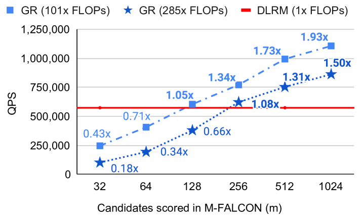
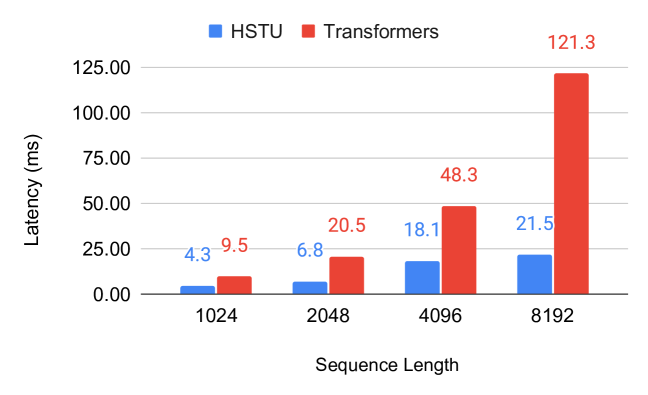
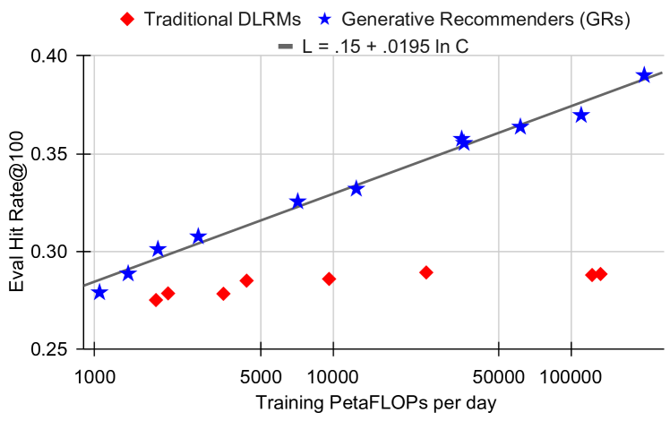

# Actions Speak Louder than Words: Trillion-Parameter Sequential Transducers for Generative Recommendations

Jiaqi Zhai, Lucy Liao, Xing Liu, Yueming Wang, Rui Li, Xuan Cao, Leon Gao, Zhaojie Gong, Fangda Gu, Michael He, Yinghai Lu, Yu Shi. Meta Platforms, Inc. arXiv 2402.17152, February 2024.

| Dimension | Prior State | This Paper |
|---|---|---|
| Recommendation paradigm | Impression-level DLRM: each (user, item) pair scored independently; heterogeneous feature engineering | Sequential transduction: user history as time series; single generative forward pass covers retrieval and ranking |
| Architecture | DLRMs with FM-like interactions over static features; Transformers unstable on industrial streaming data | HSTU: Transformer variant with pointwise attention (no softmax), temporal relative bias, and fused SiLU gating |
| Scale | DLRM plateau ~200B params; Transformer NaN loss on industrial data | 1.5 trillion parameters; stable training; scaling law across 3 orders of magnitude |
| Inference cost | Linear in candidates; no amortization across candidates | M-FALCON: O(n²d) amortized across $b_m$ candidates via modified attention masks |
| Training efficiency | Impression-level: O(N³d) complexity | Generative with stochastic length: O(N^α d), α ∈ (1,2]; 5.3–15.2× faster than FlashAttention2 |
| Online performance | Baselines | +12.4% engagement (ranking), +6.2% retrieval HR@100; deployed serving billions of users |

## Table of Contents

- [[#1. Motivation and Background|1. Motivation and Background]]
  - [[#1.1 Limitations of DLRM-Style Systems|1.1 Limitations of DLRM-Style Systems]]
  - [[#1.2 Why Standard Transformers Fail on Recommendation Data|1.2 Why Standard Transformers Fail on Recommendation Data]]
  - [[#1.3 The Generative Recommender Paradigm|1.3 The Generative Recommender Paradigm]]
- [[#2. Sequence Representation|2. Sequence Representation]]
  - [[#2.1 Unified Time Series|2.1 Unified Time Series]]
  - [[#2.2 Retrieval vs. Ranking Formulation|2.2 Retrieval vs. Ranking Formulation]]
- [[#3. HSTU Architecture|3. HSTU Architecture]]
  - [[#3.1 Sub-Layer 1: Pointwise Projection|3.1 Sub-Layer 1: Pointwise Projection]]
  - [[#3.2 Sub-Layer 2: Spatial Aggregation|3.2 Sub-Layer 2: Spatial Aggregation]]
  - [[#3.3 Sub-Layer 3: Pointwise Transformation|3.3 Sub-Layer 3: Pointwise Transformation]]
  - [[#3.4 Why Pointwise Attention Instead of Softmax|3.4 Why Pointwise Attention Instead of Softmax]]
  - [[#3.5 Temporal Relative Attention Bias|3.5 Temporal Relative Attention Bias]]
- [[#4. Computational Efficiency|4. Computational Efficiency]]
  - [[#4.1 Generative Training vs. Impression-Level Training|4.1 Generative Training vs. Impression-Level Training]]
  - [[#4.2 Stochastic Length Sparsity|4.2 Stochastic Length Sparsity]]
  - [[#4.3 M-FALCON: Inference Amortization|4.3 M-FALCON: Inference Amortization]]
  - [[#4.4 Memory Efficiency vs. Standard Transformers|4.4 Memory Efficiency vs. Standard Transformers]]
- [[#5. Scaling Laws|5. Scaling Laws]]
- [[#6. Experiments|6. Experiments]]
  - [[#6.1 Synthetic Validation: Dirichlet Process Data|6.1 Synthetic Validation: Dirichlet Process Data]]
  - [[#6.2 Public Benchmarks|6.2 Public Benchmarks]]
  - [[#6.3 Industrial Streaming Data|6.3 Industrial Streaming Data]]
  - [[#6.4 Online A/B Tests|6.4 Online A/B Tests]]
- [[#7. Relation to Wukong|7. Relation to Wukong]]
- [[#8. References|8. References]]

---

## 1. Motivation and Background

### 1.1 Limitations of DLRM-Style Systems

*Deep Learning Recommendation Models* (DLRMs) process each (user, item) impression independently: given a user context $u$ and candidate item $x$, they output $p(\text{click} \mid u, x)$. The pipeline requires:

1. Extensive *feature engineering*: hand-crafted numerical features (recency, click-through rates, session counts) in addition to raw categorical IDs.
2. *Impression-level training*: each example in the training batch is one (user, item, label) triple. For a user with $n_i$ historical interactions, scoring all items requires $n_i$ separate forward passes.
3. *Separate models* for retrieval and ranking: different architectures, training pipelines, and feature sets.

These choices introduce fundamental scalability barriers:
- Feature engineering is human-bottlenecked: numerical features capture only what engineers think to measure.
- Impression-level training complexity scales as $O(N^3 d)$ where $N = \max_i n_i$ is the maximum sequence length (shown in Section 4.1).
- Separate retrieval/ranking pipelines double infrastructure cost and prevent knowledge transfer between stages.

### 1.2 Why Standard Transformers Fail on Recommendation Data

The natural candidate for replacing DLRMs is the Transformer, which already models sequential data via self-attention. However, naively applying Transformers to industrial recommendation data fails for three reasons:

1. **Non-stationarity.** User interests shift over time; the item vocabulary changes continuously (new items appear, old ones disappear). Standard Transformers assume a fixed vocabulary and stationary distribution. The non-stationary vocabulary makes softmax attention counterproductive (see Section 3.4).

2. **High cardinality.** Recommendation vocabularies contain billions of items. Unlike NLP (50K tokens), the embedding matrix alone can exceed terabytes.

3. **Numerical instability.** On industrial streaming data with variable sequence lengths and non-stationary distributions, Transformers produce NaN loss during training (Table 4 shows this empirically — Transformers fail outright on the industrial streaming task).

### 1.3 The Generative Recommender Paradigm

HSTU reformulates recommendation as *sequential transduction*: given the user's history $h = (x_0, x_1, \ldots, x_{n-1})$ as an ordered time series, predict the next item $x_n$ (retrieval) or the action $a_n$ the user will take on item $x_n$ (ranking).

This shift has three consequences:

1. **Unified model**: a single encoder handles both retrieval (next-item prediction) and ranking (next-action prediction) in the same forward pass.
2. **Training efficiency**: a single sequence generates many training signals (one per history position), eliminating the need for impression-level batching.
3. **Feature simplification**: raw categorical IDs in chronological order replace engineered numerical features.

---

## 2. Sequence Representation

### 2.1 Unified Time Series

All user interactions are merged into a single *chronological time series*. Each event is represented by its item embedding $\mathbf{x}_t \in \mathbb{R}^d$ (from an item ID lookup). Numerical features such as click-through rates, session statistics, and dwell times are *removed* — the model is expected to infer these implicitly from the action sequence itself.

The sequence for user $i$ is:

$$h_i = (x_0, x_1, \ldots, x_{n_i - 1}) \in \mathbb{R}^{n_i \times d}$$

### 2.2 Retrieval vs. Ranking Formulation

**Retrieval task.** Given history $h_i$ up to position $t$, the model produces a hidden state $u_t \in \mathbb{R}^d$ and scores all content items:

$$\text{retrieve: } \arg\max_{x \in \mathcal{X}_c} p(x \mid u_t)$$

where $\mathcal{X}_c$ is the content item vocabulary. Training uses a masked language modeling objective: at each position $t$, predict $x_{t+1}$ from $u_t$. A mask $m_t = 0$ when the output is undefined (e.g., non-engagement actions like impressions without clicks).

**Ranking task.** Item events and action events are interleaved:

$$h_i^{\text{rank}} = (x_0, a_0, x_1, a_1, \ldots, x_{n-1}, a_{n-1})$$

where $a_t \in \{0, 1\}$ (or a richer action space) is the user's response to item $x_t$. During ranking inference, the target item $x_{\text{target}}$ is appended, and the model attends over the full history to predict $a_{\text{target}}$. This *target-aware cross-attention* is handled in a single forward pass by including the target in the sequence with a special mask.

---

## 3. HSTU Architecture

The *Hierarchical Sequential Transduction Unit* (HSTU) is a single block that replaces the Transformer block. Each HSTU layer applies three sub-layers in sequence:

### 3.1 Sub-Layer 1: Pointwise Projection

$$U(X),\ V(X),\ Q(X),\ K(X) = \text{Split}\!\left(\varphi_1\!\left(f_1(X)\right)\right)$$

where:
- $f_1(X) = W_1 X + b_1$ is a single linear projection expanding the embedding dimension by 4×.
- $\varphi_1$ is the *SiLU* (Sigmoid Linear Unit) nonlinearity: $\text{SiLU}(z) = z \cdot \sigma(z)$.
- $\text{Split}$ partitions the 4×-expanded projection into four equal parts: $U, V, Q, K \in \mathbb{R}^{n \times d}$.

**Motivation:** The four-way split separates the representation into two roles:
- $Q, K$ are used for *spatial aggregation* (computing attention weights).
- $U$ is used for *gating* after aggregation.
- $V$ is used for *value aggregation*.

The SiLU nonlinearity (rather than ReLU) provides smooth gating behavior and was empirically found to stabilize training on non-stationary data.

### 3.2 Sub-Layer 2: Spatial Aggregation

$$A(X) V(X) = \varphi_2\!\left(Q(X) K(X)^\top + \text{rab}^{p,t}\right) V(X)$$

where:
- $Q(X) K(X)^\top \in \mathbb{R}^{n \times n}$ is the standard unnormalized attention score matrix.
- $\text{rab}^{p,t}$ is a *relative attention bias* incorporating both positional ($p$) and temporal ($t$) information (see Section 3.5).
- $\varphi_2$ is again SiLU — applied *elementwise* to each attention score before multiplying by $V$.
- Crucially, **there is no softmax normalization**.

**Motivation:** This is the central architectural departure from Transformers. See Section 3.4 for the detailed argument.

### 3.3 Sub-Layer 3: Pointwise Transformation

$$Y(X) = f_2\!\left(\text{Norm}\!\left(A(X) V(X)\right) \odot U(X)\right)$$

where:
- $\text{Norm}$ is layer normalization applied to the aggregated values.
- $\odot$ is elementwise (Hadamard) multiplication — this is the *gating* step.
- $f_2$ is a final linear projection back to dimension $d$.

**Motivation for gating:** The multiplicative interaction $\text{Norm}(AV) \odot U$ is a *content-dependent gate*: $U$ (derived from the input $X$ via $f_1$) modulates how much of the aggregated value to pass through. This is similar to the gated mechanism in GRUs, but applied pointwise. It allows the model to suppress irrelevant aggregated information at each position.

*Figure 3 (Zhai et al., 2024): Architecture comparison of traditional DLRMs (left) vs. Generative Recommenders using HSTU (right). The HSTU block replaces the Transformer block with three sequential sub-layers: (1) a pointwise SiLU projection expanding to $U, V, Q, K$; (2) spatial aggregation via $\varphi_2(QK^\top + \text{rab}) V$ without softmax normalization; and (3) a pointwise transformation gating the aggregated values by $U$.*

### 3.4 Why Pointwise Attention Instead of Softmax

The key departure is replacing softmax with SiLU. This is motivated by a formal argument about *non-stationary vocabularies*.

**Softmax normalization forces**: $\sum_j \alpha_{ij} = 1$ for each query $i$. This *normalizes away the magnitude* of preference signals. If a user strongly prefers item $j$, the attention weight $\alpha_{ij}$ is high relative to others — but the absolute magnitude $q_i^\top k_j$ is lost in the normalization.

**The non-stationarity problem**: In recommendation, user preferences are non-stationary — the set of relevant items and actions changes over time. Under a Dirichlet Process model of item popularity (a realistic model for streaming recommendation data), the authors show that softmax attention is suboptimal because it cannot distinguish *how strongly* the user prefers an item — only *relatively* among the current candidate set.

**Empirical validation** (Table 1 on synthetic Dirichlet Process data):

| Variant | HR@10 | HR@50 |
|---|---|---|
| Standard Transformer (softmax) | 0.0442 | 0.2025 |
| HSTU (no rab, softmax) | 0.0617 | 0.2496 |
| HSTU (no rab, pointwise SiLU) | 0.0893 | 0.3170 |

The gap between softmax and pointwise HSTU is **44.7% relative** on HR@10 — a dramatic validation of the theoretical argument.

*Figure 2 (Zhai et al., 2024): The paradigm shift from DLRMs to Generative Recommenders. DLRMs (left) require separate feature engineering for numerical and categorical features, impression-level training, and distinct retrieval/ranking pipelines. HSTU-based GRs (right) consume raw categorical sequences in a single forward pass, using a unified generative objective that simultaneously trains retrieval and ranking.*

### 3.5 Temporal Relative Attention Bias

The term $\text{rab}^{p,t}$ adds a learned bias to each attention score based on the *relative position* and *relative time* between positions $i$ and $j$:

$$\text{rab}^{p,t}_{ij} = b^p_{|i-j|} + b^t_{\lfloor \log_2(\Delta t_{ij}) \rfloor}$$

where $\Delta t_{ij}$ is the elapsed time (in seconds) between events $i$ and $j$, log-bucketed. This encodes two inductive biases:
- **Positional locality**: recent interactions are more relevant (captured by position offset $|i-j|$).
- **Temporal recency**: items interacted with recently (small $\Delta t$) are more relevant (log-scale bucketing covers seconds to months).

**Motivation:** Absolute positional encodings (sinusoidal or learned) assume a fixed sequence structure, which is violated when sequence lengths vary by orders of magnitude (some users have 10 interactions, others have 100,000). Relative biases are invariant to absolute position and generalize across sequence lengths.

---

## 4. Computational Efficiency

### 4.1 Generative Training vs. Impression-Level Training

**Impression-level training** (DLRM-style): each user with $n_i$ interactions contributes $n_i$ independent training examples. Each example requires a full model forward pass. For an attention-based model with $d$-dimensional embeddings and feed-forward dimension $d_{\text{ff}}$, the cost per user is:

$$\text{Cost}_i^{\text{impression}} = n_i \cdot \left(n_i^2 d + n_i d_{\text{ff}} d\right)$$

Summing over all users and taking the max sequence length $N = \max_i n_i$:

$$\sum_i \text{Cost}_i^{\text{impression}} = O(N^3 d + N^2 d_{\text{ff}} d)$$

**Generative training**: each sequence generates one forward pass producing $n_i$ supervised predictions (one per position). However, during training, only a *fraction* $s_u(n_i)$ of positions are sampled as training targets. Setting $s_u(n_i) = 1/n_i$ (one target per user per step):

$$\text{Cost}_i^{\text{generative}} = s_u(n_i) \cdot n_i \cdot \left(n_i^2 d + n_i d^2\right) = n_i^2 d + n_i d^2$$

Summing over users:

$$\sum_i \text{Cost}_i^{\text{generative}} = O(N^2 d + N d^2)$$

**This is an $O(N)$ reduction in complexity** — a sequence of length $N$ contributes $O(N^2)$ rather than $O(N^3)$ to training cost.

### 4.2 Stochastic Length Sparsity

Long sequences (power-law distributed in real recommendation data) dominate attention cost. HSTU handles them via *stochastic length* (SL) truncation. Let $N^\alpha$ be a target complexity budget with $\alpha \in (1, 2]$. For user $i$ with sequence length $n_i$:

$$\text{SL}(n_i, N^{\alpha/2}) = \begin{cases}
(x_0, \ldots, x_{n_i-1}) & \text{if } n_i \leq N^{\alpha/2} \\
\Gamma(n_i, N^{\alpha/2}) & \text{if } n_i > N^{\alpha/2},\ \text{with probability } 1 - N^\alpha / n_i^2 \\
(x_0, \ldots, x_{n_i-1}) & \text{if } n_i > N^{\alpha/2},\ \text{with probability } N^\alpha / n_i^2
\end{cases}$$

where $\Gamma(n_i, N^{\alpha/2})$ denotes random subsampling to length $N^{\alpha/2}$.

The expected attention cost per user becomes $O(N^\alpha d)$. With $\alpha < 2$, this is subquadratic. For $\alpha = 1.5$, for example, a sequence of length $10^6$ has effective cost $O(10^9)$ instead of $O(10^{12})$.

*Empirically*, this achieves 80%+ sparsity on long-tail users with less than 0.2% metric degradation.

### 4.3 M-FALCON: Inference Amortization

At inference time, ranking requires scoring $b_m$ candidate items. Naively, each candidate requires a separate forward pass: cost $O(b_m \cdot n^2 d)$.

M-FALCON (*Microbatch FALCON*) processes $b_m$ candidates simultaneously by modifying attention masks so that candidate items attend to user history but not to each other:

- User history of length $n$ is computed once: cost $O(n^2 d)$.
- Each candidate $x_c$ attends to the history via cross-attention: cost $O(n d)$ per candidate.
- Total: $O(n^2 d + b_m n d)$ — amortized to effectively $O(n^2 d)$ when $b_m \ll n$.

The relative attention bias $\text{rab}^{p,t}$ is modified to place candidates at a consistent temporal position relative to the user history, enabling consistent attention patterns across the microbatch.

This achieves 5.6× inference speedup and allows a **285× model complexity increase** while maintaining 1.5–2.5× throughput improvements in production.

*Figure 7 (Zhai et al., 2024): M-FALCON inference throughput. By processing $b_m$ candidate items simultaneously via modified attention masks (candidates attend to history but not each other), GR at 285× model complexity achieves 1.3–1.9× the throughput of the DLRM baseline (red line) for microbatch sizes $m \geq 256$. The amortization effect is visible as QPS rises with larger $m$.*

### 4.4 Memory Efficiency vs. Standard Transformers

Standard Transformer blocks have per-layer activation memory proportional to $33d$ (in bfloat16). HSTU reduces this to $14d$ through:

- Eliminating the softmax normalization step (saves the $n \times n$ softmax matrix).
- Fusing the SiLU nonlinearity into the projection.
- The gated structure removes the need for a separate feed-forward sublayer.

**Result:** HSTU can stack 2× deeper networks for the same GPU memory budget, contributing directly to the scaling law results.

*Figure 6 (Zhai et al., 2024): Training latency comparison between HSTU and standard Transformers across sequence lengths. HSTU's subquadratic attention (via stochastic length sparsity and fused raggified attention) scales substantially better: at sequence length 8,192, HSTU achieves 21.5ms latency vs. 121.3ms for a standard Transformer — a 5.6× speedup.*

---

## 5. Scaling Laws

HSTU demonstrates power-law scaling across *three orders of magnitude* in training compute, matching the scaling behavior of GPT-3 and LLaMA-2:

$$\text{HR@100} \propto C^\beta \quad \text{for } C \in [10^{20},\ 10^{23}] \text{ FLOPs}$$

where the exponent $\beta$ is empirically fitted from Figure 7. The paper does not state the exact value of $\beta$, but the log-log plot shows a clean linear fit — characteristic of a true power law.

**Key observations:**

- DLRMs plateau around 200B parameters; HSTU continues scaling to **1.5 trillion parameters**.
- The scaling behavior holds for *both* retrieval (HR@100) and ranking (NE) metrics.
- The scaling curve matches the training-compute curves of GPT-3/LLaMA-2 when plotted on the same axes.

**Why does HSTU scale while DLRMs do not?**

DLRMs use impression-level scoring, which fundamentally limits data efficiency: each training example provides exactly one bit of supervision (click or no-click) for one (user, item) pair. As the model grows, the training signal per parameter decreases faster than for sequence models, leading to early saturation.

HSTU's generative training extracts $n_i$ supervised signals per user sequence: each position predicts the next item. For a user with 1,000 interactions, this is a 1,000× improvement in supervision density per forward pass. More parameters can be productively trained because the signal-to-parameter ratio remains favorable.

*Figure 7c (Zhai et al., 2024): Ranking scaling law (NE metric). GRs follow a clean log-linear scaling law $L = 0.549 - 5.3 \times 10^{-3} \ln C$ across three orders of magnitude in training compute ($10^3$ to $10^6$ PetaFLOPs/day), while traditional DLRMs plateau and fail to improve beyond a compute threshold. This is the recommendation-domain analogue of the Chinchilla scaling law.*

*Figure 7a (Zhai et al., 2024): Retrieval scaling law (HR@100 metric). GRs scale continuously with compute — fit $\text{HR@100} = 0.15 + 0.0195 \ln C$ — while DLRMs (red) cluster around HR@100 ≈ 0.28–0.29 regardless of compute budget, confirming the plateau is architectural rather than fundamental.*

---

## 6. Experiments

### 6.1 Synthetic Validation: Dirichlet Process Data

To isolate architectural effects from data-specific factors, the authors generate synthetic data from a Dirichlet Process (DP) model of user preferences:
- Items are drawn from a DP with concentration $\theta$: popular items receive exponentially more weight.
- Each user has a hidden preference distribution; their history is sampled from it.

| Architecture | HR@10 | HR@50 |
|---|---|---|
| Standard Transformer | 0.0442 | 0.2025 |
| HSTU (no rab, softmax) | 0.0617 | 0.2496 |
| HSTU (no rab, pointwise) | 0.0893 | 0.3170 |
| HSTU (full) | *best* | *best* |

The 44.7% gap between softmax and pointwise (no rab, same architecture otherwise) directly validates the theory about preference intensity and non-stationarity.

### 6.2 Public Benchmarks

On MovieLens-1M:

| Method | HR@10 | NDCG@10 |
|---|---|---|
| SASRec | 0.2828 | 0.1545 |
| BERT4Rec | 0.2701 | 0.1445 |
| HSTU (base) | 0.3043 (+7.6%) | 0.1700 (+10.1%) |
| HSTU-large | 0.3306 (+16.9%) | 0.1858 (+20.3%) |

On Amazon Books (HR@10):

| Method | HR@10 | NDCG@10 |
|---|---|---|
| SASRec | baseline | baseline |
| HSTU-large | +60.6% relative | +65.8% relative |

### 6.3 Industrial Streaming Data

Standard Transformers produce NaN loss on industrial streaming data with long-tail sequence lengths and non-stationary vocabulary. HSTU trains stably on sequences of length up to 8,192 with the following efficiency:

- Training throughput: **5.3–15.2× faster** than FlashAttention2-based Transformers.
- Memory bandwidth: $O(\sum_i n_i^2 d_{qk}^2 R^{-1})$ through raggified attention fusion (R = reuse factor).

### 6.4 Online A/B Tests

Deployed as GR (Generative Recommender) at Meta scale (billions of users):

| System | Metric | Improvement |
|---|---|---|
| GR Ranking | Engagement (online A/B) | +12.4% |
| GR Retrieval | HR@100 | +5.1% |
| GR Retrieval | HR@500 | +1.9% |
| GR Retrieval | Engagement | +6.2% |
| GR Retrieval | Consumption | +5.0% |

These are among the largest reported recommendation system improvements in recent literature.

---

## 7. Relation to Wukong

See [[wukong|Wukong Note]] for the companion paper. Despite appearing in the same month and addressing the same fundamental gap (no scaling law for recommendation systems), Wukong and HSTU are structurally very different:

| Aspect | Wukong | HSTU |
|---|---|---|
| **Problem framing** | CTR prediction over dense feature sets | Sequential transduction over user behavior history |
| **Core operation** | Factorization Machine (pairwise dot products) | Attention (query-key matching) |
| **Data representation** | Feature matrix $X \in \mathbb{R}^{n \times d}$ (one row per feature) | Time series $h \in \mathbb{R}^{T \times d}$ (one row per event) |
| **Interaction mechanism** | Explicit: $XX^\top Y$ generates controlled cross-feature products | Implicit: $QK^\top$ generates attention-weighted history aggregation |
| **Scaling driver** | Depth → exponential interaction order ($2^l$ after $l$ layers) | Scale → more parameters efficiently trained via generative supervision |
| **Submission date** | March 4, 2024 | February 26, 2024 |
| **Team** | Meta Ads (same team as DHEN) | Meta AI Research |

**The logical connection.** Both papers are best understood as responses to the same empirical observation: DLRM-style models plateau while LLMs scale. Wukong's response is *within* the DLRM paradigm: fix the interaction module so that expressivity grows with depth. HSTU's response is *across paradigms*: abandon the DLRM framing entirely and treat recommendation as a generative sequential problem.

Neither paper is a strict continuation of the other (HSTU was submitted first). Rather, they are parallel evidence for the same thesis: **the recommendation scaling barrier is architectural, not fundamental**. Together they triangulate the space of solutions — one extending the feature-interaction approach to its principled limit, the other importing the full generative modeling paradigm from NLP.

A unified future architecture would likely combine:
- Wukong's principled feature interaction (FM stack) for structured contextual features
- HSTU's sequential modeling and generative training for user history sequences

---

## 8. References

| Reference Name | Brief Summary | Link |
|---|---|---|
| Actions Speak Louder than Words: Trillion-Parameter Sequential Transducers | Main HSTU paper | https://arxiv.org/abs/2402.17152 |
| Wukong: Towards a Scaling Law for Large-Scale Recommendation | Companion paper; FM-stack approach | https://arxiv.org/abs/2403.02545 |
| SASRec: Self-Attentive Sequential Recommendation | Key sequential recommendation baseline | https://arxiv.org/abs/1808.09781 |
| BERT4Rec: Sequential Recommendation with BERT | BERT-based sequential baseline | https://arxiv.org/abs/1904.06690 |
| Scaling Laws for Neural Language Models (Kaplan et al.) | Original power-law scaling for LLMs | https://arxiv.org/abs/2001.08361 |
| FlashAttention-2: Faster Attention with Better Parallelism | Efficient attention baseline for speed comparison | https://arxiv.org/abs/2307.08691 |
| DLRM: An Advanced, Open Source Deep Learning Recommendation Model | Meta DLRM baseline that plateaus | https://arxiv.org/abs/1906.00091 |
| SiLU / Swish Activation: Gaussian Error Linear Units | Theoretical basis for SiLU nonlinearity | https://arxiv.org/abs/1606.08415 |
| Dirichlet Process Mixture Models | Statistical model motivating pointwise attention design | https://www.gatsby.ucl.ac.uk/~ywteh/research/npbayes/dpchp.pdf |
