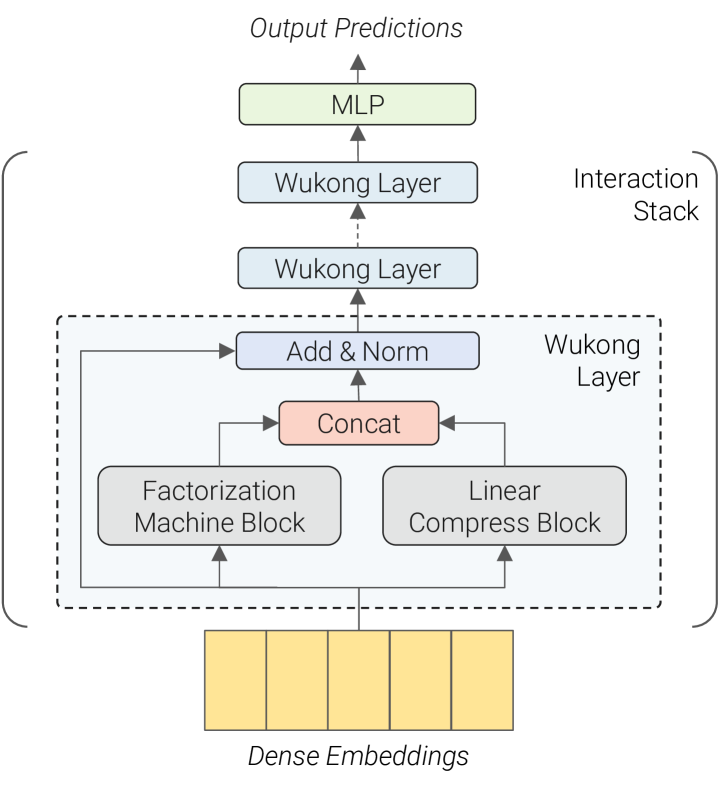
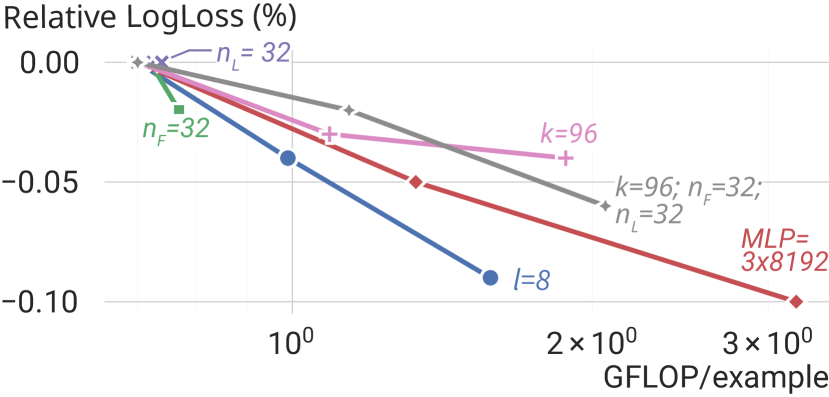
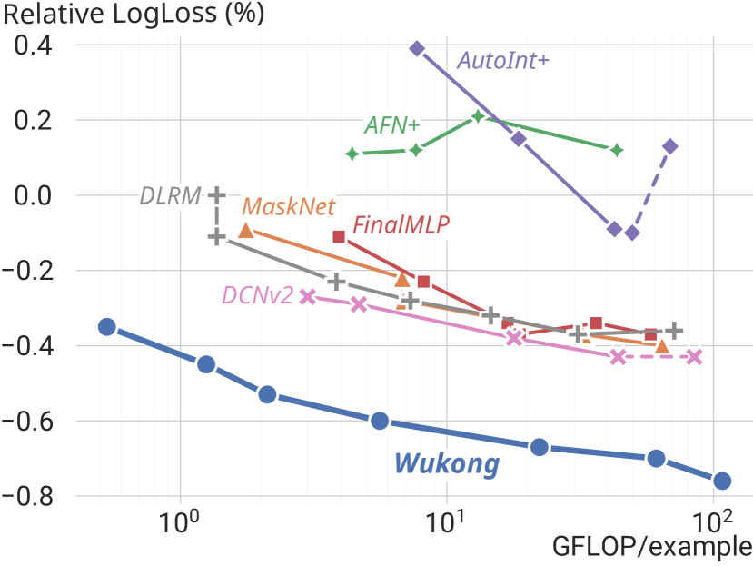
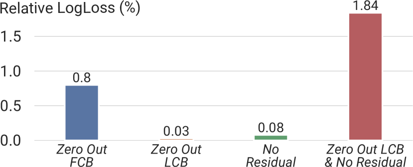

# Wukong: Towards a Scaling Law for Large-Scale Recommendation

Buyun Zhang, Liang Luo, Yuxin Chen, Jade Nie, Xi Liu, Daifeng Guo, Yanli Zhao, Shen Li, Yuchen Hao, Yantao Yao, Guna Lakshminarayanan, Ellie Dingqiao Wen, Jongsoo Park, Maxim Naumov, Wenlin Chen. Meta Platforms, Inc. arXiv 2403.02545, March 2024.

| Dimension | Prior State | This Paper |
|---|---|---|
| Scaling behavior | Models plateau (DLRM at ~31 GFLOP/example); no established scaling law for recommendation | Power-law scaling maintained across two orders of magnitude (up to 100+ GFLOP/example, ~637B parameters) |
| Interaction order | Fixed depth → limited order; FM captures order 2; xDeepFM/DCN capture higher orders but plateau | Stacked FMBs: layer $l$ captures interactions up to order $2^l$ (exponential growth via depth) |
| Architecture | Homogeneous stacking of MLP or single interaction module (DLRM, DCNv2, xDeepFM) | Dual-block layers: FM Block (explicit interactions) + Linear Compression Block (embedding recombination) |
| Compute efficiency | DCNv2 requires 40× more compute to match Wukong's quality | Optimized FM reduces O(n²d) → O(nkd) via low-rank projection; total O(ndh log n + h²) |
| Public benchmarks | MaskNet best on KuaiVideo (0.7376 AUC); DCNv2 best on TaobaoAds (0.6457 AUC) | State-of-the-art on all 6 public datasets tested |

## Table of Contents

- [[#1. Motivation and Background|1. Motivation and Background]]
  - [[#1.1 The Scaling Gap in Recommendation|1.1 The Scaling Gap in Recommendation]]
  - [[#1.2 Limitations of Prior Interaction Modules|1.2 Limitations of Prior Interaction Modules]]
  - [[#1.3 Research Lineage: DHEN to Wukong|1.3 Research Lineage: DHEN to Wukong]]
- [[#2. Architecture|2. Architecture]]
  - [[#2.1 Embedding Layer|2.1 Embedding Layer]]
  - [[#2.2 Factorization Machine Block|2.2 Factorization Machine Block]]
  - [[#2.3 Linear Compression Block|2.3 Linear Compression Block]]
  - [[#2.4 Interaction Stack and Residual Update|2.4 Interaction Stack and Residual Update]]
  - [[#2.5 Output Layer|2.5 Output Layer]]
- [[#3. Theory: Exponential Interaction Orders|3. Theory: Exponential Interaction Orders]]
  - [[#3.1 Order Definitions|3.1 Order Definitions]]
  - [[#3.2 Inductive Proof|3.2 Inductive Proof]]
- [[#4. Complexity Analysis|4. Complexity Analysis]]
- [[#5. Scaling Strategy and Hyperparameters|5. Scaling Strategy and Hyperparameters]]
- [[#6. Experiments|6. Experiments]]
  - [[#6.1 Public Dataset Benchmarks|6.1 Public Dataset Benchmarks]]
  - [[#6.2 Industrial-Scale Validation|6.2 Industrial-Scale Validation]]
  - [[#6.3 Ablation Studies|6.3 Ablation Studies]]
- [[#7. Training System Design|7. Training System Design]]
- [[#8. Relation to HSTU and Broader Context|8. Relation to HSTU and Broader Context]]
- [[#9. References|9. References]]

---

## 1. Motivation and Background

### 1.1 The Scaling Gap in Recommendation

Language models exhibit a well-studied *scaling law*: loss decreases as a power of compute, $L \propto C^{-\alpha}$, enabling confident prediction of model quality before training. This property has driven massive investment in LLMs. Recommendation systems, which arguably have equal commercial importance (hundreds of billions in ad revenue), lack an equivalent. Prior work found that recommendation models *plateau*: adding parameters beyond a threshold yields diminishing returns, and baselines like DLRM saturate at roughly 31 GFLOP/example on large internal datasets.

The core question Wukong addresses is: *is the plateau a fundamental property of recommendation problems, or an architectural artifact?*

The answer is the latter. Wukong demonstrates that the right architecture — one capable of systematically generating richer feature interactions as model size grows — can exhibit a clean power-law scaling relationship across two orders of magnitude in compute.

### 1.2 Limitations of Prior Interaction Modules

The taxonomy of interaction modules in recommendation:

| Model | Interaction Mechanism | Max Order | Key Limitation |
|---|---|---|---|
| FM | Pairwise dot products $\langle \mathbf{v}_i, \mathbf{v}_j \rangle$ | 2 | Shallow; only second-order |
| DeepFM | FM + MLP in parallel | 2 (explicit) | MLP captures implicit, uncontrolled order |
| DCNv2 | Cross network $\mathbf{x}^{(l+1)} = \mathbf{x}_0 (\mathbf{x}^{(l)})^\top \mathbf{w} + \mathbf{b} + \mathbf{x}^{(l)}$ | $l+1$ after $l$ layers | Linear order growth with depth |
| xDeepFM | Compressed Interaction Network | $l+1$ after $l$ layers | Same; linear order growth |
| AutoInt | Self-attention on embeddings | Implicit | Attention doesn't guarantee higher-order; MLP-dependent |
| DLRM | Dot product + MLP | 2 (explicit) | Plateaus; MLP doesn't systematically scale |

The fundamental issue: linear depth → linear interaction order. To reach 16th-order interactions you need 16 explicit cross/FM layers. Wukong breaks this barrier.

### 1.3 Research Lineage: DHEN to Wukong

Wukong comes from the same Meta Ads team as *DHEN* (Deep and Hierarchical Ensemble Network, KDD 2022). DHEN established that *heterogeneous* interaction modules (self-attention, DCN, convolution, linear) arranged in a hierarchical ensemble outperform any single module type. The insight was architectural diversity, not depth alone.

Wukong takes the next step: rather than ensemble diversity, it achieves quality and scale through *systematic interaction order growth*. Specifically, it abandons the heterogeneous ensemble in favor of a single principled operation — factorization machines — stacked in a way that generates exponentially higher-order interactions. The result is a simpler, more scalable architecture.

---

## 2. Architecture

### 2.1 Embedding Layer

All input features — both categorical (user ID, item ID, category) and dense (age, price) — are mapped to a *global embedding dimension* $d$. Let $n$ be the total number of feature embeddings after this transformation. The embedding layer outputs:

$$X_0 \in \mathbb{R}^{n \times d}$$

Each row $\mathbf{x}_i \in \mathbb{R}^d$ is a single feature embedding. Dense features are projected by a learned linear map to match dimension $d$; categorical features use a standard embedding table lookup.

**Motivation:** A uniform representation space is critical for the FM operation, which computes dot products between embedding pairs. Without a common dimension, cross-feature dot products are undefined. The unified embedding matrix $X_0$ also enables the LCB to linearly recombine across all features without type-specific handling.

### 2.2 Factorization Machine Block

The *Factorization Machine Block* (FMB) is the primary interaction generator. It explicitly computes pairwise dot products between all feature embeddings, processes them through an MLP, and outputs a new set of embeddings:

$$\text{FMB}(X_i) = \text{reshape}\!\left(\text{MLP}\!\left(\text{LN}\!\left(\text{flatten}\!\left(\text{FM}(X_i)\right)\right)\right)\right)$$

**The FM operation.** For input $X_i \in \mathbb{R}^{n_i \times d}$, the standard FM computes all pairwise inner products:

$$\text{FM}(X_i) = X_i X_i^\top \in \mathbb{R}^{n_i \times n_i}$$

Entry $(j, k)$ is $\langle \mathbf{x}_j, \mathbf{x}_k \rangle$, capturing the interaction between feature $j$ and feature $k$.

**Optimized FM with low-rank projection.** The naive computation costs $O(n_i^2 d)$. Instead, Wukong introduces a learnable projection $Y \in \mathbb{R}^{n_i \times k}$ with $k \ll n_i$ and computes:

$$\text{FM}_{\text{opt}}(X_i) = X_i X_i^\top Y \in \mathbb{R}^{n_i \times k}$$

By associativity, this is computed as $X_i \cdot (X_i^\top Y)$. The inner product $X_i^\top Y \in \mathbb{R}^{d \times k}$ costs $O(n_i d k)$; then $X_i \cdot (X_i^\top Y) \in \mathbb{R}^{n_i \times k}$ costs $O(n_i d k)$. Total: $O(n_i d k)$ vs $O(n_i^2 d)$.

**Post-FM processing.** The $n_i \times k$ matrix is flattened to a vector of length $n_i k$, layer-normalized, and passed through an MLP. The MLP output is then reshaped into $n_F$ new embeddings each of dimension $d$:

$$\text{FMB}(X_i) \in \mathbb{R}^{n_F \times d}$$

**Motivation for FMB:** The MLP after the FM serves a different purpose than in DLRM-style models. In DLRM, MLPs are used to *implicitly* capture interactions from concatenated features. In Wukong, the MLP transforms *explicitly computed* pairwise interactions into new embeddings, which then serve as inputs to the next layer's FM. This is the mechanism that drives exponential interaction order growth.

### 2.3 Linear Compression Block

The *Linear Compression Block* (LCB) recombines embeddings linearly, without generating new interactions:

$$\text{LCB}(X_i) = W_L X_i \in \mathbb{R}^{n_L \times d}$$

where $W_L \in \mathbb{R}^{n_L \times n_i}$ is a learned weight matrix. This is simply a linear projection that reduces (or changes) the number of embeddings from $n_i$ to $n_L$.

**Motivation for LCB:** The LCB serves two roles:

1. **Dimensionality control.** As interactions accumulate across layers, $n_i$ could grow without bound. The LCB projects back to $n_L$ embeddings, keeping the per-layer computation budget fixed.
2. **Gradient and residual flow.** The LCB provides a *linear pathway* from layer $i$ to layer $i+1$. This is analogous to the skip connection in ResNets: it ensures that gradient signals from the loss can flow back through the stack without passing through the nonlinear FM. The ablation study (Section 6.3) confirms that removing both the LCB and the residual simultaneously causes a "substantial degradation" — much larger than either alone.

### 2.4 Interaction Stack and Residual Update

The interaction stack consists of $l$ identical layers, each applying FMB and LCB in parallel and combining their outputs with a residual connection:

$$X_{i+1} = \text{LN}\!\left(\text{concat}\!\left(\text{FMB}_i(X_i),\ \text{LCB}_i(X_i)\right) + X_i\right)$$

The concatenation produces $n_F + n_L$ new embeddings. The residual $+ X_i$ (padded to match dimensions) ensures preservation of lower-order interactions from earlier layers. Layer normalization stabilizes training across deep stacks.

**Motivation for stacking:** Each additional layer doubles the maximum interaction order (proven in Section 3). Stacking is the mechanism by which Wukong achieves scalability: increasing $l$ does not just add more parameters, it expands the *expressivity* of the model in a principled, quantifiable way.

*Figure 2 (Zhang et al., 2024): The Wukong architecture. Dense embeddings feed into a stack of Wukong Layers, each consisting of a Factorization Machine Block (FMB) and a Linear Compression Block (LCB) applied in parallel, combined via concatenation and a residual Add & Norm. A final MLP produces the output prediction.*

### 2.5 Output Layer

After $l$ interaction layers, the final embedding matrix $X_l \in \mathbb{R}^{n_l \times d}$ is flattened and passed through a final MLP to produce a scalar prediction (click probability):

$$\hat{y} = \text{sigmoid}\!\left(\text{MLP}_{\text{out}}\!\left(\text{flatten}(X_l)\right)\right)$$

---

## 3. Theory: Exponential Interaction Orders

### 3.1 Order Definitions

Define the *interaction order* of a feature representation as the maximum number of original input features whose values multiply together in any single component. Concretely:

- A raw embedding $\mathbf{x}_i$ has order 1.
- The inner product $\langle \mathbf{x}_j, \mathbf{x}_k \rangle$ has order 2 (involves $\mathbf{x}_j$ and $\mathbf{x}_k$).
- An embedding derived from $\langle \mathbf{z}_{j}, \mathbf{z}_k \rangle$ where $\mathbf{z}_j, \mathbf{z}_k$ are themselves order-2 embeddings has order $2 + 2 = 4$.

More precisely, for two embeddings $\mathbf{u}$ and $\mathbf{v}$ of orders $o_1$ and $o_2$ respectively, their inner product $\langle \mathbf{u}, \mathbf{v} \rangle$ has order $o_1 + o_2$.

### 3.2 Inductive Proof

**Claim.** After layer $i$ of the interaction stack (zero-indexed), the embedding matrix $X_i$ contains feature representations with orders ranging from 1 to $2^i$.

**Base case ($i = 0$).** The input $X_0$ contains raw embeddings of order 1.

**Inductive step.** Assume $X_i$ contains orders from 1 to $2^i$.

- The **LCB** applies a linear combination: $\text{LCB}(X_i) = W_L X_i$. Linear combination preserves interaction order (no new products are formed), so LCB output contains orders 1 to $2^i$.
- The **FM** computes all pairwise inner products of rows of $X_i$. A pair of rows with orders $o_1$ and $o_2$ produces an order-$(o_1 + o_2)$ interaction. With $o_1, o_2 \in [1, 2^i]$, the FM can produce orders up to $2^i + 2^i = 2^{i+1}$.
- **MLP** inside FMB is a nonlinear transformation of the FM outputs, but it does not combine distinct feature chains — it transforms existing interactions into new embedding vectors. Thus FMB outputs contain orders from 1 (trivially, via bias terms) to $2^{i+1}$.
- The **concat + residual** combines LCB (orders $\leq 2^i$) and FMB (orders $\leq 2^{i+1}$), so $X_{i+1}$ contains orders from 1 to $2^{i+1}$.

**Conclusion.** After $l$ layers, $X_l$ contains interactions up to order $2^l$.

**Significance.** Compare with DCNv2 or xDeepFM, where $l$ layers yield at most order $l+1$. With Wukong's stacking:

| Depth $l$ | Wukong max order | DCNv2/xDeepFM max order |
|---|---|---|
| 1 | 2 | 2 |
| 2 | 4 | 3 |
| 4 | 16 | 5 |
| 8 | 256 | 9 |

**This exponential scaling of expressivity is the key mechanism enabling Wukong's scaling law.** As the model grows (more layers, wider MLPs), it does not merely add parameters — it gains access to qualitatively richer feature combinations.

*Figure 5 (Zhang et al., 2024): Scaling individual Wukong hyperparameters on the industrial dataset. Increasing the number of layers $l$ (depth) yields the steepest improvement per compute dollar — consistent with the theory that each layer doubles the maximum interaction order. Increasing $n_F$, $k$, or MLP width also helps but with diminishing returns at higher compute budgets.*

---

## 4. Complexity Analysis

Let $h$ be the largest fully-connected layer size in the FMB MLP, and $n'= n_F + n_L$ be the total output embeddings per layer.

**FMB cost (per layer):**
- Optimized FM: $O(n_i \cdot d \cdot k)$ where $k \ll n_i$. Since $k \sim n_i$ is bounded and $n_i \approx n'$, this is $O(n'd) \approx O(ndh)$ for proportional dimensions.
- MLP on flattened FM output: input size $n_i k \approx n'k$, output size $n_F d$; for MLP with hidden size $h$: $O(n'kh + h^2 + n_F dh) \approx O(ndh + h^2)$.

**LCB cost (per layer):** $O(n_i \cdot n_L \cdot d) \approx O(ndh)$.

**Across $l$ layers:** Since $n_i$ grows slowly (bounded by $n' = n_F + n_L$ per layer), and the depth is $l \approx \log_2(n)$ to cover order $n$:

$$\text{Total cost} = O\!\left(ndh \log n + h^2\right)$$

This near-linear scaling in $n$ (with a $\log n$ factor) is much better than a naive FM which would cost $O(n^2 d)$ to compute all pairwise interactions.

---

## 5. Scaling Strategy and Hyperparameters

Wukong exposes five primary scaling knobs:

| Hyperparameter | Symbol | Description | Scaling impact |
|---|---|---|---|
| Number of layers | $l$ | Depth of interaction stack | Doubles max interaction order per +1 layer |
| FMB output embeddings | $n_F$ | Rows output by FMB per layer | Increases interaction branching factor |
| LCB output embeddings | $n_L$ | Rows output by LCB per layer | Controls linear pathway width |
| FM projection dim | $k$ | Low-rank projection in optimized FM | Trades interaction fidelity for compute |
| MLP configuration | $h$ | Hidden size and depth in FMB MLP | Controls transformation capacity |

The scaling law is demonstrated by varying all five jointly according to a compute budget. At fixed dataset size (146B samples, 720 features), Wukong exhibits:

$$\text{AUC improvement} \propto C^\alpha \quad \text{for } C \in [1 \text{ GFLOP}, 100+\text{ GFLOP per example}]$$

where the exponent $\alpha$ is empirically stable across two orders of magnitude. This power-law relationship is analogous to the Chinchilla scaling law for LLMs.

**Contrast with baselines:** DCNv2, the strongest baseline, requires a *40-fold increase in compute* to reach the quality level that Wukong achieves at 1× compute. DLRM plateaus entirely around 31 GFLOP/example.

*Figure 1 (Zhang et al., 2024): The Wukong scaling law on the industrial dataset (146B samples, 720 features). Wukong (blue) follows a clean power-law across two orders of magnitude in GFLOP/example. All baselines — including DCNv2, MaskNet, and FinalMLP — plateau or degrade at higher compute budgets. DLRM saturates earliest, around 31 GFLOP/example.*

---

## 6. Experiments

### 6.1 Public Dataset Benchmarks

Evaluated on 6 public datasets against 7 baselines (AFN+, AutoInt+, DCNv2, DLRM, FinalMLP, MaskNet, xDeepFM):

| Dataset | Wukong AUC | Best Baseline (model) | $\Delta$ AUC |
|---|---|---|---|
| Frappe | 0.9868 | 0.9868 (FinalMLP) | 0.0000 |
| MicroVideo | 0.7292 | 0.7255 (MaskNet) | +0.0037 |
| MovieLens | 0.9723 | 0.9723 (FinalMLP) | 0.0000 |
| KuaiVideo | 0.7414 | 0.7376 (MaskNet) | +0.0038 |
| TaobaoAds | 0.6488 | 0.6457 (DCNv2) | +0.0031 |
| Criteo | 0.8106 | 0.8100 (MaskNet) | +0.0006 |

Wukong achieves state-of-the-art or ties the best model on all six datasets.

### 6.2 Industrial-Scale Validation

**Dataset:** 146B samples, 720 features (Meta internal). Models trained with identical data budgets; quality measured by relative LogLoss improvement over a fixed baseline.

Key findings:

- Wukong outperforms all baselines by **~0.2% relative LogLoss** consistently across all model scales.
- Wukong scales continuously from ~1 to 100+ GFLOP/example; baselines plateau far earlier.
- At maximum scale, Wukong reaches **637 billion parameters** with total training compute equivalent to GPT-3 scale (2336 PF-days).
- DCNv2, the best scaling baseline, requires 40× more compute to reach the same quality as Wukong.

### 6.3 Ablation Studies

The paper performs component-level ablations (Figure 4):

| Variant | Quality impact |
|---|---|
| Full Wukong | Baseline (best) |
| Remove FMB | Large degradation — FMB is the primary interaction source |
| Remove LCB | Modest decline |
| Remove residual | Modest decline |
| Remove both LCB and residual | Substantial degradation — both provide critical gradient flow |

*Notably*, removing only LCB or only the residual has modest impact, but removing both simultaneously causes large degradation. This is because they serve as complementary linear pathways: LCB recombines embeddings at the layer level while the residual preserves the identity map. Together, they ensure that lower-order information is not "overwritten" by the FM's high-order outputs.

*Figure 4 (Zhang et al., 2024): Component ablation on the industrial dataset. Zeroing out the FMB causes the largest single-component degradation (0.8% relative LogLoss), confirming it as the primary interaction source. Removing LCB alone (0.03%) or the residual alone (0.08%) has modest impact, but removing both together causes 1.84% degradation — more than twice the FMB removal — demonstrating that LCB and residual are complementary linear pathways.*

---

## 7. Training System Design

Wukong's scale (hundreds of billions of parameters) requires several systems innovations:

- **Column-wise sharded embedding bags:** Embedding tables are sharded across devices along the column dimension, distributing memory across GPUs.
- **FSDP for dense parameters:** Fully Sharded Data Parallel handles the dense layers (FMB MLPs, LCBs), sharding gradients and optimizer states across the data parallel dimension.
- **Operator fusion via `torch.fx`:** Automatic graph rewriting fuses operations (e.g., LN + flatten + FM) to reduce memory bandwidth.
- **Mixed precision:** FP16 for embedding lookups (memory-bound), BF16 for gradients (stability).

---

## 8. Relation to HSTU and Broader Context

See [[hstu|HSTU Note]] for full analysis. Briefly: Wukong and HSTU are near-simultaneous publications from Meta (both early 2024) addressing the *same gap* (no scaling law for recommendation) via *different paradigms*:

- **Wukong** treats recommendation as a static *ranking problem over dense features*. It scales by deepening and widening the FM-based interaction stack.
- **HSTU** treats recommendation as a *sequential transduction problem* over user behavior history. It scales by growing the Transformer-like architecture over longer sequences.

Together they suggest that the absence of scaling laws in prior recommendation systems was entirely an architectural artifact — not a fundamental limit of the task.

---

## 9. References

| Reference Name | Brief Summary | Link |
|---|---|---|
| Wukong: Towards a Scaling Law for Large-Scale Recommendation | Main paper: FM-stack architecture with power-law scaling | https://arxiv.org/abs/2403.02545 |
| DHEN: A Deep and Hierarchical Ensemble Network | Precursor from same Meta team; heterogeneous interaction ensemble | https://arxiv.org/abs/2203.11014 |
| Scaling Laws for Neural Language Models (Kaplan et al.) | Original LLM scaling law establishing $L \propto C^{-\alpha}$ | https://arxiv.org/abs/2001.08361 |
| DCNv2: Improved Deep & Cross Network | Strong baseline; cross-network with linear interaction-order growth | https://arxiv.org/abs/2008.13535 |
| DeepFM: A Factorization-Machine based Neural Network | FM + MLP baseline | https://arxiv.org/abs/1703.04247 |
| xDeepFM: Combining Explicit and Implicit Feature Interactions | CIN-based explicit interaction; linear order growth | https://arxiv.org/abs/1803.05170 |
| DLRM: An Advanced, Open Source Deep Learning Recommendation Model | Meta's production DLRM baseline | https://arxiv.org/abs/1906.00091 |
| FinalMLP: An Enhanced Two-Stream MLP Model for CTR Prediction | Strong public-dataset baseline | https://arxiv.org/abs/2304.00902 |
| Chinchilla: Training Compute-Optimal Large Language Models | Compute-optimal scaling laws | https://arxiv.org/abs/2203.15556 |
