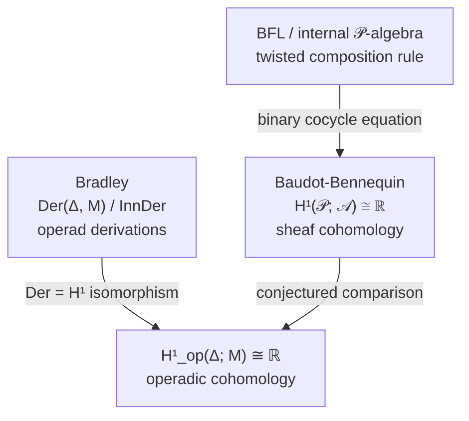

# Entropy as an Operad Derivation

## Sources

| Source | Type | Key Contribution | Link |
|--------|------|-----------------|------|
| [Bradley (2021)](https://arxiv.org/abs/2107.09581) | paper | Shannon entropy is a derivation of the operad of topological simplices; every such derivation is proportional to $H$ | arXiv:2107.09581 |
| [Bradley, "Entropy, Algebra, and Topology" (2021)](https://www.math3ma.com/blog/entropy-algebra-topology) | blog | Expository companion to the paper; emphasizes $D(x) = -x\log x$ as the fundamental derivation | math3ma.com |
| [Baez, Fritz & Leinster (2011)](https://arxiv.org/abs/1106.1791) | paper | Entropy as unique functor on $\mathbf{FinProb}$; internal $\mathcal{P}$-algebra characterization | arXiv:1106.1791 |
| [Baudot & Bennequin (2015)](https://www.mdpi.com/1099-4300/17/5/3253) | paper | Entropy as 1-cocycle in information cohomology | *Entropy* 17(5) |

See also [[research/categorical-entropy|Categorical Entropy]] for the BFL / cohomological approaches this thread extends.

---

## Context and Motivation

The [[research/categorical-entropy|Categorical Entropy]] note records two characterizations of Shannon entropy on the operad $\mathcal{P}$ of probability distributions:

1. **Internal $\mathcal{P}$-algebra** (Baez blog / Leinster): entropy is the unique continuous family $\alpha_n: \mathcal{P}(n) \to \mathbb{R}$ satisfying the *twisted composition rule*
$$\alpha(p \circ (q_1, \ldots, q_n)) = \alpha(p) + \textstyle\sum_i p_i\, \alpha(q_i).$$

2. **1-Cocycle** (Baudot-Bennequin): the chain rule is the cocycle condition $\delta H = 0$.

Bradley (2021) adds a third, structurally distinct characterization: entropy is an **operad derivation** satisfying a *Leibniz rule* for operadic composition. The math3ma blog notes that this unifies all three perspectives under the slogan: *entropy behaves like "d of something" under appropriate (co)boundary operators*.

---

## The Operad of Topological Simplices

![[research/figures/bradley-simplices.jpg]]
*The topological simplices $\Delta^0, \Delta^1, \Delta^2$ that form the arity components of $\boldsymbol{\Delta}$.*

The setting is the topological operad $\boldsymbol{\Delta}$ with:

- **Arity-$n$ operations:** $\boldsymbol{\Delta}(n) = \Delta^{n-1}$, the standard $(n-1)$-simplex of probability distributions on $n$ outcomes.
- **Operadic composition** $\circ_i$: given $p = (p_1, \ldots, p_n) \in \boldsymbol{\Delta}(n)$ and $q = (q_1, \ldots, q_m) \in \boldsymbol{\Delta}(m)$, the substitution at position $i$ gives

$$p \circ_i q = (p_1, \ldots, p_{i-1},\ p_i q_1,\ \ldots,\ p_i q_m,\ p_{i+1},\ \ldots, p_n) \in \boldsymbol{\Delta}(n+m-1).$$

This *substitutes* $q$ into the $i$-th slot of $p$, scaling $q$'s entries by $p_i$. The full operadic composition $p \circ (q_1, \ldots, q_n)$ substitutes simultaneously at all positions, giving the joint distribution — recovering the chain rule composition from [[research/categorical-entropy|Categorical Entropy]].

---

## Operad Derivations

### Bimodules over an operad

To define a derivation of $\boldsymbol{\Delta}$, one needs a target — a *bimodule* over $\boldsymbol{\Delta}$. An **abelian bimodule** $M$ over an operad $\mathcal{O}$ consists of:

- Objects $M(n)$ for each arity $n$
- **Left actions** $\circ_i^L: \mathcal{O}(n) \times M(m) \to M(n+m-1)$ — composing an operation into a bimodule element from the left
- **Right actions** $\circ_i^R: M(n) \times \mathcal{O}(m) \to M(n+m-1)$ — composing a bimodule element into an operation from the right

satisfying associativity axioms mirroring those of $\mathcal{O}$ itself.

### The bimodule of continuous functions

Bradley's key example: take $M(n) = C(\mathbb{R}^n, \mathbb{R})$, continuous functions $\mathbb{R}^n \to \mathbb{R}$, with bimodule actions:

$$\bigl(p \circ_i^L f\bigr)(x_1, \ldots, x_{n+m-1}) = p_i \cdot f(x_i, \ldots, x_{i+m-1})$$

$$\bigl(g \circ_i^R q\bigr)(x_1, \ldots, x_{n+m-1}) = g\!\bigl(x_1, \ldots, x_{i-1},\ \langle q,\, (x_i, \ldots, x_{i+m-1})\rangle,\ x_{i+m},\ldots\bigr)$$

where $\langle q, v \rangle = \sum_j q_j v_j$ is the dot product. The left action scales $f$ by $p_i$; the right action replaces a block of arguments by their $q$-weighted average.

### The Leibniz rule

A **derivation** of $\boldsymbol{\Delta}$ with values in bimodule $M$ is a continuous family $d = \{d_n : \boldsymbol{\Delta}(n) \to M(n)\}$ satisfying the **Leibniz rule:**

$$d(p \circ_i q) = d(p) \circ_i^R q\ +\ p \circ_i^L d(q).$$

This is the operadic analogue of $\partial(fg) = \partial(f)\cdot g + f \cdot \partial(g)$: the derivation of a composite is "derivative of the outside times inside plus outside times derivative of the inside."

---

## Shannon Entropy as a Derivation

### The fundamental derivation $D$

The starting point is the function $D: [0,1] \to \mathbb{R}$ defined by

$$D(x) = -x\log x \qquad (D(0) := 0).$$

![[research/figures/bradley-derivation-D.jpeg]]
*The Leibniz rule $D(xy) = xD(y) + yD(x)$ for $D(x) = -x\log x$.*

$D$ satisfies a *classical* Leibniz rule for multiplication:

$$D(xy) = x\, D(y) + y\, D(x).$$

*Verification:* $D(xy) = -xy\log(xy) = -xy\log x - xy\log y = y(-x\log x) + x(-y\log y) = y\,D(x) + x\,D(y)$. ✓

Shannon entropy is built from $D$ pointwise: $H(p_1, \ldots, p_n) = \sum_i D(p_i)$.

### Main theorem

![[research/figures/bradley-main-theorem.jpg]]

**Theorem (Bradley 2021).** Shannon entropy $H$ defines a derivation of $\boldsymbol{\Delta}$ with values in the bimodule $M = C(\mathbb{R}^-, \mathbb{R})$. Moreover, every derivation of $\boldsymbol{\Delta}$ with values in this bimodule is, at each point, a constant multiple of $H$.

The proof proceeds by showing that the Leibniz rule for $d$ on $\boldsymbol{\Delta}$, when unpacked via the bimodule actions, reduces to a functional equation for $d_n$ that is solved uniquely (up to scalar) by $H$. The key step: the Leibniz rule forces $d_n(p_1, \ldots, p_n) = \sum_i f(p_i)$ for some function $f: [0,1] \to \mathbb{R}$ satisfying $f(xy) = xf(y) + yf(x)$ — i.e., $f = D$ up to scalar.

![[research/figures/bradley-proof.jpg]]
*Proof sketch from Bradley (2021, p. 9): the Leibniz rule forces $d_n(p) = \sum_i f(p_i)$ where $f$ satisfies a classical derivation equation.*

> [!NOTE] "At each point" vs. "globally"
> The theorem says every derivation equals $cH$ *at each point*, with the constant $c$ potentially varying. This is slightly weaker than the BFL theorem, which forces a single global constant. Bradley notes this gap and it is not fully closed in the paper.

---

## Comparison: Three Characterizations

The same object — Shannon entropy on the simplex operad $\boldsymbol{\Delta}$ — admits three distinct algebraic characterizations:

| Framing | Structure | Condition on $H$ | Uniqueness |
|---------|-----------|-----------------|------------|
| **Internal $\mathcal{P}$-algebra** (BFL / Baez blog) | Operad algebra map | Twisted composition: $\alpha(p \circ \mathbf{q}) = \alpha(p) + \sum_i p_i \alpha(q_i)$ | Global: $c \cdot H$ for fixed $c$ |
| **1-Cocycle** (Baudot-Bennequin) | Sheaf cohomology | Cocycle condition: $\delta H = 0$ | $H^1 \cong \mathbb{R}$, unique up to scalar |
| **Operad derivation** (Bradley) | Operad bimodule derivation | Leibniz rule: $d(p \circ_i q) = d(p) \circ^R q + p \circ^L d(q)$ | Pointwise: $c(x) \cdot H$ at each $x$ |

The twisted composition rule and the Leibniz rule are **not the same condition** — they come from different algebraic structures (algebra map vs. derivation). The fact that entropy satisfies both is an indication that it sits at an unusual intersection.

The unifying slogan from the math3ma blog: *entropy behaves like "d of something" under any sensible (co)boundary operator you put on probability distributions.* The three framings are three different choices of what "boundary" means.

> [!QUESTION] Are the three characterizations equivalent?
> The internal $\mathcal{P}$-algebra axiom and the 1-cocycle condition are known to be equivalent (via the binary cocycle equation, see [[research/categorical-entropy|Categorical Entropy]]). Is the Bradley derivation condition also equivalent to these, or genuinely weaker (as the "pointwise" uniqueness suggests)? A precise comparison would require identifying a natural functor between the bimodule category of operad derivations and the sheaf category of Baudot-Bennequin.

> [!QUESTION] What is the "module of Kähler differentials" for $\boldsymbol{\Delta}$?
> In commutative algebra, derivations $R \to M$ are controlled by the module of Kähler differentials $\Omega_{R/k}$: there is a universal derivation $d: R \to \Omega_{R/k}$ through which all others factor. Is there an analogous *universal bimodule* $\Omega_{\boldsymbol{\Delta}}$ for operad derivations, and does Shannon entropy represent a universal class in it? If so, this would be a fourth characterization of $H$ — as a universal derivation — and would complete the analogy with de Rham cohomology.

---

## Operadic Cohomology and the Unification Conjecture

### What is operadic cohomology?

For an operad $\mathcal{O}$, an $\mathcal{O}$-algebra $A$, and a bimodule $M$ over $A$, the *operadic cohomology* $H^\bullet_\mathcal{O}(A, M)$ is computed by a cochain complex whose cochains are families of maps $\mathcal{O}(n) \otimes A^{\otimes n} \to M$ and whose coboundary encodes operadic composition. It specializes to all classical cohomology theories:

| Operad $\mathcal{O}$ | $H^\bullet_\mathcal{O}(A, M)$ |
|---|---|
| $\text{Ass}$ (associative) | Hochschild cohomology |
| $\text{Com}$ (commutative) | Harrison / André-Quillen cohomology |
| $\text{Lie}$ | Chevalley-Eilenberg cohomology |

The key universal fact across all cases is the **derivation isomorphism:**

$$H^1_\mathcal{O}(A, M) \cong \mathrm{Der}_\mathcal{O}(A, M) / \mathrm{InnDer}(A, M).$$

Outer derivations are exactly 1-cocycles. This is the operadic generalization of the classical Hochschild isomorphism $HH^1(A, M) = \mathrm{Der}(A, M)/\mathrm{InnDer}(A, M)$ for associative algebras.

The coboundary $\delta: C^0 \to C^1$ sends $m \in M$ to the *inner derivation* $\delta m(p) = p \circ^L m - m \circ^R p$. A 1-cocycle satisfies $\delta d = 0$, which unpacks precisely to the Leibniz rule for a derivation. So **the derivation condition IS the cocycle condition**, and the two are definitionally equivalent.

### Entropy sits in $H^1_\mathrm{op}(\boldsymbol{\Delta}; M)$

Bradley's result now reads in cohomological language: Shannon entropy $H$ represents a class

$$[H] \in H^1_\mathrm{op}(\boldsymbol{\Delta};\ M) \cong \mathrm{Der}(\boldsymbol{\Delta}, M) / \mathrm{InnDer}$$

and this class generates $H^1_\mathrm{op}(\boldsymbol{\Delta}; M) \cong \mathbb{R}$ (the pointwise uniqueness theorem is the statement that $H^1$ is one-dimensional).

This places all three characterizations of entropy in a single diagram:

The left vertical arrow is the classical $\mathrm{Der} = H^1$ isomorphism, which is definitional. The right arrow (BFL to Baudot-Bennequin) is the binary cocycle equation bridge already established. The top arrow — the comparison $H^1(\mathcal{P}; \mathcal{A}) \xrightarrow{\sim} H^1_\mathrm{op}(\boldsymbol{\Delta}; M)$ — is the open conjecture.

### The de Rham conjecture for information theory

🔑 **Conjecture.** There is a natural isomorphism

$$H^1(\mathcal{P};\ \mathcal{A}) \xrightarrow{\ \sim\ } H^1_\mathrm{op}(\boldsymbol{\Delta};\ M)$$

under which the Baudot-Bennequin cocycle $[H_\mathrm{Shannon}]$ maps to the Bradley derivation class $[H_\mathrm{Shannon}]$.

This would be the *information-theoretic de Rham theorem*: two cohomology theories — one sheaf-theoretic, one operadic — computing the same group $\mathbb{R}$, with entropy as the canonical generator of both.

**Why to expect this.** The operad $\boldsymbol{\Delta}$ is built from the probability simplices $\{\Delta^{n-1}\}$, which are the classifying spaces of the objects of $\mathcal{P}$ (finite probability spaces). The nerve $N\mathcal{P}$ of the category $\mathcal{P}$ should be homotopy equivalent to a realization of $\boldsymbol{\Delta}$, and the coefficient sheaf $\mathcal{A}$ and bimodule $M$ should correspond under the Grothendieck construction applied to this equivalence. A general comparison theorem of the form

$$H^\bullet(N\mathcal{C};\ \mathcal{F}) \cong H^\bullet_\mathrm{op}(\mathcal{O}_\mathcal{C};\ M_\mathcal{F})$$

for an operad $\mathcal{O}_\mathcal{C}$ arising from a small category $\mathcal{C}$ would give the result as a special case.

**Why $H^1$ and not higher degrees.** In any cohomology theory, $H^1$ is the home of *derivations* — maps satisfying a first-order Leibniz-type condition. Entropy is fundamentally a derivation ($D(xy) = xD(y) + yD(x)$), so it is structural that it lives in $H^1$. The uniqueness ($H^1 \cong \mathbb{R}$) reflects the one-dimensionality of the space of "entropy-like" derivations. Higher cohomology $H^n$ would classify higher-order deformation obstructions — which in the information-theory context should correspond to the higher mutual informations and interaction terms classified by Baudot-Bennequin's $H^n(\mathcal{P}; \mathcal{A})$.

> [!QUESTION] Is there a comparison theorem for operadic vs. categorical cohomology?
> For a small category $\mathcal{C}$ giving rise to an operad $\mathcal{O}_\mathcal{C}$ (via its nerve or classifying space), is there a general isomorphism $H^\bullet(N\mathcal{C}; \mathcal{F}) \cong H^\bullet_\mathrm{op}(\mathcal{O}_\mathcal{C}; M)$? The relevant machinery might be the *bar construction* for operads and the *Grothendieck construction* for sheaves on categories — both resolve cohomology via simplicial methods, suggesting a comparison spectral sequence at minimum.

> [!WARNING] Inner derivations
> The $H^1$ isomorphism is for *outer* derivations — derivations modulo inner ones. For the simplex operad $\boldsymbol{\Delta}$, it is not immediately clear what the inner derivations are, or whether they vanish. If $\mathrm{InnDer}(\boldsymbol{\Delta}, M) = 0$, then $H^1_\mathrm{op} = \mathrm{Der}$ exactly. Bradley's pointwise uniqueness result is consistent with this, but a proof that inner derivations vanish would sharpen the result.

---

## Open Questions

> [!QUESTION] 1. Closing the pointwise gap
> Bradley's theorem gives uniqueness "at each point" with a potentially varying constant. Is there an additional mild condition (e.g. measurability of $c(x)$, or a normalization condition) that forces $c$ to be globally constant, recovering the strength of BFL?

> [!QUESTION] 2. Kähler differentials for operads
> Does the operad $\boldsymbol{\Delta}$ have a well-defined module of Kähler differentials? Would its elements classify all "entropy-like" derivations, and could one read off Shannon entropy as the universal class?

> [!QUESTION] 3. Relationship to the cohomological picture
> Baudot-Bennequin treat entropy as a 1-cocycle in a sheaf cohomology. Bradley treats it as a derivation valued in a bimodule. In algebraic geometry, derivations and 1-forms are Kähler-dual: $\mathrm{Der}(R, M) \cong \mathrm{Hom}_R(\Omega_{R/k}, M)$. Is there an information-theoretic version of this duality, relating Bradley's bimodule $M$ to the coefficient module $\mathcal{A}$ of Baudot-Bennequin?
